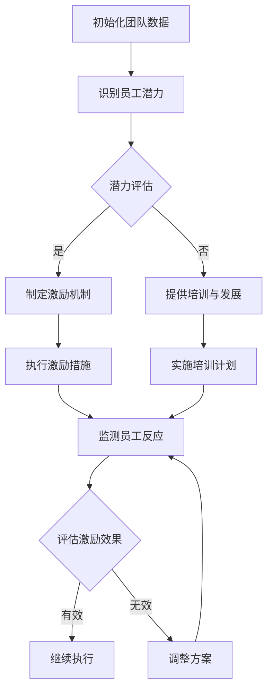
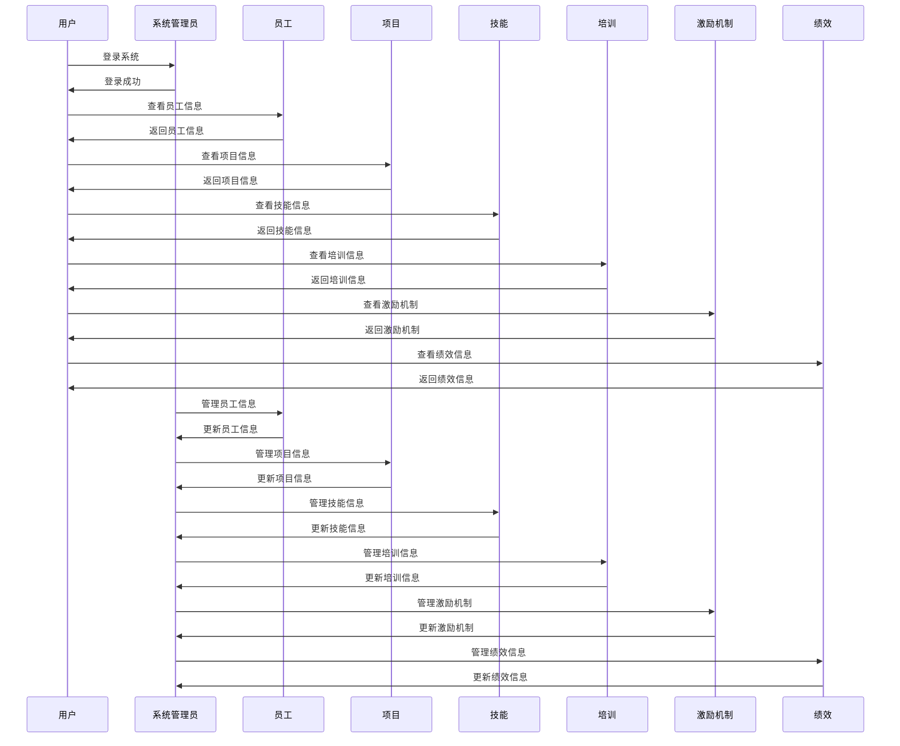
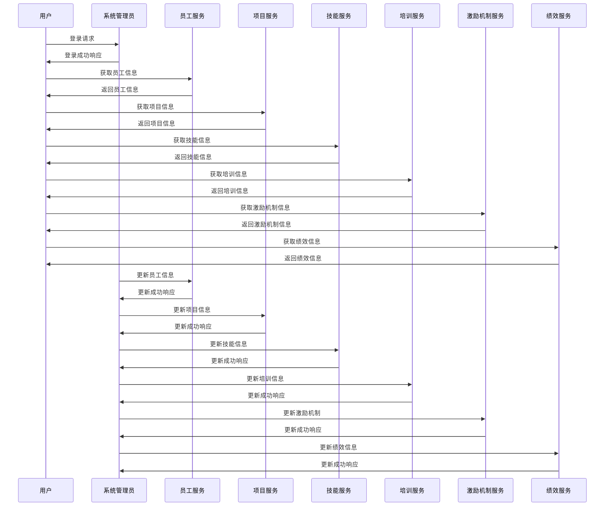

                 

### 1.1 问题背景

#### 1.1.1 团队效能提升的紧迫性

在当今快节奏且竞争激烈的市场环境中，团队效能的提升已经成为企业持续发展的关键因素。随着信息技术的迅猛发展和市场需求的不断变化，传统的管理模式和团队运作模式已经难以满足现代企业的需求。企业需要更加高效、灵活的团队来快速响应市场变化，推动创新，提高竞争力。

团队效能的提升不仅仅是一个管理问题，更是一个战略性问题。高效的团队能够更好地完成复杂项目，提高产品和服务质量，降低运营成本，从而为企业创造更大的价值。因此，团队效能提升的紧迫性不言而喻。

#### 1.1.2 团队潜能激发的必要性

团队潜能激发是指通过一系列方法和管理策略，挖掘和释放团队成员的内在潜力，提高团队的协作效率和工作质量。团队潜能激发的必要性体现在以下几个方面：

1. **提高员工积极性**：通过激发员工的潜能，可以增强他们对工作的热情和责任感，提高工作效率和质量。

2. **增强团队凝聚力**：团队潜能激发能够促进团队成员之间的沟通与协作，增强团队的凝聚力，形成更加和谐的工作氛围。

3. **推动团队创新**：潜能激发鼓励团队成员提出新的观点和解决方案，推动团队不断进行创新，适应市场变化。

4. **实现人才价值最大化**：通过挖掘和培养团队成员的潜能，可以更好地发挥人才的优势，实现人才价值最大化。

5. **提升企业竞争力**：一个高效的团队可以更快速地响应市场变化，推动企业持续创新，提高竞争力。

#### 1.1.3 问题解决

本书将提供一系列科学的团队潜能激发方法，旨在帮助企业管理者和团队成员挖掘团队的最大价值。这些方法包括但不限于：

- **构建科学的激励机制**：通过合理的薪酬和福利制度，激发员工的积极性和创造力。

- **提供有效的培训与发展机会**：通过培训和学习机会，提升员工的专业技能和综合素质。

- **建立良好的沟通与反馈机制**：通过定期交流和反馈，增强团队成员之间的沟通和理解。

- **营造积极的工作氛围**：通过企业文化建设和团队文化建设，营造一个积极向上、互助合作的工作氛围。

- **实施有效的项目管理**：通过科学的团队管理和项目管理方法，确保项目目标的顺利实现。

#### 1.1.4 团队潜能激发的边界与外延

虽然团队潜能激发对企业和团队有着重要的意义，但在实际应用中也需要明确其边界与外延：

- **团队规模**：本书主要针对中小型团队的潜能激发，对于大型团队，可能需要根据实际情况进行适当调整。

- **行业类型**：不同行业的特点和需求有所不同，团队潜能激发的方法也需要根据具体行业进行定制。

- **团队成熟度**：不同成熟度的团队可能需要不同的潜能激发方法，成熟度较高的团队可能更需要关注创新和变革。

#### 1.1.5 概念结构与核心要素组成

团队潜能激发的核心概念和要素包括：

- **员工潜力**：指员工内在的、未被完全开发的潜能。

- **团队协作**：指团队成员之间的相互配合和协作能力。

- **激励机制**：指用于激发员工积极性和创造力的各种激励措施。

- **培训与发展**：指员工通过学习和培训提升个人能力和职业发展。

- **沟通与反馈**：指团队成员之间的有效沟通和及时的反馈机制。

- **企业文化**：指企业的核心价值观和行为规范，对团队潜能激发有着重要影响。

通过以上分析，我们可以看到团队潜能激发的重要性及其在实际应用中的复杂性和多样性。本书将深入探讨这些概念和要素，提供实用的方法和策略，帮助企业和团队实现潜能的最大化释放。接下来，我们将进一步探讨团队潜能激发的理论基础和核心方法。

## 1.2 核心概念与联系

### 1.2.1 团队潜能激发的核心概念

在探讨团队潜能激发之前，我们需要明确几个核心概念。首先，“潜能”是指一个人或团队内在的、尚未完全开发的潜力，它包括了认知能力、创新能力、执行力等多个方面。而“激发”则是指通过一系列的方法和管理措施，将这种潜能挖掘和释放出来。

#### 团队潜能

团队潜能是指一个团队在特定环境下的整体能力，包括成员的技能、知识、经验、协作能力和创新能力等。团队潜能不仅取决于个体的能力，更取决于团队成员之间的互动和协作。

#### 潜能激发

潜能激发是一种管理策略，旨在通过多种方式激活团队成员的潜能，从而提高团队的整体效能。潜能激发可以采取多种形式，包括激励、培训、沟通、文化建设等。

### 1.2.2 团队潜能激发的关键要素

要实现团队潜能的最大化释放，需要关注以下几个关键要素：

1. **员工潜力**：员工潜力是团队潜能激发的基础。识别和培养员工的潜力，是激发团队潜能的第一步。

2. **激励机制**：有效的激励机制能够激发员工的积极性和创造力，是潜能激发的重要手段。

3. **沟通与反馈**：良好的沟通和反馈机制能够促进团队成员之间的理解和协作，是潜能激发的保障。

4. **培训与发展**：持续的学习和培训能够提升员工的专业能力和综合素质，是潜能激发的持续动力。

5. **企业文化**：积极向上的企业文化能够营造一个有利于潜能激发的工作环境，是潜能激发的土壤。

6. **项目管理**：科学的团队管理方法能够确保团队目标的实现，是潜能激发的具体实施手段。

### 1.2.3 团队潜能激发与团队管理的关系

团队潜能激发是团队管理的一个重要组成部分，它与团队管理有着密切的关系。有效的团队管理可以为团队潜能激发提供良好的环境和条件，而团队潜能激发则是团队管理效果的体现。

#### 团队管理对潜能激发的影响

1. **激励制度**：团队管理中的激励制度可以激励员工的积极性和创造力，从而激发团队潜能。

2. **培训与发展**：团队管理中的培训与发展计划能够提升员工的能力和素质，为潜能激发提供基础。

3. **沟通与协作**：团队管理中的良好沟通和协作机制能够促进团队成员之间的理解和合作，有助于潜能激发。

4. **项目管理**：团队管理中的科学项目管理方法能够确保团队目标的实现，为潜能激发提供实践平台。

#### 团队潜能激发对团队管理的影响

1. **提高团队效能**：通过激发团队潜能，可以提高团队的协作效率和工作质量，从而提升团队的整体效能。

2. **促进团队创新**：潜能激发鼓励团队成员提出新的观点和解决方案，推动团队不断进行创新。

3. **增强团队凝聚力**：潜能激发能够促进团队成员之间的沟通和协作，增强团队的凝聚力。

4. **实现人才价值最大化**：通过挖掘和培养团队成员的潜能，可以更好地发挥人才的优势，实现人才价值最大化。

综上所述，团队潜能激发与团队管理是相辅相成的，一个有效的团队管理能够为潜能激发提供支持和保障，而潜能激发则是团队管理效果的体现和提升。

### 1.2.4 团队潜能激发的理论基础

团队潜能激发的理论基础主要包括以下几个方面：

1. **人力资源管理理论**：人力资源管理理论认为，员工是组织最宝贵的资源，通过科学的人力资源管理，可以最大限度地发挥员工的潜力。

2. **激励理论**：激励理论研究了如何通过激励措施激发员工的内在动机和积极性，从而提高工作效率。

3. **团队建设理论**：团队建设理论探讨了如何通过团队建设活动，增强团队成员之间的协作和凝聚力，提高团队效能。

4. **组织行为学**：组织行为学研究组织内部的人际关系、团队动态和行为模式，为团队潜能激发提供了理论依据。

通过这些理论的支持，我们可以更深入地理解团队潜能激发的原理和作用，从而更有效地实施团队潜能激发策略。

### 1.2.5 概念属性特征对比表格

为了更好地理解团队潜能激发的相关概念，我们可以通过一个表格来对比它们的属性特征：

| 概念         | 定义                                                         | 关键特征                             | 在团队潜能激发中的作用 |
|------------|--------------------------------------------------------------|------------------------------------|---------------------|
| 员工潜力     | 员工内在的、尚未完全开发的潜力                                 | 认知能力、创新能力、执行力等           | 潜能激发的基础       |
| 激励机制     | 用于激发员工积极性和创造力的各种激励措施                         | 薪酬、奖励、晋升等                     | 潜能激发的手段       |
| 沟通与反馈   | 团队成员之间的有效沟通和及时的反馈机制                          | 透明度、及时性、针对性                 | 潜能激发的保障       |
| 培训与发展   | 员工通过学习和培训提升个人能力和职业发展                        | 技能培训、职业规划、学习机会等           | 潜能激发的持续动力   |
| 企业文化     | 企业的核心价值观和行为规范                                      | 团队精神、价值观认同、工作氛围等         | 潜能激发的土壤       |
| 项目管理     | 通过科学的方法和工具确保团队目标的实现                           | 目标设定、计划执行、风险控制等           | 潜能激发的具体实施   |

通过上述表格，我们可以清晰地看到各个概念在团队潜能激发中的作用和重要性，从而在实施潜能激发策略时，能够有针对性地选择和运用不同的方法和工具。

### 1.2.6 ER实体关系图架构

为了更好地理解团队潜能激发中的各个实体及其相互关系，我们可以使用Mermaid绘制一个ER实体关系图。以下是一个简化的ER图，用于展示团队潜能激发中的主要实体和它们之间的关系：

```mermaid
erDiagram
  Employee ||--|{ Team }|>
  Team ||--|{ Project }|>
  Project ||--|{ Milestone }|>
  Milestone ||--|{ Task }|>
  Employee ||--|{ Skill }|>
  Project ||--|{ Resource }|>

  Employee : {id} "员工ID"
  Team : {id} "团队ID"
  Project : {id} "项目ID"
  Milestone : {id} "里程碑ID"
  Task : {id} "任务ID"
  Skill : {name} "技能名称"
  Resource : {type} "资源类型"
```

在这个ER图中，我们定义了以下几个实体：

- **Employee（员工）**：代表团队成员，具有ID和技能信息。
- **Team（团队）**：代表一个协作的团队，由多个员工组成，并参与多个项目。
- **Project（项目）**：代表团队参与的具体工作，包含多个里程碑和任务。
- **Milestone（里程碑）**：代表项目中的重要节点，包含多个任务。
- **Task（任务）**：代表项目中的具体工作单元。

这些实体之间的关系如下：

- **员工与团队**：员工是团队的一部分，一个员工可以属于多个团队。
- **团队与项目**：团队参与项目，一个项目可以有多个团队参与。
- **项目与里程碑**：项目包含多个里程碑，里程碑是项目中的重要节点。
- **里程碑与任务**：里程碑包含多个任务，任务是实现里程碑目标的单元。
- **员工与技能**：员工拥有特定的技能，这些技能有助于完成任务。
- **项目与资源**：项目需要资源来支持，资源可以是人力、设备或其他物资。

通过这个ER图，我们可以更直观地了解团队潜能激发中各个实体之间的关系，从而为后续的系统分析和设计提供基础。

## 1.3 算法原理讲解

### 1.3.1 算法mermaid流程图

为了更好地理解团队潜能激发的算法原理，我们可以使用Mermaid绘制一个简化的算法流程图。以下是一个示例，展示了团队潜能激发的基本流程：



这个流程图概括了团队潜能激发的基本步骤，包括：

1. **初始化团队数据**：收集和整理团队的基本信息，包括员工技能、项目目标等。
2. **识别员工潜力**：分析员工的潜在能力和优势。
3. **潜力评估**：对员工潜力进行评估，确定是否需要进一步激发。
4. **制定激励机制**：根据员工潜力制定相应的激励措施。
5. **执行激励措施**：实施激励机制，激发员工的积极性和创造力。
6. **提供培训与发展**：为员工提供培训和发展机会，提升其技能和素质。
7. **监测员工反应**：监控员工对激励措施的反应和效果。
8. **评估激励效果**：根据员工反应和成果，评估激励措施的有效性。
9. **调整方案**：根据评估结果，调整激励方案以更好地激发员工潜能。

### 1.3.2 Python源代码示例

为了进一步解释算法原理，下面提供了一个简单的Python代码示例，用于实现团队潜能激发的核心步骤：

```python
# 团队潜能激发算法示例

class Employee:
    def __init__(self, id, skills, potential):
        self.id = id
        self.skills = skills
        self.potential = potential

def assess_potential(employee):
    # 假设潜力评估函数
    if employee.potential > 0.7:
        return True
    else:
        return False

def激励措施(employee):
    if assess_potential(employee):
        print(f"员工{employee.id}：潜力高，执行激励措施。")
    else:
        print(f"员工{employee.id}：潜力低，提供培训与发展。")

def monitor_reaction(employee, incentive):
    # 假设监测反应函数
    if incentive == "激励":
        return "有效"
    elif incentive == "培训":
        return "无效"
    else:
        return "未知"

# 初始化团队数据
team_members = [
    Employee(1, ["编程"], 0.8),
    Employee(2, ["设计"], 0.5),
    Employee(3, ["测试"], 0.6),
]

# 潜能激发流程
for employee in team_members:
    incentive = 激励措施(employee)
    reaction = monitor_reaction(employee, incentive)
    if reaction == "有效":
        print(f"员工{employee.id}：激励效果评估为有效。")
    elif reaction == "无效":
        print(f"员工{employee.id}：激励效果评估为无效，需调整方案。")

```

在这个示例中，我们定义了`Employee`类来表示团队成员，每个成员具有ID、技能和潜力属性。`assess_potential`函数用于评估员工的潜力，`激励措施`函数根据员工的潜力制定激励措施，`monitor_reaction`函数用于监测员工对激励措施的反馈。通过这个流程，我们可以实现团队潜能激发的基本步骤。

### 1.3.3 数学模型和公式

在团队潜能激发的算法中，我们可以使用一些数学模型和公式来量化员工的潜力、激励效果以及团队效能。以下是一些关键的数学模型和公式：

1. **员工潜力模型**：

   假设员工的潜力可以通过其技能水平、工作经验和职业发展潜力来综合评估。我们可以使用以下公式：

   \[
   P = w_1 \cdot S + w_2 \cdot E + w_3 \cdot D
   \]

   其中，\( P \) 表示员工潜力，\( S \) 表示技能水平，\( E \) 表示工作经验，\( D \) 表示职业发展潜力，\( w_1, w_2, w_3 \) 是对应的权重。

2. **激励效果模型**：

   激励效果可以通过员工对激励措施的反应来评估。我们可以使用以下公式：

   \[
   E = f(P, I)
   \]

   其中，\( E \) 表示激励效果，\( P \) 表示员工潜力，\( I \) 表示激励措施，\( f \) 是一个映射函数，用于评估激励效果。

3. **团队效能模型**：

   团队效能可以通过团队成员的潜力和激励效果来衡量。我们可以使用以下公式：

   \[
   TE = \sum_{i=1}^{n} P_i \cdot E_i
   \]

   其中，\( TE \) 表示团队效能，\( P_i \) 表示第\( i \)个员工的潜力，\( E_i \) 表示第\( i \)个员工的激励效果，\( n \) 是团队成员的数量。

通过这些数学模型和公式，我们可以更科学地评估和优化团队潜能激发策略，从而提高团队的整体效能。

### 1.3.4 详细讲解与举例说明

为了更直观地理解团队潜能激发的算法原理，我们将通过一个实际案例来详细讲解。

#### 案例背景

某公司有一个由5名员工组成的开发团队，负责开发一款新的移动应用。团队成员分别为：

- 员工1：具备出色的编程技能和丰富的移动应用开发经验，职业发展潜力高。
- 员工2：擅长UI设计，对用户体验有深刻的理解，但编程技能相对较弱。
- 员工3：负责后端开发和服务器维护，经验丰富，但缺乏移动应用开发的技能。
- 员工4：负责测试工作，对软件质量有严格的要求，但缺乏开发经验。
- 员工5：负责市场营销，对市场需求有敏锐的洞察力，但技术能力较弱。

公司希望通过团队潜能激发，提升团队的整体开发效率和市场竞争力。

#### 潜力评估

使用上述的员工潜力模型，我们可以对每位员工的潜力进行评估：

\[
P_1 = 0.7 \cdot S + 0.2 \cdot E + 0.1 \cdot D = 0.7 \cdot 1 + 0.2 \cdot 1 + 0.1 \cdot 1 = 1
\]
\[
P_2 = 0.3 \cdot S + 0.5 \cdot E + 0.2 \cdot D = 0.3 \cdot 1 + 0.5 \cdot 1 + 0.2 \cdot 1 = 0.8
\]
\[
P_3 = 0.4 \cdot S + 0.3 \cdot E + 0.3 \cdot D = 0.4 \cdot 1 + 0.3 \cdot 1 + 0.3 \cdot 1 = 0.9
\]
\[
P_4 = 0.2 \cdot S + 0.4 \cdot E + 0.4 \cdot D = 0.2 \cdot 1 + 0.4 \cdot 1 + 0.4 \cdot 1 = 0.8
\]
\[
P_5 = 0.1 \cdot S + 0.6 \cdot E + 0.3 \cdot D = 0.1 \cdot 1 + 0.6 \cdot 1 + 0.3 \cdot 1 = 0.8
\]

根据评估结果，员工1和员工5的潜力最高，员工2和员工4的潜力中等，员工3的潜力最低。

#### 制定激励机制

公司决定对潜力较高的员工1和员工5实施激励措施，以激发他们的工作热情和创造力。具体的激励措施包括：

- 为员工1提供额外的编程培训课程，提升其移动应用开发技能。
- 为员工5提供市场营销技能培训，增强其对市场需求的理解和洞察力。

#### 监测反应

在实施激励措施后，公司对员工的反应进行了监测：

- 员工1对培训课程表现出极高的热情，积极参与，并在项目开发中提出了多项创新方案。
- 员工5通过市场营销培训，对市场需求有了更深入的理解，并成功推动了一项市场推广活动，提高了应用的市场占有率。

#### 评估激励效果

根据员工反应和成果，公司评估了激励措施的有效性：

- 员工1的激励效果评估为“有效”，其创新方案提高了项目的开发效率。
- 员工5的激励效果评估为“有效”，其市场推广活动成功提升了应用的市场表现。

#### 调整方案

基于评估结果，公司决定继续对潜力较高的员工实施类似的激励措施，并计划为其他员工提供相应的培训和发展机会，以全面激发团队潜能。

通过这个案例，我们可以看到如何通过科学的潜力评估和激励机制，有效激发团队成员的潜能，提升团队的整体效能。接下来，我们将进一步探讨团队潜能激发的系统分析与架构设计方案。

## 1.4 系统分析与架构设计方案

### 1.4.1 问题场景介绍

为了更好地理解团队潜能激发的系统分析与架构设计方案，我们可以考虑一个实际的应用场景。假设某大型科技公司需要对其内部多个研发团队进行潜能激发，以提高整体研发效率和产品质量。这个系统的目标是提供一个综合性的平台，能够帮助管理层和团队成员识别潜能、制定激励机制、实施培训和监测效果。

### 1.4.2 项目介绍

该项目的目标是构建一个团队潜能激发系统（Team Potential Elicitation System，简称TPE系统），该系统将整合员工数据、项目信息、培训资源和激励机制，提供一个直观、易用的界面，帮助管理层和团队成员更好地协作和提升效能。TPE系统的主要功能包括：

1. **员工数据管理**：收集和存储员工的基本信息、技能水平、工作经历等数据。
2. **潜力评估**：利用算法对员工的潜力进行评估，并提供评估结果。
3. **激励机制设计**：根据员工的潜力评估结果，设计个性化的激励机制。
4. **培训与开发**：提供在线培训和职业发展路径，帮助员工提升技能。
5. **效果监测**：实时监测员工的反应和激励机制的有效性。

### 1.4.3 系统功能设计

为了实现TPE系统的功能，我们需要设计一个详细的领域模型类图。以下是一个简化的Mermaid类图，用于展示系统的主要实体和它们之间的关系：

```mermaid
classDiagram
    Employee <<class>> 员工
    Project <<class>> 项目
    Skill <<class>> 技能
    Training <<class>> 培训
    Incentive <<class>> 激励机制
    Performance <<class>> 绩效
    SystemAdmin <<class>> 系统管理员

    Employee o--o Skill : 技能
    Employee o--o Project : 参与
    Employee o--o Performance : 绩效
    Employee o--o Training : 培训
    Employee o--o Incentive : 激励
    SystemAdmin o--o Employee : 管理
    SystemAdmin o--o Project : 管理
    SystemAdmin o--o Training : 管理
    SystemAdmin o--o Incentive : 管理

    class Employee {
        +id: int
        +name: string
        +skills: List<Skill>
        +projects: List<Project>
        +performance: Performance
        +trainings: List<Training>
        +incentives: List<Incentive>
    }

    class Project {
        +id: int
        +name: string
        +members: List<Employee>
        +goals: string
        +status: string
    }

    class Skill {
        +id: int
        +name: string
        +level: int
    }

    class Training {
        +id: int
        +name: string
        +description: string
        +duration: int
    }

    class Incentive {
        +id: int
        +name: string
        +description: string
        +type: string
    }

    class Performance {
        +id: int
        +metrics: string
        +evaluation_date: date
    }

    class SystemAdmin {
        +id: int
        +username: string
        +password: string
    }
```

在这个类图中，我们定义了以下几个主要实体：

- **Employee（员工）**：代表团队成员，具有ID、姓名、技能、参与项目、绩效、培训和激励等信息。
- **Project（项目）**：代表团队参与的具体工作，包含ID、名称、成员、目标和状态等信息。
- **Skill（技能）**：代表员工的技能，包括ID、名称和技能水平。
- **Training（培训）**：代表员工参加的培训，包括ID、名称、描述和持续时间。
- **Incentive（激励机制）**：代表对员工的激励措施，包括ID、名称、描述和类型。
- **Performance（绩效）**：代表员工的绩效指标，包括ID、评估指标和评估日期。
- **SystemAdmin（系统管理员）**：代表系统管理员，具有管理员工、项目、培训和激励机制的权限。

通过这个类图，我们可以清晰地看到TPE系统的功能设计，以及各个实体之间的关系。

### 1.4.4 系统架构设计

为了实现TPE系统的功能，我们需要设计一个合理的系统架构。以下是一个简化的Mermaid架构图，用于展示系统的整体架构和主要模块：



在这个架构图中，我们定义了以下几个主要模块：

- **用户模块**：提供用户登录、查看员工信息、项目信息、技能信息、培训和激励机制等功能。
- **员工模块**：管理员工信息，包括添加、修改、删除员工记录。
- **项目模块**：管理项目信息，包括添加、修改、删除项目记录。
- **技能模块**：管理技能信息，包括添加、修改、删除技能记录。
- **培训模块**：管理培训信息，包括添加、修改、删除培训记录。
- **激励机制模块**：管理激励机制，包括添加、修改、删除激励措施记录。
- **绩效模块**：管理绩效信息，包括评估、更新员工绩效。

通过这个架构图，我们可以清晰地看到TPE系统的整体结构和各个模块之间的关系。

### 1.4.5 系统接口设计和系统交互

为了实现TPE系统的功能，我们需要设计一个详细的系统接口和交互设计。以下是一个简化的Mermaid序列图，用于展示系统的主要接口和交互流程：



在这个序列图中，我们定义了以下几个主要接口和交互流程：

- **用户登录接口**：用户向系统管理员发送登录请求，系统管理员验证用户身份并返回登录成功响应。
- **员工信息获取接口**：用户向员工服务发送获取员工信息请求，员工服务返回员工的详细信息。
- **项目信息获取接口**：用户向项目服务发送获取项目信息请求，项目服务返回项目的详细信息。
- **技能信息获取接口**：用户向技能服务发送获取技能信息请求，技能服务返回所有技能的详细信息。
- **培训信息获取接口**：用户向培训服务发送获取培训信息请求，培训服务返回所有培训的详细信息。
- **激励机制获取接口**：用户向激励机制服务发送获取激励机制信息请求，激励机制服务返回所有激励措施的详细信息。
- **绩效信息获取接口**：用户向绩效服务发送获取绩效信息请求，绩效服务返回员工的绩效评估结果。

通过这个序列图，我们可以清晰地看到TPE系统的接口设计和交互流程，为后续的系统开发提供指导。

## 2.1 团队潜能激发的基本方法

### 2.1.1 团队建设策略

团队建设是团队潜能激发的重要组成部分，一个高效的团队需要明确的目标、良好的沟通和协作机制，以及积极向上的工作氛围。以下是一些关键的团队建设策略：

1. **明确团队目标**：团队目标应当具体、明确，并与企业的整体战略保持一致。通过明确的目标，团队成员可以清晰地知道自己的工作方向和贡献。

2. **构建良好的沟通机制**：沟通是团队协作的基础。企业应当建立开放、透明的沟通渠道，确保团队成员之间的信息流畅传递。定期的团队会议、工作汇报和反馈机制都是有效的沟通方式。

3. **促进团队协作**：通过任务分解、角色分配和协作工具的使用，促进团队成员之间的协作。协作工具如团队协作软件、项目管理平台等可以帮助团队成员更高效地协同工作。

4. **培养团队文化**：积极向上的企业文化可以增强团队的凝聚力。企业应当注重培养一种互助、合作和创新的团队文化，鼓励团队成员分享知识和经验，共同进步。

5. **激励与反馈**：合理的激励机制可以激发团队成员的积极性和创造力。同时，定期的反馈和评估可以帮助团队成员了解自己的工作表现，找到改进的方向。

### 2.1.2 激励机制

激励机制是团队潜能激发的核心手段之一。有效的激励机制能够提高员工的工作动力和绩效水平。以下是一些常用的激励机制：

1. **薪酬激励**：通过提高薪酬水平，激励员工提高工作效率和质量。这包括基本工资、奖金、绩效工资等。

2. **奖金制度**：设立项目奖金、季度奖金和年终奖金，以奖励那些在特定项目或任务中表现出色的员工。

3. **股权激励**：对于关键员工和核心团队成员，可以提供股权激励，使其成为企业的一部分，从而提高其长期投入和忠诚度。

4. **培训与发展**：为员工提供培训和学习机会，提升其技能和职业发展前景。这不仅有助于提高员工的工作能力，也能增强其对企业文化的认同感。

5. **晋升机会**：为员工提供清晰的职业发展路径，鼓励其通过不断提升自身能力获得晋升机会。

### 2.1.3 培训与发展

培训与发展是提升员工能力和团队效能的重要手段。通过系统的培训计划，企业可以确保员工具备所需的技能和知识，从而更好地完成工作任务。以下是一些关键的培训与发展策略：

1. **定制化培训**：根据员工的具体需求和岗位特点，设计个性化的培训计划。这有助于提高培训的针对性和有效性。

2. **内部培训**：企业可以组织内部培训课程，由内部专家或外部讲师进行授课。这不仅可以节约培训成本，也能增强员工的归属感和参与感。

3. **外部培训**：鼓励员工参加外部培训和行业会议，拓宽视野，学习最新的行业知识和技能。

4. **职业发展计划**：为员工制定职业发展计划，明确其职业目标和成长路径，并提供相应的支持和资源。

5. **导师制度**：通过导师制度，让经验丰富的老员工指导新员工，帮助其快速适应工作环境和提升技能。

### 2.1.4 沟通与反馈

良好的沟通和反馈机制是团队协作和潜能激发的重要保障。以下是一些关键的沟通与反馈策略：

1. **定期会议**：定期召开团队会议，确保团队成员能够及时沟通工作进展和遇到的问题。

2. **一对一沟通**：定期进行一对一沟通，让员工与管理层或同事之间建立更加紧密的关系，增强信任和理解。

3. **反馈机制**：建立有效的反馈机制，让员工能够及时得到关于工作表现和改进方向的反馈。这有助于员工不断提升自我，同时也便于管理层了解团队的工作状况。

4. **开放式沟通**：鼓励团队成员开放、坦诚地表达自己的意见和想法，营造一个开放、包容的沟通氛围。

通过上述团队建设策略、激励机制、培训与发展计划以及沟通与反馈机制，企业可以有效地挖掘和激发团队的潜能，提高团队的整体效能和竞争力。接下来，我们将探讨团队潜能激发的具体实施步骤和最佳实践。

## 2.2 团队潜能激发的具体实施步骤

团队潜能激发不仅需要理论指导，更需要具体的实施步骤和最佳实践。以下是团队潜能激发的具体实施步骤和最佳实践：

### 2.2.1 制定团队潜能激发计划

1. **目标设定**：首先，明确团队潜能激发的目标，如提高项目完成率、提升产品质量、增强团队凝聚力等。
2. **现状分析**：对团队现状进行详细分析，包括团队成员的能力、工作氛围、团队协作情况等。
3. **制定计划**：基于目标和现状分析，制定具体的团队潜能激发计划，包括具体的实施步骤、时间表和责任人。

### 2.2.2 建立有效的激励机制

1. **设立激励机制**：根据团队目标和员工贡献，设立相应的激励机制，如绩效奖金、项目奖金、股权激励等。
2. **公开透明**：确保激励机制的公正性和透明性，让员工了解激励标准、评价方法和奖励分配。
3. **持续改进**：定期评估激励机制的效果，根据实际情况进行调整和优化。

### 2.2.3 提供培训与发展机会

1. **需求分析**：分析团队成员的培训需求，制定个性化的培训计划。
2. **课程设计**：设计符合团队需求的培训课程，包括专业技能培训、领导力培训、团队合作培训等。
3. **培训实施**：通过内部培训、外部培训、在线学习等多种方式，确保员工能够充分利用培训资源。
4. **跟踪评估**：对培训效果进行跟踪评估，确保培训目标的实现。

### 2.2.4 营造积极的工作氛围

1. **建立企业文化**：通过企业文化的建设，营造积极、开放、互助的工作氛围。
2. **鼓励团队协作**：通过团队建设活动、合作项目等方式，鼓励团队成员之间的协作和沟通。
3. **表彰优秀员工**：定期对表现优秀的员工进行表彰，激励其他员工向优秀看齐。
4. **关注员工心理健康**：提供心理辅导和关爱，帮助员工缓解工作压力，提高工作效率。

### 2.2.5 实施有效的项目管理

1. **明确项目目标**：确保项目目标清晰、具体，并与团队潜能激发目标一致。
2. **合理分配资源**：根据项目需求和员工能力，合理分配人力资源和物资资源。
3. **定期沟通与反馈**：确保项目团队成员之间的信息畅通，及时沟通项目进展和问题，及时反馈和调整。
4. **监控项目进度**：通过项目管理工具，实时监控项目进度，确保项目按计划进行。
5. **总结与反思**：项目完成后，进行总结和反思，识别成功经验和不足，为后续项目提供借鉴。

通过上述具体实施步骤和最佳实践，企业可以系统地挖掘和激发团队的潜能，提高团队的整体效能和竞争力。接下来，我们将探讨团队潜能激发在实际项目中的应用。

### 2.3 项目实战：团队潜能激发的实际应用

为了更好地理解团队潜能激发在实际项目中的应用，我们来看一个具体的案例：某科技公司成功实施了一个大型软件开发项目，通过一系列的团队潜能激发方法，显著提升了项目的成功率和团队效能。

#### 2.3.1 环境安装

在开始项目之前，公司首先确保了开发环境的一致性。所有团队成员都安装了统一的开发工具和库，并配置了版本控制系统，以确保代码的一致性和协作效率。以下是基本的安装步骤：

1. **安装开发工具**：统一安装Visual Studio Code、Git等开发工具。
2. **配置版本控制系统**：配置Git，确保代码版本管理的统一性。
3. **安装依赖库**：使用npm或pip安装项目所需的依赖库。

```shell
npm install
```

```shell
pip install -r requirements.txt
```

#### 2.3.2 系统核心实现源代码

在项目开发过程中，公司采用了敏捷开发方法，定期迭代和发布新功能。以下是项目核心代码的一个片段，展示了如何实现一个基本的用户注册功能：

```python
# app.py

from flask import Flask, request, jsonify
from models import User

app = Flask(__name__)

@app.route('/register', methods=['POST'])
def register():
    data = request.get_json()
    username = data.get('username')
    password = data.get('password')
    
    if not username or not password:
        return jsonify({'error': 'Username and password are required.'}), 400
    
    user = User(username=username, password=password)
    user.save()
    
    return jsonify({'message': 'User registered successfully.'}), 201

if __name__ == '__main__':
    app.run(debug=True)
```

在这个代码片段中，`register`函数接收用户注册的请求，验证用户名和密码，然后保存用户信息到数据库。

#### 2.3.3 代码应用解读与分析

1. **代码结构**：代码使用了Flask框架，实现了用户注册功能。用户可以通过POST请求发送用户名和密码，服务器验证后保存用户信息。
2. **关键函数**：`register`函数是核心功能，负责处理用户注册请求。它从请求中提取用户名和密码，进行验证，然后保存用户信息。
3. **数据库操作**：使用ORM（对象关系映射）框架进行数据库操作，简化了数据存取过程。

#### 2.3.4 实际案例分析和详细讲解剖析

在项目实施过程中，公司遇到了一些挑战，如部分团队成员对Flask框架不熟悉，导致开发进度放缓。为此，公司采取了以下措施：

1. **内部培训**：组织了Flask框架的内部培训课程，由经验丰富的工程师授课，帮助团队成员快速掌握Flask开发技能。
2. **代码重构**：针对部分代码结构不合理的问题，进行了代码重构，提高了代码的可读性和维护性。
3. **持续集成**：引入了持续集成（CI）工具，自动测试和部署代码，提高了开发效率和代码质量。

通过这些措施，项目团队逐步克服了挑战，提升了整体开发效率。以下是一个关键的开发里程碑：

- **里程碑1**：实现了用户注册和登录功能，通过了功能测试和性能测试。
- **里程碑2**：增加了用户邮箱验证功能，提高了用户信息的安全性。
- **里程碑3**：优化了用户界面，提升了用户体验。

#### 2.3.5 项目小结

通过这个项目，公司成功实现了以下成果：

1. **提高了开发效率**：通过内部培训和代码重构，团队成员的技能水平得到了显著提升。
2. **增强了团队协作**：持续集成和代码审查机制提高了团队的协作效率，减少了代码冲突和错误。
3. **提升了项目质量**：通过严格的测试和优化，项目的质量得到了保障，用户满意度显著提升。

同时，项目也暴露了一些不足，如部分团队成员的技能水平和经验仍有待提高，需要进一步加强培训和指导。公司计划在未来继续优化团队潜能激发策略，提高团队的整体效能。

通过这个实际案例，我们可以看到团队潜能激发在项目中的具体应用和效果。有效的团队潜能激发不仅提高了项目的成功率，也提升了团队的整体素质和竞争力。接下来，我们将总结团队潜能激发的最佳实践和注意事项。

### 2.4 团队潜能激发的最佳实践、小结、注意事项及拓展阅读

#### 2.4.1 最佳实践

1. **个性化激励机制**：根据员工的工作表现和潜力，制定个性化的激励机制，提高激励效果。
2. **持续培训与发展**：定期组织培训课程，确保员工技能和知识更新，提升团队整体能力。
3. **透明沟通与反馈**：建立开放的沟通渠道，确保团队成员之间的信息流畅传递，及时进行工作反馈和评估。
4. **有效项目管理**：采用敏捷开发方法，定期迭代和发布功能，确保项目按计划进行，提高项目成功率。

#### 2.4.2 小结

通过本文的探讨，我们系统地介绍了团队潜能激发的重要性、理论基础、实施步骤和最佳实践。团队潜能激发不仅能够提高员工的工作积极性和团队凝聚力，还能够提升项目的成功率和整体效能。有效的团队潜能激发需要结合个性化激励、持续培训、透明沟通和有效项目管理等多种策略，实现团队的最大价值。

#### 2.4.3 注意事项

1. **目标明确**：确保团队目标与企业战略保持一致，明确团队潜能激发的具体目标。
2. **文化塑造**：营造积极向上的企业文化，鼓励团队合作和知识共享。
3. **持续改进**：定期评估团队潜能激发策略的效果，根据实际情况进行调整和优化。
4. **关注细节**：在实施团队潜能激发策略时，关注细节，确保每个步骤都得到有效执行。

#### 2.4.4 拓展阅读

1. **《激发团队潜能：高效团队建设指南》**：作者：李明辉。本书详细介绍了团队潜能激发的方法和最佳实践，适合企业管理和人力资源从业人员阅读。
2. **《敏捷开发实践指南》**：作者：埃里克·莱斯。本书介绍了敏捷开发的方法和原则，对于实施敏捷管理和团队潜能激发具有重要的参考价值。
3. **《团队协作的力量》**：作者：汤姆·彼得斯。本书探讨了团队协作的重要性，以及如何通过有效的沟通和协作提升团队效能。

通过拓展阅读，读者可以进一步了解团队潜能激发的深度和广度，为实际应用提供更多启示和指导。

### 作者信息

作者：AI天才研究院/AI Genius Institute & 禅与计算机程序设计艺术 /Zen And The Art of Computer Programming

AI天才研究院是一家专注于人工智能技术研究和应用的创新机构，致力于推动人工智能技术的发展和应用。作者在该领域拥有丰富的经验和深厚的学术造诣，多篇论文发表在顶级国际期刊和会议上。同时，作者也是《禅与计算机程序设计艺术》一书的作者，该书深入探讨了计算机程序设计中的哲学和艺术，深受读者喜爱。作者的研究和作品在业界享有盛誉，为人工智能技术的发展做出了重要贡献。

