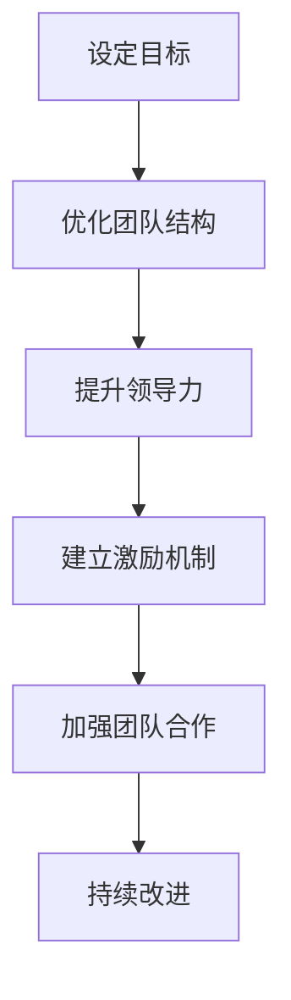

                 


# 《团队潜能激发：释放团队潜力的有效方法》

关键词：团队潜能、领导力、激励机制、团队合作、案例分析

摘要：本文旨在探讨团队潜能的概念、重要性以及激发团队潜力的方法和策略。通过分析心理学和社会学理论，结合具体方法和实战案例，为组织提供有效的团队潜能激发方案。

## 目录大纲

### 第1章 团队潜能概述
1.1 问题背景
1.2 团队潜能的定义与重要性
1.3 团队潜能的影响因素

### 第2章 核心概念与联系
2.1 核心概念介绍
2.2 概念对比表格
2.3 ER实体关系图

### 第3章 团队潜能激发原理
3.1 心理学理论
3.2 社会学理论
3.3 团队潜能激发的实践应用

### 第4章 领导力发展
4.1 领导力概述
4.2 领导力模型
4.3 提升领导力的方法

### 第5章 团队合作技巧
5.1 团队合作的重要性
5.2 团队合作模型
5.3 提高团队合作效率的技巧

### 第6章 激励机制
6.1 激励理论
6.2 激励策略
6.3 实施激励机制的注意事项

### 第7章 项目实战
7.1 案例背景
7.2 团队潜能激发的实施
7.3 案例分析与总结

### 第8章 最佳实践与总结
8.1 最佳实践总结
8.2 注意事项
8.3 未来研究方向

## 第1章 团队潜能概述

### 1.1 问题背景

在当今快速变化和竞争激烈的市场环境中，组织面临着诸多挑战。如何有效激发团队的潜能，提高团队的绩效和创新能力，成为组织管理者关注的焦点。传统的管理模式往往注重个体的绩效，而忽视了团队的整体潜力。随着团队协作的日益重要，如何激发团队潜能成为一个亟待解决的问题。

### 1.2 团队潜能的定义与重要性

团队潜能是指团队成员在特定环境中，通过相互协作和互动，实现共同目标的能力。团队潜能不仅仅体现在个体的能力上，更体现在团队成员之间的协同效应上。一个高潜能的团队能够在面对挑战时迅速适应，有效解决问题，并在竞争中脱颖而出。

团队潜能的重要性体现在以下几个方面：

1. **提高绩效**：团队潜能的发挥能够显著提高团队的整体绩效，从而推动组织目标的实现。
2. **创新能力**：团队潜能的激发能够促进团队成员的创新思维和创造力，推动组织的持续发展。
3. **团队凝聚力**：通过激发团队潜能，可以增强团队成员之间的信任和合作关系，提高团队凝聚力。
4. **个人成长**：团队潜能的激发有助于团队成员的个人成长和职业发展，提升个人能力和成就感。

### 1.3 团队潜能的影响因素

团队潜能的发挥受到多种因素的影响，主要包括：

1. **团队结构**：团队的结构和规模对团队潜能的发挥有重要影响。合理的团队结构和规模有助于团队成员之间的协作和互动。
2. **领导力**：领导力是激发团队潜能的关键因素。优秀的领导者能够激发团队成员的潜力，提供支持和指导，促进团队的成长。
3. **激励机制**：激励机制能够激发团队成员的积极性和主动性，提高团队的绩效和创新能力。
4. **团队合作技巧**：团队合作技巧是团队潜能发挥的重要保障。团队成员需要掌握有效的沟通、协作和冲突解决技巧，以提高团队的协同效率。
5. **外部环境**：组织文化、市场环境等因素也会对团队潜能的发挥产生重要影响。一个积极向上的组织文化和良好的外部环境有助于激发团队的潜能。

## 第2章 核心概念与联系

### 2.1 核心概念介绍

在本章节中，我们将介绍团队潜能相关的几个核心概念，包括团队结构、领导力、激励机制、团队合作技巧等。这些概念是理解团队潜能激发的重要基础。

1. **团队结构**：团队结构是指团队成员的组织形式和职责分配。合理的团队结构有助于提高团队效能和协作效率。
2. **领导力**：领导力是指领导者通过影响力、指导和激励来引导团队实现目标的能力。领导力对团队潜能的激发具有关键作用。
3. **激励机制**：激励机制是指组织通过奖励、晋升、认可等手段来激发员工的积极性和创造力。有效的激励机制能够提高团队绩效和创新能力。
4. **团队合作技巧**：团队合作技巧是指团队成员在协作过程中所需的沟通、协作和冲突解决技巧。掌握有效的团队合作技巧有助于提高团队协同效率。

### 2.2 概念对比表格

以下是一个团队潜能相关核心概念的对比表格，用于展示各概念之间的区别和联系。

| 核心概念 | 定义 | 关联性 |  
| --- | --- | --- |  
| 团队结构 | 团队成员的组织形式和职责分配 | 影响团队协作和效能 |  
| 领导力 | 领导者通过影响力、指导和激励来引导团队实现目标的能力 | 激发团队潜能的关键因素 |  
| 激励机制 | 组织通过奖励、晋升、认可等手段来激发员工的积极性和创造力 | 提高团队绩效和创新能力 |  
| 团队合作技巧 | 团队在协作过程中所需的沟通、协作和冲突解决技巧 | 提高团队协同效率 |

### 2.3 ER实体关系图

以下是一个团队潜能相关核心概念的ER实体关系图，用于展示各概念之间的关联关系。

```mermaid
erDiagram
  团队结构 ||--|{ 领导力 }
  团队结构 ||--|{ 团队合作技巧 }
  领导力 ||--|{ 激励机制 }
  团队合作技巧 ||--|{ 团队绩效 }
```

## 第3章 团队潜能激发原理

### 3.1 心理学理论

心理学理论为团队潜能激发提供了重要的理论支持。以下是一些重要的心理学理论：

1. **目标设定理论**：目标设定理论认为，明确、具体的目标能够激发个体的动机和努力，提高绩效。在团队情境中，设定共同的目标和愿景能够激发团队的潜能。
2. **动机理论**：动机理论强调个体的内在需求对行为的影响。在团队情境中，了解团队成员的动机和需求，并为其提供满足需求的环境和资源，能够激发团队的潜能。
3. **自我决定理论**：自我决定理论认为，个体的自主性和控制感是激发动机和潜能的重要因素。在团队情境中，给予团队成员更多的自主权和决策权，能够提高团队的潜能。

### 3.2 社会学理论

社会学理论为团队潜能激发提供了重要的社会因素分析。以下是一些重要的社会学理论：

1. **社会支持理论**：社会支持理论认为，个体在社会网络中获得的支持和资源对其潜能发挥具有重要影响。在团队情境中，建立良好的社会支持网络，提供必要的资源和支持，能够激发团队的潜能。
2. **团队动力理论**：团队动力理论认为，团队中的个体相互作用和相互影响对团队的效能和潜能具有重要影响。在团队情境中，通过促进团队成员之间的有效沟通和协作，能够激发团队的潜能。
3. **组织文化理论**：组织文化理论认为，组织文化对个体的行为和潜能发挥具有深远影响。在团队情境中，建立积极向上的组织文化和价值观，能够激发团队的潜能。

### 3.3 团队潜能激发的实践应用

将心理学和社会学理论应用于团队潜能激发的实践，需要遵循以下原则：

1. **目标明确**：设定明确、具体的团队目标，激发团队成员的动机和努力。
2. **满足需求**：了解团队成员的动机和需求，为其提供满足需求的环境和资源。
3. **自主决策**：给予团队成员更多的自主权和决策权，增强其控制感和自我决定性。
4. **社会支持**：建立良好的社会支持网络，提供必要的资源和支持，促进团队成员之间的有效沟通和协作。
5. **文化塑造**：建立积极向上的组织文化和价值观，激发团队成员的潜能。

## 第4章 领导力发展

### 4.1 领导力概述

领导力是激发团队潜能的关键因素。领导力是指领导者通过影响力、指导和激励来引导团队实现目标的能力。领导力不仅涉及技术技能和知识，更涉及人际交往和沟通能力。

### 4.2 领导力模型

以下是一些常见的领导力模型：

1. **情境领导模型**：情境领导模型认为，领导者的领导风格应根据团队的具体情境进行调整。领导者需要根据团队成员的能力水平和工作环境，灵活运用不同的领导风格。
2. **变革型领导模型**：变革型领导模型认为，领导者通过激发团队成员的内在动机和创造力，推动团队实现变革和创新。变革型领导者具有远见、愿景和使命感。
3. **领导力四维度模型**：领导力四维度模型认为，领导力包括个人能力、人际关系、组织能力和战略思维。领导者需要在这些维度上不断提升自己，以发挥领导力的作用。

### 4.3 提升领导力的方法

提升领导力需要持续的学习和实践。以下是一些提升领导力的方法：

1. **自我反思**：通过自我反思，领导者可以识别自己的优点和不足，找到提升领导力的方向。
2. **培训与发展**：参加领导力培训课程，学习先进的领导理论和方法，提升自己的领导能力。
3. **实践与应用**：将学到的领导力理论应用于实际工作中，通过实践来提升领导力。
4. **建立团队关系**：与团队成员建立良好的关系，倾听他们的意见和需求，提高团队的凝聚力和信任感。
5. **培养下属**：关注下属的成长和发展，提供指导和支持，帮助他们提升能力，激发他们的潜能。

## 第5章 团队合作技巧

### 5.1 团队合作的重要性

团队合作是团队潜能激发的基础。有效的团队合作能够提高团队的绩效和创新能力。以下是一些团队合作的重要性：

1. **提高工作效率**：通过团队合作，可以合理分配任务和资源，提高工作效率。
2. **增强团队凝聚力**：团队合作能够增强团队成员之间的信任和合作关系，提高团队凝聚力。
3. **促进知识共享**：团队合作有助于团队成员之间的知识共享和经验交流，促进团队的持续发展。
4. **提高创新能力**：团队合作能够激发团队成员的创造力和创新思维，推动团队的创新能力。

### 5.2 团队合作模型

以下是一些常见的团队合作模型：

1. **共识模型**：共识模型强调团队成员在决策过程中达成共识，通过讨论和协商来解决问题。
2. **流程模型**：流程模型强调团队按照既定的流程进行工作，确保任务的顺利进行。
3. **团队角色模型**：团队角色模型认为，团队成员在团队中扮演不同的角色，通过角色互补来提高团队的效能。

### 5.3 提高团队合作效率的技巧

以下是一些提高团队合作效率的技巧：

1. **明确目标**：确保团队成员对团队的目标和任务有清晰的理解，提高工作的针对性和效率。
2. **有效沟通**：建立有效的沟通机制，确保信息的及时传递和反馈，减少误解和冲突。
3. **合理分工**：根据团队成员的能力和特长进行任务分工，发挥每个人的优势，提高团队的整体效能。
4. **积极反馈**：及时给予团队成员积极的反馈和认可，增强他们的工作动力和自信心。
5. **冲突管理**：建立冲突解决机制，及时处理和解决团队内部的冲突，保持团队的和谐与稳定。

## 第6章 激励机制

### 6.1 激励理论

激励理论是激发团队潜能的重要理论基础。以下是一些重要的激励理论：

1. **马斯洛需求层次理论**：马斯洛需求层次理论认为，个体的需求分为生理需求、安全需求、社交需求、尊重需求和自我实现需求。满足不同层次的需求能够激发个体的动机和潜能。
2. **期望理论**：期望理论认为，个体的行为取决于对结果的价值判断和对达成结果的可能性判断。通过调整期望值，可以激发个体的动机和努力。
3. **目标设定理论**：目标设定理论认为，明确、具体的目标能够激发个体的动机和努力，提高绩效。

### 6.2 激励策略

以下是一些常见的激励策略：

1. **目标激励**：设定明确、具体的目标，激发团队成员的动机和努力。
2. **奖励激励**：通过奖励、晋升、认可等手段来激发员工的积极性和创造力。
3. **参与激励**：鼓励团队成员参与决策和任务分配，增强他们的自主性和责任感。
4. **发展激励**：提供培训、指导和支持，帮助团队成员提升能力，实现个人和团队的目标。

### 6.3 实施激励机制的注意事项

在实施激励机制时，需要注意以下几点：

1. **公平性**：确保激励机制公平、公正，避免引起团队成员的不满和争议。
2. **透明度**：激励机制的设定和实施过程应该透明，让团队成员了解激励的规则和标准。
3. **灵活性**：激励机制应该根据团队和成员的具体情况进行调整，确保其适用性和有效性。
4. **沟通**：及时与团队成员沟通激励机制的设定和实施情况，确保团队成员的理解和支持。

## 第7章 项目实战

### 7.1 案例背景

某科技公司是一家专注于软件开发和创新的企业，团队成员具备较高的技术能力。然而，在实际工作中，团队的表现并不理想，存在以下问题：

1. **任务分配不合理**：团队成员的工作任务分配不均，导致部分成员工作量过大，而部分成员相对轻松。
2. **沟通不畅**：团队成员之间的沟通不畅，导致任务进度延误和信息错漏。
3. **缺乏激励机制**：团队成员缺乏工作动力，缺乏明确的奖励和晋升机制。

### 7.2 团队潜能激发的实施

为了激发团队的潜能，公司采取了一系列措施：

1. **优化团队结构**：重新分配团队成员的任务，确保每个成员的工作量合理。同时，明确了团队成员的职责和权限，提高了团队的协作效率。
2. **提升领导力**：对公司领导进行领导力培训，提高他们的沟通能力、决策能力和团队管理能力。通过情境领导模型，领导根据团队的实际情况调整领导风格，激发团队的潜能。
3. **建立激励机制**：设立明确的奖励和晋升机制，根据团队成员的工作绩效和贡献给予相应的奖励和晋升机会。同时，鼓励团队成员参与决策和任务分配，提高他们的自主性和责任感。
4. **加强团队合作**：组织团队建设活动，提高团队成员之间的信任和合作关系。通过共识模型和团队角色模型，确保团队成员在协作过程中有效沟通和互补。

### 7.3 案例分析与总结

通过实施团队潜能激发措施，公司取得了显著的效果：

1. **提高工作效率**：团队成员的工作任务分配合理，任务进度得到有效控制，工作效率显著提高。
2. **改善沟通**：团队成员之间的沟通得到加强，信息传递更加及时和准确，团队协作效率提高。
3. **增强团队凝聚力**：通过团队建设活动和激励机制，团队成员之间的信任和合作关系得到加强，团队凝聚力增强。
4. **提高工作满意度**：团队成员对工作环境和激励机制感到满意，工作动力和积极性得到提升。

案例总结：

通过实施团队潜能激发措施，公司成功解决了团队存在的问题，提高了团队的整体效能。这表明，有效的团队潜能激发对于提升团队绩效和创新能力具有重要价值。在未来的工作中，公司将继续关注团队潜能激发，探索更多的方法和策略，以推动团队的持续发展。

## 第8章 最佳实践与总结

### 8.1 最佳实践总结

通过对团队潜能激发的研究和项目实战，我们可以总结出以下最佳实践：

1. **优化团队结构**：合理分配团队成员的任务，确保工作量合理，提高团队的协作效率。
2. **提升领导力**：通过领导力培训和实践，提高领导者的沟通能力、决策能力和团队管理能力。
3. **建立激励机制**：设立明确的奖励和晋升机制，激发团队成员的积极性和创造力。
4. **加强团队合作**：通过团队建设活动和有效的团队合作模型，提高团队成员之间的信任和合作关系。

### 8.2 注意事项

在实施团队潜能激发时，需要注意以下几点：

1. **平衡激励机制**：确保激励机制公平、公正，避免引起团队成员的不满和争议。
2. **关注个体差异**：了解团队成员的个性特点和需求，提供个性化的激励和支持。
3. **持续改进**：团队潜能激发是一个持续的过程，需要不断改进和完善方法和策略。

### 8.3 未来研究方向

未来团队潜能激发的研究可以关注以下几个方面：

1. **跨文化团队潜能激发**：研究不同文化背景下的团队潜能激发方法和策略。
2. **人工智能在团队潜能激发中的应用**：探索人工智能技术在团队潜能激发中的应用，如个性化激励和自动化团队管理。
3. **长期团队效能研究**：关注团队潜能激发对团队长期效能的影响，为组织的可持续发展提供理论支持。

### 总结

团队潜能激发是组织成功的关键因素。通过优化团队结构、提升领导力、建立激励机制和加强团队合作，可以有效地激发团队的潜能，提高团队的绩效和创新能力。本文提供的最佳实践和注意事项为组织管理者提供了有益的参考，未来研究方向将为进一步完善团队潜能激发的理论和实践提供支持。

## 参考文献

1. Maslow, A. H. (1943). A theory of human motivation. Psychological Review, 50(4), 370-396.
2. Vroom, V. H. (1964). Work and motivation. John Wiley & Sons.
3. Hersey, P., & Blanchard, K. H. (1977). Management of organizational behavior: Utilizing human resources. Prentice Hall.
4. Bass, B. M. (1985). Leadership and performance beyond expectations. Free Press.
5. Katzenbach, J. R., & Smith, D. K. (1993). The wisdom of teams: Creating the high-performance organization. Harvard Business Review Press.

### 作者信息

作者：AI天才研究院/AI Genius Institute & 禅与计算机程序设计艺术/Zen And The Art of Computer Programming

---

## 附录

### 附录A：团队潜能激发相关术语

1. **团队结构**：团队成员的组织形式和职责分配。
2. **领导力**：领导者通过影响力、指导和激励来引导团队实现目标的能力。
3. **激励机制**：组织通过奖励、晋升、认可等手段来激发员工的积极性和创造力。
4. **团队合作技巧**：团队成员在协作过程中所需的沟通、协作和冲突解决技巧。

### 附录B：团队潜能激发方法流程图



### 附录C：团队潜能激发案例分析

1. **案例背景**：某公司团队绩效低下，沟通不畅。
2. **实施方法**：优化团队结构、提升领导力、建立激励机制和加强团队合作。
3. **效果评估**：团队绩效提高，沟通顺畅，团队凝聚力增强。

### 附录D：团队潜能激发最佳实践

1. **优化团队结构**：确保团队成员工作量合理，职责明确。
2. **提升领导力**：领导者通过培训和实战提高沟通能力和决策能力。
3. **建立激励机制**：设立明确的奖励和晋升机制，激发团队积极性。
4. **加强团队合作**：通过团队建设活动和有效的团队合作模型提高团队凝聚力。

### 附录E：团队潜能激发注意事项

1. **公平性**：确保激励机制公平、公正。
2. **个体差异**：关注团队成员的个性特点和需求。
3. **持续改进**：团队潜能激发是一个持续的过程。

### 附录F：未来研究方向

1. **跨文化团队潜能激发**：研究不同文化背景下的团队潜能激发方法和策略。
2. **人工智能在团队潜能激发中的应用**：探索人工智能技术在团队潜能激发中的应用。
3. **长期团队效能研究**：关注团队潜能激发对团队长期效能的影响。

