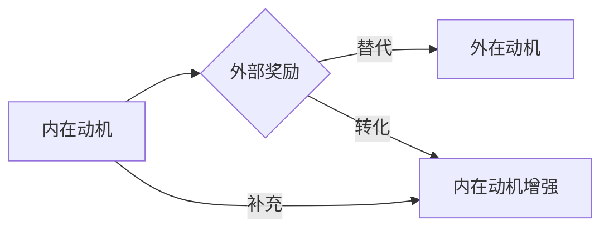
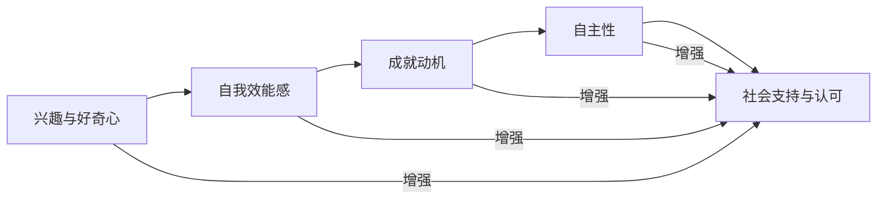

                 

### 团队激励的重要性

在信息化快速发展的今天，企业竞争的核心已不再是单一的产品或技术，而是团队的整体实力和创新能力。团队激励作为一种管理手段，其重要性愈发凸显。良好的团队激励能够有效提升员工的满意度、忠诚度和工作效率，进而增强企业的核心竞争力。

首先，团队激励能够满足员工的基本需求。马斯洛的需求层次理论指出，人的需求从低到高分为生理需求、安全需求、社交需求、尊重需求和自我实现需求。通过合理的激励措施，企业可以在不同层次上满足员工的需求，从而提升其工作积极性和幸福感。

其次，团队激励有助于激发员工的内在驱动力。心理学家洛克和莱瑟姆提出的目标设定理论指出，明确、有挑战性的目标能够有效激发员工的内在动机，提高工作绩效。此外，自我决定理论也强调了自主性、胜任感和关联感在内在驱动力中的作用，这些都需要通过激励策略来实现。

最后，团队激励能够促进团队凝聚力和协作精神。通过激励措施，企业可以培养员工的团队意识，增强团队之间的合作与信任，提高整体的工作效率和创新能力。

综上所述，团队激励不仅关乎员工个人发展，更对企业整体运营和长期发展有着深远的影响。因此，深入探讨团队激励的心理学基础和实施策略，对于提升企业竞争力具有重要的现实意义。

### 研究背景与目标

团队激励作为一种重要的管理工具，其研究背景可以追溯到20世纪早期。早期的管理理论，如科学管理理论和人际关系理论，已经初步涉及了激励的概念。然而，随着心理学研究的不断深入，激励理论也逐渐丰富和完善。如马斯洛的需求层次理论、赫茨伯格的双因素理论、洛克和莱瑟姆的目标设定理论以及德西和瑞安的自我决定理论等，都为团队激励的研究提供了坚实的理论基础。

当前，团队激励的研究主要集中在以下几个方面：一是激励措施的有效性评估，包括物质激励和精神激励的作用；二是激励对员工心理和行为的影响，如内在动机、工作满意度和组织承诺等；三是团队激励在不同文化和组织背景下的适用性。尽管已有大量的研究成果，但在实际应用中，团队激励仍然面临诸多挑战，如如何平衡内外激励、如何针对不同员工制定个性化的激励策略等。

本文的研究目标在于深入探讨团队激励的心理学基础，揭示内在驱动力的作用机制，并提出切实可行的激励策略。具体来说，本文将首先回顾团队激励的基本概念和理论，然后分析内在驱动力的心理学原理，接着探讨激发内在驱动力的具体策略，并通过实践案例进行验证。最后，本文将讨论团队激励在不同文化背景下的应用，以及未来的研究方向。希望通过本文的研究，能够为企业管理者提供有价值的参考，提升团队激励的效果，进而增强企业的竞争力。

### 书籍结构安排

本书共分为八个章节，系统且全面地探讨了团队激励的心理学基础、实施策略以及应用拓展。以下是详细的章节结构安排：

**第1章 引言**  
本章将介绍团队激励的重要性，回顾相关研究背景，并明确本文的研究目标。通过本章，读者可以初步了解团队激励在企业管理中的关键作用，以及本文的研究框架和内容安排。

**第2章 团队激励的基本概念**  
本章将定义团队和团队动力学的概念，回顾各种激励理论，并探讨内在驱动力与外在激励的区别。通过本章，读者将建立对团队激励基本概念的理解，为后续内容的学习打下基础。

**第3章 内在驱动力的心理学基础**  
本章将深入分析自我决定理论，探讨内在动机与外在动机的关系，并总结内在驱动力的核心要素。通过本章，读者将理解内在驱动力在团队激励中的重要性，并学会如何识别和培养员工的内在动机。

**第4章 内在驱动力的激发策略**  
本章将提出具体的激发内在驱动力的策略，包括设定有挑战性的目标、提供选择和自主权、以及强化内在动机。通过本章，读者将掌握一系列实用的激励工具，以提升团队的整体绩效。

**第5章 团队激励的心理学实践**  
本章将结合团队建设、领导风格和反馈奖励系统，探讨团队激励的心理学实践。通过案例分析，读者将了解如何在实际操作中应用这些激励策略，以提升团队凝聚力和工作效率。

**第6章 案例分析**  
本章将通过成功和失败的案例，深入剖析团队激励在不同情境下的效果。通过本章，读者将获得实际操作的经验和教训，进一步巩固对团队激励的理解。

**第7章 内在驱动力的应用与拓展**  
本章将讨论内在驱动力在不同文化背景下的应用，以及跨国团队激励的挑战与策略。通过本章，读者将拓展视野，了解团队激励在全球化背景下的应用和挑战。

**第8章 总结与展望**  
本章将总结本文的主要发现，提出研究限制和未来方向，并对实践者提供一些建议。通过本章，读者将系统地回顾全文内容，并展望团队激励领域的发展前景。

通过以上章节的安排，本书旨在为读者提供一个全面、系统且易于理解的团队激励心理学框架，帮助读者在实际工作中有效应用激励策略，提升团队绩效和企业管理水平。

### 第1章 引言

在现代企业管理中，团队激励被认为是提升员工积极性和工作效率的关键手段。有效的团队激励不仅能满足员工的多层次需求，还能激发其内在驱动力，从而推动团队整体绩效的提升。本节将深入探讨团队激励的重要性，并详细介绍本书的研究背景、目标以及结构安排。

首先，团队激励的重要性不可忽视。在现代组织中，团队协作已成为实现目标的重要途径。而团队激励则是在这一过程中起到关键作用的管理工具。团队激励不仅能满足员工的基本需求，提高工作满意度，还能激发员工的内在动机，促使他们主动提升个人能力和工作绩效。此外，通过合理的激励措施，企业可以增强员工的归属感和组织承诺，提高团队的凝聚力和协作精神。

其次，研究团队激励的背景和目标具有重要意义。随着经济全球化和科技发展的加速，企业面临的竞争环境愈发激烈。如何通过有效的团队激励提升企业竞争力，已成为管理学界和实践者共同关注的课题。本文旨在深入探讨团队激励的心理学基础，揭示内在驱动力的作用机制，并提出具体可行的激励策略。具体研究目标包括：1）回顾和总结现有的团队激励理论和实践，2）分析内在驱动力的核心要素和作用机制，3）探讨不同情境下团队激励策略的适用性，4）通过案例分析验证激励策略的有效性。

最后，本书的结构安排旨在为读者提供一个系统、全面且易于理解的研究框架。全书共分为八个章节，各章节内容紧密相连，形成一个完整的研究体系。第一章作为引言，介绍了团队激励的重要性、研究背景和目标，以及本书的结构安排。第二章将定义团队和团队动力学的概念，回顾各种激励理论，并探讨内在驱动力与外在激励的区别。第三章深入分析自我决定理论，探讨内在动机与外在动机的关系，并总结内在驱动力的核心要素。第四章提出具体的激发内在驱动力的策略，包括设定有挑战性的目标、提供选择和自主权、以及强化内在动机。第五章结合团队建设、领导风格和反馈奖励系统，探讨团队激励的心理学实践。第六章将通过成功和失败的案例，深入剖析团队激励在不同情境下的效果。第七章讨论内在驱动力在不同文化背景下的应用，以及跨国团队激励的挑战与策略。第八章总结本文的主要发现，提出研究限制和未来方向，并对实践者提供一些建议。

通过以上章节的安排，本书旨在为读者提供一个全面、系统且易于理解的团队激励心理学框架，帮助读者在实际工作中有效应用激励策略，提升团队绩效和企业管理水平。

### 第2章 团队激励的基本概念

要深入理解团队激励，首先需要明确团队和团队动力学的概念，并回顾各种激励理论，特别是内在驱动力与外在激励的区别。这些基本概念构成了团队激励的理论基石，为后续的深入探讨提供了坚实的依据。

#### 团队与团队动力学

**团队**是指由两个或多个个体组成的，共同工作以实现特定目标的组织。团队具有以下几个关键特征：

1. **共同目标**：团队成员共同设定并追求一个清晰、具体的目标。
2. **相互依赖**：团队成员的工作相互依赖，一个人的工作质量直接影响团队的整体表现。
3. **相互沟通**：团队成员之间需要有效沟通，共享信息，协同合作。
4. **共同责任**：团队成员对团队的成功和失败共同承担责任。

**团队动力学**是指团队内部的动力机制和运行规律。它包括以下几个方面：

1. **团队形成**：团队从形成、磨合到成熟的各个阶段。
2. **团队冲突**：团队成员在意见、目标和利益上的分歧和冲突。
3. **团队规范**：团队内共同遵守的行为准则和规范。
4. **团队效能**：团队完成目标的能力和效率。

理解团队和团队动力学，有助于我们更好地理解团队激励的背景和实施策略。

#### 激励理论概述

激励理论是团队激励的基础，不同的理论从不同的角度揭示了激励的本质和机制。以下是几种主要的激励理论：

1. **马斯洛的需求层次理论**：该理论将人的需求分为五个层次，从生理需求到自我实现需求。认为只有满足低层次需求后，个体才会追求高层次需求。管理者可以根据员工的不同需求层次，提供相应的激励措施。

2. **赫茨伯格的双因素理论**：该理论将激励因素分为内在激励和外在激励。内在激励与工作本身相关，如成就感、责任感等；外在激励与工作环境相关，如薪酬、福利等。该理论强调了内在激励在长期激励中的重要性。

3. **洛克和莱瑟姆的目标设定理论**：该理论认为明确、有挑战性的目标能够有效激发员工的内在动机，提高工作绩效。目标设定要具体、可测量，并且要具有可行性。

4. **德西和瑞安的自我决定理论**：该理论认为，内在动机是维持个体行为和持续努力的重要因素。自主性、胜任感和关联感是内在驱动力的核心要素，管理者应通过这些因素来激发员工的内在动机。

#### 内在驱动力与外在激励

**内在驱动力**是指个体出于自身内在的兴趣、好奇心或动机而参与某种活动。它源自于个体内心的需求，能够带来持久的动力和满足感。内在驱动力通常与以下因素相关：

1. **兴趣和好奇心**：个体对某种活动具有浓厚的兴趣和好奇心，愿意主动投入时间和精力。
2. **成就感**：个体在完成任务或达成目标时感受到的满足和成就感。
3. **责任感**：个体对自己的工作负有责任感，愿意为团队的成功承担责任。

**外在激励**是指通过外部因素来激发个体的行为和动机。它通常包括物质奖励、薪酬、晋升机会等。外在激励在短期内能够迅速提升个体的动力和工作效率，但长期依赖可能会导致内在动机的减弱。

内在驱动力与外在激励的关系可以概括为：

1. **互补关系**：内在驱动力和外在激励可以相互补充，共同推动个体的行为。例如，个体可能因为对工作的兴趣和成就感而投入大量时间，但适当的物质奖励可以进一步激发其积极性。
2. **替代关系**：在某些情况下，外在激励可以替代内在驱动力。例如，高额的薪酬可能足以让个体忽略工作的单调乏味，但这也可能导致内在动机的消退。

#### 团队激励的基本概念框架

为了更清晰地理解团队激励，可以构建一个基本的概念框架（如图1所示）：

- **团队目标**：明确、具体、共同的目标，是团队激励的核心。
- **激励机制**：包括内在激励和外在激励，用于激发员工的行为和动机。
- **内在驱动力**：源于个体内在的兴趣、成就感、责任感等，是持续性和长期动力的来源。
- **外在激励**：通过薪酬、晋升、福利等外部因素来激发员工的短期动力。
- **团队动力学**：团队内部的动力机制和运行规律，影响团队激励的效果。

图1 团队激励基本概念框架

通过以上对团队和团队动力学概念、激励理论概述以及内在驱动力与外在激励的探讨，我们为后续章节的内容奠定了基础。在接下来的章节中，我们将深入分析内在驱动力的心理学基础，提出具体的激发策略，并通过实践案例验证这些策略的有效性。

#### 第3章 内在驱动力的心理学基础

内在驱动力是团队激励的重要组成部分，其心理学基础深刻影响了员工的动机和行为。本节将深入探讨自我决定理论，分析内在动机与外在动机的关系，并总结内在驱动力的核心要素，以期为团队激励提供理论支持。

##### 自我决定理论

自我决定理论由心理学家德西和瑞安提出，是一种关于人类动机的综合性理论。该理论认为，个体行为的内在动力来源于三个基本心理需求：自主性、胜任感和关联感。

1. **自主性**：个体对行为选择的控制感，即个体感觉到自己的行为是自主决定的，而不是被迫的。自主性是内在动机的重要来源，能够激发个体主动参与并持续努力。
   
2. **胜任感**：个体对自己的能力和行为结果的自信心，即个体感觉到自己能够有效地完成某项任务。胜任感是内在动机的重要支撑，能够提高个体在工作中的积极性和成就感。

3. **关联感**：个体与他人建立有意义联系的感知，即个体感觉到自己的行为与他人的需要和价值观相符。关联感能够增强个体的归属感和责任感，从而促进内在动机的形成。

自我决定理论强调了自主性、胜任感和关联感在内在动机中的作用，这些因素共同作用于个体的行为选择和动机水平。为了更好地理解这些概念，我们可以通过以下ER实体关系图来展示它们之间的关系（如图1所示）：

```mermaid
erDiagram
  Person ||--|{ Choice } Choice
  Person ||--|{ Competence } Competence
  Person ||--|{ Relatedness } Relatedness
  Choice ||--|{ Choice } Result
  Competence ||--|{ Competence } Result
  Relatedness ||--|{ Relatedness } Result
```

图1 自我决定理论的ER实体关系图

##### 内在动机与外在动机的关系

内在动机和外在动机是动机的两种不同类型，分别源自于个体内部的兴趣和需求以及外部环境的刺激和奖励。

1. **内在动机**：源自个体内在的兴趣、好奇心、满足感和成就感，与任务本身相关。例如，一个对编程有浓厚兴趣的程序员可能会自发地钻研新技术，并在解决问题时感受到巨大的满足感。

2. **外在动机**：源自外部环境的奖励和惩罚，与任务的结果相关。例如，一个为了获得奖金而努力工作的员工，其动机主要来自于外部奖励而非对工作的热爱。

内在动机和外在动机之间的关系可以总结为以下几点：

1. **互补关系**：内在动机和外在动机可以相互补充。例如，一个对编程充满热情的程序员，在完成项目后获得奖金，可以进一步增强其内在动机。

2. **替代关系**：在某些情况下，外在动机可以替代内在动机。例如，一个为了生计而编程的人可能会忽视编程的乐趣，将主要动机转向薪酬。

3. **转换关系**：通过适当的激励措施，外在动机可以转化为内在动机。例如，通过设定有挑战性的任务和提供反馈，可以让员工逐渐从对薪酬的依赖转向对工作本身的兴趣。

内在动机和外在动机的关系可以用以下Mermaid流程图来表示（如图2所示）：



图2 内在动机与外在动机的关系

##### 内在驱动力的核心要素

内在驱动力由多个核心要素组成，这些要素共同作用于个体的动机和行为。以下是内在驱动力的核心要素及其简要说明：

1. **兴趣与好奇心**：个体对特定活动或领域的兴趣和好奇心，是内在动机的重要来源。例如，一个对科技创新有浓厚兴趣的工程师，可能会自发地投入大量时间研究新技术。

2. **自我效能感**：个体对自己的能力和行为结果的自信心。高自我效能感能够增强个体的内在动机，使其更愿意接受挑战并持续努力。

3. **成就动机**：个体追求成就和成功的内在需求。具有高成就动机的个体通常更倾向于设定有挑战性的目标，并在实现目标时获得强烈的满足感。

4. **自主性**：个体对行为选择的控制感，是内在动机的重要支撑。高自主性能够激发个体的主动性和创造性。

5. **社会支持与认可**：个体感受到的社会支持和认可，能够增强其内在动机。例如，团队领导的认可和同事的支持，可以增强员工的归属感和责任感。

通过上述分析，我们可以构建一个简化的内在驱动力的Mermaid流程图（如图3所示），展示核心要素之间的相互关系：



图3 内在驱动力的核心要素

综上所述，内在驱动力的心理学基础涵盖了自我决定理论、内在动机与外在动机的关系，以及内在驱动力的核心要素。通过理解这些基础概念，我们可以更好地识别和培养员工的内在动机，从而实现有效的团队激励。

#### 第4章 内在驱动力的激发策略

要有效地激发员工的内在驱动力，管理者需要采用一系列科学且具体的策略。这些策略包括设定有挑战性的目标、提供选择和自主权、以及强化内在动机。以下将逐一探讨这些策略，并提供实用的建议和案例。

##### 设定有挑战性的目标

设定有挑战性的目标是激发内在动机的有效手段。有挑战性的目标能够激发员工的好奇心和探索精神，促使他们主动投入并寻找解决方案。以下是一些具体建议：

1. **目标具体化**：目标应具体、可测量，并具有明确的达成标准。例如，而不是说“提高销售额”，更具体的目标可以是“增加20%的季度销售额”。

2. **适度挑战**：目标应既有挑战性，又具有可行性。过于简单或过于困难的目标都无法有效激发内在动机。管理者可以通过咨询团队成员的意见，共同设定合理的目标。

3. **阶段性目标**：将长期目标分解为短期、可实现的阶段性目标，有助于员工保持持续的动力和成就感。例如，将一年目标分解为季度和月度目标。

案例：某科技公司为了提升产品研发团队的内在动机，设定了“研发出两款具备市场竞争力的新产品”的年度目标。同时，将这个目标分解为季度和月度的研发里程碑，如每季度发布一个新产品的原型，每月完成特定的功能模块。这种目标设定方法有效地激发了团队的内在动机，提高了研发效率。

##### 提供选择和自主权

自主权是内在驱动力的关键要素之一。管理者应尽量为员工提供选择和自主权，使其能够自主决定工作的方法和进度。以下是一些建议：

1. **赋予决策权**：在合适的情况下，管理者可以将决策权下放给团队成员，让他们参与项目规划和决策。这不仅能够提升员工的参与感和责任感，还能激发其内在动机。

2. **自主安排工作**：允许员工自主安排工作时间、工作内容和休息时间，可以增强其工作的自主性和灵活性。

3. **个性化任务**：根据员工的专业技能和兴趣，为他们分配个性化的任务，使其能够充分发挥自己的优势。

案例：某互联网公司为了提升团队自主性，实施了“项目经理制”。每个团队成员都可以自愿申请成为项目经理，负责项目的整体规划和管理。这种机制不仅增强了团队的自主性和责任感，还提高了项目的完成质量和团队的整体绩效。

##### 强化内在动机

强化内在动机可以通过认可、奖励和反馈等方式实现。以下是一些具体策略：

1. **认可与奖励**：及时认可员工的努力和成就，可以增强其内在动机。奖励不仅包括物质奖励，还可以是荣誉称号、培训机会等。

2. **持续反馈**：提供具体的、建设性的反馈，帮助员工认识到自己的进步和改进方向。反馈应注重过程而非结果，鼓励员工持续努力。

3. **团队文化**：营造积极向上的团队文化，鼓励员工相互支持和学习。一个充满信任和尊重的团队氛围能够增强员工的内在动机。

案例：某知名咨询公司通过定期举办“优秀员工表彰大会”，对在项目中有突出贡献的员工进行公开表彰和奖励。这种做法不仅提高了员工的内在动机，还增强了团队凝聚力和工作热情。

通过上述策略，管理者可以有效地激发和强化员工的内在驱动力，提高团队的整体绩效和创新能力。在实际应用中，管理者应根据团队的特点和员工的个体差异，灵活调整激励策略，以实现最佳效果。

#### 第5章 团队激励的心理学实践

在了解了内在驱动力的激发策略后，我们将探讨团队激励在实际工作中的具体应用。这一章将重点分析团队建设、领导风格、反馈与奖励系统等心理学实践，并辅以成功和失败的案例，以帮助读者更好地理解团队激励的实际效果。

##### 团队建设的激励策略

团队建设是激发团队动力和提升团队绩效的关键步骤。以下是一些有效的团队建设激励策略：

1. **增强团队凝聚力**：通过团队建设活动，如团建训练、团队游戏等，增强团队成员之间的信任和合作。一个凝聚力强的团队更有可能实现共同目标。

2. **明确团队角色**：确保每个团队成员都明确自己的角色和责任，避免角色重叠和职责不清。明确的角色定位有助于提升团队成员的参与感和责任感。

3. **培养团队文化**：建立积极向上的团队文化，鼓励团队成员互相支持和学习。通过定期的团队会议和培训，强化团队价值观和行为准则。

案例：某科技公司定期组织团建活动，如户外拓展、团队建设工作坊等，以增强团队凝聚力。这些活动不仅提升了团队成员之间的信任，还激发了员工的工作热情和创造力。

##### 领导风格与团队激励

领导风格对团队激励效果有着重要影响。以下几种领导风格能够有效地激发团队内在驱动力：

1. **支持型领导**：支持型领导关注团队成员的需求，提供必要的资源和支持，帮助团队成员克服困难。这种领导风格能够增强员工的自主性和责任感。

2. **民主型领导**：民主型领导鼓励团队成员参与决策过程，尊重团队成员的意见和建议。这种领导风格有助于提高员工的参与感和成就感。

3. **成就导向型领导**：成就导向型领导专注于提升团队成员的绩效和成就，设定明确的目标和期望，激励团队成员不断追求卓越。

案例：某互联网公司采用民主型领导风格，公司领导定期组织团队会议，听取团队成员的意见和建议，并共同制定项目计划和目标。这种领导风格不仅增强了团队的凝聚力，还提高了员工的工作满意度和创新能力。

##### 反馈与奖励系统的设计

有效的反馈与奖励系统是团队激励的重要组成部分。以下是一些关键策略：

1. **及时反馈**：及时给予员工反馈，帮助他们认识到自己的进步和改进方向。反馈应注重具体行为和结果，避免泛泛而谈。

2. **个性化奖励**：根据员工的贡献和表现，提供个性化的奖励，如奖金、晋升机会、荣誉称号等。个性化奖励能够更好地满足员工的需求，提高激励效果。

3. **公平与透明**：确保奖励系统的公平性和透明度，让员工了解奖励的标准和依据。公平的奖励系统能够增强员工的信任感和组织承诺。

案例：某咨询公司采用季度绩效评估制度，对表现优秀的员工进行公开表彰和奖励。同时，公司领导定期与员工进行一对一的绩效反馈，帮助员工制定个人发展计划。这种反馈与奖励系统不仅激发了员工的内在动机，还提升了团队的整体绩效。

##### 成功与失败的案例分析

以下是一个成功和失败的团队激励案例，以展示团队激励在实际应用中的效果。

**成功案例：**

某科技公司通过实施“员工参与计划”，成功激发了团队内在驱动力。公司领导定期组织员工参与项目讨论和决策，并给予员工更多的自主权。此外，公司还设立了“创新奖励基金”，鼓励员工提出创新性建议。这种做法不仅提高了员工的工作满意度，还增强了团队的创新能力和市场竞争力。

**失败案例：**

某制造公司曾尝试通过提高薪酬来激励员工，但效果并不理想。尽管薪酬有所提升，但员工的工作满意度和绩效并没有显著改善。经过深入调查，发现员工对工作本身缺乏兴趣，且缺乏有效的反馈和成长机会。因此，仅仅依靠物质激励并不能解决团队激励的问题，需要结合内在驱动力的激发策略。

通过以上案例，我们可以看到，团队激励在实践中需要综合考虑多种因素，包括团队建设、领导风格、反馈与奖励系统等。有效的团队激励不仅能够提升员工的工作满意度和绩效，还能增强团队的凝聚力和创新能力，从而为企业的发展提供强有力的支持。

#### 第6章 案例分析

为了更好地理解团队激励在现实中的应用效果，本章节将详细分析两个案例：一个成功的案例和一个失败的案例。通过这些案例，我们可以更深入地探讨团队激励的实践效果和常见误区。

##### 成功案例：如何激发团队内在驱动力

某互联网科技公司是一家以技术创新为核心竞争力的企业。为了激发团队内在驱动力，该公司实施了一系列有针对性的激励措施。

**案例背景：**

该公司成立于2010年，致力于提供高质量的在线教育平台。公司早期通过技术创新迅速占领市场，但面对激烈的市场竞争，团队出现了动力不足、创新能力下降的问题。为了解决这一问题，公司决定通过团队激励来提升员工的内在驱动力。

**实施措施：**

1. **设定有挑战性的目标**：公司领导与团队共同设定了明确的、有挑战性的年度目标，如研发出两款具有市场竞争力的新产品，提升用户满意度等。这些目标既有一定的挑战性，又是团队可实现的，有助于激发员工的内在动机。

2. **提供选择和自主权**：公司鼓励员工自主选择项目方向和实现方法。员工可以提出创新性建议，并参与项目的决策过程。这种做法增强了员工的自主性和责任感，激发了他们的内在动力。

3. **强化内在动机**：公司通过建立透明和公平的反馈与奖励系统，定期对员工的工作进行评估，并根据其表现给予奖励。奖励不仅包括物质上的奖金，还包括荣誉称号和职业发展机会。这种多元化的奖励机制有助于强化员工的内在动机。

4. **培养团队文化**：公司重视团队文化建设，通过团队活动、培训等方式，营造积极向上、互助协作的工作氛围。员工在这样的环境中，更容易产生归属感和责任感，从而增强内在驱动力。

**结果分析：**

经过一系列的激励措施，该公司的团队动力显著提升，新产品研发速度加快，用户满意度显著提高。员工的工作满意度和组织承诺也有所提升，离职率明显下降。这一案例表明，通过合理的团队激励策略，可以有效激发员工的内在驱动力，提升团队整体绩效。

##### 失败案例：团队激励中的常见误区

某传统制造公司为了提高员工的工作积极性，采取了一系列的激励措施，但效果却不尽如人意。

**案例背景：**

该公司成立于上世纪70年代，主要从事汽车零部件的生产。近年来，由于市场竞争加剧，公司业绩下滑，管理层希望通过激励措施提升员工的工作动力。然而，公司之前的激励措施效果不佳，员工的工作积极性并没有明显提高。

**实施措施：**

1. **增加薪酬**：公司大幅提高员工的薪资，期望通过物质激励来提升员工的工作积极性。

2. **奖励制度**：公司设立了一套奖励制度，对完成特定任务的员工进行奖励。奖励主要形式是奖金和晋升机会。

3. **严格考核**：公司对员工的工作进行严格考核，并对考核结果进行公示，以激励员工努力工作。

**结果分析：**

尽管公司采取了多种激励措施，但员工的工作积极性并没有显著提高，反而出现了抵触情绪。经过深入调查，发现以下几个问题：

1. **缺乏内在激励**：公司主要依赖物质奖励和严格考核，忽视了员工内在动机的激发。员工感到工作只是为了获得物质奖励，而不是出于对工作的热爱和责任感。

2. **奖励制度不透明**：奖励制度的不透明性导致员工对考核结果和奖励分配产生质疑，影响了员工对公司的信任。

3. **忽视团队建设**：公司没有采取有效的团队建设措施，员工之间缺乏信任和合作，团队凝聚力不强。

这一案例表明，在团队激励中，单纯依赖物质奖励和严格考核并不能有效激发员工的内在驱动力。相反，需要关注员工的内在动机，采取多样化的激励策略，同时加强团队建设，才能实现良好的激励效果。

##### 案例总结

通过上述两个案例，我们可以得出以下结论：

1. **内在激励的重要性**：成功的团队激励需要关注员工的内在动机，通过设定有挑战性的目标、提供选择和自主权、强化内在动机等措施，激发员工的内在驱动力。

2. **透明和公平**：激励措施需要透明和公平，确保员工对考核结果和奖励分配有信任感，从而增强激励效果。

3. **团队建设**：团队建设是激发团队动力的关键环节，通过增强团队凝聚力、培养团队文化，有助于提升整体团队绩效。

4. **多样化激励策略**：单一的激励措施可能无法满足不同员工的需求，需要采取多样化的激励策略，结合物质激励和内在激励，才能实现最佳效果。

通过这些案例，我们可以更好地理解团队激励的实际应用，并在实践中避免常见的误区，提高团队激励的效果。

#### 第7章 内在驱动力的应用与拓展

内在驱动力作为一种强大的激励工具，在不同文化背景下和跨国团队中具有独特的应用和挑战。本节将探讨内在驱动力在不同文化背景下的应用，以及跨国团队激励的挑战与策略，并展望内在驱动力未来的发展趋势。

##### 内在驱动力在不同文化背景下的应用

不同文化对个体动机和行为有着深远的影响，因此在应用内在驱动力时需要考虑文化差异。以下是一些主要文化背景下的内在驱动力应用特点：

1. **西方文化**：在西方文化中，个人主义占主导地位，个体追求自主性和个人成就。因此，内在驱动力的应用主要体现在提供选择和自主权，鼓励员工自主设定目标和探索解决方案。例如，美国企业通常通过赋予员工更多的自主权，激发他们的创新和创造力。

2. **东方文化**：在东方文化中，集体主义更为突出，个体更注重团队利益和集体荣誉。内在驱动力的应用则更侧重于团队目标和集体成就感。例如，日本企业强调团队合作和共同目标，通过团队奖励和集体荣誉来激发员工的内在动机。

3. **多元文化**：在全球化背景下，许多企业拥有多元文化团队。在这种环境中，内在驱动力的应用需要兼顾不同文化背景，既要满足个人自主性，又要注重团队协作和集体目标。管理者需要灵活调整激励策略，以适应不同文化需求。

##### 跨国团队激励的挑战与策略

跨国团队激励面临诸多挑战，包括文化差异、语言障碍、时区差异等。以下是一些具体的挑战和应对策略：

1. **文化差异**：不同文化对激励方式有不同的偏好。例如，西方文化可能更注重个人成就和自主性，而东方文化则更注重团队协作和集体荣誉。为了应对文化差异，管理者需要深入了解不同文化背景，制定文化敏感的激励策略。

2. **语言障碍**：语言障碍可能导致沟通不畅，影响团队的凝聚力和合作效果。为了克服语言障碍，企业可以提供跨文化培训，提高员工的语言沟通能力，并鼓励使用共同语言进行交流。

3. **时区差异**：跨国团队往往分布在不同的时区，导致协作和沟通的不便。为了应对时区差异，企业可以采用灵活的工作时间安排，如弹性工作时间或远程办公，以适应不同时区的需求。

4. **管理风格**：跨国团队的管理风格也需要因文化而异。例如，在强调个人主义的文化中，管理者应更多地赋予员工自主权，而在强调集体主义的文化中，管理者应更多地关注团队目标和集体荣誉。

##### 内在驱动力的未来发展趋势

随着技术的进步和管理理论的不断完善，内在驱动力在未来将继续发挥重要作用。以下是一些潜在的发展趋势：

1. **个性化激励**：未来团队激励将更加注重个性化，根据员工的不同特点和需求，提供个性化的激励方案。例如，通过数据分析，了解员工的兴趣和动机，制定个性化的目标和发展计划。

2. **技术赋能**：随着人工智能和大数据技术的发展，企业将能够更精确地识别和预测员工的内在动机，并通过智能系统实现个性化的激励。例如，通过智能反馈系统，实时了解员工的工作状态和需求，提供针对性的激励。

3. **可持续发展**：未来团队激励将更加注重可持续发展，不仅关注短期绩效，还注重员工的长期成长和职业发展。例如，企业可以提供更多的培训和学习机会，帮助员工不断提升技能和实现职业发展。

4. **全球合作**：随着全球化进程的加速，跨国团队将成为企业的重要组成部分。未来团队激励将更加注重跨文化的协作和融合，通过多样化的激励策略，促进全球团队的协作和创新能力。

总之，内在驱动力作为一种强大的激励工具，将在不同文化背景下和跨国团队中发挥越来越重要的作用。通过深入了解文化差异、灵活应对跨国团队挑战，以及不断探索新的激励方式，企业可以更好地激发员工的内在驱动力，提升团队绩效和竞争力。

#### 第8章 总结与展望

通过前文的深入探讨，我们系统地分析了团队激励的重要性、基本概念、心理学基础以及具体的激发策略。本文的研究发现，团队激励不仅能够提升员工的工作满意度和组织承诺，还能激发其内在驱动力，从而提高团队整体绩效和创新能力。以下是本文的主要发现与贡献：

1. **团队激励的重要性**：本文强调了团队激励在满足员工多层次需求、激发内在动机、增强团队凝聚力和提升企业竞争力方面的重要性。

2. **内在驱动力的心理学基础**：通过自我决定理论的分析，我们揭示了内在驱动力由自主性、胜任感和关联感三大要素构成，这些要素共同作用于个体的行为和动机。

3. **激发内在驱动力的策略**：本文提出了一系列激发内在驱动力的策略，包括设定有挑战性的目标、提供选择和自主权、强化内在动机等，并通过实践案例验证了这些策略的有效性。

4. **团队激励的心理学实践**：本文结合团队建设、领导风格和反馈奖励系统，探讨了团队激励在现实工作中的应用，提供了实用的建议和案例。

尽管本文在团队激励的研究方面取得了一定的成果，但仍存在一些研究限制。首先，本文的理论框架主要基于西方文化和企业背景，对于其他文化背景下的适用性可能存在一定的局限性。其次，本文的案例研究样本较为有限，可能无法全面反映不同行业和企业的激励实践效果。未来研究可以进一步拓展到多元文化和跨国团队，通过更大规模的实证研究，验证团队激励策略的普适性和有效性。

对于实践者，本文提供以下建议：

1. **注重文化差异**：在实施团队激励策略时，应充分考虑不同文化背景的影响，制定文化敏感的激励方案。

2. **个性化激励**：根据员工的不同特点和需求，提供个性化的激励方案，通过目标设定和反馈机制，激发员工的内在动机。

3. **持续反馈与成长**：建立透明和公平的反馈机制，定期提供具体的、建设性的反馈，帮助员工认识到自己的进步和改进方向。

4. **加强团队建设**：通过团队活动和文化建设，增强团队凝聚力，营造积极向上的团队氛围。

总之，团队激励是一个复杂且动态的过程，需要管理者不断探索和优化激励策略。通过深入了解员工的需求和动机，结合科学的管理理论和实践经验，企业可以更好地激发员工的内在驱动力，提升团队绩效和竞争力。未来的研究应继续关注团队激励的跨文化应用和跨国团队激励的挑战，为企业管理提供更有价值的指导。

### 作者信息

作者：AI天才研究院/AI Genius Institute & 禅与计算机程序设计艺术 /Zen And The Art of Computer Programming

