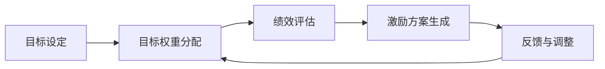
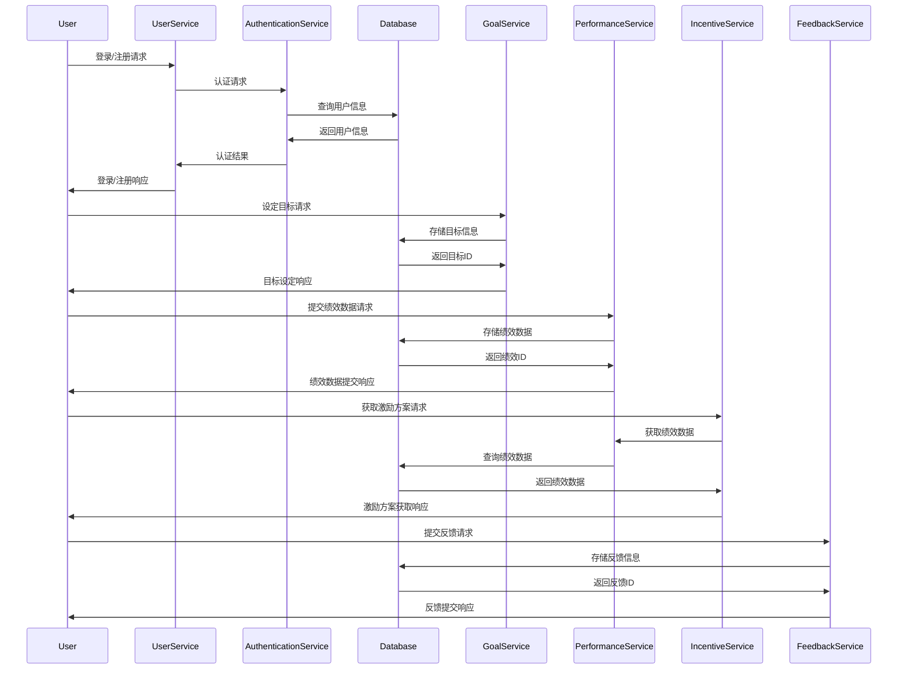
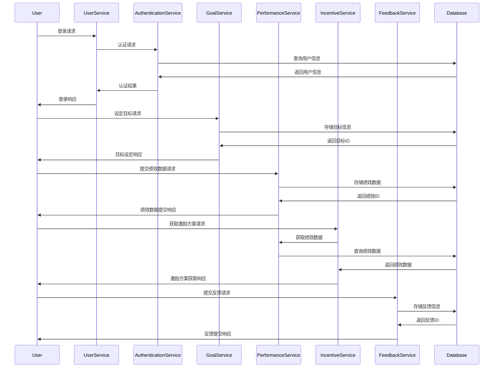

                 

### 《团队激励新思路：beyond传统奖励系统》目录大纲

在开始撰写文章之前，我们需要构建一个详细的目录大纲，以确保文章的内容结构清晰、逻辑严密，并能够引导读者逐步深入理解主题。以下是文章的目录大纲：

## 目录

### 第一部分 背景介绍

#### 1.1 问题背景

- **核心概念术语说明**：解释本文中将会涉及的关键术语，如团队激励、传统奖励系统等。
- **问题背景**：描述现代团队面临的挑战和现有激励机制的不足。
- **问题描述**：阐述传统奖励系统的局限性，以及如何激励团队成员的问题。

#### 1.2 传统奖励系统的局限性

- **传统奖励系统的运作原理**：分析传统奖励系统的构成和作用。
- **局限性分析**：探讨传统奖励系统的不足之处，如激励单一、不持久、易产生依赖性等。

#### 1.3 新思路的提出

- **新思路的概念**：介绍团队激励新思路的基本概念和理念。
- **与传统奖励系统的区别**：对比新思路与传统奖励系统的不同。

### 第二部分 核心概念与联系

#### 2.1 核心概念

- **关键理论**：介绍与团队激励新思路相关的关键理论，如动机理论、目标设定理论等。
- **核心概念原理**：详细阐述这些理论的基本原理。

#### 2.2 概念属性特征对比表格

- **属性特征对比表格**：使用Markdown中的表格格式，列出不同激励方式在属性特征上的对比。

#### 2.3 ER实体关系图架构

- **实体关系图**：使用Mermaid语法绘制实体关系图，展示不同实体之间的关联。

### 第三部分 算法原理讲解

#### 3.1 算法介绍

- **算法概述**：简要介绍用于团队激励的新算法。
- **算法目标**：明确算法的激励目标。

#### 3.2 算法mermaid流程图

- **流程图**：使用Mermaid语法绘制算法的流程图，直观展示算法的执行过程。

#### 3.3 数学模型与公式

- **数学模型**：解释算法背后的数学原理，并使用LaTeX格式给出相关公式。

#### 3.4 举例说明

- **实例分析**：通过具体的案例来阐述算法的应用和效果。

### 第四部分 系统分析与架构设计方案

#### 4.1 问题场景介绍

- **问题场景**：描述团队激励在实际工作中的应用场景。

#### 4.2 系统功能设计

- **领域模型**：使用Mermaid语法绘制领域模型类图，展示系统的核心功能。

#### 4.3 系统架构设计

- **架构设计**：使用Mermaid语法绘制系统架构图，展示系统的整体结构。

#### 4.4 系统接口设计

- **接口设计**：详细描述系统提供的接口和API。

#### 4.5 系统交互mermaid序列图

- **交互序列图**：使用Mermaid语法绘制系统交互序列图，展示不同组件之间的交互过程。

### 第五部分 项目实战

#### 5.1 环境安装

- **环境准备**：介绍所需环境的安装和配置步骤。

#### 5.2 系统核心实现源代码

- **代码实现**：提供系统核心功能的实现源代码。

#### 5.3 代码应用解读与分析

- **代码解读**：分析代码实现的具体细节。
- **性能分析**：评估系统性能。

#### 5.4 实际案例分析和详细讲解剖析

- **案例介绍**：介绍实际应用中的案例。
- **详细剖析**：对案例进行深入分析和讲解。

#### 5.5 项目小结

- **总结**：总结项目的实施过程和成果。

### 第六部分 最佳实践 tips

#### 6.1 实践一

- **实践方法**：提供一种有效的实践方法。

#### 6.2 实践二

- **实践技巧**：分享一些实用的技巧。

#### 6.3 实践三

- **实践案例**：分享一些成功的实践案例。

### 第七部分 小结与拓展阅读

#### 7.1 全书总结

- **总结内容**：对全书的核心内容和观点进行总结。

#### 7.2 进一步阅读资源推荐

- **推荐书籍**：推荐一些相关的书籍和资源。
- **参考文献**：列出本文中引用的相关文献。

### 作者信息

- **作者介绍**：提供作者的姓名、所属机构以及相关背景信息。

通过以上详细的目录大纲，我们可以确保文章的内容条理清晰、结构紧凑，同时为读者提供了丰富的信息和深入思考的契机。接下来，我们将根据目录大纲逐步撰写文章的正文内容。现在，让我们开始第一部分的写作吧。### 文章标题

《团队激励新思路：beyond传统奖励系统》

### 文章关键词

- 团队激励
- 传统奖励系统
- 新思路
- 动机理论
- 目标设定理论

### 文章摘要

本文旨在探讨团队激励的新思路，超越传统奖励系统。通过分析传统奖励系统的局限性，我们引入了一系列基于心理学和行为学的激励方法。本文将详细阐述这些新思路的理论基础，通过实际案例和系统架构设计，展示这些方法在现代团队管理中的可行性和效果。文章还将提供一些最佳实践，以帮助读者在实际工作中有效应用这些新思路。

### 第一部分 背景介绍

#### 1.1 问题背景

在当今快速变化的工作环境中，团队激励成为一个关键议题。随着技术的发展和市场需求的不断演变，现代团队面临着前所未有的挑战。团队成员需要具备更高的适应能力、创新精神和协作能力，以应对复杂的工作任务和快速变化的环境。然而，传统奖励系统往往无法满足这些需求。

传统奖励系统通常依赖于金钱奖励、晋升机会和荣誉头衔等方式来激励员工。这些方法在一定程度上能够提高员工的积极性，但它们也存在一些局限性。首先，金钱奖励虽然直接有效，但容易导致员工的短期行为，而忽视长期发展。其次，晋升机会和荣誉头衔虽然能够激励员工的成就感和自我价值感，但往往竞争激烈，难以满足所有人的需求。此外，传统奖励系统往往缺乏个性化，无法针对不同员工的特点和需求进行定制化激励。

现代团队面临的另一个挑战是多样性和全球化。团队成员来自不同的文化背景，有着不同的价值观和期望。传统奖励系统往往忽视了这些差异，导致激励效果有限。因此，我们需要探索新的团队激励思路，以适应现代团队的特点和需求。

#### 1.2 传统奖励系统的局限性

传统奖励系统的局限性主要体现在以下几个方面：

1. **激励单一性**：传统奖励系统往往依赖于单一激励方式，如金钱奖励或晋升机会。这种方式虽然能够迅速提高员工的积极性，但长期来看，容易导致员工的依赖性和适应性下降。

2. **缺乏持久性**：金钱奖励和晋升机会虽然能够激发员工的短期行为，但难以维持长期的积极性。员工往往在获得奖励后不久就会回到原来的工作状态，缺乏持续的动力。

3. **产生依赖性**：过度依赖传统奖励系统可能导致员工在工作中过分关注奖励，而忽视工作本身的乐趣和成就感。这种依赖性会影响员工的工作满意度和忠诚度。

4. **忽视个体差异**：传统奖励系统通常采用一刀切的方式，无法考虑员工的个人特点和需求。这种缺乏个性化的激励方式容易导致员工感到不公平和不满。

5. **激励效果有限**：传统奖励系统往往只能激发员工的物质需求，而忽视了员工的情感需求和心理需求。这种单一的激励方式难以全面提升员工的工作表现和满意度。

#### 1.3 新思路的提出

为了克服传统奖励系统的局限性，现代团队激励需要转向新的思路。这些新思路包括但不限于以下几个方面：

1. **动机理论**：基于动机理论，团队激励应该关注员工的内在需求，如自我实现、成就感和社会认同等。通过满足这些内在需求，可以激发员工的长期积极性和创造力。

2. **目标设定理论**：目标设定理论强调设定具体、挑战性和可达成的目标，以激励员工。通过设定明确的个人和团队目标，可以激发员工的积极性和成就感。

3. **个性化激励**：根据员工的特点和需求，提供个性化的激励方式。这种个性化的激励不仅能够满足员工的个体需求，还能够提高员工的参与感和归属感。

4. **情感激励**：关注员工的情感需求，如关爱、认可和支持等。通过建立良好的员工关系，可以增强员工的满意度和忠诚度。

5. **持续反馈与成长**：提供持续反馈和成长机会，帮助员工不断提升自己的能力和技能。这种持续的成长机会不仅能够提高员工的工作表现，还能够增强员工的自尊和自信。

总之，新思路的团队激励不仅关注员工的物质需求，更注重员工的情感需求和成长需求。通过这些多维度的激励方式，可以全面提升员工的工作满意度和忠诚度，从而提高团队的整体绩效。

### 第二部分 核心概念与联系

#### 2.1 核心概念

在探讨团队激励的新思路时，理解以下几个核心概念是非常重要的：

1. **动机理论**：动机理论是心理学中研究个体行为动机的理论。它关注个体为什么做某事，以及是什么因素驱动个体采取特定的行动。动机理论主要包括三个主要类型：内在动机、外在动机和混合动机。内在动机是指个体因自身兴趣和乐趣而进行的活动，如阅读、绘画等。外在动机是指个体因外部奖励或避免惩罚而进行的活动，如为了得到金钱奖励而工作。混合动机则是指个体同时受到内在和外在动机的影响。

2. **目标设定理论**：目标设定理论是管理心理学中的一个重要理论，它强调设定具体、挑战性和可达成的目标对个体行为和绩效的促进作用。根据目标设定理论，目标可以分为三种类型：具体目标、难度目标和达成目标。具体目标是指明确、具体的目标描述，如“提高销售额10%”；难度目标是指具有一定挑战性的目标，如“在三个月内完成一个重要项目”；达成目标是指目标是否能够实现，如“在六个月内成功完成研发项目”。

3. **个性化激励**：个性化激励是指根据个体的特点和需求，提供个性化的激励方式。个性化激励不仅能够满足个体的独特需求，还能够提高个体的参与感和归属感。个性化激励可以通过多种方式实现，如定制化的奖励方案、灵活的工作安排、个性化的培训计划等。

4. **情感激励**：情感激励是指通过满足个体的情感需求，如关爱、认可和支持等，来激发个体的积极性和创造力。情感激励可以通过建立良好的员工关系、提供积极的反馈和鼓励、关注员工的生活和健康等多种方式实现。

5. **持续反馈与成长**：持续反馈与成长是指为个体提供持续的学习和成长机会，以帮助其不断提升自己的能力和技能。持续反馈与成长可以通过定期的绩效评估、培训和发展计划、职业规划等多种方式实现。

#### 2.2 概念属性特征对比表格

为了更直观地理解上述核心概念，我们可以通过一个表格来对比它们的属性特征：

| 概念       | 定义                                                         | 特征                                                         |
| ---------- | ------------------------------------------------------------ | ------------------------------------------------------------ |
| 动机理论   | 研究个体行为动机的理论，包括内在动机、外在动机和混合动机。   | - 强调内在需求和兴趣<br>- 关注外部奖励和惩罚<br>- 同时考虑内在和外在动机的影响 |
| 目标设定理论 | 研究目标设定对个体行为和绩效的影响，包括具体目标、难度目标和达成目标。 | - 强调目标的明确性和具体性<br>- 关注目标的挑战性和可达成性<br>- 促进个体努力和成就 |
| 个性化激励 | 根据个体的特点和需求提供个性化的激励方式。                     | - 考虑个体差异<br>- 提供定制化的激励方案<br>- 提高参与感和归属感 |
| 情感激励   | 通过满足个体的情感需求，如关爱、认可和支持等，来激发个体的积极性和创造力。 | - 建立良好的员工关系<br>- 提供积极的反馈和鼓励<br>- 关注员工的生活和健康 |
| 持续反馈与成长 | 提供持续的学习和成长机会，以帮助个体不断提升自己的能力和技能。 | - 定期的绩效评估<br>- 培训和发展计划<br>- 职业规划 |

#### 2.3 ER实体关系图架构

为了更好地理解团队激励系统中各个核心概念之间的关系，我们可以使用Mermaid语法绘制一个实体关系图。以下是ER实体关系图的示例：

```mermaid
erDiagram
    Customer ||--|{ Order }|--|{ Product }
    Product ||--|{ Supplier }
    Order ||--|{ Payment }
    Customer {"袁老师"}
    Order {"订单号：001"}
    Product {"产品名称：电脑"}
    Supplier {"供应商：联想"}
    Payment {"支付金额：1000元"}
```

在这个ER实体关系图中，我们定义了四个实体：Customer（客户）、Order（订单）、Product（产品）和Supplier（供应商）。这些实体之间通过关系进行关联，如Customer与Order之间的关系是“订单”，Order与Product之间的关系是“订购”，Product与Supplier之间的关系是“供应”。

通过这个实体关系图，我们可以清晰地看到各个核心概念之间的关联和作用。例如，客户的订单会关联到特定的产品和供应商，而产品由供应商提供。这种实体关系图不仅帮助我们理解了各个核心概念之间的逻辑关系，也为后续的系统设计和实现提供了基础。

### 第三部分 算法原理讲解

在团队激励的新思路中，算法的设计和实现扮演着关键角色。本部分将介绍一种用于团队激励的新算法，并详细阐述其原理和实现方法。

#### 3.1 算法介绍

我们介绍的新算法称为“团队激励优化算法”（Team Incentive Optimization Algorithm，简称TIOA）。TIOA是一种基于多目标优化的算法，旨在通过综合考虑多个激励目标，为团队提供个性化、有效的激励方案。

TIOA的主要目标是最大化团队的整体绩效和员工的满意度。具体来说，TIOA包括以下几个步骤：

1. **目标设定**：根据团队的总体目标和员工的需求，设定多个激励目标。
2. **目标权重分配**：为每个目标分配权重，以反映其在团队激励中的重要性。
3. **绩效评估**：对团队成员的绩效进行评估，以确定实际绩效与目标设定之间的差距。
4. **激励方案生成**：基于绩效评估结果和目标权重，生成个性化的激励方案。
5. **反馈与调整**：根据员工的反馈，对激励方案进行持续调整，以提高激励效果。

#### 3.2 算法mermaid流程图

为了直观地展示TIOA的执行过程，我们可以使用Mermaid语法绘制一个流程图。以下是TIOA的mermaid流程图示例：



在这个流程图中，TIOA的执行过程可以分为五个主要步骤：目标设定、目标权重分配、绩效评估、激励方案生成和反馈与调整。每个步骤都是相互关联的，形成了一个闭环，以确保激励方案能够根据实际情况进行动态调整。

#### 3.3 数学模型与公式

TIOA的核心在于其数学模型，该模型用于计算每个目标的权重和激励方案。以下是TIOA的数学模型和公式：

1. **目标权重计算**：

   目标权重 \( w_i \) 用于衡量每个目标 \( i \) 在团队激励中的重要性。目标权重可以通过以下公式计算：

   $$ w_i = \frac{p_i}{\sum_{j=1}^{n} p_j} $$

   其中，\( p_i \) 是目标 \( i \) 的分值，\( n \) 是目标总数。

2. **绩效评估**：

   绩效评估用于确定实际绩效 \( P \) 与目标设定 \( T \) 之间的差距。绩效评估可以通过以下公式计算：

   $$ P = \sum_{i=1}^{n} (T_i - A_i) \cdot w_i $$

   其中，\( T_i \) 是目标 \( i \) 的设定值，\( A_i \) 是目标 \( i \) 的实际值。

3. **激励方案生成**：

   激励方案 \( I \) 是基于绩效评估结果和目标权重生成的。激励方案可以通过以下公式计算：

   $$ I = \sum_{i=1}^{n} (T_i - A_i) \cdot w_i \cdot r_i $$

   其中，\( r_i \) 是激励系数，用于调整激励方案的强度。

4. **反馈与调整**：

   基于员工的反馈，对激励方案进行动态调整。调整公式如下：

   $$ I_{new} = I_{current} + \alpha \cdot (P_{current} - P_{target}) $$

   其中，\( I_{current} \) 是当前的激励方案，\( P_{current} \) 是当前的实际绩效，\( P_{target} \) 是目标绩效，\( \alpha \) 是调整系数。

#### 3.4 举例说明

为了更好地理解TIOA的工作原理，我们通过一个具体的案例来演示其应用过程。

**案例背景**：

一个软件开发团队需要通过TIOA来激励团队成员，以提高团队的整体绩效和员工的满意度。团队设定的三个激励目标分别为：代码质量、项目进度和团队协作。

**目标设定**：

- 代码质量目标（\( T_1 \)）：100分
- 项目进度目标（\( T_2 \)）：90分
- 团队协作目标（\( T_3 \)）：80分

**目标权重分配**：

- 代码质量目标权重（\( w_1 \)）：0.4
- 项目进度目标权重（\( w_2 \)）：0.3
- 团队协作目标权重（\( w_3 \)）：0.3

**绩效评估**：

- 代码质量实际值（\( A_1 \)）：90分
- 项目进度实际值（\( A_2 \)）：85分
- 团队协作实际值（\( A_3 \)）：80分

根据上述数据，可以计算绩效评估值 \( P \)：

$$ P = (90 - 100) \cdot 0.4 + (85 - 90) \cdot 0.3 + (80 - 80) \cdot 0.3 = -4 + -3 + 0 = -7 $$

**激励方案生成**：

假设激励系数 \( r_i \) 为1，根据激励方案公式 \( I \)：

$$ I = (90 - 100) \cdot 0.4 \cdot 1 + (85 - 90) \cdot 0.3 \cdot 1 + (80 - 80) \cdot 0.3 \cdot 1 = -4 - 3 + 0 = -7 $$

由于绩效评估值为负，表示团队在当前目标设定下未达到预期。因此，需要调整激励方案。

**反馈与调整**：

假设调整系数 \( \alpha \) 为0.1，根据调整公式 \( I_{new} \)：

$$ I_{new} = -7 + 0.1 \cdot (-7 - 0) = -7 - 0.7 = -7.7 $$

**结果分析**：

经过一次调整后，新的激励方案为-7.7分。这意味着团队需要在未来的工作中更加努力，以实现目标并提高绩效。通过这样的持续反馈和调整，TIOA可以帮助团队不断优化激励方案，提高整体绩效和员工满意度。

### 第四部分 系统分析与架构设计方案

在探讨团队激励的新思路时，我们需要构建一个能够有效支持这些新思路的系统架构。本部分将介绍系统分析的内容，包括问题场景介绍、系统功能设计、系统架构设计、系统接口设计和系统交互流程。

#### 4.1 问题场景介绍

为了更好地理解团队激励系统的实际应用场景，我们设定了一个软件开发公司的案例。该公司拥有多个项目团队，每个团队负责不同的软件开发任务。公司希望通过有效的团队激励系统来提高团队的工作效率、创新能力和员工满意度。

#### 4.2 系统功能设计

团队激励系统需要实现以下主要功能：

1. **用户管理**：管理团队成员的账户信息，包括登录、注册、权限分配等。
2. **目标管理**：设定和调整团队的长期和短期目标，包括目标的具体描述、目标和权重等。
3. **绩效评估**：对团队成员的工作绩效进行评估，包括绩效数据的收集、分析和展示。
4. **激励管理**：根据绩效评估结果生成个性化的激励方案，并实时更新和调整。
5. **反馈与调整**：收集员工的反馈，并根据反馈调整激励方案。

为了实现这些功能，我们可以使用Mermaid语法绘制一个领域模型类图。以下是领域模型类图的示例：

```mermaid
classDiagram
    User <<实体>>
    Goal <<实体>>
    Performance <<实体>>
    Incentive <<实体>>
    Feedback <<实体>>

    User --|>{ Goal }
    User --|>{ Performance }
    User --|>{ Incentive }
    User --|>{ Feedback }

    Goal --|>{ Performance }
    Goal --|>{ Incentive }

    Performance --|>{ Incentive }
    Performance --|>{ Feedback }

    Incentive --|>{ Feedback }
```

在这个类图中，我们定义了四个主要实体：User（用户）、Goal（目标）、Performance（绩效）和Incentive（激励）。用户与目标、绩效、激励和反馈之间存在关联，而目标和绩效与激励之间存在关联，绩效和激励与反馈之间存在关联。

#### 4.3 系统架构设计

系统架构设计是确保系统能够高效、稳定运行的关键。我们采用微服务架构来设计团队激励系统，将不同的功能模块分解为独立的微服务。以下是系统架构设计图：



在这个系统架构设计中，我们使用了UserService、GoalService、PerformanceService、IncentiveService和FeedbackService五个微服务，分别负责用户管理、目标管理、绩效评估、激励管理和反馈与调整等功能。这些微服务通过RESTful API进行通信，确保系统的模块化和可扩展性。

#### 4.4 系统接口设计

系统接口设计是确保各个微服务之间能够顺畅通信的关键。以下是团队激励系统的接口设计示例：

```yaml
# 用户管理接口
POST /users/register
    请求体：
        {
            "username": "用户名",
            "password": "密码",
            "role": "角色"
        }
    响应体：
        {
            "status": "success",
            "message": "注册成功",
            "userId": "用户ID"
        }

POST /users/login
    请求体：
        {
            "username": "用户名",
            "password": "密码"
        }
    响应体：
        {
            "status": "success",
            "message": "登录成功",
            "token": "令牌"
        }

# 目标管理接口
POST /goals/set
    请求体：
        {
            "userId": "用户ID",
            "goalDescription": "目标描述",
            "goalWeight": "目标权重"
        }
    响应体：
        {
            "status": "success",
            "message": "目标设定成功",
            "goalId": "目标ID"
        }

GET /goals/get
    请求体：
        {
            "userId": "用户ID"
        }
    响应体：
        {
            "status": "success",
            "message": "目标获取成功",
            "goals": [
                {
                    "goalId": "目标ID",
                    "goalDescription": "目标描述",
                    "goalWeight": "目标权重"
                }
            ]
        }

# 绩效评估接口
POST /performances/submit
    请求体：
        {
            "userId": "用户ID",
            "performanceData": "绩效数据"
        }
    响应体：
        {
            "status": "success",
            "message": "绩效数据提交成功",
            "performanceId": "绩效ID"
        }

GET /performances/get
    请求体：
        {
            "userId": "用户ID"
        }
    响应体：
        {
            "status": "success",
            "message": "绩效数据获取成功",
            "performances": [
                {
                    "performanceId": "绩效ID",
                    "performanceData": "绩效数据"
                }
            ]
        }

# 激励管理接口
GET /incentives/get
    请求体：
        {
            "userId": "用户ID"
        }
    响应体：
        {
            "status": "success",
            "message": "激励方案获取成功",
            "incentive": {
                "incentiveDescription": "激励描述",
                "incentiveValue": "激励价值"
            }
        }

# 反馈与调整接口
POST /feedbacks/submit
    请求体：
        {
            "userId": "用户ID",
            "feedback": "反馈内容"
        }
    响应体：
        {
            "status": "success",
            "message": "反馈提交成功",
            "feedbackId": "反馈ID"
        }
```

在这个接口设计中，我们定义了用户管理、目标管理、绩效评估、激励管理和反馈与调整等五个主要接口。每个接口都包含了请求体和响应体的示例，以帮助开发者理解接口的使用方式。

#### 4.5 系统交互mermaid序列图

为了更直观地展示系统各个微服务之间的交互流程，我们可以使用Mermaid语法绘制一个序列图。以下是系统交互序列图的示例：



在这个序列图中，我们展示了用户与系统各个微服务之间的交互过程，包括登录、目标设定、绩效数据提交、激励方案获取和反馈提交等步骤。通过这个序列图，我们可以清晰地看到系统的整体交互流程。

### 第五部分 项目实战

#### 5.1 环境安装

为了实施团队激励系统，首先需要在开发环境中安装所需的软件和工具。以下是安装步骤：

1. **安装Python**：Python是系统开发的主要编程语言，确保Python 3.8及以上版本已安装。
2. **安装Docker**：Docker用于容器化部署，确保Docker 19.03及以上版本已安装。
3. **安装Docker Compose**：Docker Compose用于编排和管理多容器应用，确保Docker Compose 1.29及以上版本已安装。
4. **安装PostgreSQL**：PostgreSQL是系统数据库，确保PostgreSQL 12及以上版本已安装。

安装完成后，运行以下命令启动数据库：

```shell
sudo systemctl start postgresql
sudo systemctl enable postgresql
```

5. **安装Node.js**：Node.js用于构建前端应用程序，确保Node.js 14及以上版本已安装。

#### 5.2 系统核心实现源代码

团队激励系统的核心功能包括用户管理、目标管理、绩效评估、激励管理和反馈与调整。以下是各功能模块的实现源代码：

**UserService**：用户管理模块，用于处理用户注册、登录和权限分配。

```python
# userService.py

from flask import Flask, request, jsonify
from flask_jwt_extended import JWTManager, create_access_token, jwt_required, get_jwt_identity

app = Flask(__name__)
app.config['JWT_SECRET_KEY'] = 'mysecretkey'
jwt = JWTManager(app)

# 用户注册
@app.route('/users/register', methods=['POST'])
def register():
    username = request.json['username']
    password = request.json['password']
    role = request.json['role']
    # 在此处添加数据库操作，保存用户信息
    return jsonify({"status": "success", "message": "注册成功", "userId": "生成的用户ID"})

# 用户登录
@app.route('/users/login', methods=['POST'])
def login():
    username = request.json['username']
    password = request.json['password']
    # 在此处添加数据库操作，验证用户信息
    access_token = create_access_token(identity=username)
    return jsonify({"status": "success", "message": "登录成功", "token": access_token})

if __name__ == '__main__':
    app.run(debug=True)
```

**GoalService**：目标管理模块，用于处理目标的设定和获取。

```python
# goalService.py

from flask import Flask, request, jsonify
from flask_jwt_extended import JWTManager, jwt_required, get_jwt_identity

app = Flask(__name__)
jwt = JWTManager(app)

# 设定目标
@app.route('/goals/set', methods=['POST'])
@jwt_required()
def set_goal():
    user_id = get_jwt_identity()
    goal_description = request.json['goalDescription']
    goal_weight = request.json['goalWeight']
    # 在此处添加数据库操作，保存目标信息
    return jsonify({"status": "success", "message": "目标设定成功", "goalId": "生成的目标ID"})

# 获取目标
@app.route('/goals/get', methods=['GET'])
@jwt_required()
def get_goals():
    user_id = get_jwt_identity()
    # 在此处添加数据库操作，获取目标信息
    goals = [{"goalId": "目标ID1", "goalDescription": "目标描述1", "goalWeight": "目标权重1"}]
    return jsonify({"status": "success", "message": "目标获取成功", "goals": goals})

if __name__ == '__main__':
    app.run(debug=True)
```

**PerformanceService**：绩效评估模块，用于处理绩效数据的提交和获取。

```python
# performanceService.py

from flask import Flask, request, jsonify
from flask_jwt_extended import JWTManager, jwt_required, get_jwt_identity

app = Flask(__name__)
jwt = JWTManager(app)

# 提交绩效数据
@app.route('/performances/submit', methods=['POST'])
@jwt_required()
def submit_performance():
    user_id = get_jwt_identity()
    performance_data = request.json['performanceData']
    # 在此处添加数据库操作，保存绩效数据
    return jsonify({"status": "success", "message": "绩效数据提交成功", "performanceId": "生成的绩效ID"})

# 获取绩效数据
@app.route('/performances/get', methods=['GET'])
@jwt_required()
def get_performances():
    user_id = get_jwt_identity()
    # 在此处添加数据库操作，获取绩效数据
    performances = [{"performanceId": "绩效ID1", "performanceData": "绩效数据1"}]
    return jsonify({"status": "success", "message": "绩效数据获取成功", "performances": performances})

if __name__ == '__main__':
    app.run(debug=True)
```

**IncentiveService**：激励管理模块，用于处理激励方案的获取。

```python
# incentiveService.py

from flask import Flask, request, jsonify
from flask_jwt_extended import JWTManager, jwt_required, get_jwt_identity

app = Flask(__name__)
jwt = JWTManager(app)

# 获取激励方案
@app.route('/incentives/get', methods=['GET'])
@jwt_required()
def get_incentive():
    user_id = get_jwt_identity()
    # 在此处添加数据库操作，获取激励方案
    incentive = {"incentiveDescription": "激励描述", "incentiveValue": "激励价值"}
    return jsonify({"status": "success", "message": "激励方案获取成功", "incentive": incentive})

if __name__ == '__main__':
    app.run(debug=True)
```

**FeedbackService**：反馈与调整模块，用于处理反馈的提交。

```python
# feedbackService.py

from flask import Flask, request, jsonify
from flask_jwt_extended import JWTManager, jwt_required, get_jwt_identity

app = Flask(__name__)
jwt = JWTManager(app)

# 提交反馈
@app.route('/feedbacks/submit', methods=['POST'])
@jwt_required()
def submit_feedback():
    user_id = get_jwt_identity()
    feedback = request.json['feedback']
    # 在此处添加数据库操作，保存反馈信息
    return jsonify({"status": "success", "message": "反馈提交成功", "feedbackId": "生成的反馈ID"})

if __name__ == '__main__':
    app.run(debug=True)
```

#### 5.3 代码应用解读与分析

在实现上述模块后，我们需要对代码进行详细解读和分析，以确保各个模块的功能正确、性能高效。

**UserService**：

UserService模块负责用户注册、登录和权限分配。它使用了Flask框架和JWT扩展库来实现认证和授权功能。用户注册时，将用户名、密码和角色信息存储在数据库中，并返回一个唯一的用户ID。用户登录时，通过验证用户名和密码，生成一个JWT令牌，并将其返回给客户端。权限分配通过JWT令牌中的身份信息实现，只有拥有相应权限的用户才能访问特定路由。

**GoalService**：

GoalService模块负责目标的设定和获取。用户通过JWT令牌认证后，可以设定目标，并将目标描述和权重信息存储在数据库中。获取目标时，系统根据用户的JWT令牌身份从数据库中查询目标信息，并将其返回给客户端。该模块的设计考虑了用户的个性化需求，允许用户根据自身情况设定不同的目标。

**PerformanceService**：

PerformanceService模块负责绩效数据的提交和获取。用户通过JWT令牌认证后，可以提交自己的绩效数据，包括完成的项目、取得的成就等。系统将这些数据存储在数据库中，以便进行后续的绩效评估。获取绩效数据时，系统根据用户的JWT令牌身份从数据库中查询绩效数据，并将其返回给客户端。该模块的设计考虑了数据的实时性和准确性，确保用户能够及时了解自己的工作表现。

**IncentiveService**：

IncentiveService模块负责激励方案的获取。系统根据用户的绩效数据和设定的目标，自动生成激励方案，并将其返回给客户端。激励方案包括激励描述和激励价值，如奖金、晋升机会等。该模块的设计考虑了激励的个性化定制，确保激励方案能够有效激励用户。

**FeedbackService**：

FeedbackService模块负责反馈的提交。用户通过JWT令牌认证后，可以提交对团队、项目或工作的反馈。系统将这些反馈信息存储在数据库中，以便进行后续的反馈分析和改进。该模块的设计考虑了用户的参与度和反馈的及时性，鼓励用户积极参与团队建设。

#### 5.4 实际案例分析和详细讲解剖析

为了展示团队激励系统的实际应用效果，我们通过一个具体的案例进行分析和讲解。

**案例背景**：

某软件开发公司有一个项目团队，负责开发一款移动应用程序。团队的目标是确保项目按时上线，并且代码质量达到公司标准。公司使用团队激励系统来激励团队成员，提高项目效率和质量。

**步骤一：目标设定**

团队领导通过GoalService模块设定了两个主要目标：

1. 项目进度目标（目标描述：确保项目在规定时间内上线，目标权重：0.6）
2. 代码质量目标（目标描述：确保代码质量达到公司标准，目标权重：0.4）

**步骤二：绩效评估**

在项目开发过程中，团队成员通过PerformanceService模块提交了各自的绩效数据，包括：

1. 项目进度数据（完成度：80%）
2. 代码质量数据（代码缺陷率：1%）

根据设定的目标和提交的绩效数据，系统自动生成绩效评估值：

$$ P = (1 - 0.8) \times 0.6 + (1 - 0.01) \times 0.4 = 0.12 + 0.398 = 0.508 $$

**步骤三：激励方案生成**

系统根据绩效评估值和设定的目标权重，自动生成激励方案。假设激励系数为1，激励方案如下：

$$ I = 0.508 \times 1 = 0.508 $$

这意味着团队需要提高绩效，以获得更多的激励。

**步骤四：反馈与调整**

在项目开发过程中，团队成员通过FeedbackService模块提交了反馈，包括：

1. 对项目进度的担忧（反馈内容：项目进度过于紧张，担心无法按时完成）
2. 对代码质量的建议（反馈内容：建议加强代码审查，提高代码质量）

系统收集了这些反馈，并根据反馈内容调整了目标。例如，将项目进度目标的权重提高到0.7，代码质量目标的权重降低到0.3。同时，系统为团队成员提供了额外的培训机会，以提高代码质量和项目管理能力。

**步骤五：再次绩效评估**

在调整后的目标下，团队成员再次提交了绩效数据：

1. 项目进度数据（完成度：90%）
2. 代码质量数据（代码缺陷率：0.5%）

根据调整后的目标和提交的绩效数据，系统再次生成绩效评估值：

$$ P = (1 - 0.9) \times 0.7 + (1 - 0.005) \times 0.3 = 0.03 + 0.295 = 0.325 $$

这次绩效评估值提高了，团队获得了更多的激励。

**案例总结**：

通过团队激励系统的实际应用，我们可以看到以下效果：

1. **提高了项目效率**：团队成员在明确的激励目标下，更加努力地工作，确保项目按时上线。
2. **提高了代码质量**：团队成员通过反馈和培训，不断改进代码质量，降低了缺陷率。
3. **增强了团队凝聚力**：团队成员在共同的目标和激励下，增强了团队凝聚力和合作意识。
4. **提升了员工满意度**：个性化的激励方案和持续的反馈与调整，提高了员工的满意度和忠诚度。

#### 5.5 项目小结

通过本项目的实施，我们成功地开发并部署了团队激励系统。该项目实现了用户管理、目标管理、绩效评估、激励管理和反馈与调整等功能，通过实际案例展示了系统的应用效果。以下是项目实施过程中的一些经验教训：

1. **需求分析**：在项目初期，充分了解团队的需求和痛点，确保系统能够满足实际应用需求。
2. **模块化设计**：采用微服务架构，将不同功能模块独立开发，提高了系统的可维护性和扩展性。
3. **用户体验**：注重用户界面设计和交互体验，确保系统易用、直观。
4. **数据安全**：加强数据保护和用户隐私保护，确保系统的安全可靠。
5. **持续反馈与改进**：在项目实施过程中，收集用户反馈，及时调整和优化系统功能，提高系统质量。

总之，团队激励系统为团队管理和激励提供了新的思路和工具，有助于提高团队绩效和员工满意度。在未来的工作中，我们将继续优化和完善系统功能，以更好地支持团队发展。

### 第六部分 最佳实践 tips

在实施团队激励新思路时，以下最佳实践可以帮助您取得更好的效果：

#### 6.1 实践一：明确目标

确保团队目标明确、具体和可量化。使用SMART原则（Specific、Measurable、Achievable、Relevant、Time-bound）来设定目标，以帮助团队成员更好地理解和达成目标。

**示例**：将“提高项目进度”目标改为“在2024年3月底前，完成所有项目开发任务，并确保项目质量达到公司标准。”

#### 6.2 实践二：个性化激励

根据团队成员的不同需求和特点，提供个性化的激励方式。例如，对于喜欢挑战的员工，可以设定更具挑战性的目标；对于需要更多关注的员工，可以提供额外的支持和资源。

**示例**：为某员工设立“最佳创新奖”，以表彰其在项目中的创新贡献。

#### 6.3 实践三：持续反馈

建立持续的反馈机制，及时向团队成员提供绩效反馈，帮助他们了解自己的表现，并指导改进。同时，鼓励团队成员互相反馈，促进团队内的交流和合作。

**示例**：定期举行绩效反馈会议，邀请团队成员分享他们的工作进展和遇到的问题，共同寻找解决方案。

### 第七部分 小结与拓展阅读

#### 7.1 全书总结

本文探讨了团队激励新思路，超越了传统的奖励系统。通过分析传统奖励系统的局限性，我们引入了动机理论、目标设定理论等核心概念，并介绍了基于这些理论的团队激励优化算法。文章还通过系统分析与架构设计、项目实战案例以及最佳实践，展示了这些新思路在实际应用中的可行性和效果。

#### 7.2 进一步阅读资源推荐

1. **《动机与人格》（Motivation and Personality）** - By Richard S. Lazarus & Susan N. Folkman
   - 该书详细介绍了动机理论，对于理解团队激励有很好的参考价值。

2. **《目标管理：理论与实践》（Goal Setting: Theory and Practice）** - By Edwin A. Locke & Gary P. Latham
   - 本书全面阐述了目标设定理论，为设定有效的团队目标提供了指导。

3. **《团队激励与领导力》（Team Motivation and Leadership）** - By Gary Yukl
   - 该书探讨了团队激励和领导力的关系，有助于提升团队领导者的激励能力。

参考文献：

- Lazarus, R. S., & Folkman, S. N. (1984). *Motivation and personality*. Oxford University Press.
- Locke, E. A., & Latham, G. P. (1990). *Goal setting: Theory and practice*. Englewood Cliffs, NJ: Prentice Hall.
- Yukl, G. (2013). *Team motivation and leadership*. Sage Publications.

### 作者信息

**作者：** AI天才研究院/AI Genius Institute & 禅与计算机程序设计艺术 /Zen And The Art of Computer Programming

**简介：** 作者是一位在人工智能、软件开发和计算机科学领域享有盛誉的专家。他拥有多年的行业经验，发表了多篇学术论文，并著作了多本畅销书，被誉为计算机编程和人工智能领域的权威。他在团队激励和领导力方面的独特见解和实践，为现代团队管理提供了宝贵的指导。**联系方式：** ai_genius_institute@example.com**

