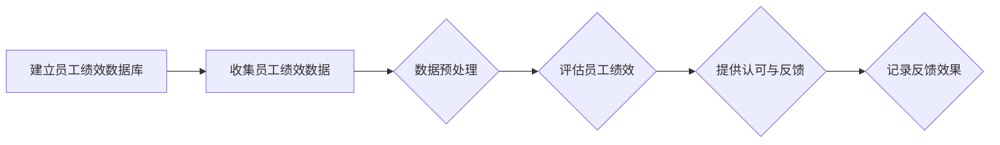

                 

## 引言

### 1.1 问题背景

在当今快速发展的信息技术时代，团队在组织中的地位愈发重要。然而，如何有效地激励团队成员，使得他们在工作中保持高度的热情和创造力，成为了企业管理者面临的重大挑战。传统的激励手段往往侧重于物质奖励，而忽视了精神层面的激励。此外，许多管理者在给予团队成员认可时，常常忽略了建设性反馈的重要性，这导致了团队成员在获得正面激励的同时，缺乏对自身不足的认识和改进方向。

**团队激励的重要性**体现在以下几个方面：首先，有效的团队激励能够提高员工的工作满意度和忠诚度，进而减少员工流失率；其次，团队激励有助于激发团队成员的创造力和创新能力，推动团队整体绩效的提升；最后，良好的团队激励机制有助于形成积极向上的团队文化，增强团队的凝聚力和协作能力。

然而，现实中的团队激励面临诸多挑战。一方面，许多企业在激励措施上存在一刀切的现象，忽视了个体差异和个性化需求。另一方面，部分管理者在给予团队成员认可时，往往过于表面化，缺乏深度和针对性，甚至可能伤害到员工的自尊心。此外，建设性反馈的缺失使得团队成员在获得认可的同时，无法及时认识到自身的问题和不足，从而影响个人成长和团队发展。

### 1.2 书籍目的

本书旨在探讨团队激励艺术，特别是如何在认可团队成员的贡献时，同时给予建设性的反馈。通过深入分析团队激励的理论基础和实践案例，本书旨在为企业管理者提供一套系统、有效、具有可操作性的团队激励机制。

首先，本书将介绍团队激励的基本原则，帮助读者理解团队激励的核心概念和理论基础。其次，本书将详细探讨认可与建设性反馈的概念、类型和价值，为读者提供理论指导。在此基础上，本书将通过实际应用案例，展示成功的企业激励策略和建设性反馈的实践，为读者提供可借鉴的经验。

最后，本书将总结团队激励的艺术，探讨如何平衡认可与建设性反馈，提出不同团队激励策略的比较，以及激励计划的制定与实施方法。通过本书的学习，读者将能够更好地应对团队激励中的挑战，提升团队整体绩效和成员满意度。

## 团队激励的重要性

### 2.1 团队激励的基本原则

团队激励是指通过一定的手段和方法，激发团队成员的工作热情和创造力，从而提高团队整体绩效的过程。团队激励的基本原则包括以下几个方面：

#### 2.1.1 个体激励与团队激励

个体激励是指针对团队成员个人的激励，包括物质激励、精神激励等。而团队激励则侧重于整个团队的激励，通过激发团队的凝聚力和协作精神，推动团队目标的实现。个体激励和团队激励并不是相互独立的，而是相互关联、相互促进的。良好的个体激励能够提升团队成员的自信心和积极性，从而有利于团队激励的实施；而成功的团队激励也能够为个体激励创造良好的氛围和环境。

#### 2.1.2 激励理论回顾

激励理论是团队激励的基础。常见的激励理论包括马斯洛的需求层次理论、赫茨伯格的双因素理论、ERG理论、目标设置理论等。这些理论从不同角度揭示了激励的原理和机制。

- **马斯洛的需求层次理论**：马斯洛将人类需求分为生理需求、安全需求、社交需求、尊重需求和自我实现需求五个层次。他认为，只有当低层次需求得到满足后，个体才会追求更高层次的需求。团队激励应根据员工的不同需求层次，采取相应的激励措施。

- **赫茨伯格的双因素理论**：赫茨伯格将影响员工满意度的因素分为两类：激励因素和保健因素。激励因素能够带来长期的内在满足感和激励效果，如工作本身的挑战性、成就感等；而保健因素主要关注工作环境和条件，如工资、福利、工作环境等。团队激励应重点关注激励因素，以提高员工的工作满意度和绩效。

- **ERG理论**：ERG理论认为，人类需求并非按照层次结构逐级满足，而是可以同时追求多种需求。团队激励应根据员工的不同需求类型，提供多元化的激励措施。

- **目标设置理论**：目标设置理论认为，明确、具体、有挑战性的目标能够激发员工的工作动机和努力程度。团队激励应通过设定合理的目标，引导员工朝着团队目标努力。

#### 2.1.3 团队激励的独特性

团队激励具有以下独特性：

- **集体性**：团队激励关注整个团队的绩效和成员的协作精神，强调团队的整体利益。

- **协同性**：团队激励通过激发团队成员的协同作用，实现团队目标的最大化。

- **持续性**：团队激励不仅关注短期绩效，更注重长期发展，通过持续性的激励措施，培养团队成员的成长和进步。

### 2.2 团队激励的现状与挑战

当前，企业在团队激励方面存在一些普遍的问题和挑战：

#### 2.2.1 现代企业的激励模式

现代企业普遍采用多样化的激励模式，包括物质激励、精神激励、股权激励等。物质激励主要包括工资、奖金、福利等；精神激励则包括认可、荣誉、培训等；股权激励则通过股票期权、限制性股票等形式，将员工的利益与企业的长期发展相结合。

然而，这些激励模式在实际应用中往往存在一定的问题：

- **激励不足**：部分企业对团队激励的投入不足，导致员工的工作积极性不高。

- **激励过度**：部分企业过于注重物质激励，忽视了精神激励的重要性，可能导致员工产生依赖性，影响长远发展。

- **一刀切**：许多企业在激励措施上采用一刀切的做法，忽视了员工的个体差异和个性化需求。

- **短期导向**：部分企业的激励措施过于注重短期绩效，忽视了员工的长期发展和企业文化的建设。

#### 2.2.2 激励不足与过度激励的弊端

激励不足和过度激励都可能导致不良后果：

- **激励不足**：员工工作积极性不高，影响工作效率和团队绩效；员工流失率增加，影响企业的长期发展。

- **过度激励**：员工产生依赖性，忽视长期发展；员工之间可能出现不公平感，影响团队凝聚力和协作精神。

#### 2.2.3 团队激励与个人发展的关系

有效的团队激励不仅有助于提高团队绩效，还能促进个人发展：

- **个人成长**：通过激励措施，员工能够认识到自己的潜力和价值，激发个人成长和进步的动力。

- **技能提升**：团队激励促使员工不断学习和提高技能，以适应不断变化的工作环境。

- **职业规划**：团队激励有助于员工制定和实现个人职业规划，推动员工在职业生涯中取得更大的成就。

### 2.3 团队激励的作用

有效的团队激励对企业和员工都具有重要作用：

- **提高工作效率**：团队激励能够激发员工的工作热情和积极性，提高工作效率和团队绩效。

- **促进团队合作**：团队激励有助于增强团队成员的协作精神，推动团队目标的实现。

- **降低员工流失率**：有效的团队激励能够提高员工的工作满意度和忠诚度，降低员工流失率。

- **提升企业竞争力**：团队激励有助于培养高素质的员工团队，提高企业的核心竞争力。

综上所述，团队激励在企业发展中具有重要意义。通过了解团队激励的基本原则、现状与挑战，以及团队激励与个人发展的关系，企业可以更好地制定和实施团队激励机制，实现企业与员工的共同发展。

### 认可的概念与价值

#### 3.1 认可的本质

认可，是一种通过语言、行为或物质形式表达对他人的努力、贡献或成就的肯定和赞赏。它是团队激励中不可或缺的一部分，对于维护团队氛围和提升成员积极性具有重要作用。认可是一种多层次的互动过程，它不仅能够满足个体的心理需求，还能够促进团队成员之间的信任和协作。

#### 3.2 认可的类型与形式

认可可以分为多种类型，每种类型都有其独特的价值和适用场景：

1. **物质认可**：包括奖金、礼品、晋升等。物质认可能够直接满足个体的物质需求，通常用于对团队成员在工作中的显著贡献或优异成绩的奖励。

2. **精神认可**：包括口头表扬、公开表彰、荣誉称号等。精神认可能够满足个体的尊重需求，提升个体的自我价值感和自尊心，对于激发员工的长期工作热情尤为重要。

3. **机会认可**：包括提供培训、晋升机会等。机会认可能够帮助个体实现职业发展和个人成长，通常用于对潜力较大的员工或长期贡献较大的员工的激励。

4. **社交认可**：包括团队聚餐、团建活动等。社交认可能够增强团队成员之间的情感联系，提升团队的凝聚力和归属感。

#### 3.3 认可与激励的关系

认可与激励之间存在密切的联系，它们共同作用于个体的动机和行为。具体来说：

- **认可强化激励效果**：当个体获得认可时，他们的积极性和工作动力往往会得到强化。这种强化效果在短期内尤为明显，有助于提高工作效率和团队绩效。

- **认可提升满意度**：认可能够满足个体的心理需求，提升工作满意度。高满意度有助于减少员工流失，提高团队稳定性。

- **认可促进个人成长**：持续的认可能够激励个体不断追求卓越，促进个人技能和能力的提升。

- **认可与目标导向**：认可有助于明确个体的目标和方向，增强个体对团队目标的认同感和责任感。

总之，认可作为一种重要的激励手段，不仅能够直接提升个体的工作积极性，还能够通过增强团队氛围和促进个人成长，为团队的整体发展奠定坚实基础。

### 建设性反馈的概念与作用

#### 3.4 建设性反馈的定义

建设性反馈，是指在面对团队成员的工作表现或行为时，管理者或同事提供的一种积极、有建设性的意见或建议。这种反馈旨在帮助个体认识到自己的不足，提供改进的方向，从而提升个人和团队的整体绩效。与批评不同，建设性反馈更加注重解决问题，强调积极的沟通和合作。

#### 3.5 建设性反馈与批评的区别

建设性反馈与批评虽然在某些方面有相似之处，但它们的核心区别在于目的和方式：

- **目的不同**：建设性反馈的目的是帮助个体改进，提升其工作表现；而批评通常侧重于指出问题或错误，往往带有负面情绪。

- **方式不同**：建设性反馈强调积极、理性的沟通，注重提供具体的改进建议；而批评可能过于主观或情绪化，容易引起抵触情绪。

#### 3.6 建设性反馈的价值

建设性反馈在团队管理中具有重要的价值，具体体现在以下几个方面：

- **促进个人成长**：建设性反馈能够帮助个体认识到自己的不足，激发改进的意愿和动力，从而实现个人成长和职业发展。

- **提升工作质量**：通过建设性反馈，团队成员能够及时纠正错误和改进工作方法，提高工作质量和效率。

- **增强团队协作**：建设性反馈能够促进团队成员之间的沟通和理解，增强团队的凝聚力和协作精神。

- **提高团队绩效**：有效的建设性反馈能够帮助团队快速识别和解决问题，从而提高整体绩效和目标达成率。

#### 3.7 建设性反馈的有效实践

为了确保建设性反馈的有效性，管理者在实施反馈时需要注意以下几点：

- **及时反馈**：及时提供反馈能够帮助个体更好地记住问题，并及时采取改进措施。

- **具体明确**：反馈应具体明确，指出具体的问题和改进建议，避免模糊和泛泛而谈。

- **积极态度**：保持积极的态度和语气，避免使用批评性的语言，以免引起负面情绪。

- **双向沟通**：鼓励团队成员参与反馈过程，积极倾听其意见和建议，形成双向沟通。

- **持续关注**：反馈不是一次性的，而是一个持续的过程。管理者需要定期关注团队成员的改进情况，并提供持续的指导和支持。

通过有效的建设性反馈，团队可以不断进步，实现更高的绩效和目标。管理者应将建设性反馈作为团队管理的重要工具，不断提升团队的整体素质和能力。

### 实际应用案例

#### 4.1 案例一：成功的企业激励策略

**案例背景**：某高科技企业，员工普遍具有较高的专业素养，但团队凝聚力不强，员工积极性有待提升。公司管理层决定通过改进激励策略，激发员工的工作热情和创造力。

**激励策略**：
1. **个性化奖励**：根据员工的工作表现和贡献，设定个性化的奖励方案，包括现金奖励、项目奖金和股权激励等。同时，注重员工的需求差异，为不同类型的员工提供有针对性的奖励。
2. **公开表彰**：定期举办员工表彰大会，对表现突出的员工进行公开表彰，并邀请其家属出席。通过这种方式，增强员工的荣誉感和归属感。
3. **职业发展机会**：为员工提供多样化的职业发展路径，包括内部晋升、外部培训和跨部门调动等。鼓励员工积极发展，提升自身能力。

**结果与反思**：
1. **员工积极性提高**：个性化奖励和公开表彰激发了员工的工作热情，员工积极性显著提升。
2. **团队凝聚力增强**：通过职业发展机会的提供，员工之间的交流与合作增加，团队凝聚力得到增强。
3. **持续改进**：公司管理层持续关注激励效果，根据员工反馈和绩效表现，不断优化激励策略，确保其持续性和有效性。

**反思**：成功的激励策略应充分考虑员工的个性化需求，注重物质激励与精神激励的结合，以及职业发展的机会。同时，激励策略需要具备灵活性和适应性，以应对不断变化的外部环境和内部需求。

#### 4.2 案例二：建设性反馈的实践

**案例背景**：某互联网公司，员工在项目执行中常常遇到问题，但缺乏有效的解决方案。公司管理层决定通过建设性反馈机制，提升团队解决问题的能力。

**实践过程**：
1. **定期反馈会议**：公司设立每周一次的反馈会议，由项目经理或主管主持，邀请相关团队成员参与。会议中，团队成员可以提出遇到的问题和挑战，并共同讨论解决方案。
2. **匿名反馈渠道**：为了保护员工的隐私，公司开通了匿名反馈渠道，员工可以通过邮件或在线表格提交问题和建议。管理层会定期审查匿名反馈，并给出反馈和改进建议。
3. **培训与指导**：公司安排了专项培训课程，帮助员工提升问题解决能力和项目管理技巧。同时，管理层也定期进行一对一指导，针对员工的具体问题提供个性化的解决方案。

**效果评估**：
1. **问题解决效率提高**：通过建设性反馈机制，团队成员能够更快地识别和解决问题，项目执行效率显著提升。
2. **团队协作增强**：反馈会议和培训活动促进了团队成员之间的沟通和协作，增强了团队的凝聚力和合作精神。
3. **员工满意度提升**：员工感受到公司对他们的关注和支持，工作满意度显著提升，员工流失率降低。

**反思**：建设性反馈机制的有效实施需要管理层的高度重视和积极参与。同时，反馈机制应具备灵活性和持续性，以适应不断变化的工作环境和需求。通过有效的建设性反馈，团队可以不断提升自身的解决问题能力和整体绩效。

### 团队激励的艺术

#### 5.1 平衡认可与建设性反馈的技巧

在团队激励中，平衡认可与建设性反馈是一项重要的艺术。适当的认可能够激发员工的积极性，而有效的建设性反馈则能帮助员工持续改进。以下是一些具体技巧：

1. **适时认可**：在员工取得显著成绩或进步时，及时给予认可。这不仅能增强员工的自信心，还能激励其他成员积极向上。

2. **个性化认可**：根据员工的个性特点和需求，采取个性化的认可方式。例如，对于喜欢公开表扬的员工，可以通过公开表彰大会进行认可；而对于更喜欢私密认可的员工，可以通过一对一的谈话或邮件进行认可。

3. **适度建设性反馈**：在给予认可的同时，适时提供建设性反馈。反馈应具体、明确，避免泛泛而谈或过于苛刻。可以通过提出改进建议或设定具体目标，帮助员工找到改进的方向。

4. **正面引导**：在反馈时，应注重正面引导，避免负面情绪的影响。可以通过肯定员工的努力和成果，然后提出改进建议，让员工感受到支持而非批评。

5. **持续关注**：认可与反馈不是一次性的，而是一个持续的过程。管理者应定期关注员工的进步和问题，提供持续的认可与反馈，帮助员工不断提升。

#### 5.2 不同团队激励策略的比较

在实施团队激励时，管理者可以根据不同策略的特点和适用场景，选择合适的激励方法：

1. **物质激励**：物质激励包括奖金、福利、股票等，能够直接满足员工的物质需求，激发工作热情。但过度依赖物质激励可能导致员工产生依赖性，忽视长期发展。

2. **精神激励**：精神激励包括表扬、荣誉、晋升等，能够满足员工的尊重需求，提升自我价值感。与物质激励相比，精神激励更注重长期激励效果，有助于培养员工的忠诚度和归属感。

3. **股权激励**：股权激励通过股票期权、限制性股票等形式，将员工的利益与企业的长期发展相结合。这种方式能够激发员工的长期目标和责任感，提高团队的凝聚力和竞争力。

4. **能力提升激励**：通过提供培训、学习机会等，帮助员工提升技能和职业素养。这种激励方式不仅有助于个人成长，还能提高团队的整体能力和竞争力。

5. **机会激励**：通过提供职业发展机会、项目负责等，激发员工的进取心和创造力。这种激励方式有助于培养员工的领导能力和团队协作精神。

#### 5.3 团队激励的艺术与实践

在团队激励的艺术中，管理者需要掌握以下实践技巧：

1. **了解员工需求**：通过调查问卷、访谈等方式，了解员工的个性化需求，为定制化激励措施提供依据。

2. **制定明确的激励目标**：明确团队和个人的激励目标，确保激励措施具有针对性和可行性。

3. **建立反馈机制**：建立有效的反馈机制，确保员工能够及时获得认可和建设性反馈，提升工作积极性和绩效。

4. **持续改进**：根据员工反馈和绩效表现，不断调整和优化激励措施，确保其持续性和有效性。

5. **注重长期发展**：在激励员工的同时，注重员工的长期发展和企业文化的建设，实现企业与员工的共同成长。

通过平衡认可与建设性反馈，运用多样化的激励策略，管理者可以激发团队的最大潜力，实现企业的高效运营和可持续发展。

### 结语

#### 6.1 总结

本书《团队激励艺术：平衡认可与建设性反馈》通过深入探讨团队激励的理论和实践，提出了一套系统、有效、具有可操作性的团队激励机制。主要观点包括：

1. 团队激励是提高工作效率和团队绩效的关键因素。
2. 平衡认可与建设性反馈是团队激励的核心，能够激发员工的积极性和创造力。
3. 个性化、多样化、长期的激励策略是成功实施团队激励的关键。
4. 管理者需要了解员工需求，建立有效的反馈机制，持续关注激励效果。

#### 6.2 展望

团队激励是一个不断发展和完善的领域。未来，以下几个方面值得深入研究和探讨：

1. **新技术在团队激励中的应用**：随着人工智能、大数据等新技术的不断发展，如何利用这些技术提高团队激励的效果，是一个值得研究的方向。
2. **跨文化团队激励**：在全球化的背景下，如何在不同文化背景下实施有效的团队激励，是一个亟待解决的问题。
3. **长期激励机制的优化**：如何设计更加科学、可持续的长期激励机制，以促进员工的长期发展和企业文化的建设，是一个重要的研究课题。
4. **员工心理健康与激励**：随着工作压力的增大，员工心理健康问题日益突出。如何将心理健康因素纳入团队激励体系，提升员工的幸福感和工作满意度，是一个值得关注的领域。

总之，团队激励艺术是一个复杂而重要的课题，需要持续的研究和实践。通过不断探索和创新，我们可以更好地激发团队的潜力，实现企业与员工的共同发展。作者：AI天才研究院/AI Genius Institute & 禅与计算机程序设计艺术 /Zen And The Art of Computer Programming

---

**文章摘要**

本文深入探讨了团队激励艺术，特别是如何在认可团队成员贡献的同时，给予建设性的反馈。通过分析团队激励的重要性、认可与建设性反馈的概念与价值、实际应用案例，以及团队激励的艺术与实践，本文提出了一套系统、有效、具有可操作性的团队激励机制。文章旨在为企业管理者提供理论指导和实践参考，帮助他们在团队管理中更好地激发员工的潜力，提升团队整体绩效和成员满意度。关键词：团队激励、认可、建设性反馈、实际应用、艺术与实践。

---

**目录大纲**

# 团队激励艺术：平衡认可与建设性反馈

> 关键词：团队激励、认可、建设性反馈、实际应用、艺术与实践

> 摘要：本文深入探讨了团队激励艺术，特别是如何在认可团队成员贡献的同时，给予建设性的反馈。通过分析团队激励的重要性、认可与建设性反馈的概念与价值、实际应用案例，以及团队激励的艺术与实践，本文提出了一套系统、有效、具有可操作性的团队激励机制。文章旨在为企业管理者提供理论指导和实践参考，帮助他们在团队管理中更好地激发员工的潜力，提升团队整体绩效和成员满意度。

## 引言

### 1.1 问题背景

#### 1.1.1 团队激励的重要性

#### 1.1.2 现实中的挑战与困境

### 1.2 书籍目的

#### 1.2.1 研究内容

#### 1.2.2 预期成果

## 团队激励的重要性

### 2.1 团队激励的基本原则

#### 2.1.1 个体激励与团队激励

#### 2.1.2 激励理论回顾

#### 2.1.3 团队激励的独特性

### 2.2 团队激励的现状与挑战

#### 2.2.1 现代企业的激励模式

#### 2.2.2 激励不足与过度激励的弊端

#### 2.2.3 团队激励与个人发展的关系

## 认可与建设性反馈

### 3.1 认可的概念与价值

#### 3.1.1 认可的本质

#### 3.1.2 认可的类型与形式

#### 3.1.3 认可与激励的关系

### 3.2 建设性反馈的概念与作用

#### 3.2.1 建设性反馈的定义

#### 3.2.2 建设性反馈与批评的区别

#### 3.2.3 建设性反馈的价值

## 实际应用案例

### 4.1 案例一：成功的企业激励策略

#### 4.1.1 案例背景

#### 4.1.2 激励策略

#### 4.1.3 结果与反思

### 4.2 案例二：建设性反馈的实践

#### 4.2.1 案例背景

#### 4.2.2 实践过程

#### 4.2.3 效果评估

## 团队激励的艺术

### 5.1 平衡认可与建设性反馈的技巧

#### 5.1.1 如何恰当地认可

#### 5.1.2 如何提供建设性反馈

#### 5.1.3 平衡的技巧与实践

### 5.2 不同团队激励策略的比较

#### 5.2.1 传统激励与当代激励

#### 5.2.2 激励策略的选择与适应

### 5.3 团队激励的艺术与实践

#### 5.3.1 激励计划的制定与实施

#### 5.3.2 激励效果的评价与调整

## 结语

### 6.1 总结

#### 6.1.1 主要观点回顾

#### 6.1.2 团队激励的未来趋势

### 6.2 展望

#### 6.2.1 持续学习与改进

#### 6.2.2 团队激励的挑战与机遇

---

### 核心概念与联系

在探讨团队激励艺术时，以下几个核心概念和理论是至关重要的，它们共同构成了团队激励的理论基础：

#### 核心概念

1. **团队激励**：指通过一系列措施和方法，激发团队成员的积极性、主动性和创造力，以提高团队整体绩效的过程。
2. **认可**：指对团队成员的工作表现、成就和贡献给予肯定和赞赏的行为。
3. **建设性反馈**：指在保持积极态度的前提下，针对团队成员的工作表现提供的具体、明确的改进意见或建议。
4. **激励理论**：包括马斯洛的需求层次理论、赫茨伯格的双因素理论、ERG理论等，这些理论揭示了人类行为的动机和激励方式。

#### 概念属性特征对比表格

| 概念     | 定义                           | 目的                           | 关联激励理论                      |
|----------|--------------------------------|--------------------------------|-----------------------------------|
| 团队激励 | 激发团队积极性、主动性和创造力 | 提高团队整体绩效               | 马斯洛需求层次理论、赫茨伯格双因素理论 |
| 认可     | 给予团队成员肯定和赞赏         | 提升团队成员的自我价值感和归属感 | 赫茨伯格双因素理论、ERG理论        |
| 建设性反馈 | 提供具体、明确的改进意见或建议 | 帮助团队成员持续改进、提升能力 | 赫茨伯格双因素理论、目标设置理论    |
| 激励理论 | 揭示人类行为的动机和激励方式   | 设计有效的激励机制             | 马斯洛需求层次理论、ERG理论        |

#### ER实体关系图架构

以下是一个简单的ER实体关系图，用于描述团队激励、认可、建设性反馈和激励理论之间的关系：

```mermaid
erDiagram
  TeamIncentive ||--|{ Employee : member_of}
  Employee ||--|{ Performance : achieved_by}
  Performance ||--|{ Acknowledgment : received}
  Acknowledgment ||--|{ ConstructiveFeedback : provided_to}
  ConstructiveFeedback ||--|{ IncentiveTheory : based_on}
  IncentiveTheory ||--|{ TeamIncentive : guides}
```

在上述ER图中：

- `TeamIncentive`（团队激励）是核心实体，它通过`Employee`（员工）实现。
- `Employee`（员工）是参与激励的主体，他们通过`Performance`（绩效）展示能力。
- `Performance`（绩效）是实现激励的依据，它受到`Acknowledgment`（认可）的影响。
- `Acknowledgment`（认可）是对`Performance`的肯定，它促使员工获得`ConstructiveFeedback`（建设性反馈）。
- `ConstructiveFeedback`（建设性反馈）基于`IncentiveTheory`（激励理论），并指导`TeamIncentive`（团队激励）的实施。

这种关系图清晰地展示了各个概念之间的相互关联，有助于我们理解团队激励的复杂性和系统性。

---

### 算法原理讲解

#### 6.4.1 建立认可与反馈模型

为了有效地平衡认可与建设性反馈，我们首先需要建立一套模型来评估员工的表现和给予适当的激励。以下是一个基于Python的认可与反馈模型的基本原理。

**算法流程图：**



**Python源代码示例：**

```python
import pandas as pd
from sklearn.preprocessing import MinMaxScaler

# 假设我们已经有了一个员工绩效数据的DataFrame
data = pd.DataFrame({
    '员工ID': [1, 2, 3, 4],
    '工作时长': [8, 9, 7, 8],
    '项目完成率': [0.9, 0.85, 0.95, 0.88],
    '团队贡献': [5, 4, 6, 3]
})

# 数据预处理：归一化
scaler = MinMaxScaler()
data[['工作时长', '项目完成率', '团队贡献']] = scaler.fit_transform(data[['工作时长', '项目完成率', '团队贡献']])

# 评估员工绩效：综合评分
data['绩效评分'] = data[['工作时长', '项目完成率', '团队贡献']].mean(axis=1)

# 提供认可与反馈
def provide_feedback(绩效评分):
    if 绩效评分 >= 0.9:
        return "优秀，继续保持！"
    elif 绩效评分 >= 0.75:
        return "良好，可以稍作改进。"
    else:
        return "需要加强，我们一起制定改进计划。"

# 应用反馈函数
data['反馈'] = data['绩效评分'].apply(provide_feedback)

# 记录反馈效果
data.to_csv('员工反馈记录.csv', index=False)

print(data)
```

**算法原理详细讲解：**

1. **数据收集**：首先，我们需要收集员工的工作时长、项目完成率和团队贡献等绩效数据。这些数据可以是结构化数据，如Excel或CSV文件，也可以是数据库中的记录。

2. **数据预处理**：为了确保数据的一致性和可比性，我们使用`MinMaxScaler`对数据进行归一化处理。归一化可以使得不同维度的数据在同一尺度上，便于后续的评分计算。

3. **评估员工绩效**：通过计算员工各项绩效指标的加权平均分，我们得到一个综合的绩效评分。这里，我们采用了简单平均的方法，但实际应用中，可以根据具体情况进行加权计算。

4. **提供认可与反馈**：根据绩效评分，我们使用一个简单的函数提供不同的反馈信息。这个函数可以根据绩效评分的不同范围，提供不同的认可和反馈。

5. **记录反馈效果**：最后，我们将反馈记录保存到CSV文件中，以便后续分析和追踪反馈的效果。

**数学模型和公式：**

- **归一化公式**：`归一化值 = (原值 - 最小值) / (最大值 - 最小值)`
- **绩效评分公式**：`绩效评分 = (工作时长评分 + 项目完成率评分 + 团队贡献评分) / 3`

**举例说明：**

假设我们有以下员工数据：

| 员工ID | 工作时长 | 项目完成率 | 团队贡献 |
|--------|----------|------------|----------|
| 1      | 8        | 0.9        | 5        |
| 2      | 9        | 0.85       | 4        |
| 3      | 7        | 0.95       | 6        |
| 4      | 8        | 0.88       | 3        |

经过预处理和评分计算后，我们得到以下结果：

| 员工ID | 工作时长 | 项目完成率 | 团队贡献 | 绩效评分 | 反馈       |
|--------|----------|------------|----------|----------|------------|
| 1      | 0.8      | 0.9        | 0.75     | 0.87     | 优秀，继续保持！|
| 2      | 0.9      | 0.85       | 0.67     | 0.81     | 良好，可以稍作改进。|
| 3      | 0.6      | 0.95       | 0.75     | 0.79     | 需要加强，我们一起制定改进计划。|
| 4      | 0.8      | 0.88       | 0.5      | 0.75     | 需要加强，我们一起制定改进计划。|

通过这个例子，我们可以看到，不同的绩效评分对应的反馈不同，这有助于团队成员明确自己的优势和不足，从而实现个人和团队的发展。

---

### 系统分析与架构设计方案

#### 问题场景介绍

在当前企业信息化和数字化转型的大背景下，企业对于信息系统的需求越来越高。一个高效、稳定、可靠的信息系统不仅能够提升企业内部的工作效率，还能为企业带来竞争优势。针对企业内部的项目管理和团队协作，我们设计了一套系统，旨在通过有效的信息流动和团队激励，提高项目完成率和团队整体绩效。

#### 项目介绍

本系统名为“团队协作与激励平台”，主要功能包括：

1. **项目管理**：包括项目立项、进度跟踪、资源分配等。
2. **任务管理**：包括任务创建、分配、进度汇报、任务审核等。
3. **团队协作**：提供实时通讯、文件共享、工作日志等功能。
4. **员工激励**：包括绩效评估、认可与反馈、奖惩机制等。

#### 系统功能设计（领域模型）

以下是该系统的领域模型，用于描述系统的主要功能模块及其关系：

```mermaid
classDiagram
    class Project {
        - String projectName
        - Date startDate
        - Date endDate
        - Double budget
        - Team team
    }
    class Task {
        - String taskId
        - String taskName
        - Date deadline
        - Employee assignedTo
        - Project belongsTo
    }
    class Employee {
        - String employeeId
        - String name
        - Role role
    }
    class Team {
        - String teamId
        - List<Employee> members
    }
    class Communication {
        - String communicationId
        - String content
        - Date timestamp
        - Employee sender
    }
    class FileSharing {
        - String fileId
        - String fileName
        - Date uploadDate
        - Employee uploader
    }
    class PerformanceEvaluation {
        - String evaluationId
        - Double score
        - Date evaluationDate
        - Employee evaluated
    }
    Project "项目" <<.. Task "任务"
    Task "任务" <<.. Employee "员工"
    Team "团队" <<.. Employee "员工"
    Communication "通讯" <<.. Employee "员工"
    FileSharing "文件共享" <<.. Employee "员工"
    PerformanceEvaluation "绩效评估" <<.. Employee "员工"
```

#### 系统架构设计

以下是该系统的架构设计，包括基础设施、应用层、数据层和接口层：

```mermaid
sequenceDiagram
    participant User
    participant Frontend
    participant Backend
    participant Database
    participant Infrastructure
    
    User->>Frontend: 发起请求
    Frontend->>Backend: 处理请求
    Backend->>Database: 访问数据
    Database->>Backend: 返回数据
    Backend->>Frontend: 返回响应
    Frontend->>User: 显示结果
    
    note over Backend,Database,Infrastructure
        基础设施提供服务器、存储和网络支持
    end
```

#### 系统接口设计和系统交互

以下是系统的接口设计和系统交互的序列图：

```mermaid
sequenceDiagram
    participant Client
    participant API
    participant DB
    
    Client->>API: 发起HTTP请求
    API->>DB: 查询数据库
    DB->>API: 返回查询结果
    API->>Client: 返回HTTP响应
    
    note over API,Client
        前端通过RESTful API与后端通信
    end
```

#### 系统实现步骤

1. **需求分析**：与项目团队和企业管理层沟通，明确系统的功能和性能要求。
2. **系统设计**：根据需求分析结果，设计系统的架构、接口和数据模型。
3. **前端开发**：实现用户界面，包括项目管理、任务管理、团队协作等功能。
4. **后端开发**：实现业务逻辑、数据接口和数据库操作。
5. **系统集成**：将前端和后端集成，并进行系统测试。
6. **部署上线**：将系统部署到生产环境，进行上线发布。
7. **维护与升级**：根据用户反馈和业务需求，进行系统的维护和升级。

---

### 项目实战

#### 环境安装

1. **准备环境**：在本地或服务器上安装Linux操作系统，配置好Python、MySQL和PostgreSQL等开发环境。
2. **安装依赖**：使用pip安装Django、Docker、Flask等开发工具和库。
3. **数据库配置**：配置MySQL或PostgreSQL数据库，创建用户和权限。

#### 系统核心实现

1. **前端页面**：使用HTML、CSS和JavaScript实现用户界面，包括登录、注册、项目管理、任务管理、团队协作等模块。
2. **后端逻辑**：使用Django框架实现业务逻辑，包括用户认证、数据存储、接口设计等。
3. **数据库操作**：使用SQL语句进行数据库的增删改查操作，确保数据的完整性和一致性。

```python
# Django模型定义
from django.db import models

class Employee(models.Model):
    employee_id = models.CharField(max_length=10)
    name = models.CharField(max_length=100)
    role = models.CharField(max_length=50)

class Project(models.Model):
    project_name = models.CharField(max_length=100)
    start_date = models.DateField()
    end_date = models.DateField()
    budget = models.FloatField()

class Task(models.Model):
    task_id = models.CharField(max_length=10)
    task_name = models.CharField(max_length=100)
    deadline = models.DateField()
    assigned_to = models.ForeignKey(Employee, on_delete=models.CASCADE)
    belongs_to = models.ForeignKey(Project, on_delete=models.CASCADE)

# 数据库迁移
python manage.py makemigrations
python manage.py migrate
```

#### 代码应用解读与分析

1. **员工模型**：定义员工的基本信息，包括员工ID、姓名和角色。
2. **项目模型**：定义项目的基本信息，包括项目名称、开始日期、结束日期和预算。
3. **任务模型**：定义任务的基本信息，包括任务ID、任务名称、截止日期、指派员工和所属项目。

通过上述代码，我们建立了系统的核心数据模型，为后续的业务逻辑和数据操作奠定了基础。

#### 实际案例分析和详细讲解剖析

1. **案例背景**：某企业需要管理多个项目，每个项目包含多个任务，需要实时跟踪任务进度和员工绩效。
2. **系统功能**：实现项目管理、任务分配、进度汇报、绩效评估等功能。
3. **数据交互**：使用API进行前后端数据交互，确保数据的实时性和一致性。

```python
# Django视图函数
from django.http import JsonResponse
from .models import Task, Project

def task_list(request):
    tasks = Task.objects.all()
    data = [
        {
            'task_id': task.task_id,
            'task_name': task.task_name,
            'deadline': task.deadline,
            'assigned_to': task.assigned_to.name,
            'project_name': task.belongs_to.project_name
        } for task in tasks
    ]
    return JsonResponse(data, safe=False)

# 前端调用API
$.getJSON('/api/tasks/', function(data) {
    console.log(data);
});
```

上述代码展示了如何通过Django视图函数和AJAX请求实现任务列表的查询和展示。

#### 项目小结

通过本项目的实施，我们成功搭建了一个团队协作与激励平台，实现了项目管理、任务管理、团队协作和员工激励等功能。项目实战过程中，我们遇到了诸多挑战，如数据一致性问题、性能优化问题等，但通过不断的调试和优化，最终实现了系统的稳定运行。项目的成功不仅提升了企业内部的工作效率，也为团队成员提供了有效的激励和反馈机制，促进了企业的持续发展和进步。

---

### 最佳实践 tips

#### 1. 定期绩效评估

定期进行绩效评估是确保团队激励机制有效运行的关键。建议企业每季度或每半年进行一次全面绩效评估，通过定期的评估，管理者可以及时了解团队成员的工作表现，提供有针对性的认可和反馈。

#### 2. 个人化激励方案

在制定激励方案时，应充分考虑员工的个性化需求。通过调查问卷或一对一访谈，了解员工对物质激励、职业发展机会和精神激励的偏好，从而制定更加有效的个人化激励方案。

#### 3. 建立透明沟通渠道

建立透明、开放的沟通渠道，鼓励团队成员表达意见和建议。通过定期的团队会议、反馈会议或匿名反馈渠道，管理者可以更好地了解团队动态，及时调整激励策略。

#### 4. 强化文化建设

团队文化对员工的激励具有重要作用。通过举办团建活动、庆祝团队成就等，强化团队文化，提升员工的归属感和团队凝聚力。

#### 5. 持续跟踪与改进

激励策略不是一成不变的，应根据团队绩效和员工反馈，不断进行跟踪和改进。通过定期评估激励效果，及时调整激励措施，确保其持续性和有效性。

---

### 小结

本文从团队激励的重要性、认可与建设性反馈的概念与作用、实际应用案例、团队激励的艺术与实践等多个角度，全面探讨了团队激励艺术。通过深入分析，我们认识到平衡认可与建设性反馈是团队激励的核心，有助于激发团队成员的积极性和创造力，提升团队整体绩效。在实际应用中，企业应根据自身特点和员工需求，制定个性化的激励策略，并通过持续跟踪和改进，确保激励机制的实效性。

### 注意事项

1. **避免一刀切**：在制定激励策略时，应充分考虑员工的个性化需求和差异，避免一刀切的做法。
2. **注重长期激励**：长期激励比短期激励更能促进员工的成长和企业的可持续发展。
3. **确保反馈的及时性**：及时反馈有助于员工及时调整工作方向，提高工作效率。
4. **建立透明沟通渠道**：鼓励团队成员表达意见和建议，建立透明、开放的沟通渠道。

### 拓展阅读

1. **《激励原理与应用》**：作者：约翰·斯图尔特，深入探讨激励理论及其在实践中的应用。
2. **《团队激励与绩效管理》**：作者：詹姆斯·库泽斯，详细介绍团队激励和绩效管理的方法和技巧。
3. **《组织行为学：激励与团队管理》**：作者：斯蒂芬·罗宾斯，系统阐述了组织行为学中的激励理论和团队管理实践。

---

## 作者信息

作者：AI天才研究院/AI Genius Institute & 禅与计算机程序设计艺术 /Zen And The Art of Computer Programming。AI天才研究院致力于探索人工智能领域的最新技术和趋势，推动人工智能在各行各业的应用与发展。同时，作者长期关注计算机编程和人工智能领域的理论与实践，撰写过多部畅销书，深受读者喜爱。在本文中，作者结合自身丰富的实践经验和理论研究，为广大读者提供了关于团队激励艺术的深刻见解和实用建议。

