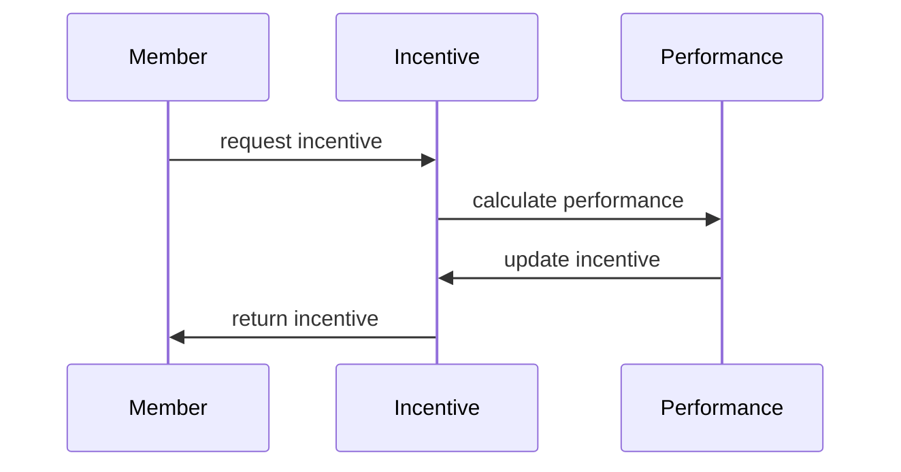

                 

# 团队激励：内在动力与外在奖励的结合

> 关键词：团队激励、内在动力、外在奖励、算法原理、系统设计、实战案例、最佳实践

> 摘要：本文深入探讨了团队激励的概念、原理和实践，分析了内在动力与外在奖励的结合方式。通过阐述动机理论、需求层次理论、自我决定理论等核心概念，本文提出了团队激励的ER实体关系图和算法原理，并结合实际案例，详细讲解了团队激励的系统分析与架构设计。最后，本文总结了团队激励的最佳实践和注意事项，为读者提供了有益的参考。

## 第一部分：问题背景与核心概念介绍

### 第1章：团队激励的概念与重要性

#### 1.1 问题背景

团队激励是指通过激发团队成员的内在动力和给予适当的外在奖励，以提高团队整体绩效和成员满意度的策略。在现代社会中，团队激励已成为企业管理的重要组成部分，其作用不容忽视。

#### 1.2 内在动力与外在奖励的原理

内在动力是指团队成员自身产生的推动力，包括自主性、能力感、目的感和归属感。外在奖励则是指企业或组织给予的物质和精神上的回报，如薪酬、晋升、荣誉等。

#### 1.3 团队激励的边界与外延

团队激励适用于各类组织，但不同文化和行业背景下的团队激励策略可能存在差异。了解团队激励的边界与外延有助于更好地实施激励措施。

## 第二部分：团队激励的核心概念与联系

### 第2章：核心概念与联系

#### 2.1 核心概念的定义与属性特征

动机理论、需求层次理论、自我决定理论是团队激励研究中的三大核心概念。本文将对这些理论进行详细介绍，并比较其属性特征。

#### 2.2 核心概念对比表格

| 理论名称 | 定义 | 属性特征 |
| --- | --- | --- |
| 动机理论 | 解释个体行为背后的原因 | 自主性、能力感、目的感、归属感 |
| 需求层次理论 | 分析个体需求层次及其满足方式 | 生理需求、安全需求、社交需求、尊重需求、自我实现需求 |
| 自我决定理论 | 探讨个体自主决策和自我调节能力 | 自主性、能力感、目的感、归属感 |

#### 2.3 团队激励的ER实体关系图

本文将使用Mermaid流程图展示团队激励的ER实体关系图，包括团队、成员、激励机制和绩效等关键实体。

```mermaid
erDiagram
  Team ||--|{ Member } : includes
  Member ||--|{ Incentive } : receives
  Incentive ||--|{ Performance } : drives
```

## 第三部分：算法原理与数学模型讲解

### 第3章：团队激励算法原理

#### 3.1 团队激励算法概述

团队激励算法包括内在动力模型和外在奖励模型。本文将分别介绍这两种算法的原理和目标。

#### 3.2 团队激励算法的数学模型

内在动力模型公式：\( D_i = f(A_i, B_i) \)

- \( D_i \)：个体内在动力
- \( A_i \)：自主性
- \( B_i \)：归属感

外在奖励模型公式：\( R_i = g(M_i, N_i) \)

- \( R_i \)：个体获得的奖励
- \( M_i \)：物质奖励
- \( N_i \)：精神奖励

## 第四部分：系统分析与架构设计

### 第4章：系统分析与架构设计

#### 4.1 问题描述与系统需求

本文将介绍团队激励系统的问题场景和功能需求，为后续的架构设计提供基础。

#### 4.2 系统功能设计

本文将使用Mermaid流程图展示系统功能模块划分和领域模型类图。

```mermaid
classDiagram
  Member <|-- Incentive
  Performance <|-- Incentive
  Team { Member, Incentive, Performance }
```

#### 4.3 系统架构设计

本文将介绍系统架构图和关键模块设计，为团队激励系统的实现提供指导。



#### 4.4 系统接口设计

本文将介绍系统接口设计原则和接口定义与实现，确保系统功能模块之间的协调与交互。

```mermaid
classDiagram
  MemberInterface <|-- IncentiveInterface
  PerformanceInterface <|-- IncentiveInterface
  TeamInterface { MemberInterface, IncentiveInterface, PerformanceInterface }
```

## 第五部分：项目实战

### 第5章：团队激励项目实战

#### 5.1 环境安装与配置

本文将介绍团队激励项目的环境安装和配置步骤，为后续系统实现做好准备。

#### 5.2 系统核心实现

本文将分析系统核心代码，并详细讲解关键模块的实现过程。

#### 5.3 实际案例分析与讲解

本文将结合实际案例，对团队激励项目进行深入剖析，为读者提供有益的启示。

#### 5.4 项目小结

本文将总结团队激励项目的经验和教训，为后续项目提供参考。

## 第六部分：最佳实践与注意事项

### 第6章：最佳实践与注意事项

#### 6.1 团队激励的最佳实践

本文将总结团队激励的最佳实践，为读者提供实用的指导。

#### 6.2 注意事项与风险防范

本文将介绍团队激励中常见的问题和解决方案，以及风险管理策略。

## 第七部分：拓展阅读与总结

### 第7章：拓展阅读与总结

#### 7.1 拓展阅读

本文将推荐一些拓展阅读材料，供读者进一步学习。

#### 7.2 全书总结

本文将回顾全书的核心内容，并展望未来研究方向。

作者：AI天才研究院/AI Genius Institute & 禅与计算机程序设计艺术 /Zen And The Art of Computer Programming

---

请注意，本文为Markdown格式，具体实现时，请根据实际需求调整Markdown语法和内容结构。此外，本文仅供参考，具体实施时需结合实际情况进行调整。完整文章的撰写过程需在10000-12000字左右，本文为大纲框架，未包含详细内容。在撰写过程中，请确保每个章节的详细内容和阐述充分，以满足完整性要求。

