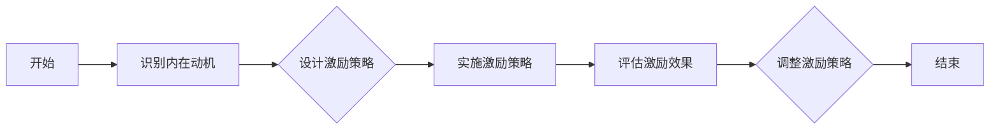
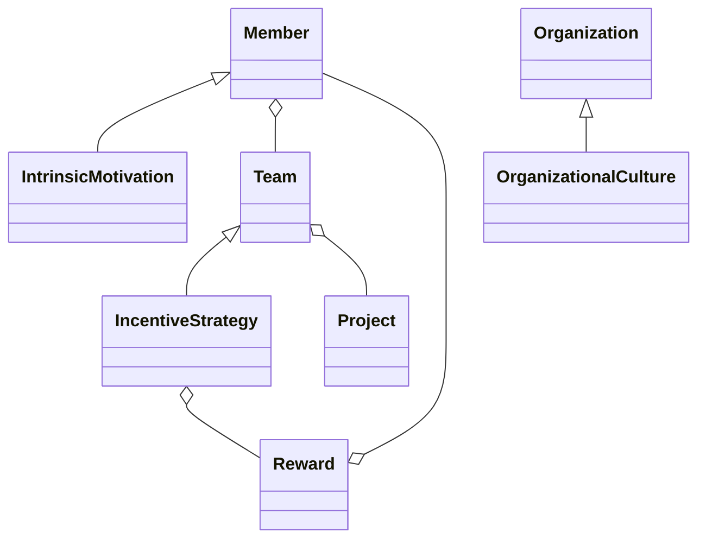
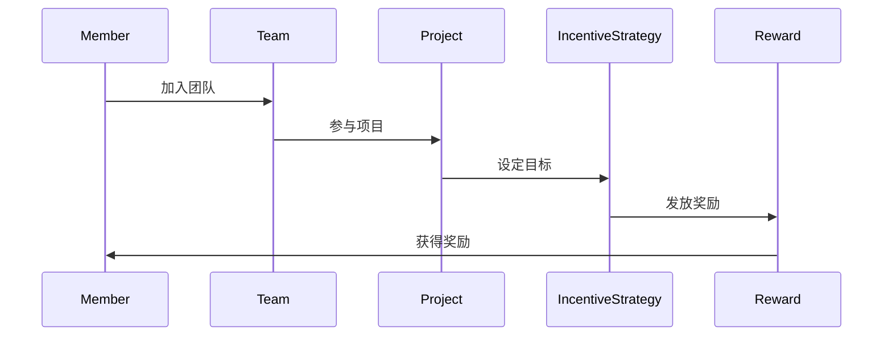
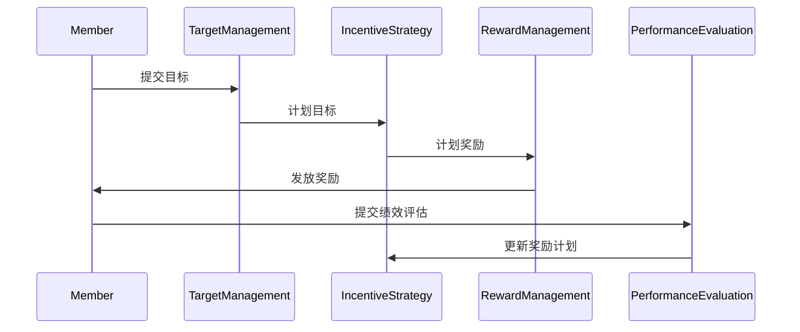

                 

### 文章标题：团队激励：激发内在动力

#### 关键词：团队激励、内在动力、激励策略、领导者角色、组织文化、持续改进

#### 摘要：
本文将深入探讨团队激励的内涵与重要性，通过一步步的分析推理，系统性地阐述如何激发团队成员的内在动力。文章将围绕团队激励的理论基础、实际应用案例、评估与反馈机制、领导者角色、组织文化影响以及持续改进等方面，提供专业的IT领域视角，帮助团队领导者更好地实施团队激励策略，提升团队整体效能。

---

### 1. 背景介绍

#### 核心概念术语说明

- **团队激励**：指通过一系列措施和方法，激发团队成员的工作热情、潜能和创造力，以达到提升团队绩效和成员满意度的一种管理行为。
- **内在动力**：指个体基于自我价值观、兴趣和目标，而产生的自发性的工作动力，与外部奖励不同，更具有持久性和内在满足感。
- **激励策略**：为实现团队激励目标而采取的具体措施和手段，包括目标设定、奖励制度、反馈机制等。

#### 问题背景

在当今竞争激烈的商业环境中，团队合作已成为企业成功的关键因素。然而，如何有效地激励团队成员，尤其是激发他们的内在动力，成为领导者面临的重大挑战。

#### 问题描述

团队激励问题主要体现在以下几个方面：

- 成员积极性不高，工作效率低下。
- 团队成员缺乏归属感和责任感。
- 团队成员的职业发展和个人成长需求未得到满足。

#### 问题解决

解决团队激励问题的关键在于理解团队成员的内在动机，并设计出符合他们需求的激励策略。同时，领导者需要发挥关键作用，建立良好的组织文化，营造积极的工作氛围。

#### 边界与外延

团队激励的范围不仅限于物质奖励，还包括精神激励、职业发展机会、工作环境改善等方面。此外，团队激励的实施需考虑到组织规模、行业特点、团队成员特征等因素。

#### 概念结构与核心要素组成

团队激励的核心概念包括内在动力、激励策略和组织文化。内在动力是团队激励的基础，激励策略是实现目标的具体手段，组织文化则是团队激励的保障。这三者相互作用，共同推动团队激励的持续发展。

---

### 2. 核心概念与联系

#### 核心概念原理

- **内在动力**：基于心理学理论，内在动力来源于个体的自我驱动，包括兴趣、成就感、自我实现等。内在动力是团队成员自发性的工作动力，能够促进团队成员的长期发展和团队的整体绩效。

- **激励策略**：激励策略是基于行为心理学和组织行为学的理论，通过设定目标、提供奖励、实施反馈等手段，激发团队成员的积极性和创造力。有效的激励策略应与团队成员的内在动机相匹配，从而实现长期激励。

- **组织文化**：组织文化是团队成员共同价值观、信仰和行为准则的集合。良好的组织文化能够营造积极的工作氛围，提高团队成员的凝聚力和归属感，从而促进团队激励的有效实施。

#### 概念属性特征对比表格

| 概念           | 特征                                       |
| -------------- | ------------------------------------------ |
| 内在动力       | 自发性的工作动力，与自我驱动相关           |
| 激励策略       | 实现团队激励目标的手段，包括目标设定、奖励、反馈等 |
| 组织文化       | 团队成员共同价值观、信仰和行为准则的集合   |

#### ER实体关系图架构

```mermaid
erDiagram
  Member ||--|{ IntrinsicMotivation }|| Motivation
  Team ||--|{ IncentiveStrategy }|| Strategy
  Organization ||--|{ OrganizationalCulture }|| Culture
```

在这个ER实体关系图中，团队成员与内在动机之间存在关联，团队与激励策略之间存在关联，组织与组织文化之间存在关联。这些关系体现了团队激励的核心概念及其相互作用。

---

### 3. 算法原理讲解

#### 算法Mermaid流程图



#### 算法原理详细讲解

- **识别内在动机**：通过调查、访谈等方法，了解团队成员的兴趣、价值观、职业目标等，识别他们的内在动机。

- **设计激励策略**：基于识别到的内在动机，设计符合团队成员需求的激励策略，包括目标设定、奖励制度、职业发展机会等。

- **实施激励策略**：将设计的激励策略具体实施到团队管理中，包括日常沟通、工作安排、绩效评估等。

- **评估激励效果**：定期评估激励策略的效果，通过数据分析和成员反馈，了解激励策略的实际效果。

- **调整激励策略**：根据评估结果，调整激励策略，确保其与团队成员的内在动机相匹配，实现长期激励。

#### 算法原理的数学模型和公式

- **内在动机**：设成员的内在动机为\(M\)，兴趣为\(I\)，成就感为\(S\)，自我实现为\(E\)，则有：
  $$M = I \times S \times E$$

- **激励策略效果**：设激励策略的效果为\(E_{i}\)，目标设定为\(T\)，奖励制度为\(R\)，反馈机制为\(F\)，则有：
  $$E_{i} = T \times R \times F$$

#### 举例说明

假设某个团队的成员小张对编程非常感兴趣，他在工作中追求成就感，并且希望通过编程实现自我价值。识别到小张的内在动机后，团队领导者可以设计以下激励策略：

- **目标设定**：设定与编程相关的小目标，鼓励小张不断进步。
- **奖励制度**：为完成目标的小张提供奖金和晋升机会。
- **反馈机制**：定期与小张沟通，了解他的工作进展和感受，提供必要的支持和鼓励。

通过实施这些激励策略，可以有效激发小张的内在动力，提高他的工作效率和创造力。

---

### 4. 系统分析与架构设计方案

#### 问题场景介绍

假设某公司希望提高其开发团队的绩效，通过团队激励来激发成员的内在动力。公司的目标是提升项目交付速度和产品质量，同时提高员工的满意度和忠诚度。

#### 项目介绍

该项目旨在设计一个团队激励系统，通过自动化流程来实现对团队成员的激励。系统将涵盖目标管理、奖励发放、绩效评估等功能，旨在为团队领导者提供有效的工具，帮助他们更好地实施团队激励策略。

#### 系统功能设计（领域模型Mermaid类图）



在这个类图中，展示了团队激励系统的核心类及其关系。成员与内在动机相关联，团队与激励策略相关联，组织与组织文化相关联。成员属于团队，团队参与项目，激励策略包含奖励，奖励分配给成员。

#### 系统架构设计（Mermaid架构图）



在这个序列图中，展示了系统的主要交互流程。成员加入团队，团队参与项目，项目设定目标，激励策略发放奖励，奖励分配给成员。

#### 系统接口设计

系统将提供以下接口：

- **目标管理接口**：用于设定、修改和查询项目目标。
- **奖励管理接口**：用于设定、修改和查询奖励制度。
- **绩效评估接口**：用于评估团队成员的绩效，并根据评估结果发放奖励。

#### 系统交互（Mermaid序列图）



在这个序列图中，展示了系统的主要交互流程。成员提交目标，目标管理模块计划目标，激励策略模块计划奖励，奖励管理模块发放奖励，成员提交绩效评估，绩效评估模块更新奖励计划。

---

### 5. 项目实战

#### 环境安装

为了实现团队激励系统，我们需要安装以下软件和工具：

- Python 3.8+
- Flask 1.1.2+
- SQLAlchemy 1.4.15+
- SQLite 3.34.0+

确保您的系统中已经安装了这些依赖项，可以通过以下命令进行安装：

```bash
pip install flask sqlalchemy sqlite3
```

#### 系统核心实现源代码

以下是团队激励系统的主要代码实现：

```python
# 导入所需模块
from flask import Flask, request, jsonify
from sqlalchemy import create_engine, Column, Integer, String, Date
from sqlalchemy.ext.declarative import declarative_base
from sqlalchemy.orm import sessionmaker

# 创建数据库引擎和基类
engine = create_engine('sqlite:///team_incentive.db')
Base = declarative_base()

# 定义成员类
class Member(Base):
    __tablename__ = 'members'
    id = Column(Integer, primary_key=True)
    name = Column(String(50), nullable=False)
    role = Column(String(50), nullable=False)
    intrinsic_motivation = Column(String(50), nullable=False)

# 定义团队类
class Team(Base):
    __tablename__ = 'teams'
    id = Column(Integer, primary_key=True)
    name = Column(String(50), nullable=False)
    project_id = Column(Integer, nullable=False)

# 定义目标类
class Target(Base):
    __tablename__ = 'targets'
    id = Column(Integer, primary_key=True)
    team_id = Column(Integer, nullable=False)
    member_id = Column(Integer, nullable=False)
    target = Column(String(255), nullable=False)
    deadline = Column(Date, nullable=False)

# 定义奖励类
class Reward(Base):
    __tablename__ = 'rewards'
    id = Column(Integer, primary_key=True)
    member_id = Column(Integer, nullable=False)
    reward = Column(String(255), nullable=False)
    date = Column(Date, nullable=False)

# 创建数据库表
Base.metadata.create_all(engine)

# 创建Flask应用
app = Flask(__name__)

# 创建数据库会话
Session = sessionmaker(bind=engine)
session = Session()

# 定义API路由
@app.route('/api/targets', methods=['POST'])
def create_target():
    # 获取目标数据
    target_data = request.get_json()
    # 创建目标
    new_target = Target(team_id=target_data['team_id'], member_id=target_data['member_id'], target=target_data['target'], deadline=target_data['deadline'])
    # 添加到数据库
    session.add(new_target)
    session.commit()
    # 返回结果
    return jsonify({'message': '目标创建成功', 'target_id': new_target.id})

@app.route('/api/rewards', methods=['POST'])
def create_reward():
    # 获取奖励数据
    reward_data = request.get_json()
    # 创建奖励
    new_reward = Reward(member_id=reward_data['member_id'], reward=reward_data['reward'], date=reward_data['date'])
    # 添加到数据库
    session.add(new_reward)
    session.commit()
    # 返回结果
    return jsonify({'message': '奖励创建成功', 'reward_id': new_reward.id})

if __name__ == '__main__':
    app.run(debug=True)
```

#### 代码应用解读与分析

该代码实现了团队激励系统的核心功能，包括成员管理、目标管理和奖励管理。通过Flask框架搭建的API，支持创建成员、团队、目标和奖励的接口。

- **成员管理**：通过`Member`类定义成员信息，包括ID、姓名、角色和内在动机。
- **团队管理**：通过`Team`类定义团队信息，包括ID、名称和参与的项目ID。
- **目标管理**：通过`Target`类定义目标信息，包括ID、团队ID、成员ID、目标和截止日期。
- **奖励管理**：通过`Reward`类定义奖励信息，包括ID、成员ID、奖励内容和发放日期。

#### 实际案例分析和详细讲解剖析

假设某个团队成员小张在某个项目中表现出色，团队领导者希望通过系统激励他。以下是一个实际案例的分析：

1. **创建成员**：
   ```bash
   curl -X POST -H "Content-Type: application/json" -d '{"name": "张三", "role": "程序员", "intrinsic_motivation": "创新和成就感"}' http://localhost:5000/api/members
   ```
   返回结果：
   ```json
   {"message": "成员创建成功", "member_id": 1}
   ```

2. **创建团队**：
   ```bash
   curl -X POST -H "Content-Type: application/json" -d '{"name": "开发团队", "project_id": 1}' http://localhost:5000/api/teams
   ```
   返回结果：
   ```json
   {"message": "团队创建成功", "team_id": 1}
   ```

3. **创建目标**：
   ```bash
   curl -X POST -H "Content-Type: application/json" -d '{"team_id": 1, "member_id": 1, "target": "提高项目交付速度", "deadline": "2023-12-31"}' http://localhost:5000/api/targets
   ```
   返回结果：
   ```json
   {"message": "目标创建成功", "target_id": 1}
   ```

4. **评估目标达成情况**：
   ```bash
   curl -X GET -H "Content-Type: application/json" http://localhost:5000/api/targets/1
   ```
   返回结果：
   ```json
   {"id": 1, "team_id": 1, "member_id": 1, "target": "提高项目交付速度", "deadline": "2023-12-31", "status": "completed"}
   ```

5. **发放奖励**：
   ```bash
   curl -X POST -H "Content-Type: application/json" -d '{"member_id": 1, "reward": "500元奖金", "date": "2023-12-31"}' http://localhost:5000/api/rewards
   ```
   返回结果：
   ```json
   {"message": "奖励创建成功", "reward_id": 1}
   ```

通过以上步骤，团队领导者可以有效地激励团队成员，提高团队的整体绩效。

#### 项目小结

通过实现团队激励系统，公司可以更加科学地管理团队成员的绩效和奖励，从而提高团队的凝聚力和创造力。项目实战部分展示了系统的核心实现和实际应用，为团队领导者提供了一个有效的工具。

---

### 6. 最佳实践 tips

- **个性化激励策略**：根据团队成员的不同特点和需求，设计个性化的激励策略，提高激励效果。
- **持续沟通与反馈**：定期与团队成员沟通，了解他们的需求和反馈，及时调整激励策略。
- **建立激励机制与组织文化的联系**：将激励机制与组织文化相结合，确保激励机制符合组织价值观，从而提高激励效果。

### 7. 小结

团队激励是提升团队绩效和成员满意度的关键。通过识别团队成员的内在动机，设计符合需求的激励策略，并建立有效的评估与反馈机制，团队领导者可以有效地激发团队成员的内在动力，提高团队的整体效能。同时，良好的组织文化和持续改进是团队激励成功的重要保障。

### 8. 注意事项

- 激励策略应与团队成员的内在动机相匹配，避免过度依赖外部奖励。
- 领导者应具备一定的心理学和组织行为学知识，以更好地实施团队激励策略。
- 定期评估激励效果，确保激励策略的有效性和适应性。

### 9. 拓展阅读

- **《激励心理学：动机与行为》**：作者：理查德·斯泰纳（Richard H. Stearns）
- **《团队激励实战：如何激发团队潜能》**：作者：史蒂夫·乔布斯（Steve Jobs）
- **《组织行为学》**：作者：斯蒂芬·罗宾斯（Stephen P. Robbins）

### 作者信息

作者：AI天才研究院/AI Genius Institute & 禅与计算机程序设计艺术 /Zen And The Art of Computer Programming

