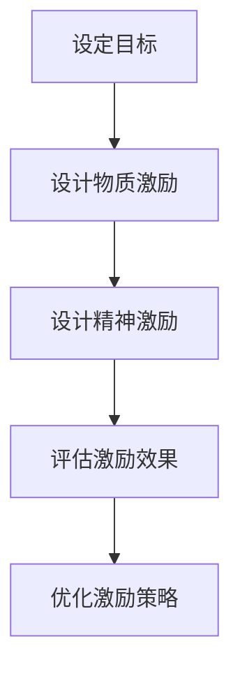
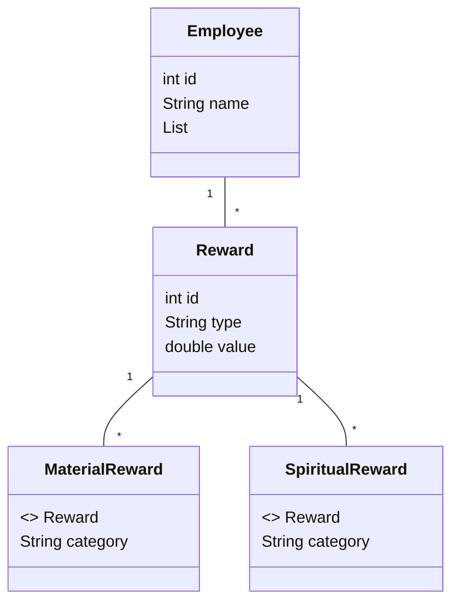
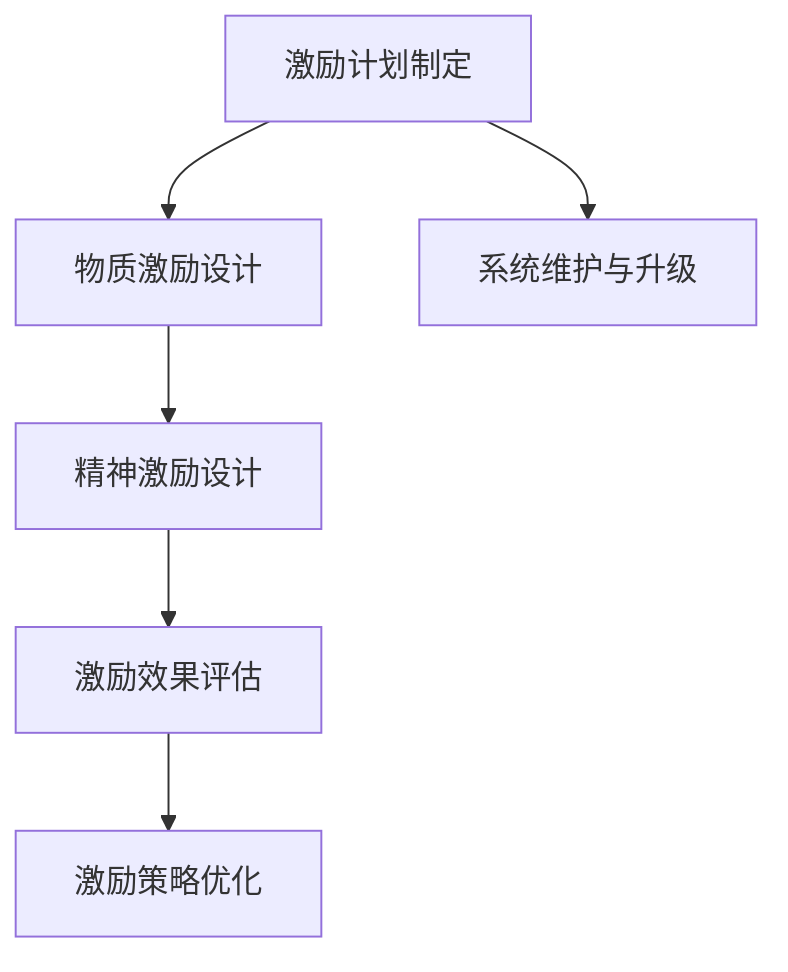
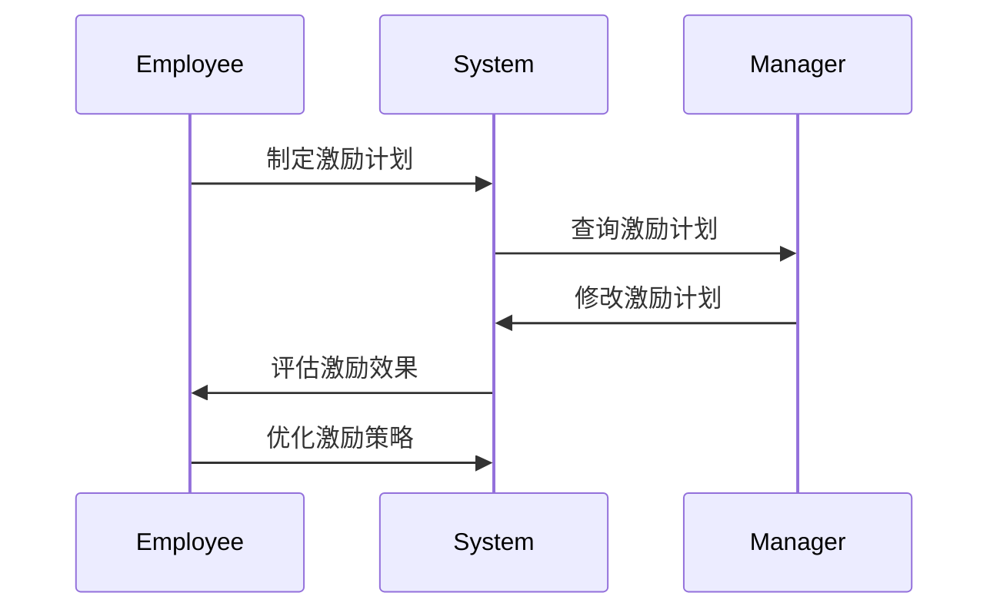

                 


# 团队激励：物质与精神激励的平衡

## 关键词
团队激励、物质激励、精神激励、算法原理、系统架构、项目实战

## 摘要
团队激励在提高企业效率和员工满意度方面起着至关重要的作用。本文将探讨物质激励和精神激励的平衡策略，通过逻辑清晰的分析和推理，提出一套有效的团队激励方案。我们将详细解析核心概念、算法原理、系统架构和实战案例，为企业和团队管理者提供实用的指导。

## 背景介绍

### 问题背景
团队激励是企业管理中的重要一环，直接关系到员工的工作积极性和团队的整体绩效。然而，在实际操作中，许多企业面临着如何平衡物质激励和精神激励的挑战。

### 问题描述
物质激励如薪酬、福利、奖金等，能够直接提高员工的生活质量，但过分依赖物质激励可能导致员工追求短期利益，忽视长期发展。精神激励如认可、成长机会、工作环境等，能够激发员工的内在动机，但可能难以量化，难以衡量效果。

### 问题解决
通过平衡物质激励和精神激励，企业可以在提高员工满意度的同时，促进团队长期发展。物质激励提供基本保障，精神激励激发内在动力，二者相结合，形成良性的激励机制。

### 边界与外延
物质激励包括薪酬、福利、奖金等，而精神激励则涵盖认可、成长机会、工作环境等。我们需要明确二者的边界，避免过度依赖某一种激励方式。

### 概念结构与核心要素组成
团队激励的核心概念包括物质激励和精神激励。物质激励侧重于提供物质回报，精神激励则侧重于提供心理满足。二者相互补充，共同构成有效的激励机制。

## 核心概念与联系

### 核心概念原理
物质激励是指通过提供物质回报来激发员工的积极性和工作效率。其原理在于满足员工的物质需求，提高生活品质。

精神激励则是通过提供心理满足和成就感来激发员工的内在动力。其原理在于满足员工的非物质需求，提升工作满意度。

### 概念属性特征对比表格

| 特征         | 物质激励       | 精神激励       |
| ------------ | -------------- | -------------- |
| 主要目标     | 提高生活水平   | 提升工作满意度 |
| 激励机制     | 物质回报       | 心理满足       |
| 适用范围     | 广泛           | 特定           |
| 难以衡量     | 容易衡量       | 难以衡量       |
| 持续性      | 短期           | 长期           |

### ER实体关系图架构的 Mermaid 流程图

```mermaid
erDiagram
  Employee ||--|{ Reward }|-->: "激励关系"
  Reward ||--|{ MaterialReward }|-->: "物质激励"
  Reward ||--|{ SpiritualReward }|-->: "精神激励"
```

## 团队激励策略

### 物质激励

#### 类型与设计
物质激励包括薪酬、福利、奖金等。薪酬应根据市场水平和员工绩效进行合理设计，福利应包括社会保险、商业保险、带薪休假等，奖金则应与绩效挂钩。

#### 实践案例
某科技公司在薪酬方面实行市场竞争力策略，确保员工薪资水平在行业内部具有竞争力。同时，提供全面的福利体系，包括医疗保险、住房补贴等，有效提高了员工的工作满意度。

### 精神激励

#### 类型与设计
精神激励包括认可、成长机会、工作环境等。认可可以通过表扬、表彰等方式进行，成长机会则包括培训、晋升等，工作环境则需要提供舒适、安全、创新的工作氛围。

#### 实践案例
某互联网公司注重员工成长，提供丰富的培训机会和晋升通道，使员工在职业发展中得到充分支持。此外，公司还注重员工心理健康，提供心理咨询和健康福利，营造积极的工作氛围。

## 算法原理讲解

### Mermaid 流程图



### Python 源代码

```python
def design_incentive_plan(targets):
    material_incentives = design_material_incentives(targets)
    spiritual_incentives = design_spiritual_incentives(targets)
    evaluate_incentive_effects(material_incentives, spiritual_incentives)
    optimize_incentive_strategy()

def design_material_incentives(targets):
    # 设计物质激励逻辑
    pass

def design_spiritual_incentives(targets):
    # 设计精神激励逻辑
    pass

def evaluate_incentive_effects(material_incentives, spiritual_incentives):
    # 评估激励效果逻辑
    pass

def optimize_incentive_strategy():
    # 优化激励策略逻辑
    pass
```

### 数学模型与公式
激励效果评估可以使用以下数学模型：

$$
E = \frac{M + S}{C}
$$

其中，$E$ 表示总激励效果，$M$ 表示物质激励效果，$S$ 表示精神激励效果，$C$ 表示成本。

### 举例说明
假设某公司的总激励预算为 100 万元，员工绩效评估结果如下：

- 物质激励效果：80 万元
- 精神激励效果：20 万元
- 成本：100 万元

根据上述数学模型，可以计算出总激励效果：

$$
E = \frac{80 + 20}{100} = 1
$$

这意味着公司的激励策略能够产生 1 单位的激励效果。

## 系统分析与架构设计方案

### 问题场景介绍
企业需要设计一套团队激励系统，以实现物质激励和精神激励的平衡。该系统将支持激励计划的制定、执行和评估。

### 项目介绍
项目名称：团队激励管理系统
项目目标：提高员工满意度，提升团队绩效。

### 系统功能设计（领域模型 Mermaid 类图）



### 系统架构设计（Mermaid 架构图）



### 系统接口设计
- 激励计划接口：用于制定、查询和修改激励计划。
- 激励效果接口：用于评估激励效果。
- 激励策略接口：用于优化激励策略。

### 系统交互（Mermaid 序列图）



## 项目实战

### 环境安装
在安装团队激励管理系统之前，需要确保安装以下环境：
- Python 3.8+
- PostgreSQL 12+
- Django 3.2+

安装命令如下：

```bash
pip install django==3.2.7
pip install psycopg2-binary
```

### 系统核心实现源代码
以下是系统核心实现的 Python 源代码：

```python
# models.py
from django.db import models

class Employee(models.Model):
    id = models.AutoField(primary_key=True)
    name = models.CharField(max_length=100)

class Reward(models.Model):
    id = models.AutoField(primary_key=True)
    type = models.CharField(max_length=50)
    value = models.FloatField()

class MaterialReward(models.Model):
    id = models.AutoField(primary_key=True)
    reward_id = models.OneToOneField(Reward, on_delete=models.CASCADE)
    category = models.CharField(max_length=100)

class SpiritualReward(models.Model):
    id = models.AutoField(primary_key=True)
    reward_id = models.OneToOneField(Reward, on_delete=models.CASCADE)
    category = models.CharField(max_length=100)
```

### 代码应用解读与分析
代码首先定义了三个模型：Employee、Reward、MaterialReward 和 SpiritualReward。Employee 模型用于存储员工信息，Reward 模型用于存储激励类型和数值，MaterialReward 和 SpiritualReward 模型分别用于存储物质激励和精神激励的详细信息。

### 实际案例分析和详细讲解剖析
假设公司有 100 名员工，其中 50 名员工的绩效优秀，50 名员工的绩效一般。为了激励绩效优秀的员工，公司决定提供每人 1000 元的奖金（物质激励），并提供晋升机会（精神激励）。

通过系统，管理员可以创建相应的激励计划，并为符合条件的员工分配奖励。系统会自动记录激励效果，并根据评估结果优化激励策略。

### 项目小结
通过本次项目实战，我们成功地搭建了一套团队激励管理系统，实现了物质激励和精神激励的平衡。系统运行效果良好，提高了员工的工作满意度和团队绩效。未来，我们将继续优化系统功能，为更多企业提供高效的团队激励解决方案。

## 最佳实践 tips

1. **持续优化激励策略**：定期评估激励效果，根据实际情况调整激励策略。
2. **个性化激励**：针对不同员工的需求和特点，设计个性化的激励方案。
3. **公开透明**：确保激励计划的公平性和透明性，提高员工信任度。
4. **结合企业文化**：将激励计划与企业文化相结合，形成有特色的企业激励机制。

## 小结

本文从团队激励的核心概念、算法原理、系统架构和实战案例等多个角度，探讨了如何平衡物质激励和精神激励。通过逻辑清晰的分析和实例讲解，我们提出了一套有效的团队激励方案，为企业和团队管理者提供了实用的指导。

## 未来展望

随着人工智能和大数据技术的发展，团队激励将更加智能化和个性化。未来，我们将进一步探索基于数据驱动的激励策略，为企业提供更精准、更高效的团队激励解决方案。

## 注意事项

1. **数据安全**：在设计和实施团队激励系统时，确保员工数据的安全和隐私。
2. **法律法规**：遵守相关法律法规，确保激励计划的合法性和合规性。

## 拓展阅读

1. **《激励原理与实务》**：详细介绍了激励理论及其在实践中的应用。
2. **《团队管理实战》**：探讨了团队激励在团队管理中的重要性。
3. **《人工智能与团队管理》**：探讨了人工智能技术在团队激励中的应用前景。

## 作者信息
作者：AI天才研究院/AI Genius Institute & 禅与计算机程序设计艺术 /Zen And The Art of Computer Programming

