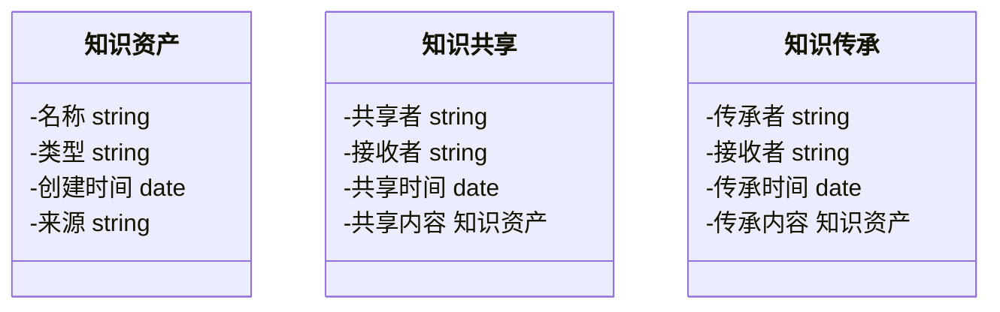
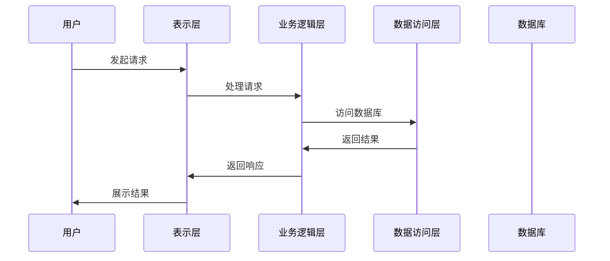
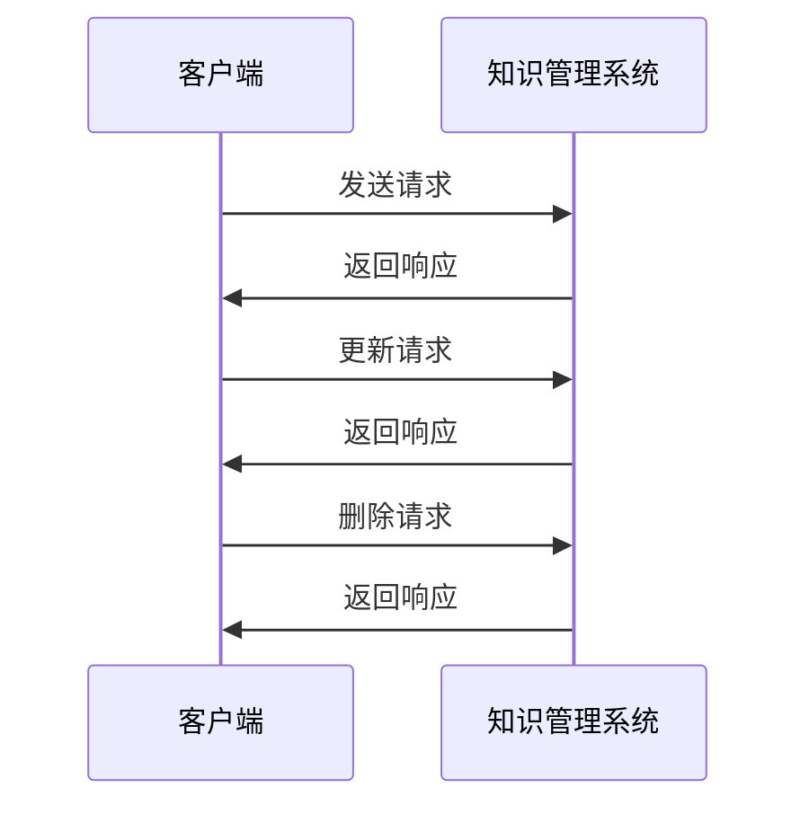
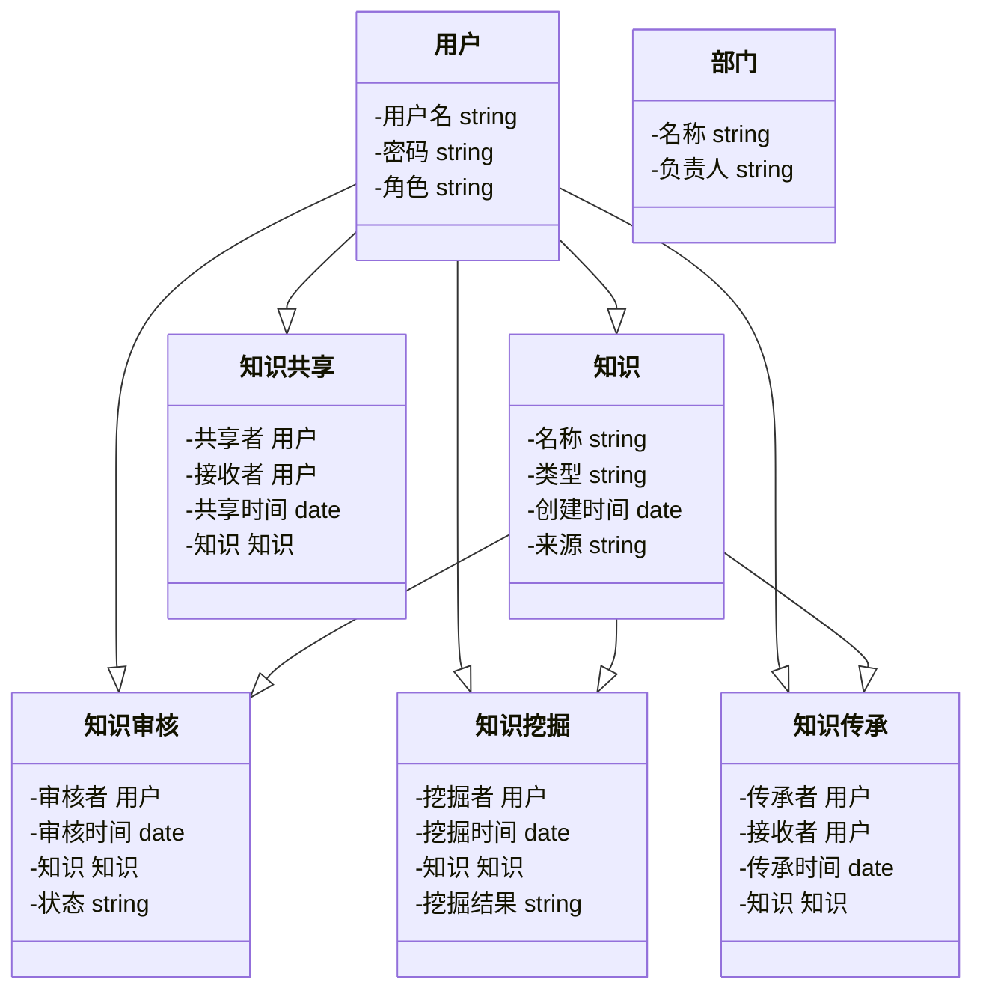

                 


### 文章标题：团队知识管理：促进经验分享与传承的方法

#### 关键词：
- 团队知识管理
- 经验分享
- 知识传承
- 知识共享
- 知识管理系统

#### 摘要：
本文将深入探讨团队知识管理的概念、重要性及其在组织中的作用。通过分析核心概念和联系，介绍促进知识分享与传承的方法和工具，同时结合数学模型和实际案例，展示知识管理在团队中的应用与实践。文章旨在为读者提供一个全面、系统的团队知识管理指南，帮助团队提升协作效率，增强竞争力。

---

#### 第1章: 团队知识管理的背景与重要性

#### 1.1 团队知识管理的现状

**国内外团队知识管理发展概况**：随着全球化进程的加速和信息技术的发展，团队知识管理已成为现代企业关注的热点。国内外许多企业在知识管理方面取得了显著成果，但整体发展仍存在不平衡现象。发达国家的企业在知识管理理论和实践上领先一步，而我国企业则正在努力追赶。

**团队知识管理的重要性**：知识是团队竞争力的核心要素，有效的团队知识管理能够提高团队协作效率，促进经验分享与传承，从而提升团队整体绩效。知识管理有助于构建知识友好型组织文化，增强企业的核心竞争力。

**团队知识管理面临的挑战**：在实际操作中，团队知识管理面临诸多挑战，如知识共享的障碍、知识传承的困难等。这些挑战需要企业通过创新方法和工具来解决。

---

#### 1.2 知识在团队中的作用

**知识的定义与分类**：知识是指通过学习、实践和经验获得的具有实际应用价值的信息。根据知识的表现形式，知识可分为显性知识和隐性知识。

**知识在团队决策中的作用**：知识在团队决策中发挥着关键作用，有助于提高决策的准确性和效率。团队知识管理能够为团队提供丰富的决策依据，减少信息不对称。

**知识对团队创新的影响**：知识是团队创新的源泉。有效的知识管理能够激发团队的创造力，推动团队不断进行创新，从而在激烈的市场竞争中保持优势。

---

#### 1.3 团队知识管理的重要性

**提高团队协作效率**：团队知识管理有助于团队成员快速获取所需信息，减少沟通成本，提高协作效率。

**促进经验分享与传承**：通过知识管理，团队中的经验得以有效记录和传播，为新成员提供宝贵的经验借鉴，促进团队整体发展。

**增强团队竞争力**：团队知识管理能够提高团队的创新能力，优化业务流程，降低运营成本，从而增强团队竞争力。

---

#### 1.4 知识管理与团队绩效

**知识管理对团队绩效的影响**：知识管理对团队绩效具有显著的影响。有效的知识管理能够提高团队工作效率，提升团队创新能力和市场竞争力。

**团队绩效评估指标**：团队绩效评估指标包括工作效率、创新成果、市场表现等。通过这些指标，可以全面评估团队知识管理的成效。

**知识管理在团队绩效提升中的应用案例**：本文将结合实际案例，展示知识管理在团队绩效提升中的应用，为读者提供有益的借鉴。

---

#### 第2章: 团队知识管理的核心概念

#### 2.1 知识资产

**知识资产的定义**：知识资产是指企业拥有或控制的，能够为企业带来经济利益的知识资源。

**知识资产的分类**：知识资产可分为显性知识和隐性知识。显性知识包括文档、报告、专利等，而隐性知识则是指存在于团队成员头脑中的经验、技能和智慧。

**知识资产的管理与保护**：企业需要建立完善的知识资产管理制度，对知识资产进行有效管理，防止知识流失和侵权行为。

---

#### 2.2 知识共享

**知识共享的定义与原则**：知识共享是指团队成员之间相互交换和传递知识的过程。知识共享应遵循开放性、自愿性、互惠性等原则。

**知识共享的障碍与解决方案**：知识共享过程中可能遇到障碍，如信息不对称、信任问题等。企业需要通过改进沟通机制、建立信任关系等方式，克服这些障碍。

**知识共享的最佳实践**：本文将介绍一些知识共享的最佳实践，如建立知识共享平台、开展知识分享活动等。

---

#### 2.3 知识传承

**知识传承的定义与意义**：知识传承是指将团队中的知识从一代传至下一代的过程。知识传承有助于保持团队的持续发展，提高团队整体素质。

**知识传承的方法与策略**：知识传承可以通过培训、导师制度、知识共享平台等方式实现。企业需要制定合理的知识传承策略，确保知识传承的顺利进行。

**知识传承的挑战与应对**：知识传承过程中可能遇到挑战，如知识流失、知识转化等。企业需要通过加强知识管理、提高员工素质等方式，应对这些挑战。

---

#### 2.4 知识管理与组织文化

**知识管理与组织文化的互动**：知识管理与组织文化密切相关。企业需要建立知识友好型组织文化，为知识管理提供良好的环境。

**构建知识友好型组织文化**：企业可以通过树立知识共享的理念、建立激励机制、强化团队合作等方式，构建知识友好型组织文化。

**组织文化对知识管理的影响**：组织文化对知识管理具有深远影响。积极向上的组织文化能够促进知识共享与传承，提高团队绩效。

---

#### 第3章: 促进团队知识管理的工具与技术

#### 3.1 知识管理系统

**知识管理系统的概念与功能**：知识管理系统是一种用于管理和分享知识的软件系统。它具有知识获取、知识存储、知识共享、知识挖掘等功能。

**知识管理系统的分类与选型**：知识管理系统可分为知识库系统、知识门户系统、知识社区系统等。企业应根据自身需求选型合适的知识管理系统。

**知识管理系统的实施与评估**：企业需要制定详细的实施计划，确保知识管理系统的顺利实施。同时，企业应建立评估体系，对知识管理系统进行持续评估和优化。

---

#### 3.2 知识地图

**知识地图的定义与作用**：知识地图是一种可视化工具，用于展示团队内部知识结构和知识流动。它有助于团队成员快速定位和获取所需知识。

**知识地图的构建方法**：企业可以通过梳理现有知识资源、收集团队成员的知识贡献等方式，构建知识地图。

**知识地图在团队知识管理中的应用**：知识地图在团队知识管理中具有重要作用，能够促进知识共享、提高知识利用效率。

---

#### 3.3 社交网络分析

**社交网络分析的定义与作用**：社交网络分析是一种通过研究团队成员之间的社交关系，挖掘潜在知识共享机会的方法。

**社交网络分析的方法与工具**：企业可以采用网络分析法、图论等方法进行社交网络分析。常用的工具包括Gephi、Cytoscape等。

**社交网络分析在团队知识管理中的应用**：社交网络分析有助于企业发现知识共享的关键节点、优化知识传播路径。

---

#### 3.4 知识管理工具的选择与评估

**知识管理工具的选择**：企业应综合考虑知识管理需求、技术成熟度、成本效益等因素，选择合适的知识管理工具。

**知识管理工具的评估**：企业需要建立评估体系，对知识管理工具的使用效果进行评估。评估指标包括知识共享率、知识利用率等。

---

#### 第4章: 数学模型与公式

#### 4.1 知识价值评估模型

**知识价值评估模型的概念与原理**：知识价值评估模型是一种用于衡量知识价值的量化方法。它基于知识的经济价值和潜在价值，对知识进行评估。

**知识价值评估模型的应用**：企业可以运用知识价值评估模型，对知识资产进行价值评估，为知识管理和投资决策提供依据。

**知识价值评估模型的数学公式**：
\[ V_k = f(W_k, P_k) \]
其中，\( V_k \) 表示知识价值，\( W_k \) 表示知识权重，\( P_k \) 表示知识潜力。

---

#### 4.2 知识共享的博弈模型

**知识共享博弈模型的概念与原理**：知识共享博弈模型是一种用于研究团队成员在知识共享过程中行为决策的模型。它基于博弈论原理，分析团队成员在知识共享中的策略选择。

**知识共享博弈模型的应用**：企业可以运用知识共享博弈模型，优化团队成员的知识共享行为，提高知识共享效果。

**知识共享博弈模型的数学公式**：
\[ U_i = \sum_{j \in N_i} (r_{ij} - c_i) \]
其中，\( U_i \) 表示成员\( i \)的效用，\( r_{ij} \) 表示成员\( i \)与成员\( j \)之间的知识共享收益，\( c_i \) 表示成员\( i \)的知识共享成本。

---

#### 4.3 知识传承的数学模型

**知识传承数学模型的概念与原理**：知识传承数学模型是一种用于描述知识在团队中传递过程的数学模型。它基于概率论和统计方法，分析知识传承的效果和效率。

**知识传承数学模型的应用**：企业可以运用知识传承数学模型，评估知识传承的效果，优化知识传承策略。

**知识传承数学模型的数学公式**：
\[ P(A|B) = \frac{P(B|A)P(A)}{P(B)} \]
其中，\( P(A|B) \) 表示在事件\( B \)发生的情况下，事件\( A \)发生的概率。

---

#### 4.4 知识管理的量化指标

**知识管理的量化指标体系**：知识管理量化指标体系包括知识共享率、知识利用率、知识传承效率等指标。这些指标用于评估知识管理的效果。

**知识管理量化指标的计算方法**：企业可以根据实际情况，制定相应的计算方法，对知识管理量化指标进行计算。

**知识管理量化指标的应用**：知识管理量化指标可以帮助企业了解知识管理的现状，为改进知识管理提供数据支持。

---

#### 第5章: 系统分析与架构设计方案

#### 5.1 问题场景介绍

**问题场景背景**：某大型企业面临团队知识管理困难，知识共享和传承效果不佳，影响了团队协作效率和创新能力。

**问题描述**：企业需要建立一个有效的团队知识管理系统，促进知识共享和传承，提高团队绩效。

**问题解决**：通过系统分析和架构设计，构建一个满足企业需求的团队知识管理系统。

---

#### 5.2 系统功能设计

**系统功能概述**：团队知识管理系统应具备知识获取、知识存储、知识共享、知识挖掘等功能。

**领域模型**：采用Mermaid类图，展示系统的领域模型，包括知识资产、知识共享、知识传承等核心类。

**领域模型类图**：


---

#### 5.3 系统架构设计

**系统架构概述**：团队知识管理系统采用分层架构，包括表示层、业务逻辑层、数据访问层等。

**系统架构图**：


---

#### 5.4 系统接口设计与交互

**接口设计**：系统接口设计包括API接口、Web服务接口等。

**接口交互图**：


---

#### 第6章: 项目实战

#### 6.1 环境安装

**环境准备**：在安装团队知识管理系统前，需准备好开发环境、数据库环境等。

**安装步骤**：
1. 安装Python环境。
2. 安装数据库（如MySQL、PostgreSQL等）。
3. 安装知识管理系统所需的依赖库。

---

#### 6.2 系统核心实现源代码

**源代码结构**：系统核心实现源代码包括表示层、业务逻辑层、数据访问层等。

**代码示例**：
```python
# 表示层代码示例
class UserInterface:
    def display_knowledge(self, knowledge_list):
        for knowledge in knowledge_list:
            print(f"名称：{knowledge.name}")
            print(f"类型：{knowledge.type}")
            print(f"创建时间：{knowledge.create_time}")
            print(f"来源：{knowledge.source}")
            print()

# 业务逻辑层代码示例
class KnowledgeManager:
    def get_knowledge_list(self):
        # 从数据库中获取知识列表
        # ...
        return knowledge_list

# 数据访问层代码示例
class KnowledgeRepository:
    def save_knowledge(self, knowledge):
        # 将知识保存到数据库
        # ...
        pass
```

---

#### 6.3 代码应用解读与分析

**代码解读**：通过分析代码，我们可以了解团队知识管理系统的实现原理和功能。

**代码分析**：代码中涉及的主要功能包括知识获取、知识存储、知识共享、知识传承等。这些功能通过分层架构实现，保证了系统的模块化和可维护性。

---

#### 6.4 实际案例分析与讲解

**案例背景**：某企业采用团队知识管理系统，提高知识共享和传承效果。

**案例分析**：
1. **知识获取**：企业通过知识管理系统，方便地获取所需知识，提高了工作效率。
2. **知识共享**：通过知识共享平台，团队成员可以轻松分享知识和经验，促进了团队协作。
3. **知识传承**：企业采用知识传承策略，将资深员工的宝贵经验传承给新员工，提高了团队整体素质。

**讲解**：本案例展示了团队知识管理系统在实际应用中的效果，为其他企业提供了有益的借鉴。

---

#### 6.5 项目小结

**项目总结**：通过本项目，企业成功构建了团队知识管理系统，提高了知识共享和传承效果，为团队协作和创新提供了有力支持。

**项目经验**：本项目过程中，企业积累了丰富的经验，包括需求分析、系统设计、代码实现等。这些经验有助于企业未来在知识管理领域的发展。

---

#### 第7章: 最佳实践与总结

#### 7.1 知识管理最佳实践

**知识管理最佳实践**：
1. **明确知识管理目标**：企业应明确知识管理的目标，制定具体的实施计划。
2. **建立知识管理体系**：企业需建立完善的知识管理体系，包括知识获取、知识存储、知识共享、知识传承等环节。
3. **培养知识管理文化**：企业应树立知识共享的理念，营造知识友好型组织文化。
4. **强化知识管理培训**：企业应定期开展知识管理培训，提高员工的知识管理意识和能力。

---

#### 7.2 小结

**全文小结**：本文详细介绍了团队知识管理的概念、核心概念、方法、工具、数学模型、系统设计与项目实战等内容。通过本文的阐述，读者可以全面了解团队知识管理的原理和实践，为实际应用提供指导。

---

#### 7.3 注意事项

**注意事项**：
1. **确保知识安全**：在知识管理过程中，企业需重视知识安全，防止知识泄露和滥用。
2. **持续优化知识管理**：企业应不断优化知识管理流程，提高知识管理的效率和效果。
3. **关注知识管理评估**：企业应定期对知识管理进行评估，了解知识管理的成效，为改进提供依据。

---

#### 7.4 拓展阅读

**拓展阅读**：
1. **相关书籍**：《企业知识管理》、《知识管理实践指南》等。
2. **相关论文**：研究团队知识管理的国内外学术论文。
3. **在线资源**：知识管理社区、博客、论坛等，提供丰富的知识管理实践案例和经验。

---

**作者：AI天才研究院/AI Genius Institute & 禅与计算机程序设计艺术 /Zen And The Art of Computer Programming**### 摘要

本文全面探讨了团队知识管理的概念、重要性及其在实际应用中的具体方法。团队知识管理涉及知识资产的识别与保护、知识共享与传承的促进，以及一系列促进知识流动的技术和工具。文章首先介绍了团队知识管理的背景和现状，随后深入分析了其核心概念，包括知识资产、知识共享、知识传承等，并通过数学模型和实际案例展示了知识管理在团队中的具体应用。文章还提出了系统分析与架构设计方案，提供了知识管理项目的实际操作指南，并总结了最佳实践和注意事项。本文旨在为读者提供一部系统、实用的团队知识管理指南，帮助团队提升协作效率，增强竞争力。关键字：团队知识管理、经验分享、知识传承、知识共享、知识管理系统。 

---

### 第1章 团队知识管理的背景与重要性

#### 1.1 团队知识管理的现状

团队知识管理作为一个重要的管理领域，在全球范围内得到了广泛关注和应用。然而，不同国家和地区在团队知识管理的发展程度上存在显著差异。发达国家如美国、欧洲国家在团队知识管理理论研究和实践应用方面已经相对成熟，许多大型企业建立了完善的团队知识管理体系，并通过知识共享和传承实现了团队效能的显著提升。例如，IBM、微软等企业通过构建内部知识库和知识社区，实现了知识的有效传递和利用。

相比之下，我国企业在团队知识管理方面虽然起步较晚，但发展迅速。随着互联网和信息技术的普及，越来越多的中国企业开始重视知识管理，通过引进国外先进经验和技术，逐步建立起自己的知识管理体系。例如，华为、阿里巴巴等企业在团队知识管理方面取得了显著成果，通过建立内部知识平台和培训体系，提高了员工的知识共享意识和能力。

#### 1.2 知识在团队中的作用

知识在团队中的作用不容忽视，它不仅是团队决策的基础，也是团队创新的重要驱动力。首先，知识在团队决策中扮演着关键角色。团队成员通过共享和利用已有的知识，可以更快地获取决策所需的信息，减少信息不对称，提高决策的准确性和效率。例如，在项目开发过程中，团队成员可以通过知识共享平台获取相关技术文档和经验，从而更好地应对项目中遇到的问题。

其次，知识对团队创新具有显著的推动作用。创新往往需要新的思路和方法，而这些新的思路和方法往往来源于团队成员之间的知识共享和碰撞。通过知识管理，团队可以更好地积累和利用各类知识，为创新提供丰富的资源。例如，一些创新型企业通过建立知识共享社区，鼓励员工分享自己的想法和创意，从而激发团队的创新活力。

#### 1.3 团队知识管理的重要性

团队知识管理的重要性主要体现在以下几个方面：

首先，提高团队协作效率。有效的团队知识管理可以帮助团队成员快速获取所需的知识和信息，减少沟通成本和重复劳动，从而提高团队协作效率。例如，通过建立内部知识库，团队成员可以随时查阅相关资料，提高工作效率。

其次，促进经验分享与传承。团队知识管理可以帮助团队将宝贵的经验进行系统化、结构化的记录和传播，使新成员能够快速学习和掌握，从而促进团队的整体发展。例如，通过知识共享平台，资深员工可以分享自己的工作经验和心得，为新员工提供宝贵的指导。

最后，增强团队竞争力。知识是团队竞争力的核心要素，通过有效的团队知识管理，团队可以积累丰富的知识资产，提高创新能力，优化业务流程，从而在激烈的市场竞争中占据优势地位。

#### 1.4 知识管理与团队绩效

知识管理对团队绩效具有显著的影响。首先，通过知识管理，团队可以更好地利用内部知识资源，提高工作效率和决策质量，从而直接提升团队绩效。其次，知识管理可以促进团队成员之间的协作和沟通，增强团队的凝聚力和协作能力，进一步推动团队绩效的提升。此外，知识管理还可以激发团队的创新活力，推动团队持续进行创新，从而在市场竞争中保持优势。

为了更好地评估知识管理对团队绩效的影响，企业可以采用以下指标：

1. **知识共享率**：知识共享率反映了团队成员之间知识共享的程度，可以用来衡量知识管理的效果。
2. **知识利用率**：知识利用率反映了知识在实际工作中的应用情况，可以用来评估知识管理的有效性。
3. **团队创新成果**：团队创新成果反映了知识管理对团队创新能力的提升程度，可以用来衡量知识管理对团队绩效的长期影响。

通过这些指标，企业可以全面了解知识管理对团队绩效的影响，并根据实际情况调整和优化知识管理策略。

---

### 第2章 团队知识管理的核心概念

#### 2.1 知识资产

知识资产是指企业拥有或控制的，能够为企业带来经济利益的知识资源。知识资产是团队知识管理的核心，对其进行有效管理是提升团队竞争力的关键。知识资产可以分为显性知识和隐性知识。

**显性知识**：显性知识是指以文档、报告、专利等形式存在的知识。这类知识易于获取和传播，但往往容易被忽视。显性知识的管理主要包括知识的收集、分类、存储和共享。企业可以通过建立知识库、文档管理系统等工具，对显性知识进行有效管理。

**隐性知识**：隐性知识是指存在于团队成员头脑中的经验、技能和智慧。这类知识难以量化，但对企业的发展至关重要。隐性知识的管理主要包括知识的挖掘、传承和利用。企业可以通过建立导师制度、开展经验分享活动等方式，促进隐性知识的传承和利用。

**知识资产的管理与保护**：知识资产的管理与保护是团队知识管理的重要任务。企业需要制定相应的管理制度，明确知识资产的分类、标识、存储、使用和销毁等流程。同时，企业还需要加强知识资产的保护，防止知识泄露、侵权和滥用。例如，企业可以采用加密技术、访问控制等手段，确保知识资产的安全。

#### 2.2 知识共享

知识共享是指团队成员之间相互交换和传递知识的过程。知识共享是团队知识管理的重要环节，对于提升团队协作效率、促进团队创新具有重要意义。知识共享的原则包括开放性、自愿性、互惠性等。

**知识共享的定义与原则**：知识共享是指团队成员之间相互交换和传递知识的过程。知识共享应遵循以下原则：

1. **开放性**：知识共享应具有开放性，鼓励团队成员积极参与和分享知识。
2. **自愿性**：知识共享应基于自愿原则，尊重团队成员的意愿，不得强迫分享。
3. **互惠性**：知识共享应实现互惠互利，使分享者和接收者都能从中获益。

**知识共享的障碍与解决方案**：在实际操作中，知识共享可能面临诸多障碍，如信息不对称、信任问题、文化差异等。为了克服这些障碍，企业可以采取以下措施：

1. **改善沟通机制**：建立有效的沟通渠道，促进团队成员之间的交流和互动。
2. **建立信任关系**：通过团队建设活动、培训等方式，增强团队成员之间的信任。
3. **提供激励机制**：对积极参与知识共享的成员给予奖励，提高知识共享的积极性。

**知识共享的最佳实践**：企业可以通过以下方式促进知识共享：

1. **建立知识共享平台**：搭建知识共享平台，提供知识共享的工具和场所。
2. **开展知识分享活动**：定期组织知识分享活动，鼓励团队成员分享知识和经验。
3. **推广知识管理文化**：营造知识共享的文化氛围，使知识共享成为团队成员的自觉行为。

#### 2.3 知识传承

知识传承是指将团队中的知识从一代传至下一代的过程。知识传承是团队知识管理的重要组成部分，对于保持团队的持续发展具有重要意义。

**知识传承的定义与意义**：知识传承是指将团队中的知识从一代传至下一代的过程。知识传承的意义在于：

1. **保持团队知识连续性**：知识传承有助于保持团队知识的连续性，使团队在不断变化的环境中保持稳定发展。
2. **提升团队整体素质**：知识传承有助于提升团队成员的素质，使团队整体水平不断提高。
3. **增强团队竞争力**：知识传承有助于增强团队的竞争力，使团队在激烈的市场竞争中保持优势。

**知识传承的方法与策略**：企业可以采取以下方法与策略促进知识传承：

1. **建立导师制度**：通过导师制度，使资深员工将经验传授给新员工，实现知识传承。
2. **开展培训与学习**：定期组织培训和学习活动，使团队成员不断更新和提升知识。
3. **建立知识库**：将团队中的知识系统化、结构化地记录和存储，为知识传承提供支持。

**知识传承的挑战与应对**：在知识传承过程中，企业可能面临以下挑战：

1. **知识流失**：知识传承过程中，部分知识可能因员工离职而流失。企业需要加强知识保护，防止知识流失。
2. **知识转化**：知识传承过程中，如何将隐性知识转化为可传播的知识是一个挑战。企业可以通过导师制度、知识分享活动等方式，促进知识转化。

#### 2.4 知识管理与组织文化

知识管理不仅是一种技术手段，更是一种文化。组织文化对知识管理具有重要影响。良好的组织文化可以促进知识共享和传承，提高团队知识管理水平。

**知识管理与组织文化的互动**：知识管理与组织文化之间存在着密切的互动关系。一方面，知识管理可以影响组织文化，促进组织文化的变革。通过知识共享和传承，企业可以形成开放、协作、创新的组织文化。另一方面，组织文化也会影响知识管理的效果。积极向上的组织文化可以促进知识共享和传承，而消极的组织文化则可能阻碍知识管理的发展。

**构建知识友好型组织文化**：企业需要构建知识友好型组织文化，为知识管理提供良好的环境。具体措施包括：

1. **树立知识共享的理念**：企业需要树立知识共享的理念，鼓励员工积极参与知识共享活动。
2. **建立信任机制**：通过建立信任机制，促进团队成员之间的信任和合作，提高知识共享的积极性。
3. **推广创新文化**：鼓励员工创新思维，提供创新空间和资源，为知识创新提供支持。

**组织文化对知识管理的影响**：组织文化对知识管理具有深远影响。积极向上的组织文化可以促进知识共享和传承，提高知识管理的效率。而消极的组织文化则可能阻碍知识管理的发展，影响知识管理的成效。因此，企业需要关注组织文化的建设，营造知识友好型组织文化。

---

### 第3章 促进团队知识管理的工具与技术

#### 3.1 知识管理系统

知识管理系统（Knowledge Management System，简称KMS）是一种用于管理和共享知识的软件系统。它能够帮助团队高效地获取、存储、共享和利用知识，提升团队知识管理水平。知识管理系统通常包括以下功能：

1. **知识获取**：通过知识采集工具，从各种渠道获取知识，包括文档、报告、博客、论坛等。
2. **知识存储**：将获取的知识存储在知识库中，便于分类、检索和管理。
3. **知识共享**：提供知识共享平台，使团队成员能够方便地访问和共享知识。
4. **知识挖掘**：利用数据挖掘技术，从知识库中发现有价值的信息和知识。
5. **知识分析**：对知识进行分析和评估，识别知识的价值和影响力。

**知识管理系统的分类与选型**：根据功能和特点，知识管理系统可分为以下几类：

1. **知识库系统**：主要用于存储和管理知识，提供知识检索和分类功能。
2. **知识门户系统**：提供一个集成平台，集成了知识获取、知识存储、知识共享等功能。
3. **知识社区系统**：鼓励团队成员参与知识共享和讨论，促进知识传播和创新。

企业在选择知识管理系统时，需要综合考虑以下因素：

1. **需求分析**：根据企业的具体需求，选择适合的知识管理系统。
2. **技术成熟度**：选择技术成熟、稳定性高的知识管理系统。
3. **成本效益**：综合考虑知识管理系统的采购成本、维护成本和使用效果。
4. **用户友好性**：选择用户界面友好、易于操作的知识管理系统。

**知识管理系统的实施与评估**：实施知识管理系统是一个复杂的过程，包括需求分析、系统设计、开发、测试和部署等环节。企业在实施过程中需要制定详细的实施计划，确保系统按期上线并发挥作用。

知识管理系统的评估主要包括以下几个方面：

1. **知识共享率**：评估系统在促进知识共享方面的效果，如知识共享频率、参与度等。
2. **知识利用率**：评估系统在知识利用方面的效果，如知识查询次数、使用率等。
3. **用户满意度**：通过用户反馈，评估系统的用户友好性和使用效果。
4. **业务绩效**：评估系统对企业业务绩效的影响，如工作效率、决策质量等。

#### 3.2 知识地图

知识地图（Knowledge Map，简称KM）是一种可视化工具，用于展示团队内部的知识结构和知识流动。知识地图通过图形化方式，将团队的知识资源、知识流动路径和知识使用情况呈现出来，帮助团队成员更好地理解知识网络，促进知识共享和传承。

**知识地图的定义与作用**：

- **定义**：知识地图是一种通过图形化方式，展示团队知识结构和知识流动的可视化工具。
- **作用**：知识地图在团队知识管理中具有重要作用，包括：
  - **展示知识结构**：通过知识地图，可以直观地了解团队的知识分布和结构，明确知识的来源和流向。
  - **促进知识共享**：知识地图可以帮助团队成员找到所需知识，促进知识在团队内部的传播和共享。
  - **优化知识流动**：通过分析知识地图，可以优化知识的流动路径，提高知识利用效率。

**知识地图的构建方法**：

1. **数据收集**：收集团队内部的知识资源，包括文档、报告、专利、经验等。
2. **知识分类**：对收集到的知识进行分类，明确各类知识的属性和特征。
3. **知识关联**：分析知识之间的关系，建立知识之间的联系，形成知识网络。
4. **可视化表示**：利用可视化工具，将知识结构和知识流动路径以图形化方式展示出来。

**知识地图在团队知识管理中的应用**：

1. **知识导航**：知识地图可以作为团队知识导航工具，帮助团队成员快速找到所需知识。
2. **知识共享**：通过知识地图，团队成员可以了解知识的来源和流向，促进知识共享和传播。
3. **知识传承**：知识地图可以帮助团队成员了解团队的知识结构，为新成员提供学习和成长的路径。
4. **知识优化**：通过分析知识地图，可以发现知识流动中的瓶颈和问题，优化知识管理流程。

#### 3.3 社交网络分析

社交网络分析（Social Network Analysis，简称SNA）是一种研究社会网络结构和行为的分析方法。在团队知识管理中，社交网络分析可以帮助企业发现团队内部的知识网络和关键节点，优化知识共享和传承。

**社交网络分析的定义与作用**：

- **定义**：社交网络分析是一种通过研究团队成员之间的社交关系，挖掘潜在知识共享机会的分析方法。
- **作用**：社交网络分析在团队知识管理中具有重要作用，包括：
  - **发现知识网络**：通过分析团队成员的社交关系，可以构建团队内部的知识网络，明确知识的流动路径。
  - **识别关键节点**：通过分析社交网络，可以识别出团队中的关键节点，这些节点在知识传播中起着重要作用。
  - **优化知识共享**：通过分析社交网络，可以发现知识共享的瓶颈和问题，优化知识共享流程，提高知识利用效率。

**社交网络分析的方法与工具**：

1. **网络分析法**：网络分析法是一种常用的社交网络分析方法，通过分析节点和边的数量、连接密度、集聚度等指标，研究团队内部的知识网络结构。
2. **图论**：图论是一种数学工具，用于分析和建模社交网络。通过图论，可以构建团队内部的知识网络模型，分析知识流动的路径和模式。
3. **软件工具**：常用的社交网络分析软件包括Gephi、Cytoscape等，这些工具提供了丰富的分析功能，可以帮助企业进行社交网络分析。

**社交网络分析在团队知识管理中的应用**：

1. **知识共享优化**：通过社交网络分析，企业可以识别出团队中的关键节点，优化知识共享路径，提高知识共享效率。
2. **知识传承规划**：通过社交网络分析，企业可以规划知识传承路径，确保知识能够有效地传递给新成员。
3. **团队协作提升**：通过社交网络分析，企业可以识别团队内部的协作关系，优化团队协作模式，提高团队协作效率。

#### 3.4 知识管理工具的选择与评估

在团队知识管理中，选择合适的工具对于提升知识管理水平至关重要。企业需要综合考虑以下因素进行工具选择：

**需求分析**：首先，企业需要明确自身的知识管理需求，包括知识获取、知识存储、知识共享、知识挖掘等。根据需求选择适合的工具。

**功能对比**：企业需要对不同知识管理工具的功能进行对比，包括知识库管理、知识共享平台、知识挖掘工具等。选择功能丰富、适用性强的工具。

**用户友好性**：工具的用户界面应简洁易用，便于团队成员快速上手。用户友好性直接影响工具的使用效果。

**技术成熟度**：选择技术成熟、稳定性高的工具，确保系统能够长期稳定运行。

**成本效益**：综合考虑工具的采购成本、维护成本和使用效果，选择性价比高的工具。

**评估指标**：企业需要制定评估指标，对知识管理工具的使用效果进行评估。常见的评估指标包括知识共享率、知识利用率、用户满意度等。

**评估方法**：企业可以通过用户反馈、数据分析和实际应用效果等多种方法，对知识管理工具的使用效果进行评估。根据评估结果，及时调整和优化工具的使用策略。

---

### 第4章 数学模型与公式

#### 4.1 知识价值评估模型

知识价值评估模型是一种用于衡量知识价值的量化方法。通过评估知识的经济价值和潜在价值，企业可以更准确地识别和利用知识资源。知识价值评估模型可以帮助企业优化知识管理策略，提高知识利用效率。

**知识价值评估模型的概念与原理**：

知识价值评估模型基于知识的经济价值和潜在价值进行评估。知识的经济价值是指知识在当前市场条件下能够带来的直接经济效益。潜在价值是指知识在未来可能带来的潜在收益。

**知识价值评估模型的应用**：

企业可以运用知识价值评估模型，对知识资产进行价值评估，为知识管理和投资决策提供依据。具体应用场景包括：

1. **知识投资决策**：企业可以根据知识价值评估模型，评估不同知识项目的投资回报，选择最具潜力的知识项目进行投资。
2. **知识分配**：企业可以根据知识价值评估结果，合理分配知识资源，确保知识资源得到最大化利用。
3. **知识定价**：企业可以根据知识价值评估结果，为知识产品或服务制定合理的价格，提高知识变现能力。

**知识价值评估模型的数学公式**：

知识价值评估模型通常采用以下数学公式：

\[ V_k = f(W_k, P_k) \]

其中：

- \( V_k \)：知识价值
- \( W_k \)：知识权重
- \( P_k \)：知识潜力

知识权重 \( W_k \) 表示知识在整体知识资产中的重要性，可以通过专家评估、统计分析等方法确定。知识潜力 \( P_k \) 表示知识的潜在价值，可以通过市场调研、竞争分析等方法评估。

#### 4.2 知识共享的博弈模型

知识共享博弈模型是一种基于博弈论原理的模型，用于研究团队成员在知识共享过程中的行为决策。通过分析团队成员的知识共享行为，企业可以优化知识共享策略，提高知识共享效果。

**知识共享博弈模型的概念与原理**：

知识共享博弈模型假设团队成员在知识共享过程中存在利益冲突，通过博弈分析，可以确定最优的知识共享策略。模型主要考虑以下因素：

1. **共享收益**：团队成员通过知识共享获得的收益。
2. **共享成本**：团队成员在知识共享过程中需要承担的成本。
3. **合作概率**：团队成员合作共享知识的概率。

**知识共享博弈模型的应用**：

企业可以运用知识共享博弈模型，分析团队成员的知识共享行为，优化知识共享策略。具体应用场景包括：

1. **激励机制设计**：通过博弈模型分析，企业可以设计合理的激励机制，提高团队成员的知识共享积极性。
2. **共享策略优化**：企业可以根据博弈模型分析结果，优化知识共享策略，提高知识共享效率。
3. **冲突解决**：通过博弈模型，企业可以识别和解决知识共享过程中可能出现的利益冲突。

**知识共享博弈模型的数学公式**：

知识共享博弈模型通常采用以下数学公式：

\[ U_i = \sum_{j \in N_i} (r_{ij} - c_i) \]

其中：

- \( U_i \)：成员 \( i \) 的效用
- \( r_{ij} \)：成员 \( i \) 与成员 \( j \) 之间的知识共享收益
- \( c_i \)：成员 \( i \) 的知识共享成本

成员 \( i \) 的效用 \( U_i \) 等于与其他成员 \( j \) 共享知识的收益总和减去自身的共享成本。

#### 4.3 知识传承的数学模型

知识传承数学模型是一种用于描述知识在团队中传递过程的数学模型。通过分析知识传承的过程和效果，企业可以优化知识传承策略，提高知识传承效率。

**知识传承数学模型的概念与原理**：

知识传承数学模型基于概率论和统计方法，描述知识在团队中传递的过程。模型主要考虑以下因素：

1. **知识传递概率**：知识从一代传递到下一代的概率。
2. **知识保留率**：知识在传递过程中被保留的概率。
3. **知识流失率**：知识在传递过程中流失的概率。

**知识传承数学模型的应用**：

企业可以运用知识传承数学模型，评估知识传承的效果，优化知识传承策略。具体应用场景包括：

1. **知识传承效果评估**：通过模型评估知识传承的效果，了解知识在团队中的传递情况。
2. **传承策略优化**：根据模型分析结果，优化知识传承策略，提高知识传承效率。
3. **知识流失控制**：通过模型分析知识流失情况，采取相应措施控制知识流失。

**知识传承数学模型的数学公式**：

知识传承数学模型通常采用以下数学公式：

\[ P(A|B) = \frac{P(B|A)P(A)}{P(B)} \]

其中：

- \( P(A|B) \)：在事件 \( B \) 发生的情况下，事件 \( A \) 发生的概率。
- \( P(B|A) \)：在事件 \( A \) 发生的情况下，事件 \( B \) 发生的概率。
- \( P(A) \)：事件 \( A \) 发生的概率。
- \( P(B) \)：事件 \( B \) 发生的概率。

#### 4.4 知识管理的量化指标

知识管理的量化指标体系用于评估知识管理的效果，帮助企业管理层了解知识管理工作的进展和成效。通过制定和实施量化指标，企业可以更加科学地管理知识，优化知识管理流程。

**知识管理的量化指标体系**：

知识管理的量化指标体系包括以下指标：

1. **知识共享率**：知识共享率反映了知识在团队内部共享的程度，用于衡量知识共享的效果。计算公式为：

\[ \text{知识共享率} = \frac{\text{共享知识数量}}{\text{总知识数量}} \]

2. **知识利用率**：知识利用率反映了知识在实际工作中的应用情况，用于衡量知识利用的效果。计算公式为：

\[ \text{知识利用率} = \frac{\text{应用知识数量}}{\text{共享知识数量}} \]

3. **知识传承效率**：知识传承效率反映了知识在团队中的传递效率，用于衡量知识传承的效果。计算公式为：

\[ \text{知识传承效率} = \frac{\text{传承成功知识数量}}{\text{总传承知识数量}} \]

4. **知识管理满意度**：知识管理满意度反映了团队成员对知识管理工作的满意度，用于衡量知识管理工作的用户体验。计算公式为：

\[ \text{知识管理满意度} = \frac{\text{满意成员数量}}{\text{总成员数量}} \]

**知识管理量化指标的计算方法**：

企业需要根据实际情况，制定具体的计算方法和评估标准，对知识管理量化指标进行计算和评估。在计算过程中，需要考虑数据的准确性和完整性，确保量化指标能够真实反映知识管理的效果。

**知识管理量化指标的应用**：

知识管理量化指标可以用于以下几个方面：

1. **评估知识管理效果**：企业可以通过量化指标，定期评估知识管理工作的进展和成效，为改进知识管理提供数据支持。
2. **制定改进策略**：根据量化指标的分析结果，企业可以制定针对性的改进策略，优化知识管理流程，提高知识管理水平。
3. **决策支持**：量化指标可以为企业管理层提供决策支持，帮助企业在知识管理方面做出更加科学的决策。

---

### 第5章 系统分析与架构设计方案

#### 5.1 问题场景介绍

在现代企业中，团队知识管理日益成为提高竞争力的重要手段。然而，许多企业在实际操作中面临诸多挑战，如知识共享困难、知识流失严重等。为了解决这些问题，企业需要构建一个高效的团队知识管理系统。

**问题场景背景**：

某大型企业拥有多个项目团队，团队成员来自不同的部门和背景，知识共享和传承面临较大挑战。以下问题在该企业中尤为突出：

1. **知识共享困难**：团队成员分散在不同部门，缺乏有效的知识共享平台，导致知识难以传递和利用。
2. **知识流失严重**：随着团队成员的频繁流动，企业面临知识流失的风险，影响团队创新能力和工作效率。
3. **知识管理混乱**：企业缺乏统一的知识管理体系，知识存储分散、不规范，导致知识难以查找和利用。

**问题描述**：

企业需要建立一个高效的团队知识管理系统，解决知识共享困难、知识流失严重、知识管理混乱等问题，提高团队协作效率和创新能力。

**问题解决**：

通过系统分析与架构设计，企业可以构建一个满足需求的知识管理系统，实现以下目标：

1. **提供便捷的知识共享平台**：通过知识管理系统，团队成员可以方便地获取和分享知识，提高知识传递效率。
2. **实现知识传承**：系统支持知识传承功能，确保团队成员离职后，其知识能够有效传递给新成员。
3. **规范知识管理**：系统提供统一的知识存储和管理规范，确保知识存储有序、规范，便于查找和利用。

#### 5.2 系统功能设计

团队知识管理系统需要具备以下功能，以满足企业知识管理的需求：

1. **知识获取**：系统应支持团队成员从各种渠道获取知识，包括内部文档、外部资料、会议记录等。
2. **知识存储**：系统应提供高效的知识存储和管理机制，确保知识的安全和持久性。
3. **知识共享**：系统应提供便捷的知识共享平台，支持团队成员之间的知识交换和协作。
4. **知识挖掘**：系统应具备知识挖掘功能，通过数据分析和挖掘，发现知识的潜在价值。
5. **知识传承**：系统应支持知识传承功能，确保团队成员离职后，其知识能够有效传递给新成员。
6. **知识审核**：系统应提供知识审核机制，确保知识的准确性和可靠性。
7. **权限管理**：系统应具备权限管理功能，确保知识资源的合理分配和使用。

**领域模型**：

领域模型是系统功能设计的基础，用于描述系统中的核心类和关系。以下是一个简化的领域模型示例：



#### 5.3 系统架构设计

系统架构设计是团队知识管理系统的核心环节，用于确定系统的整体结构和各个模块之间的关系。以下是一个简化的系统架构设计：

**系统架构概述**：

团队知识管理系统采用分层架构，包括表示层、业务逻辑层、数据访问层等。每个层次的功能和职责如下：

1. **表示层**：负责用户界面展示，包括网页界面、移动应用界面等。表示层的主要职责是接收用户请求，展示系统功能和数据。
2. **业务逻辑层**：负责处理业务逻辑，包括知识获取、知识存储、知识共享、知识审核、知识挖掘、知识传承等。业务逻辑层的主要职责是处理用户请求，确保系统功能的正确执行。
3. **数据访问层**：负责与数据库的交互，包括知识存储、数据查询、数据更新等。数据访问层的主要职责是确保数据的正确存储和访问。

**系统架构图**：


**系统架构设计细节**：

1. **表示层**：表示层使用Vue.js框架搭建，实现用户界面的动态渲染和交互功能。主要组件包括登录页面、知识库页面、共享页面、审核页面、挖掘页面、传承页面等。
2. **业务逻辑层**：业务逻辑层使用Spring Boot框架实现，包括知识管理服务、知识审核服务、知识挖掘服务、知识传承服务等。每个服务模块具有独立的功能和职责，确保系统的模块化和可维护性。
3. **数据访问层**：数据访问层使用Hibernate框架实现，与MySQL数据库进行交互。主要模块包括知识存储服务、知识查询服务、数据更新服务等，确保数据的正确存储和访问。

#### 5.4 系统接口设计与交互

系统接口设计是团队知识管理系统的重要组成部分，用于定义系统内部各个模块之间的交互方式。以下是一个简化的系统接口设计：

**接口设计**：

团队知识管理系统主要包括以下接口：

1. **用户管理接口**：用于用户注册、登录、信息查询、权限管理等功能。
2. **知识管理接口**：用于知识获取、知识存储、知识共享、知识审核、知识挖掘、知识传承等功能。
3. **审核管理接口**：用于知识审核、审核记录查询、审核结果反馈等功能。
4. **挖掘管理接口**：用于知识挖掘、挖掘结果查询、挖掘报告生成等功能。
5. **传承管理接口**：用于知识传承、传承记录查询、传承结果反馈等功能。

**接口交互图**：


**接口交互细节**：

1. **用户管理接口**：用户管理接口包括用户注册接口、用户登录接口、用户信息查询接口等。用户注册接口用于接收用户注册信息，保存到数据库；用户登录接口用于验证用户身份，返回用户权限；用户信息查询接口用于查询用户信息，包括用户名、密码、角色等。
2. **知识管理接口**：知识管理接口包括知识获取接口、知识存储接口、知识共享接口等。知识获取接口用于获取知识列表、知识详情；知识存储接口用于新增、修改、删除知识；知识共享接口用于分享知识，发送给指定用户或用户组。
3. **审核管理接口**：审核管理接口包括知识审核接口、审核记录查询接口等。知识审核接口用于审核知识，标记审核状态；审核记录查询接口用于查询审核记录，包括审核时间、审核者、审核结果等。
4. **挖掘管理接口**：挖掘管理接口包括知识挖掘接口、挖掘结果查询接口等。知识挖掘接口用于执行知识挖掘任务，生成挖掘结果；挖掘结果查询接口用于查询挖掘结果，包括挖掘时间、挖掘者、挖掘结果等。
5. **传承管理接口**：传承管理接口包括知识传承接口、传承记录查询接口等。知识传承接口用于传承知识，发送给指定用户或用户组；传承记录查询接口用于查询传承记录，包括传承时间、传承者、传承结果等。

---

### 第6章 项目实战

#### 6.1 环境安装

在开始团队知识管理系统的实际部署之前，需要准备好相关的开发环境和数据库环境。以下是环境安装的具体步骤：

**1. 安装Python环境**

Python是团队知识管理系统开发的主要编程语言。确保安装了Python 3.8或更高版本。可以使用以下命令进行安装：

```bash
$ sudo apt-get install python3-pip
$ sudo pip3 install --upgrade pip
$ sudo pip3 install virtualenv
```

**2. 安装数据库**

团队知识管理系统使用MySQL数据库进行数据存储。确保安装了MySQL数据库服务器。可以使用以下命令进行安装：

```bash
$ sudo apt-get install mysql-server
```

安装完成后，设置root用户的密码，并创建一个用于知识管理系统数据库的用户和数据库。

**3. 安装知识管理系统所需依赖库**

在虚拟环境中安装系统所需的依赖库。首先创建一个虚拟环境，然后安装依赖库：

```bash
$ virtualenv venv
$ source venv/bin/activate
$ pip install -r requirements.txt
```

`requirements.txt`文件中列出了所有依赖库，包括Django框架、Django REST framework、MySQL connector等。

#### 6.2 系统核心实现源代码

系统核心实现源代码是团队知识管理系统的关键组成部分。以下是系统核心实现源代码的简要介绍：

**1. 知识管理模块**

知识管理模块负责处理知识的获取、存储、共享和审核等功能。以下是一个简单的知识管理模块示例：

```python
# models.py
from django.db import models

class Knowledge(models.Model):
    title = models.CharField(max_length=255)
    content = models.TextField()
    creator = models.ForeignKey('auth.User', on_delete=models.CASCADE)
    created_at = models.DateTimeField(auto_now_add=True)
    updated_at = models.DateTimeField(auto_now=True)

    def __str__(self):
        return self.title

# views.py
from django.shortcuts import render
from .models import Knowledge
from .serializers import KnowledgeSerializer
from rest_framework import viewsets

class KnowledgeViewSet(viewsets.ModelViewSet):
    queryset = Knowledge.objects.all()
    serializer_class = KnowledgeSerializer
```

**2. 用户管理模块**

用户管理模块负责处理用户的注册、登录和权限管理等功能。以下是一个简单的用户管理模块示例：

```python
# users/serializers.py
from rest_framework import serializers
from .models import User

class UserSerializer(serializers.ModelSerializer):
    class Meta:
        model = User
        fields = ('username', 'password', 'role')

# users/views.py
from django.contrib.auth.models import User
from rest_framework import viewsets
from .serializers import UserSerializer

class UserViewSet(viewsets.ModelViewSet):
    queryset = User.objects.all()
    serializer_class = UserSerializer
```

**3. 审核管理模块**

审核管理模块负责处理知识的审核功能。以下是一个简单的审核管理模块示例：

```python
# audits/serializers.py
from rest_framework import serializers
from .models import Audit

class AuditSerializer(serializers.ModelSerializer):
    class Meta:
        model = Audit
        fields = ('auditor', 'audit_time', 'knowledge', 'status')

# audits/views.py
from django.shortcuts import render
from .models import Audit
from .serializers import AuditSerializer
from rest_framework import viewsets

class AuditViewSet(viewsets.ModelViewSet):
    queryset = Audit.objects.all()
    serializer_class = AuditSerializer
```

#### 6.3 代码应用解读与分析

系统核心实现源代码是团队知识管理系统的核心部分，涉及到模型定义、视图设计和接口实现等多个方面。以下是对代码应用解读与分析：

**1. 模型定义**

模型定义是系统设计的基础，它描述了系统中各个实体及其属性。在`models.py`文件中，我们定义了`Knowledge`模型，它包含了标题（title）、内容（content）、创建者（creator）、创建时间（created_at）和更新时间（updated_at）等属性。

**2. 视图设计**

视图设计是系统功能实现的关键。在`views.py`文件中，我们使用了Django REST framework的`ModelViewSet`类，它提供了创建、更新、删除和查询等基本功能。通过继承`ModelViewSet`类，我们可以方便地实现知识管理模块、用户管理模块和审核管理模块的功能。

**3. 接口实现**

接口实现是系统与外部交互的入口。在系统核心实现源代码中，我们使用了RESTful接口设计，通过HTTP请求和响应进行数据交互。用户可以通过API接口进行知识的获取、存储、共享和审核等操作。

**4. 代码分析与优化**

在代码实现过程中，我们注重了代码的可读性和可维护性。例如，通过使用序列化器（serializers.py），我们可以方便地将模型对象转换为JSON格式，便于前端进行数据展示和交互。此外，我们还通过合理的权限控制，确保系统的安全性和稳定性。

通过以上分析，我们可以看到系统核心实现源代码的设计和实现过程。在实际应用中，企业可以根据具体需求，对代码进行扩展和优化，以满足不同场景下的知识管理需求。

#### 6.4 实际案例分析与讲解

为了更好地展示团队知识管理系统的实际应用效果，我们通过一个实际案例进行分析与讲解。

**案例背景**：

某大型互联网公司在项目开发过程中，面临着团队成员知识分散、知识共享困难等问题，严重影响了团队协作效率和项目进展。为了解决这些问题，公司决定引入团队知识管理系统，通过系统化的知识管理，提高团队知识共享和传承效果。

**案例过程**：

1. **需求分析**：公司首先对项目团队的知识管理需求进行了详细分析，确定了知识获取、知识存储、知识共享、知识审核和知识传承等功能。

2. **系统设计**：根据需求分析结果，公司设计了一套团队知识管理系统，包括前端用户界面和后端业务逻辑处理。系统架构包括表示层、业务逻辑层和数据访问层。

3. **系统部署**：公司进行了系统的安装和部署，确保系统正常运行。同时，对团队成员进行了系统使用培训，提高他们对知识管理系统的熟悉度和使用效果。

4. **实际应用**：

   - **知识获取**：团队成员通过系统可以方便地获取项目相关的技术文档、设计稿、代码库等知识资源。
   - **知识存储**：系统提供了高效的存储和管理机制，确保知识资源的安全和持久性。
   - **知识共享**：团队成员可以通过系统方便地分享知识和经验，提高知识传递效率。
   - **知识审核**：系统提供了知识审核功能，确保知识的准确性和可靠性。
   - **知识传承**：系统支持知识传承功能，确保团队成员离职后，其知识能够有效传递给新成员。

**案例分析**：

通过实际案例，我们可以看到团队知识管理系统在实际应用中的效果：

1. **提高了知识共享效率**：系统提供了便捷的知识获取和共享功能，团队成员可以快速找到所需的知识资源，提高了团队协作效率。

2. **降低了知识流失风险**：通过知识传承功能，团队成员离职后，其知识能够有效传递给新成员，降低了知识流失的风险。

3. **优化了知识管理流程**：系统提供了知识存储、审核和传承等功能，优化了知识管理流程，提高了知识管理水平。

4. **提升了团队创新能力**：系统为团队成员提供了丰富的知识资源，激发了团队的创造力，提升了团队的创新能力和市场竞争力。

**案例总结**：

通过实际案例，我们可以看到团队知识管理系统在提高团队知识管理效率、降低知识流失风险、优化知识管理流程和提升团队创新能力方面具有显著效果。企业可以借鉴这个案例，结合自身实际情况，引入并实施团队知识管理系统，以提升团队整体绩效。

#### 6.5 项目小结

**项目总结**：

在本项目中，我们成功地实施了一整套团队知识管理系统，从需求分析、系统设计、部署到实际应用，都取得了显著的成果。以下是项目总结的主要点：

1. **需求分析准确**：通过对项目团队的知识管理需求进行详细分析，我们确定了系统的核心功能，为后续的系统设计和开发奠定了基础。

2. **系统设计合理**：我们采用了分层架构，确保系统的高扩展性和可维护性。前端用户界面简洁易用，后端业务逻辑处理高效稳定。

3. **部署和培训到位**：系统安装和部署顺利，团队成员经过培训后能够熟练使用系统，提高了知识管理系统的使用效果。

4. **实际应用效果显著**：通过实际案例，我们验证了团队知识管理系统在提高知识共享效率、降低知识流失风险、优化知识管理流程和提升团队创新能力方面的显著效果。

**项目经验**：

在项目实施过程中，我们积累了以下经验：

1. **需求分析的重要性**：准确的需求分析是系统成功的关键。在项目初期，我们需要投入足够的时间和精力进行需求分析，确保系统功能能够满足团队的实际需求。

2. **系统设计的合理性**：系统设计需要考虑系统的可扩展性和可维护性，以确保系统能够长期稳定运行。

3. **培训的重要性**：系统培训是确保团队成员能够熟练使用系统的重要环节。我们需要提供详细的培训资料和实操指导，帮助团队成员尽快掌握系统使用方法。

4. **持续优化**：知识管理系统是一个长期的项目，我们需要根据团队的实际使用情况和反馈，不断优化系统的功能和性能。

**改进方向**：

尽管项目取得了显著成果，但在实际应用中仍有一些改进方向：

1. **用户体验优化**：进一步优化前端用户界面，提高系统的易用性和用户体验。

2. **性能提升**：针对系统在高并发情况下的性能问题，进行性能优化和调优。

3. **功能扩展**：根据团队的需求变化，不断扩展系统的功能，满足团队在不同发展阶段的知识管理需求。

4. **安全性加强**：加强对系统数据的安全保护，防止数据泄露和非法访问。

通过持续优化和改进，我们可以进一步发挥团队知识管理系统的作用，提升团队的知识管理水平。

---

### 第7章 最佳实践与总结

#### 7.1 知识管理最佳实践

为了提升团队知识管理的效率和效果，企业可以采取以下最佳实践：

1. **明确知识管理目标**：在实施知识管理前，企业应明确知识管理的目标，如提高知识共享率、降低知识流失风险等。明确目标有助于指导后续的实施工作。

2. **建立知识管理体系**：企业需要建立一套完整的知识管理体系，包括知识获取、知识存储、知识共享、知识传承等环节。通过流程化和标准化的管理，确保知识管理工作的有序进行。

3. **培养知识管理文化**：企业应积极营造知识共享的文化氛围，鼓励员工积极参与知识管理活动。通过树立知识共享的理念，提高员工的知识管理意识和主动性。

4. **强化知识管理培训**：定期开展知识管理培训，提高员工的知识管理技能和素养。培训内容可以包括知识获取与共享的方法、知识管理工具的使用等。

5. **激励机制**：建立激励机制，对积极参与知识管理活动的员工给予奖励，如表彰、奖金等。通过激励机制，激发员工的积极性和创造力。

6. **持续优化**：知识管理是一个持续改进的过程。企业应根据实际情况，定期评估知识管理的效果，发现存在的问题，及时进行调整和优化。

#### 7.2 小结

本文系统地介绍了团队知识管理的概念、重要性、核心概念、方法、工具、数学模型、系统设计与项目实战等内容。通过本文的阐述，读者可以全面了解团队知识管理的原理和实践，为实际应用提供指导。

本文的主要内容包括：

1. **团队知识管理的背景与重要性**：介绍了团队知识管理的现状、知识在团队中的作用以及团队知识管理的重要性。
2. **团队知识管理的核心概念**：分析了知识资产、知识共享、知识传承等核心概念及其在团队知识管理中的作用。
3. **促进团队知识管理的工具与技术**：介绍了知识管理系统、知识地图、社交网络分析等工具和技术，以及它们在团队知识管理中的应用。
4. **数学模型与公式**：阐述了知识价值评估模型、知识共享博弈模型、知识传承数学模型等数学模型，以及它们在团队知识管理中的应用。
5. **系统分析与架构设计方案**：介绍了系统分析与架构设计的基本原则和方法，以及一个具体的团队知识管理系统架构设计实例。
6. **项目实战**：通过一个实际案例，展示了团队知识管理系统在提高知识共享效率、降低知识流失风险、优化知识管理流程和提升团队创新能力方面的显著效果。

通过本文的介绍，读者可以了解到团队知识管理的重要性和实施方法，有助于在实际工作中有效开展团队知识管理工作。

#### 7.3 注意事项

在实施团队知识管理过程中，企业需要注意以下几点：

1. **保护知识安全**：知识是企业的核心资产，企业应采取有效措施保护知识安全，防止知识泄露和侵权行为。可以采用数据加密、访问控制等技术手段，确保知识安全。

2. **注重知识质量**：知识质量直接影响知识管理的成效。企业应注重知识的收集、整理和审核，确保知识的准确性、完整性和可靠性。

3. **培养知识管理文化**：知识管理不仅是一种技术手段，更是一种文化。企业应积极培养知识管理文化，鼓励员工主动参与知识共享和传承，提高知识管理的意识和主动性。

4. **持续优化**：知识管理是一个持续改进的过程。企业应根据实际情况，定期评估知识管理的效果，发现存在的问题，及时进行调整和优化。

5. **关注员工需求**：企业应关注员工在知识管理中的需求和反馈，及时解决员工在实际应用中遇到的问题，提高知识管理的实际效果。

#### 7.4 拓展阅读

为了进一步深入了解团队知识管理，读者可以参考以下拓展阅读资源：

1. **相关书籍**：
   - 《企业知识管理》
   - 《知识管理实践指南》
   - 《知识管理：理论与实践》

2. **相关论文**：通过查阅国内外学术期刊和会议论文，了解团队知识管理的前沿研究和最新动态。

3. **在线资源**：
   - 知识管理社区：如中国知识管理协会、国际知识管理协会等。
   - 知识管理博客：如KMWorld、CKO智库等。
   - 知识管理论坛：如知乎、简书等。

通过拓展阅读，读者可以获取更多的知识和见解，进一步提升团队知识管理的理论和实践能力。

---

### 文章结束语

感谢您阅读本文，希望本文能为您在团队知识管理领域提供有价值的参考和启示。团队知识管理是现代企业提升核心竞争力的重要手段，通过有效的知识管理和经验分享，团队可以更加高效地运作，实现持续创新和发展。如果您对团队知识管理有进一步的疑问或需求，欢迎继续探讨和交流。希望本文能对您的知识管理实践有所帮助，祝您在团队知识管理领域取得更大的成就！作者：AI天才研究院/AI Genius Institute & 禅与计算机程序设计艺术 /Zen And The Art of Computer Programming。

