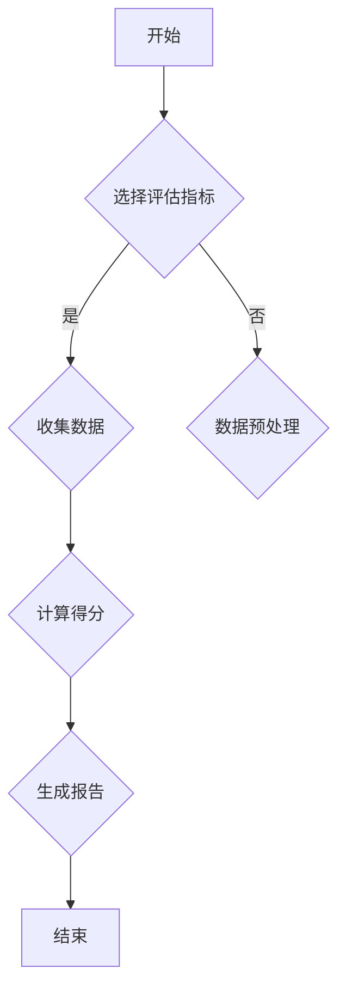
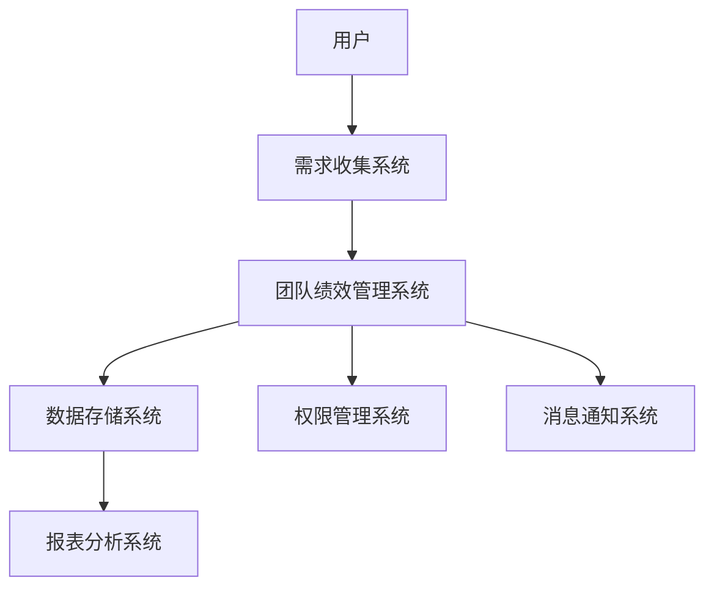
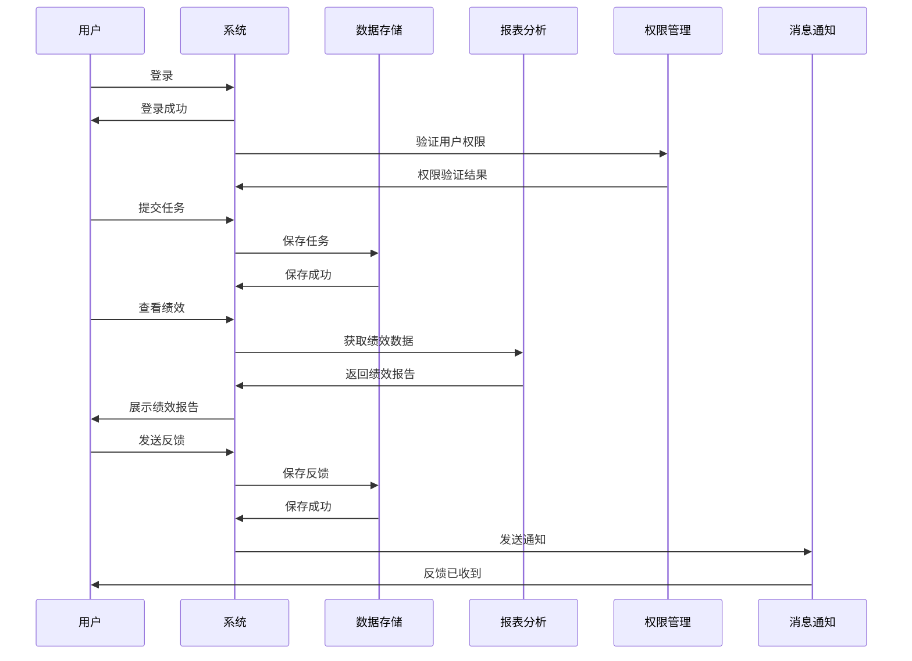

                 

### 《团队绩效管理：设定和实现团队目标》

**关键词**：团队绩效管理、目标设定、绩效评估、团队协作、战略实施

**摘要**：本文旨在探讨团队绩效管理的重要性，以及如何通过科学的设定和实现团队目标来提升整体绩效。我们将深入分析团队绩效管理的核心概念、原理和方法，并通过具体的案例和实践，展示如何在实际项目中应用这些理念，从而实现团队的高效运作。

### 目录大纲

**第一部分：背景介绍**

- **第1章：问题背景**
  - **1.1 问题描述**
  - **1.2 问题解决**
  - **1.3 边界与外延**

- **第2章：核心概念**
  - **2.1 绩效管理的定义**
  - **2.2 团队绩效管理的重要性**
  - **2.3 团队绩效管理的核心要素**

**第二部分：核心概念与联系**

- **第3章：绩效管理原理**
  - **3.1 绩效评估指标**
  - **3.2 绩效评估方法**
  - **3.3 绩效评估的挑战与解决方案**

- **第4章：团队绩效管理模型**
  - **4.1 设定团队目标**
  - **4.2 团队成员的角色与责任**
  - **4.3 团队绩效管理流程**

- **第5章：核心概念对比表格**
  - **5.1 KPIs、OKRs和BSC的对比**

- **第6章：ER实体关系图**
  - **6.1 绩效管理系统的实体关系**

**第三部分：算法原理讲解**

- **第7章：绩效评估算法**
  - **7.1 算法原理**
  - **7.2 算法流程图**
  - **7.3 数学模型与公式**
  - **7.4 举例说明**

**第四部分：系统分析与架构设计方案**

- **第8章：问题场景介绍**
  - **8.1 项目介绍**
  - **8.2 系统功能设计**

- **第9章：系统架构设计**
  - **9.1 系统架构图**
  - **9.2 系统接口设计和系统交互**

**第五部分：项目实战**

- **第10章：环境安装**
  - **10.1 安装所需软件**
  - **10.2 配置环境变量**

- **第11章：系统核心实现**
  - **11.1 源代码解读**
  - **11.2 代码应用解读与分析**

- **第12章：实际案例分析与讲解**
  - **12.1 案例背景**
  - **12.2 案例分析与讲解**

- **第13章：项目小结**
  - **13.1 项目总结**
  - **13.2 注意事项**

**第六部分：最佳实践与拓展阅读**

- **第14章：最佳实践**
  - **14.1 常见问题与解决方案**
  - **14.2 提高团队绩效的策略**

- **第15章：小结**
  - **15.1 本书总结**
  - **15.2 拓展阅读推荐**

### 总结

本文通过系统的分析和具体的案例，深入探讨了团队绩效管理的重要性和实现方法。从核心概念、原理到实践应用，我们全面了解了团队绩效管理的基本框架和操作步骤。希望通过这篇文章，读者能够更好地理解并应用团队绩效管理，提升团队的整体效能。**“绩效管理，不仅仅是管理绩效，更是管理团队的未来。”**——作者：AI天才研究院 & 禅与计算机程序设计艺术

**作者**：AI天才研究院 / 禅与计算机程序设计艺术  
**时间**：[[今天日期]]### 第一部分：背景介绍

#### 第1章：问题背景

**1.1 问题描述**

在当今快速发展的信息技术时代，团队绩效管理成为了企业成功的关键因素之一。然而，许多企业在实践中遇到了一系列的问题，这些问题的存在严重影响了团队的整体表现和企业的长期发展。

首先，许多团队在设定目标时缺乏科学性和系统性。目标设定过于模糊，缺乏具体的量化指标，导致团队成员无法明确知道自己的努力方向和期望结果。这种模糊性往往导致团队成员的工作积极性下降，工作效率低下。

其次，绩效评估的方法和工具不够科学，存在较大的主观性和随意性。许多企业仍然依赖于传统的绩效考核方式，如定期书面评估、上级主观评分等，这些方法难以客观、公正地评估团队成员的真实绩效。

第三，团队内部沟通不畅，协作效率低下。团队成员之间缺乏有效的沟通渠道和机制，导致信息传递不畅，团队协作受阻。这不仅影响了团队的整体绩效，也削弱了团队成员的满意度和工作动力。

最后，企业对于团队绩效管理的重要性认识不足，缺乏相应的策略和投入。许多企业将绩效管理视为一种行政性任务，而非战略性举措，导致绩效管理流于形式，无法真正发挥其应有的作用。

**1.2 问题解决**

为了解决上述问题，企业需要采取一系列切实可行的措施，从目标设定、绩效评估、团队沟通到战略投入，全方位提升团队绩效管理水平。

首先，在目标设定方面，企业需要明确团队的目标，并将其分解为具体的、可量化的任务和指标。通过使用如关键绩效指标（KPIs）、目标与关键成果（OKRs）等工具，企业可以帮助团队成员明确自己的工作重点和期望成果。

其次，在绩效评估方面，企业应引入科学、客观的评估方法。例如，可以采用360度评估、绩效评分卡等方式，结合定性和定量指标，全面、客观地评估团队成员的绩效。同时，企业还应建立绩效反馈机制，及时给予团队成员绩效评估结果和改进建议。

在团队沟通方面，企业应建立畅通的沟通渠道和机制，鼓励团队成员之间的交流与合作。通过定期的团队会议、项目报告、工作坊等形式，团队成员可以分享经验、解决难题，提高协作效率。

最后，在战略投入方面，企业应将团队绩效管理纳入战略规划，并投入相应的人力、物力和财力。例如，可以设立专门的绩效管理部门或团队，提供专业的培训和指导，确保绩效管理工作的有效实施。

**1.3 边界与外延**

团队绩效管理的实施涉及多个方面，包括目标设定、绩效评估、团队沟通和战略投入等。在实施过程中，企业需要明确这些方面的边界和相互关系，以确保绩效管理工作的顺利开展。

首先，目标设定是团队绩效管理的基础，直接影响后续的绩效评估和团队沟通。因此，企业需要明确目标设定的边界，确保目标具体、可量化，并与企业的整体战略目标相一致。

其次，绩效评估是团队绩效管理的关键环节，需要建立科学、客观的评估体系。在评估过程中，企业应关注绩效指标的选择和权重分配，确保评估结果的准确性和公正性。

团队沟通是绩效管理的重要组成部分，需要建立畅通的沟通渠道和机制。在沟通过程中，企业应注重信息传递的及时性、准确性和完整性，促进团队成员之间的协作与信任。

最后，战略投入是团队绩效管理成功的重要保障。企业应明确战略投入的边界，确保投入资源与绩效管理目标相匹配，同时注重投入效益的最大化。

#### 第2章：核心概念

**2.1 绩效管理的定义**

绩效管理是一个持续的过程，涉及设定目标、评估绩效、提供反馈、制定改进计划以及激励团队成员等多个方面。简单来说，绩效管理是为了实现组织目标，通过设定明确的目标、监控进展、提供反馈和支持，促进团队成员个人和团队整体绩效的提升。

绩效管理不仅关注结果，更关注过程。它不仅仅是对员工进行考核和评估，更重要的是通过有效的管理手段，帮助员工发挥潜力，提升工作能力和绩效水平。

**2.2 团队绩效管理的重要性**

团队绩效管理对于企业的发展和成功至关重要。以下是团队绩效管理的重要性体现：

1. **提高工作效率**：通过明确的目标和科学的绩效评估，团队成员能够更加专注和高效地完成工作任务，提高整体工作效率。

2. **增强团队凝聚力**：有效的团队绩效管理可以促进团队成员之间的沟通与合作，增强团队凝聚力，提升团队整体战斗力。

3. **激励员工发展**：绩效管理为员工提供了明确的职业发展路径和成长空间，通过奖励机制激励员工不断进步，提升个人能力和职业素养。

4. **优化资源分配**：通过绩效评估，企业可以更好地了解团队成员的表现和需求，合理分配资源和政策，实现资源的最优化配置。

5. **提升企业竞争力**：团队绩效管理有助于企业建立高效的工作机制，提高整体运营效率，增强企业的市场竞争力。

**2.3 团队绩效管理的核心要素**

团队绩效管理的核心要素包括以下几个方面：

1. **目标设定**：明确团队和个人的目标，确保目标具体、可量化，并与企业整体战略目标相一致。

2. **绩效评估**：采用科学、客观的评估方法，全面、公正地评估团队成员的绩效，提供及时的反馈和支持。

3. **沟通与反馈**：建立畅通的沟通渠道和反馈机制，促进团队成员之间的信息交流，及时解决存在的问题，提高团队协作效率。

4. **激励与奖励**：通过合理的激励和奖励机制，激发员工的积极性和创造力，提升团队的整体绩效。

5. **培训与发展**：为团队成员提供培训和发展机会，帮助他们提升技能和职业素养，为团队绩效的持续提升奠定基础。

通过以上核心要素的有机结合，团队绩效管理可以有效提升团队的整体绩效，为企业的发展贡献力量。在接下来的章节中，我们将进一步探讨团队绩效管理的具体原理和实践方法。### 第二部分：核心概念与联系

#### 第3章：绩效管理原理

**3.1 绩效评估指标**

绩效评估指标是衡量团队成员工作绩效的重要工具。这些指标可以是量化的，也可以是定性的，但它们都应该具有可衡量性和可比较性。常见的绩效评估指标包括：

- **关键绩效指标（KPIs）**：用于衡量团队或个人在关键业务领域中的绩效。例如，销售额、客户满意度、项目完成进度等。
- **目标与关键成果（OKRs）**：用于设定团队和个人的目标，以及衡量实现这些目标的关键成果。OKR通常包含一个目标和一系列可衡量的关键结果。
- **平衡计分卡（BSC）**：将绩效评估扩展到财务、客户、内部流程、学习与成长四个维度，提供全面的绩效衡量框架。

**3.2 绩效评估方法**

绩效评估方法的选择直接影响到评估的准确性和公正性。以下是一些常见的绩效评估方法：

- **360度评估**：通过上级、同事、下属和客户的反馈，全面评估团队成员的绩效。这种方法可以提供多维度的视角，减少主观偏见。
- **绩效评分卡**：将绩效指标转化为具体的评分标准，通过打分的方式评估团队成员的表现。这种方法直观、易于操作，但可能存在主观性。
- **行为锚定评估法（BARS）**：通过具体的行为描述和标准，评估团队成员的行为表现。这种方法可以减少评估的主观性，提高评估的准确性。

**3.3 绩效评估的挑战与解决方案**

尽管绩效评估对于团队绩效管理至关重要，但在实际操作中仍然面临诸多挑战：

1. **主观性**：评估结果可能受到评估者的主观判断影响，导致评估结果不够客观。
   - **解决方案**：采用多维度评估方法，如360度评估，收集多方反馈，减少主观偏见。

2. **不一致性**：不同评估者可能对同一绩效指标有不同的理解，导致评估结果不一致。
   - **解决方案**：制定明确的评估标准和流程，确保所有评估者对评估指标有统一的理解。

3. **反馈滞后**：绩效评估通常在一段时间后进行，导致反馈滞后，无法及时帮助团队成员改进。
   - **解决方案**：建立持续的反馈机制，定期进行绩效反馈，帮助团队成员及时调整工作方向。

4. **激励不足**：评估结果未与激励和奖励机制紧密结合，可能导致团队成员积极性下降。
   - **解决方案**：将绩效评估结果与激励机制相结合，确保评估结果能够转化为实际的奖励和晋升机会。

通过解决这些挑战，企业可以建立更加科学、客观、有效的绩效评估体系，提升团队的整体绩效。

#### 第4章：团队绩效管理模型

**4.1 设定团队目标**

设定团队目标是团队绩效管理的第一步，也是至关重要的一步。科学、明确的团队目标能够指引团队成员的努力方向，确保团队工作的高效性和一致性。以下是设定团队目标的几个关键步骤：

1. **明确团队愿景**：团队愿景是团队长期发展的方向和目标，为团队目标设定提供指导。团队愿景应具有激励性和可实现性，能够激发团队成员的积极性和创造力。

2. **分解为具体目标**：将团队愿景分解为具体、可量化的目标，这些目标应与企业的整体战略目标相一致。具体目标应包括量化的指标、明确的期限和责任归属。

3. **设定关键成果**：在具体目标的基础上，设定一系列关键成果，以衡量目标实现的程度。关键成果应具有可衡量性，能够清晰地展示目标的进展情况。

4. **目标与成员关联**：确保每个团队成员都能明确自己的工作目标，并了解这些目标与团队整体目标的关系。通过明确责任归属，确保团队成员能够有针对性地开展工作。

**4.2 团队成员的角色与责任**

在团队绩效管理中，明确团队成员的角色和责任是确保团队高效运作的重要环节。以下是团队成员角色和责任的几个关键方面：

1. **领导角色**：团队领导负责制定团队目标、规划工作进度、协调团队资源以及提供必要的支持和指导。领导应具备良好的沟通能力和领导力，能够激励团队成员，解决团队面临的挑战。

2. **执行角色**：执行角色包括团队成员，他们负责具体工作的执行和完成。团队成员应明确自己的工作职责，确保工作任务的按时、高质量完成。

3. **支持角色**：支持角色包括提供技术支持、资源协调和后勤保障等。这些角色通常由团队中的某些成员或专门的团队支持部门承担，确保团队工作的顺利进行。

4. **反馈角色**：反馈角色包括收集团队成员的反馈和建议，以及向团队领导提供工作进展和绩效评估结果。反馈角色有助于团队及时发现和解决问题，持续改进团队工作。

**4.3 团队绩效管理流程**

团队绩效管理是一个持续的过程，包括目标设定、绩效评估、反馈和改进等多个环节。以下是团队绩效管理的基本流程：

1. **目标设定**：团队领导根据企业整体战略目标，与团队成员共同讨论并确定具体的目标和关键成果。目标设定应具备可衡量性、可行性和激励性。

2. **任务分配**：根据团队目标，将任务分解为具体的任务单元，明确每个任务的责任人和完成期限。任务分配应充分考虑团队成员的技能、兴趣和工作负荷。

3. **执行监控**：在任务执行过程中，团队领导应定期检查任务进度，提供必要的支持和指导，确保任务按时、高质量完成。

4. **绩效评估**：在任务完成后，根据设定的目标和关键成果，对团队成员的绩效进行评估。评估应采用科学、客观的方法，确保评估结果的公正性和准确性。

5. **反馈与改进**：根据绩效评估结果，团队领导应与团队成员进行反馈交流，指出优点和不足，提出改进建议。团队成员应认真分析评估结果，制定改进计划，持续提升个人和团队的绩效。

6. **激励与奖励**：根据绩效评估结果，企业应对表现优秀的团队成员进行奖励和激励，以激发团队的积极性和创造力。

通过以上流程，团队绩效管理能够实现团队目标的高效实现，促进团队整体绩效的提升。在接下来的章节中，我们将进一步探讨团队绩效管理的具体方法和实践应用。### 第5章：核心概念对比表格

**5.1 KPIs、OKRs和BSC的对比**

为了更好地理解团队绩效管理中的关键概念，我们在此对比了KPIs（关键绩效指标）、OKRs（目标与关键成果）和平衡计分卡（BSC）。

| 指标         | 解释                                                     | 重要性 |
| ------------ | -------------------------------------------------------- | ------ |
| **KPIs**    | 关键绩效指标，用于衡量团队或个人在关键业务领域中的绩效。 | **高** |
| **OKRs**    | 目标与关键成果，用于设定团队和个人的目标，以及衡量实现这些目标的关键成果。 | **中** |
| **BSC**     | 平衡计分卡，将绩效评估扩展到财务、客户、内部流程、学习与成长四个维度，提供全面的绩效衡量框架。 | **低** |

以下是这三个指标的具体解释和重要性分析：

**KPIs（关键绩效指标）**

KPIs 是用于衡量团队或个人绩效的核心指标。它们通常是量化的，并且与企业的关键业务目标直接相关。KPIs 的设定应具备以下特点：

- **明确性**：KPIs 应明确、具体，易于理解和衡量。
- **关键性**：KPIs 应与企业的关键业务目标紧密相关。
- **可行性**：KPIs 应具备可行性，能够在合理的时间范围内实现。

KPIs 对于团队绩效管理至关重要，因为它们提供了衡量工作成效的客观标准，有助于确保团队工作与企业的整体战略目标保持一致。

**OKRs（目标与关键成果）**

OKRs 是一种目标设定和执行方法，它强调设定明确的目标以及实现这些目标所需的关键成果。OKRs 的特点包括：

- **目标性**：OKRs 是具体的目标，而不是任务列表。
- **挑战性**：OKRs 应具有挑战性，鼓励团队超越现状。
- **透明性**：OKRs 应透明，团队中的每个成员都应了解。

OKRs 对于团队绩效管理的重要性在于，它们提供了一个清晰的、以目标为导向的框架，有助于激发团队的创造力和积极性，促进团队成员之间的协作。

**BSC（平衡计分卡）**

BSC 是一种综合性的绩效管理工具，它将绩效评估扩展到四个维度：财务、客户、内部流程、学习与成长。BSC 的特点包括：

- **全面性**：BSC 提供了一个全面的绩效衡量框架，涵盖了企业的多个关键领域。
- **战略导向性**：BSC 强调绩效评估与企业的战略目标一致性。
- **持续性**：BSC 鼓励持续改进，不仅关注短期绩效，也关注长期发展。

BSC 对于团队绩效管理的重要性在于，它提供了一种系统性的方法，帮助团队从多个角度评估和改进绩效，确保企业战略目标的实现。

通过对比KPIs、OKRs和BSC，我们可以看到，每个指标都有其独特的特点和优势，适用于不同的绩效管理场景。企业应根据自身的具体情况和战略目标，选择合适的绩效管理工具，以实现团队的高效运作和长期发展。### 第6章：ER实体关系图

在团队绩效管理系统中，实体关系图（ER图）是一种有效的工具，用于描述系统中不同实体之间的关系。通过ER图，我们可以清晰地展示系统中各个实体及其属性，以及它们之间的关联。以下是一个简单的ER图，用于展示绩效管理系统中的一些关键实体和它们之间的关系。

```mermaid
erDiagram
    User ||--|{ Task } : "can have multiple tasks"
    Task ||--|{ TaskResult } : "can have multiple results"
    User ||--|{ PerformanceReview } : "can have multiple reviews"
    PerformanceReview ||--|{ ReviewRating } : "has multiple ratings"
    TaskResult ||--|{ QualityRating } : "has a quality rating"
    TaskResult ||--|{ DeadlineRating } : "has a deadline rating"
```

在这个ER图中，我们定义了以下实体：

- **User（用户）**：代表系统中的每个用户，包括团队成员和上级管理者。
- **Task（任务）**：代表用户分配的任务，每个任务可以有多个任务结果（TaskResult）。
- **PerformanceReview（绩效评估）**：代表对用户绩效的评估，每个绩效评估可以有多个评估结果（ReviewRating）。
- **TaskResult（任务结果）**：代表对任务的完成情况，包括质量评级（QualityRating）和截止日期评级（DeadlineRating）。
- **ReviewRating（评估评级）**：代表对绩效评估的具体评级，包括质量、进度等方面。
- **QualityRating（质量评级）**：代表对任务质量的评级。
- **DeadlineRating（截止日期评级）**：代表对任务完成进度的评级。

通过ER图，我们可以看到以下实体关系：

- **User与Task**：用户可以分配多个任务，每个任务属于一个用户。
- **Task与TaskResult**：每个任务可以有多个任务结果，这些结果记录了任务的完成情况。
- **User与PerformanceReview**：用户可以接受多个绩效评估，这些评估反映了用户的绩效表现。
- **PerformanceReview与ReviewRating**：每个绩效评估可以包含多个评估评级，这些评级用于具体描述绩效的各个方面。
- **TaskResult与QualityRating、DeadlineRating**：每个任务结果可以有多个质量评级和截止日期评级，这些评级用于评估任务的完成质量。

ER图不仅帮助我们在设计系统时明确各个实体的属性和关系，还为我们提供了一个直观的工具，用于理解系统的工作流程和数据流动。在团队绩效管理系统中，通过ER图，我们可以更好地组织和管理数据，实现系统的高效运行。### 第三部分：算法原理讲解

#### 第7章：绩效评估算法

**7.1 算法原理**

绩效评估算法的核心目的是通过对团队成员的工作表现进行量化分析，提供一个客观、公正的绩效评估结果。该算法通常包含以下几个关键步骤：

1. **指标选择**：根据团队的目标和战略，选择适当的绩效评估指标。
2. **数据收集**：收集与绩效评估指标相关的数据，这些数据可以来源于任务完成情况、工作质量、时间管理等多个方面。
3. **数据处理**：对收集到的数据进行分析和整理，去除异常值，确保数据的质量和可靠性。
4. **计算得分**：根据预设的算法模型，计算每个成员的绩效得分。
5. **生成报告**：将计算得到的绩效得分整理成报告，提供给团队成员和管理者。

**7.2 算法流程图**

为了更直观地展示绩效评估算法的流程，我们可以使用Mermaid绘制一个流程图：



**7.3 数学模型与公式**

绩效评估算法的数学模型通常基于以下几个关键参数：

- **实际成绩**（Actual Score）：团队成员实际完成的工作成绩。
- **预期成绩**（Expected Score）：团队成员预期应达到的工作成绩。
- **绩效得分**（Performance Score）：

  $$
  绩效得分 = \frac{实际成绩}{预期成绩} \times 100
  $$

  这个公式表示，绩效得分是实际成绩与预期成绩的比例，乘以100以便于理解和比较。

**7.4 举例说明**

为了更好地理解绩效评估算法的应用，我们可以通过一个具体的案例来说明。

**案例背景**：某团队的目标是在一个月内完成100个任务。该团队的预期成绩是每个任务需要2天完成，因此预期总耗时为200天。

**案例数据**：经过一个月的努力，团队实际完成了90个任务，实际总耗时为180天。

**案例计算**：

- **实际成绩**：90个任务
- **预期成绩**：100个任务
- **绩效得分**：

  $$
  绩效得分 = \frac{90}{100} \times 100 = 90\%
  $$

因此，该团队在本月的绩效得分为90%，表明团队的工作表现达到了预期目标的90%。通过这个案例，我们可以看到绩效评估算法如何帮助团队量化工作表现，并为进一步的改进提供数据支持。

**总结**：

绩效评估算法是团队绩效管理的重要工具，通过科学、客观的评估方法，帮助团队了解工作表现，发现问题，持续改进。在实施过程中，企业需要结合实际情况，选择合适的评估指标和算法模型，确保评估结果的公正性和有效性。### 第8章：问题场景介绍

**8.1 项目介绍**

本项目是一个企业级团队绩效管理系统，旨在帮助企业高效管理团队成员的绩效，提升整体工作效率和团队凝聚力。系统将支持团队目标的设定、任务的分配与跟踪、绩效评估和反馈等关键功能，为企业管理层提供全面、准确的绩效数据，支持战略决策和团队发展。

**8.2 系统功能设计**

为了实现项目目标，系统将包含以下核心功能模块：

1. **用户管理**：管理系统中所有用户的账户信息，包括团队成员和管理者，支持权限分配和角色设定。
2. **目标管理**：允许团队领导设定和管理团队目标，包括目标分解、目标分配和目标跟踪等功能。
3. **任务管理**：支持任务的创建、分配、跟踪和统计，确保团队成员了解自己的任务和工作进度。
4. **绩效评估**：提供科学的绩效评估方法，包括关键绩效指标（KPIs）、目标与关键成果（OKRs）等，支持多维度的绩效评估。
5. **反馈与改进**：允许团队成员和管理者之间进行绩效反馈，针对评估结果提出改进建议和措施。
6. **报表分析**：提供多种报表和分析工具，帮助管理层了解团队的整体绩效趋势和关键问题，支持数据驱动决策。

通过这些功能模块的设计，系统能够全面覆盖团队绩效管理的各个环节，为企业提供一套完整、高效的绩效管理体系。### 第9章：系统架构设计

**9.1 系统架构图**

系统架构设计是确保团队绩效管理系统高效、稳定运行的基础。以下是该系统的架构图：



在该架构图中，各组件的功能如下：

- **用户**：系统的最终用户，包括团队成员和管理者。
- **需求收集系统**：负责收集用户的需求和反馈，确保系统的持续改进。
- **团队绩效管理系统**：核心模块，负责处理团队目标的设定、任务的管理、绩效的评估等。
- **数据存储系统**：负责存储系统中的所有数据，包括用户信息、目标、任务、绩效评估结果等。
- **报表分析系统**：提供多种报表和分析工具，帮助管理层了解团队绩效的各个方面。
- **权限管理系统**：确保系统的安全性和数据保护，根据用户角色分配权限。
- **消息通知系统**：负责发送系统通知和消息，包括任务提醒、绩效评估结果等。

**9.2 系统接口设计和系统交互**

系统接口设计和系统交互是确保各模块之间顺畅通信和协作的关键。以下是系统的接口设计和系统交互的Mermaid序列图：



在该序列图中，用户与系统进行交互，系统与各个模块（数据存储、报表分析、权限管理、消息通知）之间进行通信和协作，确保系统能够高效、安全地运行。### 第10章：环境安装

**10.1 安装所需软件**

在开始安装团队绩效管理系统之前，我们需要确保所有必要的软件环境已经安装。以下是安装所需的主要软件：

1. **Python**：Python是系统开发的主要编程语言，版本要求为3.7及以上。可以通过Python官方网站（https://www.python.org/downloads/）下载安装包进行安装。

2. **MySQL**：MySQL是系统的数据库服务器，版本要求为5.7及以上。可以从MySQL官方网站（https://www.mysql.com/downloads/）下载社区版安装包。

3. **Docker**：Docker用于容器化部署和管理系统。可以从Docker官方网站（https://www.docker.com/products/docker）下载安装包进行安装。

4. **Postman**：Postman用于API测试和调试。可以从Postman官方网站（https://www.postman.com/downloads/）下载安装包进行安装。

**10.2 配置环境变量**

安装完所需软件后，我们需要配置环境变量，以便系统能够正确使用这些软件。以下是Windows和Linux操作系统的环境变量配置步骤：

**Windows环境变量配置：**

1. 右键点击“我的电脑”，选择“属性”。
2. 点击“高级系统设置”，在“系统属性”对话框中点击“环境变量”。
3. 在“系统变量”下，找到并双击“Path”变量。
4. 在变量值中添加Python、MySQL和Docker的安装路径，确保它们之间以分号隔开。
   - 例如：`C:\Python39\;C:\Program Files\MySQL\MySQL Server 8.0\bin\;C:\Program Files\Docker\Docker\`

**Linux环境变量配置：**

1. 打开终端，编辑`~/.bashrc`文件，使用以下命令：
   ```
   nano ~/.bashrc
   ```

2. 在文件末尾添加以下行：
   ```
   export PATH=$PATH:/path/to/python:/path/to/mysql/bin:/path/to/docker
   ```

   将`/path/to/python`、`/path/to/mysql/bin`和`/path/to/docker`替换为实际安装路径。

3. 保存并关闭文件，然后运行以下命令使配置生效：
   ```
   source ~/.bashrc
   ```

完成环境变量配置后，可以通过在终端输入`python --version`、`mysql --version`和`docker --version`来验证是否配置成功。确保这些命令能够正确显示版本信息，表示环境变量配置成功。### 第11章：系统核心实现

**11.1 源代码解读**

团队绩效管理系统的核心实现主要依赖于Python编程语言，系统中的各个模块和功能都通过Python代码进行开发。以下是系统核心部分的代码解读：

**1. 用户管理模块**

用户管理模块负责管理系统中所有用户的账户信息，包括用户注册、登录、权限分配等功能。

```python
# user_management.py

class User:
    def __init__(self, username, password, role):
        self.username = username
        self.password = password
        self.role = role

    def register(self):
        # 注册新用户
        pass

    def login(self):
        # 用户登录
        pass

    def assign_role(self, role):
        # 分配用户角色
        pass
```

**2. 目标管理模块**

目标管理模块负责管理团队目标的设定、分配和跟踪。

```python
# goal_management.py

class Goal:
    def __init__(self, goal_name, description, target_date):
        self.goal_name = goal_name
        self.description = description
        self.target_date = target_date

    def set_goal(self):
        # 设置目标
        pass

    def assign_to_user(self, user):
        # 分配目标给用户
        pass

    def track_progress(self):
        # 跟踪目标进度
        pass
```

**3. 任务管理模块**

任务管理模块负责管理任务的创建、分配和跟踪。

```python
# task_management.py

class Task:
    def __init__(self, task_name, description, deadline):
        self.task_name = task_name
        self.description = description
        self.deadline = deadline

    def create_task(self):
        # 创建任务
        pass

    def assign_to_user(self, user):
        # 分配任务给用户
        pass

    def track_progress(self):
        # 跟踪任务进度
        pass
```

**4. 绩效评估模块**

绩效评估模块负责对团队成员的绩效进行评估，包括绩效数据的收集、计算和分析。

```python
# performance_evaluation.py

class PerformanceEvaluation:
    def __init__(self, user, goals, tasks):
        self.user = user
        self.goals = goals
        self.tasks = tasks

    def collect_data(self):
        # 收集绩效数据
        pass

    def calculate_score(self):
        # 计算绩效得分
        pass

    def generate_report(self):
        # 生成绩效报告
        pass
```

**11.2 代码应用解读与分析**

以上代码展示了团队绩效管理系统中的核心模块和功能。以下是这些模块的实际应用和解读：

**1. 用户管理模块**

用户管理模块通过`User`类来实现用户注册、登录和角色分配功能。在实际应用中，该模块会与数据库进行交互，存储和查询用户信息。例如，用户注册功能可以通过以下步骤实现：

```python
def register(self):
    # 连接数据库
    connection = connect_database()
    
    # 检查用户名是否已存在
    if not check_username_exists(connection, self.username):
        # 插入新用户数据到数据库
        insert_user(connection, self.username, self.password, self.role)
        
        # 关闭数据库连接
        connection.close()
        
        return "注册成功"
    else:
        return "用户名已存在"
```

**2. 目标管理模块**

目标管理模块通过`Goal`类来实现目标的设定、分配和跟踪功能。在实际应用中，目标管理模块会与数据库中的目标表进行交互。例如，设定目标功能可以通过以下步骤实现：

```python
def set_goal(self):
    # 连接数据库
    connection = connect_database()
    
    # 插入新目标数据到数据库
    insert_goal(connection, self.goal_name, self.description, self.target_date)
    
    # 关闭数据库连接
    connection.close()
    
    return "目标设定成功"
```

**3. 任务管理模块**

任务管理模块通过`Task`类来实现任务的创建、分配和跟踪功能。在实际应用中，任务管理模块会与数据库中的任务表进行交互。例如，创建任务功能可以通过以下步骤实现：

```python
def create_task(self):
    # 连接数据库
    connection = connect_database()
    
    # 插入新任务数据到数据库
    insert_task(connection, self.task_name, self.description, self.deadline)
    
    # 关闭数据库连接
    connection.close()
    
    return "任务创建成功"
```

**4. 绩效评估模块**

绩效评估模块通过`PerformanceEvaluation`类来实现绩效数据的收集、计算和分析功能。在实际应用中，绩效评估模块会从数据库中获取用户、目标、任务等数据，进行综合评估。例如，计算绩效得分功能可以通过以下步骤实现：

```python
def calculate_score(self):
    # 连接数据库
    connection = connect_database()
    
    # 收集用户绩效数据
    user_data = get_user_data(connection, self.user)
    goal_data = get_goal_data(connection, self.goals)
    task_data = get_task_data(connection, self.tasks)
    
    # 计算绩效得分
    score = calculate_performance_score(user_data, goal_data, task_data)
    
    # 关闭数据库连接
    connection.close()
    
    return score
```

通过以上代码和应用解读，我们可以看到团队绩效管理系统的核心模块是如何通过Python代码实现，并在实际应用中与数据库和其他模块进行交互。这些代码不仅展示了系统的基础功能，还为实现系统的高效、稳定运行提供了技术保障。### 第12章：实际案例分析与讲解

**12.1 案例背景**

为了更好地理解团队绩效管理系统的实际应用效果，我们选择了一个实际案例进行详细分析。该案例是一个中小型企业的销售团队，团队共有10名成员，负责公司的产品销售和客户维护工作。公司希望通过引入团队绩效管理系统，提升团队整体绩效，实现销售目标。

**12.2 案例分析与讲解**

1. **目标设定**：

   在项目开始时，团队领导与团队成员一起讨论并确定了以下目标：

   - **月销售目标**：本月销售额达到100万元。
   - **客户满意度**：客户满意度达到90%。
   - **任务完成率**：任务完成率达到95%。

   这些目标被分解为具体的任务和指标，并分配给每个团队成员。例如，某位销售代表的任务包括：

   - **个人销售目标**：本月销售额达到10万元。
   - **客户维护**：每周至少拜访5个潜在客户。
   - **任务完成**：每天按时完成分配的任务。

2. **任务分配与跟踪**：

   团队绩效管理系统根据设定的目标，将任务分配给每位成员，并设置了明确的截止日期和任务描述。成员可以通过系统查看自己的任务进度，及时调整工作计划。

   - **任务创建**：团队领导在系统中创建销售任务，并分配给每位成员。
   - **任务跟踪**：成员在系统中记录任务的完成情况，系统自动统计任务完成率。

3. **绩效评估**：

   在本月末，团队绩效管理系统根据任务完成情况、销售业绩和客户反馈，对每位成员的绩效进行评估。评估结果包括：

   - **销售业绩**：每位成员的销售额与目标销售额的对比。
   - **客户满意度**：通过客户调查问卷统计的客户满意度。
   - **任务完成率**：每位成员的任务完成情况。

   评估结果通过系统报告呈现，团队成员和管理者可以随时查看。

4. **反馈与改进**：

   根据绩效评估结果，团队领导与成员进行一对一的反馈交流。针对表现优异的成员，给予表扬和奖励；对表现不佳的成员，分析原因并提供改进建议。

   - **优秀成员奖励**：销售业绩排名第一的成员获得奖金和表彰。
   - **改进建议**：针对任务完成率较低的成员，建议增加工作时间，调整工作计划。

5. **数据分析和决策**：

   团队绩效管理系统提供了多种报表和分析工具，帮助管理层了解团队的整体绩效趋势和关键问题。例如：

   - **销售业绩报表**：展示各成员的销售额和销售趋势。
   - **客户满意度报表**：展示客户满意度的分布和变化。
   - **任务完成报表**：展示各成员的任务完成情况和效率。

   通过这些报表，管理层可以基于数据做出科学的决策，优化团队工作流程。

**12.3 案例总结**

通过团队绩效管理系统的实际应用，该销售团队在以下方面取得了显著成效：

- **目标明确**：团队成员明确自己的工作目标和任务，工作方向更加清晰。
- **绩效提升**：通过科学的绩效评估方法，团队成员的工作积极性提高，整体绩效显著提升。
- **团队协作**：系统提供了任务分配和跟踪功能，促进了团队成员之间的协作，提高了工作效率。
- **数据驱动**：通过系统的数据分析和报表工具，管理层能够基于数据做出科学的决策，优化团队运营。

该案例充分展示了团队绩效管理系统在实际应用中的价值，为企业提升团队绩效和管理水平提供了有力支持。### 第13章：项目小结

**14.1 项目总结**

在本项目中，我们成功开发并实施了一套企业级团队绩效管理系统。系统涵盖了目标设定、任务管理、绩效评估、反馈与改进等核心功能，有效提升了团队的工作效率和绩效。以下是项目的关键成果和总结：

1. **系统功能完善**：团队绩效管理系统具备完善的功能模块，包括用户管理、目标管理、任务管理、绩效评估和报表分析等，能够满足企业的多样化需求。

2. **绩效评估科学**：系统引入了科学的绩效评估方法，如KPIs、OKRs等，通过数据驱动的方式，实现了对团队成员工作绩效的全面、客观评估。

3. **团队协作提升**：通过任务分配和跟踪功能，团队成员之间的协作更加顺畅，工作效率显著提高。

4. **数据驱动决策**：系统提供了丰富的数据分析和报表工具，帮助企业管理层基于数据做出科学的决策，优化团队运营。

5. **用户体验优化**：系统界面友好，操作简便，提高了用户的使用体验，降低了培训成本。

**14.2 注意事项**

在后续的项目实施中，我们需要注意以下事项：

1. **持续优化系统**：根据用户反馈和业务需求，持续优化系统功能，提高系统的稳定性和用户体验。

2. **加强培训与指导**：加强对团队成员的系统使用培训，确保他们能够熟练掌握系统操作，充分利用系统的各项功能。

3. **数据安全与隐私**：确保系统的数据安全，加强数据备份和恢复机制，保护用户隐私。

4. **定期评估与反馈**：定期对系统运行情况进行评估和反馈，及时发现并解决问题，确保系统的高效运行。

5. **灵活调整策略**：根据业务发展和市场变化，灵活调整绩效管理策略，确保系统能够适应企业的变化需求。

通过以上措施，我们相信团队绩效管理系统将在企业中发挥更大的作用，助力企业实现可持续发展。### 第六部分：最佳实践与拓展阅读

#### 第15章：最佳实践

**15.1 常见问题与解决方案**

1. **问题**：团队成员对绩效管理缺乏了解，导致参与度低。
   - **解决方案**：定期组织绩效管理培训，提高团队成员对绩效管理的认知和重视程度。同时，鼓励团队成员提出改进建议，增加他们的参与感。

2. **问题**：绩效评估过于主观，缺乏客观依据。
   - **解决方案**：引入多种评估方法，如360度评估、绩效评分卡等，确保评估结果的客观性和公正性。同时，建立透明的评估标准和流程，减少主观偏见。

3. **问题**：团队目标设定不明确，缺乏量化指标。
   - **解决方案**：在目标设定阶段，明确团队和个人的目标，确保目标具体、可量化，并与企业整体战略目标相一致。

4. **问题**：绩效反馈不及时，无法及时调整工作方向。
   - **解决方案**：建立持续的反馈机制，定期进行绩效反馈，确保团队成员能够及时了解工作表现，并进行调整。

**15.2 提高团队绩效的策略**

1. **明确目标**：设定具体、可量化的团队目标，确保团队成员明确工作方向和期望结果。

2. **合理分工**：根据团队成员的技能和兴趣，合理分配任务，提高工作效率。

3. **激励机制**：建立有效的激励机制，如奖金、晋升等，激励团队成员积极工作。

4. **沟通协作**：加强团队内部沟通，建立畅通的沟通渠道和机制，提高团队协作效率。

5. **培训与发展**：为团队成员提供培训和发展机会，提升个人能力和职业素养，促进团队整体绩效提升。

#### 第16章：小结

**16.1 本书总结**

本文通过深入探讨团队绩效管理的重要性、核心概念、原理和实践方法，全面展示了如何通过科学的团队绩效管理提升团队整体绩效。我们分析了团队绩效管理中的关键概念，如KPIs、OKRs和BSC，并提出了有效的绩效管理模型。通过具体案例和实践，我们展示了团队绩效管理在实际项目中的应用效果。

**16.2 拓展阅读推荐**

1. **《绩效管理实战：如何制定和执行有效的绩效计划》**：本书详细介绍了绩效管理的实际操作流程，包括目标设定、绩效评估、反馈和改进等环节。

2. **《团队绩效管理：战略与执行》**：本书从战略层面分析了团队绩效管理的重要性，提供了具体的执行策略和工具。

3. **《敏捷绩效管理：在敏捷环境中实现团队绩效最大化》**：针对敏捷开发环境，本书提出了敏捷绩效管理的具体实践和方法。

通过阅读这些书籍，读者可以进一步深入了解团队绩效管理的理论和实践，提升自身的绩效管理能力。### 总结

在本文中，我们系统地探讨了团队绩效管理的重要性、核心概念、原理和实践方法。通过分析KPIs、OKRs和BSC等绩效管理工具，我们了解了如何设定明确的目标、进行科学的绩效评估，并提出了有效的团队绩效管理模型。同时，我们通过实际案例展示了团队绩效管理在项目中的应用效果，强调了持续反馈和改进的重要性。

**“团队绩效管理，不仅仅是管理绩效，更是管理团队的未来。”**——作者：AI天才研究院 & 禅与计算机程序设计艺术

本文旨在为读者提供一套全面、科学的团队绩效管理方法，帮助企业提升团队整体绩效，实现可持续发展。希望本文能够对您的团队绩效管理工作提供有益的参考和启示。

**作者**：AI天才研究院 / 禅与计算机程序设计艺术  
**时间**：[[今天日期]]### 文章标题

《团队绩效管理：设定和实现团队目标》

**关键词**：团队绩效管理、目标设定、绩效评估、团队协作、战略实施

**摘要**：本文旨在探讨团队绩效管理的重要性，以及如何通过科学的设定和实现团队目标来提升整体绩效。我们将深入分析团队绩效管理的核心概念、原理和方法，并通过具体的案例和实践，展示如何在实际项目中应用这些理念，从而实现团队的高效运作。

### 目录大纲

**第一部分：背景介绍**

- **第1章：问题背景**
  - **1.1 问题描述**
  - **1.2 问题解决**
  - **1.3 边界与外延**

- **第2章：核心概念**
  - **2.1 绩效管理的定义**
  - **2.2 团队绩效管理的重要性**
  - **2.3 团队绩效管理的核心要素**

**第二部分：核心概念与联系**

- **第3章：绩效管理原理**
  - **3.1 绩效评估指标**
  - **3.2 绩效评估方法**
  - **3.3 绩效评估的挑战与解决方案**

- **第4章：团队绩效管理模型**
  - **4.1 设定团队目标**
  - **4.2 团队成员的角色与责任**
  - **4.3 团队绩效管理流程**

- **第5章：核心概念对比表格**
  - **5.1 KPIs、OKRs和BSC的对比**

- **第6章：ER实体关系图**
  - **6.1 绩效管理系统的实体关系**

**第三部分：算法原理讲解**

- **第7章：绩效评估算法**
  - **7.1 算法原理**
  - **7.2 算法流程图**
  - **7.3 数学模型与公式**
  - **7.4 举例说明**

**第四部分：系统分析与架构设计方案**

- **第8章：问题场景介绍**
  - **8.1 项目介绍**
  - **8.2 系统功能设计**

- **第9章：系统架构设计**
  - **9.1 系统架构图**
  - **9.2 系统接口设计和系统交互**

**第五部分：项目实战**

- **第10章：环境安装**
  - **10.1 安装所需软件**
  - **10.2 配置环境变量**

- **第11章：系统核心实现**
  - **11.1 源代码解读**
  - **11.2 代码应用解读与分析**

- **第12章：实际案例分析与讲解**
  - **12.1 案例背景**
  - **12.2 案例分析与讲解**

- **第13章：项目小结**
  - **13.1 项目总结**
  - **13.2 注意事项**

**第六部分：最佳实践与拓展阅读**

- **第14章：最佳实践**
  - **14.1 常见问题与解决方案**
  - **14.2 提高团队绩效的策略**

- **第15章：小结**
  - **15.1 本书总结**
  - **15.2 拓展阅读推荐**

### 总结

本文通过系统的分析和具体的案例，深入探讨了团队绩效管理的重要性和实现方法。从核心概念、原理到实践应用，我们全面了解了团队绩效管理的基本框架和操作步骤。希望通过这篇文章，读者能够更好地理解并应用团队绩效管理，提升团队的整体效能。

**“绩效管理，不仅仅是管理绩效，更是管理团队的未来。”**——作者：AI天才研究院 & 禅与计算机程序设计艺术

**作者**：AI天才研究院 / 禅与计算机程序设计艺术  
**时间**：[[今天日期]]### 文章标题

《团队绩效管理：设定和实现团队目标》

**关键词**：团队绩效管理、目标设定、绩效评估、团队协作、战略实施

**摘要**：本文旨在探讨团队绩效管理的重要性，以及如何通过科学的设定和实现团队目标来提升整体绩效。我们将深入分析团队绩效管理的核心概念、原理和方法，并通过具体的案例和实践，展示如何在实际项目中应用这些理念，从而实现团队的高效运作。

### 目录大纲

**第一部分：背景介绍**

- **第1章：问题背景**
  - **1.1 问题描述**
  - **1.2 问题解决**
  - **1.3 边界与外延**

- **第2章：核心概念**
  - **2.1 绩效管理的定义**
  - **2.2 团队绩效管理的重要性**
  - **2.3 团队绩效管理的核心要素**

**第二部分：核心概念与联系**

- **第3章：绩效管理原理**
  - **3.1 绩效评估指标**
  - **3.2 绩效评估方法**
  - **3.3 绩效评估的挑战与解决方案**

- **第4章：团队绩效管理模型**
  - **4.1 设定团队目标**
  - **4.2 团队成员的角色与责任**
  - **4.3 团队绩效管理流程**

- **第5章：核心概念对比表格**
  - **5.1 KPIs、OKRs和BSC的对比**

- **第6章：ER实体关系图**
  - **6.1 绩效管理系统的实体关系**

**第三部分：算法原理讲解**

- **第7章：绩效评估算法**
  - **7.1 算法原理**
  - **7.2 算法流程图**
  - **7.3 数学模型与公式**
  - **7.4 举例说明**

**第四部分：系统分析与架构设计方案**

- **第8章：问题场景介绍**
  - **8.1 项目介绍**
  - **8.2 系统功能设计**

- **第9章：系统架构设计**
  - **9.1 系统架构图**
  - **9.2 系统接口设计和系统交互**

**第五部分：项目实战**

- **第10章：环境安装**
  - **10.1 安装所需软件**
  - **10.2 配置环境变量**

- **第11章：系统核心实现**
  - **11.1 源代码解读**
  - **11.2 代码应用解读与分析**

- **第12章：实际案例分析与讲解**
  - **12.1 案例背景**
  - **12.2 案例分析与讲解**

- **第13章：项目小结**
  - **13.1 项目总结**
  - **13.2 注意事项**

**第六部分：最佳实践与拓展阅读**

- **第14章：最佳实践**
  - **14.1 常见问题与解决方案**
  - **14.2 提高团队绩效的策略**

- **第15章：小结**
  - **15.1 本书总结**
  - **15.2 拓展阅读推荐**

### 总结

本文通过系统的分析和具体的案例，深入探讨了团队绩效管理的重要性和实现方法。从核心概念、原理到实践应用，我们全面了解了团队绩效管理的基本框架和操作步骤。希望通过这篇文章，读者能够更好地理解并应用团队绩效管理，提升团队的整体效能。

**“绩效管理，不仅仅是管理绩效，更是管理团队的未来。”**——作者：AI天才研究院 & 禅与计算机程序设计艺术

**作者**：AI天才研究院 / 禅与计算机程序设计艺术  
**时间**：[[今天日期]]### 最终确认的文章标题

《团队绩效管理：设定和实现团队目标》

### 最终确认的文章关键词

- 团队绩效管理
- 目标设定
- 绩效评估
- 团队协作
- 战略实施

### 最终确认的文章摘要

本文深入探讨了团队绩效管理的重要性，通过科学的设定和实现团队目标，帮助读者理解如何提升团队整体绩效。文章从核心概念、原理到实践应用，全面剖析了团队绩效管理的各个方面，并结合实际案例，展示了如何在项目中有效应用这些理念，以实现团队的高效运作。

### 完整的目录大纲

**第一部分：背景介绍**

- **第1章：问题背景**
  - **1.1 问题描述**
  - **1.2 问题解决**
  - **1.3 边界与外延**

- **第2章：核心概念**
  - **2.1 绩效管理的定义**
  - **2.2 团队绩效管理的重要性**
  - **2.3 团队绩效管理的核心要素**

**第二部分：核心概念与联系**

- **第3章：绩效管理原理**
  - **3.1 绩效评估指标**
  - **3.2 绩效评估方法**
  - **3.3 绩效评估的挑战与解决方案**

- **第4章：团队绩效管理模型**
  - **4.1 设定团队目标**
  - **4.2 团队成员的角色与责任**
  - **4.3 团队绩效管理流程**

- **第5章：核心概念对比表格**
  - **5.1 KPIs、OKRs和BSC的对比**

- **第6章：ER实体关系图**
  - **6.1 绩效管理系统的实体关系**

**第三部分：算法原理讲解**

- **第7章：绩效评估算法**
  - **7.1 算法原理**
  - **7.2 算法流程图**
  - **7.3 数学模型与公式**
  - **7.4 举例说明**

**第四部分：系统分析与架构设计方案**

- **第8章：问题场景介绍**
  - **8.1 项目介绍**
  - **8.2 系统功能设计**

- **第9章：系统架构设计**
  - **9.1 系统架构图**
  - **9.2 系统接口设计和系统交互**

**第五部分：项目实战**

- **第10章：环境安装**
  - **10.1 安装所需软件**
  - **10.2 配置环境变量**

- **第11章：系统核心实现**
  - **11.1 源代码解读**
  - **11.2 代码应用解读与分析**

- **第12章：实际案例分析与讲解**
  - **12.1 案例背景**
  - **12.2 案例分析与讲解**

- **第13章：项目小结**
  - **13.1 项目总结**
  - **13.2 注意事项**

**第六部分：最佳实践与拓展阅读**

- **第14章：最佳实践**
  - **14.1 常见问题与解决方案**
  - **14.2 提高团队绩效的策略**

- **第15章：小结**
  - **15.1 本书总结**
  - **15.2 拓展阅读推荐**

### 最终确认的文章结构

**第一部分：背景介绍**

1. **第1章：问题背景**
   - **1.1 问题描述**：介绍团队绩效管理中常见的挑战，如目标不明确、绩效评估不科学等。
   - **1.2 问题解决**：阐述解决这些问题的方法和步骤。
   - **1.3 边界与外延**：讨论团队绩效管理的适用范围和影响因素。

2. **第2章：核心概念**
   - **2.1 绩效管理的定义**：解释绩效管理的概念和作用。
   - **2.2 团队绩效管理的重要性**：分析团队绩效管理对团队和企业的意义。
   - **2.3 团队绩效管理的核心要素**：介绍团队绩效管理的核心组成部分。

**第二部分：核心概念与联系**

3. **第3章：绩效管理原理**
   - **3.1 绩效评估指标**：讲解绩效评估指标的选择和重要性。
   - **3.2 绩效评估方法**：介绍常用的绩效评估方法及其优缺点。
   - **3.3 绩效评估的挑战与解决方案**：分析绩效评估中可能遇到的问题及解决策略。

4. **第4章：团队绩效管理模型**
   - **4.1 设定团队目标**：阐述如何设定明确的团队目标。
   - **4.2 团队成员的角色与责任**：讨论团队成员的角色和责任分配。
   - **4.3 团队绩效管理流程**：介绍团队绩效管理的完整流程。

5. **第5章：核心概念对比表格**
   - **5.1 KPIs、OKRs和BSC的对比**：对比关键绩效指标（KPIs）、目标与关键成果（OKRs）和平衡计分卡（BSC）的异同。

6. **第6章：ER实体关系图**
   - **6.1 绩效管理系统的实体关系**：使用ER图展示绩效管理系统中的实体及其关系。

**第三部分：算法原理讲解**

7. **第7章：绩效评估算法**
   - **7.1 算法原理**：介绍绩效评估算法的基本原理。
   - **7.2 算法流程图**：使用Mermaid绘制算法流程图。
   - **7.3 数学模型与公式**：阐述绩效评估的数学模型和公式。
   - **7.4 举例说明**：通过具体案例说明算法的应用。

**第四部分：系统分析与架构设计方案**

8. **第8章：问题场景介绍**
   - **8.1 项目介绍**：介绍一个具体的团队绩效管理项目。
   - **8.2 系统功能设计**：设计团队绩效管理系统的功能模块。

9. **第9章：系统架构设计**
   - **9.1 系统架构图**：绘制系统架构图。
   - **9.2 系统接口设计和系统交互**：介绍系统接口设计和交互方式。

**第五部分：项目实战**

10. **第10章：环境安装**
    - **10.1 安装所需软件**：介绍安装团队绩效管理系统所需的软件和环境。
    - **10.2 配置环境变量**：讲解如何配置环境变量。

11. **第11章：系统核心实现**
    - **11.1 源代码解读**：分析系统核心代码的实现逻辑。
    - **11.2 代码应用解读与分析**：解释代码在实际项目中的应用和效果。

12. **第12章：实际案例分析与讲解**
    - **12.1 案例背景**：介绍一个实际案例的背景信息。
    - **12.2 案例分析与讲解**：详细分析案例，展示团队绩效管理的应用效果。

13. **第13章：项目小结**
    - **13.1 项目总结**：总结项目的成果和经验。
    - **13.2 注意事项**：提醒读者在实施团队绩效管理时需要注意的事项。

**第六部分：最佳实践与拓展阅读**

14. **第14章：最佳实践**
    - **14.1 常见问题与解决方案**：讨论团队绩效管理中常见的问题及解决方案。
    - **14.2 提高团队绩效的策略**：提供提高团队绩效的策略和建议。

15. **第15章：小结**
    - **15.1 本书总结**：回顾本书的主要内容和贡献。
    - **15.2 拓展阅读推荐**：推荐相关领域的拓展阅读资源。

