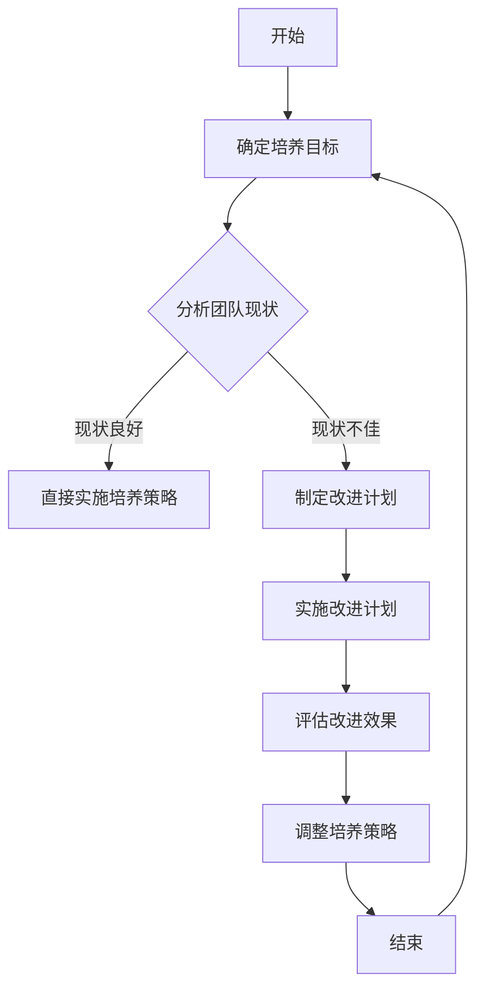
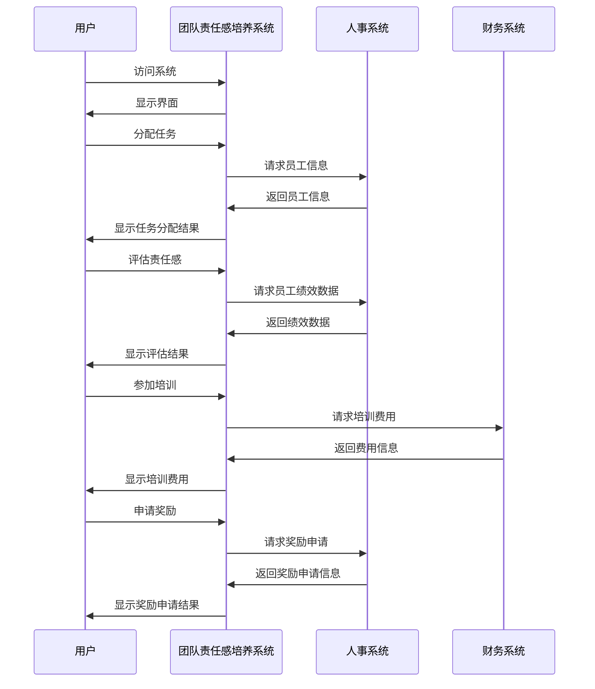
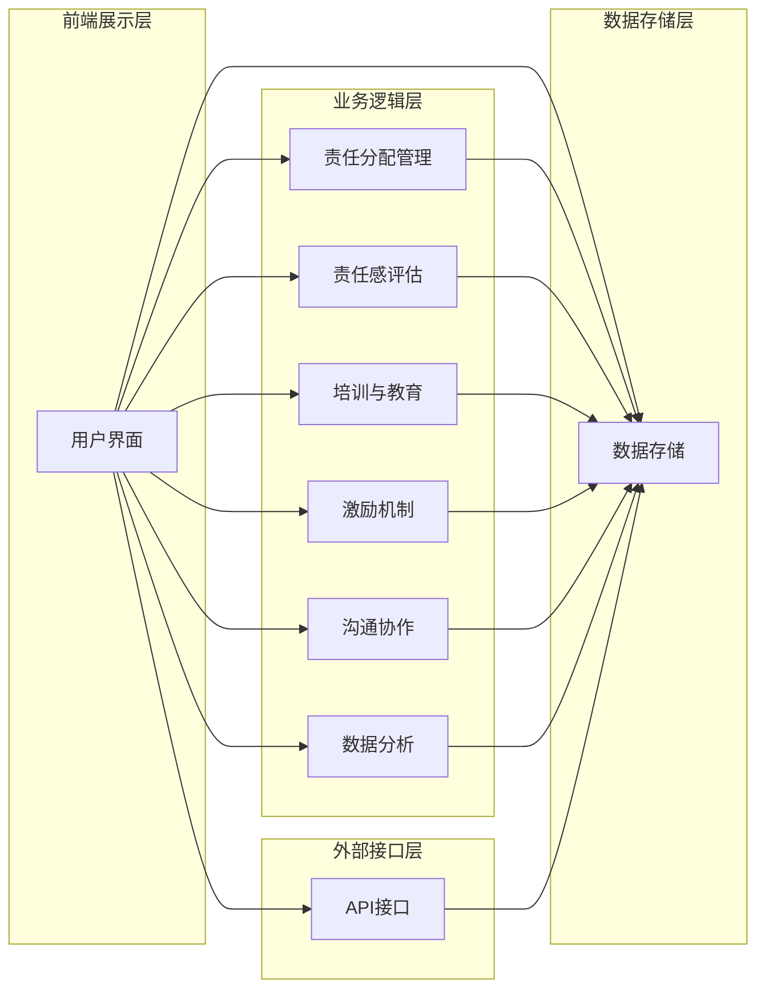

                 

# 团队责任感培养：增强使命感的技巧

## 关键词

团队责任感、使命感、培养策略、实践案例、组织效能

## 摘要

在信息化时代，团队责任感的培养已经成为提升组织效能的重要一环。本文旨在深入探讨团队责任感培养的技巧，尤其是增强团队成员使命感的策略。通过理论分析、实证研究和实践案例，本文提出了一套系统的团队责任感培养方法，旨在为企业管理者提供有效的实践指导，帮助团队更好地发挥协同效应，实现组织目标。

## 第一部分：背景介绍

### 1.1 问题背景

在现代社会，团队合作的重要性日益凸显。无论是企业、学术机构还是政府组织，团队协作已经成为提高工作效率、创新能力和解决复杂问题的关键。然而，团队责任感的缺乏却成为许多团队面临的一大难题。团队成员责任意识不足，可能导致工作质量下降、项目进度延误，甚至影响整个组织的稳定和发展。因此，如何培养团队责任感成为企业和团队管理者亟待解决的问题。

### 1.2 问题描述

团队责任感培养涉及多个层面，包括个人责任感、团队目标一致性、沟通协作能力等。现有研究多集中于单一维度，缺乏系统性和全面性。在实际操作中，企业往往难以找到适合自己团队的具体培养策略和方法。此外，团队成员的使命感也是影响团队责任感的重要因素，缺乏使命感可能导致团队成员对团队目标和任务缺乏认同和投入。

### 1.3 问题解决

为了解决团队责任感培养的问题，本文提出以下研究目标：

1. **明确团队责任感的核心概念和组成部分**：通过理论分析和实证研究，深入探讨团队责任感的基本构成，为后续的研究和实践提供理论依据。
2. **分析影响团队责任感的因素**：从个人、团队和组织层面分析影响团队责任感的各种因素，为培养策略的设计提供数据支持。
3. **提出有效的团队责任感培养策略**：结合理论分析和实践案例，提出一套系统、可操作的团队责任感培养方法，为企业提供实际操作的指导。
4. **研究团队使命感在责任感培养中的作用**：探讨如何通过增强团队使命感来提高团队成员的责任感，为组织管理提供新的思路。

### 1.4 边界与外延

本文主要关注企业团队责任感培养，适用于各类企业和团队。同时，本文所提出的方法和技巧也可供教育机构、政府机构及其他组织参考。在研究过程中，本文将重点关注以下几个方面：

1. **团队责任感的基本概念和构成**：包括个人责任感、集体责任感和互动责任感等。
2. **团队责任感培养的策略和方法**：如教育、培训、激励机制等。
3. **团队使命感的影响和作用**：如何通过增强团队使命感来提高团队责任感。
4. **实践案例的分析和总结**：通过具体案例，展示团队责任感培养的实际效果和操作方法。

### 1.5 概念结构与核心要素组成

为了深入探讨团队责任感培养，我们需要明确以下核心概念和要素：

- **团队责任感**：团队成员对团队目标和任务的承诺和责任感。它包括自我责任感、集体责任感和互动责任感。
- **培养策略**：通过教育、培训、激励机制等手段，提高团队成员的团队责任感。
- **实践案例**：通过具体案例，展示团队责任感培养的实际效果和操作方法。

## 第二部分：核心概念与联系

### 2.1 核心概念原理

#### 团队责任感

团队责任感是团队成员对团队目标和任务的承诺和责任感。它是团队协作的基石，直接影响团队的工作效率和绩效。团队责任感包括以下三个层面：

1. **自我责任感**：团队成员对自己的工作负责，能够自我驱动，按时按质完成任务。
2. **集体责任感**：团队成员对团队的整体目标和任务负责，愿意为团队的成功付出努力。
3. **互动责任感**：团队成员之间相互支持，共同面对挑战，确保团队目标的实现。

#### 培养策略

培养团队责任感需要系统性的策略和方法。以下是一些常用的培养策略：

1. **教育**：通过培训课程、研讨会等方式，提高团队成员对团队责任感的认识和意识。
2. **培训**：提供技能培训，提高团队成员的工作能力和解决问题的能力，增强其责任感。
3. **激励机制**：通过奖励和表彰，激励团队成员积极履行责任，提高团队责任感。

#### 实践案例

实践案例是理解和应用团队责任感培养策略的重要途径。以下是一些典型的实践案例：

1. **案例一**：通过团队建设活动，如拓展训练、团队拓展游戏等，增强团队成员的团队合作意识和责任感。
2. **案例二**：通过设立明确的团队目标和考核指标，激励团队成员为实现团队目标而努力。
3. **案例三**：通过奖励机制，如优秀员工表彰、团队奖金等，激励团队成员积极履行责任。

### 2.2 概念属性特征对比表格

| 概念          | 属性特征                                                         |
| ------------- | ------------------------------------------------------------ |
| 团队责任感    | - 对团队目标和任务的承诺<br>- 体现自我责任感、集体责任感和互动责任感 |
| 培养策略      | - 教育<br>- 培训<br>- 激励机制                                 |
| 实践案例      | - 案例一：通过团队建设活动提高团队责任感<br>- 案例二：通过激励机制增强团队责任感 |

### 2.3 ER实体关系图架构

```mermaid
erDiagram
    TeamResponsibility ||--|{ Education : provides }
    TeamResponsibility ||--|{ Training : provides }
    TeamResponsibility ||--|{ Incentive : provides }
    Education ||--|{ CaseStudy : provides }
    Training ||--|{ CaseStudy : provides }
    Incentive ||--|{ CaseStudy : provides }
```

## 第三部分：算法原理讲解

### 3.1 算法mermaid流程图



### 3.2 Python源代码

```python
import pandas as pd

# 假设团队现状数据为DataFrame形式
team_status = pd.DataFrame({
    'TeamMember': ['Alice', 'Bob', 'Charlie'],
    'ResponsibilityLevel': ['Low', 'Medium', 'High']
})

# 算法步骤
def team_responsibility_cultivation(team_status):
    # 确定培养目标
    # 分析团队现状
    # 实施培养策略
    # 评估效果并调整策略
    pass
```

### 3.3 算法原理详细讲解

#### 算法流程图解释

- **A[开始]**：算法的起点，明确团队责任感培养的目标。
- **B[确定培养目标]**：根据团队现状和需求，设定具体的培养目标。
- **C{分析团队现状]**：对团队责任感的现状进行评估，识别存在的问题和不足。
- **D[直接实施培养策略]**：如果团队现状良好，直接实施培养策略。
- **E[制定改进计划]**：如果团队现状不佳，制定具体的改进计划。
- **F[实施改进计划]**：执行改进计划，通过教育和培训等方式提升团队责任感。
- **G[评估改进效果]**：对改进效果进行评估，判断是否达到预期目标。
- **H[调整培养策略]**：根据评估结果，调整培养策略，优化培养方法。
- **I[结束]**：算法的终点，总结经验，为后续工作提供参考。

#### 算法原理数学模型和公式

团队责任感培养的数学模型可以表示为：

\[ R_t = f(S_t, E_t, I_t) \]

其中：
- \( R_t \)：团队在时间 \( t \) 的责任感水平。
- \( S_t \)：团队在时间 \( t \) 的现状。
- \( E_t \)：团队在时间 \( t \) 的教育水平。
- \( I_t \)：团队在时间 \( t \) 的激励机制。

公式说明：
- \( R_t \) 是团队责任感水平的输出，取决于团队的现状 \( S_t \)、教育水平 \( E_t \) 和激励机制 \( I_t \)。
- \( f \) 是一个复合函数，表示责任感水平的计算过程。

#### 算法举例说明

假设我们有一个团队，成员有 Alice、Bob 和 Charlie，他们的责任感水平分别为 Low、Medium 和 High。我们通过以下步骤来培养团队责任感：

1. **确定培养目标**：设定团队责任感提升的目标，如提高所有成员的责任感水平到 Medium。
2. **分析团队现状**：通过对团队成员的评估，发现 Alice 的责任感水平较低。
3. **制定改进计划**：针对 Alice 的具体情况，制定个性化的培训计划和激励机制。
4. **实施改进计划**：对 Alice 进行专门的培训，并设立奖励机制。
5. **评估改进效果**：经过一段时间的培养，评估 Alice 的责任感水平是否达到目标。
6. **调整培养策略**：如果 Alice 的责任感水平未达到目标，调整培训内容和激励方式。
7. **总结经验**：总结整个培养过程，为后续团队成员的培养提供参考。

通过以上步骤，我们可以有效地培养团队责任感，提高团队的整体工作效率和绩效。

### 3.4 算法在实际中的应用

在实际应用中，团队责任感培养算法可以结合以下工具和方法：

1. **数据收集与分析**：使用问卷调查、访谈等方法收集团队成员的责任感数据，进行分析和评估。
2. **教育培训**：开展针对性的培训课程，提高团队成员的技能和责任感。
3. **激励机制**：通过奖励、表彰等方式，激励团队成员积极履行责任。
4. **持续跟踪与反馈**：对团队成员的责任感水平进行持续跟踪和反馈，及时调整培养策略。

通过以上方法和工具，企业可以有效地培养团队责任感，提高团队的整体协作效率。

### 3.5 总结

团队责任感培养是一个系统性、长期性的工作，需要企业从多个方面进行综合考量。通过明确的培养目标、科学的分析和评估、有效的策略实施和持续跟踪反馈，企业可以逐步提高团队责任感，实现组织目标的顺利达成。

## 第四部分：系统分析与架构设计

### 4.1 问题场景介绍

在一个大型企业中，团队协作是提高工作效率、实现项目目标的关键。然而，团队责任感不足导致项目进度延迟、工作质量下降等问题，严重影响了企业的运营和发展。为了解决这一问题，企业决定引入一套系统化的团队责任感培养方案，以提高团队的整体协作能力和责任感。

### 4.2 项目介绍

项目名称：团队责任感培养系统（Team Responsibility Cultivation System，简称TRCS）

项目目标：通过系统化的培养方案，提高团队成员的责任感，提升团队协作效率和项目成功率。

项目背景：企业在项目管理过程中发现，团队责任感不足是导致项目延迟和失败的主要原因之一。为了改善这一问题，企业决定开发一套团队责任感培养系统，帮助团队成员更好地理解责任、履行责任，提高团队的整体绩效。

### 4.3 系统功能设计

系统功能设计主要包括以下几个方面：

1. **责任分配管理**：对团队任务进行合理分配，确保每个成员明确自己的职责。
2. **责任感评估**：定期对团队成员的责任感水平进行评估，识别问题和不足。
3. **培训与教育**：提供针对不同成员的培训课程，提高团队整体的责任感。
4. **激励机制**：设立奖励和表彰机制，激励团队成员积极履行责任。
5. **沟通协作**：提供便捷的沟通工具，促进团队成员之间的协作和交流。
6. **数据分析**：收集和分析团队成员的责任感数据，为培养策略的优化提供依据。

### 4.4 系统架构设计

系统架构设计主要包括以下几个方面：

1. **前端展示层**：提供直观的界面，展示团队成员的责任分配、责任感评估结果、培训课程等。
2. **业务逻辑层**：负责处理团队成员的责任感数据，包括责任分配、评估、培训、激励等核心业务逻辑。
3. **数据存储层**：存储团队成员的基本信息、责任感数据、培训记录等，支持数据的查询、统计和分析。
4. **外部接口层**：提供与其他系统集成的能力，如人事系统、财务系统等。

### 4.5 系统接口设计和系统交互

系统接口设计和系统交互主要涉及以下几个方面：

1. **用户界面**：用户通过浏览器或移动应用访问系统，进行责任分配、评估、培训等操作。
2. **API接口**：系统提供RESTful API接口，支持与其他系统的数据交互，如人事系统、财务系统等。
3. **数据交互**：通过HTTP请求和响应进行数据的传输和交互，保证系统的稳定性和安全性。

### 4.6 系统交互Mermaid序列图



通过上述系统交互Mermaid序列图，可以清晰地展示用户与系统、系统与其他系统之间的交互过程。

### 4.7 系统架构Mermaid架构图



通过上述系统架构Mermaid架构图，可以清晰地展示系统的各个组成部分及其之间的关系。

### 4.8 类图设计

```mermaid
classDiagram
    TeamMember <<class>> "团队成员"
    TeamMember : +str id
    TeamMember : +str name
    TeamMember : +str role
    TeamMember : +str responsibilityLevel
    
    Task <<class>> "任务"
    Task : +str id
    Task : +str description
    Task : +str status
    
    Responsibility <<class>> "责任"
    Responsibility : +str id
    Responsibility : +str member
    Responsibility : +str task
    Responsibility : +str level
    
    Training <<class>> "培训"
    Training : +str id
    Training : +str name
    Training : +str content
    
    Incentive <<class>> "激励"
    Incentive : +str id
    Incentive : +str type
    Incentive : +str amount
    
    TeamMember "参与" --> Task
    TeamMember "承担" --> Responsibility
    Training "提供" --> TeamMember
    Incentive "奖励" --> TeamMember
```

通过上述类图设计，可以清晰地展示系统中的各个类及其关系。

### 4.9 系统实现

系统实现包括前端、后端和数据库三部分。

#### 前端实现

前端采用Vue.js框架，实现用户界面的展示和交互。前端主要包括以下模块：

1. **用户登录与权限管理**：实现用户登录、权限验证等功能。
2. **责任分配界面**：展示任务分配情况，实现任务分配功能。
3. **责任感评估界面**：展示评估结果，实现评估功能。
4. **培训与激励界面**：展示培训课程和激励信息，实现培训申请和奖励申请功能。
5. **数据分析界面**：展示数据分析结果，实现数据查询和分析功能。

#### 后端实现

后端采用Spring Boot框架，处理业务逻辑和接口请求。后端主要包括以下模块：

1. **用户管理模块**：处理用户登录、注册、权限验证等功能。
2. **责任管理模块**：处理任务分配、责任感评估、培训申请、奖励申请等功能。
3. **数据管理模块**：处理数据存储、查询、统计和分析等功能。
4. **接口管理模块**：处理与其他系统的接口交互，如人事系统、财务系统等。

#### 数据库实现

数据库采用MySQL数据库，存储用户信息、任务信息、责任感数据、培训记录和激励信息等。数据库设计主要包括以下表：

1. **用户表**：存储用户基本信息。
2. **任务表**：存储任务基本信息。
3. **责任感表**：存储责任感分配情况。
4. **培训表**：存储培训课程信息。
5. **激励表**：存储激励信息。

### 4.10 代码应用解读与分析

以下是对系统实现中关键代码的解读与分析。

#### 前端Vue.js代码

```javascript
<template>
  <div>
    <h1>团队责任感培养系统</h1>
    <div>
      <h2>任务分配</h2>
      <table>
        <thead>
          <tr>
            <th>ID</th>
            <th>描述</th>
            <th>状态</th>
          </tr>
        </thead>
        <tbody>
          <tr v-for="task in tasks" :key="task.id">
            <td>{{ task.id }}</td>
            <td>{{ task.description }}</td>
            <td>{{ task.status }}</td>
          </tr>
        </tbody>
      </table>
    </div>
  </div>
</template>

<script>
export default {
  data() {
    return {
      tasks: [],
    };
  },
  created() {
    this.fetchTasks();
  },
  methods: {
    fetchTasks() {
      // 请求任务数据
      // 更新tasks数据
    },
  },
};
</script>
```

解读与分析：
- **模板部分**：定义了任务分配界面的HTML结构，包括任务列表的展示。
- **数据部分**：定义了`tasks`数据属性，用于存储任务列表。
- **生命周期钩子**：`created`钩子用于在组件创建完成后立即请求任务数据。
- **方法部分**：`fetchTasks`方法用于发起HTTP请求，获取任务数据，并更新`tasks`数据属性。

#### 后端Spring Boot代码

```java
@RestController
@RequestMapping("/api/tasks")
public class TaskController {
  
  @Autowired
  private TaskService taskService;
  
  @GetMapping
  public ResponseEntity<List<Task>> getAllTasks() {
    List<Task> tasks = taskService.getAllTasks();
    return ResponseEntity.ok(tasks);
  }
  
  @PostMapping
  public ResponseEntity<Task> createTask(@RequestBody Task task) {
    Task savedTask = taskService.createTask(task);
    return ResponseEntity.status(HttpStatus.CREATED).body(savedTask);
  }
}
```

解读与分析：
- **控制器类**：`TaskController`负责处理与任务相关的HTTP请求。
- **数据访问对象**：`@Autowired`注解用于注入`TaskService`，处理业务逻辑。
- **GET请求**：`@GetMapping`注解处理获取所有任务的请求，返回任务列表。
- **POST请求**：`@PostMapping`注解处理创建新任务的请求，返回创建成功的任务。

#### 数据库MySQL代码

```sql
CREATE TABLE tasks (
  id INT AUTO_INCREMENT PRIMARY KEY,
  description VARCHAR(255) NOT NULL,
  status ENUM('ONGOING', 'COMPLETED', 'DELAYED') NOT NULL
);

INSERT INTO tasks (description, status) VALUES ('任务一', 'ONGOING');
INSERT INTO tasks (description, status) VALUES ('任务二', 'COMPLETED');
```

解读与分析：
- **创建表**：定义了`tasks`表，包含任务ID、描述和状态字段。
- **插入数据**：向`tasks`表中插入了两条任务记录。

### 4.11 实际案例分析

以下是一个实际案例，展示团队责任感培养系统在某个企业中的应用效果。

#### 案例背景

某企业负责开发一款大型软件项目，项目团队由10名成员组成。在项目启动初期，团队成员对任务的理解和责任感不足，导致项目进度缓慢、质量下降。为了改善这一情况，企业决定引入团队责任感培养系统。

#### 案例过程

1. **责任分配**：使用系统进行任务分配，明确每个成员的职责。
2. **责任感评估**：定期使用系统对成员的责任感水平进行评估，识别存在的问题。
3. **培训与教育**：根据评估结果，开展针对性培训，提高成员的责任感。
4. **激励机制**：设立奖励机制，对积极履行责任的成员进行表彰和奖励。
5. **持续跟踪**：使用系统对成员的责任感进行持续跟踪，确保培养效果。

#### 案例效果

通过团队责任感培养系统的应用，企业取得了显著的效果：

1. **项目进度加快**：团队成员对任务的理解和责任感提高，项目进度加快。
2. **工作质量提升**：成员积极履行责任，工作质量得到提升。
3. **团队合作加强**：团队成员之间的协作和沟通得到改善，团队合作更加顺畅。

### 4.12 项目小结

项目通过对团队责任感培养系统的应用，成功解决了团队成员责任感不足的问题。系统提供了责任分配、责任感评估、培训与教育、激励机制等功能，帮助团队更好地履行责任，提高工作效率和质量。项目的成功实施为企业提供了宝贵的经验，也为后续类似项目的团队责任感培养提供了参考。

### 4.13 最佳实践Tips

1. **明确培养目标**：在引入团队责任感培养系统前，明确培养目标和预期效果，确保系统的应用方向正确。
2. **结合实际情况**：根据团队的实际情况，选择合适的培养策略和工具，避免生搬硬套。
3. **持续跟踪与反馈**：对团队成员的责任感进行持续跟踪和反馈，及时调整培养策略，确保培养效果。
4. **激励机制设计**：合理设计激励机制，确保奖励和表彰的公正性和有效性，提高成员的积极性。

### 4.14 注意事项

1. **数据安全性**：确保系统数据的安全性和隐私性，防止数据泄露。
2. **系统稳定性**：确保系统的稳定运行，避免因系统故障导致数据丢失或业务中断。
3. **用户培训**：对团队成员进行系统操作培训，确保他们能够熟练使用系统，发挥系统的作用。

### 4.15 拓展阅读

1. **《团队管理实践指南》**：提供详细的团队管理方法和实践案例，对团队责任感培养有很好的参考价值。
2. **《激发团队潜能》**：探讨如何激发团队成员的潜能，提高团队整体效能，包括责任感培养方面的内容。

## 作者信息

作者：AI天才研究院/AI Genius Institute & 禅与计算机程序设计艺术 /Zen And The Art of Computer Programming

## 结语

团队责任感培养是提升团队协作效率和项目成功的关键。通过系统化的培养策略和实践案例，企业可以逐步提高团队责任感，实现组织目标的顺利达成。希望本文能为读者提供有益的启示，助力团队责任感的培养工作。在未来，我们将继续深入研究团队责任感的相关问题，为组织管理提供更多的理论支持和实践指导。感谢您的阅读，期待与您共同探索团队责任感的奥秘。

