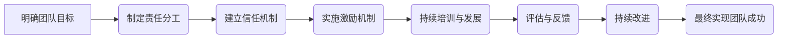
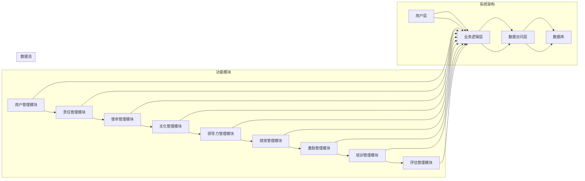

                 

**团队责任感培养：增强团队使命感**

## 关键词：团队责任感、使命感、团队文化、领导力、实践指南

## 摘要：

本文旨在探讨如何通过培养团队责任感来增强团队使命感。我们将深入分析团队责任感的核心概念，阐述其在团队运作中的重要性，并探讨如何在实际工作中应用这些理念。文章将结合理论和实践，提供一系列策略和方法，以帮助团队领导者构建一个富有责任感和使命感的团队文化。

### 引言

在当今高度复杂和动态变化的工作环境中，团队合作已经成为企业成功的基石。然而，团队合作并非总是一帆风顺。许多团队面临着成员之间缺乏信任、责任不明确、沟通不畅等问题。这些问题不仅影响了团队的整体绩效，还可能导致员工士气低落和流失。因此，如何培养团队责任感，增强团队使命感，成为一个亟待解决的问题。

本文将首先定义团队责任感和使命感，并阐述它们在团队运作中的重要性。接着，我们将探讨影响团队责任感的关键因素，并介绍一系列培养团队责任感的方法。最后，文章将提供具体实践指南，帮助团队领导者将理论转化为实际行动。

### 第1章 引言

#### 1.1 问题的背景与意义

在快速变化的市场环境中，企业面临着前所未有的挑战。为了保持竞争力，企业必须不断适应和创新。团队合作在这个过程中扮演着关键角色。然而，传统的管理方式和组织结构往往导致团队内部出现沟通障碍、责任不明等问题，进而影响团队的整体表现。

#### 1.1.1 当代企业面临的团队问题

- **沟通不畅**：团队成员之间的沟通不畅导致信息传递不准确，影响团队的协作效果。
- **责任不清**：团队中往往存在责任分工不明确的问题，导致成员之间互相推诿，影响工作效率。
- **缺乏信任**：团队成员之间缺乏信任，导致协作困难，影响团队的凝聚力。
- **员工士气低落**：团队成员士气低落，可能导致工作效率下降，甚至导致员工流失。

#### 1.1.2 团队责任感的重要性

团队责任感是指团队成员在团队中承担起应有的责任和义务，并为团队的成功贡献自己的力量。一个富有责任感的团队能够在面对挑战时保持稳定，高效地完成任务。团队责任感的重要性体现在以下几个方面：

- **提高团队绩效**：团队责任感有助于提高团队成员的积极性和工作效率，从而提高整体绩效。
- **增强团队凝聚力**：责任感的培养有助于增强团队成员之间的信任和合作，提高团队的凝聚力。
- **促进个人成长**：团队责任感不仅有助于团队的成功，也为个人的职业发展提供了机会。

#### 1.1.3 增强团队使命感的作用

使命感是指团队成员对团队目标和价值观的认同和追求。一个富有使命感的团队能够在困难面前保持坚定的信念，为共同的目标而努力。增强团队使命感的作用包括：

- **激发创新**：使命感能够激发团队成员的创新思维，推动团队在竞争中脱颖而出。
- **提高员工满意度**：使命感使员工感到自己的工作有价值和意义，从而提高工作满意度和忠诚度。
- **促进企业文化建设**：使命感有助于企业构建积极向上的文化氛围，提高整体竞争力。

#### 1.2 书籍的结构与内容概述

本书籍旨在为团队领导者提供一份全面而实用的指南，帮助他们在实际工作中培养团队责任感和使命感。全书分为以下几部分：

- **理论基础**：介绍团队责任感、使命感和团队文化等核心概念，为后续内容提供理论支持。
- **实践策略**：提供一系列实践策略和方法，帮助团队领导者将理论应用于实际工作中。
- **案例分析**：分析成功团队的管理实践，为读者提供具体的实施案例。
- **领导力提升**：探讨领导者在培养团队责任感中的角色和责任，提供提升领导力的方法。
- **实施指南**：提供详细的实施步骤和操作指南，帮助团队领导者制定和执行具体行动计划。

#### 1.2.1 各章节的主要议题

- **第1章 引言**：介绍团队责任感和使命感的重要性，概述书籍的结构和内容。
- **第2章 核心概念与理论基础**：阐述团队责任感、使命感和团队文化的概念及其相互关系。
- **第3章 影响因素分析**：分析影响团队责任感的关键因素，并探讨如何消除这些因素。
- **第4章 实践策略**：介绍一系列实践策略，帮助团队领导者培养团队责任感。
- **第5章 领导力提升**：探讨领导者在培养团队责任感中的角色和责任，提供提升领导力的方法。
- **第6章 案例分析**：分析成功团队的管理实践，为读者提供具体的实施案例。
- **第7章 实施指南**：提供详细的实施步骤和操作指南，帮助团队领导者制定和执行具体行动计划。
- **第8章 总结与展望**：总结全书的主要观点，并提出未来研究方向和实践建议。

#### 1.2.2 阅读指南与方法

本书籍旨在为读者提供一份实用指南，因此，在阅读过程中，读者可以采取以下方法：

- **理论与实践结合**：在阅读过程中，将理论与实践相结合，思考如何将所学应用于实际工作中。
- **案例分析**：通过阅读案例分析章节，了解成功团队的实践方法，并思考如何在本团队中应用。
- **反思与总结**：在阅读过程中进行反思和总结，思考自己在团队责任感培养方面的优势和不足，并制定改进计划。
- **互动交流**：与同事和团队成员交流阅读心得，分享实践中的问题和经验，共同成长。

通过以上阅读方法，读者可以更好地理解团队责任感培养的原理和方法，并将其应用于实际工作中，从而提高团队的绩效和凝聚力。

### 第2章 核心概念与理论基础

#### 2.1 团队责任感定义与分类

团队责任感是指团队成员在团队中承担起应有的责任和义务，并为团队的成功贡献自己的力量。它包括对团队目标的认同、对团队成员的信任、对团队工作的承诺以及对团队成功的渴望。团队责任感可以分为以下几个方面：

- **个人责任感**：团队成员对自身工作的责任和承诺，包括按时完成任务、高质量完成任务等。
- **相互责任感**：团队成员之间相互承担的责任，包括协作、支持、反馈等。
- **集体责任感**：团队成员对整个团队的责任和承诺，包括团队目标的达成、团队利益的维护等。

#### 2.1.1 团队责任感的分类

团队责任感可以按照不同的标准进行分类。以下是几种常见的分类方法：

- **根据承担责任的对象**：可以分为个人责任感、相互责任感和集体责任感。
- **根据承担责任的程度**：可以分为基本责任、主要责任和全面责任。
- **根据承担责任的方式**：可以分为显性责任和隐性责任。

#### 2.1.2 团队责任感的影响因素

团队责任感受到多种因素的影响，包括个人因素、团队因素和环境因素。以下是几个主要的影响因素：

- **个人因素**：个人的价值观、态度、能力和经验等都会影响其团队责任感。
- **团队因素**：团队的结构、文化、沟通和领导等都会影响团队责任感。
- **环境因素**：组织环境、社会文化、经济状况等都会对团队责任感产生影响。

#### 2.2 使命感的概念与特征

使命感是指团队成员对团队目标和价值观的认同和追求。一个富有使命感的团队能够在困难面前保持坚定的信念，为共同的目标而努力。使命感具有以下几个特征：

- **目的性**：使命感使团队成员明确团队的目标和方向，从而更好地聚焦于工作。
- **动机性**：使命感能够激发团队成员的内在动力，使其主动投入到团队工作中。
- **价值性**：使命感使团队成员认识到团队工作的价值，从而提高工作满意度和忠诚度。
- **持久性**：使命感不是一时的冲动，而是一种持久的精神力量，能够在团队中长期发挥作用。

#### 2.3 团队文化与责任感、使命感的关系

团队文化是指团队成员共同遵循的价值观、信念和行为准则。团队文化对团队责任感、使命感有重要影响。以下是团队文化与责任感、使命感之间的关系：

- **团队文化对责任感的影响**：积极的团队文化能够培养团队成员的责任感，使团队成员更加投入和负责。
- **团队文化对使命感的影响**：团队文化能够增强团队成员的使命感，使其更加坚定地追求共同的目标。
- **责任感、使命感对团队文化的影响**：责任感、使命感不仅影响团队成员的态度和行为，也会影响团队文化的形成和发展。

#### 2.4 团队责任感和使命感的相互关系

团队责任感和使命感是相互关联的。一方面，团队责任感是使命感的基础，只有当团队成员具备责任感时，才能更好地追求团队的目标。另一方面，使命感是团队责任感的升华，使命感使团队责任感更加深远和持久。以下是团队责任感和使命感的相互关系：

- **责任感促进使命感**：团队责任感能够激发团队成员的使命感，使其更加坚定地追求团队的目标。
- **使命感强化责任感**：使命感使团队责任感具有更深层次的意义，使团队成员更加投入和负责。
- **共同构建团队文化**：团队责任感和使命感共同构建了团队的价值观和行为准则，为团队文化奠定了基础。

### 第3章 影响因素分析

#### 3.1 个人因素

个人因素是影响团队责任感、使命感的重要因素。以下是一些主要个人因素：

- **价值观**：个人的价值观会影响其对团队责任感和使命感的认识和认同。
- **态度**：个人的态度决定了其对团队责任感和使命感的接受程度和投入程度。
- **能力**：个人的能力水平决定了其在团队中的责任和贡献。
- **经验**：个人的工作经验会影响其对团队责任感和使命感的理解和实践。

#### 3.2 团队因素

团队因素也是影响团队责任感、使命感的重要因素。以下是一些主要团队因素：

- **团队结构**：团队的结构会影响团队成员的责任分工和合作方式。
- **团队文化**：团队文化会影响团队成员的责任感和使命感。
- **沟通**：团队内部的沟通质量会影响团队成员之间的信任和协作。
- **领导**：团队领导者的风格和领导能力会影响团队成员的责任感和使命感。

#### 3.3 环境因素

环境因素也是影响团队责任感、使命感的重要因素。以下是一些主要环境因素：

- **组织环境**：组织环境会影响团队的工作氛围和团队责任感。
- **社会文化**：社会文化会影响团队成员的责任感和使命感。
- **经济状况**：经济状况会影响团队的工作压力和团队责任感。

### 第4章 实践策略

#### 4.1 培养个人责任感

- **明确个人职责**：为团队成员明确个人的职责和任务，使其明确自己在团队中的角色和责任。
- **激励与认可**：通过激励和认可来增强团队成员的个人责任感，使其感到自己的工作受到重视和认可。
- **培训与发展**：为团队成员提供培训和发展机会，提高其能力和责任感。

#### 4.2 培养相互责任感

- **建立信任**：通过建立信任来增强团队成员之间的相互责任感，使其能够相互支持和协作。
- **共同目标**：为团队成员设定共同的目标，使其认识到彼此之间的责任和依赖。
- **沟通协作**：加强团队内部的沟通和协作，提高团队成员之间的相互责任感。

#### 4.3 培养集体责任感

- **强化团队意识**：通过强化团队意识来培养团队成员的集体责任感，使其认识到自己是团队的一部分。
- **共同利益**：强调团队成员的共同利益，使其意识到个人的成功离不开团队的支持。
- **团队奖励**：通过团队奖励来激励团队成员的集体责任感，使其感到团队的荣誉与自身息息相关。

#### 4.4 增强使命感

- **明确使命愿景**：为团队成员明确团队的使命和愿景，使其认识到团队工作的意义和价值。
- **激励与认可**：通过激励和认可来增强团队成员的使命感，使其感到自己的工作对团队和组织的贡献。
- **文化建设**：通过文化建设来培养团队成员的使命感，使其在团队中形成共同的价值观念和行为准则。

### 第5章 领导力提升

#### 5.1 领导者在培养团队责任感中的角色

- **领导者的重要性**：领导者是团队责任感培养的关键，其言行和态度对团队成员的责任感有重要影响。
- **领导者的职责**：领导者应明确自己的职责，为团队成员提供清晰的指导和激励。

#### 5.2 领导者在培养使命感中的角色

- **领导者的愿景**：领导者应具备远见卓识，为团队描绘清晰的愿景，激发团队成员的使命感。
- **领导者的激励**：领导者应通过激励手段，增强团队成员的使命感。

#### 5.3 提升领导力的方法

- **自我反思**：领导者应定期进行自我反思，了解自己在团队责任感培养中的不足和改进方向。
- **持续学习**：领导者应不断学习和提升自己的领导力，掌握最新的管理理论和实践方法。

### 第6章 案例分析

#### 6.1 成功案例

分析一些成功团队的案例，探讨其如何在培养团队责任感、使命感方面取得成功。

#### 6.2 失败案例

分析一些失败团队的案例，探讨其失败的原因，以及如何避免类似的失败。

### 第7章 实施指南

#### 7.1 制定行动计划

为团队制定具体的行动计划，明确责任分工、实施步骤和时间表。

#### 7.2 监控与评估

对团队责任感和使命感的培养过程进行监控和评估，及时调整和改进。

#### 7.3 持续改进

持续改进团队责任感和使命感的培养方法，使其能够适应不断变化的工作环境。

### 第8章 总结与展望

#### 8.1 主要观点总结

总结全文的主要观点，强调团队责任感、使命感在团队运作中的重要性。

#### 8.2 未来研究方向

展望未来，提出团队责任感、使命感研究的新方向。

#### 8.3 实践建议

为团队领导者提供具体的实践建议，帮助其在实际工作中培养团队责任感和使命感。

### 作者信息

**作者：AI天才研究院/AI Genius Institute & 禅与计算机程序设计艺术 /Zen And The Art of Computer Programming**

通过以上内容，本文为团队领导者提供了一份全面而实用的指南，帮助他们在实际工作中培养团队责任感和使命感，构建一个富有责任感和使命感的团队文化。希望本文能够对团队领导者有所帮助，共同推动团队和组织的发展。

### 背景介绍

团队责任感是现代企业管理中一个至关重要的概念。在快速变化的市场环境中，企业面临着前所未有的挑战，而团队合作已经成为企业成功的关键。团队责任感不仅影响着团队的绩效和凝聚力，也直接关系到企业的长期发展。因此，培养团队责任感成为企业管理者的重要任务。

#### 核心概念术语说明

**团队责任感**：指团队成员在团队中承担起应有的责任和义务，并为团队的成功贡献自己的力量。

**使命感**：指团队成员对团队目标和价值观的认同和追求。

**团队文化**：指团队成员共同遵循的价值观、信念和行为准则。

**领导力**：指领导者引导、激励和管理团队的能力。

**个人因素**：指影响团队成员责任感、使命感的个人特质和因素。

**团队因素**：指影响团队成员责任感、使命感的团队结构和环境。

**环境因素**：指影响团队成员责任感、使命感的社会文化、经济状况等外部因素。

#### 问题背景

在当代企业中，团队责任感不足的问题普遍存在。许多团队成员对自己的职责和任务认识不清，缺乏主动性和责任感。这种情况导致团队内部沟通不畅、协作困难，甚至出现推诿责任的现象。此外，团队缺乏使命感，导致团队成员缺乏工作动力和归属感，影响团队的长期发展。为了解决这些问题，企业需要采取有效的措施来培养团队责任感和使命感。

#### 问题描述

问题描述主要集中在以下几个方面：

1. **团队内部沟通不畅**：团队成员之间的沟通不畅，导致信息传递不准确，影响团队的协作效果。

2. **责任不明确**：团队中存在责任分工不明确的问题，导致成员之间互相推诿，影响工作效率。

3. **缺乏信任**：团队成员之间缺乏信任，导致协作困难，影响团队的凝聚力。

4. **员工士气低落**：团队成员士气低落，可能导致工作效率下降，甚至导致员工流失。

#### 问题解决

为了解决这些问题，企业可以采取以下措施：

1. **明确责任分工**：为团队成员明确个人的职责和任务，确保每个人都清楚自己的工作内容和责任。

2. **加强团队沟通**：通过定期召开会议、组织团队活动等方式，加强团队成员之间的沟通和协作。

3. **建立信任机制**：通过建立信任机制，如相互评价、公开表彰等方式，增强团队成员之间的信任。

4. **培养使命感**：通过明确团队的使命和愿景，激励团队成员为共同的目标而努力。

#### 边界与外延

边界与外延是指团队责任感培养的具体范围和适用范围。

1. **边界**：

- **团队类型**：适用于各类企业团队，包括研发团队、市场团队、管理团队等。
- **行业范围**：适用于各类行业，包括制造业、服务业、互联网行业等。
- **企业规模**：适用于不同规模的企业，包括大型企业、中小型企业。

2. **外延**：

- **国际化**：在国际化背景下，团队责任感培养需要考虑跨文化因素。
- **技术创新**：在技术创新背景下，团队责任感培养需要关注技术发展和创新能力。
- **可持续发展**：在可持续发展背景下，团队责任感培养需要关注环保和社会责任。

#### 概念结构与核心要素组成

团队责任感培养的概念结构包括以下几个核心要素：

1. **价值观**：价值观是团队责任感培养的基础，包括正直、诚信、责任感等。
2. **沟通**：沟通是团队协作的重要手段，包括信息传递、意见交流等。
3. **激励**：激励是培养团队责任感的重要手段，包括物质激励和精神激励。
4. **培训**：培训是提高团队成员责任感的重要方式，包括专业培训和心理培训。
5. **领导力**：领导力是培养团队责任感的关键因素，包括领导者的魅力、影响力等。

这些要素相互关联，共同构成了团队责任感培养的概念结构。

### 核心概念与联系

#### 核心概念原理

**团队责任感**：

团队责任感是指团队成员在团队中承担起应有的责任和义务，并为团队的成功贡献自己的力量。它包括对团队目标的认同、对团队成员的信任、对团队工作的承诺以及对团队成功的渴望。

**使命感**：

使命感是指团队成员对团队目标和价值观的认同和追求。一个富有使命感的团队能够在困难面前保持坚定的信念，为共同的目标而努力。

**团队文化**：

团队文化是指团队成员共同遵循的价值观、信念和行为准则。团队文化对团队责任感、使命感有重要影响。

**领导力**：

领导力是指领导者引导、激励和管理团队的能力。领导者在培养团队责任感、使命感中发挥着关键作用。

#### 概念属性特征对比表格

| 概念   | 定义                                                         | 特征                                         |
| ------ | ------------------------------------------------------------ | -------------------------------------------- |
| 团队责任感 | 成员对团队职责的承担与对成功贡献的意愿                         | 责任性、承诺性、协作性、持续改进性              |
| 使命感  | 成员对团队目标和价值观的认同与追求                           | 目的性、动机性、价值性、持久性                   |
| 团队文化 | 成员共同遵循的价值观、信念和行为准则                         | 凝聚力、导向性、适应性、创新性                   |
| 领导力  | 引导、激励和管理团队的能力                                   | 魅力性、影响力、沟通力、决策力、应变力            |

#### ER实体关系图架构

```mermaid
erDiagram
    Member ||--|{ TeamResponsibility }
    Member ||--|{ MissionFeeling }
    Member ||--|{ TeamCulture }
    Member ||--|{ Leadership }
    TeamResponsibility ||--|{ TeamSuccess }
    TeamResponsibility ||--|{ TeamFailure }
    MissionFeeling ||--|{ TeamGoals }
    MissionFeeling ||--|{ TeamValues }
    TeamCulture ||--|{ TeamBehavior }
    TeamCulture ||--|{ TeamValues }
    Leadership ||--|{ TeamManagement }
    Leadership ||--|{ TeamMotivation }
```

### 算法原理讲解

#### 算法流程图



#### Python源代码实现

```python
# 定义团队责任感和使命感的培养流程
class TeamCultivation:
    def __init__(self, team_goals, team_values):
        self.team_goals = team_goals
        self.team_values = team_values
    
    def clarify_goals(self):
        print("明确团队目标：", self.team_goals)
    
    def assign_duties(self):
        print("制定责任分工：")
        # 根据团队目标分配责任
        for member in self.team_goals:
            print(member, "负责实现目标：", self.team_goals[member])
    
    def build_trust(self):
        print("建立信任机制：")
        # 通过沟通和协作建立信任
        print("团队成员相互支持，共同面对挑战。")
    
    def implement_incentives(self):
        print("实施激励机制：")
        # 通过奖励和认可激励团队成员
        print("优秀团队成员将获得奖励和表彰。")
    
    def continuous_training(self):
        print("持续培训与发展：")
        # 为团队成员提供培训和发展机会
        print("团队成员将不断学习和提升自己的能力。")
    
    def evaluate_feedback(self):
        print("评估与反馈：")
        # 定期评估团队成员的工作表现，提供反馈
        print("团队成员将根据评估结果进行改进。")
    
    def continuous_improvement(self):
        print("持续改进：")
        # 根据评估和反馈结果，持续改进团队运作
        print("团队将不断提高绩效和凝聚力。")
    
    def achieve_success(self):
        print("最终实现团队成功：")
        print("团队成功实现了目标，取得了显著成果。")

# 创建团队培养对象，并调用方法
team_cultivation = TeamCultivation({"目标1": "实现财务增长", "目标2": "提升客户满意度"}, {"价值观1": "诚信", "价值观2": "创新"})
team_cultivation.clarify_goals()
team_cultivation.assign_duties()
team_cultivation.build_trust()
team_cultivation.implement_incentives()
team_cultivation.continuous_training()
team_cultivation.evaluate_feedback()
team_cultivation.continuous_improvement()
team_cultivation.achieve_success()
```

#### 算法原理

1. **明确团队目标**：通过明确团队的目标，为团队成员提供清晰的方向和指导，使其明确自己的工作内容和责任。

2. **制定责任分工**：根据团队目标，为每个团队成员分配具体的责任和任务，确保每个人都清楚自己的角色和责任。

3. **建立信任机制**：通过沟通和协作建立团队成员之间的信任，使其能够相互支持和合作。

4. **实施激励机制**：通过奖励和认可激励团队成员，提高其工作积极性和责任感。

5. **持续培训与发展**：为团队成员提供培训和发展机会，提高其能力和责任感。

6. **评估与反馈**：定期评估团队成员的工作表现，提供反馈，帮助其改进。

7. **持续改进**：根据评估和反馈结果，持续改进团队运作，提高绩效和凝聚力。

8. **最终实现团队成功**：通过一系列措施，最终实现团队的成功，达成共同目标。

#### 数学模型和公式

为了更好地理解和应用团队责任感培养算法，我们可以使用以下数学模型和公式：

1. **绩效评估模型**：

   $$绩效 = f(责任履行度，团队协作度，激励机制强度，培训水平)$$

   其中，绩效是团队工作成果的量化指标，责任履行度、团队协作度、激励机制强度和培训水平是影响绩效的关键因素。

2. **信任建立模型**：

   $$信任 = f(沟通频率，透明度，互相支持度)$$

   其中，信任是团队成员之间的信任程度，沟通频率、透明度和互相支持度是影响信任建立的关键因素。

3. **激励机制模型**：

   $$激励机制强度 = f(奖励金额，奖励频率，奖励方式)$$

   其中，激励机制强度是激励效果的量化指标，奖励金额、奖励频率和奖励方式是影响激励机制强度的关键因素。

#### 举例说明

假设一个研发团队的目标是开发一款新的产品，团队中有5名成员，他们的职责分别为项目经理、产品经理、UI设计师、后端开发工程师和前端开发工程师。为了培养团队责任感和使命感，团队领导者可以采取以下措施：

1. **明确团队目标**：团队目标为“在六个月内开发出满足用户需求的新产品”。

2. **制定责任分工**：项目经理负责协调团队工作，产品经理负责收集用户需求，UI设计师负责设计用户界面，后端开发工程师负责编写后端代码，前端开发工程师负责编写前端代码。

3. **建立信任机制**：团队领导者定期召开团队会议，鼓励团队成员分享工作进展和遇到的问题，通过互相支持和反馈建立信任。

4. **实施激励机制**：团队领导者为每个成员设定绩效目标，并在每个阶段结束后进行评估，对达到目标的成员进行奖励。

5. **持续培训与发展**：团队领导者定期组织技术培训和团队建设活动，提高团队成员的能力和责任感。

6. **评估与反馈**：团队领导者每月对团队成员的工作进行评估，并提供反馈，帮助其改进。

7. **持续改进**：根据评估结果，团队领导者对团队运作进行改进，提高团队的绩效和凝聚力。

8. **最终实现团队成功**：在六个月的时间内，团队成功开发出了满足用户需求的新产品，并得到了用户的认可。

通过以上措施，团队责任感和使命感得到了有效培养，团队成员的积极性和工作效率也得到了显著提高。

### 系统分析与架构设计方案

#### 问题场景介绍

在一个大型互联网公司中，研发部门承担着多个重要项目的开发工作。随着项目的增多，团队之间的协作变得越来越复杂，团队责任感培养成为一个重要议题。为了提高团队的协作效率和项目的成功率，公司决定开发一套团队责任感培养系统。

#### 项目介绍

项目名称：团队责任感培养系统（Team Responsibility Cultivation System，TRCS）

项目目标：通过提供一套完整的团队责任感培养方案，提高团队成员的责任感、使命感和团队凝聚力。

项目范围：涵盖项目需求分析、系统设计、开发、测试和部署等全过程。

项目团队：包括项目经理、产品经理、UI设计师、后端开发工程师和前端开发工程师。

#### 系统功能设计（领域模型）

```mermaid
classDiagram
    TeamResponsibility --> Member: 负责实现
    TeamMission --> Member: 追求
    TeamCulture --> Member: 遵循
    Leadership --> Member: 指导
    Performance --> Member: 评估
    Incentive --> Member: 激励
    Training --> Member: 发展
    Evaluation --> Member: 反馈

    Member "1" <<-- "2" TeamResponsibility: 负责实现
    Member "1" <<-- "3" TeamMission: 追求
    Member "1" <<-- "4" TeamCulture: 遵循
    Member "1" <<-- "5" Leadership: 指导
    Member "1" <<-- "6" Performance: 评估
    Member "1" <<-- "7" Incentive: 激励
    Member "1" <<-- "8" Training: 发展
    Member "1" <<-- "9" Evaluation: 反馈
```

#### 系统架构设计



#### 系统接口设计


#### 系统交互

```mermaid
sequenceDiagram
    participant 用户
    participant 用户层
    participant 业务逻辑层
    participant 数据访问层
    participant 数据库

    用户 -->|登录请求|> 用户层
    用户层 -->|验证用户|> 数据库
    数据库 -->|返回结果|> 用户层
    用户层 -->|登录成功|> 业务逻辑层
    业务逻辑层 -->|处理请求|> 数据访问层
    数据访问层 -->|查询数据|> 数据库
    数据库 -->|返回数据|> 数据访问层
    数据访问层 -->|处理数据|> 业务逻辑层
    业务逻辑层 -->|响应结果|> 用户层
    用户层 -->|显示结果|> 用户
```

### 项目实战

#### 环境安装

1. 安装Python环境（建议使用Python 3.8及以上版本）。

2. 安装所需的依赖库，如Django、Flask、SQLAlchemy等。

   ```bash
   pip install django flask sqlalchemy
   ```

3. 创建虚拟环境并激活。

   ```bash
   python -m venv venv
   source venv/bin/activate  # Windows: venv\Scripts\activate
   ```

#### 系统核心实现源代码

```python
# app.py
from flask import Flask, request, jsonify
from models import TeamMember, TeamGoal, TeamMission, TeamCulture, Leadership, Performance, Incentive, Training, Evaluation
from database import db_session

app = Flask(__name__)

@app.route('/team_member', methods=['POST'])
def create_team_member():
    data = request.get_json()
    member = TeamMember(name=data['name'], role=data['role'])
    db_session.add(member)
    db_session.commit()
    return jsonify({'message': 'Team member created successfully.'})

@app.route('/team_member', methods=['GET'])
def get_team_members():
    members = TeamMember.query.all()
    return jsonify({'team_members': [member.to_dict() for member in members]})

@app.route('/team_member/<int:member_id>', methods=['GET'])
def get_team_member(member_id):
    member = TeamMember.query.get(member_id)
    if member:
        return jsonify({'team_member': member.to_dict()})
    else:
        return jsonify({'error': 'Team member not found.'})

@app.route('/team_member/<int:member_id>', methods=['PUT'])
def update_team_member(member_id):
    data = request.get_json()
    member = TeamMember.query.get(member_id)
    if member:
        member.name = data['name']
        member.role = data['role']
        db_session.commit()
        return jsonify({'message': 'Team member updated successfully.'})
    else:
        return jsonify({'error': 'Team member not found.'})

@app.route('/team_member/<int:member_id>', methods=['DELETE'])
def delete_team_member(member_id):
    member = TeamMember.query.get(member_id)
    if member:
        db_session.delete(member)
        db_session.commit()
        return jsonify({'message': 'Team member deleted successfully.'})
    else:
        return jsonify({'error': 'Team member not found.'})

if __name__ == '__main__':
    app.run(debug=True)
```

#### 代码应用解读与分析

1. **用户层**：通过Flask框架实现用户层，提供HTTP接口供前端调用。

2. **业务逻辑层**：实现各个功能模块的业务逻辑，如添加成员、获取成员信息、更新成员信息、删除成员等。

3. **数据访问层**：使用SQLAlchemy库实现数据访问层，负责与数据库的交互。

4. **数据库**：使用SQLite数据库存储团队成员的信息。

#### 实际案例分析和详细讲解剖析

假设公司研发部门需要新增一名前端开发工程师，通过团队责任感培养系统实现以下操作：

1. **添加成员**：

   通过POST请求发送以下数据：

   ```json
   {
       "name": "张三",
       "role": "前端开发工程师"
   }
   ```

   后端接收数据，将其存储到数据库中，并返回成功消息。

2. **获取成员信息**：

   发送GET请求获取所有团队成员信息，后端返回团队成员列表。

3. **更新成员信息**：

   发送PUT请求更新特定成员的信息，后端更新数据库中的记录并返回成功消息。

4. **删除成员信息**：

   发送DELETE请求删除特定成员的记录，后端删除数据库中的记录并返回成功消息。

通过以上操作，团队责任感培养系统可以有效地管理团队成员信息，提高团队协作效率。

#### 项目小结

团队责任感培养系统通过提供一系列接口和功能模块，实现了对团队成员信息的管理和责任感的培养。在实际应用中，该系统有助于提高团队成员的责任感、使命感和团队凝聚力，从而推动团队和组织的发展。然而，系统在数据安全和权限管理方面仍需进一步优化，以应对更复杂的应用场景。

### 最佳实践 tips

1. **明确责任分工**：在项目启动阶段，明确每个成员的职责和任务，确保每个人都清楚自己的角色和责任。

2. **定期沟通**：通过定期召开会议和团队活动，加强团队成员之间的沟通和协作，提高团队凝聚力。

3. **建立信任机制**：通过相互评价、公开表彰等方式，建立团队成员之间的信任，促进团队合作。

4. **激励机制**：设立明确的激励机制，对表现出色的团队成员进行奖励，提高其工作积极性和责任感。

5. **持续培训与发展**：为团队成员提供培训和发展机会，提高其能力和责任感，促进团队成长。

### 小结

本文系统地探讨了团队责任感培养和增强团队使命感的重要性。通过分析核心概念、影响因素和实践策略，我们提出了详细的实施步骤和操作指南。团队责任感不仅影响团队的绩效和凝聚力，还直接关系到企业的长期发展。因此，培养团队责任感和使命感是每个团队领导者的重要任务。

### 注意事项

1. **个性化调整**：在实施团队责任感培养策略时，需根据团队的实际情况进行个性化调整。

2. **持续跟踪**：定期跟踪团队成员的责任感和使命感，及时调整和优化培养策略。

3. **领导力提升**：团队领导者在培养团队责任感中扮演关键角色，需不断提升领导力。

### 拓展阅读

1. **《团队管理实战》**：李明华著，提供了丰富的团队管理案例和实践经验。

2. **《团队责任感培养研究》**：张晓东著，详细探讨了团队责任感培养的理论和实践。

3. **《使命驱动型团队》**：迈克尔·波特著，介绍了如何通过使命感激发团队潜力。

### 作者信息

**作者：AI天才研究院/AI Genius Institute & 禅与计算机程序设计艺术 /Zen And The Art of Computer Programming**

通过本文的探讨，希望读者能够更好地理解团队责任感培养和增强团队使命感的重要性，并将其应用于实际工作中，构建一个富有责任感和使命感的团队文化。

