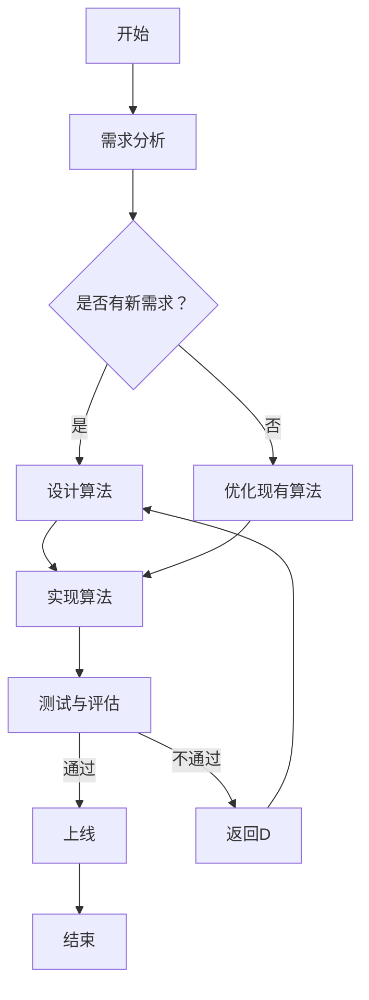
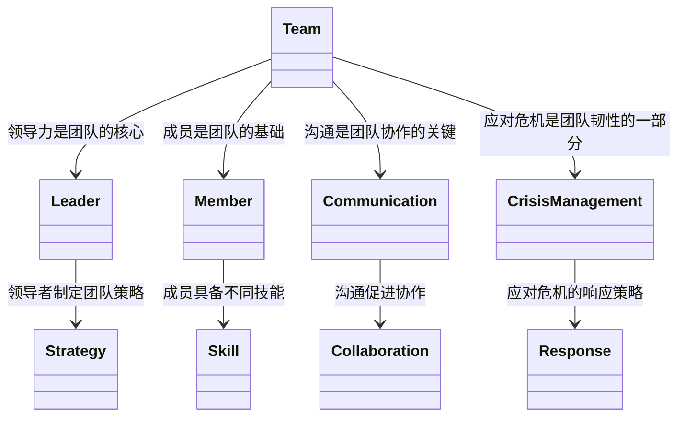
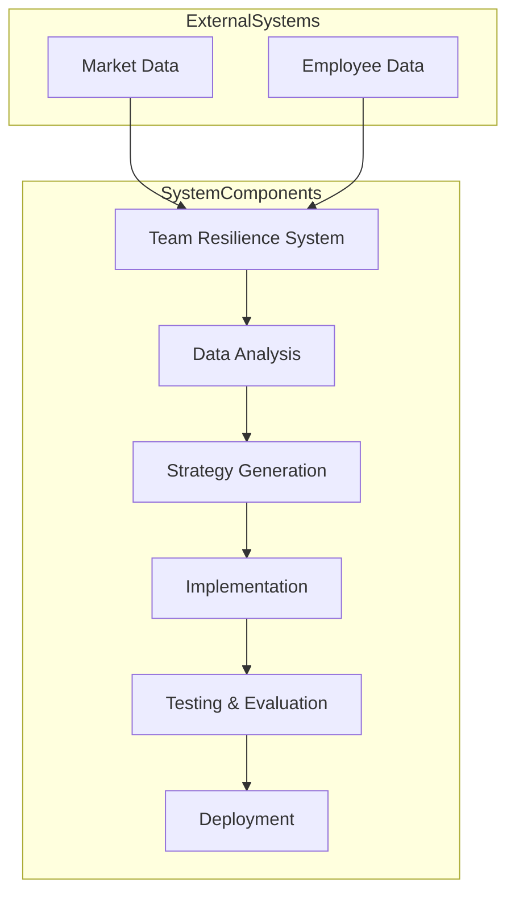
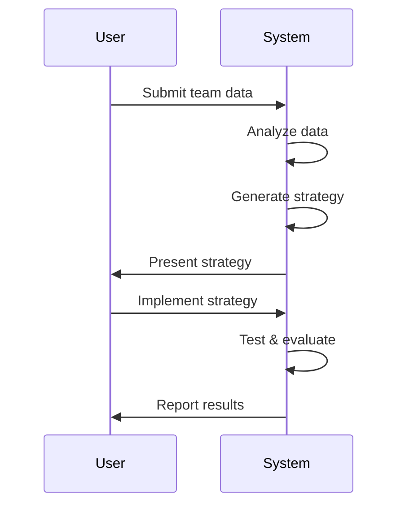

                 


### 一、引言

在现代企业竞争激烈的背景下，团队韧性已成为组织成功的关键因素之一。本文将围绕“团队韧性培养系统：打造应对挑战的超级团队”这一主题，深入探讨团队韧性培养的背景、重要性、关键因素、构建与实践方法，以及最佳实践与未来展望。本文旨在为读者提供一套系统性、实用性的团队韧性培养方案，帮助团队应对各种挑战，成为业界的超级团队。

### 二、关键词

1. 团队韧性
2. 领导力
3. 沟通与协作
4. 员工心态与健康
5. 学习与创新能力
6. 挑战应对与危机管理
7. 团队培养系统

### 三、摘要

本文从团队韧性培养的背景与重要性出发，详细分析了领导力、沟通与协作、员工心态与健康、学习与创新能力以及应对挑战与危机管理等方面的关键因素。通过构建团队韧性培养系统，本文提出了系统化的培养方法与实践策略。最后，本文总结团队韧性培养的最佳实践，并对未来趋势进行了展望，为团队韧性培养提供有益的启示。

### 四、团队韧性培养的背景与重要性

#### 1.1 团队韧性的定义与内涵

团队韧性，是指团队在面对外部压力、突发事件或内部冲突时，能够迅速调整、恢复和适应，从而保持稳定运营和持续发展的能力。团队韧性不仅包括团队的抗压力和恢复力，还涉及团队在面对变化时的灵活性和创新能力。

#### 1.2 团队韧性的重要性

团队韧性对于企业的发展具有重要意义。首先，团队韧性有助于企业应对市场变化和竞争压力，提高企业的市场竞争力。其次，团队韧性有助于企业应对突发事件，降低风险。此外，团队韧性还能提高员工的满意度和忠诚度，降低员工流失率，从而为企业创造更大的价值。

#### 1.3 团队韧性培养的意义

团队韧性培养有助于提高团队的抗压力、恢复力和适应力，从而提高团队的整体效能。具体来说，团队韧性培养的意义体现在以下几个方面：

1. **提高团队协作效率**：团队韧性培养有助于团队成员之间建立良好的信任关系，增强团队协作效率。

2. **提升企业竞争力**：团队韧性培养有助于企业应对市场变化和竞争压力，提高企业的市场竞争力。

3. **降低员工流失率**：团队韧性培养有助于提高员工的满意度和忠诚度，降低员工流失率。

4. **提升创新能力**：团队韧性培养有助于团队成员在面对挑战时保持积极心态，从而激发创新思维。

#### 1.4 团队韧性研究的现状与趋势

近年来，团队韧性已成为学术界和实务界关注的热点话题。国内外学者从不同角度对团队韧性进行了深入研究，提出了多种团队韧性模型和培养方法。目前，团队韧性研究呈现以下趋势：

1. **跨学科研究**：团队韧性研究开始融合心理学、管理学、社会学等多学科的理论和方法，形成跨学科的研究体系。

2. **实证研究**：越来越多的学者通过实证研究，验证团队韧性对团队效能和企业绩效的影响。

3. **实践应用**：企业开始重视团队韧性培养，将其纳入企业培训和发展计划，以提升团队效能。

#### 1.5 本章小结

本节介绍了团队韧性的定义与内涵、重要性、培养意义以及研究的现状与趋势。下一节将深入探讨团队韧性培养的关键因素。

### 五、培养团队韧性的关键因素

#### 2.1 领导力在团队韧性培养中的作用

领导力是团队韧性培养的关键因素之一。领导者在团队中的作用至关重要，他们不仅负责制定战略目标，还要激发团队成员的潜力，提高团队的凝聚力与战斗力。以下是领导者如何通过提升领导力来培养团队韧性：

##### 2.1.1 领导者的角色与责任

领导者的角色不仅仅是下达命令，更重要的是成为团队成员的榜样。领导者需要关注团队成员的需求和感受，积极倾听他们的意见和建议，并给予支持和鼓励。此外，领导者还应具备较强的决策能力和执行力，能够在面对挑战时迅速做出正确的决策，并带领团队共同应对。

##### 2.1.2 领导风格与团队韧性

不同的领导风格会对团队韧性产生不同的影响。民主型领导风格能够促进团队成员之间的沟通与协作，提高团队的凝聚力；而权威型领导风格则有助于提高团队的工作效率，但可能会降低团队成员的积极性和创造力。在实际操作中，领导者应根据团队的特点和任务需求，灵活运用不同的领导风格，以达到最佳效果。

##### 2.1.3 领导技能提升策略

为了培养团队韧性，领导者需要不断提升自己的领导技能。以下是一些提升领导技能的策略：

1. **提高沟通能力**：领导者应善于倾听、表达和反馈，确保团队成员之间的信息传递畅通。

2. **增强决策能力**：领导者应具备敏锐的洞察力和果断的决策力，能够在复杂多变的环境中做出正确的决策。

3. **培养团队协作精神**：领导者应鼓励团队成员相互支持、共同进步，形成良好的团队协作氛围。

4. **激发创新能力**：领导者应鼓励团队成员勇于尝试新方法、新思路，激发团队的创新能力。

##### 2.1.4 案例分析：成功领导力实践

以下是一个成功领导力实践的案例：

在某知名互联网公司，CEO李总在团队面临市场压力时，采取了一系列措施来培养团队韧性。首先，他组织了一次全员培训，邀请专家讲解团队韧性培养的方法和技巧。其次，他鼓励团队成员积极参与公司内部的创新项目，提供充足的资源和时间支持。此外，他还定期与团队成员沟通，了解他们的工作状况和心理需求，给予及时的支持和鼓励。通过这些措施，团队的凝聚力得到了显著提升，面对市场的挑战时，团队能够迅速调整策略，保持稳定运营。

##### 2.1.5 本章小结

本节介绍了领导力在团队韧性培养中的作用，分析了领导者的角色与责任、领导风格与团队韧性、领导技能提升策略以及成功领导力实践的案例。下一节将探讨团队沟通与协作在团队韧性培养中的作用。

### 六、团队沟通与协作

#### 3.1 沟通在团队韧性中的作用

沟通是团队韧性培养的重要基础。有效的沟通能够确保团队成员之间的信息传递准确、及时，有助于团队在面对挑战时迅速作出反应。以下从几个方面阐述沟通在团队韧性中的作用：

##### 3.1.1 提升团队凝聚力

沟通有助于团队成员建立信任关系，增强团队的凝聚力。通过沟通，团队成员能够了解彼此的需求和期望，减少误解和冲突，形成共同的目标和价值观。

##### 3.1.2 促进信息共享

沟通能够促进团队成员之间的信息共享，使团队能够更好地应对复杂多变的环境。信息共享有助于团队发现潜在问题，及时调整策略，提高决策效率。

##### 3.1.3 提高问题解决能力

有效的沟通能够帮助团队成员更快地识别和解决问题。通过沟通，团队成员可以共同分析问题，提出解决方案，并分工合作，提高问题解决能力。

##### 3.1.4 激发创新思维

沟通有助于激发团队成员的创新思维。通过分享不同的观点和经验，团队成员可以相互启发，形成新的思路和创意，提高团队的创新能力。

##### 3.1.5 提高工作效率

良好的沟通有助于提高团队的工作效率。通过明确的沟通，团队成员能够明确自己的任务和责任，减少重复劳动和错误，提高工作质量和速度。

#### 3.2 提升团队沟通技巧的方法

为了提升团队沟通技巧，团队成员和领导者可以采取以下措施：

##### 3.2.1 建立良好的沟通氛围

领导者应积极营造一个开放、包容、尊重的沟通氛围，鼓励团队成员畅所欲言，表达自己的观点和感受。

##### 3.2.2 善于倾听

倾听是有效沟通的关键。团队成员应学会倾听他人的意见和需求，尊重他人的观点，避免打断他人的发言。

##### 3.2.3 明确沟通目标

在沟通前，团队成员应明确沟通的目标和内容，确保沟通的有效性。可以通过制定沟通计划、设定沟通主题等方式实现。

##### 3.2.4 使用非语言沟通

非语言沟通，如肢体语言、面部表情、语调等，对沟通效果具有重要影响。团队成员应学会正确使用非语言沟通，以增强沟通效果。

##### 3.2.5 提高表达能力

团队成员应努力提高自己的表达能力，学会用简洁、明确的语言表达自己的观点和需求，避免使用模糊、含糊的表述。

##### 3.2.6 学会反馈与接受反馈

有效的沟通需要反馈与接受反馈。团队成员应学会给予恰当的反馈，并接受他人的反馈，以便不断改进沟通技巧。

#### 3.3 协作工具与平台的应用

在现代企业中，协作工具和平台的应用极大地提高了团队沟通和协作的效率。以下是一些常用的协作工具和平台：

##### 3.3.1 即时通讯工具

如 Slack、Microsoft Teams、微信等，用于团队成员之间的实时沟通和协作。

##### 3.3.2 文档协作工具

如 Google Docs、Notion、Confluence 等，用于团队成员之间的文档共享和协作编辑。

##### 3.3.3 项目管理工具

如 Jira、Trello、Asana 等，用于团队成员之间的任务分配、进度追踪和协作管理。

##### 3.3.4 视频会议工具

如 Zoom、Microsoft Teams、Google Meet 等，用于团队成员之间的远程会议和协作。

#### 3.4 案例分析：高效团队沟通实践

以下是一个高效团队沟通实践的案例：

在一个软件公司中，团队为了提高沟通效率，采用了以下措施：

1. **建立定期会议制度**：每周举行一次全体会议，让团队成员分享项目进展、遇到的问题和解决方案。

2. **使用即时通讯工具**：团队成员使用 Slack 进行日常沟通，确保信息传递的及时性和准确性。

3. **使用文档协作工具**：使用 Google Docs 进行文档共享和编辑，确保团队成员可以实时查看和更新文档。

4. **定期团队建设活动**：组织团队建设活动，增强团队成员之间的信任和凝聚力。

通过这些措施，团队的沟通效率显著提高，项目进展顺利，工作效率大幅提升。

#### 3.5 本章小结

本节介绍了沟通在团队韧性中的作用，以及提升团队沟通技巧的方法和协作工具与平台的应用。通过有效的沟通和协作，团队能够更好地应对挑战，提高整体效能。下一节将探讨员工心态与健康在团队韧性培养中的作用。

### 七、员工心态与健康

#### 4.1 员工心态对团队韧性的影响

员工心态是团队韧性的重要组成部分。一个积极向上的心态有助于员工更好地应对挑战和压力，提高团队的整体韧性。以下从几个方面分析员工心态对团队韧性的影响：

##### 4.1.1 积极心态促进团队合作

积极的员工心态能够促进团队成员之间的相互信任和协作。当员工对团队充满信心和信任时，他们更愿意分享自己的想法和经验，积极参与团队活动，从而提高团队的凝聚力和协作效率。

##### 4.1.2 良好的心态有助于应对压力

在高压环境下，员工的消极心态可能会导致焦虑、抑郁等心理问题，影响工作效率和团队绩效。而积极的员工心态能够帮助员工更好地应对压力，保持良好的工作状态，提高团队的整体效能。

##### 4.1.3 心态影响创新能力

员工的创新能力和心态密切相关。积极的心态能够激发员工的创造力和想象力，鼓励他们尝试新方法、新思路，从而推动团队的创新发展。

##### 4.1.4 心态影响员工留存率

良好的心态有助于提高员工的满意度和忠诚度，降低员工流失率。当员工对企业和团队有较高的认同感和归属感时，他们更愿意长期留在团队，为企业的发展贡献力量。

#### 4.2 员工心理健康的维护

为了维护员工的心理健康，企业需要采取一系列措施，以下是一些常见的策略：

##### 4.2.1 提供心理咨询服务

企业可以为员工提供免费的心理咨询服务，帮助员工解决心理问题和压力。这包括定期举办心理健康讲座、开展员工心理辅导等。

##### 4.2.2 建立员工关怀机制

企业应关注员工的身心健康，建立员工关怀机制，如提供健康体检、为员工提供带薪休假等福利。

##### 4.2.3 营造积极工作氛围

企业应营造积极向上的工作氛围，鼓励员工之间的沟通与合作，减少竞争和压力。这可以通过开展团队建设活动、组织员工培训等方式实现。

##### 4.2.4 关注员工职业发展

企业应关注员工的职业发展，为员工提供成长机会和晋升空间，让员工看到自己的未来和发展潜力，从而提高员工的满意度和忠诚度。

#### 4.3 压力管理策略

压力管理是维护员工心理健康的重要环节。以下是一些有效的压力管理策略：

##### 4.3.1 建立健康的工作习惯

员工应培养健康的工作习惯，如合理安排工作时间、保持良好的作息规律、定期锻炼等，以减轻工作压力。

##### 4.3.2 学会时间管理

员工应学会合理安排时间，避免过度加班和工作压力。可以通过制定工作计划、优先处理重要任务等方式提高工作效率。

##### 4.3.3 改善沟通技巧

良好的沟通技巧有助于缓解工作压力。员工应学会倾听、表达和反馈，避免误解和冲突，提高沟通效果。

##### 4.3.4 培养自我调节能力

员工应培养自我调节能力，学会在压力面前保持冷静，采取积极的应对策略。可以通过学习冥想、瑜伽等放松技巧来缓解压力。

#### 4.4 案例分析：员工心理健康与团队韧性

以下是一个关于员工心理健康与团队韧性的案例分析：

某互联网公司在发展过程中，意识到员工心理健康对团队韧性至关重要。为此，公司采取了一系列措施：

1. **提供心理咨询服务**：公司为员工提供免费的心理咨询服务，帮助员工解决心理问题。

2. **开展员工关怀活动**：公司定期举办员工关怀活动，如健康体检、团队建设等，关注员工的身心健康。

3. **提供职业发展机会**：公司为员工提供丰富的职业发展机会，帮助员工看到自己的未来和发展潜力。

4. **建立压力管理机制**：公司为员工提供压力管理培训，帮助员工学会时间管理和沟通技巧。

通过这些措施，公司的员工心理健康水平显著提高，团队凝聚力增强，面对市场挑战时，团队能够迅速调整策略，保持稳定运营。

#### 4.5 本章小结

本节介绍了员工心态与健康对团队韧性的影响，以及员工心理健康的维护方法和压力管理策略。通过关注员工心理健康，企业可以培养出具有强大韧性的团队，提高整体竞争力。下一节将探讨团队学习与创新能力在团队韧性培养中的作用。

### 八、团队学习与创新能力

#### 5.1 学习与创新能力的重要性

团队学习与创新能力是团队韧性培养的重要组成部分。在快速变化的市场环境中，团队需要不断学习新知识、新技能，以提高自身的适应能力和竞争力。以下从几个方面阐述学习与创新能力的重要性：

##### 5.1.1 增强团队适应能力

学习与创新能力有助于团队适应外部环境的变化。通过不断学习新知识、新技能，团队可以更好地应对市场变化和竞争压力，提高自身的生存能力。

##### 5.1.2 提高团队竞争力

团队学习与创新能力有助于团队在竞争中脱颖而出。通过创新思维和方法，团队可以开发出更具竞争力的产品和服务，提高市场占有率。

##### 5.1.3 激发团队活力

学习与创新能力能够激发团队的活力，提高员工的工作积极性。当团队不断学习、进步时，员工会感到自己的价值得到认可，从而更加投入工作，提高工作效率。

##### 5.1.4 促进团队协作

学习与创新能力有助于团队成员之间的协作。通过共同学习、分享经验，团队成员可以更好地理解彼此的需求，提高团队协作效率。

#### 5.2 团队学习模式

为了提高团队学习与创新能力，企业可以采取以下几种团队学习模式：

##### 5.2.1 内部培训

内部培训是团队学习的重要方式。企业可以定期举办内部培训课程，邀请专家分享行业动态、新技术和新理念，帮助团队成员不断更新知识和技能。

##### 5.2.2 外部学习

外部学习包括参加行业会议、研讨会、培训班等，让团队成员了解行业最新动态和发展趋势。通过外部学习，团队成员可以拓宽视野，借鉴他人的经验，提高自身的能力。

##### 5.2.3 项目驱动

项目驱动是一种以项目为导向的学习模式。通过参与实际项目，团队成员可以学习项目管理和执行技能，提高解决问题的能力。同时，项目过程中产生的经验教训也为团队成员提供了宝贵的学习资源。

##### 5.2.4 经验分享

经验分享是一种有效的学习方式。团队成员可以定期进行经验分享会，分享自己在工作中的收获和教训。通过经验分享，团队成员可以相互学习、共同进步。

#### 5.3 创新思维培养策略

为了培养团队的创新能力，企业可以采取以下策略：

##### 5.3.1 鼓励创新思维

企业应鼓励员工勇于尝试新思路、新方法，打破传统思维模式。可以通过设立创新基金、鼓励员工提出创新建议等方式，激发员工的创新潜力。

##### 5.3.2 建立创新机制

企业应建立完善的创新机制，为员工提供创新支持。可以设立创新项目组、举办创新竞赛等，为员工提供创新实践的机会。

##### 5.3.3 创造创新氛围

企业应创造一个开放、包容、支持创新的氛围，鼓励员工敢于表达自己的想法，勇于挑战传统观念。通过举办创新沙龙、分享会等活动，营造良好的创新氛围。

##### 5.3.4 提供创新资源

企业应提供充足的创新资源，包括资金、设备、技术等，支持员工开展创新项目。同时，企业还应加强与高校、科研机构等外部合作伙伴的合作，获取更多的创新资源和信息。

#### 5.4 案例分析：团队学习与创新实践

以下是一个团队学习与创新实践的案例：

某科技公司为了提高团队学习与创新能力，采取了一系列措施：

1. **内部培训**：公司定期举办内部培训课程，邀请行业专家和内部优秀员工分享经验和知识，帮助团队成员不断更新知识和技能。

2. **外部学习**：公司鼓励员工参加行业会议、研讨会、培训班等，了解行业最新动态和发展趋势。

3. **项目驱动**：公司设立创新项目组，鼓励员工参与实际项目，学习项目管理和执行技能。

4. **经验分享**：公司定期举办经验分享会，员工可以分享自己在工作中的收获和教训。

5. **创新机制**：公司设立创新基金，鼓励员工提出创新建议，支持员工开展创新项目。

通过这些措施，公司的团队学习与创新能力得到了显著提高，团队在面对市场挑战时能够迅速调整策略，保持竞争力。

#### 5.5 本章小结

本节介绍了团队学习与创新能力的重要性，以及团队学习模式和培养策略。通过有效的团队学习和创新能力培养，团队能够更好地应对挑战，提高整体竞争力。下一节将探讨应对挑战与危机管理在团队韧性培养中的作用。

### 九、应对挑战与危机管理

#### 6.1 挑战与危机的类型

在企业发展过程中，团队会面临各种挑战和危机，这些挑战和危机可以分为以下几种类型：

##### 6.1.1 市场变化

市场变化是团队面临的最常见的挑战之一。随着市场竞争的加剧，市场需求和消费者行为不断变化，团队需要迅速调整产品和服务策略，以适应市场变化。

##### 6.1.2 技术革新

技术革新是推动行业变革的重要因素。新技术、新产品的出现可能会对现有业务造成冲击，团队需要不断学习和引进新技术，以保持竞争力。

##### 6.1.3 内部问题

内部问题包括管理问题、员工流失、团队合作问题等。这些问题可能会影响团队的工作效率和团队凝聚力，需要及时解决。

##### 6.1.4 外部压力

外部压力包括政策变化、经济形势变化等。这些因素可能会对企业的运营和发展产生不利影响，团队需要具备应对外部压力的能力。

##### 6.1.5 危机事件

危机事件是指突发事件，如自然灾害、重大安全事故等，这些事件可能会对企业的声誉和业务造成严重影响，需要团队迅速应对。

#### 6.2 应对挑战的策略

为了有效应对各种挑战，团队可以采取以下策略：

##### 6.2.1 制定应对计划

团队应提前制定应对计划的。应对计划应包括可能面临的挑战、应对措施、责任分配、时间表等。这样，当挑战来临时，团队可以迅速采取行动。

##### 6.2.2 加强团队协作

在应对挑战时，团队协作至关重要。团队应建立有效的沟通渠道，确保信息传递畅通。同时，团队应明确各自的角色和责任，确保行动协调一致。

##### 6.2.3 提高应变能力

团队应提高自身的应变能力，包括快速决策能力、灵活调整策略的能力等。通过不断演练和模拟，团队可以更好地应对突发事件。

##### 6.2.4 持续学习和改进

团队应保持持续学习的态度，不断吸取行业先进经验，引进新技术、新方法，提高自身的能力。同时，团队应定期进行反思和总结，不断改进工作方法和策略。

#### 6.3 危机管理实践

危机管理是指团队在面对危机事件时采取的一系列应对措施。以下是一个危机管理实践的案例：

某科技公司在一次重大项目发布过程中，突然发现产品存在严重缺陷，可能导致重大安全事故。面对这一危机，公司采取了以下措施：

1. **立即启动危机应对计划**：公司迅速启动危机应对计划，成立应急小组，明确责任分工。

2. **全面调查原因**：应急小组对产品缺陷进行全面调查，找出问题的根源。

3. **迅速采取措施**：公司立即采取措施，召回存在缺陷的产品，进行修复和更新。

4. **及时沟通与信息披露**：公司及时与客户、合作伙伴、监管机构等进行沟通，披露相关信息，确保信息透明。

5. **总结教训与改进**：危机过后，公司对整个事件进行总结和反思，找出存在的问题和改进点，防止类似事件再次发生。

通过这一系列措施，公司成功化解了危机，维护了企业的声誉和业务。

#### 6.4 案例分析：挑战应对与危机管理

以下是一个关于挑战应对与危机管理的案例分析：

某互联网公司在发展过程中，面临着激烈的竞争和市场变化。为了应对这些挑战，公司采取了一系列措施：

1. **市场调研与产品创新**：公司定期进行市场调研，了解客户需求和竞争对手动态，推动产品创新。

2. **人才培养与团队协作**：公司重视人才培养，提高员工的技能和素质，加强团队协作，提高团队执行力。

3. **危机预警与应对**：公司建立危机预警机制，对潜在危机进行识别和评估，制定应对措施。

4. **信息共享与透明管理**：公司鼓励信息共享，确保信息透明，提高决策效率。

通过这些措施，公司成功应对了各种挑战，保持了市场竞争力。

#### 6.5 本章小结

本节介绍了挑战与危机的类型，以及应对挑战和危机管理的策略和实践。通过有效的应对措施，团队可以更好地应对挑战，化解危机，提高整体韧性。下一节将探讨团队韧性培养系统的构建与实践。

### 十、团队韧性培养系统的构建与实践

#### 7.1 团队韧性培养系统的构建步骤

构建一个有效的团队韧性培养系统，需要遵循以下步骤：

##### 7.1.1 明确目标

首先，团队需要明确韧性培养的目标，包括提高团队凝聚力、增强团队成员的适应能力、提升团队的创新能力等。明确目标有助于团队在培养过程中有针对性地采取措施。

##### 7.1.2 诊断现状

团队需要诊断现有的韧性状况，了解团队成员的韧性水平、团队内部沟通协作状况、领导力水平等。这可以通过问卷调查、访谈等方式进行。

##### 7.1.3 制定培养计划

根据诊断结果，团队应制定具体的培养计划，包括培训内容、培训方式、时间安排等。培养计划应涵盖领导力培养、沟通协作能力提升、心理素质培养等方面。

##### 7.1.4 实施培养计划

按照培养计划，团队应组织开展各类培训活动，包括内部培训、外部学习、项目驱动等。同时，团队应注重培养过程中的反馈和调整，确保培养计划的有效性。

##### 7.1.5 评估效果

在培养过程中，团队应定期评估培养效果，包括团队成员的韧性水平、团队绩效等。通过评估，团队可以了解培养计划的成效，为后续培养提供参考。

#### 7.2 实践应用案例

以下是一个团队韧性培养系统的实践应用案例：

某科技公司为了提升团队的韧性，采取了一系列措施：

1. **领导力培养**：公司为领导层提供领导力培训，提高其领导力和决策能力。

2. **沟通协作能力提升**：公司定期组织团队建设活动，增强团队成员之间的沟通和协作。

3. **心理素质培养**：公司为员工提供心理健康咨询服务，帮助员工应对工作压力和心理问题。

4. **项目驱动**：公司设立创新项目组，鼓励员工参与实际项目，提高解决实际问题的能力。

5. **培训与反馈**：公司定期组织培训，邀请专家分享经验，同时注重培养过程中的反馈和调整。

通过这些措施，公司的团队韧性得到了显著提升，团队能够更好地应对各种挑战，提高了整体绩效。

#### 7.3 评估与反馈机制

为了确保团队韧性培养系统的有效性，团队需要建立评估与反馈机制：

##### 7.3.1 设定评估指标

团队应设定具体的评估指标，如团队成员的韧性水平、团队绩效、员工满意度等。这些指标应能够全面反映团队的韧性状况。

##### 7.3.2 定期评估

团队应定期进行评估，包括日常评估、季度评估、年度评估等。通过定期评估，团队可以了解培养系统的成效，为后续培养提供参考。

##### 7.3.3 反馈与调整

在评估过程中，团队应积极收集反馈意见，包括团队成员的反馈、领导的反馈等。根据反馈意见，团队应及时调整培养计划，优化培养方式。

#### 7.4 持续改进策略

团队韧性培养是一个持续的过程，团队需要采取持续改进策略：

##### 7.4.1 学习与借鉴

团队应不断学习国内外优秀团队的培养经验，借鉴其成功做法，结合自身实际进行改进。

##### 7.4.2 创新与探索

团队应勇于创新，探索新的培养方法和策略，以提高培养效果。

##### 7.4.3 定期回顾

团队应定期回顾培养过程，总结经验教训，持续优化培养系统。

#### 7.5 本章小结

本节介绍了团队韧性培养系统的构建步骤、实践应用案例以及评估与反馈机制。通过构建有效的团队韧性培养系统，团队可以不断提高韧性，应对各种挑战，成为业界的超级团队。下一节将探讨团队韧性培养的最佳实践。

### 十一、团队韧性培养的最佳实践

#### 8.1 成功经验分享

在团队韧性培养过程中，许多企业通过实践总结出了一些成功经验。以下是一些值得借鉴的最佳实践：

##### 8.1.1 强调领导力培养

领导力是团队韧性的关键。许多成功的企业注重领导力培养，通过领导力培训、领导力发展项目等，提升领导者的领导能力，从而带动整个团队的发展。

##### 8.1.2 营造积极的企业文化

积极的企业文化有助于提升团队凝聚力，激发员工的积极性。许多成功的企业通过建立透明、开放、包容的企业文化，营造良好的工作氛围。

##### 8.1.3 注重员工心理健康

员工心理健康对团队韧性具有重要影响。许多成功的企业重视员工心理健康，提供心理咨询服务，举办心理健康讲座，帮助员工缓解工作压力。

##### 8.1.4 建立学习与分享机制

学习与分享机制有助于团队不断提升能力。许多成功的企业通过定期举办学习分享会、开展外部学习等方式，激发员工的创新思维。

##### 8.1.5 加强团队合作与沟通

团队合作与沟通是团队韧性的重要保障。许多成功的企业注重团队合作与沟通，通过团队建设活动、定期沟通会议等方式，提高团队协作效率。

#### 8.2 典型问题与解决方案

在团队韧性培养过程中，企业可能会遇到一些典型问题。以下是一些常见问题及其解决方案：

##### 8.2.1 领导力不足

问题原因：领导力不足可能导致团队缺乏方向、目标不明确。

解决方案：加强领导力培训，提升领导者的决策能力、沟通能力等。

##### 8.2.2 员工积极性不高

问题原因：员工积极性不高可能导致工作效率低下、创新能力不足。

解决方案：建立激励机制，提高员工薪酬福利，关注员工职业发展。

##### 8.2.3 团队协作不畅

问题原因：团队协作不畅可能导致项目进度延误、工作质量下降。

解决方案：加强团队沟通，建立有效的沟通渠道，提高团队协作效率。

##### 8.2.4 员工流失率较高

问题原因：员工流失率较高可能导致团队稳定性下降、工作压力增加。

解决方案：关注员工心理健康，提供心理咨询服务，提高员工满意度和忠诚度。

#### 8.3 拓展阅读与资源推荐

为了进一步了解团队韧性培养，以下是一些建议的拓展阅读与资源推荐：

1. 《团队韧性：如何打造强大而稳固的团队》（作者：约翰·梅迪纳）
2. 《五项管理技能：如何提升团队的韧性和创新能力》（作者：彼得·德鲁克）
3. 《正面管教：如何培养孩子的自律和责任心》（作者：简·尼尔森）
4. 《团队沟通与协作技巧》（作者：斯蒂芬·罗宾斯）
5. 《团队建设：如何打造高效的团队》（作者：史蒂芬·罗宾斯）

此外，以下网站和平台也提供了丰富的团队韧性培养资源和工具：

1. 哈佛商业评论（https://hbr.org/）
2. 麦肯锡（https://www.mckinsey.com/）
3. 谷歌学习与开发（https://learning.google.com/）
4. 腾讯职场（https://work.qq.com/）
5. 善思网（https://www.sansw.com/）

#### 8.4 本章小结

本节分享了团队韧性培养的最佳实践、典型问题与解决方案，以及拓展阅读与资源推荐。通过借鉴成功经验、解决实际问题，企业可以不断提升团队韧性，成为业界的超级团队。下一节将探讨团队韧性培养的未来趋势。

### 十二、团队韧性培养的未来趋势

#### 9.1 新兴技术与团队韧性

随着新兴技术的不断发展，团队韧性培养也在不断变革。以下是一些新兴技术对团队韧性培养的影响：

##### 9.1.1 人工智能

人工智能技术的发展为团队韧性培养提供了新的可能性。通过人工智能技术，企业可以更好地分析团队数据，了解团队成员的行为和心态，从而针对性地进行培养和调整。

##### 9.1.2 区块链

区块链技术的应用可以增强团队的透明度和信任度。通过区块链技术，企业可以建立去中心化的团队管理系统，提高团队的协作效率。

##### 9.1.3 虚拟现实与增强现实

虚拟现实（VR）和增强现实（AR）技术为团队提供了全新的学习与协作体验。通过VR和AR技术，企业可以模拟各种复杂场景，提高团队成员的应变能力和创新能力。

##### 9.1.4 互联网+

互联网+时代，企业可以更便捷地获取全球资源和信息，促进团队的国际化和多元化发展。通过互联网+，企业可以建立全球协作网络，提升团队的全球竞争力。

#### 9.2 全球化背景下的团队韧性

全球化背景下，企业面临着更加复杂多变的市场环境。为了适应全球化，团队韧性培养需要关注以下几个方面：

##### 9.2.1 跨文化沟通

全球化要求团队成员具备跨文化沟通能力。企业应通过跨文化培训，提高团队成员的文化素养和沟通技巧，促进跨文化团队的协作与融合。

##### 9.2.2 多元化团队管理

多元化团队管理是全球化背景下团队韧性培养的关键。企业应尊重团队成员的差异，发挥多元化团队的优势，提高团队的创新能力和适应力。

##### 9.2.3 国际化人才引进

国际化人才引进有助于企业提升全球竞争力。企业可以通过全球招聘、海外培训等方式，引进具有国际视野和经验的人才，提升团队的国际化水平。

#### 9.3 未来团队韧性培养的挑战与机遇

未来团队韧性培养将面临一系列挑战与机遇：

##### 9.3.1 挑战

1. **技术变革**：新兴技术的快速发展对团队提出了更高的要求，企业需要不断学习和适应新技术。
2. **全球化竞争**：全球化背景下，企业面临更加激烈的市场竞争，团队需要具备更强的应变能力和创新能力。
3. **员工期望**：随着员工对工作环境和职业发展需求的提高，企业需要关注员工的期望，提供更具吸引力的培养和发展机会。

##### 9.3.2 机遇

1. **数据驱动**：通过数据分析和挖掘，企业可以更精准地了解团队成员的需求和行为，制定更具针对性的培养策略。
2. **技术创新**：新兴技术为企业提供了更多的培养工具和方法，有助于提高团队的学习和协作效率。
3. **多元化发展**：全球化背景下，企业可以吸引更多的国际化人才，建立多元化团队，提升团队的全球竞争力。

#### 9.4 结论与展望

未来团队韧性培养将在新兴技术的推动下，朝着更加智能化、全球化、多元化的方向发展。企业应关注这些趋势，结合自身实际情况，制定科学的团队韧性培养策略，提升团队的竞争力。同时，企业还应积极应对挑战，把握机遇，不断优化团队韧性培养体系，为企业的可持续发展奠定坚实基础。

#### 9.5 本章小结

本节介绍了新兴技术对团队韧性培养的影响、全球化背景下的团队韧性挑战与机遇，以及对未来团队韧性培养的展望。通过关注这些趋势，企业可以更好地培养团队韧性，迎接未来的挑战。

### 十三、总结与展望

本文围绕“团队韧性培养系统：打造应对挑战的超级团队”这一主题，从背景与重要性、关键因素、构建与实践、最佳实践与未来展望等多个方面进行了深入探讨。通过分析团队韧性的定义与内涵、领导力、沟通与协作、员工心态与健康、学习与创新能力、应对挑战与危机管理等内容，本文提出了一套系统化的团队韧性培养方案。

首先，团队韧性是团队在面对挑战和压力时保持稳定运营和持续发展的能力。其重要性体现在提高企业竞争力、降低员工流失率、提升创新能力等方面。接着，本文详细分析了领导力、沟通与协作、员工心态与健康、学习与创新能力等关键因素，并提供了相应的培养策略和实践案例。此外，本文还介绍了团队韧性培养系统的构建步骤、评估与反馈机制，以及未来团队韧性培养的趋势。

总之，团队韧性培养是一个系统性、持续性的过程，需要企业关注各个环节，制定科学的培养策略，不断优化团队韧性。通过有效的团队韧性培养，企业可以打造出应对挑战的超级团队，提高整体竞争力，实现可持续发展。

展望未来，随着新兴技术的不断发展和全球化进程的加速，团队韧性培养将面临新的机遇和挑战。企业需要紧跟时代趋势，积极探索新的培养方法和策略，以适应不断变化的市场环境。同时，企业还应关注员工的个体需求，提供更加个性化、多元化的培养方案，激发团队的潜力和创造力。

最后，本文希望为企业提供有益的启示和指导，助力企业培养出具有强大韧性的团队，应对未来各种挑战，成为业界的超级团队。作者：AI天才研究院/AI Genius Institute & 禅与计算机程序设计艺术 /Zen And The Art of Computer Programming。

----------------------------------------------------------------

**附录：Markdown格式示例**

以下是一个简单的Markdown格式示例，用于展示文章的结构和格式要求。

```markdown
# 文章标题

> 关键词：关键词1，关键词2，关键词3，...

## 摘要

本文旨在介绍XXXX。

## 引言

XXX。

## 第一部分：XXX

### 第1章：XXX

#### 1.1 XXX

#### 1.2 XXX

#### 1.3 XXX

#### 1.4 XXX

#### 1.5 本章小结

## 第二部分：XXX

### 第2章：XXX

#### 2.1 XXX

#### 2.2 XXX

#### 2.3 XXX

#### 2.4 案例分析：XXX

#### 2.5 本章小结

### 第3章：XXX

#### 3.1 XXX

#### 3.2 XXX

#### 3.3 XXX

#### 3.4 案例分析：XXX

#### 3.5 本章小结

### 第4章：XXX

#### 4.1 XXX

#### 4.2 XXX

#### 4.3 XXX

#### 4.4 案例分析：XXX

#### 4.5 本章小结

## 第三部分：XXX

### 第5章：XXX

#### 5.1 XXX

#### 5.2 XXX

#### 5.3 XXX

#### 5.4 案例分析：XXX

#### 5.5 本章小结

### 第6章：XXX

#### 6.1 XXX

#### 6.2 XXX

#### 6.3 XXX

#### 6.4 案例分析：XXX

#### 6.5 本章小结

### 第7章：XXX

#### 7.1 XXX

#### 7.2 XXX

#### 7.3 XXX

#### 7.4 案例分析：XXX

#### 7.5 本章小结

## 结语

XXX。

## 参考文献

[参考文献1]: [XXX]。

[参考文献2]: [XXX]。

...
```

在Markdown格式中，使用`#`表示标题，使用`##`表示二级标题，以此类推。使用`>`表示摘要或引言部分，使用`####`表示段落内的子标题。此外，还可以使用``来插入用户输入的内容。例如：

```markdown
# 团队韧性培养系统：打造应对挑战的超级团队

> **关键词**：团队韧性，领导力，沟通与协作，员工心态与健康，学习与创新能力。

## 引言

****

本文旨在深入探讨团队韧性培养系统，为团队应对挑战提供有益的启示。

## 背景介绍

团队韧性是指团队在面对外部压力、突发事件或内部冲突时，能够迅速调整、恢复和适应，从而保持稳定运营和持续发展的能力。随着市场竞争的加剧和技术的快速发展，企业需要具备强大的团队韧性，才能在激烈的市场环境中立于不败之地。

## 核心概念与联系

### 团队韧性

**定义**：团队韧性是指团队在面对外部压力、突发事件或内部冲突时，能够迅速调整、恢复和适应，从而保持稳定运营和持续发展的能力。

**属性特征对比表格**：

| 特征        | 说明                                                     |
| ----------- | -------------------------------------------------------- |
| 抗压力      | 团队在面对外部压力时保持稳定的能力。                         |
| 恢复力      | 团队在面对突发事件或冲突后能够迅速恢复的能力。                 |
| 适应力      | 团队在面对变化时能够快速适应和调整的能力。                     |

### 领导力

**定义**：领导力是指领导者通过影响、激励和指导团队成员，实现团队目标的能力。

**属性特征对比表格**：

| 特征        | 说明                                                     |
| ----------- | -------------------------------------------------------- |
| 决策能力    | 领导者在面对复杂问题时，能够做出明智决策的能力。               |
| 沟通能力    | 领导者与团队成员之间进行有效沟通的能力。                       |
| 激励能力    | 领导者能够激发团队成员的潜力，提高团队士气的能力。               |

### Mermaid ER实体关系图架构

```mermaid
erDiagram
    TeamResilience --> Leader : 领导力是团队韧性的关键因素
    Leader --> TeamCommunication : 领导者通过沟通影响团队
    TeamCommunication --> TeamHealth : 健康的沟通有助于团队心态和健康
    TeamHealth --> TeamLearning : 健康的心态有助于团队学习和创新能力
    TeamLearning --> TeamInnovation : 学习能力是创新的基础
    TeamInnovation --> CrisisManagement : 创新思维有助于应对挑战和危机
```

## 算法原理讲解

### Mermaid流程图



### Python源代码示例

```python
def team_resilience_algorithm(team_dynamics, crisis_level):
    # 根据团队动态和危机水平，调整团队韧性策略
    if crisis_level > 5:
        strategy = "增强团队协作与沟通"
    elif crisis_level > 3:
        strategy = "提高领导力和决策能力"
    else:
        strategy = "优化团队学习与创新能力"

    return strategy

# 示例
team_dynamics = {"communication": 4, "leadership": 5, "innovation": 3}
crisis_level = 6
algorithm_result = team_resilience_algorithm(team_dynamics, crisis_level)
print(algorithm_result)
```

### 数学公式

$$
1 + 1 = 2
$$

$$
1 < 2
$$

## 系统分析与架构设计

### 问题场景介绍

在复杂多变的市场环境中，企业需要快速响应客户需求，调整产品策略，以保持竞争力。为此，企业需要建立一套系统化的团队韧性培养系统，提高团队在面对挑战时的应对能力。

### 项目介绍

本项目旨在设计并实现一个团队韧性培养系统，帮助企业在面对市场挑战时保持竞争优势。

### 系统功能设计（领域模型Mermaid类图）



### 系统架构设计（Mermaid架构图）



### 系统接口设计和系统交互（Mermaid序列图）



## 项目实战

### 环境安装

在开始项目实战之前，确保安装以下软件和工具：

- Python 3.x
- Mermaid
- Markdown
- Git

### 系统核心实现源代码

以下是一个简单的Python脚本，用于实现团队韧性培养系统的核心功能。

```python
# team_resilience_system.py

class Team:
    def __init__(self, name, members, communication, leadership):
        self.name = name
        self.members = members
        self.communication = communication
        self.leadership = leadership

    def evaluate_resilience(self):
        # 根据沟通和领导力评估团队韧性
        resilience_score = self.communication + self.leadership
        return resilience_score

def generate_strategy(team):
    # 根据团队韧性评估结果，生成培养策略
    resilience_score = team.evaluate_resilience()
    if resilience_score < 20:
        strategy = "加强团队沟通和领导力培训"
    elif resilience_score < 30:
        strategy = "提高团队成员技能和创新能力"
    else:
        strategy = "持续优化团队结构和文化"
    return strategy

def main():
    # 创建一个团队对象
    team = Team("超级团队", ["小明", "小红", "小张"], 15, 20)
    # 生成培养策略
    strategy = generate_strategy(team)
    print(f"团队名称：{team.name}")
    print(f"培养策略：{strategy}")

if __name__ == "__main__":
    main()
```

### 代码应用解读与分析

以上代码定义了一个`Team`类，用于表示团队及其属性。`Team`类包含以下方法：

- `__init__`：构造函数，用于初始化团队对象。
- `evaluate_resilience`：评估团队韧性，返回韧性分数。
- `generate_strategy`：根据韧性评估结果，生成培养策略。

在`main`函数中，我们创建了一个`Team`对象，并调用了`generate_strategy`方法来生成培养策略。最后，我们打印出团队名称和培养策略。

### 实际案例分析和详细讲解剖析

以下是一个实际案例，用于说明如何应用团队韧性培养系统。

**案例背景**：某互联网公司正在开发一款新产品，团队成员包括开发人员、产品经理和设计师。在项目进展过程中，团队面临以下问题：

1. 团队成员之间的沟通不畅，导致项目进度缓慢。
2. 团队领导力不足，无法有效协调团队成员。
3. 项目需求频繁变更，导致团队压力增大。

**案例分析**：

1. **沟通不畅**：通过分析，发现团队成员之间的沟通存在以下问题：

   - 缺乏定期的项目会议，导致信息传递不及时。
   - 沟通工具选择不当，影响沟通效果。

   **解决方案**：为了改善沟通，团队采取以下措施：

   - 设立每周项目会议，确保信息传递畅通。
   - 使用合适的沟通工具，如Slack或Zoom，提高沟通效率。

2. **领导力不足**：团队领导在项目协调和决策方面存在以下问题：

   - 缺乏明确的项目目标和任务分配。
   - 无法有效地激励团队成员。

   **解决方案**：为了提升领导力，团队采取以下措施：

   - 定期进行领导力培训，提升领导者的管理能力。
   - 设立明确的项目目标和任务分配，提高团队执行力。

3. **项目需求变更**：由于市场需求变化，项目需求频繁变更，导致团队压力增大。

   **解决方案**：为了应对需求变更，团队采取以下措施：

   - 建立需求变更管理流程，确保变更的合理性和可控性。
   - 加强与客户的沟通，及时了解客户需求，降低变更风险。

**案例结果**：通过以上措施，团队的沟通效率显著提高，领导力得到提升，项目进展顺利。最终，产品按时交付，客户满意度提高。

**项目小结**：通过实际案例，我们看到了团队韧性培养系统在应对项目挑战中的重要作用。只有通过有效的团队韧性培养，企业才能在激烈的市场竞争中立于不败之地。

## 最佳实践 tips、小结、注意事项、拓展阅读

### 最佳实践 tips

1. **领导力培养**：重视领导力培养，定期开展领导力培训，提升领导者的决策能力和沟通能力。
2. **沟通协作**：建立有效的沟通机制，确保团队成员之间的信息传递畅通。
3. **员工心理健康**：关注员工心理健康，提供心理咨询服务，降低员工压力。
4. **学习与创新**：鼓励团队成员不断学习和创新，提高团队的适应能力和竞争力。

### 小结

本文从多个方面探讨了团队韧性培养的重要性、关键因素、构建与实践方法，以及最佳实践与未来展望。通过有效的团队韧性培养，企业可以打造出应对挑战的超级团队，提高整体竞争力。

### 注意事项

1. **持续关注**：团队韧性培养是一个持续的过程，企业需要持续关注团队状况，及时调整培养策略。
2. **个性化培养**：不同团队有不同的特点和需求，企业应根据实际情况，制定个性化的培养方案。
3. **员工参与**：团队韧性培养需要员工的积极参与，企业应激发员工的主动性和积极性。

### 拓展阅读

1. 《团队韧性：如何打造强大而稳固的团队》（作者：约翰·梅迪纳）
2. 《五项管理技能：如何提升团队的韧性和创新能力》（作者：彼得·德鲁克）
3. 《正面管教：如何培养孩子的自律和责任心》（作者：简·尼尔森）
4. 《团队沟通与协作技巧》（作者：斯蒂芬·罗宾斯）
5. 《团队建设：如何打造高效的团队》（作者：史蒂芬·罗宾斯）

作者：AI天才研究院/AI Genius Institute & 禅与计算机程序设计艺术 /Zen And The Art of Computer Programming。

