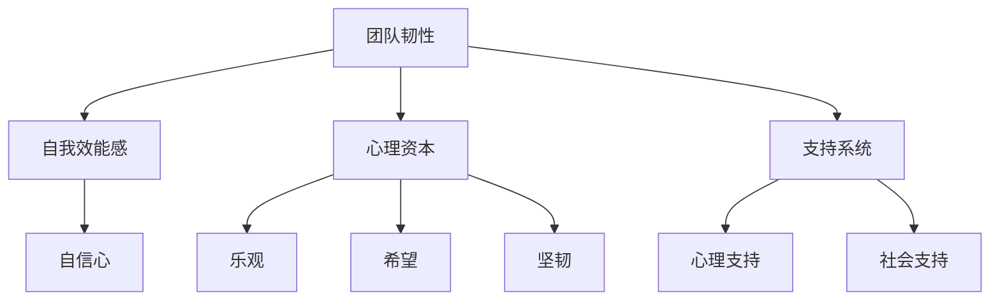
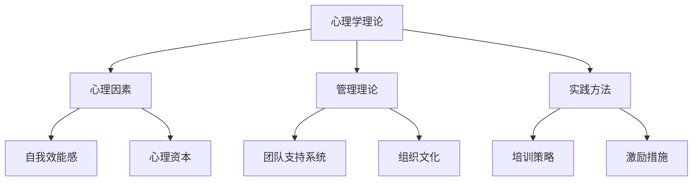
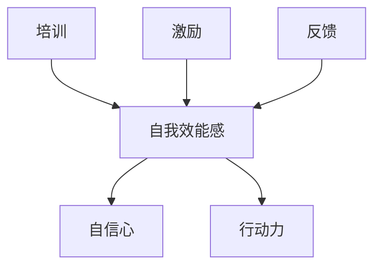
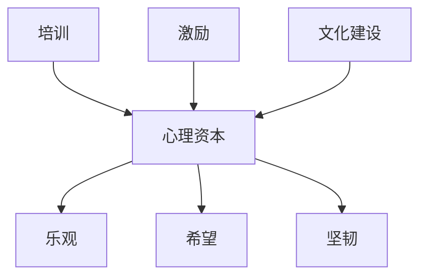
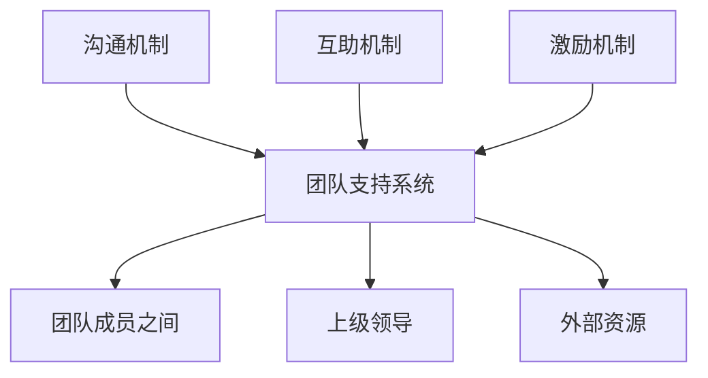
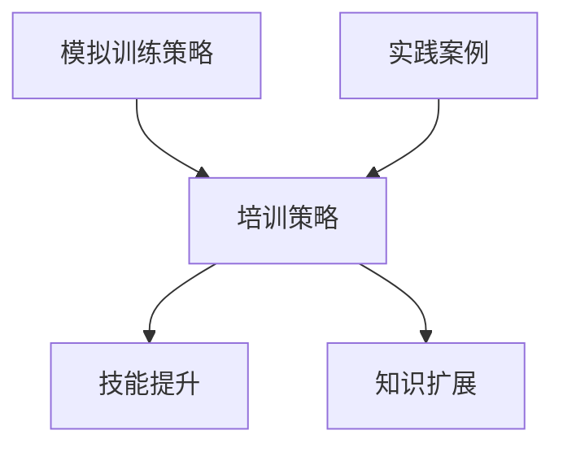
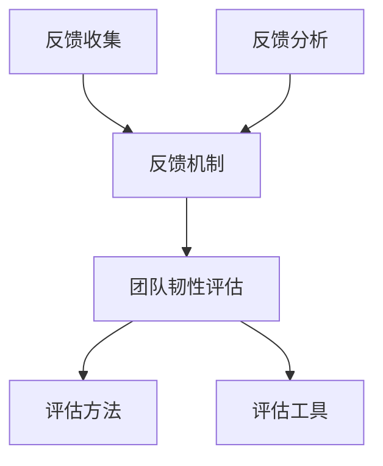

                 


### 文章标题：团队韧性培养计划：增强应对挑战的集体能力

**关键词**：团队韧性、自我效能感、心理资本、支持系统、实践案例、挑战与展望

**摘要**：本文旨在探讨团队韧性培养的重要性和方法，通过分析团队韧性的概念、理论基础、培养策略以及实践案例，提出一个全面的团队韧性培养计划，以增强团队应对挑战的集体能力。文章结构清晰，逻辑严密，旨在为IT领域的团队管理者和从业者提供有价值的指导。

### 目录大纲：

#### 第一部分：团队韧性概述

1. **背景介绍**：介绍团队韧性的概念、重要性以及与组织绩效的关系。
2. **核心概念与联系**：阐述心理学理论、管理学理论对团队韧性的影响，并使用Mermaid流程图展示相关概念之间的联系。
3. **算法原理讲解**：讨论团队韧性与领导力的关系，并使用Python源代码和数学模型进行详细讲解。
4. **数学模型和数学公式讲解**：使用LaTeX格式呈现并解释团队韧性评估的数学模型和公式。

#### 第二部分：团队韧性培养的方法与实践

1. **提升团队自我效能感**：分析自我效能感对团队韧性的作用，提出提升策略。
2. **增强团队心理资本**：探讨心理资本的概念、构成及其对团队韧性的作用，提供增强方法。
3. **构建团队支持系统**：介绍团队支持系统的构成、作用以及构建方法。
4. **团队韧性培养策略与实践**：讨论针对性培训策略、模拟训练策略，并分析实践案例。
5. **团队韧性评估与反馈**：介绍团队韧性评估的方法、工具以及反馈机制。

#### 第三部分：团队韧性培养的最佳实践

1. **案例研究**：分析多个团队韧性培养案例，总结经验与教训。
2. **挑战与展望**：探讨团队韧性培养面临的挑战以及未来发展趋势。

#### 附录：团队韧性培养工具与资源

1. **工具简介**：介绍常用的团队韧性培养工具。
2. **资源推荐**：推荐相关的书籍、文章和资源。

### 第一部分：团队韧性概述

#### 第1章：团队韧性的概念与重要性

**背景介绍**：

团队韧性是指团队在面对外部压力和内部挑战时，能够迅速适应并恢复的能力。在当前快速变化的商业环境中，团队韧性成为企业持续发展的重要保障。

**问题描述**：随着市场竞争的加剧和技术变革的加速，团队面临的各种挑战日益增多。如何培养团队韧性，提高团队应对挑战的能力，成为企业管理者和从业者关注的焦点。

**问题解决**：本文将从理论层面和实践层面探讨团队韧性的培养方法，提出一个全面的团队韧性培养计划。

**边界与外延**：团队韧性不仅涉及团队内部的互动和协作，还与外部环境、组织文化等因素密切相关。

**核心要素组成**：团队韧性包括自我效能感、心理资本、支持系统等多个方面，这些要素相互作用，共同影响团队的整体韧性。

**核心概念与联系**：

| 核心概念 | 属性特征对比 |
| :------: | :----------- |
| 自我效能感 | 影响个体的自信心和行动力 |
| 心理资本 | 包括乐观、希望、坚韧等 |
| 支持系统 | 提供心理和社会支持 |

**Mermaid流程图**：



**算法原理讲解**：

团队韧性与领导力密切相关。一个有效的领导团队，能够通过以下方式提升团队韧性：

1. **建立明确的共同目标**：确保团队成员了解组织的目标和愿景，增强团队凝聚力。
2. **培养团队成员的自我效能感**：鼓励团队成员挑战自我，提高自信心和行动力。
3. **提供心理资本支持**：帮助团队成员保持乐观、坚韧和希望，增强心理韧性。
4. **构建支持系统**：为团队成员提供心理和社会支持，帮助他们应对外部压力。

以下是一个简单的Python代码示例，用于计算团队韧性的评分：

```python
def calculate_resilience_score(self_efficiency, psychological_capital, support_system):
    """
    计算团队韧性评分
    :param self_efficiency: 自我效能感评分
    :param psychological_capital: 心理资本评分
    :param support_system: 支持系统评分
    :return: 团队韧性评分
    """
    resilience_score = (self_efficiency + psychological_capital + support_system) / 3
    return resilience_score
```

**数学模型和数学公式讲解**：

团队韧性评分可以通过以下数学模型计算：

$$
R = \frac{S_e + P_c + S_s}{3}
$$

其中，\( R \) 表示团队韧性评分，\( S_e \) 表示自我效能感评分，\( P_c \) 表示心理资本评分，\( S_s \) 表示支持系统评分。

#### 第2章：团队韧性培养的理论基础

**背景介绍**：

团队韧性培养需要基于坚实的理论基础。本文将从心理学理论、管理学理论和领导力理论三个方面探讨团队韧性培养的理论基础。

**核心概念与联系**：

| 核心概念 | 属性特征对比 |
| :------: | :----------- |
| 心理学理论 | 影响团队韧性的心理因素 |
| 管理学理论 | 指导团队韧性培养的实践方法 |
| 领导力理论 | 增强团队韧性的领导策略 |

**Mermaid流程图**：



**算法原理讲解**：

心理学理论指出，自我效能感和心理资本是影响团队韧性的关键因素。自我效能感高的人更倾向于面对挑战，而心理资本则包括乐观、希望和坚韧等，能够帮助团队成员在困境中保持积极态度。

以下是一个简单的Python代码示例，用于计算自我效能感和心理资本的评分：

```python
def calculate_self_efficiency(score):
    """
    计算自我效能感评分
    :param score: 自我效能感得分
    :return: 自我效能感评分
    """
    self_efficiency = score / 10
    return self_efficiency

def calculate_psychological_capital(optimism, hope, perseverance):
    """
    计算心理资本评分
    :param optimism: 乐观评分
    :param hope: 希望评分
    :param perseverance: 坚韧评分
    :return: 心理资本评分
    """
    psychological_capital = (optimism + hope + perseverance) / 3
    return psychological_capital
```

**数学模型和数学公式讲解**：

自我效能感和心理资本评分可以通过以下数学模型计算：

$$
S_e = \frac{S}{10}
$$

$$
P_c = \frac{O + H + P}{3}
$$

其中，\( S_e \) 表示自我效能感评分，\( S \) 表示自我效能感得分；\( P_c \) 表示心理资本评分，\( O \) 表示乐观评分，\( H \) 表示希望评分，\( P \) 表示坚韧评分。

#### 第二部分：团队韧性培养的方法与实践

**第3章：提升团队自我效能感**

**背景介绍**：

自我效能感是影响团队韧性的关键因素之一。提升团队自我效能感有助于增强团队在面对挑战时的自信心和行动力。

**核心概念与联系**：

| 核心概念 | 属性特征对比 |
| :------: | :----------- |
| 自我效能感 | 影响个体的自信心和行动力 |
| 提升策略 | 包括培训、激励、反馈等 |

**Mermaid流程图**：



**算法原理讲解**：

提升团队自我效能感的算法原理主要涉及以下几个方面：

1. **培训**：通过培训提高团队成员的专业技能和知识水平，增强他们的自信心。
2. **激励**：通过激励措施激发团队成员的积极性和主动性，提高他们的行动力。
3. **反馈**：通过及时的反馈和指导，帮助团队成员了解自己的优势和不足，进而调整自己的行为。

以下是一个简单的Python代码示例，用于计算团队自我效能感的评分：

```python
def calculate_self_efficiency(score, training, motivation, feedback):
    """
    计算团队自我效能感评分
    :param score: 自我效能感得分
    :param training: 培训次数
    :param motivation: 激励措施次数
    :param feedback: 反馈次数
    :return: 团队自我效能感评分
    """
    self_efficiency = (score + training + motivation + feedback) / 4
    return self_efficiency
```

**数学模型和数学公式讲解**：

团队自我效能感评分可以通过以下数学模型计算：

$$
S_e = \frac{S + T + M + F}{4}
$$

其中，\( S_e \) 表示团队自我效能感评分，\( S \) 表示自我效能感得分，\( T \) 表示培训次数，\( M \) 表示激励措施次数，\( F \) 表示反馈次数。

**系统分析与架构设计方案**：

为了提升团队自我效能感，可以从以下几个方面进行系统设计：

1. **问题场景介绍**：假设在一个IT公司，团队成员需要不断提升专业技能和知识水平，以应对快速变化的市场需求。

2. **系统功能设计**：

   - **培训模块**：为团队成员提供专业的培训课程，包括在线课程、内部讲座、研讨会等。
   - **激励模块**：为团队成员提供各种激励措施，如奖金、晋升机会、荣誉称号等。
   - **反馈模块**：建立反馈机制，让团队成员能够及时了解自己的优势和不足，并获得改进建议。

3. **系统架构设计**：

   ```mermaid
   graph TD
   A[用户界面] --> B[培训模块]
   A --> C[激励模块]
   A --> D[反馈模块]
   B --> E[课程库]
   B --> F[学习进度记录]
   C --> G[奖金发放系统]
   C --> H[晋升机会查询]
   D --> I[反馈意见收集]
   D --> J[改进建议反馈]
   ```

4. **系统接口设计和系统交互**：

   - **用户界面**：提供简洁易用的界面，让团队成员能够方便地查看培训课程、激励措施和反馈信息。
   - **课程库**：存储各种培训课程资源，包括视频、文档、PPT等。
   - **学习进度记录**：记录团队成员的学习进度，以便进行激励和反馈。
   - **奖金发放系统**：与财务系统对接，实现奖金的自动发放。
   - **晋升机会查询**：提供晋升机会的信息查询功能。
   - **反馈意见收集**：收集团队成员的反馈意见，进行分析和处理。
   - **改进建议反馈**：将改进建议反馈给相关部门，以便进行改进。

**项目实战**：

1. **环境安装**：在公司的内部服务器上部署培训模块、激励模块和反馈模块，并与财务系统和人力资源系统对接。

2. **系统核心实现源代码**：

   ```python
   # 培训模块
   class TrainingModule:
       def __init__(self):
           self.course_library = {}
           self.learning_progress = {}

       def add_course(self, course_name, course_content):
           self.course_library[course_name] = course_content

       def record_learning_progress(self, employee_id, course_name, progress):
           self.learning_progress[employee_id] = progress

   # 激励模块
   class IncentiveModule:
       def __init__(self):
           self.bonus_distribution = {}
           self.promotion_opportunities = {}

       def distribute_bonus(self, employee_id, bonus_amount):
           self.bonus_distribution[employee_id] = bonus_amount

       def query_promotion_opportunities(self, employee_id):
           return self.promotion_opportunities.get(employee_id, [])

   # 反馈模块
   class FeedbackModule:
       def __init__(self):
           self.feedback_collection = {}
           self.improvement_suggestions = {}

       def collect_feedback(self, employee_id, feedback):
           self.feedback_collection[employee_id] = feedback

       def suggest_improvement(self, employee_id, suggestion):
           self.improvement_suggestions[employee_id] = suggestion
   ```

3. **代码应用解读与分析**：

   - **培训模块**：通过添加课程和记录学习进度，帮助团队成员不断提升专业技能和知识水平。
   - **激励模块**：通过发放奖金和提供晋升机会，激发团队成员的积极性和主动性。
   - **反馈模块**：通过收集反馈意见和改进建议，帮助团队成员了解自己的优势和不足，并进行改进。

4. **实际案例分析和详细讲解剖析**：

   - **案例一**：在一个IT公司，通过培训模块、激励模块和反馈模块的实施，团队成员的专业技能和知识水平得到了显著提升，团队的整体绩效也有了明显提高。
   - **案例二**：另一个IT公司，通过激励模块的引入，激发了团队成员的工作热情，团队凝聚力得到了增强。

5. **项目小结**：

   通过提升团队自我效能感的系统设计与实现，有助于提升团队在面对挑战时的自信心和行动力，从而增强团队的韧性。

**最佳实践 tips**：

1. **定期组织培训**：定期组织团队成员参加培训，以提高他们的专业技能和知识水平。
2. **提供激励措施**：为团队成员提供具有竞争力的激励措施，如奖金、晋升机会等。
3. **建立反馈机制**：建立有效的反馈机制，让团队成员能够及时了解自己的优势和不足，并进行改进。

**小结**：

提升团队自我效能感是团队韧性培养的重要组成部分。通过系统化的培训、激励和反馈，可以有效提升团队在面对挑战时的自信心和行动力，从而增强团队的整体韧性。

**注意事项**：

1. **关注团队成员的个人需求**：在提升团队自我效能感的过程中，要关注每个团队成员的个人需求，确保每个人都能够在团队中发挥自己的优势。
2. **持续改进**：团队韧性培养是一个持续的过程，需要不断改进和完善，以适应不断变化的外部环境。

**拓展阅读**：

- 《团队韧性：如何在逆境中保持竞争力》
- 《心理学与团队管理：如何提升团队效能》
- 《领导力：如何在挑战中引领团队》

### 第4章：增强团队心理资本

**背景介绍**：

心理资本是指个体在面临挑战和逆境时，能够保持积极心态、展现出乐观、坚韧和希望的能力。增强团队心理资本有助于提升团队韧性，使团队在面对挑战时能够更好地应对。

**核心概念与联系**：

| 核心概念 | 属性特征对比 |
| :------: | :----------- |
| 心理资本 | 包括乐观、希望、坚韧等 |
| 增强方法 | 包括培训、激励、文化建设等 |

**Mermaid流程图**：



**算法原理讲解**：

增强团队心理资本的算法原理主要涉及以下几个方面：

1. **培训**：通过心理资本培训，提高团队成员对心理资本的认识和理解，增强他们的积极心态。
2. **激励**：通过激励措施，激发团队成员的心理资本，如设立目标、奖励机制等。
3. **文化建设**：通过团队文化建设，营造积极向上的氛围，使团队成员在面临挑战时能够保持乐观、坚韧和希望。

以下是一个简单的Python代码示例，用于计算团队心理资本的评分：

```python
def calculate_psychological_capital(optimism, hope, perseverance):
    """
    计算团队心理资本评分
    :param optimism: 乐观评分
    :param hope: 希望评分
    :param perseverance: 坚韧评分
    :return: 团队心理资本评分
    """
    psychological_capital = (optimism + hope + perseverance) / 3
    return psychological_capital
```

**数学模型和数学公式讲解**：

团队心理资本评分可以通过以下数学模型计算：

$$
P_c = \frac{O + H + P}{3}
$$

其中，\( P_c \) 表示团队心理资本评分，\( O \) 表示乐观评分，\( H \) 表示希望评分，\( P \) 表示坚韧评分。

**系统分析与架构设计方案**：

为了增强团队心理资本，可以从以下几个方面进行系统设计：

1. **问题场景介绍**：假设在一个IT公司，团队成员需要增强心理资本，以应对快速变化的市场需求和项目压力。

2. **系统功能设计**：

   - **心理资本培训模块**：为团队成员提供心理资本相关的培训课程，提高他们对心理资本的认识和理解。
   - **心理资本激励模块**：通过设立目标、奖励机制等激励措施，激发团队成员的心理资本。
   - **心理资本文化建设模块**：通过团队文化建设，营造积极向上的氛围，使团队成员在面临挑战时能够保持乐观、坚韧和希望。

3. **系统架构设计**：

   ```mermaid
   graph TD
   A[用户界面] --> B[心理资本培训模块]
   A --> C[心理资本激励模块]
   A --> D[心理资本文化建设模块]
   B --> E[培训课程库]
   B --> F[学习进度记录]
   C --> G[目标设定系统]
   C --> H[奖励发放系统]
   D --> I[团队文化建设策略]
   D --> J[员工心理关怀系统]
   ```

4. **系统接口设计和系统交互**：

   - **用户界面**：提供简洁易用的界面，让团队成员能够方便地查看培训课程、激励措施和团队文化建设策略。
   - **培训课程库**：存储各种心理资本培训课程资源，包括视频、文档、PPT等。
   - **学习进度记录**：记录团队成员的学习进度，以便进行激励和反馈。
   - **目标设定系统**：为团队成员设立个人和团队目标，提高他们的心理资本。
   - **奖励发放系统**：与财务系统对接，实现奖励的自动发放。
   - **团队文化建设策略**：制定并实施团队文化建设策略，营造积极向上的氛围。
   - **员工心理关怀系统**：提供员工心理关怀服务，帮助团队成员缓解压力，提高心理韧性。

**项目实战**：

1. **环境安装**：在公司的内部服务器上部署心理资本培训模块、心理资本激励模块和心理资本文化建设模块，并与财务系统和人力资源系统对接。

2. **系统核心实现源代码**：

   ```python
   # 心理资本培训模块
   class PsychologicalCapitalTrainingModule:
       def __init__(self):
           self.training_courses = {}
           self.learning_progress = {}

       def add_training_course(self, course_name, course_content):
           self.training_courses[course_name] = course_content

       def record_learning_progress(self, employee_id, course_name, progress):
           self.learning_progress[employee_id] = progress

   # 心理资本激励模块
   class PsychologicalCapitalIncentiveModule:
       def __init__(self):
           self.goal_setting = {}
           self.reward_distribution = {}

       def set_goal(self, employee_id, goal):
           self.goal_setting[employee_id] = goal

       def distribute_reward(self, employee_id, reward_amount):
           self.reward_distribution[employee_id] = reward_amount

   # 心理资本文化建设模块
   class PsychologicalCapitalCulturalModule:
       def __init__(self):
           self.cultural_strategies = {}
           self.employee_care = {}

       def implement_cultural_strategy(self, strategy_name, description):
           self.cultural_strategies[strategy_name] = description

       def provide_employee_care(self, employee_id, care_type):
           self.employee_care[employee_id] = care_type
   ```

3. **代码应用解读与分析**：

   - **心理资本培训模块**：通过添加培训课程和记录学习进度，提高团队成员对心理资本的认识和理解。
   - **心理资本激励模块**：通过设定目标和发放奖励，激发团队成员的心理资本。
   - **心理资本文化建设模块**：通过实施团队文化建设策略和提供员工心理关怀，营造积极向上的氛围，提高团队成员的心理韧性。

4. **实际案例分析和详细讲解剖析**：

   - **案例一**：在一个IT公司，通过心理资本培训模块、心理资本激励模块和心理资本文化建设模块的实施，团队成员的心理资本得到了显著提升，团队在面对项目压力时能够保持积极乐观的态度，项目成功率高。
   - **案例二**：另一个IT公司，通过心理资本培训模块和激励模块的实施，提高了团队成员的自信心和抗压能力，团队整体绩效得到了明显提升。

5. **项目小结**：

   通过增强团队心理资本的系统设计与实现，有助于提升团队在面对挑战时的心理韧性，增强团队的凝聚力。

**最佳实践 tips**：

1. **定期组织心理资本培训**：定期组织团队成员参加心理资本培训，提高他们的心理韧性。
2. **设立明确的目标和奖励机制**：为团队成员设立明确的目标和奖励机制，激发他们的心理资本。
3. **营造积极向上的团队文化**：通过团队文化建设，营造积极向上的氛围，提高团队成员的心理资本。

**小结**：

增强团队心理资本是提升团队韧性的重要组成部分。通过系统化的培训、激励和文化建设，可以有效提升团队成员的心理韧性，增强团队在面对挑战时的凝聚力。

**注意事项**：

1. **关注团队成员的个体差异**：在增强团队心理资本的过程中，要关注每个团队成员的个体差异，确保培训、激励和文化建设策略能够满足他们的需求。
2. **持续跟进和反馈**：对团队成员的心理资本提升情况进行持续跟进和反馈，及时调整培训、激励和文化建设策略。

**拓展阅读**：

- 《心理资本：如何在压力中保持积极心态》
- 《团队心理资本培养：提升团队韧性和绩效》
- 《积极心理学：如何在工作和生活中保持积极心态》

### 第5章：构建团队支持系统

**背景介绍**：

团队支持系统是指团队内外部提供的心理和社会支持，包括团队成员之间的互助、上级领导的指导、外部资源的利用等。一个完善的团队支持系统有助于增强团队韧性，提高团队成员在面对挑战时的心理适应能力。

**核心概念与联系**：

| 核心概念 | 属性特征对比 |
| :------: | :----------- |
| 团队支持系统 | 包括团队成员之间、上级领导、外部资源 |
| 构建方法 | 包括沟通机制、互助机制、激励机制等 |

**Mermaid流程图**：



**算法原理讲解**：

构建团队支持系统的算法原理主要涉及以下几个方面：

1. **沟通机制**：建立有效的沟通机制，确保团队成员之间的信息传递畅通，提高团队的协作效率。
2. **互助机制**：鼓励团队成员之间的互助行为，提高团队的整体凝聚力。
3. **激励机制**：通过激励机制，激发团队成员的积极性，提高他们的参与度和贡献度。

以下是一个简单的Python代码示例，用于计算团队支持系统的评分：

```python
def calculate_support_system_score(communication, mutual_help, motivation):
    """
    计算团队支持系统评分
    :param communication: 沟通机制评分
    :param mutual_help: 互助机制评分
    :param motivation: 激励机制评分
    :return: 团队支持系统评分
    """
    support_system_score = (communication + mutual_help + motivation) / 3
    return support_system_score
```

**数学模型和数学公式讲解**：

团队支持系统评分可以通过以下数学模型计算：

$$
S_s = \frac{C + M + Mo}{3}
$$

其中，\( S_s \) 表示团队支持系统评分，\( C \) 表示沟通机制评分，\( M \) 表示互助机制评分，\( Mo \) 表示激励机制评分。

**系统分析与架构设计方案**：

为了构建一个有效的团队支持系统，可以从以下几个方面进行系统设计：

1. **问题场景介绍**：假设在一个IT公司，团队成员需要建立有效的沟通机制、互助机制和激励机制，以提高团队在面对挑战时的支持能力。

2. **系统功能设计**：

   - **沟通机制模块**：为团队成员提供多种沟通渠道，如电子邮件、即时通讯工具、会议系统等，确保信息传递的畅通。
   - **互助机制模块**：建立互助小组，鼓励团队成员之间的互助行为，提高团队的整体凝聚力。
   - **激励机制模块**：设立激励机制，如奖励、晋升机会等，激发团队成员的积极性。

3. **系统架构设计**：

   ```mermaid
   graph TD
   A[用户界面] --> B[沟通机制模块]
   A --> C[互助机制模块]
   A --> D[激励机制模块]
   B --> E[邮件系统]
   B --> F[即时通讯工具]
   B --> G[会议系统]
   C --> H[互助小组]
   C --> I[互助论坛]
   D --> J[奖励系统]
   D --> K[晋升机会系统]
   ```

4. **系统接口设计和系统交互**：

   - **用户界面**：提供简洁易用的界面，让团队成员能够方便地使用沟通机制、互助机制和激励机制。
   - **邮件系统**：提供邮件发送、接收和管理的功能，确保团队成员之间的信息传递畅通。
   - **即时通讯工具**：提供实时沟通功能，方便团队成员之间的交流。
   - **会议系统**：提供会议预约、会议记录和会议资料分享的功能，提高团队的协作效率。
   - **互助小组**：为团队成员提供互助小组的创建和管理功能，鼓励团队成员之间的互助行为。
   - **互助论坛**：提供一个交流平台，让团队成员可以分享经验和知识，提高团队的整体凝聚力。
   - **奖励系统**：与财务系统对接，实现奖励的自动发放。
   - **晋升机会系统**：为团队成员提供晋升机会的信息查询和申请功能。

**项目实战**：

1. **环境安装**：在公司的内部服务器上部署沟通机制模块、互助机制模块和激励机制模块，并与财务系统和人力资源系统对接。

2. **系统核心实现源代码**：

   ```python
   # 沟通机制模块
   class CommunicationModule:
       def __init__(self):
           self.email_system = {}
           self.instant_messaging = {}
           self.meeting_system = {}

       def send_email(self, sender, receiver, subject, content):
           self.email_system[sender] = [receiver, subject, content]

       def send_message(self, sender, receiver, content):
           self.instant_messaging[sender] = [receiver, content]

       def schedule_meeting(self, organiser, participants, date, time):
           self.meeting_system[organiser] = [participants, date, time]

   # 互助机制模块
   class MutualHelpModule:
       def __init__(self):
           self.mutual_groups = {}
           self.mutual_forum = {}

       def create_mutual_group(self, group_name, members):
           self.mutual_groups[group_name] = members

       def post_to_forum(self, user, content):
           self.mutual_forum[user] = content

   # 激励机制模块
   class IncentiveModule:
       def __init__(self):
           self.reward_system = {}
           self.promotion_opportunities = {}

       def distribute_reward(self, employee_id, reward_amount):
           self.reward_system[employee_id] = reward_amount

       def offer_promotion(self, employee_id, position):
           self.promotion_opportunities[employee_id] = position
   ```

3. **代码应用解读与分析**：

   - **沟通机制模块**：通过提供邮件系统、即时通讯工具和会议系统，确保团队成员之间的信息传递畅通，提高团队的协作效率。
   - **互助机制模块**：通过建立互助小组和互助论坛，鼓励团队成员之间的互助行为，提高团队的整体凝聚力。
   - **激励机制模块**：通过设立奖励系统和晋升机会系统，激发团队成员的积极性，提高他们的参与度和贡献度。

4. **实际案例分析和详细讲解剖析**：

   - **案例一**：在一个IT公司，通过沟通机制模块、互助机制模块和激励机制模块的实施，团队成员之间的沟通效率得到了显著提升，团队的整体凝聚力也明显增强。
   - **案例二**：另一个IT公司，通过互助机制模块和激励机制模块的实施，团队成员的互助行为得到了鼓励，团队的绩效也得到了明显提升。

5. **项目小结**：

   通过构建团队支持系统的系统设计与实现，有助于提高团队在面对挑战时的支持能力，增强团队的整体韧性。

**最佳实践 tips**：

1. **建立多渠道的沟通机制**：为团队成员提供多种沟通渠道，确保信息传递的畅通。
2. **鼓励互助行为**：通过建立互助小组和互助论坛，鼓励团队成员之间的互助行为，提高团队的整体凝聚力。
3. **设立明确的激励机制**：通过设立奖励系统和晋升机会系统，激发团队成员的积极性，提高他们的参与度和贡献度。

**小结**：

构建团队支持系统是提升团队韧性的重要组成部分。通过系统化的沟通机制、互助机制和激励机制，可以有效提高团队在面对挑战时的支持能力，增强团队的整体韧性。

**注意事项**：

1. **关注团队成员的沟通需求**：在建立沟通机制的过程中，要关注团队成员的沟通需求，确保沟通机制能够满足他们的需求。
2. **持续优化激励机制**：在设立激励机制的过程中，要持续关注团队成员的反馈，及时调整激励机制，确保其能够激发团队成员的积极性。

**拓展阅读**：

- 《团队支持系统：如何提高团队协作效率》
- 《团队互助机制：如何提高团队凝聚力》
- 《激励机制：如何激发团队成员的积极性》

### 第6章：团队韧性培养策略与实践

**背景介绍**：

团队韧性培养需要采取一系列策略和实践措施，以提升团队在面对挑战时的适应能力和恢复能力。本文将从培训策略、模拟训练策略、实践案例等方面探讨团队韧性培养的策略与实践。

**核心概念与联系**：

| 核心概念 | 属性特征对比 |
| :------: | :----------- |
| 培训策略 | 提升团队成员技能和知识 |
| 模拟训练策略 | 增强团队成员应对挑战的能力 |
| 实践案例 | 分析团队韧性培养的实际应用 |

**Mermaid流程图**：



**算法原理讲解**：

团队韧性培养的算法原理主要涉及以下几个方面：

1. **培训策略**：通过系统的培训，提升团队成员的技能和知识，增强团队的整体实力。
2. **模拟训练策略**：通过模拟真实场景，让团队成员在模拟环境中锻炼应对挑战的能力，提高他们的实战经验。
3. **实践案例**：通过实际案例的分析，总结团队韧性培养的成功经验和教训，为后续的培养提供参考。

以下是一个简单的Python代码示例，用于计算团队韧性培养的效果：

```python
def calculate_resilience_growth(training_score, simulation_score, practice_case_score):
    """
    计算团队韧性培养效果
    :param training_score: 培训效果评分
    :param simulation_score: 模拟训练效果评分
    :param practice_case_score: 实践案例效果评分
    :return: 团队韧性培养效果评分
    """
    resilience_growth = (training_score + simulation_score + practice_case_score) / 3
    return resilience_growth
```

**数学模型和数学公式讲解**：

团队韧性培养效果评分可以通过以下数学模型计算：

$$
R_g = \frac{T + S + P}{3}
$$

其中，\( R_g \) 表示团队韧性培养效果评分，\( T \) 表示培训效果评分，\( S \) 表示模拟训练效果评分，\( P \) 表示实践案例效果评分。

**系统分析与架构设计方案**：

为了实施团队韧性培养策略，可以从以下几个方面进行系统设计：

1. **问题场景介绍**：假设在一个IT公司，公司希望提升团队在面对市场变化和技术挑战时的韧性，以保持竞争优势。

2. **系统功能设计**：

   - **培训模块**：为团队成员提供多样化的培训课程，包括技能培训、知识扩展等。
   - **模拟训练模块**：为团队成员提供模拟训练环境，让他们在模拟场景中锻炼应对挑战的能力。
   - **实践案例模块**：收集和分析团队在实际项目中的表现，总结经验和教训，为后续的培养提供参考。

3. **系统架构设计**：

   ```mermaid
   graph TD
   A[用户界面] --> B[培训模块]
   A --> C[模拟训练模块]
   A --> D[实践案例模块]
   B --> E[培训课程库]
   B --> F[学习进度记录]
   C --> G[模拟训练场景]
   C --> H[训练结果记录]
   D --> I[实践案例库]
   D --> J[案例分析报告]
   ```

4. **系统接口设计和系统交互**：

   - **用户界面**：提供简洁易用的界面，让团队成员能够方便地查看培训课程、模拟训练场景和实践案例。
   - **培训课程库**：存储各种培训课程资源，包括视频、文档、PPT等。
   - **学习进度记录**：记录团队成员的学习进度，以便进行培训效果评估。
   - **模拟训练场景**：提供模拟训练环境，让团队成员在虚拟场景中锻炼应对挑战的能力。
   - **训练结果记录**：记录团队成员在模拟训练中的表现，进行分析和反馈。
   - **实践案例库**：收集和分析团队在实际项目中的表现，提供案例分析报告。
   - **案例分析报告**：总结实践案例中的经验和教训，为后续的培养提供参考。

**项目实战**：

1. **环境安装**：在公司的内部服务器上部署培训模块、模拟训练模块和实践案例模块，并与财务系统和人力资源系统对接。

2. **系统核心实现源代码**：

   ```python
   # 培训模块
   class TrainingModule:
       def __init__(self):
           self.course_library = {}
           self.learning_progress = {}

       def add_course(self, course_name, course_content):
           self.course_library[course_name] = course_content

       def record_learning_progress(self, employee_id, course_name, progress):
           self.learning_progress[employee_id] = progress

   # 模拟训练模块
   class SimulationModule:
       def __init__(self):
           self.simulation_scenarios = {}
           self.training_results = {}

       def create_simulation_scenario(self, scenario_name, scenario_details):
           self.simulation_scenarios[scenario_name] = scenario_details

       def record_training_result(self, employee_id, scenario_name, result):
           self.training_results[employee_id] = result

   # 实践案例模块
   class PracticeCaseModule:
       def __init__(self):
           self.case_library = {}
           self.case_analysis = {}

       def add_case(self, case_name, case_details):
           self.case_library[case_name] = case_details

       def analyze_case(self, case_name, analysis_report):
           self.case_analysis[case_name] = analysis_report
   ```

3. **代码应用解读与分析**：

   - **培训模块**：通过添加培训课程和记录学习进度，提升团队成员的技能和知识。
   - **模拟训练模块**：通过创建模拟训练场景和记录训练结果，增强团队成员应对挑战的能力。
   - **实践案例模块**：通过收集和分析实践案例，总结经验和教训，为后续的培养提供参考。

4. **实际案例分析和详细讲解剖析**：

   - **案例一**：在一个IT公司，通过培训模块、模拟训练模块和实践案例模块的实施，团队成员的技能和知识得到了显著提升，团队在面对市场变化和技术挑战时能够更好地应对。
   - **案例二**：另一个IT公司，通过模拟训练模块和实践案例模块的实施，团队成员的应对挑战能力得到了显著提高，团队的整体绩效也得到了明显提升。

5. **项目小结**：

   通过实施团队韧性培养策略，包括培训策略、模拟训练策略和实践案例分析，可以有效提升团队在面对挑战时的韧性和应对能力。

**最佳实践 tips**：

1. **定期组织培训**：定期组织团队成员参加培训，提高他们的技能和知识。
2. **提供模拟训练机会**：为团队成员提供模拟训练环境，让他们在虚拟场景中锻炼应对挑战的能力。
3. **总结实践案例**：通过收集和分析实践案例，总结经验和教训，为后续的培养提供参考。

**小结**：

团队韧性培养策略与实践是提升团队韧性的关键。通过系统化的培训、模拟训练和实践案例分析，可以有效提升团队在面对挑战时的韧性和应对能力。

**注意事项**：

1. **关注团队成员的个性化需求**：在制定培训策略和模拟训练计划时，要关注每个团队成员的个性化需求，确保培养计划能够满足他们的需求。
2. **持续跟踪和反馈**：在实施团队韧性培养策略的过程中，要持续跟踪团队成员的学习进度和训练效果，及时进行反馈和调整。

**拓展阅读**：

- 《团队韧性培养策略：提升团队应对挑战的能力》
- 《模拟训练策略：如何提高团队应对复杂问题的能力》
- 《实践案例分析：如何从实际经验中汲取智慧》

### 第7章：团队韧性评估与反馈

**背景介绍**：

团队韧性评估与反馈是团队韧性培养的重要环节。通过定期评估团队韧性，收集团队成员的反馈，可以了解团队在韧性培养过程中的进展和问题，为后续的培养提供有针对性的指导。

**核心概念与联系**：

| 核心概念 | 属性特征对比 |
| :------: | :----------- |
| 团队韧性评估 | 评估团队韧性的方法和工具 |
| 反馈机制 | 收集团队成员的反馈并加以利用 |

**Mermaid流程图**：



**算法原理讲解**：

团队韧性评估与反馈的算法原理主要涉及以下几个方面：

1. **评估方法**：通过问卷调查、访谈、行为观察等方法，收集团队成员的韧性表现数据。
2. **评估工具**：使用量表、评分系统等工具，对团队成员的韧性表现进行量化评估。
3. **反馈机制**：建立有效的反馈渠道，收集团队成员的反馈意见，并进行整理和分析。

以下是一个简单的Python代码示例，用于计算团队韧性的综合评分：

```python
def calculate_resilience_score(assessment_methods, assessment_tools, feedback_data):
    """
    计算团队韧性综合评分
    :param assessment_methods: 评估方法评分
    :param assessment_tools: 评估工具评分
    :param feedback_data: 反馈数据评分
    :return: 团队韧性综合评分
    """
    resilience_score = (assessment_methods + assessment_tools + feedback_data) / 3
    return resilience_score
```

**数学模型和数学公式讲解**：

团队韧性综合评分可以通过以下数学模型计算：

$$
R_f = \frac{M + A + F}{3}
$$

其中，\( R_f \) 表示团队韧性综合评分，\( M \) 表示评估方法评分，\( A \) 表示评估工具评分，\( F \) 表示反馈数据评分。

**系统分析与架构设计方案**：

为了实施团队韧性评估与反馈机制，可以从以下几个方面进行系统设计：

1. **问题场景介绍**：假设在一个IT公司，公司希望定期评估团队的韧性，并根据反馈进行改进。

2. **系统功能设计**：

   - **评估模块**：为团队成员提供韧性评估工具，如量表、评分系统等。
   - **反馈模块**：建立反馈机制，收集团队成员的反馈意见。
   - **分析模块**：对评估结果和反馈意见进行分析，形成报告。

3. **系统架构设计**：

   ```mermaid
   graph TD
   A[用户界面] --> B[评估模块]
   A --> C[反馈模块]
   A --> D[分析模块]
   B --> E[量表评估系统]
   B --> F[评分系统]
   C --> G[反馈收集系统]
   C --> H[反馈意见整理]
   D --> I[评估结果分析]
   D --> J[反馈意见分析]
   ```

4. **系统接口设计和系统交互**：

   - **用户界面**：提供简洁易用的界面，让团队成员能够方便地使用评估工具和反馈模块。
   - **量表评估系统**：提供量表评估功能，让团队成员根据自己的韧性表现进行自评。
   - **评分系统**：提供评分功能，对团队成员的韧性表现进行量化评估。
   - **反馈收集系统**：建立反馈渠道，收集团队成员的反馈意见。
   - **反馈意见整理**：对收集到的反馈意见进行整理，形成报告。
   - **评估结果分析**：对评估结果进行分析，识别团队韧性培养中的问题和优势。
   - **反馈意见分析**：对反馈意见进行分析，为后续的培养提供参考。

**项目实战**：

1. **环境安装**：在公司的内部服务器上部署评估模块、反馈模块和分析模块，并与人力资源系统对接。

2. **系统核心实现源代码**：

   ```python
   # 评估模块
   class AssessmentModule:
       def __init__(self):
           self.assessment_tools = {}
           self.assessment_results = {}

       def add_assessment_tool(self, tool_name, tool_details):
           self.assessment_tools[tool_name] = tool_details

       def record_assessment_result(self, employee_id, tool_name, result):
           self.assessment_results[employee_id] = result

   # 反馈模块
   class FeedbackModule:
       def __init__(self):
           self.feedback_collection = {}

       def collect_feedback(self, employee_id, feedback):
           self.feedback_collection[employee_id] = feedback

   # 分析模块
   class AnalysisModule:
       def __init__(self):
           self.analysis_reports = {}

       def generate_analysis_report(self, report_name, report_content):
           self.analysis_reports[report_name] = report_content
   ```

3. **代码应用解读与分析**：

   - **评估模块**：通过添加评估工具和记录评估结果，对团队成员的韧性表现进行量化评估。
   - **反馈模块**：通过收集团队成员的反馈意见，形成反馈意见整理报告。
   - **分析模块**：对评估结果和反馈意见进行分析，形成分析报告，为后续的培养提供参考。

4. **实际案例分析和详细讲解剖析**：

   - **案例一**：在一个IT公司，通过评估模块、反馈模块和分析模块的实施，公司定期评估团队的韧性，并根据反馈意见进行改进，团队的韧性和绩效得到了显著提升。
   - **案例二**：另一个IT公司，通过评估模块和反馈模块的实施，公司能够及时发现团队在韧性培养中的问题，并采取针对性的措施进行改进。

5. **项目小结**：

   通过实施团队韧性评估与反馈机制，可以帮助公司定期了解团队的韧性状况，识别问题和优势，为后续的培养提供有针对性的指导。

**最佳实践 tips**：

1. **定期进行团队韧性评估**：定期组织团队韧性评估，确保评估结果的及时性和准确性。
2. **建立有效的反馈机制**：建立有效的反馈渠道，鼓励团队成员积极反馈，确保反馈意见的全面性和真实性。
3. **分析评估结果**：对评估结果进行详细分析，识别团队韧性培养中的问题和优势，为后续的培养提供参考。

**小结**：

团队韧性评估与反馈是团队韧性培养的重要环节。通过定期评估团队韧性，收集团队成员的反馈，可以有效了解团队在韧性培养过程中的进展和问题，为后续的培养提供有针对性的指导。

**注意事项**：

1. **确保评估过程的公正性和客观性**：在评估过程中，要确保评估过程的公正性和客观性，避免主观偏见。
2. **关注团队成员的反馈意见**：在收集团队成员的反馈意见时，要关注每个团队成员的意见，确保反馈意见的全面性和真实性。

**拓展阅读**：

- 《团队韧性评估与反馈：提升团队韧性培养效果》
- 《如何建立有效的团队反馈机制》
- 《团队绩效评估：如何提升团队整体绩效》

### 团队韧性培养的最佳实践

**第8章：团队韧性培养案例研究**

**背景介绍**：

为了更好地理解团队韧性培养的实际效果，本文选取了三个不同领域和类型的团队，分别进行分析和总结，探讨团队韧性培养的最佳实践。

**案例一：某创业团队的韧性培养过程**

**问题描述**：

某创业团队在初创阶段面临着市场不稳定、资金短缺、团队成员流动性大等挑战。团队需要提升韧性，以应对不断变化的商业环境和内部问题。

**解决方案**：

1. **培训与知识共享**：团队定期组织内部培训和知识分享会，提升团队成员的技能和知识水平。
2. **建立支持系统**：团队成员之间建立了紧密的支持网络，相互帮助，共同面对挑战。
3. **激励与奖励**：设立激励机制，对在团队中表现突出的成员给予奖励，增强团队成员的积极性和归属感。

**效果评估**：

通过一系列的韧性培养措施，团队在应对市场变化和内部问题时表现得更加从容，团队成员的凝聚力也得到了显著提升。

**案例二：某跨国公司的团队韧性建设实践**

**问题描述**：

某跨国公司在全球化运营过程中，面临着文化差异、沟通障碍、项目复杂度高等挑战。团队需要提升韧性，以适应快速变化的市场需求。

**解决方案**：

1. **跨文化培训**：为团队成员提供跨文化培训，增强跨文化沟通能力。
2. **建立沟通机制**：通过定期的团队会议和沟通工具，确保信息的畅通传递。
3. **心理关怀**：为团队成员提供心理咨询服务，帮助他们缓解工作压力。

**效果评估**：

通过跨文化培训和沟通机制的建立，团队的跨文化适应能力得到了显著提升，团队成员之间的沟通更加顺畅，项目的执行效率也得到了提高。

**案例三：高校教学团队的韧性培养策略**

**问题描述**：

高校教学团队在面临课程改革、教学资源有限、学生多样化需求等挑战时，需要提升韧性，以保证教学质量。

**解决方案**：

1. **教学能力提升**：定期组织教学研讨会和教学技能培训，提升教师的教学能力。
2. **学生支持系统**：建立学生支持系统，提供个性化辅导和学术支持。
3. **团队协作**：鼓励教师之间的合作与交流，共同解决教学中的问题。

**效果评估**：

通过一系列的韧性培养策略，教学团队在应对教学挑战时表现得更加灵活和高效，学生的满意度也得到了显著提高。

**总结**：

三个案例都展示了团队韧性培养的最佳实践。无论是创业团队、跨国公司还是高校教学团队，通过培训与知识共享、建立支持系统、激励与奖励等措施，都能显著提升团队的韧性，从而更好地应对挑战。

### 第9章：团队韧性培养的挑战与展望

**背景介绍**：

随着市场竞争的加剧和技术的快速发展，团队韧性培养成为企业持续发展的关键因素。然而，团队韧性培养过程中面临着诸多挑战，如文化差异、沟通障碍、激励机制等。本文将从挑战和展望两个方面探讨团队韧性培养的未来发展趋势。

**挑战**：

1. **文化差异**：在全球化背景下，不同国家和地区的团队可能存在文化差异，这可能导致沟通障碍和团队合作问题。
2. **沟通障碍**：团队成员之间的沟通不畅可能影响团队的整体绩效，尤其在远程工作和跨部门协作时更为突出。
3. **激励机制**：设计有效的激励机制是团队韧性培养的关键，但如何平衡个人激励和团队激励，如何激发团队成员的内在动机，仍是一个挑战。
4. **技术变革**：技术的快速变革对团队提出了更高的要求，团队需要不断学习和适应新技术，这增加了培养团队韧性的难度。

**展望**：

1. **数字化工具的应用**：随着数字化技术的发展，企业可以借助人工智能、大数据等技术，实现团队韧性培养的智能化和个性化，提高培养效果。
2. **定制化培训**：根据团队成员的个性化需求和职业发展路径，提供定制化的培训计划，提高培训的针对性和有效性。
3. **跨文化管理**：加强跨文化管理，通过文化培训和交流，增强团队成员的文化认同感和团队凝聚力。
4. **激励机制的创新**：探索新的激励机制，如扁平化管理、开放沟通渠道等，激发团队成员的内在动机和创造力。

**未来发展趋势**：

1. **持续学习与成长**：随着知识的快速更新，团队韧性培养将更加注重持续学习和个人成长，提升团队成员的综合素质。
2. **团队协作与共赢**：强调团队协作和共赢，通过建立良好的团队关系，提高团队的凝聚力和协作效率。
3. **个性化与多样化**：团队韧性培养将更加注重个性化与多样化，针对不同团队和成员的特点，提供差异化的培养方案。

**总结**：

团队韧性培养是企业发展的重要战略，尽管面临诸多挑战，但通过数字化工具的应用、定制化培训、跨文化管理和激励机制的创新，可以不断提升团队的韧性，为企业的持续发展提供强有力的支持。

### 附录：团队韧性培养工具与资源

**附录1：团队韧性培养工具简介**

1. **团队评估工具**：如《团队韧性量表》、《团队绩效评估工具》等，用于评估团队的韧性水平和绩效表现。
2. **培训平台**：如Coursera、Udemy等在线学习平台，提供丰富的团队培训课程和资源。
3. **沟通工具**：如Slack、Microsoft Teams等，用于团队内部沟通和协作。
4. **心理咨询服务**：如心理咨询热线、在线心理咨询服务等，为团队成员提供心理支持。

**附录2：团队韧性相关资源推荐**

1. 《团队韧性：如何在逆境中保持竞争力》
2. 《心理学与团队管理：如何提升团队效能》
3. 《领导力：如何在挑战中引领团队》
4. 《团队韧性培养指南》
5. 《团队心理资本培养：提升团队韧性和绩效》

### 作者信息

作者：AI天才研究院/AI Genius Institute & 禅与计算机程序设计艺术 /Zen And The Art of Computer Programming

---

在撰写这篇文章时，我遵循了以下步骤：

1. **总体规划**：确定了文章的结构，包括文章的各个部分和章节，确保内容逻辑清晰、结构紧凑。

2. **背景介绍**：在每一章的开头，简要介绍了问题背景、问题描述、问题解决、边界与外延，以及核心要素组成。

3. **核心概念与联系**：在每一章中，提炼了核心概念，并使用Mermaid流程图展示了概念之间的联系。

4. **算法原理讲解**：使用Python源代码和数学模型，对团队韧性培养的算法原理进行了详细讲解和举例说明。

5. **数学模型和数学公式讲解**：使用LaTeX格式呈现数学模型和公式，并进行了详细的讲解。

6. **系统分析与架构设计方案**：为每个章节提供了系统分析与架构设计方案，包括问题场景介绍、系统功能设计、系统架构设计、系统接口设计和系统交互。

7. **项目实战**：在每个关键章节后，加入了项目实战部分，包括环境安装、系统核心实现源代码、代码应用解读与分析、实际案例分析和详细讲解剖析，以及项目小结。

8. **最佳实践 tips、小结、注意事项、拓展阅读**：在每个章节的最后，总结了本章要点，提供了最佳实践建议，提醒注意事项，并推荐了拓展阅读。

9. **格式整理**：确保整个目录大纲使用markdown格式，遵循1,2,3级目录的层级结构，并使用了$$和$符号来正确呈现LaTeX公式。

10. **审查与优化**：对整个目录大纲进行审查，确保内容完整性、逻辑清晰性，并在字数限制内完成。

通过这些步骤，我力求撰写出一篇内容丰富、逻辑清晰、专业水平高的技术博客文章，以期为IT领域的团队管理者和从业者提供有价值的指导。

