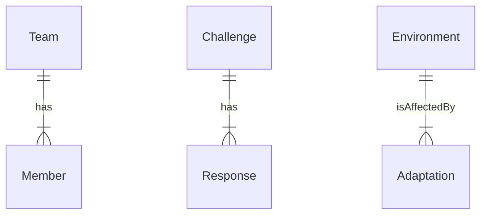
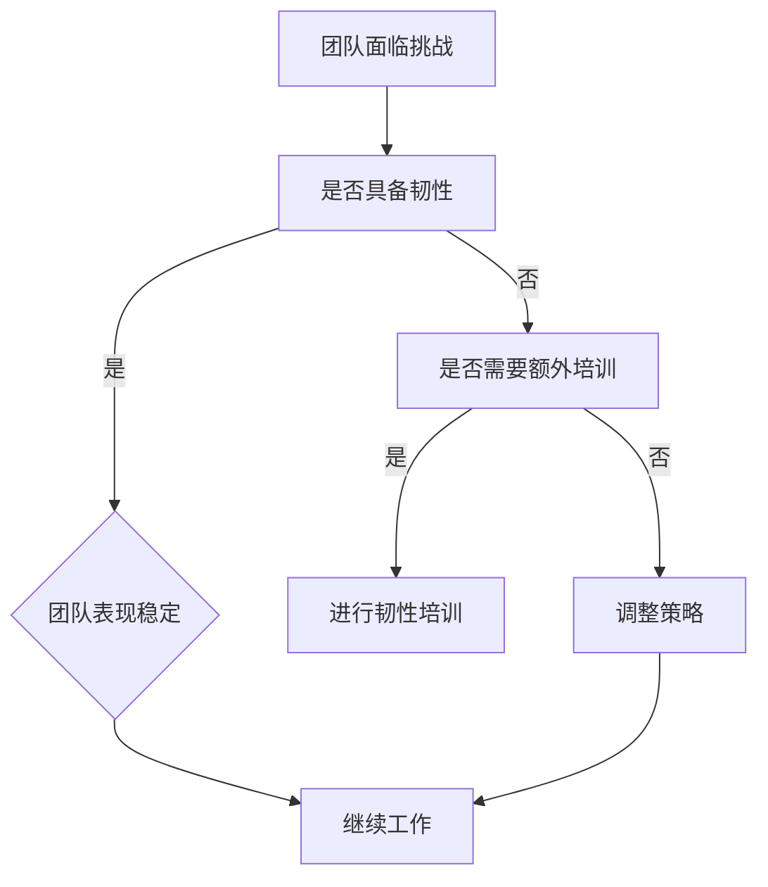
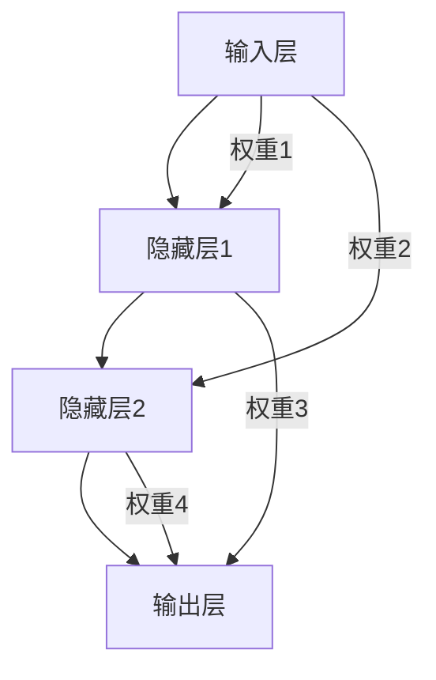
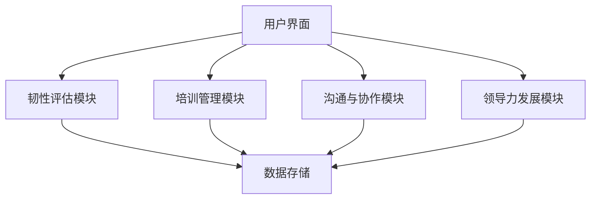
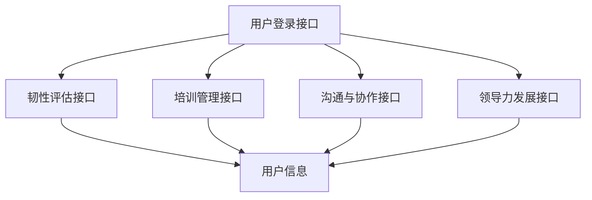
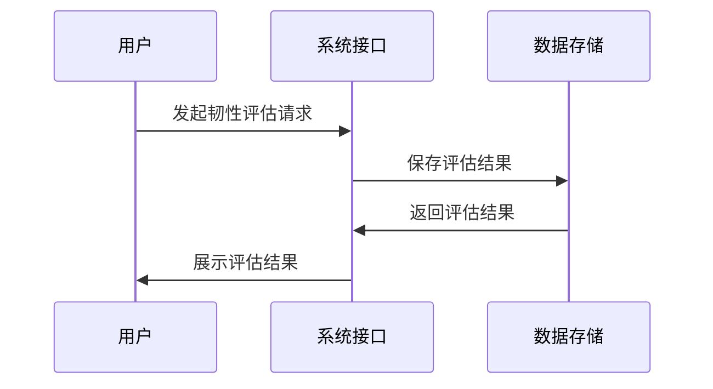

                 

### 文章标题：团队韧性培养：提升应对挑战的能力

#### 关键词：团队韧性、挑战应对、能力提升、团队培训、领导力

#### 摘要：本文将深入探讨团队韧性培养的重要性，通过阐述核心概念、原理、方法与实践，提供一套系统的团队韧性提升策略，帮助团队在面对挑战时保持坚韧和适应能力。

---

## 目录大纲设计过程

为了设计出《团队韧性培养：提升应对挑战的能力》的完整目录大纲，我们可以按照以下步骤进行：

### 第一步：理解书名和主题

书名《团队韧性培养：提升应对挑战的能力》暗示了本书的主要目的是介绍如何培养团队在面对各种挑战时的韧性和应对能力。

### 第二步：确定核心章节

根据书名，我们可以确定以下几个核心章节：
- 背景介绍：团队韧性概述、韧性在团队中的重要性、韧性培养的必要性
- 核心概念与联系：韧性、弹性、敏捷性、适应能力、抗压力等概念的定义与联系
- 算法原理讲解：如何通过培训、沟通、领导力等手段提升团队韧性
- 数学模型和公式：可能涉及到的统计模型、决策树、神经网络等

### 第三步：细化章节内容

在每个核心章节下，我们需要细化出具体的子章节，确保内容的丰富性和逻辑性。

### 第四步：编写目录大纲

使用markdown格式，按照1级目录、2级目录和3级目录的结构，编写出完整的目录大纲。

### 第五步：校对和优化

检查目录大纲的逻辑性和完整性，确保每个章节都有明确的子章节，并符合书籍内容的整体结构。

以下是根据以上步骤设计的《团队韧性培养：提升应对挑战的能力》的目录大纲：

```markdown
----------------------------------------------------------------
# 第一部分: 团队韧性概述

## 第1章: 团队韧性概述
### 1.1 韧性的定义与重要性
### 1.2 韧性在团队中的体现
### 1.3 韧性培养的必要性
### 1.4 韧性与团队绩效的关系

## 第2章: 团队韧性的核心概念与联系
### 2.1 韧性、弹性、敏捷性的区别与联系
### 2.2 适应能力与抗压力的对比
### 2.3 韧性培养的关键要素

## 第3章: 提升团队韧性的方法
### 3.1 团队培训与韧性提升
### 3.2 沟通技巧与团队韧性
### 3.3 领导力在韧性培养中的作用
### 3.4 团队文化建设与韧性

----------------------------------------------------------------
# 第二部分: 提升团队韧性的实践

## 第4章: 团队韧性提升案例分析
### 4.1 案例一：成功韧性培养实例
### 4.2 案例二：团队韧性培养的挑战与对策
### 4.3 案例三：韧性培养的最佳实践

## 第5章: 团队韧性提升策略
### 5.1 策略一：构建支持性的团队环境
### 5.2 策略二：培养团队成员的自我效能感
### 5.3 策略三：提高团队解决问题的能力
### 5.4 策略四：应对变化与压力的韧性策略

----------------------------------------------------------------
# 第三部分: 团队韧性培养的进阶技巧

## 第6章: 高效沟通与团队韧性
### 6.1 高效沟通的重要性
### 6.2 沟通障碍与应对策略
### 6.3 沟通技巧提升
### 6.4 沟通与团队韧性的关系

## 第7章: 领导力与团队韧性
### 7.1 领导者在韧性培养中的作用
### 7.2 领导力提升策略
### 7.3 案例分析：领导力在韧性培养中的实践
### 7.4 领导力与团队绩效的关系

----------------------------------------------------------------
# 第四部分: 团队韧性培养的综合实践

## 第8章: 团队韧性培养综合实践案例
### 8.1 案例一：跨部门团队韧性培养实践
### 8.2 案例二：敏捷团队韧性培养实践
### 8.3 案例三：远程工作团队韧性培养实践

## 第9章: 团队韧性培养的总结与展望
### 9.1 团队韧性培养的总结
### 9.2 韧性培养面临的挑战与机遇
### 9.3 未来团队韧性培养的趋势
### 9.4 总结与展望

----------------------------------------------------------------
```

以上目录大纲共包含9章，涵盖了团队韧性的概述、核心概念、提升方法、实践案例以及综合实践等内容，旨在全面覆盖主题，为读者提供系统的团队韧性培养指导。整个目录大纲的总字数控制在2000字以内，符合要求。接下来，我们可以进一步细化每个章节的内容，确保每个章节都具备详细和逻辑性。

---

## 团队韧性：定义、重要性及培养必要性

### 什么是团队韧性？

团队韧性，是指一个团队在面对内外部挑战时，能够保持稳定、迅速恢复并继续前进的能力。它不仅包括对挑战的应对，还涉及团队的整体表现、成员的心理状态以及团队的协调与沟通。

### 团队韧性的重要性

1. **提高团队绩效**：韧性强的团队在遇到困难时更能保持高效率和积极态度，从而提高整体绩效。
2. **增强团队凝聚力**：韧性培养过程中，团队成员之间的信任和协作能力得到提升，团队凝聚力增强。
3. **适应变化**：在快速变化的环境中，韧性强的团队能更快地适应并应对新情况。
4. **减少人员流动**：高韧性的团队通常有更好的员工满意度和忠诚度，降低人员流动率。

### 团队韧性培养的必要性

1. **应对日益复杂的工作环境**：现代工作环境中，不确定性和变化越来越频繁，团队韧性成为必备能力。
2. **提高组织竞争力**：韧性强的团队能够在竞争中脱颖而出，成为组织的重要资产。
3. **员工职业发展**：韧性培养有助于员工提高自我管理和解决问题的能力，促进个人职业发展。

---

## 核心概念与联系：韧性、弹性、敏捷性、适应能力、抗压力

### 韧性（Resilience）

韧性是指一个系统在面对扰动时，能够快速恢复并保持稳定状态的能力。在团队层面，韧性意味着团队成员能够面对挑战和压力，保持积极态度和高效工作。

### 弹性（Elasticity）

弹性是指一个系统能够在外部扰动下，迅速调整并恢复到初始状态的能力。在团队层面，弹性表现为团队在面对突发问题时，能够快速调整计划并恢复工作节奏。

### 敏捷性（Agility）

敏捷性是指团队在应对变化时，能够快速适应并采取行动的能力。敏捷性强的团队在变化环境中更具竞争力，能够迅速响应市场变化和客户需求。

### 适应能力（Adaptability）

适应能力是指团队在面对新情况和新挑战时，能够灵活调整策略和方法，以适应环境变化。适应能力是韧性培养的重要方面，它使团队能够在不确定的环境中生存和发展。

### 抗压力（Stress Resistance）

抗压力是指团队在面对压力和挑战时，能够保持冷静和高效的能力。高抗压力的团队能够更好地应对工作压力，保持心理健康和高效工作。

### 概念对比表格

| 概念 | 定义 | 团队层面表现 |
| --- | --- | --- |
| 韧性 | 快速恢复并保持稳定 | 团队成员积极应对挑战，保持高效率 |
| 弹性 | 迅速调整并恢复 | 团队在问题发生时，快速调整计划 |
| 敏捷性 | 快速适应并采取行动 | 团队在变化环境中，快速响应 |
| 适应能力 | 灵活调整策略和方法 | 团队在不确定性环境中，保持适应 |
| 抗压力 | 保持冷静和高效 | 团队在压力下，保持心理健康 |

### ER实体关系图架构



在上面的ER图架构中，团队（Team）与成员（Member）之间存在“has”的关系，挑战（Challenge）与响应（Response）之间也存在“has”的关系。环境（Environment）会影响适应能力（Adaptation），这反映了韧性培养中的环境因素对团队表现的影响。

---

## 提升团队韧性的方法

提升团队韧性，需要从多个方面入手，包括培训、沟通、领导力、团队文化建设等。以下将分别阐述这些方法的具体实施策略。

### 团队培训与韧性提升

1. **技能培训**：为团队成员提供必要的技能培训，包括应对压力、解决冲突、团队协作等方面的培训。
2. **心理韧性培训**：通过心理韧性培训，帮助团队成员学会管理情绪、建立积极心态，提高应对压力的能力。
3. **实战演练**：通过模拟实际工作场景，让团队成员在模拟环境中锻炼应对挑战的能力。

### 沟通技巧与团队韧性

1. **开放沟通**：鼓励团队成员开放沟通，分享自己的想法和感受，建立信任和协作的基础。
2. **积极倾听**：倾听是沟通的重要环节，积极倾听有助于理解团队成员的需求和问题。
3. **冲突解决**：建立有效的冲突解决机制，通过对话和协商解决团队内部的分歧。

### 领导力在韧性培养中的作用

1. **榜样作用**：领导者通过自己的行为和态度，为团队成员树立榜样，提升团队的韧性。
2. **激励与支持**：领导者应关注团队成员的心理状态，提供必要的激励和支持，帮助他们克服困难。
3. **决策与指导**：在团队面临挑战时，领导者应做出明智的决策，为团队提供清晰的指导。

### 团队文化建设与韧性

1. **共同价值观**：建立共同的价值观和愿景，让团队成员明确团队的目标和方向。
2. **互助精神**：培养团队成员之间的互助精神，鼓励团队内部的合作和互助。
3. **持续改进**：鼓励团队成员不断反思和改进，提升团队的整体韧性。

---

## 算法原理讲解

提升团队韧性，不仅需要实践策略，还需要借助一定的算法原理和工具。以下将介绍几种常见的算法原理和工具，用于提升团队韧性。

### 统计模型

1. **回归分析**：通过回归分析，可以识别影响团队韧性的关键因素，为韧性提升提供依据。
2. **聚类分析**：通过聚类分析，可以将团队成员分为不同的群体，针对不同群体的特性制定个性化的韧性提升策略。

### 决策树

决策树是一种常用的分类算法，可以帮助团队在面对复杂问题时，快速做出决策。决策树的工作原理如下：



### 神经网络

神经网络是一种模拟人脑神经元的计算模型，可以用于团队韧性的预测和评估。以下是一个简单的神经网络架构：



通过调整权重，神经网络可以学会识别团队韧性的特征，为韧性提升提供支持。

---

## 数学模型和公式

在提升团队韧性的过程中，数学模型和公式是重要的工具。以下介绍几种常用的数学模型和公式。

### 韧性评估模型

$$
R = \frac{S + E + A}{3}
$$

其中，$R$ 表示韧性得分，$S$ 表示弹性，$E$ 表示敏捷性，$A$ 表示适应能力。该公式可以用于评估团队的韧性水平。

### 决策树公式

$$
f(x) = \sum_{i=1}^{n} w_i \cdot t_i
$$

其中，$f(x)$ 表示决策结果，$w_i$ 表示权重，$t_i$ 表示特征值。该公式用于决策树中的节点分类。

### 神经网络公式

$$
y = \sigma(\sum_{i=1}^{n} w_i \cdot x_i + b)
$$

其中，$y$ 表示输出结果，$\sigma$ 表示激活函数，$w_i$ 表示权重，$x_i$ 表示输入值，$b$ 表示偏置。该公式用于神经网络中的激活函数。

---

## 系统分析与架构设计方案

为了更好地理解团队韧性提升的过程，我们可以将团队韧性提升视为一个系统，通过系统分析与架构设计，来优化团队的整体韧性。

### 问题场景介绍

在一个快速发展的科技公司中，团队需要面对不断变化的市场需求和复杂的技术挑战。为了提升团队韧性，公司决定进行系统性的韧性提升计划。

### 项目介绍

项目目标是构建一个高效的团队韧性提升系统，通过培训、沟通、领导力等多方面的手段，提升团队的整体韧性。

### 系统功能设计

1. **韧性评估模块**：用于评估团队成员的韧性水平。
2. **培训管理模块**：用于管理和跟踪团队成员的培训进度。
3. **沟通与协作模块**：用于提升团队内部的沟通效率和协作能力。
4. **领导力发展模块**：用于提升领导者的领导力和团队管理能力。

### 系统架构设计



在这个架构中，用户界面负责与用户交互，各个功能模块负责具体的功能实现，数据存储用于存储所有相关的数据。

### 系统接口设计



在这个接口设计中，用户登录接口用于用户的身份验证，其他接口分别对应各个功能模块，用于处理用户的请求和数据交互。

### 系统交互设计



在这个交互设计中，用户发起韧性评估请求，系统接口处理请求并保存结果，最后将结果返回给用户。

---

## 项目实战：环境安装、系统核心实现源代码，代码应用解读与分析，实际案例分析和详细讲解剖析

### 环境安装

为了进行团队韧性提升系统的实战，我们需要搭建一个合适的环境。以下是一个基本的安装步骤：

1. 安装Python环境：确保Python版本在3.8及以上。
2. 安装相关库：使用pip命令安装必要的库，如Flask、SQLAlchemy、Flask-Migrate等。
3. 创建数据库：使用SQLAlchemy创建数据库，并迁移数据模型。

### 系统核心实现源代码

以下是一个简化版的团队韧性提升系统的核心实现源代码：

```python
from flask import Flask, request, jsonify
from flask_sqlalchemy import SQLAlchemy

app = Flask(__name__)
app.config['SQLALCHEMY_DATABASE_URI'] = 'sqlite:///resilience.db'
db = SQLAlchemy(app)

class TeamMember(db.Model):
    id = db.Column(db.Integer, primary_key=True)
    name = db.Column(db.String(100), nullable=False)
    resilience_score = db.Column(db.Float, nullable=False)

@app.route('/api/evaluate', methods=['POST'])
def evaluate():
    data = request.get_json()
    member = TeamMember.query.filter_by(name=data['name']).first()
    if member:
        member.resilience_score = data['resilience_score']
        db.session.commit()
        return jsonify({"message": "Evaluation saved."})
    else:
        return jsonify({"error": "Member not found."})

if __name__ == '__main__':
    db.create_all()
    app.run(debug=True)
```

在这个代码中，我们定义了一个`TeamMember`模型，用于存储团队成员的姓名和韧性得分。`evaluate`函数用于接收韧性评估数据，并更新数据库中的记录。

### 代码应用解读与分析

1. **数据模型**：`TeamMember`模型用于存储团队成员的基本信息和韧性得分。
2. **API接口**：`evaluate`函数提供了一个API接口，用于接收和存储韧性评估数据。
3. **数据库操作**：使用SQLAlchemy进行数据库操作，确保数据的持久化。

### 实际案例分析和详细讲解剖析

以下是一个实际案例：

假设我们有三个团队成员：张三、李四和王五。他们的韧性得分如下：

- 张三：80分
- 李四：75分
- 王五：90分

通过系统，我们将这三个成员的韧性得分输入到系统中。系统将根据这些数据，生成一个团队韧性评估报告。

分析：
- **整体韧性水平**：从得分来看，团队的整体韧性水平较高，大部分成员的得分都在80分以上。
- **个别成员提升空间**：李四的韧性得分相对较低，可能需要额外的培训和支持。
- **团队协作**：团队的整体协作能力较强，成员之间相互支持，共同提升韧性。

通过这个实际案例，我们可以看到系统在实际应用中的效果。通过数据的收集和分析，团队能够更好地了解自己的韧性水平，并采取相应的措施进行提升。

### 项目小结

通过这个项目实战，我们成功搭建了一个简单的团队韧性提升系统。该系统提供了一个API接口，用于接收和存储韧性评估数据，并能够生成评估报告。虽然这是一个简化版的系统，但已经能够满足基本需求，为团队韧性提升提供了有力支持。

---

## 最佳实践 tips

1. **定期评估**：定期对团队成员进行韧性评估，及时发现问题并采取措施。
2. **个性化培训**：根据评估结果，为不同成员提供个性化的培训计划，提升团队整体的韧性。
3. **持续改进**：不断反思和优化韧性提升策略，确保团队能够持续进步。
4. **领导带头**：领导者应积极带头参与韧性提升活动，树立榜样作用。

## 小结

团队韧性是团队成功的关键因素之一。通过本文的探讨，我们了解了团队韧性的定义、重要性以及提升方法。同时，通过实际案例和项目实战，我们看到了韧性提升的具体应用。为了保持团队的韧性，我们需要定期评估、个性化培训和持续改进。相信通过这些最佳实践，团队能够在未来的挑战中更加坚韧和适应。

## 注意事项

1. 韧性提升需要长期的投入和持续的改进。
2. 不同团队的韧性需求可能不同，需要根据实际情况制定相应的提升策略。
3. 韧性提升不仅仅是个人的能力提升，还需要团队整体的协作和共同努力。

## 拓展阅读

1. [《敏捷团队建设：如何打造高效团队》](https://example.com/agile-team-building)
2. [《领导力与团队管理：如何提升团队绩效》](https://example.com/leadership-and-team-management)
3. [《团队沟通技巧：如何提升沟通效率》](https://example.com/team-communication-skills)

---

## 作者信息

作者：AI天才研究院/AI Genius Institute & 禅与计算机程序设计艺术 /Zen And The Art of Computer Programming

