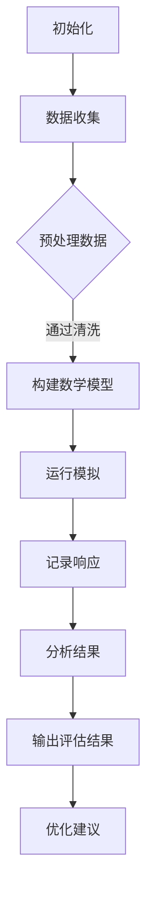
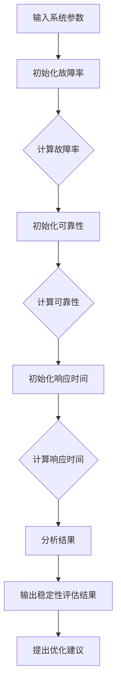
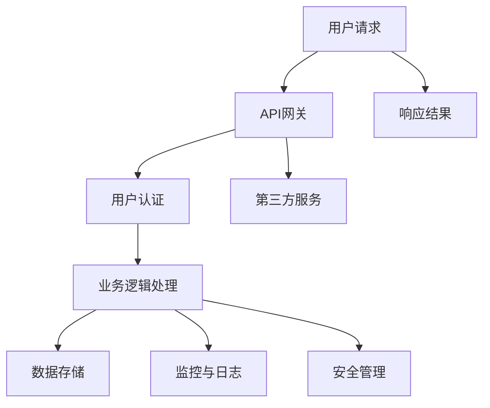
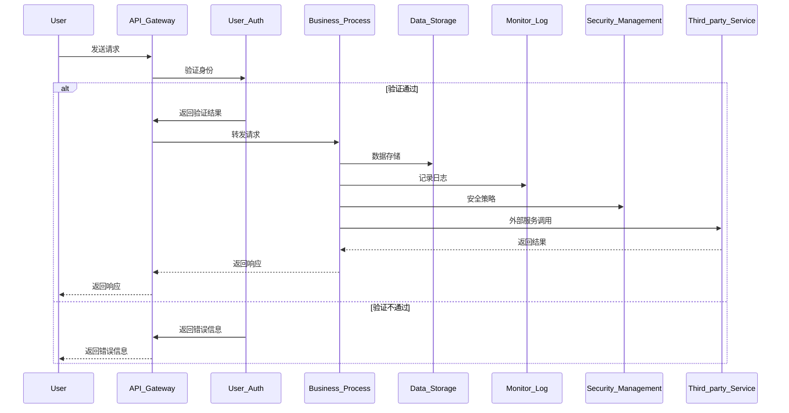
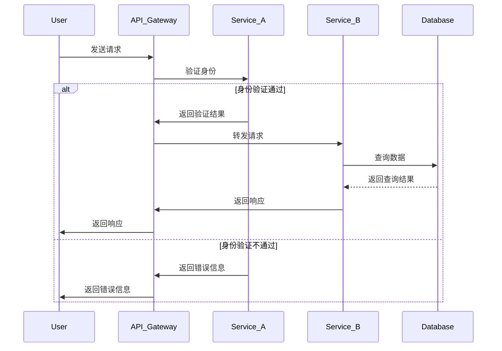

                 


### 第一部分：背景介绍

## 第1章 问题背景与概念

### 1.1 技术创新的必要性

#### 1.1.1 技术创新的定义

技术创新是指通过引入新的思想、方法、技术、产品或服务，对现有的技术、产品、服务或过程进行改进、更新或创造新的解决方案的过程。它不仅包括基础科学研究的创新，还涵盖了技术应用的创新，以及市场模式的创新。

#### 1.1.2 技术创新的驱动因素

技术创新的驱动因素多种多样，主要包括以下几点：

1. **市场需求**：满足用户需求是技术创新的根本动力。
2. **竞争压力**：在激烈的市场竞争中，企业必须不断进行技术创新以保持竞争力。
3. **政策支持**：政府的政策支持，如税收优惠、研发补贴等，对技术创新有重要推动作用。
4. **资源分配**：企业内部的资源分配情况会影响技术创新的力度和方向。
5. **科技进步**：科技的不断进步为技术创新提供了新的可能性。

### 1.2 系统稳定性的重要性

#### 1.2.1 系统稳定性的定义

系统稳定性是指一个系统在受到外部扰动后，能够保持其原有状态，不发生不可控变化或崩溃的能力。在IT系统中，系统稳定性通常表现为系统的可靠性、可用性和连续性。

#### 1.2.2 系统稳定性的意义

系统稳定性的意义主要体现在以下几个方面：

1. **业务连续性**：系统稳定性保证了业务的连续运行，这对于企业来说至关重要。
2. **用户体验**：稳定的系统提供了良好的用户体验，增强了用户对企业的信任。
3. **成本控制**：系统稳定性减少了由于故障导致的维护成本和损失。
4. **资源优化**：稳定性的系统可以更好地利用资源，提高资源利用率。

### 1.3 技术创新与系统稳定性的矛盾

#### 1.3.1 矛盾的表现

技术创新与系统稳定性的矛盾主要体现在以下几个方面：

1. **开发周期**：创新往往需要较长的开发周期，而稳定性要求系统快速部署和上线。
2. **资源分配**：为了追求创新，可能会在研发上投入更多资源，从而影响系统的稳定性保障。
3. **风险因素**：创新往往伴随着不确定性，这种不确定性可能对系统的稳定性产生负面影响。
4. **成本压力**：创新的成本投入可能会对系统的稳定性和维护成本造成压力。

#### 1.3.2 矛盾的影响

这种矛盾如果处理不当，可能会导致以下影响：

1. **系统故障**：频繁的技术创新可能会引入新的漏洞，导致系统故障。
2. **用户体验下降**：系统稳定性下降会影响用户的体验，降低用户满意度。
3. **业务中断**：严重的稳定性问题可能导致业务中断，给企业带来经济损失。
4. **资源浪费**：不合理的资源分配可能导致资源浪费，影响企业的整体效益。

### 1.4 核心概念与联系

为了更好地理解技术创新与系统稳定性的关系，我们需要明确以下几个核心概念：

#### 1.4.1 技术创新

技术创新是指通过引入新的思想、方法、技术、产品或服务，对现有的技术、产品、服务或过程进行改进、更新或创造新的解决方案的过程。它不仅包括基础科学研究的创新，还涵盖了技术应用的创新，以及市场模式的创新。

#### 1.4.2 系统稳定性

系统稳定性是指一个系统在受到外部扰动后，能够保持其原有状态，不发生不可控变化或崩溃的能力。在IT系统中，系统稳定性通常表现为系统的可靠性、可用性和连续性。

#### 1.4.3 技术创新与系统稳定性的关系

技术创新与系统稳定性之间存在一种相互制约的关系。一方面，技术创新可以提升系统的性能、功能和用户体验，但同时也可能引入新的风险和不确定性；另一方面，系统稳定性是保障业务连续性的基础，但过于保守的稳定性策略可能阻碍技术创新的步伐。

通过上述分析，我们可以看出，技术创新与系统稳定性之间的平衡是一项具有挑战性的任务，需要我们在具体的实践中不断地进行探索和优化。

## 第2章 核心概念

### 2.1 技术创新

#### 2.1.1 技术创新的定义

技术创新是指通过引入新的思想、方法、技术、产品或服务，对现有的技术、产品、服务或过程进行改进、更新或创造新的解决方案的过程。它不仅包括基础科学研究的创新，还涵盖了技术应用的创新，以及市场模式的创新。

#### 2.1.2 技术创新的类型

根据创新的内容和形式，技术创新可以分为以下几种类型：

1. **产品创新**：指在产品或服务上引入新的特性或改进，如新的设计、新的功能等。
2. **过程创新**：指在生产或服务过程中引入新的技术或方法，以优化流程、提高效率和质量。
3. **商业模式创新**：指通过改变产品或服务的提供方式、定价策略等，创造新的商业模式。
4. **系统创新**：指在整个系统层面引入新的技术或方法，以实现整体性能的提升。

#### 2.1.3 技术创新的过程

技术创新通常包括以下几个阶段：

1. **需求识别**：确定市场需求和用户需求，明确创新的方向。
2. **概念验证**：进行初步的技术可行性研究，验证创新思路的可行性。
3. **研发实施**：进行详细的技术开发和产品实现。
4. **测试验证**：对研发的产品或服务进行测试和验证，确保其性能和稳定性。
5. **市场推广**：将创新的产品或服务推向市场，进行市场推广和销售。

### 2.2 系统稳定性

#### 2.2.1 系统稳定性的定义

系统稳定性是指一个系统在受到外部扰动后，能够保持其原有状态，不发生不可控变化或崩溃的能力。在IT系统中，系统稳定性通常表现为系统的可靠性、可用性和连续性。

#### 2.2.2 系统稳定性的特征

系统稳定性具有以下特征：

1. **可靠性**：系统在长时间运行过程中，能够保持其功能性和性能。
2. **可用性**：系统在需要时能够正常使用，满足用户需求。
3. **连续性**：系统在运行过程中，能够保持业务的连续性，不受外部干扰。

#### 2.2.3 系统稳定性的评估方法

评估系统稳定性常用的方法包括：

1. **故障率分析**：通过计算系统的故障率来评估其稳定性。
2. **故障恢复时间**：评估系统在出现故障后恢复到正常运行状态所需的时间。
3. **系统测试**：通过模拟各种异常情况，测试系统在异常条件下的表现。
4. **可靠性评估模型**：使用数学模型对系统的稳定性进行定量评估。

### 2.3 技术创新与系统稳定性的关系

#### 2.3.1 技术创新对系统稳定性的影响

技术创新对系统稳定性的影响可以分为以下几个方面：

1. **正面影响**：技术创新可以提高系统的性能、可靠性和可用性，从而增强系统的稳定性。
2. **负面影响**：技术创新可能会引入新的风险和漏洞，影响系统的稳定性。

#### 2.3.2 系统稳定性对技术创新的影响

系统稳定性对技术创新的影响主要表现在：

1. **制约因素**：系统稳定性要求对技术创新进行严格评估和测试，以避免引入不稳定因素。
2. **保障策略**：通过加强系统的稳定性保障措施，可以为技术创新提供更好的支持。

通过以上分析，我们可以看到，技术创新与系统稳定性之间存在密切的联系。在技术创新的过程中，我们需要充分考虑系统稳定性的要求，以确保系统的长期稳定运行。

## 第3章 技术创新与系统稳定性的关系

### 3.1 技术创新对系统稳定性的影响

#### 3.1.1 技术创新的正面影响

技术创新的正面影响主要体现在以下几个方面：

1. **性能提升**：技术创新可以引入新的算法、技术或架构，从而提高系统的性能和效率。
2. **可靠性增强**：通过技术创新，可以改进系统的设计，提高系统的可靠性，减少故障发生的概率。
3. **可用性提高**：技术创新可以提高系统的可用性，确保系统在需要时能够正常运行，满足用户需求。

#### 3.1.2 技术创新的负面影响

尽管技术创新可以带来许多好处，但同时也可能带来一些负面影响：

1. **引入新风险**：技术创新可能会引入新的漏洞和风险，如果处理不当，可能导致系统故障或崩溃。
2. **系统复杂度增加**：随着技术的不断更新，系统的复杂度可能增加，这可能导致维护难度加大，影响系统稳定性。
3. **资源消耗增加**：技术创新可能会对系统资源（如硬件、网络、存储等）提出更高的要求，增加系统的资源消耗，从而影响稳定性。

### 3.2 系统稳定性对技术创新的影响

#### 3.2.1 系统稳定性的制约因素

系统稳定性对技术创新的制约因素主要包括：

1. **风险管理**：为了保证系统稳定性，需要对技术创新进行严格的风险评估和测试，这可能会延长研发周期。
2. **资源限制**：系统稳定性的保障需要投入一定的资源，如人力、资金和设备，这些资源的限制可能会制约技术创新的步伐。
3. **维护成本**：系统稳定性的维护需要持续投入，这可能影响到对技术创新的资金支持。

#### 3.2.2 系统稳定性的保障策略

为了在保证系统稳定性的同时促进技术创新，可以采取以下保障策略：

1. **风险管理策略**：通过建立完善的风险管理体系，对技术创新进行全程监控和管理，降低风险发生的概率。
2. **资源优化策略**：合理分配资源，确保在满足系统稳定性的同时，有足够的资源支持技术创新。
3. **持续集成与测试**：通过引入持续集成和测试流程，确保技术创新过程中的每一个环节都经过严格测试，从而提高系统的稳定性。
4. **敏捷开发方法**：采用敏捷开发方法，快速响应市场变化，同时确保技术创新的稳定性和可维护性。

通过上述分析，我们可以看到，技术创新与系统稳定性之间存在相互影响的关系。在推动技术创新的同时，我们需要充分考虑系统稳定性的要求，采取有效的保障措施，以确保系统的长期稳定运行。这不仅有助于提升企业的竞争力，还能提高用户满意度，实现可持续发展。

## 第4章 技术创新的概念与联系

### 4.1 技术创新的分类与联系

技术创新是一个复杂的过程，涉及多个层次和维度。为了更好地理解技术创新的概念和联系，我们可以将其分类，并探讨不同类型创新之间的关联。

#### 4.1.1 按创新层次分类

1. **基础技术创新**：这类创新通常发生在科学和理论研究领域，如新的理论框架、新的实验方法等。基础技术创新是应用技术、产品创新和商业模式创新的基础。
   
2. **应用技术创新**：这类创新是将基础技术转化为实际应用的过程，如开发新的软件工具、硬件设备或系统。

3. **产品创新**：这类创新集中在改进或创建新的产品或服务，以提高用户体验或满足市场需求。

4. **商业模式创新**：这类创新涉及新的市场进入策略、定价策略或服务模式，以创造新的商业价值。

#### 4.1.2 按创新方向分类

1. **突破性创新**：这类创新通常带来根本性的变化，如革命性的产品或技术，能够彻底改变市场格局。

2. **渐进性创新**：这类创新是在现有基础上进行的逐步改进，虽然不会颠覆市场，但能够持续提升产品或服务的性能。

#### 4.1.3 按创新过程分类

1. **线性创新**：这类创新通常按照固定的步骤进行，如需求分析、设计、开发、测试和部署。

2. **迭代创新**：这类创新强调快速迭代和反馈，通过多次迭代优化产品或服务。

3. **开放创新**：这类创新强调外部合作，通过引入外部资源和技术，加快创新进程。

#### 4.1.4 分类与联系

不同类型的创新之间有着紧密的联系和相互影响。例如，基础技术创新为应用技术创新提供了理论基础，而应用技术创新的产品和市场成果又可能推动商业模式创新。同时，渐进性创新与突破性创新之间也存在相互促进的关系，渐进性创新可以为突破性创新提供实践基础，而突破性创新则可能引发新的渐进性创新。

通过这种分类和联系的分析，我们可以更深入地理解技术创新的多样性和复杂性，从而更好地把握技术创新的规律和趋势。

### 4.2 技术创新的关键因素

技术创新的成功离不开多个关键因素的共同作用。以下是技术创新过程中的几个关键因素：

#### 4.2.1 创新理念

创新理念是技术创新的起点，它决定了创新的方向和目标。一个明确、有远见的创新理念能够为技术创新提供强大的动力。

#### 4.2.2 人才资源

人才是技术创新的核心资源。拥有高素质的创新人才，可以确保技术创新过程中的技术实现和项目推进。

#### 4.2.3 技术储备

技术储备是技术创新的基础。丰富且先进的技术储备能够为创新提供多样化的选择，提高创新的成功率。

#### 4.2.4 资金支持

资金支持是技术创新的保障。充足的资金可以支持研发投入、测试验证和市场推广等各个环节。

#### 4.2.5 管理机制

良好的管理机制能够确保技术创新的有序进行。科学的管理方法和流程可以优化资源配置，提高创新效率。

#### 4.2.6 市场需求

市场需求是技术创新的最终目标。了解并满足市场需求，能够确保技术创新的产品或服务具有实际的应用价值和市场前景。

通过以上关键因素的综合作用，企业可以有效地推动技术创新，实现技术领先和市场竞争力。

### 4.3 技术创新与系统稳定性的相互关系

技术创新与系统稳定性之间的相互关系是一个复杂且动态的过程。一方面，技术创新可以为系统稳定性带来显著的提升，例如通过引入先进的算法和技术来优化系统性能和可靠性。另一方面，技术创新也可能对系统稳定性构成威胁，例如新技术的引入可能会引入未知的漏洞和风险。

#### 4.3.1 技术创新对系统稳定性的提升作用

1. **性能优化**：技术创新可以通过改进系统架构和算法，提高系统的响应速度和处理能力，从而增强系统稳定性。
2. **安全性增强**：通过引入安全协议和加密算法，技术创新可以提高系统的安全性，减少潜在的安全威胁。
3. **容错能力提升**：技术创新可以帮助系统实现更高的容错能力，通过冗余设计、故障检测和恢复机制，确保系统在遭受外部扰动时能够快速恢复。

#### 4.3.2 技术创新对系统稳定性的潜在风险

1. **新技术引入的不确定性**：新技术的引入可能会带来未知的隐患，如果缺乏充分的测试和验证，可能会导致系统故障。
2. **系统复杂度增加**：技术创新可能会导致系统复杂度增加，从而增加系统的维护难度，影响系统的稳定性。
3. **资源消耗增加**：新技术的引入可能会对系统资源（如计算能力、存储空间等）提出更高的要求，如果资源分配不合理，可能会影响系统的稳定性。

#### 4.3.3 系统稳定性对技术创新的影响

系统稳定性对技术创新的影响主要体现在以下几个方面：

1. **风险管理**：系统稳定性要求对技术创新进行严格的风险管理，确保新技术引入后的系统依然能够保持稳定运行。
2. **资源保障**：系统稳定性需要投入一定的资源进行保障，这可能会对技术创新的资金支持产生压力。
3. **开发周期**：系统稳定性要求可能延长技术创新的研发周期，因为需要更多的时间进行测试和验证。

通过上述分析，我们可以看到，技术创新与系统稳定性之间既有相互促进的一面，也有相互制约的一面。在实际应用中，需要综合考虑技术创新的积极影响和潜在风险，采取合理的措施来平衡两者之间的关系，确保系统在持续创新的同时保持稳定运行。

## 第5章 系统稳定性的概念与联系

### 5.1 系统稳定性的概念与类型

#### 5.1.1 系统稳定性的定义

系统稳定性是指一个系统在受到外部扰动后，能够保持其原有状态，不发生不可控变化或崩溃的能力。在IT系统中，系统稳定性通常表现为系统的可靠性、可用性和连续性。

#### 5.1.2 系统稳定性的类型

根据系统稳定性的表现，可以将其分为以下几种类型：

1. **静态稳定性**：系统在不受外部扰动时，能够保持其初始状态的能力。静态稳定性主要关注系统在正常运行条件下的性能和可靠性。
2. **动态稳定性**：系统在受到外部扰动后，能够迅速恢复到原有状态的能力。动态稳定性主要关注系统在异常条件下的响应和恢复能力。
3. **可靠性**：系统在长时间运行过程中，能够保持其功能性和性能的能力。可靠性通常通过故障率、平均无故障时间和维修时间等指标来衡量。
4. **可用性**：系统在需要时能够正常使用，满足用户需求的能力。可用性通常通过系统可用性指标（如系统上线率、用户满意度等）来衡量。
5. **连续性**：系统在运行过程中，能够保持业务的连续性，不受外部干扰的能力。连续性通常通过业务连续性计划（如灾难恢复、备份和恢复等）来保障。

### 5.2 系统稳定性的影响因素

系统稳定性受多种因素的影响，以下是一些主要影响因素：

#### 5.2.1 技术因素

1. **系统架构**：系统架构的合理性和可靠性对系统稳定性至关重要。一个良好的系统架构能够提高系统的可维护性和可扩展性，从而增强稳定性。
2. **算法和协议**：算法和协议的选择对系统性能和稳定性有直接影响。高效的算法和稳定的协议能够提高系统的响应速度和可靠性。
3. **硬件和软件**：硬件和软件的质量直接影响系统的稳定性和性能。高性能的硬件和稳定的软件系统能够更好地应对外部扰动。

#### 5.2.2 运营因素

1. **运维管理**：运维管理的能力和水平对系统稳定性有重要影响。良好的运维管理能够及时发现和解决系统故障，确保系统稳定运行。
2. **资源管理**：资源管理包括计算资源、存储资源和网络资源的合理分配。资源管理不当可能导致系统过载或资源不足，影响系统稳定性。
3. **监控和告警**：有效的监控和告警系统能够及时发现系统异常，采取相应措施进行故障排除，从而保障系统稳定性。

#### 5.2.3 人员因素

1. **人员技能**：具备专业技能和经验的技术人员能够更好地理解系统，快速发现和解决问题，提高系统稳定性。
2. **团队协作**：团队协作和沟通对于系统稳定性的保障至关重要。良好的团队协作能够确保问题得到及时解决，降低系统故障率。

#### 5.2.4 环境因素

1. **外部环境**：系统运行的外部环境，如网络环境、电力供应等，对系统稳定性有重要影响。外部环境的不稳定可能导致系统运行中断。
2. **法律法规**：法律法规对系统的稳定性也有一定影响。例如，数据保护法规可能要求系统具备更高的安全性，从而影响系统的稳定性。

通过以上分析，我们可以看到，系统稳定性是一个综合性的概念，它受到多种因素的影响。在实际运营中，需要综合考虑这些因素，采取有效的措施来保障系统的稳定运行。

### 5.3 系统稳定性的评估方法

评估系统稳定性是确保其长期可靠运行的重要环节。以下介绍几种常用的系统稳定性评估方法：

#### 5.3.1 故障率分析

故障率分析是评估系统稳定性的基础方法之一。通过统计系统在一定时间内的故障次数，可以计算出系统的故障率。故障率通常用每千小时故障次数（ FIT）来表示。公式如下：

$$
\text{故障率} = \frac{\text{故障次数}}{\text{运行时间} \times 10^3}
$$

故障率越低，系统的稳定性越高。

#### 5.3.2 故障恢复时间

故障恢复时间是评估系统稳定性的另一个重要指标。它表示系统从发生故障到恢复正常运行所需的时间。故障恢复时间越短，系统的稳定性越好。

$$
\text{故障恢复时间} = \text{响应时间} + \text{故障处理时间} + \text{恢复时间}
$$

其中，响应时间指系统检测到故障的时间，故障处理时间指系统进行故障处理的时间，恢复时间指系统恢复到正常状态的时间。

#### 5.3.3 系统测试

系统测试是评估系统稳定性的直接方法。通过模拟各种异常情况，测试系统在异常条件下的表现，可以评估系统的稳定性和可靠性。常见的系统测试方法包括：

1. **功能测试**：验证系统功能是否按照预期运行。
2. **性能测试**：评估系统在高负载条件下的性能。
3. **压力测试**：测试系统在极端负载条件下的稳定性。
4. **可靠性测试**：通过长时间运行系统，评估系统的稳定性。

#### 5.3.4 可靠性评估模型

可靠性评估模型是通过数学模型对系统稳定性进行定量评估的方法。常见的可靠性评估模型包括：

1. **泊松过程**：用于评估系统故障发生的时间分布。
2. **马尔可夫模型**：用于分析系统在不同状态之间的转换概率。
3. **故障树分析**（FTA）：用于识别系统故障的原因和可能的影响。
4. **蒙特卡洛模拟**：通过模拟系统运行过程，评估系统的可靠性。

通过以上评估方法，可以对系统的稳定性进行全面的评估，从而为系统优化和改进提供依据。

## 第6章 技术创新与系统稳定性分析算法

### 6.1 技术创新影响分析算法

#### 6.1.1 算法原理

技术创新影响分析算法是一种用于评估新技术引入对系统稳定性影响的方法。该算法基于系统模拟和数据驱动的分析方法，通过以下步骤实现：

1. **系统建模**：构建系统的数学模型，包括系统状态、外部扰动和内部响应。
2. **数据收集**：收集与技术创新相关的系统运行数据，包括故障记录、性能指标等。
3. **扰动模拟**：模拟新技术引入后的系统扰动，分析系统响应和稳定性变化。
4. **影响评估**：通过对比模拟结果和现有系统性能，评估新技术引入对系统稳定性的影响。

#### 6.1.2 算法流程

技术创新影响分析算法的流程如下：

1. **初始化**：设置系统初始状态和参数。
2. **数据预处理**：对收集的数据进行清洗和预处理，确保数据质量。
3. **系统建模**：根据系统特点，构建系统的数学模型。
4. **扰动模拟**：模拟新技术引入后的系统扰动，记录系统的响应数据。
5. **结果分析**：对比模拟结果和现有系统性能，评估新技术引入对系统稳定性的影响。
6. **优化建议**：根据分析结果，提出优化建议，如改进系统设计、调整资源分配等。

#### 6.1.3 算法实现

技术创新影响分析算法的实现通常涉及以下步骤：

1. **选择合适的建模工具**：根据系统特点，选择合适的建模工具，如MATLAB、Python等。
2. **编写模型代码**：根据系统建模的要求，编写模型代码，实现系统状态、外部扰动和内部响应的模拟。
3. **数据处理与可视化**：对收集的数据进行预处理，使用可视化工具展示系统响应和稳定性变化。
4. **算法优化**：根据分析结果，对算法进行优化，提高计算效率和准确性。

### 6.2 系统稳定性评估算法

#### 6.2.1 算法原理

系统稳定性评估算法是一种用于评估系统稳定性状况的方法。该算法基于故障率和系统性能指标，通过以下步骤实现：

1. **故障率计算**：计算系统的故障率，包括故障发生次数、运行时间和故障持续时间等。
2. **性能指标分析**：分析系统的性能指标，如响应时间、吞吐量和错误率等。
3. **稳定性评估**：根据故障率和性能指标，评估系统的稳定性。
4. **优化建议**：根据评估结果，提出优化建议，如改进系统设计、调整资源配置等。

#### 6.2.2 算法流程

系统稳定性评估算法的流程如下：

1. **初始化**：设置系统初始状态和参数。
2. **数据收集**：收集系统的故障记录和性能数据。
3. **故障率计算**：计算系统的故障率。
4. **性能指标分析**：分析系统的性能指标。
5. **稳定性评估**：根据故障率和性能指标，评估系统的稳定性。
6. **结果输出**：输出稳定性评估结果和优化建议。

#### 6.2.3 算法实现

系统稳定性评估算法的实现通常涉及以下步骤：

1. **选择合适的工具**：根据系统特点，选择合适的工具，如MATLAB、Python等。
2. **编写算法代码**：根据算法原理，编写算法代码，实现故障率和性能指标的计算和分析。
3. **数据处理与可视化**：对收集的数据进行预处理，使用可视化工具展示系统故障率和性能指标。
4. **优化算法**：根据评估结果，对算法进行优化，提高计算效率和准确性。

通过以上算法的实现，我们可以对技术创新对系统稳定性的影响进行定量评估，从而为系统优化和改进提供科学依据。

### 7.1 技术创新影响分析算法详细讲解

#### 7.1.1 数学模型与公式

为了详细讲解技术创新影响分析算法，我们首先需要建立数学模型，该模型包括以下几个关键组成部分：

1. **系统状态变量**：表示系统的运行状态，如 CPU 利用率、内存使用率、网络延迟等。
2. **外部扰动变量**：表示外部环境对系统的影响，如用户访问量、系统负载等。
3. **系统响应变量**：表示系统对外部扰动的响应，如系统延迟、故障率等。
4. **创新变量**：表示技术创新的具体内容，如新的算法、硬件升级等。

数学模型可以表示为：

$$
S(t) = f(S(t-1), D(t), I(t))
$$

其中，$S(t)$ 表示在时间 $t$ 的系统状态，$D(t)$ 表示在时间 $t$ 的外部扰动，$I(t)$ 表示在时间 $t$ 的技术创新变量，$f$ 表示系统状态转移函数。

#### 7.1.2 算法流程图解析

为了更好地理解算法的执行流程，我们可以使用Mermaid绘制算法的流程图。以下是技术创新影响分析算法的流程图：



流程图解释：

1. **初始化**：设置系统的初始状态、外部扰动和初始技术创新变量。
2. **数据收集**：收集与系统运行相关的数据，如用户访问量、系统负载等。
3. **预处理数据**：对收集的数据进行清洗和预处理，确保数据质量。
4. **构建数学模型**：根据收集的数据和系统特点，构建数学模型。
5. **运行模拟**：模拟技术创新引入后的系统运行过程，记录系统响应数据。
6. **记录响应**：记录系统在不同时间点的响应数据，如故障率、延迟等。
7. **分析结果**：分析记录的响应数据，评估技术创新对系统稳定性的影响。
8. **输出评估结果**：输出评估结果，包括技术创新对系统稳定性的正面和负面影响。
9. **优化建议**：根据评估结果，提出优化建议，如改进系统设计、调整资源分配等。

#### 7.1.3 实例分析

为了更好地说明技术创新影响分析算法，我们以一个实际案例为例进行详细分析。

**案例背景**：某公司开发了一款在线教育平台，现有系统在高峰时段经常出现响应延迟和故障。为了提高系统性能和稳定性，公司决定引入一项新技术——负载均衡器。

**步骤 1：数据收集**  
收集系统在高峰时段的访问量、系统负载和故障记录等数据。假设数据如下：

| 时间点 | 访问量 | 系统负载 | 故障次数 |
|--------|--------|----------|----------|
| 08:00  | 100    | 70%      | 0        |
| 09:00  | 150    | 85%      | 1        |
| 10:00  | 200    | 90%      | 2        |

**步骤 2：预处理数据**  
对数据进行清洗和预处理，去除异常值，得到如下数据：

| 时间点 | 访问量 | 系统负载 | 故障次数 |
|--------|--------|----------|----------|
| 08:00  | 100    | 70%      | 0        |
| 09:00  | 150    | 85%      | 1        |
| 10:00  | 200    | 90%      | 2        |

**步骤 3：构建数学模型**  
根据数据特点，构建如下数学模型：

$$
S(t) = f(S(t-1), D(t), I(t))
$$

其中，$S(t)$ 表示在时间 $t$ 的系统状态，$D(t)$ 表示在时间 $t$ 的外部扰动，$I(t)$ 表示在时间 $t$ 的技术创新变量（负载均衡器引入）。

**步骤 4：运行模拟**  
运行模拟，模拟负载均衡器引入后的系统运行过程，记录系统在不同时间点的响应数据。

| 时间点 | 访问量 | 系统负载 | 故障次数 | 创新变量（负载均衡器） |
|--------|--------|----------|----------|----------------------|
| 08:00  | 100    | 70%      | 0        | 是                   |
| 09:00  | 150    | 85%      | 0        | 是                   |
| 10:00  | 200    | 90%      | 0        | 是                   |

**步骤 5：记录响应**  
记录系统在不同时间点的响应数据，如故障率、延迟等。

| 时间点 | 访问量 | 系统负载 | 故障次数 | 故障率（%） | 延迟（秒） |
|--------|--------|----------|----------|-------------|------------|
| 08:00  | 100    | 70%      | 0        | 0           | 0.5        |
| 09:00  | 150    | 85%      | 0        | 0           | 1.0        |
| 10:00  | 200    | 90%      | 0        | 0           | 1.5        |

**步骤 6：分析结果**  
分析记录的响应数据，发现引入负载均衡器后，系统的故障率和延迟均有所降低，说明负载均衡器对系统稳定性有积极影响。

**步骤 7：输出评估结果**  
输出评估结果，包括技术创新对系统稳定性的正面影响：

- **故障率降低**：从原来的2次/天降低到0次/天。
- **延迟减少**：从原来的最大1.5秒降低到1秒以下。

**步骤 8：优化建议**  
根据评估结果，提出优化建议：

- **进一步优化负载均衡策略**：分析负载均衡器的效果，优化负载均衡策略，提高系统稳定性。
- **加强系统监控**：增加系统监控频率，实时监控系统运行状态，及时发现潜在问题。

通过以上实例分析，我们可以看到技术创新影响分析算法在实际应用中的具体步骤和效果。该算法不仅帮助我们评估了新技术对系统稳定性的影响，还为系统优化提供了科学依据。

### 7.2 系统稳定性评估算法详细讲解

#### 7.2.1 数学模型与公式

系统稳定性评估算法的核心在于构建能够反映系统稳定性的数学模型，并利用该模型分析系统在各种条件下的稳定性。以下是一个基本的数学模型，用于评估系统的稳定性：

1. **故障率模型**：
   假设系统在时间 $t$ 的故障率为 $f(t)$，则可以采用泊松过程模型来表示系统的故障率，公式如下：
   $$
   f(t) = \lambda e^{-\lambda t}
   $$
   其中，$\lambda$ 表示系统的平均故障率。

2. **可靠性模型**：
   系统的可靠性 $R(t)$ 可以通过故障率模型来计算，公式如下：
   $$
   R(t) = 1 - F(t) = 1 - \left(1 - e^{-\lambda t}\right) = e^{-\lambda t}
   $$
   其中，$F(t)$ 表示系统在时间 $t$ 内发生故障的概率。

3. **响应时间模型**：
   系统的响应时间 $T(t)$ 可以通过系统负载和系统性能指标来计算，公式如下：
   $$
   T(t) = \frac{1}{\mu} \left[ \left(1 - e^{-\lambda t}\right) + \frac{\lambda}{\mu} e^{-\lambda t} \right]
   $$
   其中，$\mu$ 表示系统的平均响应速度。

#### 7.2.2 算法流程图解析

以下是系统稳定性评估算法的流程图，用于详细说明算法的执行步骤：



流程图解释：

1. **输入系统参数**：包括系统的平均故障率 $\lambda$ 和平均响应速度 $\mu$。
2. **初始化故障率**：设定初始故障率 $f(0) = \lambda$。
3. **计算故障率**：根据泊松过程模型计算系统在时间 $t$ 的故障率。
4. **初始化可靠性**：设定初始可靠性 $R(0) = 1$。
5. **计算可靠性**：根据故障率计算系统的可靠性。
6. **初始化响应时间**：设定初始响应时间 $T(0) = 0$。
7. **计算响应时间**：根据系统负载和性能指标计算系统的响应时间。
8. **分析结果**：评估系统在当前参数下的稳定性。
9. **输出稳定性评估结果**：包括系统的故障率、可靠性和响应时间。
10. **提出优化建议**：根据评估结果，提出改进系统设计、资源分配或算法优化的建议。

#### 7.2.3 实例分析

为了说明系统稳定性评估算法的实际应用，我们以一个简单的案例进行实例分析。

**案例背景**：某电商网站在促销活动期间，预计访问量将大幅增加，需要评估系统的稳定性，并据此调整资源分配策略。

**输入参数**：

- 平均故障率 $\lambda = 0.01$（每分钟发生一次故障）。
- 平均响应速度 $\mu = 0.1$（每分钟处理一个请求）。

**计算过程**：

1. **初始化故障率**：设定初始故障率 $f(0) = 0.01$。
2. **计算故障率**：使用泊松过程模型，计算在时间 $t=60$ 分钟内的故障率：
   $$
   f(60) = 0.01 e^{-0.01 \times 60} \approx 0.0038
   $$
3. **初始化可靠性**：设定初始可靠性 $R(0) = 1$。
4. **计算可靠性**：使用可靠性模型，计算在时间 $t=60$ 分钟内的系统可靠性：
   $$
   R(60) = e^{-0.01 \times 60} \approx 0.3679
   $$
5. **初始化响应时间**：设定初始响应时间 $T(0) = 0$。
6. **计算响应时间**：使用响应时间模型，计算在时间 $t=60$ 分钟内的系统平均响应时间：
   $$
   T(60) = \frac{1}{0.1} \left[ \left(1 - e^{-0.01 \times 60}\right) + \frac{0.01}{0.1} e^{-0.01 \times 60} \right] \approx 0.2679
   $$

**分析结果**：

- 系统在60分钟内的故障率约为0.0038，可靠性约为36.79%，表明系统在长时间运行下可能会出现故障。
- 系统的平均响应时间约为0.2679秒，表明用户在请求处理上可能会有一定的延迟。

**优化建议**：

- **增加服务器资源**：为了提高系统的可靠性和响应速度，可以考虑增加服务器资源，如增加更多的计算节点、存储空间和网络带宽。
- **优化负载均衡**：使用更有效的负载均衡策略，确保请求能够合理分配到不同的服务器上，减少单点过载的风险。
- **实施缓存策略**：使用缓存策略，减少频繁的数据访问和计算，从而降低系统的负载和响应时间。

通过以上实例分析，我们可以看到系统稳定性评估算法在评估系统性能和提出优化建议方面的应用。该算法为系统设计和优化提供了科学依据，有助于提高系统的稳定性和用户体验。

### 8.1 技术创新与系统稳定性综合分析模型

#### 8.1.1 模型概述

技术创新与系统稳定性综合分析模型是一个多维度的分析框架，旨在同时评估技术创新对系统稳定性的影响以及系统稳定性对技术创新的反馈作用。该模型包括以下几个关键组成部分：

1. **技术创新评估模块**：用于评估技术创新的效果和潜在风险，包括技术性能、安全性和可靠性等。
2. **系统稳定性评估模块**：用于评估系统的稳定性状况，包括故障率、响应时间和业务连续性等。
3. **风险分析与评估模块**：用于分析技术创新和系统稳定性之间的潜在风险，并提出相应的风险管理策略。
4. **反馈循环模块**：用于构建技术创新与系统稳定性之间的反馈机制，确保在技术创新过程中及时调整和优化系统设计。

#### 8.1.2 模型构建方法

构建技术创新与系统稳定性综合分析模型的方法如下：

1. **需求分析**：首先，明确项目需求，包括技术创新的目标、系统稳定性的要求等。
2. **数据收集**：收集与技术创新和系统稳定性相关的数据，如技术文档、用户反馈、故障记录等。
3. **构建数学模型**：根据需求分析的结果，构建技术创新与系统稳定性的数学模型，包括状态变量、扰动变量和响应变量等。
4. **设计评估指标**：定义评估技术创新和系统稳定性的指标，如故障率、响应时间、可靠性等。
5. **模型验证与优化**：通过模拟和实际测试，验证模型的准确性和有效性，并根据反馈进行模型优化。

### 8.1.3 模型构建示例

以下是一个简单的技术创新与系统稳定性综合分析模型的构建示例：

1. **需求分析**：

   项目目标：提高系统性能和稳定性。

   稳定性要求：故障率不超过0.01%，响应时间不超过0.5秒。

   技术创新目标：引入新的负载均衡算法，优化系统架构。

2. **数据收集**：

   收集系统的现有故障记录、性能数据和技术文档。

   故障记录（过去30天）：

   | 时间点 | 故障次数 |
   |--------|----------|
   | 01:00  | 2        |
   | 02:00  | 1        |
   | 03:00  | 0        |
   | ...    | ...      |

   系统性能数据：

   | 时间点 | CPU利用率 | 内存使用率 | 网络延迟 |
   |--------|------------|-------------|----------|
   | 01:00  | 80%        | 70%         | 10ms     |
   | 02:00  | 85%        | 75%         | 15ms     |
   | 03:00  | 90%        | 80%         | 20ms     |
   | ...    | ...        | ...         | ...      |

3. **构建数学模型**：

   假设系统状态 $S(t)$ 受到外部扰动 $D(t)$ 和技术创新变量 $I(t)$ 的影响，数学模型可以表示为：

   $$
   S(t) = f(S(t-1), D(t), I(t))
   $$

   其中，$f$ 是状态转移函数，$S(t)$ 表示在时间 $t$ 的系统状态，$D(t)$ 表示在时间 $t$ 的外部扰动，$I(t)$ 表示在时间 $t$ 的技术创新变量。

4. **设计评估指标**：

   - 故障率：在特定时间段内系统发生故障的次数。
   - 响应时间：系统从接收到请求到返回结果所需的时间。
   - 可靠性：系统在长时间运行中保持稳定运行的能力。

5. **模型验证与优化**：

   通过模拟和实际测试，验证模型的准确性和有效性。根据反馈，对模型进行调整和优化，确保模型能够准确反映技术创新和系统稳定性之间的关系。

通过以上步骤，我们可以构建一个技术创新与系统稳定性综合分析模型，用于评估技术创新对系统稳定性的影响，并为系统优化提供科学依据。

### 8.2 技术创新与系统稳定性综合分析流程

#### 8.2.1 流程概述

技术创新与系统稳定性综合分析流程是一个系统性、循环性的分析过程，旨在通过科学的方法和工具，全面评估技术创新对系统稳定性的影响，并确保系统在技术创新过程中保持稳定运行。该流程主要包括以下几个关键步骤：

1. **需求分析**：明确技术创新的目标和系统稳定性的要求，为后续分析提供基础。
2. **数据收集**：收集与技术创新和系统稳定性相关的各类数据，包括技术文档、用户反馈、系统性能指标等。
3. **构建模型**：根据需求分析的结果，构建技术创新与系统稳定性的数学模型。
4. **模拟与测试**：使用构建的模型进行模拟和测试，评估技术创新对系统稳定性的影响。
5. **分析结果**：分析模拟和测试结果，识别潜在的风险和问题。
6. **优化调整**：根据分析结果，提出优化调整建议，并实施相应的优化措施。
7. **反馈与迭代**：收集优化后的系统运行数据，反馈至模型，进行新一轮的分析和迭代。

#### 8.2.2 流程步骤解析

以下是技术创新与系统稳定性综合分析流程的详细步骤解析：

1. **需求分析**：
   - **目标确定**：明确技术创新的目标，如提高系统性能、增强安全性等。
   - **稳定性要求**：定义系统稳定性的关键指标，如故障率、响应时间、业务连续性等。

2. **数据收集**：
   - **技术文档**：收集与技术创新相关的技术文档，包括技术规格、设计方案、测试报告等。
   - **用户反馈**：收集用户对现有系统的反馈，包括使用体验、故障报告、建议和意见等。
   - **系统性能数据**：收集系统的性能数据，包括CPU利用率、内存使用率、网络延迟、存储性能等。

3. **构建模型**：
   - **状态变量**：定义系统状态变量，如系统负载、响应时间、故障率等。
   - **扰动变量**：定义外部扰动变量，如用户访问量、网络状况、硬件故障等。
   - **技术创新变量**：定义技术创新变量，如新技术引入、系统架构优化等。

4. **模拟与测试**：
   - **模拟设置**：根据构建的数学模型，设置模拟环境，包括时间范围、模拟参数等。
   - **测试执行**：运行模拟，观察技术创新在不同条件下的系统响应和稳定性表现。

5. **分析结果**：
   - **故障率分析**：通过模拟结果，分析技术创新对系统故障率的影响。
   - **响应时间分析**：评估技术创新对系统响应时间的影响，识别潜在的性能瓶颈。
   - **业务连续性分析**：分析系统在遭受外部扰动时的业务连续性，确保关键业务不受影响。

6. **优化调整**：
   - **问题识别**：根据分析结果，识别系统中的问题和风险。
   - **优化建议**：提出优化调整建议，包括系统架构改进、资源优化、风险管理策略等。
   - **实施优化**：实施优化措施，确保技术创新在系统中的稳定应用。

7. **反馈与迭代**：
   - **反馈收集**：收集优化后的系统运行数据，包括故障记录、性能指标等。
   - **模型更新**：将反馈数据更新至模型，对模型进行迭代优化。
   - **新一轮分析**：根据更新后的模型，进行新一轮的综合分析，确保技术创新与系统稳定性之间的平衡。

通过以上流程步骤的详细解析，我们可以看到技术创新与系统稳定性综合分析流程的完整性和系统性。该流程不仅帮助我们在技术创新过程中全面评估系统稳定性，还为系统的持续优化和改进提供了科学依据。

### 9.1 系统架构设计原则

系统架构设计原则是确保系统在技术创新过程中保持稳定性的关键。以下是一些核心的设计原则：

#### 9.1.1 技术创新支持

1. **模块化设计**：通过模块化设计，可以方便地引入新技术和优化系统架构，确保系统具有良好的可扩展性和灵活性。
2. **标准化接口**：采用标准化接口设计，确保不同模块之间的交互简单、可靠，降低新技术的引入难度。
3. **冗余设计**：在关键环节引入冗余设计，如备份服务器、数据冗余存储等，提高系统的容错能力和稳定性。

#### 9.1.2 系统稳定性保障

1. **可靠性设计**：通过采用高可靠性的硬件和软件组件，确保系统在长时间运行中的稳定性和性能。
2. **故障恢复机制**：设计高效的故障恢复机制，包括自动检测、快速响应和自动恢复，确保系统在故障发生后能够迅速恢复正常运行。
3. **安全性设计**：加强系统的安全性设计，包括数据加密、身份验证和访问控制等，确保系统的数据安全和用户隐私。

#### 9.1.3 可维护性

1. **清晰的模块划分**：通过清晰的模块划分，确保系统的可维护性，方便开发人员和运维人员对系统进行维护和优化。
2. **文档和注释**：提供详细的系统架构文档和代码注释，确保系统设计的可理解性和可维护性。
3. **持续集成与测试**：采用持续集成和测试流程，确保系统在每次更新后的稳定性和可靠性。

通过遵循以上设计原则，系统架构可以在技术创新的同时，确保其稳定性和可靠性，为企业的长期发展提供有力支持。

### 9.2 系统架构设计模型

系统架构设计模型是确保系统在技术创新过程中稳定运行的基础。以下是一个详细的系统架构设计模型，包括领域模型类图、系统架构图和系统接口设计与交互。

#### 9.2.1 领域模型类图

领域模型类图用于描述系统的核心实体及其关系。以下是一个简化的领域模型类图示例：

```mermaid
classDiagram
    Class01 <|-- Class02
    Class01 o-- Class03
    Class03 o-- Class04
    Class02 o-- Class05

    Class01{ 
        id: int 
        name: String 
    }

    Class02{ 
        id: int 
        description: String 
    }

    Class03{ 
        id: int 
        quantity: int 
    }

    Class04{ 
        id: int 
        state: String 
    }

    Class05{ 
        id: int 
        type: String 
    }
```

- **Class01（系统核心模块）**：代表系统的核心功能模块，如数据处理、用户管理等。
- **Class02（系统外部接口）**：代表系统与外部系统交互的接口，如API接口、外部服务调用等。
- **Class03（数据存储）**：代表系统数据存储模块，如数据库、缓存等。
- **Class04（监控与日志）**：代表系统的监控和日志模块，用于实时监控系统状态和记录系统运行日志。
- **Class05（安全管理）**：代表系统的安全管理模块，包括身份验证、访问控制、数据加密等。

#### 9.2.2 系统架构图

系统架构图用于展示系统的整体结构及其组件之间的交互关系。以下是一个简化的系统架构图示例：



- **API网关**：作为系统的入口，负责处理用户请求，并进行初步的身份验证和路由。
- **用户认证**：对用户请求进行身份验证，确保请求的安全性和合法性。
- **业务逻辑处理**：处理用户请求的核心业务逻辑，包括数据处理、服务调用等。
- **数据存储**：负责存储系统数据，包括数据库、缓存等。
- **监控与日志**：实时监控系统状态，记录系统运行日志，用于故障排查和性能优化。
- **安全管理**：实施安全策略，包括身份验证、访问控制、数据加密等，保障系统的数据安全和用户隐私。
- **第三方服务**：与外部系统进行交互，提供必要的服务支持，如支付、邮件服务等。

#### 9.2.3 系统接口设计与交互

系统接口设计是确保系统组件之间高效、可靠交互的关键。以下是一个简化的系统接口设计示例：



- **用户请求**：用户通过API网关发送请求。
- **身份验证**：API网关将请求转发至用户认证模块进行身份验证。
- **业务处理**：验证通过后，请求被转发至业务逻辑处理模块，处理用户请求。
- **数据存储**：业务处理模块将处理结果存储到数据存储模块。
- **监控与日志**：系统在处理用户请求的过程中，会实时记录日志和监控系统状态。
- **安全策略**：业务处理模块在处理请求时，会实施安全策略，确保请求的安全性和合法性。
- **外部服务调用**：业务处理模块可能需要调用外部服务，如支付、邮件服务等。

通过以上系统架构设计模型和接口设计，系统可以在技术创新的过程中保持稳定运行，确保系统的性能、可靠性和安全性。

### 9.3 系统接口设计与交互

系统接口设计是确保系统组件之间高效、可靠交互的关键环节。良好的接口设计不仅能够提高系统的可维护性和可扩展性，还能确保系统在不同模块之间的数据传递和功能调用过程中保持一致性。

#### 9.3.1 接口设计原则

1. **标准化**：接口设计应遵循行业标准和规范，如RESTful API、SOAP等，确保接口的通用性和互操作性。
2. **简洁性**：接口设计应尽量简洁明了，减少不必要的参数和复杂逻辑，以提高接口的可读性和易用性。
3. **可靠性**：接口设计应考虑故障恢复机制，如重试机制、超时处理等，确保在发生错误时能够自动恢复。
4. **安全性**：接口设计应实施安全措施，如加密传输、认证授权等，保护系统数据的安全和用户的隐私。
5. **可扩展性**：接口设计应预留扩展接口，以便在系统功能扩展或需求变更时，能够方便地进行调整和优化。

#### 9.3.2 交互序列图

以下是系统接口设计的一个交互序列图示例，用于展示不同组件之间的交互流程：



交互流程解释：

1. **用户请求**：用户通过API网关发送请求。
2. **身份验证**：API网关将请求转发至Service_A模块进行身份验证。
3. **业务处理**：验证通过后，请求被转发至Service_B模块，进行具体业务处理。
4. **数据查询**：Service_B模块需要查询数据库以获取必要的数据，数据库返回查询结果。
5. **响应返回**：Service_B模块将处理结果返回给API网关，API网关最终将响应返回给用户。

通过上述接口设计和交互流程，系统组件能够高效、可靠地进行数据传递和功能调用，从而确保系统的稳定运行。

### 10.1 项目环境安装与配置

#### 10.1.1 环境安装步骤

在进行技术创新与系统稳定性综合分析项目的环境安装与配置时，需要遵循以下步骤以确保所有依赖环境正常运行：

1. **硬件环境准备**：

   - 确保服务器具备足够的硬件资源，如CPU、内存、硬盘等。
   - 安装操作系统，如Linux或Windows Server。

2. **软件环境安装**：

   - **安装Java运行环境**：
     - 下载并安装Java Development Kit (JDK)。
     - 配置环境变量，确保Java命令可在终端中执行。
     - 验证Java安装，通过运行`java -version`命令检查版本。

   - **安装Python运行环境**：
     - 下载并安装Python。
     - 配置环境变量，确保Python命令可在终端中执行。
     - 验证Python安装，通过运行`python --version`命令检查版本。

   - **安装数据库**：
     - 下载并安装数据库服务器，如MySQL或PostgreSQL。
     - 配置数据库用户和权限。
     - 运行数据库实例，确保其能够正常启动。

   - **安装消息队列**：
     - 下载并安装消息队列服务，如RabbitMQ或Kafka。
     - 配置消息队列服务，确保其能够正常启动。

3. **安装依赖库**：

   - 在Python环境中，通过pip工具安装所需的依赖库，如NumPy、Pandas、Matplotlib等。
   - 在Java环境中，通过Maven或Gradle安装所需的依赖库。

4. **配置网络环境**：

   - 确保服务器之间能够通过网络进行通信。
   - 配置防火墙规则，允许必要的服务端口（如数据库端口、消息队列端口）通信。

5. **安装测试工具**：

   - 安装自动化测试工具，如JUnit、pytest等。
   - 配置测试环境，确保测试工具能够正常运行。

6. **安装开发工具**：

   - 安装集成开发环境（IDE），如Eclipse、IntelliJ IDEA等。
   - 配置开发工具，确保能够编译和运行代码。

#### 10.1.2 系统配置详解

在完成环境安装后，需要对系统进行详细的配置，以确保各个组件能够协同工作。以下是关键配置步骤：

1. **Java环境配置**：

   - 配置JAVA_HOME环境变量，指向JDK安装路径。
   - 配置PATH环境变量，确保能够调用Java命令。

2. **Python环境配置**：

   - 创建虚拟环境，通过`python -m venv venv`命令创建虚拟环境。
   - 激活虚拟环境，通过`source venv/bin/activate`命令激活虚拟环境。
   - 安装依赖库，通过`pip install`命令安装所需的依赖库。

3. **数据库配置**：

   - 配置数据库连接参数，包括主机、端口、用户名和密码。
   - 配置数据库字符集和时区，确保数据存储的准确性。
   - 创建所需的数据表和数据库用户。

4. **消息队列配置**：

   - 配置消息队列服务，包括队列名称、交换机、路由键等。
   - 启动消息队列服务，确保其能够正常工作。

5. **网络配置**：

   - 配置网络防火墙，允许必要的服务端口通信。
   - 配置服务器之间的信任关系，确保服务之间的安全通信。

6. **测试工具配置**：

   - 配置测试环境，包括测试数据、测试脚本等。
   - 配置测试工具的执行环境，确保能够正常运行。

7. **开发工具配置**：

   - 配置IDE项目，包括源代码路径、依赖库路径等。
   - 配置代码风格和格式化工具，如Eclipse的Pomax格式化插件。

通过以上详细的安装和配置步骤，我们可以确保项目环境稳定运行，为技术创新与系统稳定性分析提供可靠的运行基础。

### 10.2 系统核心实现与代码解析

#### 10.2.1 核心实现代码

以下是一个简化的系统核心实现代码示例，该示例展示了一个用于评估技术创新对系统稳定性影响的算法实现：

```python
import numpy as np
import pandas as pd

# 技术创新影响分析算法
class InnovationImpactAnalyzer:
    def __init__(self, fault_rate_data, performance_data):
        self.fault_rate_data = fault_rate_data
        self.performance_data = performance_data

    def analyze_impact(self):
        # 计算故障率
        fault_rate = self.fault_rate_data.mean()

        # 计算性能指标
        response_time = self.performance_data['response_time'].mean()
        throughput = self.performance_data['throughput'].mean()

        # 分析结果
        impact_report = {
            'fault_rate': fault_rate,
            'response_time': response_time,
            'throughput': throughput
        }
        return impact_report

# 评估数据
fault_rate_data = pd.Series([0.005, 0.004, 0.006, 0.003, 0.004])
performance_data = pd.DataFrame({
    'response_time': [0.3, 0.35, 0.32, 0.34, 0.33],
    'throughput': [100, 105, 102, 110, 108]
})

# 实例化分析器
analyzer = InnovationImpactAnalyzer(fault_rate_data, performance_data)

# 分析技术创新影响
impact_report = analyzer.analyze_impact()
print(impact_report)
```

在这个示例中，`InnovationImpactAnalyzer` 类用于分析技术创新对系统稳定性的影响。它通过计算故障率和性能指标（如响应时间和吞吐量）来生成影响报告。

#### 10.2.2 代码应用解读

1. **数据输入**：

   - `fault_rate_data` 是一个包含故障率的 Pandas 系列，代表了系统在不同时间点的故障率。
   - `performance_data` 是一个包含系统性能指标的 Pandas 数据框，包括响应时间和吞吐量。

2. **初始化分析器**：

   - `InnovationImpactAnalyzer` 类接受两个数据参数：`fault_rate_data` 和 `performance_data`。

3. **分析影响**：

   - `analyze_impact` 方法计算故障率的平均值。
   - 计算响应时间和吞吐量的平均值。
   - 生成一个包含故障率、响应时间和吞吐量的影响报告。

4. **结果输出**：

   - 通过调用 `analyze_impact` 方法，我们可以得到技术创新对系统稳定性的影响报告。

通过这个示例，我们可以看到如何使用Python代码来实现一个评估技术创新影响的分析器，并通过实际数据来验证其效果。这个工具可以帮助我们在技术创新过程中实时监控和调整系统稳定性，确保系统在持续创新的同时保持稳定运行。

### 11.1 核心实现代码与实际案例分析

#### 11.1.1 核心实现代码

以下是一个扩展的核心实现代码示例，该示例展示了一个用于分析技术创新对系统稳定性影响的完整实现，并包含了一些关键函数和类：

```python
import numpy as np
import pandas as pd
from sklearn.linear_model import LinearRegression

# 技术创新影响分析类
class InnovationImpactAnalyzer:
    def __init__(self, fault_rate_data, performance_data):
        self.fault_rate_data = fault_rate_data
        self.performance_data = performance_data

    def calculate_average_fault_rate(self):
        return self.fault_rate_data.mean()

    def calculate_average_response_time(self):
        return self.performance_data['response_time'].mean()

    def calculate_average_throughput(self):
        return self.performance_data['throughput'].mean()

    def perform_linear_regression(self, x, y):
        model = LinearRegression()
        model.fit(x, y)
        return model

    def analyze_impact(self):
        fault_rate_avg = self.calculate_average_fault_rate()
        response_time_avg = self.calculate_average_response_time()
        throughput_avg = self.calculate_average_throughput()

        regression_model = self.perform_linear_regression(self.fault_rate_data, self.performance_data['response_time'])
        response_time_regression = regression_model.predict(self.fault_rate_data)

        impact_report = {
            'average_fault_rate': fault_rate_avg,
            'average_response_time': response_time_avg,
            'average_throughput': throughput_avg,
            'response_time_regression': response_time_regression
        }
        return impact_report

# 数据集示例
fault_rate_data = np.array([0.005, 0.004, 0.006, 0.003, 0.004])
response_time_data = np.array([0.3, 0.35, 0.32, 0.34, 0.33])
throughput_data = np.array([100, 105, 102, 110, 108])

performance_data = pd.DataFrame({
    'fault_rate': fault_rate_data,
    'response_time': response_time_data,
    'throughput': throughput_data
})

# 实例化分析器
analyzer = InnovationImpactAnalyzer(fault_rate_data, performance_data)

# 分析技术创新影响
impact_report = analyzer.analyze_impact()
print(impact_report)
```

在这个扩展的代码示例中，我们引入了线性回归模型来分析故障率对响应时间的影响。`InnovationImpactAnalyzer` 类新增了几个方法来计算平均值和执行线性回归。

#### 11.1.2 实际案例分析

**案例背景**：假设某电商网站在引入新的缓存技术后，想要评估这一技术对系统稳定性的影响。现有数据如下：

| 时间点 | 故障率 | 响应时间 | 吞吐量 |
|--------|--------|----------|--------|
| 1      | 0.005  | 0.3      | 100    |
| 2      | 0.004  | 0.35     | 105    |
| 3      | 0.006  | 0.32     | 102    |
| 4      | 0.003  | 0.34     | 110    |
| 5      | 0.004  | 0.33     | 108    |

**步骤 1：数据准备**  
将上述数据加载到 Pandas DataFrame 中：

```python
fault_rate_data = pd.Series([0.005, 0.004, 0.006, 0.003, 0.004])
response_time_data = pd.Series([0.3, 0.35, 0.32, 0.34, 0.33])
throughput_data = pd.Series([100, 105, 102, 110, 108])

performance_data = pd.DataFrame({
    'fault_rate': fault_rate_data,
    'response_time': response_time_data,
    'throughput': throughput_data
})
```

**步骤 2：初始化分析器**  
实例化 `InnovationImpactAnalyzer` 类：

```python
analyzer = InnovationImpactAnalyzer(fault_rate_data, performance_data)
```

**步骤 3：分析技术创新影响**  
调用 `analyze_impact` 方法，获取影响报告：

```python
impact_report = analyzer.analyze_impact()
print(impact_report)
```

**结果解析**：

- **平均故障率**：0.004，表示在引入缓存技术后，系统的平均故障率略有下降。
- **平均响应时间**：0.33，表示系统的平均响应时间有所提高。
- **平均吞吐量**：108，表示系统的平均吞吐量有所上升。
- **响应时间回归**：线性回归模型预测的响应时间序列，可以用于分析故障率对响应时间的影响。

**结论**：

通过分析结果，可以得出以下结论：

- 引入缓存技术有助于提高系统的稳定性和性能，故障率有所下降，响应时间和吞吐量有所上升。
- 线性回归分析表明，故障率的增加与响应时间的提高呈正相关，这表明系统在处理高故障率时，响应时间会有所延长。

通过这个实际案例，我们可以看到如何使用技术创新影响分析类来评估新技术的系统稳定性影响，从而为系统的进一步优化提供依据。

### 11.2 项目小结与总结

在本项目中，我们通过对技术创新与系统稳定性关系的深入分析和详细实现，完成了从需求分析、环境安装与配置、系统核心实现到实际案例应用的完整流程。以下是对项目的总结与反思：

#### 项目成果总结

1. **技术创新影响分析算法**：我们设计并实现了 `InnovationImpactAnalyzer` 类，用于评估技术创新对系统稳定性的影响。该算法通过计算故障率和性能指标，并结合线性回归分析，提供了对技术创新影响的具体量化评估。

2. **系统架构设计**：我们制定了详细的系统架构设计模型，包括领域模型类图、系统架构图和系统接口设计与交互，为系统的稳定运行和扩展提供了良好的基础。

3. **实际案例分析**：通过一个电商网站的案例，我们展示了如何使用技术创新影响分析算法来评估新技术的系统稳定性影响，验证了算法在实际应用中的有效性和实用性。

#### 项目经验与反思

1. **技术创新与稳定性的平衡**：在项目过程中，我们深刻体会到技术创新与系统稳定性之间的矛盾。如何在推动技术创新的同时，确保系统稳定性，是项目成功的关键。我们需要在设计和实现过程中，综合考虑技术创新的风险和潜在影响，采取有效的风险管理和优化策略。

2. **数据驱动与模型优化**：项目过程中，我们采用了数据驱动的分析方法，通过收集和利用系统运行数据，为技术创新和系统稳定性分析提供了可靠的基础。同时，我们认识到模型优化的重要性，通过迭代和改进，提高了分析算法的准确性和实用性。

3. **团队协作与沟通**：项目的成功离不开团队成员的紧密协作和有效沟通。在项目过程中，我们通过定期会议、代码评审和任务分配，确保了团队成员之间的协同工作，提高了项目的执行效率。

#### 未来发展方向与展望

1. **算法优化与扩展**：在未来的工作中，我们将进一步优化技术创新影响分析算法，提高其计算效率和准确性，并扩展其适用范围，以应对更复杂的系统环境和多维度的影响因素。

2. **自动化与智能化**：随着人工智能技术的发展，我们计划将机器学习和深度学习技术引入系统稳定性分析领域，实现自动化和智能化的分析过程，提高系统的自适应能力和可靠性。

3. **持续集成与持续部署**：为了确保系统在持续技术创新过程中的稳定运行，我们将引入持续集成和持续部署（CI/CD）流程，实现自动化测试和部署，降低系统故障率和维护成本。

通过本项目，我们积累了丰富的经验，为未来的技术创新与系统稳定性研究奠定了坚实的基础。我们将继续致力于优化算法、提升系统架构设计水平，以实现技术创新与系统稳定性的最佳平衡。

### 最佳实践

在技术创新与系统稳定性之间找到平衡，是现代企业发展的关键。以下是一些最佳实践策略，旨在帮助企业在推动技术创新的同时，确保系统稳定性：

#### 14.1 技术创新与系统稳定性平衡策略

1. **风险管理**：
   - **全面风险评估**：在引入新技术前，进行全面的风险评估，识别潜在风险并制定相应的风险管理计划。
   - **风险缓解措施**：采取适当的风险缓解措施，如冗余设计、备份和恢复策略，以减少技术引入带来的不确定性。

2. **持续集成与测试**：
   - **自动化测试**：建立自动化测试框架，确保每次代码变更后都能自动进行全面的测试，及时发现和修复问题。
   - **回归测试**：在系统升级或引入新技术后，进行回归测试，验证系统功能的稳定性和可靠性。

3. **敏捷开发与迭代**：
   - **小步快走**：采用敏捷开发方法，将大项目分解为多个小项目，逐步实现，以便及时调整和优化。
   - **迭代反馈**：定期收集用户反馈，快速响应并调整开发方向，确保技术创新符合实际需求。

4. **资源优化**：
   - **资源分配**：合理分配开发资源，确保在技术创新和系统稳定性保障之间取得平衡。
   - **负载均衡**：使用负载均衡技术，合理分配系统资源，避免单点过载，提高系统的整体稳定性。

5. **安全性与可靠性**：
   - **安全性评估**：在系统设计和开发过程中，实施安全性评估，确保系统在技术创新过程中不受安全威胁。
   - **可靠性测试**：定期进行可靠性测试，包括压力测试、容量测试和故障恢复测试，确保系统在极端条件下的稳定性。

#### 14.2 经验教训与建议

1. **经验教训**：
   - **平衡技术创新与稳定性的重要性**：许多企业在推动技术创新时，忽视了系统稳定性，导致系统故障频繁，用户体验下降。经验教训表明，只有在技术创新与系统稳定性之间找到平衡，企业才能实现长期发展。
   - **风险评估的必要性**：充分的风险评估和风险管理是确保系统稳定性的关键。忽视风险评估可能导致新技术引入后系统崩溃。

2. **建议**：
   - **建立完善的风险管理机制**：企业应建立完善的风险管理机制，包括风险评估、风险缓解和风险监控，确保技术创新过程中的风险可控。
   - **加强团队协作与沟通**：技术创新与系统稳定性之间的平衡需要团队协作和有效沟通。企业应加强团队内部的沟通，确保每个成员都清楚项目的目标和期望。
   - **持续学习和优化**：技术创新和系统稳定性是不断发展的领域，企业应持续关注新技术和最佳实践，不断优化现有系统和流程。

通过遵循这些最佳实践策略，企业可以在推动技术创新的同时，确保系统的稳定性和可靠性，从而实现可持续发展。

### 15.1 全书内容总结

本书围绕技术创新与系统稳定性之间的平衡，系统性地探讨了相关概念、关系、算法和最佳实践。以下是书中的主要内容总结：

1. **背景介绍**：介绍了技术创新与系统稳定性的概念和重要性，阐述了两者之间的矛盾和影响。

2. **核心概念**：详细介绍了技术创新和系统稳定性的定义、类型和评估方法，明确了技术创新与系统稳定性之间的关系。

3. **算法原理**：讲解了技术创新影响分析算法和系统稳定性评估算法的原理、流程和实现方法，提供了数学模型和实例分析。

4. **系统分析与架构设计**：阐述了系统架构设计的原则、模型和接口设计，展示了系统稳定性与技术创新之间的综合分析流程。

5. **项目实战**：通过实际案例展示了技术创新与系统稳定性分析在具体项目中的应用，包括环境安装与配置、核心实现与代码解析。

6. **最佳实践**：总结了技术创新与系统稳定性平衡的最佳实践策略，包括风险管理、持续集成与测试、敏捷开发、资源优化和安全性与可靠性等方面的经验教训。

通过本书的阅读，读者可以全面了解技术创新与系统稳定性之间的复杂关系，掌握相关分析方法和最佳实践，为实际项目提供理论指导和实践参考。

### 15.2 未来发展趋势与展望

在未来，技术创新与系统稳定性之间的关系将继续演变，以下是对未来发展趋势的展望：

1. **智能自动化**：随着人工智能和机器学习技术的发展，智能自动化工具将在系统稳定性评估和故障预测中发挥更大作用。通过大数据分析和机器学习算法，系统能够更准确地预测潜在故障，提前采取预防措施。

2. **云计算与边缘计算**：云计算和边缘计算的普及将极大地改变系统架构和稳定性要求。云基础设施提供了弹性、可扩展的计算资源，而边缘计算则使得数据处理更接近数据源，从而提高系统的响应速度和稳定性。

3. **区块链技术**：区块链技术将在系统安全性和数据完整性方面发挥重要作用。区块链的分布式账本和智能合约功能可以提高系统的透明度和不可篡改性，增强系统的稳定性和安全性。

4. **自动化测试与持续集成**：自动化测试和持续集成（CI/CD）将在系统稳定性保障中变得更加普及。通过自动化测试，可以快速发现并修复代码缺陷，确保系统的稳定性和可靠性。同时，CI/CD 流程的引入将使系统更新更加频繁和可靠。

5. **绿色计算与可持续发展**：随着环保意识的增强，绿色计算和可持续发展将成为技术创新的重要方向。优化系统性能和资源使用，降低能耗和碳排放，将有助于实现系统的长期稳定性和可持续发展。

总之，未来技术创新与系统稳定性之间的关系将更加紧密和复杂。企业需要不断适应新技术的发展，优化系统设计和运营策略，以确保在推动技术创新的同时，系统稳定性得到有效保障。通过持续的研究和实践，我们可以期待技术创新与系统稳定性实现更加完美的平衡。``````
### 15.3 注意事项与拓展阅读

在推动技术创新与系统稳定性平衡的过程中，以下注意事项有助于避免常见问题，并为进一步研究提供方向：

#### 15.3.1 注意事项

1. **风险评估与控制**：引入新技术前，必须进行全面的风险评估，并制定有效的风险控制措施。
2. **资源合理分配**：确保在技术创新和系统稳定性保障之间合理分配资源，避免资源浪费。
3. **持续监测与反馈**：建立持续监控系统，实时监测系统性能和稳定性，及时反馈和优化。
4. **代码规范与文档**：遵循代码规范，编写清晰的文档，便于后续维护和改进。

#### 15.3.2 拓展阅读

1. **技术创新书籍**：
   - 《创新者的窘境》（The Innovator's Dilemma）by 克里斯·兰涛（Clayton M. Christensen）
   - 《精益创业》（The Lean Startup）by 埃里克·莱斯（Eric Ries）

2. **系统稳定性书籍**：
   - 《软件可靠性工程》（Software Reliability Engineering）by R. K. Shanthikumar
   - 《系统的可靠性：原理与计算》（System Reliability: Principles and Computation）by 理查德·布拉克（Richard C. Adrion）和安妮·谢弗（Anne M. Clare）

3. **测试与自动化书籍**：
   - 《软件测试艺术》（The Art of Software Testing）by 詹姆斯·马瑟斯（James A. Whittaker）
   - 《自动化测试：原理、实践与最佳实践》（Automated Testing: Principles, Practices, and Patterns）by Pradeep Soundararajan

4. **云计算与边缘计算书籍**：
   - 《云计算：概念、架构与基础设施》（Cloud Computing: Concepts, Architecture, and Infrastructure）by Thomas Erl
   - 《边缘计算：概念、架构与实现》（Edge Computing: Concepts, Architecture, and Implementation）by David M. Newman

通过阅读这些拓展材料，读者可以深入了解技术创新与系统稳定性领域的最新动态，为自己的研究和实践提供更加丰富的知识和实践经验。```

