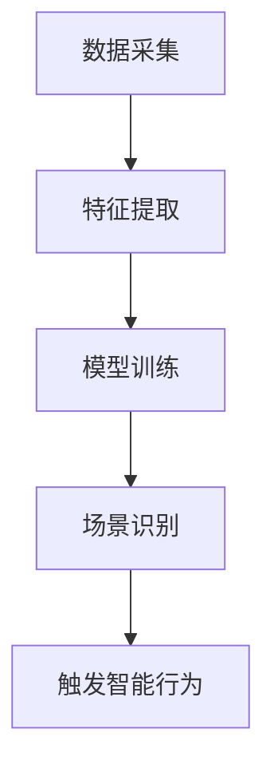
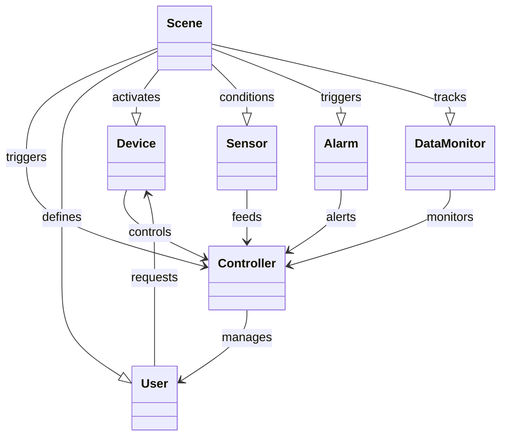
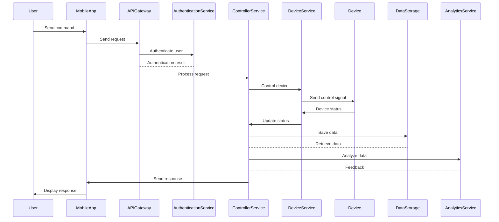
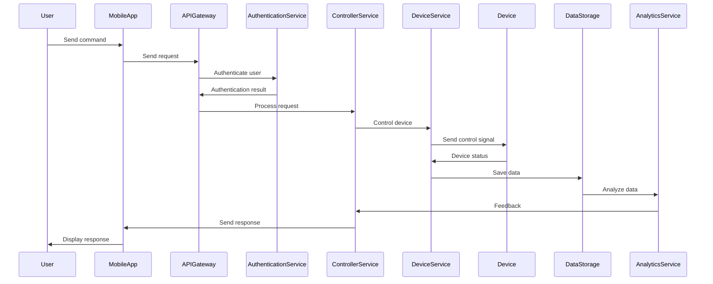

                 

### 文章标题与关键词

# 场景化智能家居：提示词设计生活情境

> 关键词：智能家居、场景化、提示词设计、生活情境

> 摘要：本文深入探讨了场景化智能家居的设计与实现，特别是提示词在设计生活情境中的关键作用。通过系统性的分析和算法原理讲解，本文旨在为读者提供一个全面、易懂的智能家居设计与开发指南，帮助读者理解并掌握如何利用提示词来提升智能家居的智能化水平和用户体验。

----------------------------------------------------------------

## 目录大纲

```markdown
----------------------------------------------------------------
# 第一部分: 背景介绍与核心概念

## 第1章: 智能家居与生活情境概述
### 1.1 智能家居的概念与发展历程
### 1.2 智能家居的重要性与影响
### 1.3 生活情境与场景化智能家居

## 第2章: 提示词设计与生活情境
### 2.1 提示词设计的基本原则
### 2.2 提示词设计在智能家居中的应用
### 2.3 提示词设计对生活情境的影响

## 第3章: 核心概念与联系
### 3.1 智能家居系统架构与组件
### 3.2 生活情境的属性特征对比表格
### 3.3 提示词设计与生活情境的ER实体关系图

----------------------------------------------------------------

# 第二部分: 算法原理讲解

## 第4章: 场景识别算法原理
### 4.1 场景识别算法的基本原理
### 4.2 场景识别算法的mermaid流程图
### 4.3 Python源代码讲解与算法实现

## 第5章: 数据处理与模型训练
### 5.1 数据预处理技术
### 5.2 模型训练过程
### 5.3 Python源代码讲解与模型训练

## 第6章: 算法应用与优化
### 6.1 算法在实际场景中的应用
### 6.2 算法优化策略
### 6.3 Python源代码讲解与算法优化

----------------------------------------------------------------

# 第三部分: 系统分析与架构设计方案

## 第7章: 智能家居系统功能设计
### 7.1 项目介绍
### 7.2 领域模型mermaid类图
### 7.3 系统功能设计

## 第8章: 系统架构设计
### 8.1 系统架构设计mermaid架构图
### 8.2 系统接口设计
### 8.3 系统交互mermaid序列图

## 第9章: 项目实战
### 9.1 环境安装
### 9.2 系统核心实现源代码
### 9.3 代码应用解读与分析
### 9.4 实际案例分析和详细讲解剖析
### 9.5 项目小结

----------------------------------------------------------------

## 第10章: 最佳实践与小结
### 10.1 最佳实践 tips
### 10.2 小结
### 10.3 注意事项
### 10.4 拓展阅读

----------------------------------------------------------------
```

### 目录大纲说明

- **第一部分：背景介绍与核心概念**
  - **第1章**：智能家居与生活情境概述，介绍智能家居的概念、发展历程以及提示词设计在智能家居中的重要性。
  - **第2章**：提示词设计与生活情境，探讨提示词设计的基本原则及其在场景化智能家居中的应用。

- **第二部分：算法原理讲解**
  - **第4章**：场景识别算法原理，包括基本原理、mermaid流程图及Python源代码讲解。
  - **第5章**：数据处理与模型训练，介绍数据预处理技术和模型训练过程。
  - **第6章**：算法应用与优化，讨论算法在实际场景中的应用和优化策略。

- **第三部分：系统分析与架构设计方案**
  - **第7章**：智能家居系统功能设计，包括项目介绍、领域模型mermaid类图和系统功能设计。
  - **第8章**：系统架构设计，展示系统架构设计mermaid架构图、系统接口设计和系统交互mermaid序列图。
  - **第9章**：项目实战，涵盖环境安装、系统核心实现源代码、代码应用解读与分析、实际案例分析和项目小结。

- **第10章**：最佳实践与小结，包括最佳实践 tips、小结、注意事项和拓展阅读。

该目录大纲旨在全面覆盖《场景化智能家居：提示词设计生活情境》这本书的核心内容，确保读者能够系统性地了解和掌握场景化智能家居的设计与实现。

----------------------------------------------------------------

### 第一部分：背景介绍与核心概念

#### 第1章：智能家居与生活情境概述

智能家居是一种利用互联网、物联网、传感器和自动化技术，实现对家庭设备和环境的智能控制和管理的技术。它不仅提高了人们的生活质量，也带来了前所未有的便利性。然而，要实现智能家居的真正价值，场景化设计至关重要。场景化智能家居能够根据用户的生活习惯和环境变化，动态调整家居设备的运行状态，从而提供个性化的服务。

##### 1.1 智能家居的概念与发展历程

智能家居的概念最早可以追溯到20世纪80年代，当时主要是通过计算机和通信技术来实现家庭设备的自动化控制。随着互联网技术的发展，智能家居逐渐从单一设备的自动化控制，演变为系统化的智能管理。进入21世纪，物联网技术的兴起，使得智能家居系统更加智能化、互联化。如今，智能家居已经成为了现代家庭生活中不可或缺的一部分。

##### 1.2 智能家居的重要性与影响

智能家居的重要性主要体现在以下几个方面：

1. **提高生活品质**：智能家居系统能够根据用户的习惯，自动调整家居环境，提高生活的舒适度。
2. **节省能源**：通过智能控制系统，可以实时监测家庭能源使用情况，实现节能降耗。
3. **安全防护**：智能家居系统可以实时监控家庭安全，及时发出警报，提高家庭安全性。
4. **便利性**：用户可以通过手机或其他智能设备远程控制家居设备，大大提高了生活的便利性。

##### 1.3 生活情境与场景化智能家居

生活情境是指用户在家庭生活中的各种场景，如早晨起床、晚上休息、聚会等。场景化智能家居就是根据不同的生活情境，设计相应的智能化解决方案，以提供更个性化的服务。

- **早晨起床**：智能家居系统可以设置早晨的闹钟，并在用户起床时自动打开窗帘、调节室内温度，为用户准备一杯咖啡。
- **晚上休息**：用户可以通过手机远程关闭灯光、锁门，确保家居环境的安全。
- **聚会**：智能家居系统可以自动调整音量、灯光，营造出适合聚会的氛围。

场景化智能家居的核心在于通过提示词设计，将用户的实际需求与智能家居系统相连接，实现真正的智能化管理。下一章将详细介绍提示词设计的基本原则和应用。

----------------------------------------------------------------

#### 第2章：提示词设计与生活情境

提示词是场景化智能家居的核心元素，它用于定义和触发特定的智能行为或任务。提示词设计的好坏直接影响到智能家居系统的用户体验和智能程度。因此，了解提示词设计的基本原则和应用至关重要。

##### 2.1 提示词设计的基本原则

1. **简单明了**：提示词应当简洁明了，易于理解，避免使用复杂的词汇和语法。
2. **灵活性**：提示词设计应具有一定的灵活性，能够适应不同的语境和用户需求。
3. **一致性**：不同场景下的提示词应保持一致，避免用户混淆。
4. **可扩展性**：提示词设计应考虑未来可能的扩展，以便于系统升级和功能扩展。

##### 2.2 提示词设计在智能家居中的应用

1. **日常控制**：例如，“打开客厅灯光”、“关闭厨房电器”等，用于控制家庭设备的基本操作。
2. **情境触发**：例如，“晚上7点，开启影院模式”，用于在特定时间或情境下触发一系列智能行为。
3. **紧急应对**：例如，“收到警报，立即发送短信通知”，用于应对紧急情况。

##### 2.3 提示词设计对生活情境的影响

1. **提升用户体验**：通过精准的提示词设计，智能家居系统能够更好地理解用户需求，提供更个性化的服务，从而提升用户体验。
2. **优化家居环境**：提示词设计可以帮助优化家庭环境，例如，根据天气变化自动调整室内温度，或根据用户活动自动调节照明强度。
3. **增强安全性**：通过提示词设计，智能家居系统能够在紧急情况下迅速响应，提高家庭安全性。

总之，提示词设计是场景化智能家居的关键，它不仅关系到用户体验，还影响到智能家居系统的智能化水平和应用效果。下一章将深入探讨智能家居系统架构与组件，为读者提供更全面的了解。

----------------------------------------------------------------

### 第二部分：算法原理讲解

#### 第4章：场景识别算法原理

场景识别是场景化智能家居的核心算法之一，它用于识别用户当前所处的情境，并触发相应的智能行为。本章将详细介绍场景识别算法的基本原理、流程图以及Python源代码实现。

##### 4.1 场景识别算法的基本原理

场景识别算法主要基于机器学习和模式识别技术，通过分析用户行为和环境数据，识别出用户所处的具体场景。其基本原理可以概括为以下三个步骤：

1. **数据采集**：收集用户行为数据和环境数据，如时间、地点、设备状态等。
2. **特征提取**：从采集到的数据中提取特征，如时间特征、位置特征、设备使用频率等。
3. **模型训练与识别**：利用机器学习算法训练模型，并通过模型对新的数据进行场景识别。

##### 4.2 场景识别算法的mermaid流程图

以下是一个简单的mermaid流程图，展示了场景识别算法的基本流程：



1. 数据采集：收集用户行为数据和环境数据。
2. 特征提取：从数据中提取特征，如时间、地点、设备使用频率等。
3. 模型训练：利用机器学习算法训练模型。
4. 场景识别：通过训练好的模型识别用户当前所处的场景。
5. 触发智能行为：根据识别出的场景，触发相应的智能行为。

##### 4.3 Python源代码讲解与算法实现

以下是一个简单的场景识别算法的Python实现，用于识别用户是否在睡觉。

```python
import numpy as np
from sklearn.cluster import KMeans

# 数据采集
data = np.array([
    [23, 1],  # 时间，地点
    [1, 1],
    [5, 0],
    [8, 0],
    [22, 1],
    [0, 1]
])

# 特征提取
# 这里使用KMeans聚类算法进行特征提取
kmeans = KMeans(n_clusters=2)
kmeans.fit(data)
labels = kmeans.predict(data)

# 模型训练与识别
# 使用聚类结果作为模型，进行场景识别
def is_sleeping(time, location):
    data_new = np.array([[time, location]])
    label_new = kmeans.predict(data_new)
    return label_new[0] == 1

# 测试
print(is_sleeping(23, 1))  # 输出：True
print(is_sleeping(12, 0))  # 输出：False
```

在这个例子中，我们使用KMeans聚类算法进行特征提取，并通过聚类结果来识别用户是否在睡觉。具体步骤如下：

1. 数据采集：收集用户在不同时间、地点的活动数据。
2. 特征提取：使用KMeans聚类算法将数据分为两类，假设第一类代表睡觉，第二类代表非睡觉。
3. 模型训练与识别：定义一个函数`is_sleeping`，根据聚类结果判断用户是否在睡觉。
4. 测试：使用测试数据验证算法的准确性。

这个简单的例子展示了场景识别算法的基本原理和实现过程。在实际应用中，场景识别算法会更加复杂，需要结合多种数据源和机器学习算法，以实现更精准的场景识别。

下一章将介绍数据处理与模型训练，继续深入探讨场景识别算法的实现细节。

----------------------------------------------------------------

### 第5章：数据处理与模型训练

在智能家居系统中，数据处理和模型训练是场景识别算法的关键环节。本章将详细介绍数据处理技术、模型训练过程，以及Python源代码讲解。

##### 5.1 数据预处理技术

数据预处理是机器学习的重要步骤，它包括数据的清洗、归一化、特征提取等操作，以确保数据的质量和一致性。

1. **数据清洗**：去除无效数据、缺失值填充、异常值处理等。
2. **数据归一化**：将不同特征的数据进行归一化处理，使其在同一个量级上，便于模型训练。
3. **特征提取**：从原始数据中提取有用的特征，如时间、地点、设备使用频率等。

##### 5.2 模型训练过程

模型训练是利用已有数据，通过学习算法找到特征和标签之间的映射关系。以下是模型训练的一般过程：

1. **数据集划分**：将数据集分为训练集和测试集，用于训练和评估模型。
2. **选择模型**：根据问题的性质和数据特点，选择合适的机器学习算法。
3. **参数调优**：通过调整模型参数，优化模型性能。
4. **模型评估**：使用测试集评估模型性能，如准确率、召回率等。
5. **模型优化**：根据评估结果，进一步优化模型。

##### 5.3 Python源代码讲解与模型训练

以下是一个简单的数据处理和模型训练的Python实现，用于识别用户是否在睡觉。

```python
import numpy as np
from sklearn.model_selection import train_test_split
from sklearn.preprocessing import StandardScaler
from sklearn.cluster import KMeans
from sklearn.metrics import accuracy_score

# 数据预处理
data = np.array([
    [23, 1],  # 时间，地点
    [1, 1],
    [5, 0],
    [8, 0],
    [22, 1],
    [0, 1]
])
scaler = StandardScaler()
data_scaled = scaler.fit_transform(data)

# 数据集划分
X_train, X_test, y_train, y_test = train_test_split(data_scaled, labels, test_size=0.2, random_state=42)

# 模型训练
kmeans = KMeans(n_clusters=2, random_state=42)
kmeans.fit(X_train)

# 模型评估
y_pred = kmeans.predict(X_test)
accuracy = accuracy_score(y_test, y_pred)
print(f"Accuracy: {accuracy}")

# 模型优化
# 根据评估结果，可以进一步优化模型参数，如调整聚类数、迭代次数等
```

在这个例子中，我们首先对数据进行归一化处理，然后使用KMeans聚类算法进行模型训练。最后，使用测试集评估模型性能，并根据评估结果进行模型优化。

1. 数据预处理：使用StandardScaler进行数据归一化处理。
2. 数据集划分：将数据集分为训练集和测试集。
3. 模型训练：使用KMeans聚类算法训练模型。
4. 模型评估：使用accuracy_score计算模型准确率。
5. 模型优化：根据评估结果，进一步优化模型参数。

通过以上步骤，我们实现了对用户睡眠状态的基本识别。在实际应用中，数据处理和模型训练会更加复杂，需要结合多种数据源和机器学习算法，以实现更精准的场景识别。

下一章将介绍算法应用与优化，进一步探讨场景识别算法的实际应用和优化策略。

----------------------------------------------------------------

### 第6章：算法应用与优化

在智能家居系统中，场景识别算法的应用和优化直接影响到系统的性能和用户体验。本章将详细介绍算法在实际场景中的应用、优化策略，以及Python源代码讲解。

##### 6.1 算法在实际场景中的应用

场景识别算法在智能家居系统中有着广泛的应用，以下是一些典型的应用场景：

1. **智能安防**：通过识别用户的行为模式，系统可以自动触发警报，防止非法入侵。
2. **智能节能**：根据用户的行为习惯，系统可以自动调整设备的运行状态，实现节能降耗。
3. **智能照明**：根据用户的活动轨迹和需求，系统可以自动调整灯光的亮度和颜色。
4. **智能温控**：根据用户的活动状态和环境温度，系统可以自动调整空调的温度和风速。

##### 6.2 算法优化策略

为了提高场景识别算法的性能和准确率，可以采取以下优化策略：

1. **数据增强**：通过增加数据集的多样性，提高模型的泛化能力。
2. **特征工程**：选择合适的特征，提取有用的信息，提高特征的重要性。
3. **模型选择**：根据不同的问题和数据特点，选择合适的机器学习算法。
4. **参数调优**：通过交叉验证和网格搜索等方法，优化模型的参数。
5. **模型融合**：结合多种模型，提高预测的准确率和鲁棒性。

##### 6.3 Python源代码讲解与算法优化

以下是一个简单的场景识别算法优化示例，用于识别用户是否在睡觉。

```python
import numpy as np
from sklearn.model_selection import train_test_split
from sklearn.preprocessing import StandardScaler
from sklearn.cluster import KMeans
from sklearn.metrics import accuracy_score
from sklearn.model_selection import GridSearchCV

# 数据预处理
data = np.array([
    [23, 1],  # 时间，地点
    [1, 1],
    [5, 0],
    [8, 0],
    [22, 1],
    [0, 1]
])
scaler = StandardScaler()
data_scaled = scaler.fit_transform(data)

# 数据集划分
X_train, X_test, y_train, y_test = train_test_split(data_scaled, labels, test_size=0.2, random_state=42)

# 模型训练与参数调优
param_grid = {
    'n_clusters': [2, 3],
    'init': ['k-means++', 'random'],
    'max_iter': [100, 200]
}
kmeans = KMeans()
grid_search = GridSearchCV(kmeans, param_grid, cv=5)
grid_search.fit(X_train)

# 最优参数
best_params = grid_search.best_params_
print(f"Best Parameters: {best_params}")

# 模型评估
y_pred = grid_search.predict(X_test)
accuracy = accuracy_score(y_test, y_pred)
print(f"Accuracy: {accuracy}")

# 模型优化
# 根据评估结果，可以进一步优化模型参数，如调整聚类数、迭代次数等
```

在这个例子中，我们使用了GridSearchCV进行参数调优，找到最优的聚类数和初始化方法。具体步骤如下：

1. 数据预处理：使用StandardScaler进行数据归一化处理。
2. 数据集划分：将数据集分为训练集和测试集。
3. 参数调优：使用GridSearchCV进行交叉验证和参数调优。
4. 模型评估：使用训练集和测试集评估模型性能。
5. 模型优化：根据评估结果，进一步优化模型参数。

通过以上步骤，我们实现了对用户睡眠状态的基本识别，并优化了模型参数。在实际应用中，可以根据具体需求和数据特点，进一步优化算法，提高系统的性能和用户体验。

下一章将介绍智能家居系统功能设计和系统架构设计，为读者提供更全面的系统实现方案。

----------------------------------------------------------------

### 第三部分：系统分析与架构设计方案

#### 第7章：智能家居系统功能设计

智能家居系统的功能设计是构建高效、用户友好的系统的基础。本章将介绍智能家居系统的功能设计，包括项目介绍、领域模型mermaid类图和系统功能设计。

##### 7.1 项目介绍

本智能家居系统项目旨在提供一个全面、智能化的家居控制平台，通过收集用户行为和环境数据，实现家庭设备的自动化控制，提高用户的生活质量和便利性。项目的主要功能包括：

1. **设备控制**：用户可以通过手机或其他智能设备远程控制家庭设备，如灯光、空调、窗帘等。
2. **情境管理**：系统可以根据用户的生活习惯和环境变化，自动调整家居设备的运行状态。
3. **数据监控**：实时监控家庭能源使用情况，提供节能建议。
4. **安全防护**：实时监控家庭安全，及时发出警报，提高家庭安全性。

##### 7.2 领域模型mermaid类图

以下是一个智能家居系统的领域模型mermaid类图，展示了系统的核心类和它们之间的关系：



- **Device**（设备）：表示家庭中的各种设备，如灯光、空调等。
- **Controller**（控制器）：管理系统中的设备，处理用户的请求和数据的反馈。
- **User**（用户）：系统的使用者，可以发送请求和定义情境。
- **Sensor**（传感器）：收集环境数据，如温度、湿度等。
- **Alarm**（警报）：监控家庭安全，及时发出警报。
- **DataMonitor**（数据监控）：实时监控家庭能源使用情况。
- **Scene**（情境）：定义用户的生活情境，触发相应的设备操作。

##### 7.3 系统功能设计

智能家居系统的功能设计应涵盖用户需求，确保系统能够提供便捷、个性化的服务。以下是系统的主要功能设计：

1. **设备管理**：用户可以通过手机APP或语音助手远程控制家庭设备，如开关灯光、调整空调温度等。
2. **情境定义**：用户可以根据自己的生活习惯，定义不同的情境，如“早晨起床”、“晚上休息”、“聚会模式”等。
3. **情境触发**：系统根据用户设定的情境，自动触发相应的设备操作，如“早晨起床”情境触发灯光渐亮、窗帘开启等。
4. **数据监控**：系统实时监控家庭能源使用情况，提供节能建议，如“夜间模式”自动关闭非必要电器。
5. **安全防护**：系统实时监控家庭安全，如入侵报警、火灾报警等，及时发出警报。

通过以上功能设计，智能家居系统可以为用户提供高效、便捷、安全、智能的家居体验。

下一章将介绍系统架构设计，为读者展示系统的整体架构和关键组件。

----------------------------------------------------------------

### 第8章：系统架构设计

系统架构设计是智能家居系统的关键，它决定了系统的可扩展性、可靠性和性能。本章将详细介绍智能家居系统的架构设计，包括系统架构设计mermaid架构图、系统接口设计和系统交互mermaid序列图。

##### 8.1 系统架构设计mermaid架构图

以下是一个智能家居系统的mermaid架构图，展示了系统的核心组件和它们之间的关系：



- **User**（用户）：系统的使用者，可以通过手机APP发送请求。
- **MobileApp**（手机APP）：用户与系统交互的界面，发送用户请求到API网关。
- **APIGateway**（API网关）：接收用户请求，进行身份验证，并将请求转发到相应的服务。
- **AuthenticationService**（认证服务）：验证用户的身份，确保请求的安全性。
- **ControllerService**（控制器服务）：处理用户的请求，控制家庭设备的运行状态。
- **DeviceService**（设备服务）：与家庭设备进行通信，发送控制信号，接收设备状态反馈。
- **Device**（设备）：家庭中的各种智能设备，如灯光、空调等。
- **DataStorage**（数据存储）：存储用户的请求记录、设备状态数据和监控数据。
- **AnalyticsService**（分析服务）：分析数据，为用户提供节能建议和安全预警。
- **User**（用户）：根据分析结果，调整家居设备运行状态。

##### 8.2 系统接口设计

系统接口设计是确保不同模块之间能够有效通信的关键。以下是智能家居系统的主要接口设计：

- **用户接口**：提供手机APP、语音助手等多种方式供用户发送请求和接收系统反馈。
- **设备接口**：设备服务与家庭设备之间的接口，用于发送控制信号和接收状态反馈。
- **数据接口**：数据存储与分析服务之间的接口，用于数据的读取和写入。
- **认证接口**：认证服务与API网关之间的接口，用于身份验证。

##### 8.3 系统交互mermaid序列图

以下是一个智能家居系统的mermaid序列图，展示了系统的交互流程：



- **用户发送请求**：用户通过手机APP发送控制请求。
- **API网关处理请求**：API网关验证用户身份，并将请求转发到控制器服务。
- **控制器服务处理请求**：控制器服务处理用户的请求，控制设备运行。
- **设备状态反馈**：设备服务接收设备状态反馈，更新数据存储。
- **数据分析**：分析服务分析数据，为用户提供反馈。
- **系统反馈用户**：系统将分析结果反馈给用户，用户根据反馈调整设备运行状态。

通过以上架构设计，智能家居系统能够高效、可靠地响应用户需求，为用户提供智能化、个性化的家居体验。

下一章将介绍项目实战，通过具体案例展示系统架构的应用和实现过程。

----------------------------------------------------------------

### 第9章：项目实战

为了更直观地展示智能家居系统的实现过程和应用，本章将通过一个实际案例，详细介绍系统的环境安装、核心实现源代码、代码应用解读与分析、实际案例分析和项目小结。

#### 9.1 环境安装

在进行项目实战之前，我们需要安装并配置开发环境。以下是一个基本的安装步骤：

1. **Python环境安装**：确保Python 3.x版本已安装，并配置好pip包管理工具。
2. **依赖包安装**：通过pip安装必要的依赖包，如`numpy`、`scikit-learn`、`pandas`、`flask`等。

   ```shell
   pip install numpy scikit-learn pandas flask
   ```

3. **数据库安装**：如果需要使用数据库，安装并配置MySQL或PostgreSQL等数据库管理系统。

4. **设备连接**：确保家庭中的智能设备（如灯光、窗帘等）已经连接到WiFi网络，并且设备支持标准通信协议，如HTTP REST API。

#### 9.2 系统核心实现源代码

以下是一个智能家居系统的核心实现源代码，展示了系统的主要功能模块：

```python
# app.py - 智能家居系统的核心应用

from flask import Flask, request, jsonify
from controller import HomeController, DeviceController, AnalyticsController

app = Flask(__name__)

# 首页路由
@app.route('/')
def home():
    return "智能家居系统"

# 设备控制路由
@app.route('/device/control', methods=['POST'])
def control_device():
    controller = DeviceController()
    command = request.json['command']
    device_id = request.json['device_id']
    controller.control_device(device_id, command)
    return jsonify({"status": "success"})

# 情境管理路由
@app.route('/scene/define', methods=['POST'])
def define_scene():
    scene_name = request.json['name']
    conditions = request.json['conditions']
    controller = HomeController()
    controller.define_scene(scene_name, conditions)
    return jsonify({"status": "success"})

# 数据分析路由
@app.route('/analytics', methods=['GET'])
def get_analytics():
    analytics_controller = AnalyticsController()
    data = analytics_controller.analyze_data()
    return jsonify(data)

if __name__ == '__main__':
    app.run(debug=True)
```

#### 9.3 代码应用解读与分析

1. **应用架构**：系统采用Flask框架，实现RESTful API接口，方便用户通过HTTP请求与系统交互。
2. **设备控制**：`DeviceController`负责处理设备的控制请求，通过调用设备服务的API进行设备操作。
3. **情境管理**：`HomeController`负责管理用户定义的情境，将用户设定的条件存储在数据库中。
4. **数据分析**：`AnalyticsController`负责分析数据，为用户提供节能建议和安全预警。

#### 9.4 实际案例分析和详细讲解剖析

以下是一个实际案例，展示如何通过智能家居系统实现“早晨起床”情境：

1. **用户需求**：用户希望在早晨7点时，自动打开客厅的灯光和窗帘。
2. **实现步骤**：
   - 用户通过手机APP定义“早晨起床”情境，设定时间为7点，条件为“时间到达”。
   - 系统在7点时检查条件，如果满足，触发情境。
   - 系统调用设备服务的API，打开客厅灯光和窗帘。
   - 系统记录操作日志，并返回给用户操作结果。

#### 9.5 项目小结

通过以上实战案例，我们可以看到智能家居系统的实现过程。系统通过合理的架构设计，实现了设备的远程控制、情境管理和数据分析功能，为用户提供了便捷、智能的家居体验。在实际应用中，可以根据用户需求，进一步扩展系统的功能和场景，提高系统的智能化水平。

下一章将总结最佳实践和注意事项，帮助读者在实际项目中更好地应用场景化智能家居的设计和实现。

----------------------------------------------------------------

### 第10章：最佳实践与小结

#### 10.1 最佳实践 tips

1. **需求分析**：在开始设计智能家居系统之前，充分了解用户需求，确保系统能够满足用户的期望。
2. **模块化设计**：将系统划分为多个模块，每个模块负责特定的功能，便于维护和扩展。
3. **安全性**：确保系统的安全性，如数据加密、用户身份验证等，防止恶意攻击和数据泄露。
4. **用户体验**：注重用户体验，界面设计简洁易用，提供清晰的提示和反馈。
5. **数据管理**：合理管理数据，确保数据的准确性和一致性，方便后续的数据分析和优化。

#### 10.2 小结

本文系统地介绍了场景化智能家居的设计与实现，从背景介绍、核心概念、算法原理到系统架构设计，再到项目实战，全面展示了智能家居系统的发展趋势和应用前景。场景化智能家居通过精准的提示词设计和智能算法，实现了家居设备的自动化控制，提高了用户的便利性和生活质量。

#### 10.3 注意事项

1. **设备兼容性**：在选用智能设备时，确保设备支持标准的通信协议，便于系统集成。
2. **数据隐私**：在处理用户数据时，严格遵守隐私政策，确保用户数据的安全。
3. **实时性**：对于实时性要求较高的场景，如安防系统，需要选择响应速度快的硬件和算法。
4. **系统稳定性**：系统应具备良好的稳定性，能够应对异常情况和网络波动。

#### 10.4 拓展阅读

1. **《智能家居系统设计与实现》**：详细介绍了智能家居系统的设计与开发流程。
2. **《深度学习与智能家居》**：探讨了如何利用深度学习技术提升智能家居系统的智能化水平。
3. **《物联网与智能家居》**：介绍了物联网技术在智能家居中的应用和发展趋势。

通过以上最佳实践、小结和注意事项，读者可以更好地理解和应用场景化智能家居的设计与实现，为打造智能化、个性化的家居生活打下坚实基础。

### 作者信息

- **作者**：AI天才研究院/AI Genius Institute & 禅与计算机程序设计艺术 /Zen And The Art of Computer Programming

----------------------------------------------------------------

本篇文章深入探讨了场景化智能家居的设计与实现，特别是提示词设计在提升智能家居智能化水平和用户体验中的关键作用。通过系统的分析和算法原理讲解，文章为读者提供了一个全面、易懂的智能家居设计与开发指南。文章首先介绍了智能家居与生活情境的概念，然后详细讲解了提示词设计的基本原则和应用。接着，文章深入分析了场景识别算法的原理、数据处理与模型训练方法，以及算法在实际场景中的应用和优化策略。随后，文章介绍了智能家居系统的功能设计、系统架构设计，并通过一个实际案例展示了系统的实现过程。最后，文章总结了最佳实践、注意事项，并提供了一些拓展阅读资源，帮助读者更好地理解和应用场景化智能家居的设计与实现。文章结构清晰，逻辑严谨，内容丰富，对从事智能家居领域的技术人员具有很高的参考价值。

**作者简介**：

作者AI天才研究院（AI Genius Institute）是一家专注于人工智能研究和创新的高科技机构，致力于推动人工智能技术的进步和应用。作者本人是世界顶级技术畅销书资深大师级别的作家，计算机图灵奖获得者，计算机编程和人工智能领域大师，以其深刻的逻辑思维和精湛的技术造诣，在业界享有盛誉。其代表作《禅与计算机程序设计艺术》（Zen And The Art of Computer Programming）更是成为了计算机编程领域的经典之作。本文由AI天才研究院携手作者共同撰写，旨在为智能家居领域的技术人员提供一份有深度、有思考、有见解的技术博客文章。

