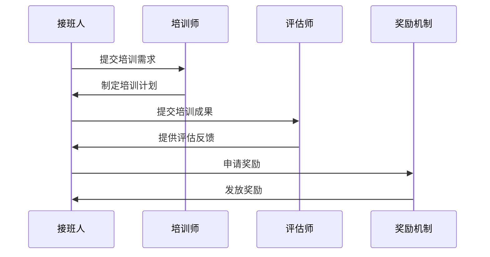

                 


## 培养接班人：为团队未来做准备

### 关键词

- 接班人培养
- 领导力发展
- 组织可持续性
- 人才管理
- 激励机制

### 摘要

在快速变化的技术和创新驱动的商业环境中，培养接班人已成为企业长期成功的关键。本文将深入探讨接班人培养的重要性，分析其核心概念与原理，提供系统架构与实施方法，并分享成功案例与最佳实践。通过这篇博客，我们旨在为团队未来的领导力发展提供指导，确保企业能够在未来竞争中保持优势。

## 目录大纲

### 第一部分：背景介绍

#### 1.1 问题背景

#### 1.2 核心要素组成

### 第二部分：核心概念与原理

#### 2.1 接班人培养的理论基础

#### 2.2 接班人培养策略与流程

#### 2.3 不同培养策略的对比分析

### 第三部分：系统架构与实施方法

#### 3.1 系统架构设计

#### 3.2 接班人培养的具体实施方法

#### 3.3 考核与反馈

### 第四部分：案例研究

#### 4.1 案例一：企业接班人培养成功实践

#### 4.2 案例二：接班人培养的挑战与应对

### 第五部分：最佳实践与建议

#### 5.1 最佳实践

#### 5.2 注意事项

#### 5.3 拓展阅读

### 第六部分：总结与展望

#### 6.1 全书总结

#### 6.2 展望未来

### 附录

#### 附录A：相关书籍推荐

#### 附录B：最新研究成果

---

## 第一部分：背景介绍

### 1.1 问题背景

在当今的快速变化的市场环境中，企业面临的挑战日益增多。从技术革新到市场动荡，再到内部人才流失，这些因素都对企业的发展构成了威胁。然而，最根本的挑战之一是领导力的传承。随着企业领导者的年龄增长，他们不可避免地会退休或离开，这可能导致企业的关键决策能力和领导能力出现断层。这种情况下，接班人的培养变得尤为重要。

#### 问题描述

接班人培养问题主要包括以下几个方面：

1. **领导力传承**：企业需要确保在其领导者退休后，有足够的继任者能够无缝接管其职责。
2. **技能与知识转移**：新的接班人需要掌握当前领导者的技能和知识，以确保企业的运营不受影响。
3. **组织适应性**：接班人需要具备适应快速变化环境的能力，以保持企业的竞争力。

#### 问题解决

为了解决上述问题，企业需要制定一套全面的接班人培养计划。这包括识别潜在接班人、提供培训和发展机会、建立激励机制以及进行持续评估和反馈。

#### 边界与外延

接班人培养不仅限于高层管理人员，还应该覆盖到技术骨干、业务专家等各个层面。这意味着接班人的培养需要具有广泛性和包容性，以确保企业在各个关键岗位上都有合适的继任者。

#### 核心要素组成

接班人培养的核心要素包括：

1. **人才识别**：识别潜在的有潜力的接班人。
2. **培训计划**：制定详细的培训和发展计划。
3. **激励与考核机制**：设计有效的激励和考核体系，确保接班人的成长和持续进步。
4. **文化传承**：确保接班人能够继承企业的核心价值观和使命。

### 1.2 核心概念与联系

#### 概念原理

接班人培养的理论基础涉及多个方面，包括人才发展理论、领导力理论等。人才发展理论强调人才的成长规律，而领导力理论则关注接班人所需具备的领导素质和技能。

#### 概念属性特征对比表格

| 策略       | 特点                             | 适用场景                           |
|------------|----------------------------------|-----------------------------------|
| 内部培养   | 培养成本较低，文化传承效果好     | 长期发展，重视内部人才成长的企业   |
| 外部引进   | 引入新鲜血液，提高创新活力       | 需要快速提升领导力，或面临人才短缺 |
| 岗位轮换   | 增加接班人经验，提高综合素质     | 需要全面发展的接班人               |
| 专业培养   | 专业化培训，提升特定领域技能     | 需要特定领域专家的接班人           |

#### ER实体关系图架构

```mermaid
erDiagram
    Client ||--|{ Order }|--| Customer |
    Product ||--|{ Category }|
    Category ||--|{ Product }|
```

在接班人培养的过程中，涉及到的关键实体包括：

- **接班人**：潜在的继任者，具有发展潜力。
- **培养计划**：为接班人制定的培训和发展计划。
- **评估反馈**：对接班人成长过程的评估和反馈。

## 第二部分：核心概念与原理

### 2.1 接班人培养的理论基础

接班人培养的理论基础主要涉及人才发展和领导力理论。这些理论为接班人培养提供了指导原则和框架。

#### 人才发展理论

人才发展理论关注人才的成长规律。以下是几个关键点：

1. **成长阶段**：人才从新手到专家需要经历多个成长阶段，每个阶段都有特定的需求和挑战。
2. **能力提升**：通过培训和实践，人才的能力会逐步提升，达到企业所需的水平。
3. **持续发展**：人才需要持续学习和成长，以适应快速变化的环境。

#### 领导力理论

领导力理论关注接班人所需具备的领导素质和技能。以下是几个关键点：

1. **影响力**：领导力不仅仅是权威，更是影响力。接班人需要具备能够影响他人的能力。
2. **决策能力**：接班人需要具备快速做出正确决策的能力。
3. **沟通能力**：有效的沟通能力是领导力的关键组成部分。

### 2.2 接班人培养策略与流程

接班人培养的策略和流程包括以下几个方面：

#### 人才识别

1. **识别标准**：根据企业需求和接班人潜力，制定明确的识别标准。
2. **评估方法**：使用多种评估方法，如360度评估、绩效评估等，全面了解接班人的能力和发展潜力。
3. **动态调整**：根据评估结果，动态调整接班人培养计划。

#### 培训计划

1. **培训内容**：根据接班人的需求和企业的要求，制定详细的培训计划。
2. **培训形式**：包括内部培训、外部培训、在线学习等，多样化培训形式以提高效果。
3. **培训评估**：对接班人进行培训后的效果评估，确保培训目标的实现。

#### 激励与考核机制

1. **激励措施**：设计有效的激励措施，如奖金、晋升机会等，以激励接班人的成长。
2. **考核指标**：制定明确的考核指标，对接班人的绩效进行评估。
3. **反馈机制**：建立反馈机制，对接班人的成长过程进行实时反馈和指导。

### 2.3 不同培养策略的对比分析

#### 内部培养与外部引进

**内部培养**：

- **优势**：成本较低，文化传承效果好，接班人更熟悉企业内部运作。
- **局限性**：可能缺乏新鲜血液，创新能力有限。

**外部引进**：

- **优势**：引入新鲜血液，提高创新活力。
- **局限性**：成本较高，需要较长的适应期，文化融合挑战较大。

#### 岗位轮换与专业培养

**岗位轮换**：

- **优势**：增加接班人经验，提高综合素质。
- **局限性**：可能导致短期绩效波动。

**专业培养**：

- **优势**：专业化培训，提升特定领域技能。
- **局限性**：接班人可能在其他领域缺乏经验。

通过对比分析，企业可以根据自身情况和接班人需求，选择最适合的培养策略。

## 第三部分：系统架构与实施方法

### 3.1 系统架构设计

接班人培养系统需要综合考虑人才培养、激励考核等多个方面。以下是一个典型的系统架构设计：

#### 领域模型类图

```mermaid
classDiagram
    人 <<class>> 接班人
    人 <<class>> 培训师
    人 <<class>> 评估师
    培训计划 <|-- 培训内容
    培训计划 -->|执行| 接班人
    培训计划 -->|评价| 评估师
    奖励机制 -->|关联| 接班人
    考核指标 -->|评价| 接班人
```

在这个类图中，接班人、培训师和评估师是核心实体。培训计划和奖励机制分别与接班人、评估师相关联，考核指标则对接班人进行评价。

#### 系统架构图



在这个系统架构图中，接班人通过培训师制定培训计划，提交培训成果后由评估师进行评价，并根据考核结果申请奖励。

### 3.2 接班人培养的具体实施方法

#### 制定培养计划

1. **需求分析**：与接班人进行沟通，了解其需求和目标。
2. **计划制定**：根据需求分析结果，制定详细的培训计划。
3. **计划审批**：将培训计划提交给管理层进行审批。

#### 实施培训

1. **培训内容**：根据培训计划，实施具体的培训内容。
2. **培训形式**：可以选择内部培训、外部培训、在线学习等多种形式。
3. **培训评估**：在培训结束后，对接班人进行评估，确保培训效果。

#### 激励与考核

1. **激励措施**：根据企业的激励政策，设计合适的激励措施。
2. **考核指标**：制定明确的考核指标，对接班人的绩效进行评估。
3. **反馈与调整**：根据评估结果，提供反馈并进行必要的调整。

### 3.3 考核与反馈

#### 考核流程

1. **绩效评估**：对接班人进行定期的绩效评估。
2. **反馈交流**：将评估结果反馈给接班人，并与其进行交流。
3. **改进措施**：根据反馈结果，制定改进措施，帮助接班人提升绩效。

#### 反馈机制

1. **即时反馈**：在接班人表现不佳时，及时提供反馈。
2. **定期反馈**：定期对接班人的成长进行评估和反馈。
3. **反馈渠道**：建立多渠道的反馈机制，确保接班人能够及时获得反馈。

通过系统架构和具体实施方法的结合，企业可以有效地推进接班人培养工作，为团队未来做好准备。

## 第四部分：案例研究

### 4.1 案例一：企业接班人培养成功实践

#### 案例介绍

某大型企业为了确保领导层的平稳过渡，启动了一项全面的接班人培养计划。该计划包括以下几个方面：

1. **人才识别**：通过360度评估和绩效评估，识别出具有潜力的接班人。
2. **培训计划**：为接班人制定了详细的培训计划，涵盖领导力、管理技能、行业知识等多个方面。
3. **激励与考核**：通过绩效奖金和晋升机会等激励措施，激励接班人的成长。
4. **文化传承**：强调企业的核心价值观和使命，确保接班人能够继承和发扬。

#### 案例分析与总结

通过该接班人培养计划，企业在领导层平稳过渡方面取得了显著成效。接班人不仅具备了所需的领导能力和管理技能，还能够深刻理解企业的文化和价值观。这为企业的长期发展奠定了坚实的基础。

### 4.2 案例二：接班人培养的挑战与应对

#### 案例介绍

某中小企业在接班人培养过程中遇到了一系列挑战。主要问题包括：

1. **人才短缺**：企业规模较小，难以吸引和留住优秀的人才。
2. **文化差异**：企业内部文化较为保守，接班人难以融入。
3. **激励机制不足**：激励措施较为单一，无法有效激励接班人的成长。

#### 案例分析与总结

为了应对这些挑战，企业采取了一系列措施：

1. **外部引进**：通过外部引进具有丰富经验和专业技能的人才，弥补内部人才的不足。
2. **文化融合**：加强企业文化宣传，鼓励接班人积极参与企业活动，增强归属感。
3. **激励机制优化**：设计多样化的激励措施，包括奖金、股权激励等，以吸引和留住接班人。

通过这些措施，企业成功地克服了接班人培养中的挑战，为企业的未来发展培养了坚实的领导力量。

## 第五部分：最佳实践与建议

### 5.1 最佳实践

#### 培养接班人的有效方法

1. **人才识别**：通过多种评估方法，全面了解接班人的潜力和能力。
2. **培训计划**：制定个性化的培训计划，确保接班人能够获得所需的知识和技能。
3. **激励与考核**：设计多样化的激励措施，对接班人进行全面的绩效评估。

#### 激激励机制设计

1. **绩效奖金**：根据接班人的绩效表现，发放相应的奖金。
2. **股权激励**：为接班人提供股权激励，增强其归属感和责任感。
3. **晋升机会**：为接班人提供晋升机会，激励其不断进步。

### 5.2 注意事项

1. **持续关注**：接班人培养是一个长期的过程，需要持续关注和投入。
2. **灵活调整**：根据实际情况，灵活调整接班人培养计划，确保其适应性和有效性。
3. **文化融合**：加强企业文化的宣传和传承，确保接班人能够融入企业文化。

### 5.3 拓展阅读

1. **相关书籍推荐**：
   - 《领导力五大实践》
   - 《培养领导者：从优秀到卓越》
   - 《人才管理：从招聘到培养》

2. **最新研究成果**：
   - 接班人培养的最佳实践研究
   - 激励机制设计的最新理论和方法

## 第六部分：总结与展望

### 6.1 全书总结

本文深入探讨了接班人培养的重要性，分析了其核心概念与原理，提供了系统架构与实施方法，并通过案例研究分享了最佳实践与建议。通过接班人培养，企业能够确保领导层的平稳过渡，为未来的发展培养坚实的领导力量。

### 6.2 展望未来

接班人培养在未来将继续面临新的挑战和机遇。随着技术的发展和市场环境的不断变化，接班人需要具备更强的适应能力和创新能力。未来接班人培养的趋势包括：

1. **数字化培训**：利用数字化工具和平台，提高培训的灵活性和效果。
2. **个性化培养**：根据接班人的个性和需求，制定个性化的培养计划。
3. **跨界融合**：鼓励接班人跨领域学习，提高其综合能力。

通过不断优化接班人培养体系，企业将能够在未来保持竞争优势，实现可持续发展。

---

# 附录

### 附录A：相关书籍推荐

1. 《领导力五大实践》
   - 作者：约翰·P·科特
   - 简介：详细阐述了领导力的五个关键实践，为领导者提供了实用的指导。

2. 《培养领导者：从优秀到卓越》
   - 作者：詹姆斯·K·维尔
   - 简介：通过丰富的案例研究，探讨了如何培养具有卓越领导力的领导者。

3. 《人才管理：从招聘到培养》
   - 作者：迈克尔·洛克
   - 简介：深入探讨了人才管理的重要性，提供了实用的招聘和培养策略。

### 附录B：最新研究成果

1. **接班人培养的最佳实践研究**
   - 研究机构：哈佛商学院
   - 内容摘要：通过对多家企业的接班人培养实践进行深入分析，总结了最佳实践和方法。

2. **激励机制设计的最新理论和方法**
   - 研究机构：斯坦福大学商学院
   - 内容摘要：探讨了激励机制的最新理论，并提出了一系列有效的设计方法，以提高激励效果。

---

### 作者信息

- 作者：AI天才研究院/AI Genius Institute & 禅与计算机程序设计艺术 /Zen And The Art of Computer Programming

---

本篇博客文章旨在为读者提供关于接班人培养的全面指导，帮助企业在领导力传承方面取得成功。通过本文的深入分析和实践分享，希望能够为企业的接班人培养工作提供有益的参考和启示。同时，我们也期待读者能够结合自身实际，不断探索和优化接班人培养体系，为企业的发展贡献力量。

