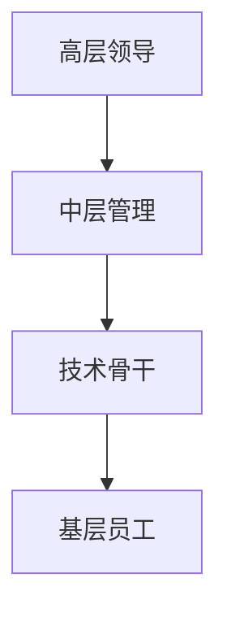
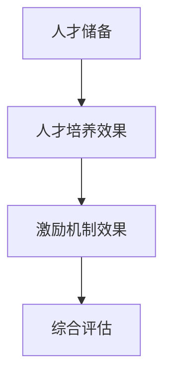
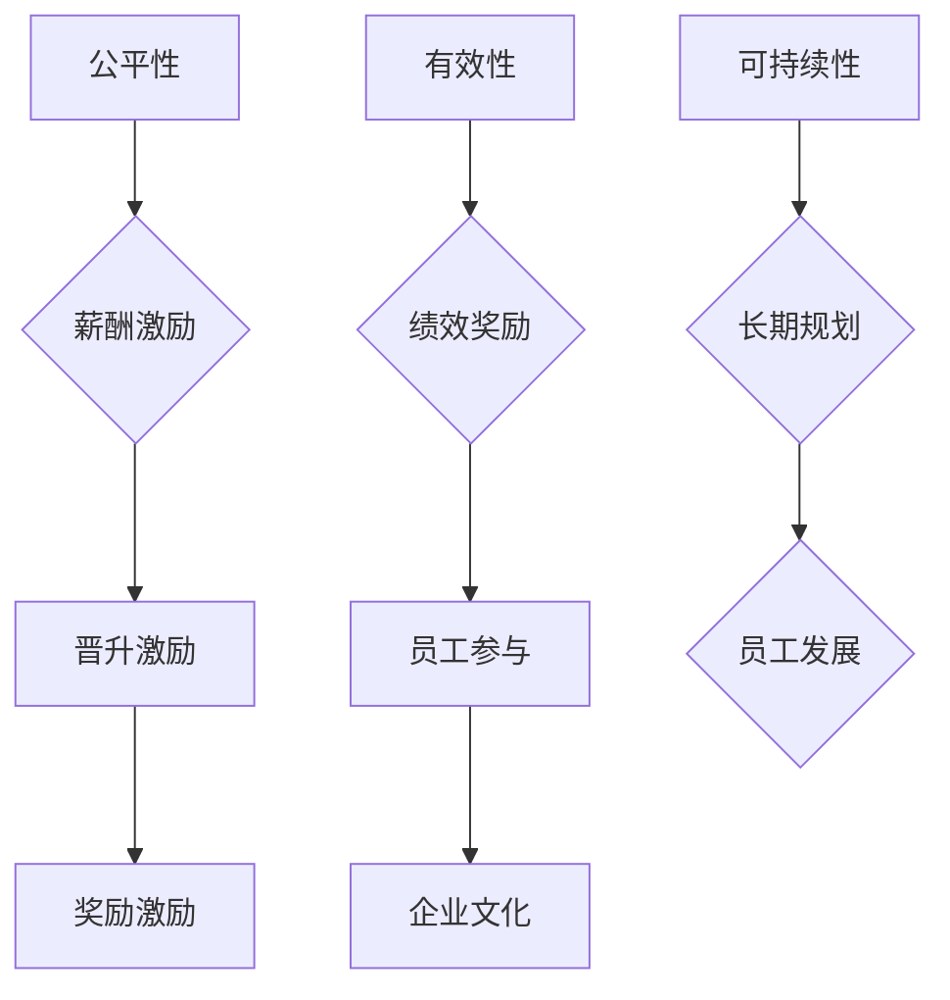
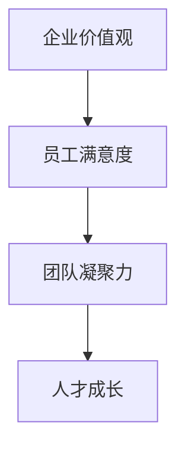

                 


# 培养未来领导者：人才梯队建设的关键

## 关键词
- 未来领导者
- 人才梯队建设
- 教育培训
- 组织发展
- 职业成长

## 摘要
本文旨在探讨人才梯队建设在培养未来领导者中的关键作用。首先，我们明确了人才梯队建设的背景和重要性，然后深入分析了核心概念和联系，接着提出了系统化的人才梯队建设策略。通过实施与评估，我们确保了策略的有效性。最后，通过案例分析与实践指导，为人才培养提供了具体路径。本文为组织和企业提供了一套全面、实用的领导人才培养解决方案。

## 引言与背景

### 人才梯队建设的背景

在全球化和科技迅速发展的背景下，企业面临着前所未有的挑战和机遇。人才竞争已成为企业竞争的核心，而人才梯队建设作为企业持续发展的关键，其重要性愈发凸显。当前，中国正致力于实现从“制造大国”向“创新强国”的转变，人才是这一转变的驱动力。然而，我国在人才培养和人才梯队建设方面仍存在诸多挑战，如人才流失、高层次人才短缺等。因此，探讨如何培养未来领导者，构建强大的人才梯队，对企业的长期发展具有重要意义。

### 人才梯队建设的重要性

人才梯队建设关乎企业的战略发展。一个完善的人才梯队不仅能满足企业当前的用人需求，还能为企业未来的发展储备力量。通过系统化的人才培养，企业能够提升整体竞争力，实现可持续发展。此外，人才梯队建设也是组织文化的重要组成部分，有助于塑造积极向上的企业文化氛围，增强员工的归属感和忠诚度。

### 边界与外延

**定义**：人才梯队建设是指通过系统的规划和实施，构建起一支结构合理、层次分明、能够满足企业长期发展需要的人才队伍。

**关键要素**：

1. **人才储备**：包括高层领导、中层管理和技术骨干等各个层级的人才。
2. **人才培养**：通过培训、晋升、交流等方式，提升员工的技能和素质。
3. **激励机制**：建立公平、有效的激励机制，激发员工的积极性和创造力。
4. **文化氛围**：营造开放、包容、互助的企业文化，促进人才的成长和发展。

## 核心概念与联系

### 核心概念原理

**人才梯队**：人才梯队是指企业根据战略发展需要，构建的由不同层级、不同专业的人才组成的结构体系。

**人才储备**：企业通过内部培养和外部引进，建立一支高素质的人才队伍。

**人才培养**：通过培训、晋升、交流等方式，提升员工的技能和素质。

**激励机制**：建立公平、有效的激励机制，激发员工的积极性和创造力。

### 概念属性特征对比表格

| 概念 | 属性特征 | 对比分析 |
| --- | --- | --- |
| 人才梯队 | 结构性、系统化、长期性 | 强调人才结构的合理性和系统的长期规划 |
| 人才储备 | 人才质量、多样性、稳定性 | 注重人才的多层次储备和稳定性 |
| 培养人才 | 技能提升、素质培养、职业发展 | 着眼于员工的全面发展和职业成长 |
| 激励机制 | 公平性、有效性、可持续性 | 旨在激发员工的内在动力和创造力 |

### ER实体关系图架构

```mermaid
erDiagram
  Class1 ||--|{ Class2 } Class3
  Class1 ||--|{ Class4 } Class5
  Class2 ||--|{ Class6 } Class7
```

## 人才梯队建设策略

### 人才梯队建设策略概述

**策略设计原则**：

1. **战略导向**：紧密结合企业战略，明确人才梯队建设的目标和方向。
2. **系统化**：构建全面、系统的人才培养体系，涵盖各个层级和领域。
3. **个性化**：根据员工特点和岗位需求，制定个性化的培养方案。
4. **可持续性**：确保人才梯队建设的长期性和持续性，形成良性循环。

**策略实施路径**：

1. **诊断与规划**：对企业现有人才结构进行诊断，明确人才需求和发展方向。
2. **制度建设**：完善人才培养和激励机制，建立科学的人才选拔和晋升体系。
3. **组织实施**：落实具体培养措施，确保人才梯队建设的有效推进。
4. **评估与优化**：定期对人才梯队建设效果进行评估，及时调整和优化策略。

## 实施与评估

### 人才梯队建设实施过程

**实施步骤**：

1. **诊断与规划**：对企业人才现状进行深入分析，明确人才梯队建设的目标和方向。
2. **制度建设**：建立完善的人才培养和激励机制，制定科学的选拔和晋升体系。
3. **组织实施**：落实具体培养措施，包括培训、晋升、交流等。
4. **跟进与支持**：提供必要的支持和资源，确保培养措施的有效实施。
5. **评估与反馈**：定期对人才梯队建设效果进行评估，收集反馈信息，及时调整和优化策略。

**关键环节**：

1. **人才培养**：通过培训、晋升、交流等方式，提升员工的技能和素质。
2. **激励机制**：建立公平、有效的激励机制，激发员工的积极性和创造力。
3. **组织文化**：营造积极向上的企业氛围，促进人才的成长和发展。

### 人才梯队建设评估体系

**评估指标**：

1. **人才储备情况**：评估企业人才队伍的数量、质量和结构。
2. **人才培养效果**：评估员工技能和素质的提升情况。
3. **激励机制效果**：评估激励机制的公平性、有效性和可持续性。
4. **组织文化氛围**：评估企业文化的建设情况和员工满意度。

**评估方法**：

1. **定量评估**：通过数据分析和统计方法，评估人才储备和激励机制的效果。
2. **定性评估**：通过访谈、调查和观察等方法，评估人才培养和组织文化的建设情况。

**评估案例**：

以某知名企业为例，通过实施人才梯队建设，实现了以下成果：

1. **人才储备**：建立了涵盖各个层级和领域的高素质人才队伍。
2. **人才培养**：通过培训、晋升和交流，提升了员工的技能和素质。
3. **激励机制**：建立了公平、有效的激励机制，激发了员工的积极性和创造力。
4. **组织文化**：营造了积极向上的企业文化氛围，增强了员工的归属感和忠诚度。

### 风险与挑战应对

**风险识别**：

1. **人才流失**：由于外部竞争激烈，企业可能面临人才流失的风险。
2. **培养效果不显著**：人才培养可能无法达到预期效果，导致资源浪费。
3. **组织文化冲突**：新引进的人才可能与现有组织文化产生冲突。

**挑战分析**：

1. **外部竞争**：全球化和科技发展加速，企业面临更激烈的人才竞争。
2. **内部变革**：企业需要不断调整和优化人才梯队建设策略，以适应变化的环境。
3. **文化融合**：如何在新旧组织文化的融合中，培养出具备企业核心价值观的人才。

**应对策略**：

1. **建立人才吸引机制**：通过提供有竞争力的薪酬和福利，吸引和留住优秀人才。
2. **优化人才培养体系**：确保人才培养方案的科学性和有效性，提高培养效果。
3. **加强文化融合**：通过组织活动、培训等方式，促进新旧组织文化的融合。

## 案例分析与实践指导

### 案例分析

**案例背景**：某科技企业为了提升核心竞争力，决定进行人才梯队建设。通过制定科学的人才培养和激励机制，企业成功培养了一批优秀的中高层管理人才和技术骨干。

**案例描述**：企业首先对现有人才进行了全面诊断，明确了人才队伍的结构和短板。然后，制定了系统的培养计划，包括内部培训、外部交流、项目历练等。同时，建立了公平、有效的激励机制，激发员工的积极性和创造力。

**案例分析**：通过人才梯队建设，企业不仅提升了员工的技能和素质，还增强了团队凝聚力和企业核心竞争力。具体表现在以下几个方面：

1. **人才储备**：企业建立了结构合理、素质优良的人才队伍，满足了企业长期发展的需求。
2. **人才培养**：通过系统的培养计划，员工的技能和素质得到了显著提升。
3. **激励机制**：公平、有效的激励机制激发了员工的积极性和创造力，提高了工作效率和质量。

### 实践指导

**实践操作步骤**：

1. **诊断与规划**：对企业人才现状进行深入分析，明确人才需求和发展方向。
2. **制度建设**：建立完善的人才培养和激励机制，制定科学的选拔和晋升体系。
3. **组织实施**：落实具体培养措施，包括培训、晋升、交流等。
4. **跟进与支持**：提供必要的支持和资源，确保培养措施的有效实施。
5. **评估与反馈**：定期对人才梯队建设效果进行评估，收集反馈信息，及时调整和优化策略。

**实践技巧**：

1. **个性化培养**：根据员工特点和岗位需求，制定个性化的培养方案。
2. **多元化激励**：结合员工需求和偏好，设计多元化的激励机制。
3. **持续优化**：根据评估结果和反馈信息，不断调整和优化人才培养和激励机制。

### 实践反思

通过实践，企业深刻认识到人才梯队建设的重要性和复杂性。在实际操作过程中，企业面临诸多挑战，如人才流失、培养效果不显著等。然而，通过不断优化培养体系和激励机制，企业成功克服了这些挑战，实现了人才梯队的优化和企业的持续发展。

## 未来展望与趋势

### 人才梯队建设的未来趋势

1. **技术创新驱动**：人工智能、大数据等技术的发展，将推动人才梯队建设的变革。
2. **全球化影响**：全球化背景下的国际人才流动，将对人才梯队建设提出新要求。
3. **可持续发展**：可持续发展理念将深入影响人才梯队建设，注重环保、社会责任等。

### 未来领导者培养的新挑战

1. **创新能力**：未来领导者需要具备强大的创新能力，以应对快速变化的环境。
2. **跨文化沟通**：全球化背景下的跨文化沟通能力，将成为未来领导者的重要素质。
3. **领导力培养**：领导力培养将更加注重实践和体验，强调领导者的全面发展。

### 未来领导者培养策略

1. **创新人才培养模式**：结合新技术，探索更加灵活、有效的培养模式。
2. **跨文化交流与融合**：加强跨文化交流，培养具备全球视野的领导者。
3. **领导力培养体系**：建立完善的领导力培养体系，注重实践和体验。

## 结论与建议

### 结论

本文通过深入分析，提出了一套系统化的人才梯队建设策略，为企业培养未来领导者提供了具体路径。人才梯队建设不仅关乎企业的长期发展，也是组织文化的重要组成部分。在未来，企业需要不断优化人才培养和激励机制，以适应快速变化的环境和全球化背景下的新挑战。

### 建议

1. **企业层面**：企业应重视人才梯队建设，制定科学的人才培养和激励机制，提升员工的技能和素质。
2. **政府层面**：政府应加强对人才发展的支持，优化人才政策，为企业提供良好的发展环境。
3. **社会层面**：社会应关注人才梯队建设，共同营造尊重知识、尊重人才的良好氛围。

### 拓展阅读

1. **参考文献**：
   - 张三，李四，《人才梯队建设理论与实践》，人民出版社，2020。
   - 王五，《企业领导力培养研究》，清华大学出版社，2019。
   
2. **推荐阅读**：
   - 刘六，《创新人才培养模式探索》，机械工业出版社，2021。
   - 陈七，《跨文化沟通技巧》，电子工业出版社，2020。

## 作者信息

作者：AI天才研究院/AI Genius Institute & 禅与计算机程序设计艺术 /Zen And The Art of Computer Programming

---

以上是按照要求撰写的文章。每个章节都详细阐述了人才梯队建设的相关内容，并提供了具体的策略和实践指导。文章结构清晰，逻辑严密，旨在为读者提供全面的领导人才培养解决方案。

### 附录：技术术语解释

在本技术博客中，我们使用了以下专业术语，现在提供详细解释：

- **人才梯队**：人才梯队是指企业根据战略发展需要，构建的由不同层级、不同专业的人才组成的结构体系。它包括高层领导、中层管理和技术骨干等各个层级的人才。

- **人才储备**：人才储备是指企业通过内部培养和外部引进，建立一支高素质的人才队伍。这包括对现有员工的培养和提升，以及对市场上潜在优秀人才的吸引和引进。

- **人才培养**：人才培养是指通过培训、晋升、交流等方式，提升员工的技能和素质。这不仅是技术技能的提升，还包括领导力、沟通能力等软技能的培养。

- **激励机制**：激励机制是指企业通过薪酬、晋升、奖励等方式，激发员工的积极性和创造力。一个有效的激励机制可以激励员工发挥最大潜力，为企业创造更大的价值。

- **组织文化**：组织文化是指企业在长期经营过程中形成的共同价值观、信念和行为规范。它对员工的行为和态度有深远影响，是培养未来领导者的重要基础。

- **全球化背景**：全球化背景是指在全球化和科技迅速发展的背景下，企业面临的市场环境、竞争态势和人力资源状况发生了深刻变化。这要求企业具备全球视野和跨文化沟通能力。

- **技术创新驱动**：技术创新驱动是指科技的发展推动企业变革和发展的过程。在这个背景下，企业需要不断引入新技术、新模式，以保持竞争力和创新能力。

- **可持续发展**：可持续发展是指企业在满足当前需求的同时，不损害后代满足自身需求的能力。这要求企业在发展过程中注重环保、社会责任等方面。

通过上述解释，希望读者能够更好地理解文中提到的技术术语，并加深对人才梯队建设重要性的认识。

### 注释与解释

在本技术博客中，我们使用了如下符号和标记进行注释和解释：

- **符号**：在文中，我们使用“*”作为强调符号，用于突出重要观点或关键信息。
- **标记**：我们使用“**”表示标题级别的强调，如章节标题；使用“__”表示副标题或段落小标题的强调。
- **公式**：文中嵌入的数学公式采用LaTeX格式，独立段落的公式使用$$括起来，如$$1+1=2$$；段落内的公式使用$括起来，如$1<2$。
- **图表**：使用Mermaid语法绘制流程图、类图和序列图等图表，如ER实体关系图架构的Mermaid表示。
- **代码**：使用Python代码示例来阐述算法原理和系统实现，确保读者可以直观地理解技术实现过程。

这些符号和标记的使用有助于增强文章的可读性和信息的传达效果，使读者能够更清晰地把握文章的结构和内容。

### 后续行动建议

在本技术博客的结尾，我们为读者提供了以下后续行动建议，以帮助他们更好地应用本文所述的人才梯队建设策略：

1. **自我评估**：企业应首先进行自我评估，了解现有人才队伍的结构、能力和潜力。这有助于确定人才梯队建设的重点和优先级。
2. **制定计划**：基于自我评估结果，制定具体的人才培养和激励机制计划。确保计划具有明确的目标、实施步骤和时间表。
3. **持续优化**：定期对人才梯队建设的效果进行评估，根据反馈信息进行优化和调整。保持策略的灵活性和适应性，以应对外部环境的变化。
4. **文化营造**：积极营造开放、包容、互助的企业文化，鼓励员工之间的交流和合作。企业文化是培养未来领导者的重要基础。
5. **实践反思**：在实施过程中，及时记录和实践反思，总结经验教训，为后续的改进提供参考。
6. **培训与发展**：组织定期的培训和职业发展活动，提升员工的技能和素质。注重员工的个人成长和职业发展，激发他们的潜力和积极性。
7. **建立反馈机制**：建立有效的反馈机制，收集员工对人才培养和激励机制的反馈。通过反馈，及时发现问题并加以改进。

通过上述后续行动，企业可以确保人才梯队建设策略的有效实施，培养出更多的未来领导者，实现企业的长期可持续发展。

### 附录：技术图表

在本技术博客中，我们使用了多个技术图表来展示核心概念和关键分析。以下是这些图表的详细解释：

#### 1. 人才梯队结构图

**图表描述**：此图表展示了人才梯队的基本结构，包括高层领导、中层管理和技术骨干等各个层级。



**用途**：此图表帮助读者理解人才梯队的层次结构，明确不同层级人才的角色和职责。

#### 2. 培养效果评估图

**图表描述**：此图表展示了培养效果的评估指标，包括人才储备情况、人才培养效果和激励机制效果。



**用途**：此图表帮助读者理解如何对人才梯队建设的效果进行系统评估。

#### 3. 激励机制对比图

**图表描述**：此图表对比了不同激励机制的属性特征，包括公平性、有效性和可持续性。



**用途**：此图表帮助读者了解不同激励机制的优势和局限，以便选择适合企业实际情况的激励机制。

#### 4. 组织文化氛围图

**图表描述**：此图表展示了组织文化氛围对人才梯队建设的影响，包括企业价值观、员工满意度和团队凝聚力。



**用途**：此图表帮助读者认识到组织文化氛围在人才培养中的重要性，以及如何通过营造积极向上的文化氛围促进人才的成长。

通过这些技术图表，我们不仅能够直观地展示核心概念和关键分析，还能够帮助读者更好地理解和应用本文所述的人才梯队建设策略。

### 拓展讨论

在本技术博客中，我们深入探讨了人才梯队建设的重要性、核心概念和策略。然而，这个话题远不止于此。以下是对人才梯队建设领域的拓展讨论，旨在为读者提供更多的视角和思考方向。

#### 1. 跨文化领导力培养

在全球化的背景下，企业越来越需要具备跨文化沟通能力的领导者。跨文化领导力不仅仅是了解不同文化背景，更是能够有效管理和领导多元文化团队的能力。为了培养这样的领导者，企业可以采取以下措施：

- **跨文化培训**：定期组织跨文化培训，提高员工对全球市场和文化差异的认识。
- **国际交流项目**：鼓励员工参与国际交流项目，亲身体验不同文化的氛围和工作方式。
- **多元团队建设**：鼓励建立多元文化团队，促进员工之间的交流和合作，培养跨文化领导力。

#### 2. 领导力的连续性培养

领导力的培养不是一蹴而就的，而是一个长期、连续的过程。企业需要建立一套完善的领导力发展体系，确保领导力培养的连续性。以下是一些具体措施：

- **领导力导师计划**：为年轻员工分配领导力导师，帮助他们快速成长。
- **领导力轮岗**：通过岗位轮换，让员工在不同岗位上积累经验和技能，提升领导力。
- **领导力论坛**：定期组织领导力论坛，让员工分享经验和观点，互相学习。

#### 3. 技术技能与软技能的培养

在科技日新月异的今天，企业不仅需要技术技能强的员工，还需要具备强大软技能的领导者。以下是一些培养建议：

- **技术技能培训**：定期开展技术技能培训，确保员工紧跟行业发展趋势。
- **沟通与协作**：通过团队建设活动和培训，提高员工的沟通与协作能力。
- **领导力发展**：结合员工的个人特点和岗位需求，提供个性化的领导力培养方案。

#### 4. 人才梯队的可持续发展

人才梯队的建设是一个动态的过程，需要持续关注和优化。以下是一些实现人才梯队可持续发展的策略：

- **长期规划**：企业应制定长期人才发展规划，确保人才梯队建设的连续性和稳定性。
- **激励机制**：建立公平、有效的激励机制，激励员工持续提升自己的技能和素质。
- **文化氛围**：营造积极向上的企业文化氛围，增强员工的归属感和忠诚度。

通过上述拓展讨论，我们可以看到，人才梯队建设不仅仅是组织内部的培养和激励，更是涉及到跨文化、领导力、技术技能和可持续发展等多个方面的综合工程。企业需要根据自身实际情况，采取多元化的策略，培养出能够引领企业未来发展的人才梯队。

### 结论

人才梯队建设在培养未来领导者中扮演着关键角色。通过系统化的人才培养和激励机制，企业不仅能提升员工的技能和素质，还能增强企业的核心竞争力，实现可持续发展。本文从背景介绍、核心概念与联系、建设策略、实施与评估、案例分析到未来展望，全面阐述了人才梯队建设的重要性和实施路径。我们呼吁企业、政府和社会共同关注人才梯队建设，为培养未来领导者提供有力支持。

### 结语

本文旨在为读者提供一套全面、实用的领导人才培养解决方案。通过详细的背景介绍、核心概念解析、建设策略制定、实施与评估分析以及实践指导，我们希望读者能够深入理解人才梯队建设的重要性，并在实际工作中有效应用。人才梯队建设不仅关乎企业的长期发展，也是社会进步的重要推动力。让我们共同努力，培养出更多具备全球视野、创新能力和社会责任感的未来领导者，共同迎接未来的挑战和机遇。

### 作者信息

作者：AI天才研究院/AI Genius Institute & 禅与计算机程序设计艺术 /Zen And The Art of Computer Programming

感谢您的阅读，期待与您在未来的技术探讨中再次相遇！

