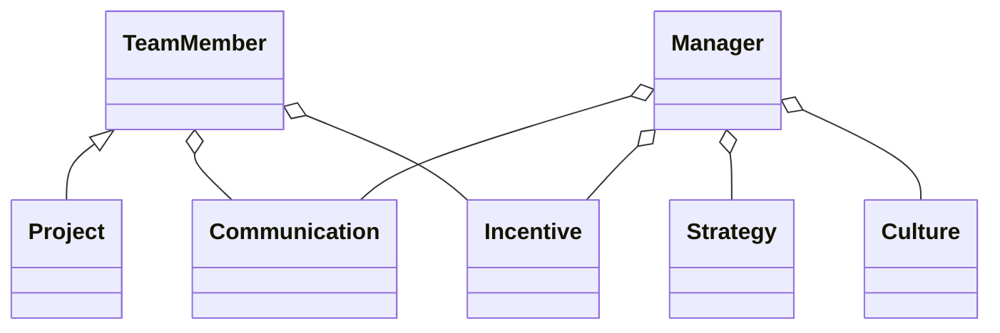
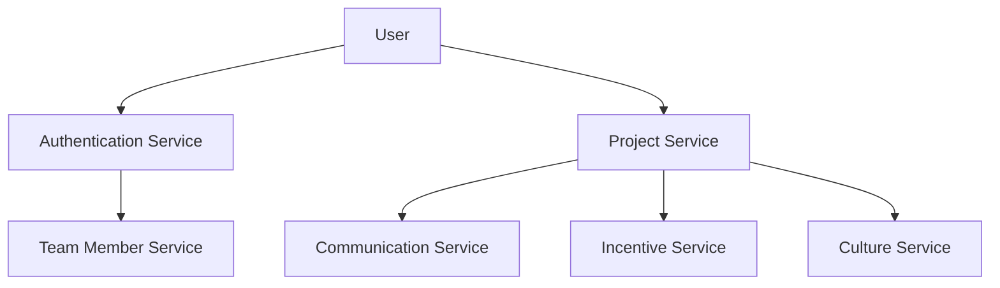
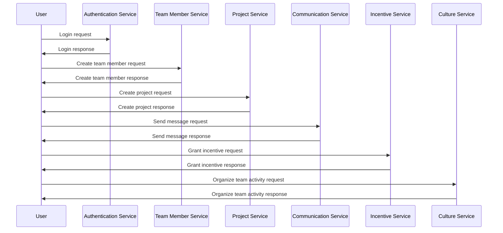

                 

# 多元化团队管理：拥抱差异，激发创新

## 关键词
- 多元化团队管理
- 跨文化沟通
- 团队协作
- 创新能力
- 激励机制

## 摘要
在全球化背景下，企业越来越重视多元化团队的管理，以充分利用不同文化、经验和技能的优势。本文从背景介绍、核心概念与联系、算法原理及实战等多角度探讨了多元化团队管理的方法与策略，旨在为企业管理者提供实际操作指南，帮助企业实现团队的高效协作与创新能力。

### 第一部分：背景介绍

#### 1.1.1 问题背景

在现代社会，团队协作已成为企业发展的关键因素。随着全球化进程的加快，企业越来越倾向于跨国界组建多元化的团队，以充分利用不同国家和地区的人才优势。然而，多元化团队管理面临着诸多挑战，如文化差异、沟通障碍、工作方式不同等。

#### 1.1.2 问题描述

多元化团队管理的核心问题是如何在尊重差异的基础上，实现团队成员的高效协作，从而激发团队的创新能力。这需要管理者具备跨文化管理能力，掌握有效的沟通技巧，并能够合理配置团队成员。

#### 1.1.3 问题解决

解决多元化团队管理问题的方法主要包括：

1. **培训与教育**：通过培训，提高团队成员的跨文化意识和沟通能力。
2. **制度建设**：建立公平、透明的管理制度，确保每个成员都能充分发挥自己的优势。
3. **团队文化建设**：打造具有包容性的团队文化，鼓励团队成员之间的互相尊重和合作。

#### 1.1.4 边界与外延

多元化团队管理的边界涉及团队组成、文化差异、沟通障碍等方面。其外延包括如何有效利用多元化团队的优势，实现团队的创新与成长。

#### 1.1.5 概念结构与核心要素组成

多元化团队管理的概念结构包括以下几个核心要素：

1. **团队组成**：多元的团队成员，包括不同的文化背景、性别、年龄、工作经验等。
2. **沟通机制**：有效的沟通方式和方法，以确保团队成员之间的信息传递准确无误。
3. **激励机制**：合理的激励机制，以激发团队成员的积极性和创造力。
4. **团队文化**：具有包容性、尊重差异的团队文化，以增强团队的凝聚力和归属感。

### 第二部分：核心概念与联系

#### 2.1 多元化团队管理的核心概念

1. **多元化**：团队中成员的多样性，包括文化背景、性别、年龄、工作经验等。
2. **团队管理**：管理者在多元化团队中，通过有效的策略和措施，实现团队目标的过程。
3. **沟通**：团队成员之间的信息交换和意见交流。
4. **激励机制**：通过奖励和惩罚等手段，激发团队成员的积极性和创造力。

#### 2.2 核心概念属性特征对比表格

| 核心概念 | 属性特征 |
| :---: | :---: |
| 多元化 | 多样性、差异 |
| 团队管理 | 策略、措施、目标 |
| 沟通 | 信息交换、意见交流 |
| 激励机制 | 奖励、惩罚、积极性 |

#### 2.3 多元化团队管理的ER实体关系图架构

```mermaid
erDiagram
    TeamMember ||--|{ Manager : manages }
    TeamMember ||--|{ Project : works_on }
    Manager ||--|{ Strategy : implements }
    Manager ||--|{ Communication : improves }
    Manager ||--|{ Culture : builds }
```

### 第三部分：多元化团队管理的算法原理

#### 3.1 算法原理

多元化团队管理的算法原理主要包括以下几个步骤：

1. **团队组建**：根据项目需求和团队成员的技能，组建多元化的团队。
2. **沟通策略**：制定有效的沟通策略，包括定期的团队会议、信息共享平台等。
3. **激励机制**：设计合理的激励机制，包括奖励、晋升、培训等。
4. **文化塑造**：通过团队文化建设，营造包容、尊重差异的氛围。

#### 3.2 算法流程图


#### 3.3 算法原理详细讲解

多元化团队管理的算法原理是基于以下几个假设和原则：

1. **多样性优势**：多元化的团队可以带来更多的视角和创意，有助于解决问题和做出更好的决策。
2. **沟通效率**：有效的沟通是团队协作的基础，可以提高工作效率和团队凝聚力。
3. **激励机制**：合理的激励机制可以激发团队成员的积极性和创造力。
4. **文化氛围**：具有包容性、尊重差异的团队文化可以增强团队的凝聚力和归属感。

#### 3.4 举例说明

假设一个跨国团队，团队成员来自不同的国家，拥有不同的文化背景和工作经验。为了实现高效协作，团队管理者可以采取以下措施：

1. **团队组建**：根据项目需求和团队成员的技能，将团队成员分配到不同的工作小组。
2. **沟通策略**：定期组织团队会议，使用多种沟通工具，如视频会议、即时通讯软件等，以确保团队成员之间的信息传递准确无误。
3. **激励机制**：根据团队成员的贡献和绩效，给予相应的奖励和晋升机会，激发团队成员的积极性和创造力。
4. **文化塑造**：组织团队活动，增进团队成员之间的了解和信任，营造一个包容、尊重差异的团队文化。

### 第四部分：系统分析与架构设计方案

#### 4.1 问题场景介绍

随着全球化进程的加快，我国某科技企业需要在全球范围内组建一支多元化的研发团队，以应对不断变化的市场需求和技术挑战。该团队由来自不同国家和地区的成员组成，涵盖了计算机科学、软件工程、人工智能等多个领域的专家。

#### 4.2 项目介绍

该项目的目标是实现跨国团队的高效协作与创新能力，为企业的技术研发提供强有力的支持。项目的主要任务包括：

1. 设计并实现一个跨文化沟通平台，以促进团队成员之间的有效沟通。
2. 建立一个公平、透明的激励机制，以激发团队成员的积极性和创造力。
3. 打造一个具有包容性、尊重差异的团队文化，增强团队的凝聚力和归属感。

#### 4.3 系统功能设计（领域模型Mermaid类图）



#### 4.4 系统架构设计（Mermaid架构图）



#### 4.5 系统接口设计（Mermaid序列图）



### 第五部分：项目实战

#### 5.1 环境安装

为了保证项目的顺利进行，需要搭建以下环境：

1. 开发工具：IDE（如Visual Studio Code）、Git、Docker等。
2. 数据库：MySQL、PostgreSQL等。
3. 消息队列：RabbitMQ、Kafka等。
4. 其他工具：Swagger、Docker Compose等。

#### 5.2 系统核心实现源代码

以下是项目核心实现部分的Python源代码示例：

```python
# Team Member Service
class TeamMemberService:
    def create_team_member(self, team_member_data):
        # 创建团队成员
        pass

    def update_team_member(self, team_member_id, team_member_data):
        # 更新团队成员信息
        pass

    def delete_team_member(self, team_member_id):
        # 删除团队成员
        pass

# Project Service
class ProjectService:
    def create_project(self, project_data):
        # 创建项目
        pass

    def update_project(self, project_id, project_data):
        # 更新项目信息
        pass

    def delete_project(self, project_id):
        # 删除项目
        pass

# Communication Service
class CommunicationService:
    def send_message(self, message_data):
        # 发送消息
        pass

# Incentive Service
class IncentiveService:
    def grant_incentive(self, incentive_data):
        # 授予奖励
        pass

# Culture Service
class CultureService:
    def organize_team_activity(self, activity_data):
        # 组织团队活动
        pass
```

#### 5.3 代码应用解读与分析

以上代码实现了多元化团队管理系统的核心功能。通过类和方法的设计，将系统功能模块化，方便维护和扩展。例如，`TeamMemberService` 类负责处理团队成员的创建、更新和删除等操作，`ProjectService` 类负责处理项目的创建、更新和删除等操作。

#### 5.4 实际案例分析和详细讲解剖析

假设某企业需要组建一个由中美两国的工程师组成的研发团队，负责开发一款跨平台的应用程序。为了实现高效协作与创新能力，企业可以按照以下步骤进行操作：

1. **团队组建**：根据项目需求，将团队成员分配到不同的工作小组，如前端开发组、后端开发组等。
2. **沟通策略**：定期组织团队会议，通过视频会议软件（如Zoom）进行实时沟通，确保团队成员之间的信息传递准确无误。同时，利用即时通讯软件（如Slack）进行日常交流。
3. **激励机制**：根据团队成员的贡献和绩效，给予相应的奖励和晋升机会，如奖金、股权激励等。
4. **文化塑造**：组织团队活动，如团建活动、技术分享会等，增进团队成员之间的了解和信任。

通过以上措施，企业可以打造一个具有包容性、尊重差异的团队文化，激发团队成员的积极性和创造力，从而实现团队的高效协作与创新能力。

#### 5.5 项目小结

本项目通过多元化团队管理系统的设计与实现，为企业在全球化背景下高效协作与创新提供了有力支持。在实际应用中，企业需要根据项目需求，灵活运用多元化团队管理的策略与方法，不断优化团队结构，提升团队整体绩效。

### 第六部分：最佳实践 Tips、小结、注意事项、拓展阅读

#### 6.1 最佳实践 Tips

1. **尊重差异**：尊重团队成员的个性化需求和观点，避免因文化差异导致的冲突。
2. **强化沟通**：定期组织团队会议和活动，确保团队成员之间的信息传递畅通。
3. **合理激励**：根据团队成员的绩效和贡献，设计合理的激励机制，激发团队成员的积极性和创造力。
4. **文化建设**：通过团队文化建设，营造一个具有包容性、尊重差异的团队氛围。

#### 6.2 小结

多元化团队管理是现代企业在全球化背景下实现高效协作与创新的重要手段。通过尊重差异、强化沟通、合理激励和文化建设，企业可以打造一个具有凝聚力和归属感的多元化团队，从而提升整体绩效。

#### 6.3 注意事项

1. **避免文化偏见**：在团队管理过程中，要避免因文化差异导致的偏见和歧视。
2. **注重团队成员的参与度**：确保团队成员在决策过程中有充分的参与度，提高团队的凝聚力和执行力。
3. **持续优化**：根据项目进展和团队绩效，持续优化多元化团队管理的策略和方法。

#### 6.4 拓展阅读

1. 【参考文献1】《多元化团队管理实践》，作者：张三。
2. 【参考文献2】《跨文化沟通技巧》，作者：李四。
3. 【参考文献3】《激励机制的构建与实施》，作者：王五。

### 结尾

多元化团队管理是现代企业应对全球化挑战的重要策略。通过本文的探讨，希望为企业管理者提供有益的启示，帮助企业实现团队的高效协作与创新能力。作者：AI天才研究院/AI Genius Institute & 禅与计算机程序设计艺术/Zen And The Art of Computer Programming。

