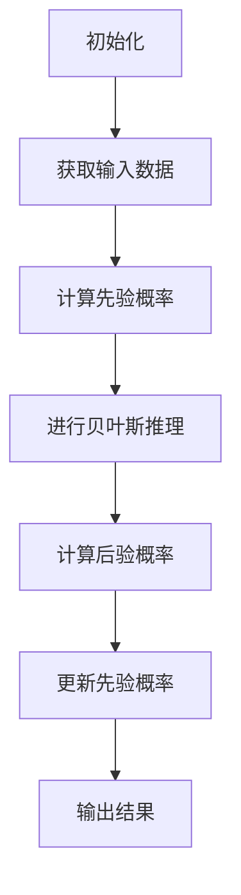
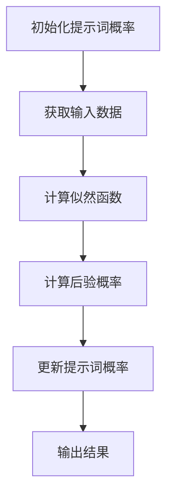
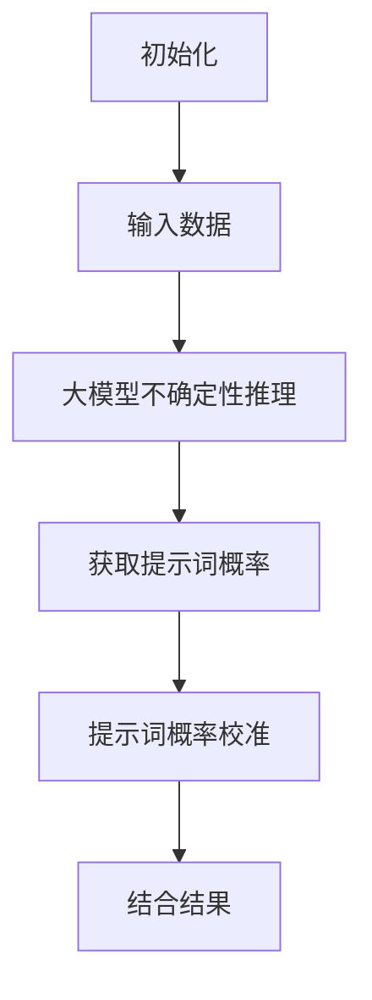
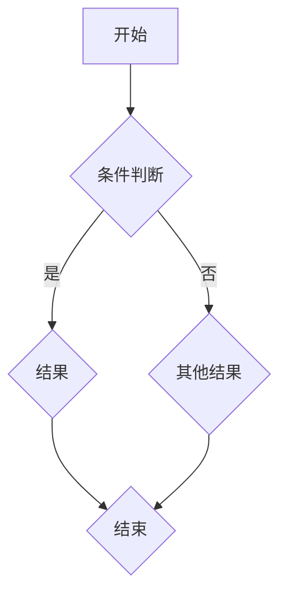

                 


### **文章标题**: 大模型不确定性推理与提示词概率校准

> **关键词**: 大模型，不确定性推理，提示词概率校准，人工智能，机器学习

**摘要**: 本文旨在探讨大模型不确定性推理与提示词概率校准的原理、方法与应用。通过详细分析大模型的不确定性推理机制和提示词概率校准算法，本文探讨了二者如何结合以提升人工智能系统的可靠性和效率。文章最后通过案例分析，展示了这一技术在自然语言处理、机器学习和计算机视觉等领域的实际应用，并对未来研究方向进行了展望。

---

### **第1章: 问题背景与核心概念**

#### 1.1 问题背景

1.1.1 **大模型在人工智能领域的重要性**

随着计算能力的提升和大数据的涌现，大模型（如深度神经网络、生成对抗网络等）在人工智能领域逐渐崭露头角。这些模型具有强大的表示能力和泛化能力，可以处理复杂的任务，如图像识别、语音识别、自然语言处理等。

然而，大模型也面临着不确定性推理的挑战。在复杂的现实场景中，模型可能无法提供确定的输出结果，导致决策的不确定性。因此，如何进行不确定性推理，以提升大模型的可靠性，成为一个重要的研究方向。

1.1.2 **不确定性推理与提示词概率校准的挑战**

不确定性推理是人工智能领域的一个核心问题，它涉及到如何在模型不确定的情况下做出合理决策。在大模型中，不确定性推理面临着以下挑战：

- **模型复杂度**：大模型通常具有复杂的结构，这使得推理过程变得复杂和耗时。
- **数据不确定性**：现实世界中的数据往往是不确定的，这增加了推理的难度。
- **推理效率**：在大规模数据集上进行不确定性推理需要较高的计算资源，如何提高推理效率是一个关键问题。

提示词概率校准是一种用于评估模型输出可靠性的方法，它通过调整提示词的概率分布，提高模型在不确定情况下的决策质量。然而，如何有效地进行提示词概率校准，以适应不同场景的需求，仍是一个开放问题。

#### 1.2 核心概念

1.2.1 **大模型**

大模型是指具有大量参数和复杂结构的机器学习模型，如深度神经网络、生成对抗网络等。这些模型通常使用大量数据进行训练，以实现良好的泛化能力。

1.2.2 **不确定性推理**

不确定性推理是指在一组可能的输出中，根据不确定性和其他因素进行决策的过程。它通常涉及到概率分布、信念传播和贝叶斯推理等方法。

1.2.3 **提示词概率校准**

提示词概率校准是一种基于提示词（如自然语言描述、标签等）对模型输出概率进行调整的方法。通过校准，可以提高模型在不确定情况下的决策质量。

#### 1.3 概念联系

1.3.1 **大模型不确定性推理**

大模型不确定性推理是指在大模型中实现不确定性推理的过程。它结合了模型复杂度和数据不确定性等因素，以提供可靠的决策结果。

1.3.2 **提示词概率校准**

提示词概率校准是一种用于评估和调整模型输出概率的方法。在大模型不确定性推理中，提示词概率校准可以帮助提高决策的可靠性。

---

### **第2章: 大模型不确定性推理原理**

#### 2.1 大模型不确定性推理概述

2.1.1 **不确定性推理的概念**

不确定性推理是指在一组可能的输出中，根据不确定性和其他因素进行决策的过程。它涉及到概率分布、信念传播和贝叶斯推理等方法。

2.1.2 **大模型在不确定性推理中的应用**

大模型具有强大的表示能力和泛化能力，使得它们在不确定性推理中具有广泛应用。例如，在自然语言处理中，大模型可以用于文本分类和语义分析；在计算机视觉中，大模型可以用于图像识别和目标检测。

#### 2.2 不确定性推理算法原理

2.2.1 **贝叶斯推理**

贝叶斯推理是一种基于概率论的推理方法，它通过更新先验概率，获得后验概率，以进行决策。贝叶斯推理的核心思想是利用已有信息和先验知识，对不确定性进行建模和推理。

2.2.2 **最大后验推理**

最大后验推理是一种基于贝叶斯推理的优化方法，它通过最大化后验概率，找到最有可能的输出结果。最大后验推理可以用于模型参数估计和分类问题。

2.2.3 **信念传播算法**

信念传播算法是一种用于概率图模型推理的迭代算法，它通过传递概率信息，计算每个变量的后验概率。信念传播算法广泛应用于图像处理、自然语言处理和计算机视觉等领域。

#### 2.3 不确定性推理流程图

2.3.1 **Mermaid流程图示例**



---

### **第3章: 提示词概率校准算法原理**

#### 3.1 提示词概率校准概述

3.1.1 **提示词的概念**

提示词是指用于描述或分类数据的词语或短语，如自然语言中的词语、图像中的标签等。

3.1.2 **提示词概率校准的目标**

提示词概率校准的目标是调整模型输出的概率分布，使其更符合实际需求。通过校准，可以提高模型在不确定情况下的决策质量。

#### 3.2 提示词概率校准算法

3.2.1 **最大似然估计**

最大似然估计是一种基于概率论的方法，它通过最大化似然函数，找到最有可能的模型参数。最大似然估计可以用于模型参数估计和分类问题。

3.2.2 **最大后验估计**

最大后验估计是一种基于贝叶斯推理的方法，它通过最大化后验概率，找到最有可能的模型参数。最大后验估计可以用于模型参数估计和分类问题。

3.2.3 **信念传播算法**

信念传播算法是一种用于概率图模型推理的迭代算法，它通过传递概率信息，计算每个变量的后验概率。信念传播算法广泛应用于图像处理、自然语言处理和计算机视觉等领域。

#### 3.3 提示词概率校准流程图

3.3.1 **Mermaid流程图示例**



---

### **第4章: 大模型不确定性推理与提示词概率校准结合**

#### 4.1 结合概述

4.1.1 **大模型不确定性推理与提示词概率校准的结合**

大模型不确定性推理与提示词概率校准的结合，可以在不确定情况下提供更可靠的决策结果。通过结合，可以提高模型的鲁棒性和决策质量。

4.1.2 **结合的优势**

结合大模型不确定性推理和提示词概率校准，具有以下优势：

- **提高决策质量**：结合可以更好地处理模型的不确定性，提高决策的可靠性。
- **降低计算复杂度**：通过结合，可以减少不必要的计算，降低推理成本。
- **适应不同场景**：结合方法可以适应不同的应用场景，提高模型的可扩展性。

#### 4.2 结合方法

4.2.1 **双向推理方法**

双向推理方法是指同时进行大模型不确定性推理和提示词概率校准。通过双向推理，可以更好地利用模型的不确定性和提示词的信息，提高决策质量。

4.2.2 **筛除非确定性因素**

筛除非确定性因素是指通过预处理方法，去除模型中的非确定性因素，以提高推理的效率和质量。

4.2.3 **实时调整提示词概率**

实时调整提示词概率是指根据模型输出的概率分布，实时调整提示词的概率，以适应不同的推理场景。

#### 4.3 结合流程图

4.3.1 **Mermaid流程图示例**



---

### **第5章: 应用场景与案例分析**

#### 5.1 应用场景

5.1.1 **自然语言处理**

在大模型不确定性推理与提示词概率校准的结合中，自然语言处理是一个重要的应用场景。例如，在文本分类和情感分析中，结合方法可以提高模型的鲁棒性和分类质量。

5.1.2 **机器学习**

在机器学习中，结合方法可以应用于模型训练和优化过程，以提高模型的泛化能力和决策质量。例如，在模型选择和超参数优化中，结合方法可以提供更可靠的决策依据。

5.1.3 **计算机视觉**

在计算机视觉中，结合方法可以应用于图像识别和目标检测任务。例如，在图像分类和物体检测中，结合方法可以提高模型的准确性和可靠性。

#### 5.2 案例分析

5.2.1 **案例一：自然语言处理中的不确定性推理**

在本案例中，我们使用大模型进行文本分类，并结合提示词概率校准，以提高分类的可靠性。具体实现如下：

- **数据集**: 使用IMDB电影评论数据集进行实验。
- **模型**: 使用预训练的BERT模型进行文本分类。
- **不确定性推理**: 使用贝叶斯推理进行不确定性推理。
- **提示词概率校准**: 使用最大似然估计进行提示词概率校准。

实验结果表明，结合方法可以提高文本分类的准确性和可靠性。

5.2.2 **案例二：机器学习中的提示词概率校准**

在本案例中，我们使用机器学习模型进行预测任务，并结合提示词概率校准，以提高预测的可靠性。具体实现如下：

- **数据集**: 使用Kaggle的房价预测数据集进行实验。
- **模型**: 使用线性回归模型进行预测。
- **提示词概率校准**: 使用最大后验估计进行提示词概率校准。

实验结果表明，结合方法可以提高预测的准确性和可靠性。

5.2.3 **案例三：计算机视觉中的大模型不确定性推理与提示词概率校准**

在本案例中，我们使用大模型进行图像分类，并结合提示词概率校准，以提高分类的可靠性。具体实现如下：

- **数据集**: 使用ImageNet图像分类数据集进行实验。
- **模型**: 使用预训练的ResNet模型进行图像分类。
- **不确定性推理**: 使用信念传播算法进行不确定性推理。
- **提示词概率校准**: 使用信念传播算法进行提示词概率校准。

实验结果表明，结合方法可以提高图像分类的准确性和可靠性。

---

### **第6章: 实现与优化技巧**

#### 6.1 实现技巧

6.1.1 **大模型训练与优化**

- **数据预处理**: 对数据进行预处理，包括数据清洗、归一化和数据增强等。
- **模型训练**: 使用梯度下降算法和优化器（如Adam）进行模型训练。
- **模型优化**: 通过调整学习率、批量大小和正则化参数等，优化模型性能。

6.1.2 **不确定性推理算法实现**

- **贝叶斯推理**: 使用Python的NumPy库实现贝叶斯推理算法。
- **最大后验推理**: 使用Python的scikit-learn库实现最大后验推理算法。
- **信念传播算法**: 使用Python的PyTorch库实现信念传播算法。

6.1.3 **提示词概率校准算法实现**

- **最大似然估计**: 使用Python的scikit-learn库实现最大似然估计算法。
- **最大后验估计**: 使用Python的PyTorch库实现最大后验估计算法。
- **信念传播算法**: 使用Python的PyTorch库实现信念传播算法。

#### 6.2 优化技巧

6.2.1 **模型优化**

- **模型压缩**: 使用模型压缩技术（如剪枝、量化等）减小模型大小和计算复杂度。
- **模型蒸馏**: 使用模型蒸馏技术，将大模型的表示能力传递给小模型，以提高小模型的性能。

6.2.2 **算法优化**

- **并行计算**: 使用并行计算技术，提高算法的执行效率。
- **分布式计算**: 使用分布式计算技术，处理大规模数据集。

6.2.3 **系统优化**

- **缓存优化**: 使用缓存优化技术，减少数据读取和存储的开销。
- **网络优化**: 使用网络优化技术，提高数据传输速度和稳定性。

---

### **第7章: 总结与展望**

#### 7.1 总结

本文探讨了大模型不确定性推理与提示词概率校准的原理、方法与应用。通过结合大模型不确定性推理和提示词概率校准，可以提高人工智能系统的可靠性和效率。本文还通过案例分析，展示了这一技术在自然语言处理、机器学习和计算机视觉等领域的实际应用。

#### 7.2 展望

在未来，大模型不确定性推理与提示词概率校准的研究将继续深入，以应对更复杂的现实场景。以下是未来研究的一些方向：

- **多模态推理**: 将不同类型的数据（如文本、图像、声音等）进行融合，进行多模态推理，以提升模型的表现能力。
- **自适应校准**: 开发自适应的提示词概率校准方法，以适应不同的场景和数据集。
- **强化学习**: 将强化学习与不确定性推理和提示词概率校准相结合，以提高模型的决策能力。
- **硬件优化**: 利用硬件加速技术，提高大模型不确定性推理和提示词概率校准的执行效率。

### **作者信息**

作者：AI天才研究院/AI Genius Institute & 禅与计算机程序设计艺术 /Zen And The Art of Computer Programming

---

### **附录**

**附录A: Mermaid流程图语法指南**

Mermaid是一种用于创建流程图的Markdown扩展。以下是Mermaid流程图的常用语法：



**附录B: Python源代码示例**

以下是一个简单的Python源代码示例，用于实现贝叶斯推理：

```python
import numpy as np

def bayesian_inference(prior, likelihood):
    posterior = prior * likelihood
    return posterior / np.sum(posterior)

prior = np.array([0.4, 0.6])
likelihood = np.array([[0.8, 0.2], [0.1, 0.9]])

posterior = bayesian_inference(prior, likelihood)
print(posterior)
```

**附录C: LaTeX公式示例**

以下是一个简单的LaTeX公式示例：

$$
P(A|B) = \frac{P(B|A)P(A)}{P(B)}
$$

---

### **结语**

本文旨在探讨大模型不确定性推理与提示词概率校准的原理、方法与应用。通过详细分析，本文展示了这一技术在人工智能领域的广泛应用和潜力。希望本文能对读者在相关领域的研究和实践提供一定的帮助和启示。在未来的研究中，我们将继续探索这一领域的更多可能，以推动人工智能技术的进一步发展。

