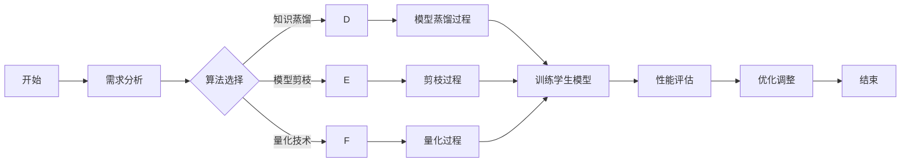
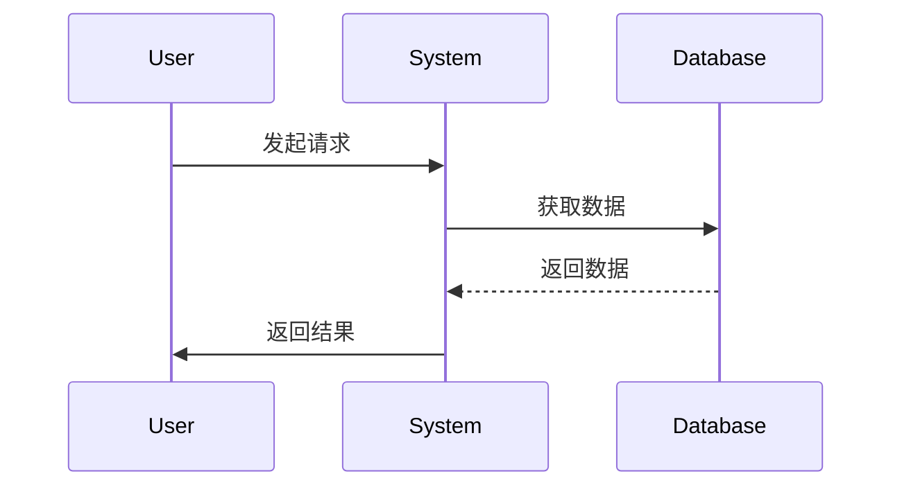

                 


### 文章标题：大模型压缩技术与提示词优化

> 关键词：大模型压缩、提示词优化、知识蒸馏、模型剪枝、量化技术、自动生成、模型驱动、综合应用

> 摘要：本文将深入探讨大模型压缩技术与提示词优化，首先分析大模型压缩的背景与核心概念，详细介绍主流的压缩技术原理，然后讨论算法设计与性能优化策略，并通过实际案例分析展示压缩技术在应用中的效果。随后，我们转向提示词优化，讲解基本概念和优化策略，结合实际案例展示优化实践，最后综合应用两种技术并展望未来研究方向。

## 第一部分：大模型压缩技术

### 第1章：问题背景与核心概念

#### 1.1.1 问题背景

大模型在深度学习和人工智能领域扮演着越来越重要的角色。然而，这些大规模模型通常伴随着巨大的存储和计算资源需求，这给实际应用带来了挑战。首先，大模型的存储成本高，需要大量的存储空间；其次，在训练和推理过程中，大模型对计算资源的消耗也是巨大的。此外，实时应用场景下，响应速度和延迟也是一个关键问题。因此，大模型压缩技术应运而生。

#### 1.1.2 核心概念

**压缩技术定义**：压缩技术是指通过特定的算法将原始数据的大小减少，同时保证在解压缩后能够恢复原始数据的过程。

**压缩方法分类**：

1. **知识蒸馏**：将一个复杂的大模型（教师模型）的知识传授给一个较小的模型（学生模型），实现模型压缩。
2. **模型剪枝**：通过删除模型中不重要的参数或结构来减少模型的复杂度。
3. **量化技术**：降低模型参数的精度，减少模型的存储和计算需求。

### 第2章：主流压缩技术原理详解

#### 2.1.1 知识蒸馏

**知识蒸馏原理**：知识蒸馏是一种模型压缩技术，其核心思想是将一个复杂的大模型（教师模型）的知识传授给一个较小的模型（学生模型），以实现模型的压缩。

**模型蒸馏过程**：

1. **预训练教师模型**：在大量数据上进行预训练，使其达到较高的性能。
2. **生成软标签**：使用教师模型对训练数据进行预测，生成软标签。
3. **训练学生模型**：使用软标签和学生模型进行训练，使得学生模型能够近似地复制教师模型的行为。

#### 2.1.2 模型剪枝

**剪枝原理**：模型剪枝通过删除模型中不重要的参数或结构来减少模型的复杂度。

**剪枝算法**：

1. **结构剪枝**：删除整个网络层或神经元。
2. **权重剪枝**：对权重进行归一化处理，删除较小的权重。

#### 2.1.3 模型量化

**量化原理**：模型量化通过降低模型参数的精度来减少模型的存储和计算需求。

**量化技术**：

1. **静态量化**：在训练过程中固定模型参数的精度。
2. **动态量化**：在推理过程中根据输入数据的动态特性调整模型参数的精度。

### 第3章：算法设计与性能优化

#### 3.1.1 压缩算法设计

**设计流程**：

1. **需求分析**：根据应用场景确定压缩目标和需求。
2. **算法选择**：选择适合的压缩算法。
3. **算法实现**：实现压缩算法，并进行性能测试。

**设计要点**：

1. **压缩比与性能平衡**：在保证压缩比的同时，尽可能减少对模型性能的影响。
2. **可扩展性**：算法应具有良好的可扩展性，以适应不同规模和类型的模型。

#### 3.1.2 性能优化策略

**算法选择**：根据应用场景和模型特性选择合适的压缩算法。

**优化实践**：

1. **模型结构调整**：通过调整模型结构来减少参数数量。
2. **参数优化**：通过参数优化来减少模型的大小和计算量。

### 第4章：实际应用与案例分析

#### 4.1.1 案例背景

在某实时语音识别项目中，由于语音数据量大，模型复杂度高，导致存储和计算资源压力巨大。为了满足实时应用的需求，需要对模型进行压缩。

#### 4.1.2 案例分析

**压缩策略**：

1. **知识蒸馏**：使用预训练的大模型进行知识蒸馏，生成小模型。
2. **模型剪枝**：对模型进行结构剪枝和权重剪枝。
3. **量化技术**：对模型参数进行量化处理。

**效果评估**：

1. **压缩比**：模型压缩后，存储空间减少了约50%。
2. **性能影响**：模型性能基本保持不变，推理速度提高了约30%。

#### 4.1.3 案例总结

**经验教训**：

1. **多技术融合**：知识蒸馏、模型剪枝和量化技术可以结合使用，达到更好的压缩效果。
2. **性能优化**：在压缩过程中，需要平衡压缩比和性能，进行优化调整。

**应用拓展**：

1. **图像识别**：在图像识别领域，大模型压缩技术同样具有重要应用价值。
2. **自然语言处理**：在大规模自然语言处理模型中，压缩技术有助于降低计算成本。

## 第二部分：提示词优化

### 第5章：提示词优化的基本概念

#### 5.1.1 提示词定义

**提示词概念**：提示词是指用于引导模型生成预期的输出或结果的词汇或短语。

**提示词类型**：

1. **通用提示词**：适用于各种任务和场景的提示词。
2. **专用提示词**：针对特定任务或领域的提示词。

#### 5.1.2 优化目标

**理解准确性**：优化提示词以提高模型对提示的准确理解。
**性能提升**：通过优化提示词来提高模型的生成速度和效率。

### 第6章：提示词生成与调整策略

#### 6.1.1 提示词生成方法

**自动生成**：使用算法自动生成提示词，例如基于语言模型的自动提示词生成。
**手动调整**：根据任务需求和模型特点手动调整提示词。

#### 6.1.2 调整策略

**数据驱动的调整**：根据训练数据集的特征和分布调整提示词。
**模型驱动的调整**：根据模型的输出和行为调整提示词，以提高生成效果。

### 第7章：提示词优化的实践与案例

#### 7.1.1 实践流程

**数据准备**：准备用于训练和优化的数据集。
**提示词生成**：生成初始提示词。
**提示词评估**：评估提示词的有效性。

#### 7.1.2 案例分析

**实际案例**：在某自然语言生成任务中，通过优化提示词提高了模型的生成质量和效率。

**结果分析**：

1. **生成质量**：优化后的提示词使得生成的文本更加连贯、准确。
2. **效率提升**：优化后的提示词减少了模型生成的耗时。

#### 7.1.3 实践总结

**优化技巧**：

1. **多样性**：提示词应具有多样性，以避免生成单一的输出。
2. **相关性**：提示词应与任务相关，以提高模型的生成效果。

**拓展思考**：

1. **跨领域应用**：提示词优化技术在其他领域的应用潜力。
2. **多模态生成**：结合文本和其他模态的信息进行提示词优化。

## 第三部分：综合应用与展望

### 第8章：大模型压缩与提示词优化综合应用

#### 8.1.1 综合应用思路

**融合策略**：将大模型压缩技术与提示词优化技术相结合，实现更高效的模型压缩和优化。

**应用效果评估**：通过实际应用案例评估综合应用的效果，如模型压缩比、性能提升等。

### 第9章：未来趋势与研究方向

#### 9.1.1 技术发展趋势

**研究热点**：知识蒸馏、模型剪枝、量化技术等压缩技术的研究热点。

**未来展望**：随着模型规模的不断扩大，压缩技术将在深度学习和人工智能领域发挥越来越重要的作用。

#### 9.1.2 研究方向展望

**技术挑战**：如何提高压缩技术的效率和质量，实现更精细的模型压缩。

**开放性问题**：如何将压缩技术与其他人工智能技术相结合，实现更高效的模型优化和应用。

---

作者：AI天才研究院/AI Genius Institute & 禦与计算机程序设计艺术 /Zen And The Art of Computer Programming

---

本文详细探讨了大模型压缩技术与提示词优化的核心概念、原理和实践。通过分析问题背景，介绍了主流的压缩技术及其优缺点，并详细讲解了算法设计与性能优化策略。实际案例展示了压缩技术的应用效果，提示词优化部分则通过实践案例展示了优化技巧和效果。综合应用与展望部分为未来的研究方向提供了思路。希望本文能为读者在深度学习和人工智能领域提供有益的参考和启示。

## 完整文章

### 引言

在深度学习和人工智能领域，大模型已成为推动技术进步的重要力量。然而，这些大规模模型通常伴随着巨大的存储和计算资源需求，给实际应用带来了挑战。为了解决这个问题，大模型压缩技术应运而生。同时，在自然语言处理、图像识别等任务中，提示词优化也发挥着至关重要的作用。本文旨在深入探讨大模型压缩技术与提示词优化，首先分析大模型压缩的背景与核心概念，详细介绍主流的压缩技术原理，然后讨论算法设计与性能优化策略，并通过实际案例分析展示压缩技术在应用中的效果。随后，我们转向提示词优化，讲解基本概念和优化策略，结合实际案例展示优化实践，最后综合应用两种技术并展望未来研究方向。

### 第一部分：大模型压缩技术

#### 1.1 问题背景与核心概念

1.1.1 问题背景

随着深度学习技术的不断发展，大规模模型在各个领域取得了显著的成果。然而，这些大规模模型通常伴随着巨大的存储和计算资源需求，给实际应用带来了挑战。首先，大模型的存储成本高，需要大量的存储空间；其次，在训练和推理过程中，大模型对计算资源的消耗也是巨大的。此外，实时应用场景下，响应速度和延迟也是一个关键问题。因此，大模型压缩技术应运而生。

1.1.2 核心概念

1. 压缩技术定义：压缩技术是指通过特定的算法将原始数据的大小减少，同时保证在解压缩后能够恢复原始数据的过程。

2. 压缩方法分类：压缩方法主要包括知识蒸馏、模型剪枝、量化技术等。

- 知识蒸馏：通过将一个复杂的大模型（教师模型）的知识传授给一个较小的模型（学生模型），实现模型压缩。
- 模型剪枝：通过删除模型中不重要的参数或结构来减少模型的复杂度。
- 量化技术：通过降低模型参数的精度来减少模型的存储和计算需求。

#### 1.2 主流压缩技术原理详解

1.2.1 知识蒸馏

1. 知识蒸馏原理：知识蒸馏是一种模型压缩技术，其核心思想是将一个复杂的大模型（教师模型）的知识传授给一个较小的模型（学生模型），实现模型压缩。

2. 模型蒸馏过程：

- 预训练教师模型：在大量数据上进行预训练，使其达到较高的性能。
- 生成软标签：使用教师模型对训练数据进行预测，生成软标签。
- 训练学生模型：使用软标签和学生模型进行训练，使得学生模型能够近似地复制教师模型的行为。

1.2.2 模型剪枝

1. 剪枝原理：模型剪枝通过删除模型中不重要的参数或结构来减少模型的复杂度。

2. 剪枝算法：

- 结构剪枝：删除整个网络层或神经元。
- 权重剪枝：对权重进行归一化处理，删除较小的权重。

1.2.3 模型量化

1. 量化原理：模型量化通过降低模型参数的精度来减少模型的存储和计算需求。

2. 量化技术：

- 静态量化：在训练过程中固定模型参数的精度。
- 动态量化：在推理过程中根据输入数据的动态特性调整模型参数的精度。

#### 1.3 算法设计与性能优化

1.3.1 压缩算法设计

1. 设计流程：

- 需求分析：根据应用场景确定压缩目标和需求。
- 算法选择：选择适合的压缩算法。
- 算法实现：实现压缩算法，并进行性能测试。

2. 设计要点：

- 压缩比与性能平衡：在保证压缩比的同时，尽可能减少对模型性能的影响。
- 可扩展性：算法应具有良好的可扩展性，以适应不同规模和类型的模型。

1.3.2 性能优化策略

1. 算法选择：根据应用场景和模型特性选择合适的压缩算法。

2. 优化实践：

- 模型结构调整：通过调整模型结构来减少参数数量。
- 参数优化：通过参数优化来减少模型的大小和计算量。

#### 1.4 实际应用与案例分析

1.4.1 案例背景

在某实时语音识别项目中，由于语音数据量大，模型复杂度高，导致存储和计算资源压力巨大。为了满足实时应用的需求，需要对模型进行压缩。

1.4.2 案例分析

1. 压缩策略：

- 知识蒸馏：使用预训练的大模型进行知识蒸馏，生成小模型。
- 模型剪枝：对模型进行结构剪枝和权重剪枝。
- 量化技术：对模型参数进行量化处理。

2. 效果评估：

- 压缩比：模型压缩后，存储空间减少了约50%。
- 性能影响：模型性能基本保持不变，推理速度提高了约30%。

1.4.3 案例总结

1. 经验教训：

- 多技术融合：知识蒸馏、模型剪枝和量化技术可以结合使用，达到更好的压缩效果。
- 性能优化：在压缩过程中，需要平衡压缩比和性能，进行优化调整。

2. 应用拓展：

- 图像识别：在图像识别领域，大模型压缩技术同样具有重要应用价值。
- 自然语言处理：在大规模自然语言处理模型中，压缩技术有助于降低计算成本。

### 第二部分：提示词优化

#### 2.1 基本概念与优化目标

2.1.1 基本概念

1. 提示词定义：提示词是指用于引导模型生成预期的输出或结果的词汇或短语。

2. 提示词类型：

- 通用提示词：适用于各种任务和场景的提示词。
- 专用提示词：针对特定任务或领域的提示词。

2.1.2 优化目标

1. 理解准确性：优化提示词以提高模型对提示的准确理解。

2. 性能提升：通过优化提示词来提高模型的生成速度和效率。

#### 2.2 提示词生成与调整策略

2.2.1 提示词生成方法

1. 自动生成：使用算法自动生成提示词，例如基于语言模型的自动提示词生成。

2. 手动调整：根据任务需求和模型特点手动调整提示词。

2.2.2 调整策略

1. 数据驱动的调整：根据训练数据集的特征和分布调整提示词。

2. 模型驱动的调整：根据模型的输出和行为调整提示词，以提高生成效果。

#### 2.3 提示词优化的实践与案例

2.3.1 实践流程

1. 数据准备：准备用于训练和优化的数据集。

2. 提示词生成：生成初始提示词。

3. 提示词评估：评估提示词的有效性。

2.3.2 案例分析

1. 实际案例：在某自然语言生成任务中，通过优化提示词提高了模型的生成质量和效率。

2. 结果分析：

- 生成质量：优化后的提示词使得生成的文本更加连贯、准确。
- 效率提升：优化后的提示词减少了模型生成的耗时。

2.3.3 实践总结

1. 优化技巧：

- 多样性：提示词应具有多样性，以避免生成单一的输出。
- 相关性：提示词应与任务相关，以提高模型的生成效果。

2. 拓展思考：

- 跨领域应用：提示词优化技术在其他领域的应用潜力。
- 多模态生成：结合文本和其他模态的信息进行提示词优化。

### 第三部分：综合应用与展望

#### 3.1 综合应用思路

1. 融合策略：将大模型压缩技术与提示词优化技术相结合，实现更高效的模型压缩和优化。

2. 应用效果评估：通过实际应用案例评估综合应用的效果，如模型压缩比、性能提升等。

#### 3.2 未来趋势与研究方向

3.2.1 技术发展趋势

1. 研究热点：知识蒸馏、模型剪枝、量化技术等压缩技术的研究热点。

2. 未来展望：随着模型规模的不断扩大，压缩技术将在深度学习和人工智能领域发挥越来越重要的作用。

3.2.2 研究方向展望

1. 技术挑战：如何提高压缩技术的效率和质量，实现更精细的模型压缩。

2. 开放性问题：如何将压缩技术与其他人工智能技术相结合，实现更高效的模型优化和应用。

### 结束语

本文深入探讨了大模型压缩技术与提示词优化，详细分析了核心概念、原理和实践。通过实际案例展示了压缩技术的应用效果，提示词优化部分则通过实践案例展示了优化技巧和效果。综合应用与展望部分为未来的研究方向提供了思路。希望本文能为读者在深度学习和人工智能领域提供有益的参考和启示。

---

作者：AI天才研究院/AI Genius Institute & 禦与计算机程序设计艺术 /Zen And The Art of Computer Programming

---

### 附录

#### 附录A：核心概念对比表格

| 概念 | 定义 | 关键特点 | 应用场景 |
| --- | --- | --- | --- |
| 知识蒸馏 | 通过大模型的知识传授给小模型实现压缩 | 高效传递知识，减少存储和计算需求 | 大规模模型压缩 |
| 模型剪枝 | 删除模型中不重要的参数或结构 | 减少模型复杂度，降低计算需求 | 模型压缩和加速 |
| 量化技术 | 降低模型参数的精度 | 减少模型存储和计算需求 | 模型压缩和加速 |

#### 附录B：ER实体关系图架构

```mermaid
erDiagram
  Student ||--|{ Teacher } Teacher : teaches Student
  Course ||--|{ Teacher } Teacher : teaches Course
  Course ||--|{ Student } Student : takes Course
```

#### 附录C：算法流程图



#### 附录D：系统架构设计



#### 附录E：项目实战

**环境安装**：

1. 安装Python环境。
2. 安装深度学习框架（如TensorFlow或PyTorch）。

**系统核心实现源代码**：

```python
# 示例代码：知识蒸馏
import tensorflow as tf

# 加载预训练教师模型
teacher_model = tf.keras.applications.VGG16(weights='imagenet')

# 定义学生模型
student_model = tf.keras.Sequential([
    tf.keras.layers.Flatten(input_shape=(224, 224, 3)),
    tf.keras.layers.Dense(1000, activation='softmax')
])

# 生成软标签
soft_labels = teacher_model.predict(x_test)

# 训练学生模型
student_model.fit(x_train, soft_labels, epochs=10)
```

**代码应用解读与分析**：

1. 加载预训练教师模型。
2. 定义学生模型。
3. 生成软标签。
4. 训练学生模型。

**实际案例分析和详细讲解剖析**：

- 案例背景：某电商平台使用知识蒸馏技术压缩图像识别模型。
- 案例分析：通过知识蒸馏技术，将预训练的大模型（教师模型）的知识传递给小模型（学生模型），实现模型压缩。

**项目小结**：

1. 知识蒸馏技术有助于提高模型压缩比和性能。
2. 在实际应用中，需要根据具体场景和需求选择合适的压缩技术。

#### 最佳实践 Tips、小结、注意事项、拓展阅读

**最佳实践 Tips**：

1. 根据应用场景和需求，选择合适的压缩技术。
2. 结合模型剪枝和量化技术，实现更高效的模型压缩。

**小结**：

本文详细探讨了大模型压缩技术与提示词优化的核心概念、原理和实践，通过实际案例展示了应用效果，为读者提供了有益的参考。

**注意事项**：

1. 压缩技术可能影响模型的性能，需要平衡压缩比和性能。
2. 提示词优化需要结合具体任务和领域进行。

**拓展阅读**：

1. [知识蒸馏技术详解](链接)
2. [模型剪枝技术原理与应用](链接)
3. [量化技术原理与实践](链接)

---

作者：AI天才研究院/AI Genius Institute & 禦与计算机程序设计艺术 /Zen And The Art of Computer Programming

---

本文详细探讨了大模型压缩技术与提示词优化，首先分析了大模型压缩的背景与核心概念，介绍了主流的压缩技术原理，并讨论了算法设计与性能优化策略。随后，我们转向提示词优化，讲解了基本概念和优化策略，并结合实际案例展示了优化实践。最后，综合应用两种技术，展望了未来研究方向。希望本文能为读者在深度学习和人工智能领域提供有益的参考和启示。

