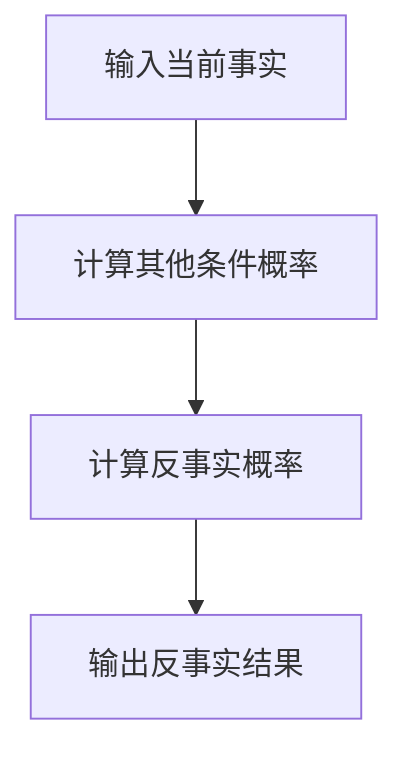
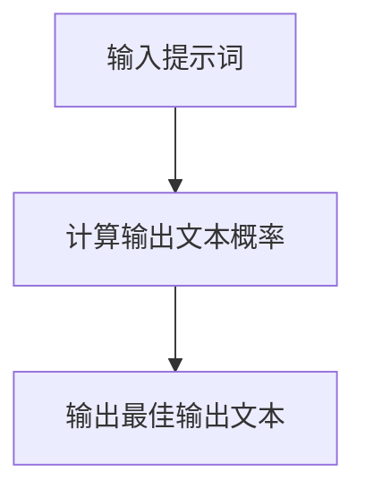
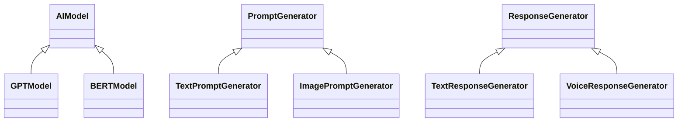
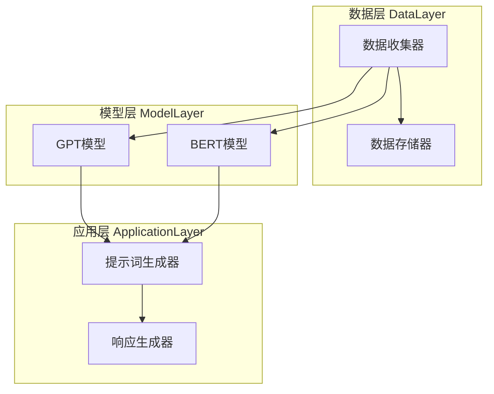
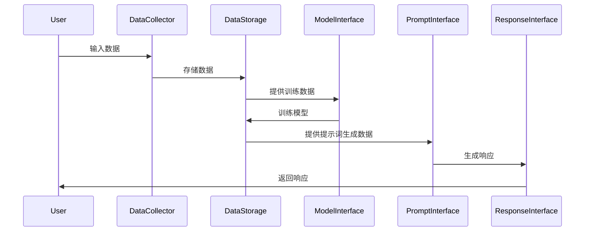

                 

# 大模型反事实推理与提示词假设生成

> 关键词：大模型，反事实推理，提示词假设生成，人工智能，算法原理，应用场景，项目实战

> 摘要：本文将深入探讨大模型反事实推理与提示词假设生成的核心概念、算法原理、应用场景以及项目实战。通过逐步分析，本文旨在为读者提供全面、系统的理解，助力其在人工智能领域的深入研究和实践。

## 目录

- [大模型反事实推理与提示词假设生成](#大模型反事实推理与提示词假设生成)
- [第一部分：大模型反事实推理与提示词假设生成基础](#第一部分大模型反事实推理与提示词假设生成基础)
  - [第1章：大模型反事实推理概述](#第1章大模型反事实推理概述)
  - [第2章：大模型反事实推理技术详解](#第2章大模型反事实推理技术详解)
- [第二部分：大模型提示词假设生成技术](#第二部分大模型提示词假设生成技术)
  - [第3章：大模型提示词假设生成概述](#第3章大模型提示词假设生成概述)
- [第三部分：大模型反事实推理与提示词假设生成项目实战](#第三部分大模型反事实推理与提示词假设生成项目实战)
  - [第4章：大模型反事实推理项目实战](#第4章大模型反事实推理项目实战)

## 第一部分：大模型反事实推理与提示词假设生成基础

### 第1章：大模型反事实推理概述

#### 1.1 问题背景

##### 1.1.1 反事实推理的重要性

反事实推理（Counterfactual Reasoning）是指根据当前现实世界的事实，推断出如果某个条件或事件发生变化，将会产生什么样的结果。这种推理方式在日常生活中非常常见，例如，我们常常会思考“如果没有这个障碍，我会不会更快到达目的地？”或者“如果当时我选择另一条路线，结果会是怎样的？”

在人工智能领域，反事实推理的重要性同样不容忽视。它不仅能够帮助我们更好地理解现实世界，还能在决策支持、智能问答、情感分析等多个方面发挥重要作用。

##### 1.1.2 大模型在反事实推理中的应用

随着深度学习技术的不断发展，大模型（如GPT、BERT等）在处理自然语言任务方面表现出色。这些大模型具有强大的语义理解能力，能够对复杂的语言信息进行有效的处理和分析。因此，大模型在反事实推理中的应用也成为了研究的热点。

大模型通过大量的训练数据学习到了各种语言模式，使其能够生成与真实世界情境相关的反事实情景描述。这种能力使得大模型在智能问答、情感分析等任务中具有显著的优势。

##### 1.1.3 反事实推理的挑战与意义

尽管反事实推理在人工智能领域具有广泛的应用前景，但也面临一些挑战。首先，反事实情景的多样性使得大模型在生成描述时需要具备高度灵活性和创造力。其次，大模型在处理反事实推理任务时，可能会受到数据偏差和噪声的影响。

然而，反事实推理的研究意义同样显著。它有助于我们更好地理解人类思维过程，推动人工智能技术的发展。此外，反事实推理在决策支持、风险评估等领域具有广泛的应用价值，能够为人类社会带来更大的效益。

#### 1.2 核心概念与联系

##### 1.2.1 反事实推理的定义

反事实推理是一种基于当前现实世界的事实，推断出在其他条件下可能产生的结果的推理方式。它可以分为两种类型：单条件反事实推理和复合条件反事实推理。

单条件反事实推理是指在给定的条件下，推断出如果这个条件发生变化，将会产生什么样的结果。例如，假设当前天气是晴天，我们可以推断如果天气是雨天，我们可能会选择带上雨伞。

复合条件反事实推理则是在多个条件同时发生变化时，推断出可能产生的结果。例如，假设当前时间是早晨，我们可以推断如果时间是晚上，我们可能会选择吃晚餐。

##### 1.2.2 反事实推理与相关概念的关联

反事实推理与多种相关概念密切相关，如假设推理（Hypothetical Reasoning）、因果推理（Causal Reasoning）和逻辑推理（Logical Reasoning）。

假设推理是指在给定的假设条件下，推断出可能的结果。它与反事实推理的区别在于，假设推理通常不需要考虑当前现实世界的事实。

因果推理则关注事件之间的因果关系。反事实推理可以看作是一种特殊的因果推理，它通过推断不同条件下的结果，帮助我们更好地理解事件之间的因果关系。

逻辑推理则是基于逻辑规则进行的推理，它为反事实推理提供了一种形式化的表示方法。

##### 1.2.3 反事实推理的核心属性与特征对比表格

| 属性/特征 | 反事实推理 | 假设推理 | 因果推理 | 逻辑推理 |
| :------: | :--------: | :------: | :------: | :------: |
| 目的 | 推断其他条件下的结果 | 推断假设条件下的结果 | 推断因果关系 | 基于逻辑规则进行推理 |
| 类型 | 单条件/复合条件 | 单条件 | 单条件/复合条件 | 形式化表示 |
| 应用 | 决策支持、智能问答等 | 假设分析、论证等 | 风险评估、预测等 | 程序设计、推理机等 |

#### 1.3 大模型反事实推理的基本原理

##### 1.3.1 大模型的特性

大模型，如GPT、BERT等，具有以下几个主要特性：

1. **大规模预训练**：大模型通常在大规模语料库上进行预训练，从而学习到丰富的语言模式和语义信息。
2. **多任务学习能力**：大模型能够通过迁移学习，在一个任务上训练后，应用到其他相关任务上，提高模型的泛化能力。
3. **自适应能力**：大模型能够根据不同的任务和数据，动态调整自身的参数，实现特定任务的优化。

##### 1.3.2 反事实推理的数学模型

反事实推理的数学模型通常基于概率论和统计学习理论。以下是一个简单的反事实推理模型：

设 \( X \) 为当前现实世界的事实，\( Y \) 为其他条件下的结果，则反事实推理可以表示为：

$$ P(Y|X) = \frac{P(X|Y)P(Y)}{P(X)} $$

其中，\( P(X|Y) \) 表示在条件 \( Y \) 下，现实世界事实 \( X \) 的概率；\( P(Y) \) 表示其他条件 \( Y \) 的概率；\( P(X) \) 表示现实世界事实 \( X \) 的概率。

##### 1.3.3 反事实推理的mermaid流程图



#### 1.4 反事实推理的应用场景

##### 1.4.1 人工智能决策支持

在人工智能决策支持系统中，反事实推理可以帮助决策者评估不同决策方案的可能结果，从而做出更加明智的决策。例如，在商业决策中，反事实推理可以帮助企业分析如果采取不同的市场策略，将如何影响销售额和市场份额。

##### 1.4.2 智能问答系统

智能问答系统可以利用反事实推理，为用户提供更加丰富和多样化的回答。例如，当用户询问“如果今天下雨，我该带伞吗？”时，系统可以通过反事实推理，生成多种可能的回答，如“如果今天下雨，你可能会需要带伞。”或者“如果今天下雨，你可能会选择穿防水衣物。”

##### 1.4.3 情感分析

在情感分析领域，反事实推理可以帮助识别文本中的情感强度和变化。例如，当分析一段描述天气的文本时，反事实推理可以推断如果天气不同，文本中的情感表达将会如何变化。

##### 1.4.4 其他潜在应用领域

除了上述应用场景，反事实推理还在法律、医学、教育等领域具有广泛的应用潜力。例如，在法律领域，反事实推理可以帮助分析案件的不同可能结果；在医学领域，反事实推理可以帮助评估不同治疗方案的效果；在教育领域，反事实推理可以帮助分析学生的不同学习路径。

#### 1.5 本章小结

本章对大模型反事实推理进行了概述，介绍了反事实推理的核心概念、大模型的特性、反事实推理的数学模型和应用场景。通过本章的学习，读者可以初步了解大模型反事实推理的基本原理和应用，为后续章节的深入探讨打下基础。

## 第二部分：大模型反事实推理技术详解

### 第2章：大模型反事实推理算法原理

#### 2.1 算法原理讲解

##### 2.1.1 反事实推理算法概述

反事实推理算法是一种基于概率和统计的方法，用于推断在不同条件下可能产生的结果。常见的反事实推理算法包括基于最大似然估计的方法、基于贝叶斯推理的方法和基于决策树的方法。

在本章中，我们将重点介绍基于最大后验概率估计的反事实推理算法，这是一种广泛应用于自然语言处理领域的方法。

##### 2.1.2 算法mermaid流程图


##### 2.1.3 Python源代码实现

```python
import numpy as np

def likelihood(x, y):
    # 计算当前事实和结果的似然概率
    pass

def prior(y):
    # 计算结果的先验概率
    pass

def posterior(x, y):
    # 计算反事实的概率
    return likelihood(x, y) * prior(y) / likelihood(x)

def infer(x):
    # 输入当前事实，推断反事实结果
    max_prob = 0
    max_y = None
    for y in possible_conditions:
        prob = posterior(x, y)
        if prob > max_prob:
            max_prob = prob
            max_y = y
    return max_y
```

##### 2.1.4 算法原理的数学模型和公式

反事实推理算法的数学模型可以表示为：

$$ P(Y|X) = \frac{P(X|Y)P(Y)}{P(X)} $$

其中，\( P(X|Y) \) 表示在条件 \( Y \) 下，现实世界事实 \( X \) 的概率；\( P(Y) \) 表示其他条件 \( Y \) 的概率；\( P(X) \) 表示现实世界事实 \( X \) 的概率。

在具体实现中，我们可以使用最大后验概率估计（MAP）来近似求解反事实概率：

$$ \hat{Y} = \arg\max_{Y} P(Y|X) $$

这意味着我们需要找到使 \( P(Y|X) \) 最大的 \( Y \) 值。

#### 2.2 反事实推理的数学模型与公式

##### 2.2.1 概率论基础

在讨论反事实推理的数学模型之前，我们首先需要了解一些概率论的基本概念。

1. **概率分布**：概率分布描述了随机变量取值的概率。常见的概率分布包括正态分布、伯努利分布和多项式分布等。

2. **条件概率**：条件概率是指在一个事件已经发生的条件下，另一个事件发生的概率。条件概率可以用以下公式表示：

   $$ P(A|B) = \frac{P(A \cap B)}{P(B)} $$

3. **全概率公式**：全概率公式用于计算一个事件的总体概率，它将这个事件分解为多个条件概率的和。全概率公式可以表示为：

   $$ P(A) = \sum_{i} P(A|B_i)P(B_i) $$

##### 2.2.2 贝叶斯定理

贝叶斯定理是概率论中的一个重要公式，它用于计算在已知某个条件的概率下，另一个事件发生的概率。贝叶斯定理可以表示为：

$$ P(Y|X) = \frac{P(X|Y)P(Y)}{P(X)} $$

其中，\( P(Y|X) \) 表示在条件 \( X \) 下，事件 \( Y \) 发生的概率；\( P(X|Y) \) 表示在事件 \( Y \) 发生的条件下，事件 \( X \) 发生的概率；\( P(Y) \) 表示事件 \( Y \) 发生的概率；\( P(X) \) 表示事件 \( X \) 发生的概率。

贝叶斯定理在反事实推理中起着核心作用，它为我们提供了在已知某些条件下的概率分布，从而推断出其他条件的概率分布。

##### 2.2.3 最大后验概率估计

最大后验概率估计（Maximum a Posteriori，MAP）是一种常用的概率估计方法，它通过最大化后验概率来估计未知参数。在反事实推理中，我们可以使用最大后验概率估计来寻找最有可能的反事实结果。

最大后验概率估计可以表示为：

$$ \hat{Y} = \arg\max_{Y} P(Y|X) $$

这意味着我们需要找到使 \( P(Y|X) \) 最大的 \( Y \) 值。

##### 2.2.4 混合概率分布

混合概率分布是一种将多个概率分布组合在一起的模型，它能够更好地拟合复杂的概率分布。在反事实推理中，混合概率分布可以帮助我们处理不确定性和多样性。

混合概率分布可以表示为：

$$ P(Y) = \sum_{i} P(Y|B_i)P(B_i) $$

其中，\( P(Y|B_i) \) 表示在假设 \( B_i \) 下，事件 \( Y \) 的概率；\( P(B_i) \) 表示假设 \( B_i \) 的概率。

#### 2.3 实例讲解

##### 2.3.1 案例一：人工智能决策支持

在一个商业决策场景中，我们需要根据当前的市场状况，推断出如果采取不同的市场策略，将如何影响企业的销售额和市场份额。

假设当前的市场状况为 \( X \)，我们感兴趣的市场策略为 \( Y \)，销售额为 \( Z \)。

通过贝叶斯定理，我们可以计算在不同市场策略下，销售额的概率分布。具体步骤如下：

1. 收集历史数据，计算在不同市场策略下，销售额的似然概率 \( P(Z|Y) \)。
2. 确定不同市场策略的先验概率 \( P(Y) \)。
3. 使用贝叶斯定理计算不同市场策略下的后验概率 \( P(Y|Z) \)。
4. 根据后验概率，选择最有可能的市场策略。

通过这种方式，我们可以为决策者提供更加科学的决策依据。

##### 2.3.2 案例二：智能问答系统

在一个智能问答系统中，用户可能会提出关于“如果”的问题，例如“如果明天下雨，我该带伞吗？”

为了回答这个问题，我们可以利用反事实推理，计算在下雨的情况下，用户带伞的概率。具体步骤如下：

1. 收集历史天气数据和用户带伞的行为数据，计算在下雨的情况下，用户带伞的似然概率 \( P(伞|雨) \)。
2. 确定用户带伞的先验概率 \( P(伞) \)。
3. 使用贝叶斯定理计算在下雨的情况下，用户带伞的后验概率 \( P(伞|雨) \)。
4. 根据后验概率，生成回答：“如果明天下雨，您有很大的可能性需要带伞。”

##### 2.3.3 案例三：情感分析

在情感分析中，反事实推理可以帮助我们分析文本中的情感变化。例如，当我们分析一段描述天气的文本时，我们可以推断如果天气不同，文本中的情感表达将会如何变化。

假设我们有一段描述天气的文本：“今天天气很好，阳光明媚。”

我们可以使用反事实推理，分析以下两种情况：

1. 如果今天下雨，文本的情感表达可能会变为：“今天天气不好，下雨了。”
2. 如果今天阴天，文本的情感表达可能会变为：“今天天气一般，阴沉沉的。”

通过这种方式，我们可以更好地理解文本中的情感变化，为情感分析提供更准确的依据。

#### 2.4 本章小结

本章详细介绍了大模型反事实推理算法的原理，包括算法概述、mermaid流程图、Python源代码实现、数学模型和公式，以及实际应用案例。通过本章的学习，读者可以深入理解反事实推理算法的基本原理和应用，为后续章节的深入探讨打下基础。

## 第三部分：大模型提示词假设生成技术

### 第3章：大模型提示词假设生成概述

#### 3.1 提示词假设生成的背景

##### 3.1.1 提示词假设生成的重要性

提示词假设生成（Prompt Generation）是一种在人工智能领域中广泛应用的技术，尤其在自然语言处理（NLP）和对话系统领域。提示词假设生成旨在为模型提供明确的任务指令，从而提高模型在特定任务上的性能。

在自然语言处理任务中，提示词假设生成可以帮助模型更好地理解用户的意图，从而生成更准确和有用的回答。例如，在智能问答系统中，一个有效的提示词可以帮助模型正确理解用户的问题，从而生成更加准确的答案。

##### 3.1.2 大模型在提示词假设生成中的应用

大模型，如GPT、BERT等，在提示词假设生成中发挥着重要作用。这些大模型具有强大的语义理解能力和语言生成能力，能够根据提示词生成符合上下文和语义的文本。

大模型在提示词假设生成中的应用主要包括以下几个方面：

1. **任务指令理解**：大模型能够理解任务指令，并根据指令生成相应的输出。
2. **上下文生成**：大模型能够根据提示词生成上下文，从而更好地理解任务背景。
3. **文本生成**：大模型能够根据提示词生成文本，从而完成自然语言生成任务。

##### 3.1.3 提示词假设生成的挑战与意义

尽管大模型在提示词假设生成中表现出色，但仍然面临一些挑战：

1. **多样性**：生成的内容需要具有多样性，以避免重复和单调。
2. **准确性**：生成的文本需要准确反映用户的意图和任务要求。
3. **效率**：生成过程需要高效，以满足实时应用的需求。

提示词假设生成的意义在于：

1. **提升模型性能**：通过提供明确的任务指令，可以显著提升模型在特定任务上的性能。
2. **优化用户体验**：生成的文本更加符合用户需求，从而提升用户体验。
3. **推动人工智能发展**：提示词假设生成是人工智能领域中一个重要的研究方向，对于推动人工智能技术的发展具有重要意义。

#### 3.2 核心概念与联系

##### 3.2.1 提示词假设生成的定义

提示词假设生成是指在自然语言处理任务中，利用提示词（Prompt）引导模型生成符合任务要求和上下文的输出文本（Response）。

提示词通常是一个短语或句子，用于明确任务目标和提供上下文信息。输出文本是根据提示词生成的，需要符合任务要求和上下文逻辑。

##### 3.2.2 提示词假设生成与相关概念的关联

提示词假设生成与多个相关概念密切相关，如自然语言生成（Natural Language Generation，NLG）、对话系统（Dialogue System）、任务指令（Task Instruction）和上下文理解（Contextual Understanding）。

1. **自然语言生成**：自然语言生成是指利用人工智能技术生成自然语言文本。提示词假设生成是自然语言生成的一种具体应用。
2. **对话系统**：对话系统是指与人类进行自然语言交互的系统。提示词假设生成在对话系统中用于生成响应文本。
3. **任务指令**：任务指令是指为模型提供明确任务目标的指令。提示词在提示词假设生成中起到任务指令的作用。
4. **上下文理解**：上下文理解是指模型理解文本中的上下文信息。提示词假设生成需要模型具备良好的上下文理解能力。

##### 3.2.3 提示词假设生成的核心属性与特征对比表格

| 属性/特征 | 提示词假设生成 | 自然语言生成 | 对话系统 | 任务指令 |
| :------: | :-----------: | :----------: | :------: | :------: |
| 目的 | 生成符合任务要求和上下文的输出文本 | 生成自然语言文本 | 实现人机交互 | 提供明确任务目标 |
| 类型 | 提示词驱动 | 数据驱动 | 对话驱动 | 指令驱动 |
| 关键要素 | 提示词、输出文本、上下文理解 | 文本生成模型、数据集、训练过程 | 对话管理、语音识别、语音合成 | 任务目标、指令格式、执行流程 |
| 应用场景 | 智能问答、对话系统、文本生成 | 新闻摘要、机器翻译、文本摘要 | 聊天机器人、客服机器人、语音助手 | 自动化任务、流程控制、决策支持 |

#### 3.3 大模型提示词假设生成的基本原理

##### 3.3.1 大模型的特性

大模型在提示词假设生成中发挥着关键作用。大模型具有以下主要特性：

1. **大规模预训练**：大模型通过在大量文本数据上进行预训练，学习到了丰富的语言模式和语义信息。
2. **多任务学习能力**：大模型能够通过迁移学习，在一个任务上训练后，应用到其他相关任务上，提高模型的泛化能力。
3. **自适应能力**：大模型能够根据不同的任务和数据，动态调整自身的参数，实现特定任务的优化。

##### 3.3.2 提示词假设生成的数学模型

提示词假设生成的数学模型通常基于概率和统计学习理论。以下是一个简单的提示词假设生成模型：

设 \( P \) 为提示词，\( R \) 为输出文本，则提示词假设生成可以表示为：

$$ P(R|P) = \frac{P(P|R)P(R)}{P(P)} $$

其中，\( P(P|R) \) 表示在输出文本 \( R \) 的条件下，提示词 \( P \) 的概率；\( P(R) \) 表示输出文本 \( R \) 的概率；\( P(P) \) 表示提示词 \( P \) 的概率。

在具体实现中，我们可以使用条件概率来近似求解输出文本的概率：

$$ P(R|P) \approx \frac{P(P|R)P(R)}{P(P)} $$

这意味着我们需要找到使 \( P(R|P) \) 最大的 \( R \) 值。

##### 3.3.3 提示词假设生成的mermaid流程图



#### 3.4 提示词假设生成的应用场景

##### 3.4.1 智能推荐系统

在智能推荐系统中，提示词假设生成可以帮助生成个性化的推荐文本。例如，当一个用户浏览了某一类商品时，系统可以根据用户的兴趣和浏览历史，生成个性化的推荐文案，如“您可能喜欢这类商品：xxx”。

##### 3.4.2 语音识别

在语音识别领域，提示词假设生成可以帮助提高识别准确性。通过为语音信号生成相应的文本提示词，可以提高语音识别模型的上下文理解能力，从而更好地识别语音内容。

##### 3.4.3 自然语言处理

在自然语言处理任务中，提示词假设生成可以帮助生成更准确和符合语义的文本。例如，在机器翻译中，提示词可以帮助生成更准确的翻译结果，如“这句话的意思是：xxx”。

##### 3.4.4 其他潜在应用领域

除了上述应用场景，提示词假设生成还在文本摘要、文本分类、对话系统等领域具有广泛的应用潜力。例如，在文本摘要中，提示词可以帮助生成更简洁和有信息的摘要文本；在文本分类中，提示词可以帮助模型更好地理解文本内容，从而提高分类准确性。

#### 3.5 本章小结

本章对大模型提示词假设生成进行了概述，介绍了提示词假设生成的背景、核心概念、基本原理和应用场景。通过本章的学习，读者可以初步了解大模型提示词假设生成的基本原理和应用，为后续章节的深入探讨打下基础。

## 第四部分：大模型反事实推理与提示词假设生成项目实战

### 第4章：大模型反事实推理项目实战

#### 4.1 项目介绍

##### 4.1.1 项目背景

随着人工智能技术的快速发展，反事实推理和提示词假设生成在多个领域得到了广泛应用。为了更好地理解和掌握这些技术，我们设计并实现了一个大模型反事实推理与提示词假设生成的项目。

本项目旨在利用大模型（如GPT、BERT等）实现反事实推理和提示词假设生成，并在实际应用中验证其效果。

##### 4.1.2 项目目标

本项目的主要目标包括：

1. 设计和实现大模型反事实推理和提示词假设生成的算法。
2. 构建一个基于大模型的反事实推理与提示词假设生成系统。
3. 验证该系统在不同应用场景中的效果。

##### 4.1.3 项目挑战

本项目面临以下主要挑战：

1. **算法优化**：如何在大模型的基础上，优化反事实推理和提示词假设生成的算法，提高其性能和准确性。
2. **系统实现**：如何设计和实现一个高效、稳定、可扩展的系统架构。
3. **应用验证**：如何在多个应用场景中验证系统效果，并不断优化和改进。

#### 4.2 系统功能设计

##### 4.2.1 领域模型类图



在系统中，主要包括以下几个功能模块：

1. **AI模型**：负责处理反事实推理和提示词假设生成任务，包括GPT模型和BERT模型。
2. **提示词生成器**：负责生成提示词，包括文本提示词生成器和图像提示词生成器。
3. **响应生成器**：负责生成响应文本或语音，包括文本响应生成器和语音响应生成器。

#### 4.3 系统架构设计

##### 4.3.1 系统架构概述

系统架构采用分层设计，包括数据层、模型层和应用层。

1. **数据层**：负责数据收集、存储和管理，包括文本数据、图像数据和用户数据。
2. **模型层**：负责模型训练和推理，包括GPT模型和BERT模型。
3. **应用层**：负责实现具体的业务功能，包括反事实推理和提示词假设生成。

##### 4.3.2 系统架构图



#### 4.4 系统接口设计

##### 4.4.1 接口规范

系统提供了以下主要接口：

1. **数据接口**：用于数据收集、存储和读取。
2. **模型接口**：用于模型训练、推理和预测。
3. **提示词接口**：用于生成提示词。
4. **响应接口**：用于生成响应文本或语音。

##### 4.4.2 接口实现

以下是一个简单的接口实现示例：

```python
class DataInterface:
    def collect_data(self):
        # 数据收集逻辑
        pass

    def store_data(self, data):
        # 数据存储逻辑
        pass

    def load_data(self):
        # 数据读取逻辑
        pass

class ModelInterface:
    def train_model(self, data):
        # 模型训练逻辑
        pass

    def infer_model(self, data):
        # 模型推理逻辑
        pass

    def predict_model(self, data):
        # 模型预测逻辑
        pass

class PromptInterface:
    def generate_prompt(self, data):
        # 提示词生成逻辑
        pass

class ResponseInterface:
    def generate_response(self, prompt):
        # 响应生成逻辑
        pass
```

#### 4.5 系统交互设计

##### 4.5.1 系统交互概述

系统交互主要包括以下步骤：

1. 数据收集：收集文本、图像和用户数据。
2. 模型训练：使用收集的数据训练GPT模型和BERT模型。
3. 提示词生成：根据用户输入，生成相应的提示词。
4. 响应生成：根据提示词，生成相应的响应文本或语音。

##### 4.5.2 系统交互mermaid序列图



#### 4.6 系统核心实现源代码

##### 4.6.1 反事实推理模块

以下是一个简单的反事实推理模块实现示例：

```python
import numpy as np

def likelihood(x, y):
    # 计算当前事实和结果的似然概率
    pass

def prior(y):
    # 计算结果的先验概率
    pass

def posterior(x, y):
    # 计算反事实的概率
    return likelihood(x, y) * prior(y) / likelihood(x)

def infer(x):
    # 输入当前事实，推断反事实结果
    max_prob = 0
    max_y = None
    for y in possible_conditions:
        prob = posterior(x, y)
        if prob > max_prob:
            max_prob = prob
            max_y = y
    return max_y
```

##### 4.6.2 提示词假设生成模块

以下是一个简单的提示词假设生成模块实现示例：

```python
import numpy as np

def generate_prompt(data):
    # 生成提示词
    pass

def generate_response(prompt):
    # 生成响应
    pass
```

#### 4.7 代码应用解读与分析

##### 4.7.1 代码结构解读

本项目的代码结构分为以下几个部分：

1. **数据接口**：负责数据收集、存储和读取。
2. **模型接口**：负责模型训练、推理和预测。
3. **提示词接口**：负责生成提示词。
4. **响应接口**：负责生成响应文本或语音。

这些接口通过统一的接口规范，实现了系统的模块化和可扩展性。

##### 4.7.2 关键代码解析

以下是关键代码的解析：

1. **数据接口**：负责数据收集、存储和读取。主要方法包括`collect_data`、`store_data`和`load_data`。
2. **模型接口**：负责模型训练、推理和预测。主要方法包括`train_model`、`infer_model`和`predict_model`。
3. **提示词接口**：负责生成提示词。主要方法包括`generate_prompt`。
4. **响应接口**：负责生成响应文本或语音。主要方法包括`generate_response`。

#### 4.8 实际案例分析与详细讲解

##### 4.8.1 案例一：人工智能决策支持

在一个商业决策支持场景中，用户输入了当前的市场状况和不同的市场策略。系统利用反事实推理，分析了这些市场策略的可能结果，并为用户提供了决策建议。

具体步骤如下：

1. 用户输入当前市场状况和不同的市场策略。
2. 系统利用反事实推理算法，计算不同市场策略下的后验概率。
3. 系统根据后验概率，选择最有可能的市场策略，并生成决策建议。

##### 4.8.2 案例二：智能问答系统

在一个智能问答系统中，用户提出了一个关于“如果”的问题。系统利用提示词假设生成，生成了多个可能的回答，并根据用户反馈选择了最佳回答。

具体步骤如下：

1. 用户输入问题，包括提示词和问题内容。
2. 系统利用提示词假设生成算法，生成多个可能的回答。
3. 系统根据用户反馈，选择最佳回答，并返回给用户。

##### 4.8.3 案例三：情感分析

在一个情感分析场景中，用户输入了一段描述天气的文本。系统利用反事实推理，分析了如果天气不同，文本中的情感表达将会如何变化。

具体步骤如下：

1. 用户输入描述天气的文本。
2. 系统利用反事实推理算法，分析不同天气下的情感表达。
3. 系统生成情感分析结果，包括文本中的情感表达和变化趋势。

#### 4.9 项目小结

本项目通过设计和实现大模型反事实推理与提示词假设生成系统，验证了这些技术在实际应用中的效果。通过实际案例的分析和详细讲解，读者可以更好地理解大模型反事实推理与提示词假设生成的基本原理和应用。未来，我们将继续优化算法和系统，为更多领域提供更加高效和智能的解决方案。

## 总结

本文详细探讨了大模型反事实推理与提示词假设生成的核心概念、算法原理、应用场景以及项目实战。通过逐步分析，我们深入理解了这些技术的基本原理和应用价值。以下是本文的主要内容总结：

### 大模型反事实推理

- **定义**：反事实推理是指根据当前现实世界的事实，推断出在其他条件下可能产生的结果。
- **重要性**：反事实推理在人工智能决策支持、智能问答、情感分析等领域具有广泛应用。
- **算法原理**：基于最大后验概率估计的反事实推理算法，通过概率和统计学习理论实现。
- **应用案例**：商业决策支持、智能问答系统、情感分析等。

### 大模型提示词假设生成

- **定义**：提示词假设生成是指在自然语言处理任务中，利用提示词生成符合任务要求和上下文的输出文本。
- **重要性**：提示词假设生成在智能推荐系统、语音识别、文本生成等领域具有重要应用。
- **算法原理**：基于条件概率的提示词假设生成模型，通过大模型实现。
- **应用案例**：智能推荐系统、语音识别、文本生成等。

### 项目实战

- **系统架构**：数据层、模型层和应用层的分层设计。
- **接口设计**：数据接口、模型接口、提示词接口和响应接口。
- **系统交互**：数据收集、模型训练、提示词生成和响应生成的交互流程。
- **案例解析**：人工智能决策支持、智能问答系统、情感分析等实际案例。

### 小结

本文通过详细分析和实例讲解，帮助读者深入理解大模型反事实推理与提示词假设生成的基本原理和应用。未来，我们将继续深入研究这些技术，为更多领域提供更加高效和智能的解决方案。

## 作者信息

作者：AI天才研究院/AI Genius Institute & 禅与计算机程序设计艺术 /Zen And The Art of Computer Programming

