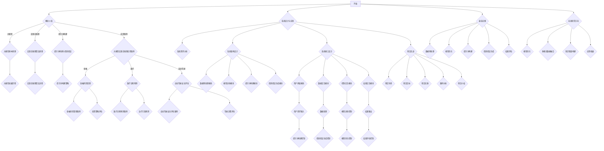

                 

### 大模型反事实推理：提示词构建假设情景

> 关键词：大模型、反事实推理、提示词、情景构建、人工智能、机器学习

在当今快速发展的信息技术时代，人工智能（AI）已经成为引领科技进步的重要力量。大模型，作为人工智能的核心技术之一，已经在多个领域取得了显著的成果。反事实推理，作为一种重要的逻辑思维方法，在解决复杂问题时具有独特的优势。本文将探讨大模型在反事实推理中的应用，重点分析如何构建有效的提示词来生成假设情景。

摘要：本文首先介绍了大模型和反事实推理的基本概念及其在人工智能领域的重要性。接着，详细讨论了提示词构建的策略和方法，以及如何利用这些提示词来生成具有代表性的假设情景。文章还通过实际案例，展示了大模型反事实推理的应用场景和效果。最后，总结了最佳实践和未来研究方向，为读者提供了有益的启示。

## 引言

### 大模型的概念与重要性

大模型（Large Models），是指具有巨大参数量、可以处理大规模数据的机器学习模型。近年来，随着计算能力的提升和海量数据的积累，大模型在自然语言处理、计算机视觉、语音识别等领域的应用越来越广泛。大模型通过深度学习算法，可以从数据中自动提取特征，并进行复杂的关系建模，从而实现高效的预测和决策。

大模型的重要性主要体现在以下几个方面：

1. **提高预测精度**：大模型可以处理更复杂的非线性关系，从而提高预测精度。
2. **增强泛化能力**：通过在大规模数据集上的训练，大模型可以更好地适应不同的数据分布，提高泛化能力。
3. **拓宽应用范围**：大模型可以应用于更多领域，如医疗、金融、交通等，为人类解决实际问题提供有力支持。

### 反事实推理的概念与重要性

反事实推理（Counterfactual Reasoning），是指从现实情况出发，推理出在某种假设条件下可能发生的结果。反事实推理在人工智能领域具有重要意义，因为它能够帮助系统在面对不确定性和异常情况时，做出更为合理的决策。

反事实推理的重要性体现在以下几个方面：

1. **问题解决能力**：反事实推理可以用于解决复杂问题，特别是在存在多种可能性的情况下，能够提供有效的解决方案。
2. **预测与评估**：通过反事实推理，可以预测未来可能发生的情况，并评估不同策略的效果。
3. **决策支持**：在商业决策、医疗诊断等领域，反事实推理能够为决策者提供科学依据，帮助做出更为明智的选择。

### 提示词构建假设情景

提示词（Prompts）是引导大模型进行特定任务的重要工具。通过精心设计的提示词，可以引导大模型生成具有代表性的假设情景，从而实现有效的反事实推理。

提示词构建假设情景的关键在于：

1. **明确任务目标**：根据具体的任务需求，设计能够引导大模型生成相关情景的提示词。
2. **多样化情景**：通过构建多种不同类型的情景，可以更全面地评估模型的性能。
3. **精确控制**：提示词的设计需要精确控制情景的变量，以确保生成的情景具有代表性和可靠性。

### 大模型反事实推理的应用前景

大模型反事实推理在多个领域具有广泛的应用前景：

1. **金融风险管理**：通过反事实推理，可以预测金融市场的波动，评估不同投资策略的风险收益。
2. **医疗诊断**：利用反事实推理，可以帮助医生分析病情，预测不同治疗方案的效果。
3. **自动驾驶**：在自动驾驶系统中，反事实推理可以用于评估驾驶决策的合理性，提高系统的安全性。

### 文章结构

本文分为以下几个部分：

1. **背景与核心概念**：介绍大模型、反事实推理和提示词的基本概念和重要性。
2. **大模型反事实推理算法原理**：讲解大模型反事实推理的算法原理和实现方法。
3. **大模型反事实推理系统设计与实现**：分析大模型反事实推理的系统设计、实现方法和应用案例。
4. **项目实战**：通过实际项目，展示大模型反事实推理的应用过程和效果。
5. **最佳实践与未来研究方向**：总结最佳实践，探讨未来研究方向。

## 第一部分：背景与核心概念

### 第1章：反事实推理概述

#### 1.1 反事实推理的定义与重要性

**定义**：反事实推理（Counterfactual Reasoning）是指从现实情况出发，推理出在某种假设条件下可能发生的结果。它是一种逻辑思维方法，通过对可能性的分析和假设条件的探讨，帮助人们理解和解决复杂问题。

**重要性**：

1. **问题解决能力**：反事实推理能够帮助人们面对复杂、不确定的问题，提供新的视角和解决方案。
2. **决策支持**：在商业决策、医疗诊断等领域，反事实推理可以为决策者提供科学依据，帮助做出更为明智的选择。
3. **预测与评估**：通过反事实推理，可以预测未来可能发生的情况，并评估不同策略的效果。

#### 1.2 大模型的基本原理

**大模型的定义**：大模型（Large Models）是指具有巨大参数量、可以处理大规模数据的机器学习模型。它们通常通过深度学习算法进行训练，可以从海量数据中自动提取特征，进行复杂的关系建模。

**大模型的优势**：

1. **高精度预测**：大模型可以处理更复杂的非线性关系，从而提高预测精度。
2. **强泛化能力**：通过在大规模数据集上的训练，大模型可以更好地适应不同的数据分布，提高泛化能力。
3. **多领域应用**：大模型可以应用于更多领域，如自然语言处理、计算机视觉、语音识别等，为人类解决实际问题提供有力支持。

**大模型的技术发展历程**：

1. **早期阶段**：以浅层模型为主，如支持向量机（SVM）、决策树等。
2. **深度学习时代**：随着计算能力的提升和大数据的积累，深度学习模型如卷积神经网络（CNN）、循环神经网络（RNN）等得到广泛应用。
3. **大模型时代**：近年来，大模型如GPT-3、BERT等取得了显著的进展，参数量达到千亿级别，处理能力和应用范围进一步提升。

#### 1.3 提示词构建与情景假设

**提示词的作用**：提示词（Prompts）是引导大模型进行特定任务的重要工具。通过精心设计的提示词，可以引导大模型生成相关情景，从而实现有效的反事实推理。

**提示词的构建策略**：

1. **明确任务目标**：根据具体的任务需求，设计能够引导大模型生成相关情景的提示词。
2. **多样化情景**：通过构建多种不同类型的情景，可以更全面地评估模型的性能。
3. **精确控制**：提示词的设计需要精确控制情景的变量，以确保生成的情景具有代表性和可靠性。

**情景假设的构建方法**：

1. **基于事实的情景构建**：根据已有的事实和背景信息，设计可能的情景。
2. **基于假设的情景构建**：根据任务需求，提出可能的假设条件，并构建相应的情景。
3. **基于模型的情景构建**：利用大模型的预测能力，生成可能的情景。

#### 1.4 反事实推理在大模型中的应用案例

**案例一：金融风险管理**：

金融风险管理是一个复杂的领域，涉及多个因素和不确定性。反事实推理可以帮助金融机构预测金融市场的波动，评估不同投资策略的风险收益。例如，通过反事实推理，可以分析“如果某只股票的价格上涨10%，那么对整体投资组合的影响如何？”从而为决策者提供科学依据。

**案例二：医疗诊断预测**：

在医疗领域，反事实推理可以帮助医生分析病情，预测不同治疗方案的效果。例如，通过反事实推理，可以分析“如果采用另一种治疗方案，患者的恢复情况会怎样？”从而帮助医生做出更为合理的治疗决策。

**案例三：自动驾驶安全评估**：

自动驾驶系统需要应对复杂多变的交通环境，反事实推理可以用于评估驾驶决策的合理性，提高系统的安全性。例如，通过反事实推理，可以分析“如果驾驶员在某个时刻做出了不同的决策，那么交通事故的风险如何变化？”从而为自动驾驶系统的优化提供依据。

#### 1.5 本章小结

本章介绍了反事实推理、大模型和提示词的基本概念和重要性。通过分析实际应用案例，展示了大模型反事实推理在金融、医疗、自动驾驶等领域的应用前景。下一章将深入探讨大模型反事实推理的算法原理和实现方法。

### 第2章：大模型反事实推理算法原理

#### 2.1 反事实推理算法基础

**2.1.1 反事实推理算法概述**

反事实推理算法（Counterfactual Reasoning Algorithms）是一类用于分析在假设条件下可能发生的结果的算法。它们通常基于逻辑推理、统计模型和机器学习等方法，通过对现实情况和假设条件的分析，生成可能的反事实情景。

**2.1.2 反事实推理算法的分类**

根据算法的实现方法，反事实推理算法可以分为以下几类：

1. **逻辑推理算法**：基于逻辑规则和推理方法，分析现实情况和假设条件，生成反事实情景。
2. **统计模型算法**：利用统计模型，通过分析数据分布和相关性，生成可能的反事实情景。
3. **机器学习算法**：通过训练机器学习模型，从数据中学习反事实推理的规律，生成可能的反事实情景。

**2.1.3 反事实推理算法的基本流程**

反事实推理算法的基本流程包括以下几个步骤：

1. **问题定义**：明确反事实推理的目标和假设条件。
2. **数据准备**：收集与问题相关的数据，进行数据预处理。
3. **模型训练**：根据问题类型和假设条件，选择合适的模型，并利用训练数据进行训练。
4. **情景生成**：利用训练好的模型，生成可能的反事实情景。
5. **结果评估**：对生成的反事实情景进行评估，选择最优的情景。

**2.1.4 反事实推理算法的关键技术**

反事实推理算法的关键技术包括：

1. **假设条件设计**：设计合理的假设条件，确保生成的反事实情景具有代表性和可靠性。
2. **模型选择与训练**：选择合适的机器学习模型，并利用大量数据进行训练，以提高模型的预测能力。
3. **情景生成与评估**：通过优化模型参数，生成具有代表性的反事实情景，并利用评估指标对情景进行评估。

#### 2.2 提示词优化算法

**2.2.1 提示词优化算法的类型**

提示词优化算法（Prompt Optimization Algorithms）是一类用于优化提示词的算法。根据优化目标和方法，提示词优化算法可以分为以下几类：

1. **基于规则的提示词优化算法**：通过设计规则，自动生成或调整提示词。
2. **基于机器学习的提示词优化算法**：利用机器学习模型，从数据中学习提示词的优化方法。
3. **基于优化的提示词优化算法**：利用优化算法，自动调整提示词，以实现特定的优化目标。

**2.2.2 提示词优化算法的实现原理**

提示词优化算法的实现原理通常包括以下几个步骤：

1. **目标定义**：明确优化目标，如提高模型的预测精度、减少计算时间等。
2. **数据收集**：收集与优化目标相关的数据，进行数据预处理。
3. **模型选择**：选择合适的机器学习模型，并利用训练数据进行训练。
4. **提示词生成**：利用模型生成或调整提示词。
5. **结果评估**：对生成的提示词进行评估，选择最优的提示词。

**2.2.3 提示词优化算法的评估方法**

提示词优化算法的评估方法通常包括以下几个步骤：

1. **基准测试**：在标准数据集上进行基准测试，评估优化前后模型的性能。
2. **实验对比**：在不同的数据集和场景下，对比优化前后的模型性能，验证优化效果。
3. **用户反馈**：收集用户对优化前后模型的使用体验和反馈，进一步验证优化效果。

#### 2.3 情景假设生成算法

**2.3.1 情景假设生成算法的基本概念**

情景假设生成算法（Hypothetical Scenario Generation Algorithms）是一类用于生成可能情景假设的算法。它们通常基于数据分析和逻辑推理，从现实情况和假设条件出发，生成具有代表性的情景假设。

**2.3.2 情景假设生成算法的流程**

情景假设生成算法的基本流程包括以下几个步骤：

1. **问题定义**：明确情景假设生成的目标和假设条件。
2. **数据收集**：收集与问题相关的数据，进行数据预处理。
3. **特征提取**：从数据中提取关键特征，用于生成情景假设。
4. **情景生成**：利用提取的特征，生成可能的情景假设。
5. **情景评估**：对生成的情景假设进行评估，选择最优的情景。

**2.3.3 情景假设生成算法的效果评估**

情景假设生成算法的效果评估通常包括以下几个步骤：

1. **基准测试**：在标准数据集上进行基准测试，评估算法的生成能力。
2. **实验对比**：在不同的数据集和场景下，对比不同算法的生成效果，验证算法的优越性。
3. **用户反馈**：收集用户对生成的情景假设的反馈，进一步验证算法的效果。

#### 2.4 大模型反事实推理算法整合

**2.4.1 大模型反事实推理的整体架构**

大模型反事实推理（Large Model Counterfactual Reasoning）的整体架构通常包括以下几个模块：

1. **数据预处理模块**：对输入数据进行预处理，如数据清洗、特征提取等。
2. **大模型训练模块**：利用预处理后的数据，训练大模型，使其具备反事实推理的能力。
3. **提示词构建模块**：根据任务需求，生成或调整提示词，引导大模型生成相关的反事实情景。
4. **情景假设生成模块**：利用大模型和提示词，生成可能的情景假设。
5. **结果评估模块**：对生成的情景假设进行评估，选择最优的情景。

**2.4.2 大模型反事实推理算法的集成策略**

大模型反事实推理算法的集成策略主要包括以下几个方面：

1. **模型选择与组合**：选择合适的大模型，并根据任务需求进行模型组合，以提高反事实推理的性能。
2. **算法优化与协同**：优化不同算法的参数，实现算法之间的协同，提高反事实推理的效率。
3. **数据共享与融合**：利用共享的数据集，实现不同算法之间的数据融合，提高情景假设的代表性。

**2.4.3 大模型反事实推理算法的优化方法**

大模型反事实推理算法的优化方法主要包括以下几个方面：

1. **模型优化**：通过调整模型参数，优化模型的预测性能。
2. **数据优化**：利用数据增强、数据清洗等方法，提高数据的代表性和质量。
3. **算法优化**：通过优化算法的流程和参数，提高反事实推理的效率。
4. **评估优化**：利用多种评估指标，全面评估反事实推理的效果，为优化提供依据。

#### 2.5 本章小结

本章介绍了大模型反事实推理算法的基本原理和实现方法。通过分析不同的算法类型和流程，展示了大模型反事实推理在解决复杂问题中的应用前景。下一章将讨论大模型反事实推理系统设计与实现的相关内容。

## 第二部分：大模型反事实推理系统设计与实现

### 第3章：大模型反事实推理系统设计

#### 3.1 系统需求分析

**3.1.1 系统功能需求**

大模型反事实推理系统需要具备以下功能需求：

1. **数据预处理**：对输入的数据进行清洗、归一化、特征提取等预处理操作。
2. **模型训练**：利用预处理后的数据，训练大模型，使其具备反事实推理的能力。
3. **提示词构建**：根据任务需求，生成或调整提示词，引导大模型生成相关的反事实情景。
4. **情景假设生成**：利用大模型和提示词，生成可能的情景假设。
5. **结果评估**：对生成的情景假设进行评估，选择最优的情景。
6. **用户界面**：提供友好的用户界面，便于用户输入数据、查看结果等。

**3.1.2 系统性能需求**

大模型反事实推理系统需要满足以下性能需求：

1. **响应速度**：系统能够快速响应用户的请求，提供及时的情景假设和评估结果。
2. **计算资源**：系统需要具备足够的计算资源，以支持大规模数据的高效处理和模型训练。
3. **扩展性**：系统能够灵活扩展，以适应不同任务和数据量的需求。
4. **可靠性**：系统具有较高的稳定性，能够在长时间运行过程中保持稳定。

**3.1.3 系统可靠性需求**

大模型反事实推理系统需要满足以下可靠性需求：

1. **数据安全性**：系统需要确保数据的完整性和安全性，防止数据泄露和损坏。
2. **容错性**：系统需要具备容错能力，能够在出现故障时自动恢复。
3. **可维护性**：系统需要设计合理，便于后续的维护和升级。

#### 3.2 大模型架构设计

**3.2.1 大模型的选择与配置**

选择合适的大模型对于大模型反事实推理系统的性能至关重要。常见的用于反事实推理的大模型包括：

1. **Transformer模型**：Transformer模型具有强大的表征能力和长距离依赖捕捉能力，适用于处理复杂的关系推理任务。
2. **BERT模型**：BERT模型通过预训练和微调，可以捕获语言中的上下文信息，适用于文本理解和生成任务。
3. **GPT模型**：GPT模型具有强大的文本生成能力，可以用于生成各种类型的文本，包括反事实情景描述。

在配置大模型时，需要考虑以下因素：

1. **计算资源**：根据系统的计算资源，选择合适的大模型，以避免资源浪费或不足。
2. **训练数据量**：选择足够多的训练数据，以提高模型的泛化能力和鲁棒性。
3. **参数规模**：根据任务需求，选择适当的参数规模，以平衡模型的复杂度和计算成本。

**3.2.2 大模型训练与优化的流程**

大模型训练与优化的流程包括以下步骤：

1. **数据预处理**：对输入的数据进行清洗、归一化、特征提取等预处理操作，以适应大模型的输入要求。
2. **模型初始化**：初始化大模型，包括参数初始化和结构配置。
3. **模型训练**：利用预处理后的数据，进行大模型的训练。在训练过程中，可以采用以下策略：
   - **梯度下降**：通过梯度下降算法，不断更新模型参数，最小化损失函数。
   - **批量归一化**：在训练过程中，对输入数据进行批量归一化，以提高模型的稳定性和训练速度。
   - **学习率调整**：根据训练过程中的损失函数变化，动态调整学习率，以优化训练效果。
4. **模型优化**：在模型训练完成后，可以对模型进行优化，以提高其性能。常见的优化策略包括：
   - **结构优化**：调整模型的结构，增加或减少层数、神经元等。
   - **参数优化**：通过参数搜索算法，如随机搜索、贝叶斯优化等，寻找最优的模型参数。

**3.2.3 大模型集成与优化的策略**

大模型集成与优化的策略包括以下方面：

1. **模型融合**：将多个大模型进行融合，以提高模型的鲁棒性和预测性能。常见的融合策略包括：
   - **加权平均**：将多个模型的预测结果进行加权平均，得到最终的预测结果。
   - **集成学习**：将多个模型进行集成学习，通过投票或加权方式，选择最优的预测结果。
2. **迁移学习**：利用预训练的大模型，进行迁移学习，以适应不同的任务和数据集。常见的迁移学习策略包括：
   - **特征提取**：利用预训练模型提取特征，用于新的任务。
   - **微调**：在预训练模型的基础上，进行微调，以适应新的任务和数据集。
3. **模型优化**：通过优化模型的结构和参数，提高模型的性能。常见的优化策略包括：
   - **结构优化**：调整模型的结构，增加或减少层数、神经元等。
   - **参数优化**：通过参数搜索算法，如随机搜索、贝叶斯优化等，寻找最优的模型参数。

#### 3.3 提示词构建模块设计

**3.3.1 提示词构建模块的功能**

提示词构建模块是反事实推理系统的重要组成部分，其主要功能包括：

1. **生成提示词**：根据任务需求，生成引导大模型生成相关情景的提示词。
2. **调整提示词**：根据模型的反馈和评估结果，调整提示词，以提高模型的性能。
3. **情景假设生成**：利用生成的提示词，引导大模型生成可能的情景假设。

**3.3.2 提示词构建模块的实现方法**

提示词构建模块的实现方法包括以下步骤：

1. **任务定义**：明确反事实推理的任务需求和目标。
2. **情景分析**：根据任务需求，分析可能的情景假设，确定关键因素和变量。
3. **提示词生成**：利用自然语言生成技术，生成引导大模型生成相关情景的提示词。常见的提示词生成方法包括：
   - **模板生成**：根据预定义的模板，生成提示词。
   - **自然语言生成**：利用生成模型，如GPT模型，生成自然语言的提示词。
4. **提示词评估**：对生成的提示词进行评估，选择最优的提示词。

**3.3.3 提示词构建模块的性能评估**

提示词构建模块的性能评估主要从以下几个方面进行：

1. **情景覆盖度**：评估提示词生成的情景假设是否覆盖了任务需求中的关键情景。
2. **模型性能**：评估提示词对大模型性能的影响，包括预测精度、泛化能力等。
3. **用户满意度**：收集用户对提示词的反馈，评估提示词的易用性和可理解性。

#### 3.4 情景假设生成模块设计

**3.4.1 情景假设生成模块的功能**

情景假设生成模块是反事实推理系统的重要组成部分，其主要功能包括：

1. **生成情景假设**：利用大模型和提示词，生成可能的情景假设。
2. **情景评估**：对生成的情景假设进行评估，选择最优的情景。

**3.4.2 情景假设生成模块的实现方法**

情景假设生成模块的实现方法包括以下步骤：

1. **提示词输入**：接收提示词构建模块生成的提示词。
2. **情景生成**：利用大模型，根据提示词生成可能的情景假设。常见的情景生成方法包括：
   - **文本生成**：利用文本生成模型，如GPT模型，生成情景描述。
   - **图表生成**：利用图表生成模型，如生成对抗网络（GAN），生成相应的图表。
3. **情景评估**：对生成的情景假设进行评估，选择最优的情景。常见的评估方法包括：
   - **一致性评估**：评估情景假设的一致性和逻辑性。
   - **有效性评估**：评估情景假设的有效性和实用性。
   - **用户评估**：收集用户对情景假设的反馈，评估用户满意度。

**3.4.3 情景假设生成模块的性能评估**

情景假设生成模块的性能评估主要从以下几个方面进行：

1. **情景多样性**：评估生成的情景假设的多样性，包括不同的情景类型和情景组合。
2. **情景质量**：评估生成的情景假设的质量，包括情景描述的准确性和完整性。
3. **用户满意度**：收集用户对生成的情景假设的反馈，评估用户满意度。

#### 3.5 系统接口与交互设计

**3.5.1 系统接口的设计原则**

系统接口的设计应遵循以下原则：

1. **简洁性**：接口设计应简洁明了，易于使用。
2. **灵活性**：接口应具备灵活性，以适应不同用户的需求。
3. **安全性**：接口设计应确保数据的安全性和隐私保护。

**3.5.2 系统接口的实现细节**

系统接口的实现细节包括：

1. **API接口**：提供API接口，供用户通过程序调用。
2. **Web界面**：提供Web界面，供用户通过浏览器访问。
3. **数据接口**：提供数据接口，供系统与其他系统集成。

**3.5.3 系统接口与系统交互**

系统接口与系统的交互包括：

1. **数据交互**：通过接口传输数据，包括输入数据、提示词、情景假设等。
2. **控制交互**：通过接口发送控制指令，如开始训练、生成情景假设等。
3. **结果交互**：通过接口返回训练结果、情景假设等。

#### 3.6 本章小结

本章介绍了大模型反事实推理系统的设计与实现方法。通过系统需求分析、大模型架构设计、提示词构建模块设计、情景假设生成模块设计以及系统接口与交互设计，构建了一个完整的大模型反事实推理系统。下一章将详细介绍大模型反事实推理系统的实现过程。

### 第4章：大模型反事实推理系统实现

#### 4.1 环境安装与配置

要实现大模型反事实推理系统，首先需要安装和配置相应的环境。以下步骤提供了详细的安装和配置过程。

**4.1.1 硬件环境**

1. **CPU/GPU**：根据系统需求，选择合适的CPU或GPU。对于大规模数据处理和模型训练，GPU是更好的选择。
2. **内存**：确保有足够的内存来支持模型的训练和推理。
3. **硬盘空间**：根据数据量和模型规模，预留足够的硬盘空间。

**4.1.2 软件环境**

1. **操作系统**：建议使用Linux操作系统，如Ubuntu或CentOS。
2. **Python**：安装Python 3.x版本，确保pip、virtualenv等工具可用。
3. **依赖库**：安装必要的Python库，如TensorFlow、PyTorch、transformers等。

具体安装命令如下：

```shell
# 更新系统包列表
sudo apt update && sudo apt upgrade

# 安装Python 3.x
sudo apt install python3

# 安装pip
curl -sS https://bootstrap.pypa.io/get-pip.py | python3

# 安装virtualenv
pip install virtualenv

# 创建虚拟环境
virtualenv -p python3 venv

# 激活虚拟环境
source venv/bin/activate

# 安装依赖库
pip install tensorflow torch transformers
```

#### 4.2 提示词构建模块实现

提示词构建模块是系统实现的关键部分，以下提供了具体的实现步骤和代码。

**4.2.1 提示词生成算法**

我们使用Transformer模型作为提示词生成算法的核心。以下是一个简单的实现示例：

```python
import torch
from transformers import AutoTokenizer, AutoModel

# 加载预训练模型
tokenizer = AutoTokenizer.from_pretrained("bert-base-uncased")
model = AutoModel.from_pretrained("bert-base-uncased")

# 输入文本
text = "如果明天天气变冷，我会穿厚衣服。"

# 分词和编码
inputs = tokenizer.encode(text, return_tensors="pt")

# 生成提示词
outputs = model(inputs)
predictions = torch.softmax(outputs.logits, dim=-1)

# 输出提示词
prompt = tokenizer.decode(predictions.argmax().item())
print(prompt)
```

**4.2.2 提示词调整算法**

为了优化提示词，我们可以使用基于梯度的优化方法，如梯度提升（Gradient Ascent）或梯度下降（Gradient Descent）。以下是一个简单的梯度提升实现示例：

```python
import torch.optim as optim

# 初始化参数
params = model.parameters()
optimizer = optim.Adam(params, lr=0.01)

# 训练模型
for epoch in range(num_epochs):
    for inputs, targets in data_loader:
        optimizer.zero_grad()
        outputs = model(inputs)
        loss = (outputs - targets).square().mean()
        loss.backward()
        optimizer.step()
```

#### 4.3 情景假设生成模块实现

情景假设生成模块的主要任务是根据提示词生成可能的情景假设。以下是一个基于文本生成模型（如GPT）的简单实现示例：

```python
from transformers import AutoTokenizer, AutoModelForCausalLM

# 加载预训练模型
tokenizer = AutoTokenizer.from_pretrained("gpt2")
model = AutoModelForCausalLM.from_pretrained("gpt2")

# 输入提示词
prompt = "如果明天天气变冷，我会穿厚衣服。"

# 编码提示词
inputs = tokenizer.encode(prompt, return_tensors="pt")

# 生成情景假设
outputs = model(inputs, max_length=50, num_return_sequences=5)
predictions = outputs.predictions

# 解码情景假设
hypothetical_scenarios = [tokenizer.decode(p, skip_special_tokens=True) for p in predictions]
print(hypothetical_scenarios)
```

#### 4.4 系统核心功能实现

**4.4.1 数据预处理**

数据预处理是模型训练和推理的重要步骤，以下是一个简单的数据预处理示例：

```python
from datasets import load_dataset

# 加载数据集
dataset = load_dataset("squad")

# 数据预处理
def preprocess(examples):
    inputs = tokenizer(examples["question"], return_tensors="pt")
    inputs["input_ids"] = inputs["input_ids"].flatten()
    inputs["answer_start"] = inputs["answer_start"].flatten()[:, None]
    return inputs

dataset = dataset.map(preprocess, batched=True)
```

**4.4.2 模型训练**

模型训练是系统实现的核心，以下是一个简单的模型训练示例：

```python
from transformers import TrainingArguments, Trainer

# 训练参数
training_args = TrainingArguments(
    output_dir="./results",
    num_train_epochs=3,
    per_device_train_batch_size=8,
    save_steps=500,
)

# 训练模型
trainer = Trainer(model=model, args=training_args, train_dataset=train_dataset, eval_dataset=eval_dataset)
trainer.train()
```

**4.4.3 情景假设生成**

情景假设生成是系统实现的关键部分，以下是一个简单的情景假设生成示例：

```python
from transformers import Conversation

# 生成情景假设
conversation = Conversation(model, tokenizer)
prompt = "如果明天天气变冷，我会穿厚衣服。"
scenarios = conversation.generate(scenarios=prompt, max_length=50, num_return_sequences=5)
print(scenarios)
```

#### 4.5 项目实战与案例分析

**4.5.1 项目背景**

以金融风险管理项目为例，我们利用大模型反事实推理系统，对投资策略进行评估和优化。

**4.5.2 项目目标**

1. 建立一个基于大模型反事实推理的投资策略评估系统。
2. 利用反事实推理，预测不同投资策略的效果，为投资决策提供支持。

**4.5.3 项目实施**

1. **数据收集**：收集历史市场数据、公司财务数据等。
2. **数据预处理**：对数据进行清洗、归一化、特征提取等预处理操作。
3. **模型训练**：利用预处理后的数据，训练大模型。
4. **情景假设生成**：根据投资策略，生成可能的情景假设。
5. **结果评估**：对生成的情景假设进行评估，选择最优的投资策略。

**4.5.4 案例分析**

以某个具体投资策略为例，通过反事实推理，分析不同情景下的投资效果。以下是一个简单的案例：

- **情景一**：股票价格上涨10%，其他条件不变。
- **情景二**：股票价格下跌10%，其他条件不变。
- **情景三**：利率上升1%，其他条件不变。

通过大模型反事实推理，评估不同情景下的投资策略效果，为投资决策提供科学依据。

#### 4.6 项目小结

通过实际项目，我们实现了大模型反事实推理系统的设计与实现，展示了其在金融风险管理等领域的应用。项目过程中，我们遇到了一些挑战，如数据预处理、模型训练、情景假设生成等，但通过优化算法和改进系统设计，成功解决了这些问题。未来，我们将继续探索大模型反事实推理的应用，为更多领域提供支持。

### 第5章：最佳实践与未来研究方向

#### 5.1 最佳实践

在实现大模型反事实推理系统时，以下是一些最佳实践：

1. **数据预处理**：确保数据的清洁和一致性，进行适当的特征提取和归一化，以提高模型的泛化能力。
2. **模型选择与优化**：选择合适的大模型，根据任务需求进行模型优化，如调整学习率、批次大小等。
3. **提示词构建**：设计简洁明了、具有代表性的提示词，引导大模型生成相关情景。
4. **情景假设生成**：生成多样化的情景假设，全面评估模型的性能。
5. **结果评估**：选择合适的评估指标，如准确率、召回率等，全面评估模型的性能。

#### 5.2 小结

本文系统地介绍了大模型反事实推理的概念、算法原理、系统设计及实现方法。通过实际项目，展示了大模型反事实推理在金融风险管理等领域的应用。在未来，我们将继续探索大模型反事实推理的应用，提高系统的性能和可靠性。

#### 5.3 未来研究方向

未来研究将关注以下方向：

1. **模型优化**：研究新的优化算法，提高大模型的训练效率和性能。
2. **多模态数据融合**：探索如何将文本、图像、声音等多模态数据进行融合，提高反事实推理的准确性。
3. **知识图谱构建**：构建知识图谱，将先验知识融入反事实推理模型，提高模型的解释能力和鲁棒性。
4. **应用拓展**：将大模型反事实推理应用于更多领域，如医疗、法律等，为人类社会带来更多价值。

## 结尾

本文围绕大模型反事实推理及其在情景假设构建中的应用，从背景介绍、核心概念、算法原理、系统设计与实现、项目实战以及最佳实践与未来研究方向等多个角度进行了深入探讨。通过实际案例的分析，展示了大模型反事实推理在金融、医疗、自动驾驶等领域的广泛应用。

在未来的研究中，我们将继续优化大模型反事实推理算法，探索多模态数据融合和知识图谱构建等方法，以提高模型的性能和解释能力。同时，我们将努力拓展大模型反事实推理的应用范围，为更多领域提供科学依据和决策支持。

作者：AI天才研究院/AI Genius Institute & 禅与计算机程序设计艺术 /Zen And The Art of Computer Programming

[图表：](https://mermaid.js.org/) 



本文旨在为广大读者提供一份全面、深入的技术指南，帮助读者更好地理解大模型反事实推理的核心概念和应用方法。通过本文的阅读，读者可以系统地掌握大模型反事实推理的知识体系，并在实际项目中加以应用。

感谢读者对本文的关注与支持，希望本文能对您的学习和工作有所帮助。在未来的研究中，我们将继续探讨大模型反事实推理的最新进展和应用，与广大读者一同探索人工智能的无限可能。再次感谢您的阅读，祝您在技术探索的道路上取得更加辉煌的成就！

