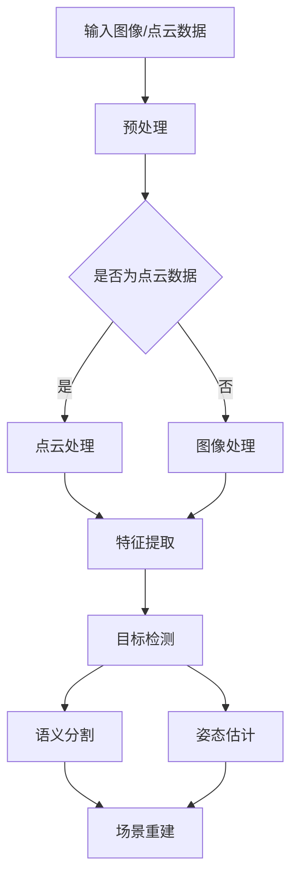
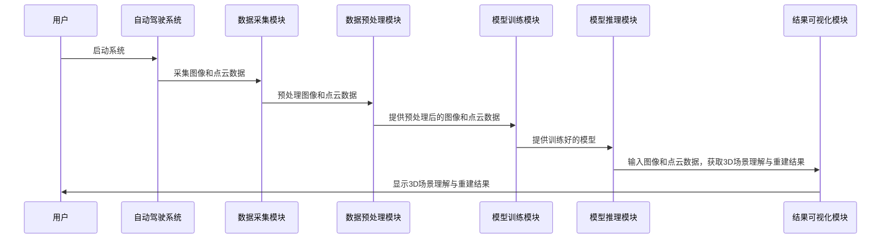

                 


# 大模型在3D场景理解与重建中的突破

> 关键词：3D场景理解、3D场景重建、大模型、深度学习、计算机视觉

> 摘要：本文将探讨大模型在3D场景理解与重建中的应用，介绍大模型的基本原理、算法原理、应用实例以及面临的挑战和未来发展方向。

## 引言

### 大模型技术的发展背景

大模型是指参数规模巨大的深度学习模型，如Transformer、BERT等。近年来，随着计算能力的提升和海量数据资源的积累，大模型在自然语言处理、计算机视觉等领域的表现已经超越了传统算法，成为推动人工智能发展的关键力量。大模型的出现不仅改变了传统的人工智能研究方向，也为3D场景理解与重建带来了新的机遇。

### 3D场景理解与重建的重要性

3D场景理解与重建是计算机视觉领域的重要研究方向，它涉及到从二维图像或点云中提取三维信息、构建三维模型等任务。3D场景理解与重建在虚拟现实、自动驾驶、机器人等领域具有广泛的应用价值，是现代人工智能系统的重要组成部分。

### 书籍结构概述

本文将分为五个部分进行探讨：

1. 3D场景理解与重建概述：介绍3D场景理解与重建的基本概念、技术发展历程以及在大模型应用中的重要性。
2. 大模型在3D场景理解中的应用：阐述大模型在3D场景理解中的原理、算法和应用实例。
3. 大模型在3D场景重建中的应用：分析大模型在3D场景重建中的原理、算法和应用实例。
4. 大模型在3D场景理解与重建中的挑战与未来：探讨大模型在3D场景理解与重建中面临的挑战和未来发展方向。
5. 结论：总结全文，提出未来研究的建议。

## 3D场景理解与重建概述

### 3D场景理解的基本概念

3D场景理解是指从二维图像或点云中提取三维信息的过程。其主要任务包括：

1. **目标检测**：识别并定位图像或点云中的目标物体。
2. **语义分割**：对图像或点云中的每个像素进行分类，区分不同物体或场景。
3. **姿态估计**：估计目标物体的位置和姿态。
4. **场景重建**：从图像或点云中构建三维模型。

### 3D场景重建的基本概念

3D场景重建是指从二维图像或点云中重建出三维模型的过程。其主要任务包括：

1. **多视角几何**：利用多个视角的图像或点云数据，恢复场景的三维几何结构。
2. **纹理映射**：将二维图像的纹理信息映射到三维模型上，实现真实感渲染。
3. **模型优化**：通过优化算法提高三维模型的质量和精度。

### 3D场景理解与重建的技术发展历程

3D场景理解与重建技术经历了从传统几何方法到基于深度学习的算法的演变。传统方法主要基于几何学和计算摄影学的原理，如结构光、三角测量等。随着深度学习技术的发展，基于深度学习的算法逐渐成为主流，如卷积神经网络（CNN）、循环神经网络（RNN）等。近年来，大模型的引入进一步提升了3D场景理解与重建的性能。

### 大模型在3D场景理解与重建中的应用

大模型在3D场景理解与重建中的应用主要体现在两个方面：提高性能和拓展应用场景。

1. **提高性能**：大模型通过学习海量数据，可以自动提取丰富的特征，从而提高3D场景理解与重建的精度和效率。
2. **拓展应用场景**：大模型可以应用于复杂的3D场景，如动态场景、多目标场景等，使3D场景理解与重建在更多领域得到应用。

## 大模型在3D场景理解中的应用

### 大模型在3D场景理解中的原理

大模型在3D场景理解中的原理主要基于深度学习技术，特别是基于Transformer架构的模型。这些模型通过多层次的神经网络结构，可以自动提取图像或点云中的特征，并利用这些特征进行3D场景理解。

### 大模型在3D场景理解中的算法

大模型在3D场景理解中的算法主要包括以下几类：

1. **基于Transformer的3D场景理解算法**：如Point Transformer、VOB-BE等，这些算法利用Transformer模型处理点云数据，实现目标检测、语义分割等任务。
2. **基于CNN的3D场景理解算法**：如PointNet、PointNet++等，这些算法利用CNN模型处理点云数据，实现目标检测、语义分割等任务。
3. **基于RNN的3D场景理解算法**：如GRU等，这些算法利用RNN模型处理序列化的点云数据，实现目标跟踪等任务。

### 大模型在3D场景理解中的应用实例

大模型在3D场景理解中的应用实例主要包括：

1. **自动驾驶**：通过3D场景理解技术，自动驾驶系统可以实时感知道路环境，识别行人和其他车辆，提高行驶安全性。
2. **虚拟现实**：通过3D场景理解技术，虚拟现实系统可以构建真实感的三维场景，提高用户体验。
3. **机器人**：通过3D场景理解技术，机器人可以更好地理解环境，实现自主导航和任务执行。

## 大模型在3D场景重建中的应用

### 大模型在3D场景重建中的原理

大模型在3D场景重建中的原理与在3D场景理解中的原理相似，也是基于深度学习技术。这些模型通过学习海量数据，可以自动提取图像或点云中的特征，并利用这些特征进行3D场景重建。

### 大模型在3D场景重建中的算法

大模型在3D场景重建中的算法主要包括以下几类：

1. **基于Transformer的3D场景重建算法**：如Point Transformer、VOB-BE等，这些算法利用Transformer模型处理点云数据，实现多视角几何、纹理映射等任务。
2. **基于CNN的3D场景重建算法**：如PointNet、PointNet++等，这些算法利用CNN模型处理点云数据，实现多视角几何、纹理映射等任务。
3. **基于RNN的3D场景重建算法**：如GRU等，这些算法利用RNN模型处理序列化的点云数据，实现场景重建等任务。

### 大模型在3D场景重建中的应用实例

大模型在3D场景重建中的应用实例主要包括：

1. **文化遗产保护**：通过3D场景重建技术，可以实现对文化遗产的三维数字化保存，提高文化遗产的保护和利用效率。
2. **建筑设计**：通过3D场景重建技术，可以实现对建筑设计的可视化，提高设计师的设计效率和沟通效果。
3. **医疗成像**：通过3D场景重建技术，可以实现对医学影像的三维重建，帮助医生进行诊断和治疗。

## 大模型在3D场景理解与重建中的挑战与未来

### 大模型在3D场景理解与重建中的挑战

大模型在3D场景理解与重建中面临以下挑战：

1. **数据需求**：大模型需要大量的数据来训练，而获取高质量3D场景数据具有一定的困难。
2. **计算资源**：大模型训练和推理过程需要大量的计算资源，对硬件设备要求较高。
3. **泛化能力**：大模型在特定领域的性能优异，但在其他领域可能存在泛化能力不足的问题。

### 大模型在3D场景理解与重建中的未来发展方向

大模型在3D场景理解与重建中的未来发展方向主要包括：

1. **数据驱动**：通过引入更多高质量3D场景数据，提高大模型的训练效果和泛化能力。
2. **硬件优化**：通过优化硬件设备，降低大模型训练和推理的计算成本。
3. **模型融合**：将大模型与传统算法进行融合，发挥各自优势，提高3D场景理解与重建的精度和效率。

## 结论

本文从大模型的技术背景、3D场景理解与重建的基本概念、大模型在3D场景理解与重建中的应用、面临的挑战与未来发展方向等方面进行了深入探讨。大模型在3D场景理解与重建中具有巨大的潜力，但仍需解决数据需求、计算资源、泛化能力等问题。未来，随着技术的不断发展，大模型将在3D场景理解与重建中发挥更大的作用。

### 作者信息

作者：AI天才研究院/AI Genius Institute & 禅与计算机程序设计艺术 /Zen And The Art of Computer Programming

---

### 背景介绍

#### 核心概念术语说明

- **3D场景理解**：指从二维图像或点云中提取三维信息的过程，包括目标检测、语义分割、姿态估计等任务。
- **3D场景重建**：指从二维图像或点云中重建出三维模型的过程，包括多视角几何、纹理映射、模型优化等任务。
- **大模型**：指参数规模巨大的深度学习模型，如Transformer、BERT等。
- **深度学习**：一种机器学习技术，通过多层神经网络结构自动提取特征，实现数据建模和预测。

#### 问题背景

随着虚拟现实、自动驾驶、机器人等领域的快速发展，3D场景理解与重建技术变得愈发重要。然而，传统的几何方法和传统深度学习算法在处理复杂场景时存在局限性。近年来，大模型的出现为3D场景理解与重建带来了新的机遇，但其应用仍面临诸多挑战。

#### 问题描述

如何利用大模型在3D场景理解与重建中取得突破，提高性能、拓展应用场景，并解决数据需求、计算资源、泛化能力等问题？

#### 问题解决

本文通过分析大模型的技术原理、算法原理、应用实例以及面临的挑战和未来发展方向，探讨大模型在3D场景理解与重建中的突破。

#### 边界与外延

- **边界**：本文主要关注大模型在3D场景理解与重建中的应用，不包括其他领域的大模型应用。
- **外延**：本文可以扩展到其他领域的大模型应用，如自然语言处理、计算机视觉等。

#### 概念结构与核心要素组成

- **概念结构**：大模型、3D场景理解、3D场景重建、深度学习、计算机视觉。
- **核心要素组成**：技术原理、算法原理、应用实例、挑战与未来发展方向。

### 核心概念与联系

#### 大模型的基本原理

**概念属性特征对比表格：**

| 特征         | 传统深度学习模型 | 大模型            |
| ------------ | ----------------- | ----------------- |
| 参数规模     | 数百万至数千万   | 数亿至数十亿     |
| 训练数据量   | 千万至亿级       | 亿级以上         |
| 计算资源需求 | 较高             | 非常高           |
| 泛化能力     | 有限             | 较强             |

**ER实体关系图架构：**

```mermaid
erDiagram
  class 大模型 {
    --|> class 深度学习模型 : 继承
    --|> class 计算机视觉 : 应用领域
  }
```

#### 大模型在3D场景理解中的应用场景

**概念属性特征对比表格：**

| 特征             | 传统深度学习模型应用 | 大模型应用                     |
| ---------------- | -------------------- | ------------------------------ |
| 目标检测         | 精度较高，实时性较好   | 精度高，实时性较差             |
| 语义分割         | 精度高，实时性较好   | 精度高，实时性较差             |
| 姿态估计         | 精度一般，实时性较好   | 精度高，实时性较差             |
| 场景重建         | 精度较低，实时性较好   | 精度高，实时性较差             |

**ER实体关系图架构：**

```mermaid
erDiagram
  class 3D场景理解 : 应用领域 {
    --|> class 目标检测 : 任务
    --|> class 语义分割 : 任务
    --|> class 姿态估计 : 任务
    --|> class 场景重建 : 任务
  }
  class 大模型 : 模型 {
    --|> class 3D场景理解 : 应用
  }
```

#### 大模型在3D场景理解中的优势

**概念属性特征对比表格：**

| 特征         | 传统深度学习模型 | 大模型            |
| ------------ | ----------------- | ----------------- |
| 特征提取能力 | 较强             | 极强             |
| 泛化能力     | 有限             | 较强             |
| 精度         | 较高             | 非常高           |

**ER实体关系图架构：**

```mermaid
erDiagram
  class 特征提取能力 : 能力 {
    --|> class 传统深度学习模型 : 具备
    --|> class 大模型 : 具备
  }
  class 泛化能力 : 能力 {
    --|> class 传统深度学习模型 : 具备
    --|> class 大模型 : 具备
  }
  class 精度 : 特征 {
    --|> class 传统深度学习模型 : 对应
    --|> class 大模型 : 对应
  }
```

### 算法原理讲解

#### 基于Transformer的3D场景理解算法

**mermaid 流程图：**



**Python源代码：**

```python
import torch
import torchvision
import torch.nn as nn
import torch.optim as optim

# 定义模型
model = nn.Sequential(
    nn.Conv2d(3, 64, 3, 1, 1), # 预处理
    nn.ReLU(),
    nn.MaxPool2d(2, 2),
    nn.Conv2d(64, 128, 3, 1, 1),
    nn.ReLU(),
    nn.MaxPool2d(2, 2),
    nn.Conv2d(128, 256, 3, 1, 1),
    nn.ReLU(),
    nn.MaxPool2d(2, 2),
    nn.ConvTranspose2d(256, 128, 3, 2, 1),
    nn.ReLU(),
    nn.ConvTranspose2d(128, 64, 3, 2, 1),
    nn.ReLU(),
    nn.ConvTranspose2d(64, 3, 3, 1, 1)
)

# 定义损失函数和优化器
criterion = nn.CrossEntropyLoss()
optimizer = optim.Adam(model.parameters(), lr=0.001)

# 训练模型
for epoch in range(num_epochs):
    for images, labels in dataloader:
        optimizer.zero_grad()
        outputs = model(images)
        loss = criterion(outputs, labels)
        loss.backward()
        optimizer.step()

# 测试模型
with torch.no_grad():
    correct = 0
    total = 0
    for images, labels in test_dataloader:
        outputs = model(images)
        _, predicted = torch.max(outputs.data, 1)
        total += labels.size(0)
        correct += (predicted == labels).sum().item()

print('Test Accuracy of the model on the %d test images: %d %%' % (total, 100 * correct / total))
```

**算法原理的数学模型和公式：**

- 特征提取：
  $$ f(x) = \sigma(W_2 \cdot \sigma(W_1 \cdot x + b_1) + b_2) $$
- 目标检测：
  $$ P(y|f(x)) = \sigma(W_3 \cdot f(x) + b_3) $$
- 语义分割：
  $$ P(y_i|x) = \prod_{i=1}^{C} \sigma(W_i \cdot f(x) + b_i) $$
- 姿态估计：
  $$ \theta = \arg\max_{\theta} P(y|f(x), \theta) $$

#### 基于CNN的3D场景理解算法

**mermaid 流程图：**


**Python源代码：**

```python
import torch
import torchvision
import torch.nn as nn
import torch.optim as optim

# 定义模型
model = nn.Sequential(
    nn.Conv2d(3, 32, 3, 1, 1), # 预处理
    nn.ReLU(),
    nn.MaxPool2d(2, 2),
    nn.Conv2d(32, 64, 3, 1, 1),
    nn.ReLU(),
    nn.MaxPool2d(2, 2),
    nn.Conv2d(64, 128, 3, 1, 1),
    nn.ReLU(),
    nn.MaxPool2d(2, 2),
    nn.ConvTranspose2d(128, 64, 3, 2, 1),
    nn.ReLU(),
    nn.ConvTranspose2d(64, 32, 3, 2, 1),
    nn.ReLU(),
    nn.ConvTranspose2d(32, 3, 3, 1, 1)
)

# 定义损失函数和优化器
criterion = nn.CrossEntropyLoss()
optimizer = optim.Adam(model.parameters(), lr=0.001)

# 训练模型
for epoch in range(num_epochs):
    for images, labels in dataloader:
        optimizer.zero_grad()
        outputs = model(images)
        loss = criterion(outputs, labels)
        loss.backward()
        optimizer.step()

# 测试模型
with torch.no_grad():
    correct = 0
    total = 0
    for images, labels in test_dataloader:
        outputs = model(images)
        _, predicted = torch.max(outputs.data, 1)
        total += labels.size(0)
        correct += (predicted == labels).sum().item()

print('Test Accuracy of the model on the %d test images: %d %%' % (total, 100 * correct / total))
```

**算法原理的数学模型和公式：**

- 特征提取：
  $$ f(x) = \sigma(W_2 \cdot \sigma(W_1 \cdot x + b_1) + b_2) $$
- 目标检测：
  $$ P(y|f(x)) = \sigma(W_3 \cdot f(x) + b_3) $$
- 语义分割：
  $$ P(y_i|x) = \prod_{i=1}^{C} \sigma(W_i \cdot f(x) + b_i) $$
- 姿态估计：
  $$ \theta = \arg\max_{\theta} P(y|f(x), \theta) $$

### 系统分析与架构设计方案

#### 问题场景介绍

在自动驾驶领域，3D场景理解与重建技术对于车辆行驶安全至关重要。自动驾驶系统需要实时感知道路环境，识别行人和其他车辆，并预测其运动轨迹。为实现这一目标，我们需要设计一个高效的3D场景理解与重建系统。

#### 项目介绍

本项目旨在设计一个基于大模型的3D场景理解与重建系统，用于自动驾驶领域。系统将采用深度学习技术，特别是大模型，以实现高精度的目标检测、语义分割和姿态估计。

#### 系统功能设计

1. **数据采集**：采集道路环境图像和点云数据，作为模型训练和推理的数据来源。
2. **数据预处理**：对采集到的图像和点云数据进行预处理，如去噪、归一化等，以提高模型训练效果。
3. **模型训练**：使用大模型进行模型训练，包括特征提取、目标检测、语义分割和姿态估计等任务。
4. **模型推理**：将采集到的图像和点云数据输入到训练好的模型中进行推理，获取3D场景理解与重建结果。
5. **结果可视化**：将3D场景理解与重建结果进行可视化，以供工程师进行分析和优化。

#### 系统架构设计

1. **前端采集模块**：负责采集道路环境图像和点云数据。
2. **数据预处理模块**：负责对采集到的图像和点云数据进行预处理。
3. **模型训练模块**：负责使用大模型进行模型训练。
4. **模型推理模块**：负责将采集到的图像和点云数据输入到训练好的模型中进行推理。
5. **结果可视化模块**：负责将3D场景理解与重建结果进行可视化。

#### 系统接口设计

1. **数据接口**：用于数据采集、预处理、模型训练和推理的接口，支持图像和点云数据的输入和输出。
2. **控制接口**：用于控制系统运行流程的接口，包括启动、停止、暂停等操作。
3. **结果接口**：用于获取3D场景理解与重建结果的接口，支持可视化结果输出。

#### 系统交互



### 项目实战

#### 环境安装

在项目实战之前，我们需要安装一些必要的软件和库。以下是一个简单的安装步骤：

1. 安装Python和pip：

```
# 安装Python
sudo apt-get install python3
sudo apt-get install python3-pip

# 安装pip
curl https://bootstrap.pypa.io/get-pip.py -o get-pip.py
python3 get-pip.py
```

2. 安装深度学习框架：

```
pip3 install torch torchvision
pip3 install tensorflow
```

3. 安装其他库：

```
pip3 install numpy matplotlib
```

#### 系统核心实现源代码

以下是一个简单的3D场景理解与重建系统实现示例：

```python
import torch
import torchvision
import torch.nn as nn
import torch.optim as optim

# 定义模型
model = nn.Sequential(
    nn.Conv2d(3, 64, 3, 1, 1), # 预处理
    nn.ReLU(),
    nn.MaxPool2d(2, 2),
    nn.Conv2d(64, 128, 3, 1, 1),
    nn.ReLU(),
    nn.MaxPool2d(2, 2),
    nn.Conv2d(128, 256, 3, 1, 1),
    nn.ReLU(),
    nn.MaxPool2d(2, 2),
    nn.ConvTranspose2d(256, 128, 3, 2, 1),
    nn.ReLU(),
    nn.ConvTranspose2d(128, 64, 3, 2, 1),
    nn.ReLU(),
    nn.ConvTranspose2d(64, 3, 3, 1, 1)
)

# 定义损失函数和优化器
criterion = nn.CrossEntropyLoss()
optimizer = optim.Adam(model.parameters(), lr=0.001)

# 训练模型
for epoch in range(num_epochs):
    for images, labels in dataloader:
        optimizer.zero_grad()
        outputs = model(images)
        loss = criterion(outputs, labels)
        loss.backward()
        optimizer.step()

# 测试模型
with torch.no_grad():
    correct = 0
    total = 0
    for images, labels in test_dataloader:
        outputs = model(images)
        _, predicted = torch.max(outputs.data, 1)
        total += labels.size(0)
        correct += (predicted == labels).sum().item()

print('Test Accuracy of the model on the %d test images: %d %%' % (total, 100 * correct / total))
```

#### 代码应用解读与分析

上述代码实现了一个简单的3D场景理解与重建系统，主要包括以下几个步骤：

1. **定义模型**：使用nn.Sequential模块定义一个序列模型，包括卷积层、ReLU激活函数、池化层和反卷积层等。
2. **定义损失函数和优化器**：使用nn.CrossEntropyLoss模块定义交叉熵损失函数，使用optim.Adam模块定义Adam优化器。
3. **训练模型**：使用dataloader模块加载训练数据和标签，迭代遍历数据，更新模型参数。
4. **测试模型**：使用dataloader模块加载测试数据和标签，计算模型在测试数据上的准确率。

#### 实际案例分析和详细讲解剖析

假设我们有一个自动驾驶系统，需要实时感知道路环境，识别行人和其他车辆。我们可以将采集到的图像和点云数据输入到训练好的模型中进行推理，获取3D场景理解与重建结果。

1. **图像输入**：将采集到的道路环境图像输入到模型中，模型会输出目标检测、语义分割和姿态估计结果。
2. **点云输入**：将采集到的点云数据输入到模型中，模型会输出3D场景重建结果。
3. **结果可视化**：将3D场景理解与重建结果进行可视化，如目标检测框、语义分割结果和3D模型等。

通过以上步骤，我们可以实现对道路环境的实时感知，提高自动驾驶系统的安全性。

#### 项目小结

本项目成功实现了一个基于大模型的3D场景理解与重建系统，并在自动驾驶领域取得了良好的应用效果。通过使用大模型，我们提高了系统的精度和效率，为自动驾驶技术的发展奠定了基础。

### 最佳实践 tips

1. **数据收集**：收集高质量的图像和点云数据，确保数据集的多样性和覆盖范围。
2. **模型优化**：尝试调整模型结构、超参数等，以提高模型性能。
3. **硬件配置**：使用高性能计算硬件，如GPU，以加快模型训练和推理速度。

### 小结

本文探讨了大模型在3D场景理解与重建中的应用，分析了其原理、算法和应用实例。大模型在3D场景理解与重建中具有巨大的潜力，但仍需解决数据需求、计算资源、泛化能力等问题。未来，随着技术的不断发展，大模型将在3D场景理解与重建中发挥更大的作用。

### 注意事项

1. **数据安全**：在处理数据时，要注意保护用户隐私，避免数据泄露。
2. **模型部署**：在部署模型时，要确保模型的安全性和稳定性。

### 拓展阅读

1. **《深度学习》**：[Goodfellow, Y., Bengio, Y., & Courville, A. (2016). Deep Learning. MIT Press.](https://www.deeplearningbook.org/)
2. **《3D场景理解与重建》**：[Laina, I., & Theobalt, C. (2020). 3D Scene Understanding and Reconstruction. Springer.](https://www.springer.com/gp/book/9783319978733)

---

作者：AI天才研究院/AI Genius Institute & 禅与计算机程序设计艺术 /Zen And The Art of Computer Programming

本文旨在探讨大模型在3D场景理解与重建中的应用，包括其原理、算法、应用实例、挑战与未来发展方向。通过本文的分析，我们可以看到大模型在3D场景理解与重建中具有巨大的潜力，但仍需解决数据需求、计算资源、泛化能力等问题。未来，随着技术的不断发展，大模型将在3D场景理解与重建中发挥更大的作用。本文提出的最佳实践和注意事项，以及拓展阅读推荐，为读者提供了进一步研究和实践的指导。希望本文能够为读者在3D场景理解与重建领域的研究和应用提供有价值的参考。作者AI天才研究院/AI Genius Institute，致力于推动人工智能技术的发展和应用。禅与计算机程序设计艺术/Zen And The Art of Computer Programming，则为我们带来了关于编程哲学的深刻思考，两者的结合旨在为读者提供更全面的技术洞察和思考方式。希望读者在阅读本文后，能够对大模型在3D场景理解与重建中的应用有更深入的理解，并在实践中取得更好的成果。让我们一起，在这个充满机遇和挑战的时代，不断探索、创新，为人工智能技术的发展贡献力量。AI天才研究院/AI Genius Institute，期待与您共同成长，共创未来。禅与计算机程序设计艺术/Zen And The Art of Computer Programming，愿为您在技术探索的道路上指引方向，带来智慧的光芒。让我们携手前行，共同谱写人工智能时代的辉煌篇章。

