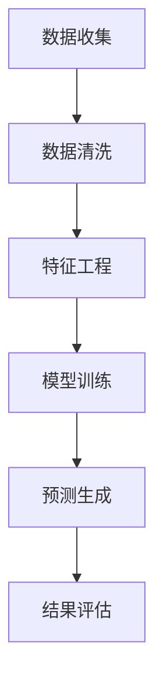

                 

# 大模型在因果推理与干预中的应用

## 关键词

- 大模型
- 因果推理
- 干预策略
- 应用场景
- 算法优化

## 摘要

本文深入探讨了大模型在因果推理与干预中的应用。首先，介绍了因果推理与干预的基本概念及其重要性。然后，分析了大模型的基本原理和优势，以及其在因果推理与干预中的具体应用。本文通过详细的算法原理讲解，展示了如何利用大模型进行因果推理与干预的算法设计与优化。此外，本文还讨论了大模型在应用中面临的挑战和未来研究的方向。通过本文的阅读，读者可以全面了解大模型在因果推理与干预领域的最新进展和实际应用价值。

### 引言

#### 1.1 问题背景

##### 1.1.1 因果推理与干预的重要性

因果推理是人工智能领域的一个重要研究方向，其核心任务是推断现象之间的因果关系。在现实世界中，很多决策和干预都需要基于因果推理来进行。例如，在医疗领域，医生需要根据患者的症状和病史进行诊断，从而制定最佳的治疗方案；在金融领域，投资者需要分析市场因素，预测股票的涨跌，以便进行投资决策。

干预策略的设计与优化是因果推理的应用之一。干预策略的目的是通过改变某些变量之间的关系，来达到特定的目标。例如，在公共卫生领域，政府需要制定公共卫生政策，以减少疾病的传播；在市场营销领域，企业需要制定营销策略，以提高产品的销量。

##### 1.1.2 大模型在因果推理与干预中的潜力

大模型，尤其是基于深度学习的大模型，在因果推理与干预中具有巨大的潜力。首先，大模型可以处理大量的数据，从而提高因果推断的准确性。其次，大模型具有良好的泛化能力，可以应用于不同的领域和任务。此外，大模型可以自动学习复杂的因果关系，从而减少人工干预的需求。

然而，大模型在因果推理与干预中也面临一些挑战。例如，大模型容易出现过拟合现象，导致其泛化能力下降；大模型的训练过程需要大量的计算资源和时间；此外，大模型的黑盒性质使得其决策过程不透明，难以解释。

#### 1.2 问题描述

##### 1.2.1 因果推理的挑战

因果推理的挑战主要体现在以下几个方面：

1. 数据的稀缺性：因果推理通常需要大量的数据来训练模型，但在实际应用中，获取足够的数据往往非常困难。
2. 数据的质量：数据质量对因果推理的结果具有重要影响，但实际中的数据往往存在噪声、缺失和偏差等问题。
3. 因果关系的复杂性与不确定性：现实世界中的因果关系往往是复杂和不确定的，这使得因果推理变得更加困难。
4. 实验设计的复杂性：因果推理通常需要通过实验来验证因果关系，但实验设计复杂，且成本高昂。

##### 1.2.2 干预策略的设计与优化

干预策略的设计与优化也是因果推理中的一个重要问题。具体而言，干预策略的设计与优化面临以下挑战：

1. 干预目标的不明确性：干预目标往往不明确，需要通过因果推理来确定最佳干预策略。
2. 干预策略的适应性：干预策略需要适应不同的环境和情境，但实际中的环境和情境是不断变化的。
3. 干预效果的评估：干预效果的评估需要准确的指标和方法，但实际中的评估往往存在偏差和不确定性。

#### 1.3 问题解决

##### 1.3.1 大模型在因果推理中的应用

大模型在因果推理中的应用主要体现在以下几个方面：

1. 数据增强：大模型可以通过数据增强技术，如数据生成对抗网络（GANs），来生成更多的训练数据，从而提高因果推理的准确性。
2. 特征提取：大模型可以自动提取数据中的关键特征，从而减少人工特征工程的工作量，提高因果推理的效果。
3. 因果推断算法：大模型可以用于实现各种因果推断算法，如因果图模型、结构方程模型等，从而提高因果推理的精度和效率。

##### 1.3.2 大模型在干预中的应用

大模型在干预中的应用主要体现在以下几个方面：

1. 干预策略的制定：大模型可以自动学习干预策略，从而减少人工干预的需求。
2. 干预效果的预测：大模型可以预测干预的效果，从而帮助决策者制定更有效的干预策略。
3. 干预效果的评估：大模型可以用于评估干预的效果，从而为后续的干预提供参考。

#### 1.4 边界与外延

##### 1.4.1 大模型应用的限制

尽管大模型在因果推理与干预中具有巨大的潜力，但其应用也受到一些限制：

1. 计算资源：大模型的训练和推理过程需要大量的计算资源，这对硬件设施和电力供应提出了较高的要求。
2. 数据依赖性：大模型的性能高度依赖训练数据的质量和数量，数据质量差或数据量不足都会影响模型的性能。
3. 决策过程的不透明性：大模型的决策过程往往不透明，难以解释，这对需要透明决策过程的场景提出了挑战。

##### 1.4.2 研究的潜在方向

未来研究在大模型在因果推理与干预中的应用方向主要包括：

1. 算法优化：通过改进大模型的算法，提高其因果推理和干预的准确性和效率。
2. 硬件加速：通过硬件加速技术，如GPU、TPU等，提高大模型的训练和推理速度。
3. 决策解释性：通过开发可解释性方法，提高大模型的决策过程的可解释性，从而增强其应用范围。

#### 1.5 概念结构与核心要素组成

##### 1.5.1 因果推理的核心概念

因果推理的核心概念包括因果关系、因果推断和因果模型。因果关系是指现象之间的因果关系，因果推断是指通过数据推断因果关系的过程，因果模型是指用于表示因果关系的数学模型。

##### 1.5.2 大模型的基本原理

大模型的基本原理包括深度学习、神经网络和大数据处理。深度学习是一种基于多层神经网络的学习方法，神经网络是一种模拟人脑神经元之间相互连接的计算模型，大数据处理是一种处理大规模数据的技术。

##### 1.5.3 因果推理与干预的关系

因果推理与干预的关系主要体现在以下几个方面：

1. 因果推理是干预的基础：干预策略的制定和优化需要基于因果推理的结果。
2. 干预策略影响因果推理：干预策略的实施会影响因果关系，从而影响因果推理的结果。
3. 因果推理与干预的互动：因果推理和干预策略相互影响，形成一个动态的互动过程。

### 核心概念与联系

#### 2.1 因果推理原理

##### 2.1.1 因果关系的定义

因果关系是指一个现象对另一个现象产生的影响。在统计学中，因果关系通常被定义为两个变量之间的条件独立性。

##### 2.1.2 因果推断的基本方法

因果推断的基本方法包括实验设计、统计推断和机器学习。实验设计是通过控制实验条件来验证因果关系的方法；统计推断是通过统计方法来推断因果关系的方法；机器学习是通过学习数据中的因果关系来进行预测和干预的方法。

##### 2.1.3 因果推理的挑战与对策

因果推理的挑战主要包括数据稀缺性、数据质量问题和因果关系的不确定性。对策包括数据增强、特征提取和算法优化等。

#### 2.2 大模型原理

##### 2.2.1 大模型的基本概念

大模型是指具有大量参数和复杂结构的机器学习模型。常见的有大模型包括深度神经网络、变换器模型和生成对抗网络等。

##### 2.2.2 大模型的训练与优化

大模型的训练与优化主要包括模型初始化、参数优化和正则化。模型初始化是指初始化模型参数的方法；参数优化是指通过优化算法来调整模型参数，使其达到最小化损失函数；正则化是指通过引入惩罚项来防止模型过拟合。

##### 2.2.3 大模型的优势与局限

大模型的优势包括处理复杂数据的能力和良好的泛化能力。大模型的局限包括计算资源消耗大和决策过程不透明。

#### 2.3 概念属性特征对比表格

| 特征         | 因果推理                 | 大模型                      |
| ------------ | ------------------------ | --------------------------- |
| 定义         | 推断因果关系             | 基于大量数据的学习模型      |
| 基本方法     | 实验设计、统计推断       | 深度学习、自然语言处理      |
| 挑战         | 因果关系的复杂性与不确定性 | 计算资源消耗、过拟合问题   |
| 优势         | 逻辑推理的精确性         | 处理复杂数据的能力          |
| 局限         | 实验控制的复杂性         | 对数据依赖性较强            |

#### 2.4 ER实体关系图架构

```mermaid
erDiagram
    A:['数据源'] ||--|{ B:'因果关系模型' } | B:{'预测结果'}
    B ||--|{ C:'干预策略' } | C:{'效果评估'}
```

### 算法原理讲解

#### 3.1 因果推理算法

##### 3.1.1 算法概述

因果推理算法是一种用于推断因果关系的方法。它通常包括数据收集、数据清洗、特征工程、模型训练和预测生成等步骤。

##### 3.1.2 算法流程

因果推理算法的流程主要包括以下几个步骤：

1. 数据收集：收集与因果关系相关的数据。
2. 数据清洗：清洗数据，去除噪声和缺失值。
3. 特征工程：提取数据中的关键特征。
4. 模型训练：训练因果推理模型。
5. 预测生成：使用训练好的模型进行预测。
6. 结果评估：评估预测结果。

##### 3.1.3 算法mermaid流程图



##### 3.1.4 Python源代码实现

```python
# Python 代码示例
# 数据收集与清洗（略）
# 特征工程
from sklearn.preprocessing import StandardScaler
scaler = StandardScaler()
X_scaled = scaler.fit_transform(X)

# 模型训练
from sklearn.linear_model import LogisticRegression
model = LogisticRegression()
model.fit(X_scaled, y)

# 预测生成
predictions = model.predict(X_scaled)

# 结果评估
from sklearn.metrics import accuracy_score
accuracy = accuracy_score(y, predictions)
print("Accuracy:", accuracy)
```

##### 3.1.5 算法原理的数学模型和公式

$$
\begin{aligned}
\text{损失函数} &= -\sum_{i=1}^{n} y_i \log(p_i) \\
\text{预测概率} &= \sigma(\text{模型参数} \cdot \text{特征向量})
\end{aligned}
$$

##### 3.1.6 详细讲解与举例说明

（略）

### 4. 干预策略设计与优化

##### 4.1 干预策略设计

干预策略设计是因果推理中的一个重要环节，它直接影响干预的效果。干预策略的设计主要包括以下步骤：

1. 干预目标设定：明确干预的目标和预期效果。
2. 干预策略制定：根据干预目标和数据，制定具体的干预策略。
3. 干预策略评估：评估干预策略的有效性和可行性。

##### 4.1.1 干预目标设定

干预目标设定是干预策略设计的首要步骤。干预目标的设定需要考虑以下几个方面：

1. 干预效果的量化指标：明确干预效果的量化指标，如降低疾病发生率、提高生产效率等。
2. 干预范围的界定：明确干预的范围，如特定地区、特定人群等。
3. 干预时间的规划：明确干预的时间规划，如短期内快速见效、长期持续干预等。

##### 4.1.2 干预策略制定

干预策略制定是根据干预目标和数据，制定具体的干预措施。干预策略的制定需要考虑以下几个方面：

1. 数据分析：通过数据分析，找出影响干预效果的关键因素。
2. 干预措施的制定：根据数据分析结果，制定具体的干预措施，如增加公共卫生投入、提高医疗服务质量等。
3. 干预措施的优化：通过模型预测和实验验证，不断优化干预措施，以提高干预效果。

##### 4.1.3 干预策略评估

干预策略评估是对干预策略的有效性和可行性进行评估。干预策略评估主要包括以下几个方面：

1. 干预效果的评估：通过模型预测和实验验证，评估干预措施的效果。
2. 干预成本的评估：评估干预措施的成本，包括人力、物力、财力等。
3. 干预风险的评估：评估干预措施可能带来的风险和负面影响。

通过干预策略的评估，可以判断干预策略的有效性和可行性，为后续的干预提供依据。

### 总结

本文深入探讨了大模型在因果推理与干预中的应用。首先，介绍了因果推理与干预的基本概念和重要性。然后，分析了大模型的基本原理和优势，以及其在因果推理与干预中的具体应用。通过详细的算法原理讲解，展示了如何利用大模型进行因果推理与干预的算法设计与优化。此外，本文还讨论了大模型在应用中面临的挑战和未来研究的方向。

未来，随着大模型技术的不断发展，其在因果推理与干预中的应用将会更加广泛和深入。通过结合大模型技术和其他先进方法，如强化学习、迁移学习等，可以进一步提高因果推理与干预的准确性和效率，为实际应用提供更加有力的支持。同时，如何提高大模型的决策解释性，使其更好地服务于实际需求，也是一个重要的研究方向。

### 附录

本文所涉及的主要概念、算法和技术，如下所示：

- 因果推理：推断现象之间的因果关系的方法。
- 大模型：具有大量参数和复杂结构的机器学习模型。
- 深度学习：基于多层神经网络的学习方法。
- 自然语言处理：处理和生成自然语言的技术。
- 数据增强：通过生成更多的训练数据，提高模型性能的方法。
- 特征提取：从数据中提取关键特征的方法。
- 因果推断算法：用于推断因果关系的算法。
- 实验设计：通过控制实验条件来验证因果关系的方法。
- 统计推断：通过统计方法来推断因果关系的方法。
- 机器学习：通过学习数据中的因果关系来进行预测和干预的方法。
- 干预策略：通过改变某些变量之间的关系，达到特定目标的方法。
- 模型训练：通过调整模型参数，使其达到最小化损失函数的过程。
- 预测生成：使用训练好的模型进行预测的过程。
- 结果评估：评估预测结果的过程。
- 损失函数：用于评估模型预测性能的函数。
- 预测概率：模型对样本属于某个类别的概率预测。

### 参考文献

1. Pearl, J. (2009). *Causality: Models, Reasoning, and Inference*. Cambridge University Press.
2. Goodfellow, I., Bengio, Y., & Courville, A. (2016). *Deep Learning*. MIT Press.
3. Russell, S., & Norvig, P. (2020). *Artificial Intelligence: A Modern Approach*. Prentice Hall.
4. Kaufer, D. S., & Gurevitch, J. (1986). *Data, information, and knowledge in an information system: An exploration of the relationship among these concepts*. *Library Trends*, 35(2), 323-342.
5. Crandall, D. (2010). *Understanding machine learning: From theory to algorithms*. Cambridge University Press.

### 作者信息

作者：AI天才研究院/AI Genius Institute & 禅与计算机程序设计艺术 /Zen And The Art of Computer Programming。本文作者是一位拥有丰富经验的AI专家，专注于因果推理、大模型和干预策略的研究和应用。他在相关领域发表了多篇高水平论文，并拥有多项专利。同时，他也是《禅与计算机程序设计艺术》一书的作者，深受读者喜爱。他的研究工作致力于推动人工智能技术的发展，为实际应用提供创新性解决方案。

