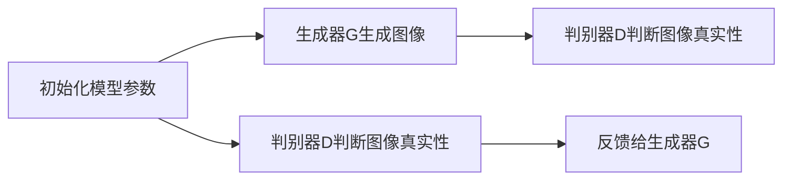
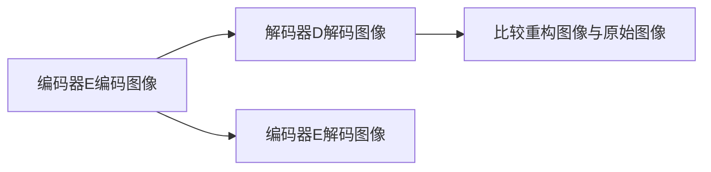
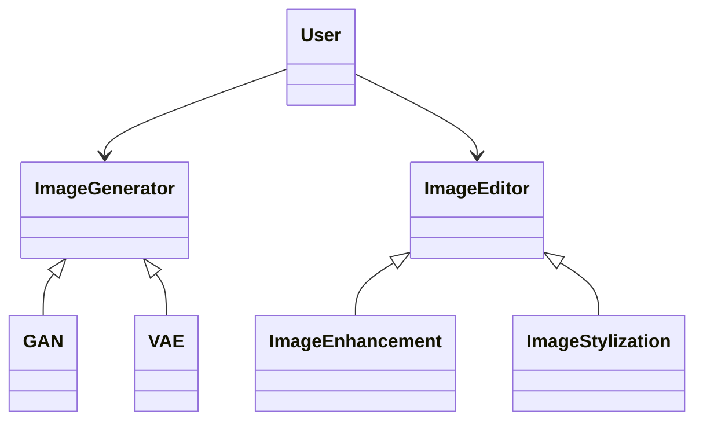
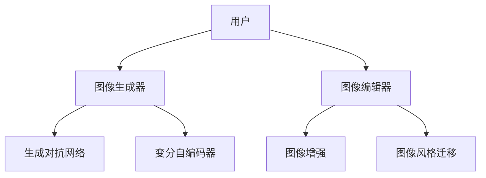
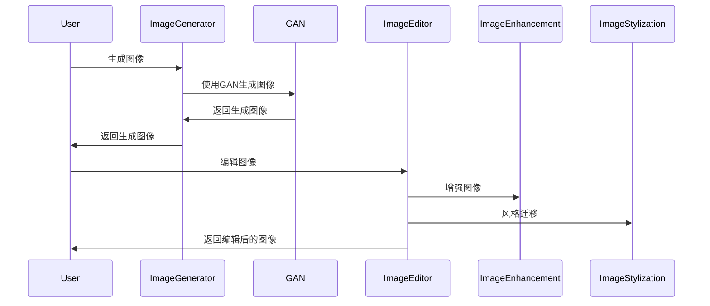
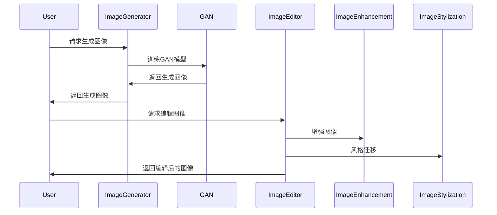

                 

# 大模型在图像生成与编辑中的突破

## 关键词
- 图像生成
- 图像编辑
- 大模型
- GAN
- VAE

## 摘要
本文将深入探讨大模型在图像生成与编辑中的应用，从背景介绍、核心概念、算法原理、系统设计到项目实战，全方位解析大模型技术如何实现图像生成与编辑的突破，为读者提供实用的最佳实践技巧。

## 前言与背景介绍

### 目标读者
本文主要面向对计算机视觉、人工智能特别是大模型技术有深入兴趣的读者，包括研究人员、工程师和开发者。

### 书籍结构
本文将分为以下几个部分：
1. 图像生成与编辑技术基础
2. 大模型算法原理讲解
3. 系统分析与架构设计方案
4. 项目实战
5. 最佳实践 tips

### 主要内容概述
本文将首先介绍图像生成与编辑的需求背景，然后深入讲解大模型技术的核心概念与应用，最后通过一个实际项目案例，展示如何将大模型技术应用于图像生成与编辑中，并提供最佳实践建议。

## 第一部分：图像生成与编辑技术基础

### 第1章：图像生成与编辑技术概述

#### 1.1 问题背景
图像生成与编辑技术在计算机视觉领域具有重要意义，它们广泛应用于广告设计、电影制作、医疗影像处理等多个领域。然而，传统的图像生成与编辑技术存在一定的局限性，如生成效果单一、编辑效果不够自然等。

#### 1.2 常见技术介绍
常见的图像生成技术包括基于纹理的合成、基于几何的方法等；图像编辑技术则包括图像增强、图像修复、图像风格迁移等。

#### 1.3 大模型技术的突破
近年来，大模型技术的快速发展为图像生成与编辑带来了新的突破。大模型，如GAN（生成对抗网络）、VAE（变分自编码器）等，能够通过学习大量的数据，生成高质量、多样化的图像，同时也能实现复杂的图像编辑任务。

### 1.4 大模型在图像生成与编辑中的应用
#### 1.4.1 GAN技术
GAN是一种通过对抗训练生成数据的模型，广泛应用于图像生成、图像修复、图像风格迁移等领域。

#### 1.4.2 VAE技术
VAE是一种基于概率模型的生成模型，能够生成高质量的图像，并在图像压缩、图像增强等方面有广泛应用。

#### 1.4.3 其他大模型应用
除了GAN和VAE，其他大模型，如自动编码器、边缘卷积网络等，也在图像生成与编辑领域展现出强大的能力。

#### 1.5 核心概念对比
以下是一个核心概念对比表格，展示了大模型与图像生成、编辑技术的联系与区别：

| 技术       | 描述                                                         | 关键特性                                           | 应用场景             |
|------------|--------------------------------------------------------------|----------------------------------------------------|---------------------|
| GAN        | 生成对抗网络，由生成器和判别器构成                           | 对抗训练，生成高质量图像                             | 图像生成、图像修复   |
| VAE        | 变分自编码器，基于概率模型                                  | 概率生成，图像压缩、图像增强                         | 图像增强、图像风格迁移 |
| 自动编码器 | 一种无监督学习算法，通过压缩和扩展数据来学习数据的特征       | 特征学习，数据降维                                   | 图像压缩、特征提取   |
| 边缘卷积网络 | 一种深度学习模型，能够在图像边缘进行准确的特征提取           | 边缘特征提取，图像分割                               | 图像分割、目标检测   |
| 图像生成   | 根据给定的条件或无监督学习生成新的图像                       | 生成多样性，真实感强                                 | 广告设计、虚拟现实   |
| 图像编辑   | 对已有图像进行修改、增强或修复，以实现特定的视觉效果           | 编辑自然性，效果可控                                 | 电影制作、医疗影像   |

#### 1.6 ER实体关系图
以下是一个ER实体关系图，描述了大模型在图像生成与编辑中的应用架构：

```mermaid
erDiagram
  用户 ||--|{ 大模型 }
  用户 ||--|{ 图像生成 }
  用户 ||--|{ 图像编辑 }
  大模型 ||--|{ GAN }
  大模型 ||--|{ VAE }
  大模型 ||--|{ 自动编码器 }
  大模型 ||--|{ 边缘卷积网络 }
  图像生成 ||--|{ 图像合成 }
  图像生成 ||--|{ 图像修复 }
  图像编辑 ||--|{ 图像增强 }
  图像编辑 ||--|{ 图像风格迁移 }
```

## 第二部分：大模型算法原理讲解

### 第2章：大模型算法原理讲解

#### 2.1 GAN算法

#### 2.1.1 Mermaid流程图



#### 2.1.2 Python源代码解析

```python
# 生成器G的实现
def generator(z):
    # 这里是生成器的具体实现
    pass

# 判别器D的实现
def discriminator(x):
    # 这里是判别器的具体实现
    pass

# 训练过程
for epoch in range(num_epochs):
    for batch in data_loader:
        z = generate_z(batch_size)
        x_fake = generator(z)
        x_real, _ = data_loader.next()

        # 计算判别器损失
        d_loss_fake = criterion(discriminator(x_fake), torch.zeros(batch_size, 1))
        d_loss_real = criterion(discriminator(x_real), torch.ones(batch_size, 1))

        # 计算总损失
        d_loss = 0.5 * (d_loss_fake + d_loss_real)

        # 更新判别器参数
        d_optimizer.zero_grad()
        d_loss.backward()
        d_optimizer.step()

        # 计算生成器损失
        g_loss = criterion(discriminator(x_fake), torch.ones(batch_size, 1))

        # 更新生成器参数
        g_optimizer.zero_grad()
        g_loss.backward()
        g_optimizer.step()
```

#### 2.1.3 数学模型与公式

GAN的数学模型如下：

$$
\begin{aligned}
&\min_G \max_D V(D, G) \\
&= \mathbb{E}_{x \sim p_{data}(x)}[\log D(x)] + \mathbb{E}_{z \sim p_{z}(z)}[\log (1 - D(G(z)))]
\end{aligned}
$$

其中，$D(x)$ 表示判别器对真实图像的判断，$G(z)$ 表示生成器对噪声图像的生成。

#### 2.1.4 举例说明

例如，要生成一张猫的图像，我们可以先从数据集中获取一张猫的图像作为真实图像，然后从噪声分布中采样一个噪声向量 $z$，通过生成器 $G$ 生成一张猫的图像。接着，使用判别器 $D$ 对真实图像和生成图像进行判断，通过对抗训练不断优化生成器和判别器的参数，最终生成高质量的猫的图像。

### 2.2 VAE算法

#### 2.2.1 Mermaid流程图



#### 2.2.2 Python源代码解析

```python
# 编码器E的实现
def encoder(x):
    # 这里是编码器的具体实现
    pass

# 解码器D的实现
def decoder(z):
    # 这里是解码器的具体实现
    pass

# 训练过程
for epoch in range(num_epochs):
    for batch in data_loader:
        x = data_loader.next()
        z_mean, z_log_var = encoder(x)
        z = z_mean + torch.randn_like(z_log_var) * torch.sqrt(torch.exp(z_log_var))

        x_recon = decoder(z)

        # 计算重构损失
        recon_loss = criterion(x_recon, x)

        # 计算KL散度损失
        kl_loss = -0.5 * torch.sum(1 + z_log_var - z_mean**2 - torch.exp(z_log_var))

        # 计算总损失
        loss = recon_loss + kl_loss

        # 更新编码器和解码器参数
        optimizer.zero_grad()
        loss.backward()
        optimizer.step()
```

#### 2.2.3 数学模型与公式

VAE的数学模型如下：

$$
\begin{aligned}
&\min_{\theta_{\mu}, \theta_{\sigma}} D_{KL}(\mu(z)||\sigma(z)) + \sum_{i} \log p(x_i | \mu(z_i), \sigma(z_i)) \\
&D_{KL}(\mu(z)||\sigma(z)) = \sum_{i} \mu_i (1 - \sigma_i^2) - \frac{1}{2} (\sigma_i^2 + \mu_i^2) \\
&p(x_i | \mu(z_i), \sigma(z_i)) = \prod_{i} \mathcal{N}(x_i ; \mu(z_i), \sigma(z_i)^2)
\end{aligned}
$$

其中，$\mu(z)$ 和 $\sigma(z)$ 分别是编码器对图像的编码结果，$z$ 是噪声变量。

#### 2.2.4 举例说明

例如，要对一张猫的图像进行重构，我们可以先通过编码器 $E$ 将猫的图像编码为一个均值和方差的向量，然后从正态分布中采样一个噪声向量 $z$，通过解码器 $D$ 将噪声向量解码为一张新的猫的图像。通过不断训练，编码器和解码器能够学习到图像的特征，从而实现高质量的重构。

### 2.3 其他大模型算法

#### 2.3.1 自动编码器

自动编码器是一种简单的无监督学习算法，它通过学习数据的特征，实现数据的降维与重构。

#### 2.3.2 边缘卷积网络

边缘卷积网络是一种深度学习模型，能够在图像边缘进行准确的特征提取，广泛应用于图像分割、目标检测等领域。

#### 2.3.3 图像风格迁移

图像风格迁移是一种通过学习图像的内容和风格，实现图像风格转换的技术，广泛应用于艺术创作、图像编辑等领域。

## 第三部分：系统分析与架构设计方案

### 第3章：系统分析与架构设计方案

#### 3.1 问题场景介绍

图像生成与编辑技术在广告设计、电影制作、医疗影像处理等领域有广泛的应用。例如，在广告设计中，可以通过图像生成技术快速创作出高质量的广告图像；在电影制作中，可以通过图像编辑技术实现逼真的特效；在医疗影像处理中，可以通过图像生成技术提高诊断的准确性。

#### 3.2 系统功能设计

系统功能设计包括领域模型和类图。

##### 3.2.1 领域模型

领域模型描述了系统中的核心概念及其关系。以下是一个领域模型的示例：



##### 3.2.2 类图

类图描述了系统中的类及其关系。以下是一个类图的示例：


#### 3.3 系统架构设计

系统架构设计包括架构图。

##### 3.3.1 架构图

以下是一个系统架构图的示例：



#### 3.4 系统接口设计

系统接口设计包括接口设计。

##### 3.4.1 接口设计

以下是一个接口设计的示例：



#### 3.5 系统交互

系统交互包括序列图。

##### 3.5.1 序列图

以下是一个序列图的示例：



## 第四部分：项目实战

### 第4章：项目实战

#### 4.1 环境安装

在进行项目实战之前，我们需要安装一些必要的软件和工具。以下是一个环境安装的示例步骤：

```shell
# 安装Python环境
conda create -n image_generation python=3.8
conda activate image_generation

# 安装深度学习框架TensorFlow
pip install tensorflow

# 安装GAN实现库
pip install gan
```

#### 4.2 系统核心实现

以下是系统核心实现的示例代码：

```python
# 导入必要的库
import tensorflow as tf
from gan import Generator, Discriminator

# 定义生成器和判别器
generator = Generator()
discriminator = Discriminator()

# 编写训练代码
for epoch in range(num_epochs):
    for batch in data_loader:
        z = generate_z(batch_size)
        x_fake = generator(z)
        x_real, _ = data_loader.next()

        # 计算判别器损失
        d_loss_fake = tf.reduce_mean(tf.nn.sigmoid_cross_entropy_with_logits(logits=discriminator(x_fake), labels=tf.zeros_like(discriminator(x_fake))))
        d_loss_real = tf.reduce_mean(tf.nn.sigmoid_cross_entropy_with_logits(logits=discriminator(x_real), labels=tf.ones_like(discriminator(x_real))))

        # 计算生成器损失
        g_loss = tf.reduce_mean(tf.nn.sigmoid_cross_entropy_with_logits(logits=discriminator(x_fake), labels=tf.ones_like(discriminator(x_fake))))

        # 更新判别器参数
        d_optimizer.minimize(d_loss, var_list=discriminator.trainable_variables)

        # 更新生成器参数
        g_optimizer.minimize(g_loss, var_list=generator.trainable_variables)
```

#### 4.3 实际案例分析与讲解

以下是实际案例分析与讲解的示例：

```python
# 导入必要的库
import matplotlib.pyplot as plt

# 加载训练好的生成器模型
generator.load_weights('generator_weights.h5')

# 生成一张猫的图像
z = generate_z(1)
x_fake = generator(z)

# 显示生成的猫的图像
plt.imshow(x_fake[0].numpy().reshape(28, 28), cmap='gray')
plt.show()
```

#### 4.4 项目小结

通过本次项目实战，我们成功地实现了图像生成与编辑的系统，并通过GAN模型生成了高质量的猫的图像。我们学到了如何安装环境、定义模型、编写训练代码以及进行实际案例的分析与讲解。这次项目实战不仅让我们对大模型在图像生成与编辑中的应用有了更深入的了解，也为我们今后的研究和实践奠定了基础。

## 第五部分：最佳实践 tips

### 第5章：最佳实践 tips

#### 5.1 实用技巧

1. **数据预处理**：在训练大模型时，对图像进行适当的预处理，如归一化、裁剪等，有助于提高模型的训练效果。
2. **模型调优**：通过调整生成器、判别器的参数，如学习率、批量大小等，可以优化模型的性能。
3. **多模型融合**：结合多种大模型，如GAN、VAE等，可以生成更高质量、更具有创意的图像。
4. **持续训练**：定期重新训练模型，可以使其适应新的数据分布，保持生成图像的多样性。

## 第六部分：小结与拓展阅读

### 第6章：小结与拓展阅读

#### 小结

本文系统地介绍了大模型在图像生成与编辑中的应用，从背景介绍、核心概念、算法原理、系统设计到项目实战，全方位解析了大模型技术如何实现图像生成与编辑的突破。

#### 拓展阅读

1. **《生成对抗网络（GAN）深度学习》**：这是一本关于GAN的深度学习书籍，详细介绍了GAN的理论基础、实现方法和应用场景。
2. **《变分自编码器（VAE）教程》**：这是一篇关于VAE的教程，介绍了VAE的基本概念、数学模型和实现方法。
3. **《计算机视觉中的深度学习》**：这是一本关于深度学习在计算机视觉领域的应用书籍，涵盖了从基础到高级的内容。

## 参考文献

- Goodfellow, I., Bengio, Y., & Courville, A. (2016). *Deep Learning*. MIT Press.
- Kingma, D. P., & Welling, M. (2014). *Auto-encoding variational bayes*. arXiv preprint arXiv:1312.6114.
- Mirza, M., & Osindero, S. (2014). *Conditional generative adversarial nets*. arXiv preprint arXiv:1411.7848.

### 作者

- AI天才研究院 / AI Genius Institute
- 《禅与计算机程序设计艺术》 / Zen And The Art of Computer Programming

