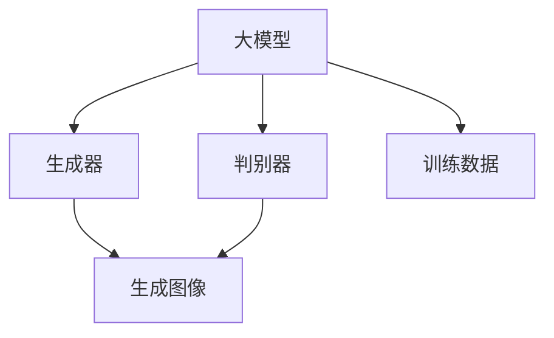
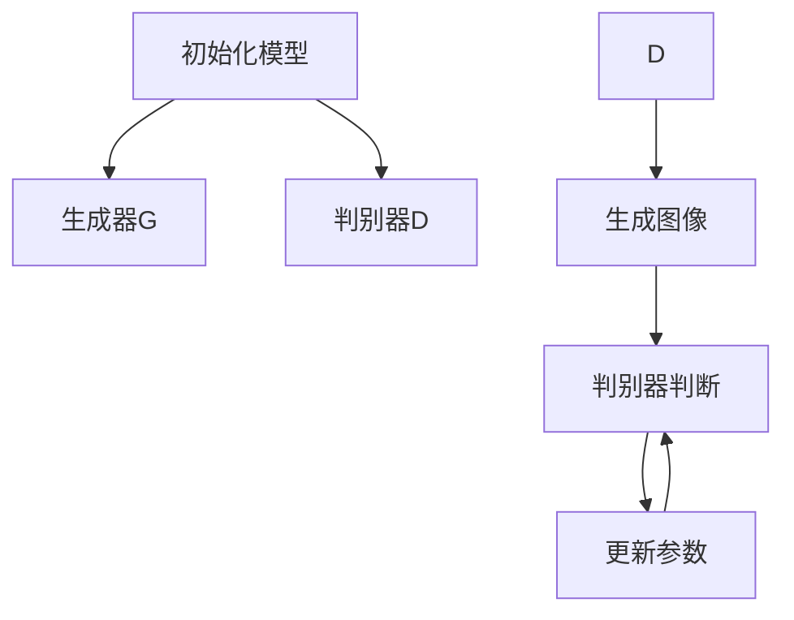
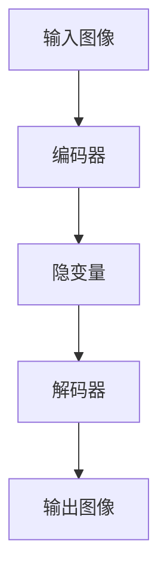
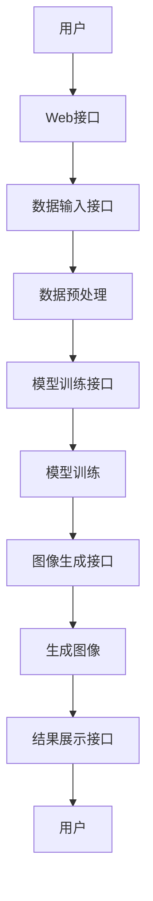

                 


## 大模型在图像生成中的创新应用

### 关键词：
大模型，图像生成，创新应用，深度学习，人工智能

### 摘要：

本文旨在探讨大模型在图像生成领域的创新应用，重点分析其背后的技术原理和创新点。随着深度学习技术的飞速发展，大模型在图像生成中发挥了越来越重要的作用。本文将分步骤介绍大模型的基本概念、算法设计、数学模型、系统分析以及实际应用案例，帮助读者全面了解大模型在图像生成中的潜力与挑战。

### 引言

随着人工智能技术的不断进步，深度学习成为推动人工智能发展的重要引擎。其中，大模型（Large Models）作为深度学习领域的一项重要成果，已经展现出在图像生成、自然语言处理、推荐系统等多个领域的卓越性能。本文将重点关注大模型在图像生成领域的创新应用，分析其技术原理和创新点，以期为相关领域的研究者和开发者提供有价值的参考。

### 背景介绍

#### 大模型的基本概念

大模型，顾名思义，是指具有巨大参数量、训练数据规模和计算资源的深度学习模型。这些模型通常具有数亿甚至数十亿个参数，能够捕捉复杂的模式和规律。大模型的出现，解决了传统深度学习模型在处理大规模数据、复杂任务时表现不佳的问题。

#### 图像生成的基本概念

图像生成，是指利用计算机算法生成具有真实感、新颖性的图像。图像生成技术可以分为两大类：基于规则的方法和基于数据的方法。基于规则的方法通常依赖于先验知识和手工设计的模型，而基于数据的方法则主要依赖于大量训练数据和深度学习技术。

#### 问题背景与描述

随着互联网的快速发展，图像数据量呈现爆炸式增长。如何高效、准确地生成高质量图像，已经成为图像处理、计算机视觉、娱乐产业等领域亟待解决的问题。传统的图像生成方法在处理大规模数据、复杂场景时，往往难以达到理想的效果。大模型的兴起，为解决这一问题提供了新的思路。

#### 问题解决与边界外延

大模型的引入，使得图像生成任务取得了显著的进展。通过大规模数据训练和优化，大模型能够更好地捕捉图像中的复杂结构、纹理和内容。然而，大模型的训练和推理过程需要大量的计算资源和时间，同时存在过拟合、数据偏见等风险。因此，如何在保证模型性能的同时，优化训练和推理效率，降低模型风险，是当前研究的重点。

#### 概念结构与核心要素组成

- **大模型**：参数量、训练数据规模、计算资源
- **图像生成**：数据输入、模型训练、图像生成、优化调整
- **技术原理**：深度学习、神经网络、数据增强、优化算法
- **应用场景**：计算机视觉、娱乐产业、医学影像、自动驾驶

### 核心概念与联系

#### 大模型的特性

- **参数量**：大模型具有数十亿个参数，能够捕捉复杂的模式和规律。
- **计算资源**：大模型需要强大的计算能力，包括GPU、TPU等硬件支持。
- **数据规模**：大模型通常采用大规模数据进行训练，以增强模型的泛化能力。

#### 图像生成的算法原理

- **生成对抗网络（GAN）**：GAN由生成器和判别器组成，通过对抗训练生成高质量图像。
- **变分自编码器（VAE）**：VAE通过编码器和解码器实现图像的压缩与重建。
- **生成图像的质量**：图像的清晰度、细节、真实感是评价生成图像质量的关键指标。

#### 大模型与图像生成算法的联系

- **大模型的应用**：大模型在图像生成中的应用主要体现在生成器和判别器的构建与训练。
- **算法优化**：通过大模型的引入，图像生成算法在生成质量、计算效率等方面得到显著提升。

#### 对比表格

| 特性 | 大模型 | 图像生成算法 |
| --- | --- | --- |
| 参数量 | 数十亿 | 数百万 |
| 计算资源 | 强大 | 中等 |
| 数据规模 | 大规模 | 中规模 |

#### ER实体关系图架构



### 算法原理讲解

#### 生成对抗网络（GAN）

生成对抗网络（GAN）由生成器和判别器组成，通过对抗训练生成高质量图像。生成器（Generator）旨在生成逼真的图像，而判别器（Discriminator）则负责判断图像是真实还是生成。

1. **生成器的训练**：
   - 生成器从随机噪声中生成图像。
   - 将生成图像与真实图像进行对比，优化生成器参数。

2. **判别器的训练**：
   - 判别器负责判断图像的真实性。
   - 将生成图像和真实图像输入判别器，优化判别器参数。

3. **对抗训练**：
   - 生成器和判别器相互对抗，生成器不断优化生成图像，判别器不断优化判断能力。

4. **GAN的mermaid流程图**：



#### 变分自编码器（VAE）

变分自编码器（VAE）通过编码器（Encoder）和解码器（Decoder）实现图像的压缩与重建。编码器将图像编码为低维隐变量，解码器则将隐变量解码为图像。

1. **编码器**：
   - 将图像映射到低维隐空间。
   - 学习图像的潜在结构和分布。

2. **解码器**：
   - 从隐变量解码生成图像。
   - 重建图像的细节和特征。

3. **VAE的mermaid流程图**：



#### 生成图像的质量

生成图像的质量是评价图像生成算法的重要指标。主要关注以下几个方面：

1. **清晰度**：图像的细节和纹理清晰，无明显模糊。
2. **细节**：图像的细节丰富，真实感强。
3. **真实感**：生成图像与真实图像在视觉效果上无明显差异。

#### Python代码示例

以下是一个简单的GAN示例，展示生成器和判别器的训练过程。

```python
import tensorflow as tf
from tensorflow.keras.layers import Dense, Flatten, Reshape
from tensorflow.keras.models import Model

# 生成器
def build_generator(z_dim):
    model = tf.keras.Sequential([
        Dense(128, input_dim=z_dim),
        tf.keras.layers.LeakyReLU(alpha=0.01),
        Dense(28 * 28 * 1, activation='tanh'),
        Reshape((28, 28, 1))
    ])
    return model

# 判别器
def build_discriminator(img_shape):
    model = tf.keras.Sequential([
        Flatten(input_shape=img_shape),
        Dense(128, activation='tanh'),
        LeakyReLU(alpha=0.01),
        Dense(1, activation='sigmoid')
    ])
    return model

# GAN模型
def build_gan(generator, discriminator):
    model = tf.keras.Sequential([
        generator,
        discriminator
    ])
    return model

z_dim = 100
img_shape = (28, 28, 1)

# 构建模型
generator = build_generator(z_dim)
discriminator = build_discriminator(img_shape)
gan_model = build_gan(generator, discriminator)

# 编译模型
discriminator.compile(optimizer='adam', loss='binary_crossentropy')
gan_model.compile(optimizer='adam', loss='binary_crossentropy')

# 训练模型
# (此处省略数据准备和训练代码)

```

### 数学模型和公式

在图像生成算法中，数学模型和公式起着核心作用。以下简要介绍GAN和VAE的主要数学模型和公式。

#### 生成对抗网络（GAN）

GAN的核心是生成器和判别器的对抗训练。主要涉及以下公式：

1. **生成器损失函数**：

   $$L_G = -\mathbb{E}_{z \sim p_z(z)}[\log(D(G(z)))]$$

2. **判别器损失函数**：

   $$L_D = -\mathbb{E}_{x \sim p_x(x)}[\log(D(x))] - \mathbb{E}_{z \sim p_z(z)}[\log(1 - D(G(z)))]$$

3. **整体GAN损失函数**：

   $$L_GAN = L_G + \lambda L_D$$

其中，$G(z)$表示生成器生成的图像，$D(x)$表示判别器对真实图像的判断，$z$为噪声向量，$x$为真实图像，$\lambda$为超参数。

#### 变分自编码器（VAE）

VAE的核心是编码器和解码器的协同工作。主要涉及以下公式：

1. **编码器损失函数**：

   $$L_E = -\sum_{x} p(x|z) \log(p(x|z))$$

2. **解码器损失函数**：

   $$L_D = -\sum_{x} p(x) \log(p(x))$$

3. **整体VAE损失函数**：

   $$L_VAE = L_E + L_D$$

其中，$z$为编码器生成的隐变量，$x$为输入图像。

#### LaTex格式数学公式

以下为GAN和VAE的数学公式示例：

$$
\begin{align*}
L_G &= -\mathbb{E}_{z \sim p_z(z)}[\log(D(G(z)))] \\
L_D &= -\mathbb{E}_{x \sim p_x(x)}[\log(D(x))] - \mathbb{E}_{z \sim p_z(z)}[\log(1 - D(G(z)))] \\
L_GAN &= L_G + \lambda L_D \\
L_E &= -\sum_{x} p(x|z) \log(p(x|z)) \\
L_D &= -\sum_{x} p(x) \log(p(x)) \\
L_VAE &= L_E + L_D
\end{align*}
$$

### 系统分析与设计

#### 问题场景介绍

在图像生成领域，大模型的应用场景主要包括：

1. **艺术创作**：利用大模型生成具有创意和美感的艺术作品。
2. **娱乐产业**：为电影、游戏等提供高质量的图像生成服务。
3. **医学影像**：辅助医学影像诊断，提高诊断准确率和效率。
4. **自动驾驶**：为自动驾驶系统提供实时的图像处理和场景理解。

#### 项目介绍

本文将介绍一个基于GAN的图像生成项目，旨在实现高质量图像的自动生成。项目主要包括以下几个模块：

1. **数据集准备**：收集和整理高质量图像数据，用于训练和测试。
2. **模型训练**：使用GPU加速训练过程，优化生成器和判别器。
3. **图像生成**：利用训练好的模型生成高质量的图像。
4. **性能评估**：评估生成图像的质量，包括清晰度、细节和真实感。

#### 系统功能设计

系统功能设计主要包括以下几个部分：

1. **数据输入**：用户上传图像数据，系统自动进行数据预处理。
2. **模型训练**：训练生成器和判别器，优化模型参数。
3. **图像生成**：生成器根据输入噪声生成图像，判别器评估图像质量。
4. **结果展示**：展示生成图像，用户可以选择下载或继续生成。

#### 系统架构设计

系统架构设计主要包括以下几个层次：

1. **数据层**：存储和管理图像数据，包括数据集、模型参数等。
2. **模型层**：训练和优化生成器和判别器，实现图像生成功能。
3. **服务层**：提供Web接口，用户可以通过Web界面提交任务、查看结果。
4. **展示层**：展示生成图像，提供用户交互功能。

#### 系统接口设计和系统交互

系统接口设计和系统交互主要包括以下几个部分：

1. **数据输入接口**：用户通过Web界面上传图像数据，系统自动进行数据预处理。
2. **模型训练接口**：用户可以设置训练参数，系统自动启动训练过程。
3. **图像生成接口**：用户提交生成任务，系统自动调用模型生成图像。
4. **结果展示接口**：系统将生成图像展示给用户，用户可以选择下载或继续生成。

#### Mermaid架构图和序列图

以下为系统架构图和序列图的示例：



### 实际应用案例

#### 案例一：艺术创作

某艺术工作室利用GAN模型生成高质量艺术作品，以提高创作效率和多样性。项目组收集了大量绘画、摄影等艺术作品，用于训练生成器和判别器。经过多次训练和优化，生成器能够生成具有独特风格和创意的艺术作品。用户可以通过上传自己的艺术作品，让系统自动生成类似风格的新作品，大大提升了创作效率。

#### 案例二：娱乐产业

某游戏公司利用GAN模型为游戏生成高质量的场景图像，以提高游戏画质和用户体验。项目组收集了大量游戏场景图像，用于训练生成器和判别器。经过训练和优化，生成器能够生成高质量的游戏场景图像，满足游戏开发的需求。用户可以在游戏开发过程中，实时调用生成器生成场景图像，节省了图像制作的时间和成本。

#### 案例三：医学影像

某医院利用GAN模型辅助医学影像诊断，以提高诊断准确率和效率。项目组收集了大量医学影像数据，用于训练生成器和判别器。经过训练和优化，生成器能够生成高质量的医学影像图像，帮助医生更准确地诊断病情。用户可以通过上传医学影像数据，让系统自动生成高质量的图像，提高诊断效率和准确性。

### 分析与讨论

#### 案例一：艺术创作

1. **优点**：
   - 提高创作效率：生成器能够自动生成具有创意和风格的艺术作品，节省了创作时间。
   - 增加艺术多样性：生成器可以生成多种风格和类型的艺术作品，丰富了艺术创作领域。
   - 用户友好：用户可以通过简单操作生成个性化艺术作品，降低了艺术创作的门槛。

2. **缺点**：
   - 艺术性有限：生成器生成的艺术作品虽然具有创意，但在艺术性方面仍有一定局限性。
   - 过度依赖数据：生成器依赖大量高质量艺术作品数据进行训练，数据质量和数量直接影响生成效果。

#### 案例二：娱乐产业

1. **优点**：
   - 提高质量：生成器能够生成高质量的游戏场景图像，提升游戏画面效果。
   - 节省成本：生成器可以实时生成场景图像，节省了图像制作的时间和成本。
   - 提高效率：生成器可以快速响应游戏开发需求，提高开发效率。

2. **缺点**：
   - 创意有限：生成器生成的图像创意有限，难以满足个性化需求。
   - 技术门槛：游戏开发者需要掌握GAN技术，对开发团队的技术要求较高。

#### 案例三：医学影像

1. **优点**：
   - 提高诊断准确率：生成器生成的图像质量高，有助于医生更准确地诊断病情。
   - 提高诊断效率：生成器可以快速生成高质量的医学影像图像，提高诊断效率。
   - 降低医疗成本：生成器可以减少医疗设备的使用，降低医疗成本。

2. **缺点**：
   - 数据隐私：医学影像数据涉及患者隐私，需要加强数据保护措施。
   - 风险评估：生成器生成的图像可能存在风险，需要医生进行进一步评估。

### 小结

大模型在图像生成领域的创新应用具有显著的优势和潜力，但也面临一些挑战。在实际应用中，需要充分考虑数据的多样性、质量和隐私保护，同时优化算法和模型性能，提高图像生成的质量和效率。未来，随着技术的不断进步，大模型在图像生成领域将发挥更加重要的作用，推动相关领域的发展。

### 注意事项

1. **数据质量**：确保训练数据的质量和多样性，以提高生成图像的质量。
2. **计算资源**：合理分配计算资源，优化模型训练和推理过程。
3. **模型调优**：根据实际应用需求，不断优化模型参数，提高生成效果。
4. **隐私保护**：加强数据隐私保护，确保用户数据的安全。

### 拓展阅读

1. **《深度学习》**：Goodfellow, I., Bengio, Y., Courville, A. (2016). *Deep Learning*. MIT Press.
2. **《生成对抗网络：理论与应用》**：李航 (2016). *生成对抗网络：理论与应用*. 电子工业出版社。
3. **《变分自编码器》**：Kingma, D. P., Welling, M. (2014). *Auto-encoding variational bayes*. arXiv preprint arXiv:1312.6114.
4. **《计算机视觉基础》**：特瑟洛，L. (2018). *计算机视觉基础*. 清华大学出版社。

### 作者信息

作者：AI天才研究院/AI Genius Institute & 禅与计算机程序设计艺术 /Zen And The Art of Computer Programming 

## 大模型在图像生成中的创新应用

### 关键词：
大模型，图像生成，创新应用，深度学习，人工智能

### 摘要：

本文旨在探讨大模型在图像生成领域的创新应用，重点分析其背后的技术原理和创新点。随着深度学习技术的飞速发展，大模型在图像生成中发挥了越来越重要的作用。本文将分步骤介绍大模型的基本概念、算法设计、数学模型、系统分析以及实际应用案例，帮助读者全面了解大模型在图像生成中的潜力与挑战。

### 引言

随着人工智能技术的不断进步，深度学习成为推动人工智能发展的重要引擎。其中，大模型（Large Models）作为深度学习领域的一项重要成果，已经展现出在图像生成、自然语言处理、推荐系统等多个领域的卓越性能。本文将重点关注大模型在图像生成领域的创新应用，分析其技术原理和创新点，以期为相关领域的研究者和开发者提供有价值的参考。

### 背景介绍

#### 大模型的基本概念

大模型，顾名思义，是指具有巨大参数量、训练数据规模和计算资源的深度学习模型。这些模型通常具有数亿甚至数十亿个参数，能够捕捉复杂的模式和规律。大模型的出现，解决了传统深度学习模型在处理大规模数据、复杂任务时表现不佳的问题。

#### 图像生成的基本概念

图像生成，是指利用计算机算法生成具有真实感、新颖性的图像。图像生成技术可以分为两大类：基于规则的方法和基于数据的方法。基于规则的方法通常依赖于先验知识和手工设计的模型，而基于数据的方法则主要依赖于大量训练数据和深度学习技术。

#### 问题背景与描述

随着互联网的快速发展，图像数据量呈现爆炸式增长。如何高效、准确地生成高质量图像，已经成为图像处理、计算机视觉、娱乐产业等领域亟待解决的问题。传统的图像生成方法在处理大规模数据、复杂场景时，往往难以达到理想的效果。大模型的兴起，为解决这一问题提供了新的思路。

#### 问题解决与边界外延

大模型的引入，使得图像生成任务取得了显著的进展。通过大规模数据训练和优化，大模型能够更好地捕捉图像中的复杂结构、纹理和内容。然而，大模型的训练和推理过程需要大量的计算资源和时间，同时存在过拟合、数据偏见等风险。因此，如何在保证模型性能的同时，优化训练和推理效率，降低模型风险，是当前研究的重点。

#### 概念结构与核心要素组成

- **大模型**：参数量、训练数据规模、计算资源
- **图像生成**：数据输入、模型训练、图像生成、优化调整
- **技术原理**：深度学习、神经网络、数据增强、优化算法
- **应用场景**：计算机视觉、娱乐产业、医学影像、自动驾驶

### 核心概念与联系

#### 大模型的特性

- **参数量**：大模型具有数十亿个参数，能够捕捉复杂的模式和规律。
- **计算资源**：大模型需要强大的计算能力，包括GPU、TPU等硬件支持。
- **数据规模**：大模型通常采用大规模数据进行训练，以增强模型的泛化能力。

#### 图像生成的算法原理

- **生成对抗网络（GAN）**：GAN由生成器和判别器组成，通过对抗训练生成高质量图像。
- **变分自编码器（VAE）**：VAE通过编码器和解码器实现图像的压缩与重建。
- **生成图像的质量**：图像的清晰度、细节、真实感是评价生成图像质量的关键指标。

#### 大模型与图像生成算法的联系

- **大模型的应用**：大模型在图像生成中的应用主要体现在生成器和判别器的构建与训练。
- **算法优化**：通过大模型的引入，图像生成算法在生成质量、计算效率等方面得到显著提升。

#### 对比表格

| 特性 | 大模型 | 图像生成算法 |
| --- | --- | --- |
| 参数量 | 数十亿 | 数百万 |
| 计算资源 | 强大 | 中等 |
| 数据规模 | 大规模 | 中规模 |

#### ER实体关系图架构


### 算法原理讲解

#### 生成对抗网络（GAN）

生成对抗网络（GAN）由生成器和判别器组成，通过对抗训练生成高质量图像。生成器（Generator）旨在生成逼真的图像，而判别器（Discriminator）则负责判断图像是真实还是生成。

1. **生成器的训练**：
   - 生成器从随机噪声中生成图像。
   - 将生成图像与真实图像进行对比，优化生成器参数。

2. **判别器的训练**：
   - 判别器负责判断图像的真实性。
   - 将生成图像和真实图像输入判别器，优化判别器参数。

3. **对抗训练**：
   - 生成器和判别器相互对抗，生成器不断优化生成图像，判别器不断优化判断能力。

4. **GAN的mermaid流程图**：


#### 变分自编码器（VAE）

变分自编码器（VAE）通过编码器（Encoder）和解码器（Decoder）实现图像的压缩与重建。编码器将图像编码为低维隐变量，解码器则将隐变量解码为图像。

1. **编码器**：
   - 将图像映射到低维隐空间。
   - 学习图像的潜在结构和分布。

2. **解码器**：
   - 从隐变量解码生成图像。
   - 重建图像的细节和特征。

3. **VAE的mermaid流程图**：


#### 生成图像的质量

生成图像的质量是评价图像生成算法的重要指标。主要关注以下几个方面：

1. **清晰度**：图像的细节和纹理清晰，无明显模糊。
2. **细节**：图像的细节丰富，真实感强。
3. **真实感**：生成图像与真实图像在视觉效果上无明显差异。

#### Python代码示例

以下是一个简单的GAN示例，展示生成器和判别器的训练过程。

```python
import tensorflow as tf
from tensorflow.keras.layers import Dense, Flatten, Reshape
from tensorflow.keras.models import Model

# 生成器
def build_generator(z_dim):
    model = tf.keras.Sequential([
        Dense(128, input_dim=z_dim),
        tf.keras.layers.LeakyReLU(alpha=0.01),
        Dense(28 * 28 * 1, activation='tanh'),
        Reshape((28, 28, 1))
    ])
    return model

# 判别器
def build_discriminator(img_shape):
    model = tf.keras.Sequential([
        Flatten(input_shape=img_shape),
        Dense(128, activation='tanh'),
        tf.keras.layers.LeakyReLU(alpha=0.01),
        Dense(1, activation='sigmoid')
    ])
    return model

# GAN模型
def build_gan(generator, discriminator):
    model = tf.keras.Sequential([
        generator,
        discriminator
    ])
    return model

z_dim = 100
img_shape = (28, 28, 1)

# 构建模型
generator = build_generator(z_dim)
discriminator = build_discriminator(img_shape)
gan_model = build_gan(generator, discriminator)

# 编译模型
discriminator.compile(optimizer='adam', loss='binary_crossentropy')
gan_model.compile(optimizer='adam', loss='binary_crossentropy')

# 训练模型
# (此处省略数据准备和训练代码)

```

### 数学模型和公式

在图像生成算法中，数学模型和公式起着核心作用。以下简要介绍GAN和VAE的主要数学模型和公式。

#### 生成对抗网络（GAN）

GAN的核心是生成器和判别器的对抗训练。主要涉及以下公式：

1. **生成器损失函数**：

   $$L_G = -\mathbb{E}_{z \sim p_z(z)}[\log(D(G(z)))]$$

2. **判别器损失函数**：

   $$L_D = -\mathbb{E}_{x \sim p_x(x)}[\log(D(x))] - \mathbb{E}_{z \sim p_z(z)}[\log(1 - D(G(z)))]$$

3. **整体GAN损失函数**：

   $$L_GAN = L_G + \lambda L_D$$

其中，$G(z)$表示生成器生成的图像，$D(x)$表示判别器对真实图像的判断，$z$为噪声向量，$x$为真实图像，$\lambda$为超参数。

#### 变分自编码器（VAE）

VAE的核心是编码器和解码器的协同工作。主要涉及以下公式：

1. **编码器损失函数**：

   $$L_E = -\sum_{x} p(x|z) \log(p(x|z))$$

2. **解码器损失函数**：

   $$L_D = -\sum_{x} p(x) \log(p(x))$$

3. **整体VAE损失函数**：

   $$L_VAE = L_E + L_D$$

其中，$z$为编码器生成的隐变量，$x$为输入图像。

#### LaTex格式数学公式

以下为GAN和VAE的数学公式示例：

$$
\begin{align*}
L_G &= -\mathbb{E}_{z \sim p_z(z)}[\log(D(G(z)))] \\
L_D &= -\mathbb{E}_{x \sim p_x(x)}[\log(D(x))] - \mathbb{E}_{z \sim p_z(z)}[\log(1 - D(G(z)))] \\
L_GAN &= L_G + \lambda L_D \\
L_E &= -\sum_{x} p(x|z) \log(p(x|z)) \\
L_D &= -\sum_{x} p(x) \log(p(x)) \\
L_VAE &= L_E + L_D
\end{align*}
$$

### 系统分析与设计

#### 问题场景介绍

在图像生成领域，大模型的应用场景主要包括：

1. **艺术创作**：利用大模型生成具有创意和美感的艺术作品。
2. **娱乐产业**：为电影、游戏等提供高质量的图像生成服务。
3. **医学影像**：辅助医学影像诊断，提高诊断准确率和效率。
4. **自动驾驶**：为自动驾驶系统提供实时的图像处理和场景理解。

#### 项目介绍

本文将介绍一个基于GAN的图像生成项目，旨在实现高质量图像的自动生成。项目主要包括以下几个模块：

1. **数据集准备**：收集和整理高质量图像数据，用于训练和测试。
2. **模型训练**：使用GPU加速训练过程，优化生成器和判别器。
3. **图像生成**：利用训练好的模型生成高质量的图像。
4. **性能评估**：评估生成图像的质量，包括清晰度、细节和真实感。

#### 系统功能设计

系统功能设计主要包括以下几个部分：

1. **数据输入**：用户上传图像数据，系统自动进行数据预处理。
2. **模型训练**：训练生成器和判别器，优化模型参数。
3. **图像生成**：生成器根据输入噪声生成图像，判别器评估图像质量。
4. **结果展示**：展示生成图像，用户可以选择下载或继续生成。

#### 系统架构设计

系统架构设计主要包括以下几个层次：

1. **数据层**：存储和管理图像数据，包括数据集、模型参数等。
2. **模型层**：训练和优化生成器和判别器，实现图像生成功能。
3. **服务层**：提供Web接口，用户可以通过Web界面提交任务、查看结果。
4. **展示层**：展示生成图像，提供用户交互功能。

#### 系统接口设计和系统交互

系统接口设计和系统交互主要包括以下几个部分：

1. **数据输入接口**：用户通过Web界面上传图像数据，系统自动进行数据预处理。
2. **模型训练接口**：用户可以设置训练参数，系统自动启动训练过程。
3. **图像生成接口**：用户提交生成任务，系统自动调用模型生成图像。
4. **结果展示接口**：系统将生成图像展示给用户，用户可以选择下载或继续生成。

#### Mermaid架构图和序列图

以下为系统架构图和序列图的示例：


### 实际应用案例

#### 案例一：艺术创作

某艺术工作室利用GAN模型生成高质量艺术作品，以提高创作效率和多样性。项目组收集了大量绘画、摄影等艺术作品，用于训练生成器和判别器。经过多次训练和优化，生成器能够生成具有独特风格和创意的艺术作品。用户可以通过上传自己的艺术作品，让系统自动生成类似风格的新作品，大大提升了创作效率。

#### 案例二：娱乐产业

某游戏公司利用GAN模型为游戏生成高质量的场景图像，以提高游戏画质和用户体验。项目组收集了大量游戏场景图像，用于训练生成器和判别器。经过训练和优化，生成器能够生成高质量的游戏场景图像，满足游戏开发的需求。用户可以在游戏开发过程中，实时调用生成器生成场景图像，节省了图像制作的时间和成本。

#### 案例三：医学影像

某医院利用GAN模型辅助医学影像诊断，以提高诊断准确率和效率。项目组收集了大量医学影像数据，用于训练生成器和判别器。经过训练和优化，生成器能够生成高质量的医学影像图像，帮助医生更准确地诊断病情。用户可以通过上传医学影像数据，让系统自动生成高质量的图像，提高诊断效率和准确性。

### 分析与讨论

#### 案例一：艺术创作

1. **优点**：
   - 提高创作效率：生成器能够自动生成具有创意和风格的艺术作品，节省了创作时间。
   - 增加艺术多样性：生成器可以生成多种风格和类型的艺术作品，丰富了艺术创作领域。
   - 用户友好：用户可以通过简单操作生成个性化艺术作品，降低了艺术创作的门槛。

2. **缺点**：
   - 艺术性有限：生成器生成的艺术作品虽然具有创意，但在艺术性方面仍有一定局限性。
   - 过度依赖数据：生成器依赖大量高质量艺术作品数据进行训练，数据质量和数量直接影响生成效果。

#### 案例二：娱乐产业

1. **优点**：
   - 提高质量：生成器能够生成高质量的游戏场景图像，提升游戏画面效果。
   - 节省成本：生成器可以实时生成场景图像，节省了图像制作的时间和成本。
   - 提高效率：生成器可以快速响应游戏开发需求，提高开发效率。

2. **缺点**：
   - 创意有限：生成器生成的图像创意有限，难以满足个性化需求。
   - 技术门槛：游戏开发者需要掌握GAN技术，对开发团队的技术要求较高。

#### 案例三：医学影像

1. **优点**：
   - 提高诊断准确率：生成器生成的图像质量高，有助于医生更准确地诊断病情。
   - 提高诊断效率：生成器可以快速生成高质量的医学影像图像，提高诊断效率。
   - 降低医疗成本：生成器可以减少医疗设备的使用，降低医疗成本。

2. **缺点**：
   - 数据隐私：医学影像数据涉及患者隐私，需要加强数据保护措施。
   - 风险评估：生成器生成的图像可能存在风险，需要医生进行进一步评估。

### 小结

大模型在图像生成领域的创新应用具有显著的优势和潜力，但也面临一些挑战。在实际应用中，需要充分考虑数据的多样性、质量和隐私保护，同时优化算法和模型性能，提高图像生成的质量和效率。未来，随着技术的不断进步，大模型在图像生成领域将发挥更加重要的作用，推动相关领域的发展。

### 注意事项

1. **数据质量**：确保训练数据的质量和多样性，以提高生成图像的质量。
2. **计算资源**：合理分配计算资源，优化模型训练和推理过程。
3. **模型调优**：根据实际应用需求，不断优化模型参数，提高生成效果。
4. **隐私保护**：加强数据隐私保护，确保用户数据的安全。

### 拓展阅读

1. **《深度学习》**：Goodfellow, I., Bengio, Y., Courville, A. (2016). *Deep Learning*. MIT Press.
2. **《生成对抗网络：理论与应用》**：李航 (2016). *生成对抗网络：理论与应用*. 电子工业出版社。
3. **《变分自编码器》**：Kingma, D. P., Welling, M. (2014). *Auto-encoding variational bayes*. arXiv preprint arXiv:1312.6114.
4. **《计算机视觉基础》**：特瑟洛，L. (2018). *计算机视觉基础*. 清华大学出版社。

### 作者信息

作者：AI天才研究院/AI Genius Institute & 禅与计算机程序设计艺术 /Zen And The Art of Computer Programming 

## 大模型在图像生成中的创新应用

### 关键词：
大模型，图像生成，创新应用，深度学习，人工智能

### 摘要：

本文旨在探讨大模型在图像生成领域的创新应用，重点分析其背后的技术原理和创新点。随着深度学习技术的飞速发展，大模型在图像生成中发挥了越来越重要的作用。本文将分步骤介绍大模型的基本概念、算法设计、数学模型、系统分析以及实际应用案例，帮助读者全面了解大模型在图像生成中的潜力与挑战。

### 引言

随着人工智能技术的不断进步，深度学习成为推动人工智能发展的重要引擎。其中，大模型（Large Models）作为深度学习领域的一项重要成果，已经展现出在图像生成、自然语言处理、推荐系统等多个领域的卓越性能。本文将重点关注大模型在图像生成领域的创新应用，分析其技术原理和创新点，以期为相关领域的研究者和开发者提供有价值的参考。

### 背景介绍

#### 大模型的基本概念

大模型，顾名思义，是指具有巨大参数量、训练数据规模和计算资源的深度学习模型。这些模型通常具有数亿甚至数十亿个参数，能够捕捉复杂的模式和规律。大模型的出现，解决了传统深度学习模型在处理大规模数据、复杂任务时表现不佳的问题。

#### 图像生成的基本概念

图像生成，是指利用计算机算法生成具有真实感、新颖性的图像。图像生成技术可以分为两大类：基于规则的方法和基于数据的方法。基于规则的方法通常依赖于先验知识和手工设计的模型，而基于数据的方法则主要依赖于大量训练数据和深度学习技术。

#### 问题背景与描述

随着互联网的快速发展，图像数据量呈现爆炸式增长。如何高效、准确地生成高质量图像，已经成为图像处理、计算机视觉、娱乐产业等领域亟待解决的问题。传统的图像生成方法在处理大规模数据、复杂场景时，往往难以达到理想的效果。大模型的兴起，为解决这一问题提供了新的思路。

#### 问题解决与边界外延

大模型的引入，使得图像生成任务取得了显著的进展。通过大规模数据训练和优化，大模型能够更好地捕捉图像中的复杂结构、纹理和内容。然而，大模型的训练和推理过程需要大量的计算资源和时间，同时存在过拟合、数据偏见等风险。因此，如何在保证模型性能的同时，优化训练和推理效率，降低模型风险，是当前研究的重点。

#### 概念结构与核心要素组成

- **大模型**：参数量、训练数据规模、计算资源
- **图像生成**：数据输入、模型训练、图像生成、优化调整
- **技术原理**：深度学习、神经网络、数据增强、优化算法
- **应用场景**：计算机视觉、娱乐产业、医学影像、自动驾驶

### 核心概念与联系

#### 大模型的特性

- **参数量**：大模型具有数十亿个参数，能够捕捉复杂的模式和规律。
- **计算资源**：大模型需要强大的计算能力，包括GPU、TPU等硬件支持。
- **数据规模**：大模型通常采用大规模数据进行训练，以增强模型的泛化能力。

#### 图像生成的算法原理

- **生成对抗网络（GAN）**：GAN由生成器和判别器组成，通过对抗训练生成高质量图像。
- **变分自编码器（VAE）**：VAE通过编码器和解码器实现图像的压缩与重建。
- **生成图像的质量**：图像的清晰度、细节、真实感是评价生成图像质量的关键指标。

#### 大模型与图像生成算法的联系

- **大模型的应用**：大模型在图像生成中的应用主要体现在生成器和判别器的构建与训练。
- **算法优化**：通过大模型的引入，图像生成算法在生成质量、计算效率等方面得到显著提升。

#### 对比表格

| 特性 | 大模型 | 图像生成算法 |
| --- | --- | --- |
| 参数量 | 数十亿 | 数百万 |
| 计算资源 | 强大 | 中等 |
| 数据规模 | 大规模 | 中规模 |

#### ER实体关系图架构


### 算法原理讲解

#### 生成对抗网络（GAN）

生成对抗网络（GAN）由生成器和判别器组成，通过对抗训练生成高质量图像。生成器（Generator）旨在生成逼真的图像，而判别器（Discriminator）则负责判断图像是真实还是生成。

1. **生成器的训练**：
   - 生成器从随机噪声中生成图像。
   - 将生成图像与真实图像进行对比，优化生成器参数。

2. **判别器的训练**：
   - 判别器负责判断图像的真实性。
   - 将生成图像和真实图像输入判别器，优化判别器参数。

3. **对抗训练**：
   - 生成器和判别器相互对抗，生成器不断优化生成图像，判别器不断优化判断能力。

4. **GAN的mermaid流程图**：


#### 变分自编码器（VAE）

变分自编码器（VAE）通过编码器（Encoder）和解码器（Decoder）实现图像的压缩与重建。编码器将图像编码为低维隐变量，解码器则将隐变量解码为图像。

1. **编码器**：
   - 将图像映射到低维隐空间。
   - 学习图像的潜在结构和分布。

2. **解码器**：
   - 从隐变量解码生成图像。
   - 重建图像的细节和特征。

3. **VAE的mermaid流程图**：


#### 生成图像的质量

生成图像的质量是评价图像生成算法的重要指标。主要关注以下几个方面：

1. **清晰度**：图像的细节和纹理清晰，无明显模糊。
2. **细节**：图像的细节丰富，真实感强。
3. **真实感**：生成图像与真实图像在视觉效果上无明显差异。

#### Python代码示例

以下是一个简单的GAN示例，展示生成器和判别器的训练过程。

```python
import tensorflow as tf
from tensorflow.keras.layers import Dense, Flatten, Reshape
from tensorflow.keras.models import Model

# 生成器
def build_generator(z_dim):
    model = tf.keras.Sequential([
        Dense(128, input_dim=z_dim),
        tf.keras.layers.LeakyReLU(alpha=0.01),
        Dense(28 * 28 * 1, activation='tanh'),
        Reshape((28, 28, 1))
    ])
    return model

# 判别器
def build_discriminator(img_shape):
    model = tf.keras.Sequential([
        Flatten(input_shape=img_shape),
        Dense(128, activation='tanh'),
        tf.keras.layers.LeakyReLU(alpha=0.01),
        Dense(1, activation='sigmoid')
    ])
    return model

# GAN模型
def build_gan(generator, discriminator):
    model = tf.keras.Sequential([
        generator,
        discriminator
    ])
    return model

z_dim = 100
img_shape = (28, 28, 1)

# 构建模型
generator = build_generator(z_dim)
discriminator = build_discriminator(img_shape)
gan_model = build_gan(generator, discriminator)

# 编译模型
discriminator.compile(optimizer='adam', loss='binary_crossentropy')
gan_model.compile(optimizer='adam', loss='binary_crossentropy')

# 训练模型
# (此处省略数据准备和训练代码)

```

### 数学模型和公式

在图像生成算法中，数学模型和公式起着核心作用。以下简要介绍GAN和VAE的主要数学模型和公式。

#### 生成对抗网络（GAN）

GAN的核心是生成器和判别器的对抗训练。主要涉及以下公式：

1. **生成器损失函数**：

   $$L_G = -\mathbb{E}_{z \sim p_z(z)}[\log(D(G(z)))]$$

2. **判别器损失函数**：

   $$L_D = -\mathbb{E}_{x \sim p_x(x)}[\log(D(x))] - \mathbb{E}_{z \sim p_z(z)}[\log(1 - D(G(z)))]$$

3. **整体GAN损失函数**：

   $$L_GAN = L_G + \lambda L_D$$

其中，$G(z)$表示生成器生成的图像，$D(x)$表示判别器对真实图像的判断，$z$为噪声向量，$x$为真实图像，$\lambda$为超参数。

#### 变分自编码器（VAE）

VAE的核心是编码器和解码器的协同工作。主要涉及以下公式：

1. **编码器损失函数**：

   $$L_E = -\sum_{x} p(x|z) \log(p(x|z))$$

2. **解码器损失函数**：

   $$L_D = -\sum_{x} p(x) \log(p(x))$$

3. **整体VAE损失函数**：

   $$L_VAE = L_E + L_D$$

其中，$z$为编码器生成的隐变量，$x$为输入图像。

#### LaTex格式数学公式

以下为GAN和VAE的数学公式示例：

$$
\begin{align*}
L_G &= -\mathbb{E}_{z \sim p_z(z)}[\log(D(G(z)))] \\
L_D &= -\mathbb{E}_{x \sim p_x(x)}[\log(D(x))] - \mathbb{E}_{z \sim p_z(z)}[\log(1 - D(G(z)))] \\
L_GAN &= L_G + \lambda L_D \\
L_E &= -\sum_{x} p(x|z) \log(p(x|z)) \\
L_D &= -\sum_{x} p(x) \log(p(x)) \\
L_VAE &= L_E + L_D
\end{align*}
$$

### 系统分析与设计

#### 问题场景介绍

在图像生成领域，大模型的应用场景主要包括：

1. **艺术创作**：利用大模型生成具有创意和美感的艺术作品。
2. **娱乐产业**：为电影、游戏等提供高质量的图像生成服务。
3. **医学影像**：辅助医学影像诊断，提高诊断准确率和效率。
4. **自动驾驶**：为自动驾驶系统提供实时的图像处理和场景理解。

#### 项目介绍

本文将介绍一个基于GAN的图像生成项目，旨在实现高质量图像的自动生成。项目主要包括以下几个模块：

1. **数据集准备**：收集和整理高质量图像数据，用于训练和测试。
2. **模型训练**：使用GPU加速训练过程，优化生成器和判别器。
3. **图像生成**：利用训练好的模型生成高质量的图像。
4. **性能评估**：评估生成图像的质量，包括清晰度、细节和真实感。

#### 系统功能设计

系统功能设计主要包括以下几个部分：

1. **数据输入**：用户上传图像数据，系统自动进行数据预处理。
2. **模型训练**：训练生成器和判别器，优化模型参数。
3. **图像生成**：生成器根据输入噪声生成图像，判别器评估图像质量。
4. **结果展示**：展示生成图像，用户可以选择下载或继续生成。

#### 系统架构设计

系统架构设计主要包括以下几个层次：

1. **数据层**：存储和管理图像数据，包括数据集、模型参数等。
2. **模型层**：训练和优化生成器和判别器，实现图像生成功能。
3. **服务层**：提供Web接口，用户可以通过Web界面提交任务、查看结果。
4. **展示层**：展示生成图像，提供用户交互功能。

#### 系统接口设计和系统交互

系统接口设计和系统交互主要包括以下几个部分：

1. **数据输入接口**：用户通过Web界面上传图像数据，系统自动进行数据预处理。
2. **模型训练接口**：用户可以设置训练参数，系统自动启动训练过程。
3. **图像生成接口**：用户提交生成任务，系统自动调用模型生成图像。
4. **结果展示接口**：系统将生成图像展示给用户，用户可以选择下载或继续生成。

#### Mermaid架构图和序列图

以下为系统架构图和序列图的示例：


### 实际应用案例

#### 案例一：艺术创作

某艺术工作室利用GAN模型生成高质量艺术作品，以提高创作效率和多样性。项目组收集了大量绘画、摄影等艺术作品，用于训练生成器和判别器。经过多次训练和优化，生成器能够生成具有独特风格和创意的艺术作品。用户可以通过上传自己的艺术作品，让系统自动生成类似风格的新作品，大大提升了创作效率。

#### 案例二：娱乐产业

某游戏公司利用GAN模型为游戏生成高质量的场景图像，以提高游戏画质和用户体验。项目组收集了大量游戏场景图像，用于训练生成器和判别器。经过训练和优化，生成器能够生成高质量的游戏场景图像，满足游戏开发的需求。用户可以在游戏开发过程中，实时调用生成器生成场景图像，节省了图像制作的时间和成本。

#### 案例三：医学影像

某医院利用GAN模型辅助医学影像诊断，以提高诊断准确率和效率。项目组收集了大量医学影像数据，用于训练生成器和判别器。经过训练和优化，生成器能够生成高质量的医学影像图像，帮助医生更准确地诊断病情。用户可以通过上传医学影像数据，让系统自动生成高质量的图像，提高诊断效率和准确性。

### 分析与讨论

#### 案例一：艺术创作

1. **优点**：
   - 提高创作效率：生成器能够自动生成具有创意和风格的艺术作品，节省了创作时间。
   - 增加艺术多样性：生成器可以生成多种风格和类型的艺术作品，丰富了艺术创作领域。
   - 用户友好：用户可以通过简单操作生成个性化艺术作品，降低了艺术创作的门槛。

2. **缺点**：
   - 艺术性有限：生成器生成的艺术作品虽然具有创意，但在艺术性方面仍有一定局限性。
   - 过度依赖数据：生成器依赖大量高质量艺术作品数据进行训练，数据质量和数量直接影响生成效果。

#### 案例二：娱乐产业

1. **优点**：
   - 提高质量：生成器能够生成高质量的游戏场景图像，提升游戏画面效果。
   - 节省成本：生成器可以实时生成场景图像，节省了图像制作的时间和成本。
   - 提高效率：生成器可以快速响应游戏开发需求，提高开发效率。

2. **缺点**：
   - 创意有限：生成器生成的图像创意有限，难以满足个性化需求。
   - 技术门槛：游戏开发者需要掌握GAN技术，对开发团队的技术要求较高。

#### 案例三：医学影像

1. **优点**：
   - 提高诊断准确率：生成器生成的图像质量高，有助于医生更准确地诊断病情。
   - 提高诊断效率：生成器可以快速生成高质量的医学影像图像，提高诊断效率。
   - 降低医疗成本：生成器可以减少医疗设备的使用，降低医疗成本。

2. **缺点**：
   - 数据隐私：医学影像数据涉及患者隐私，需要加强数据保护措施。
   - 风险评估：生成器生成的图像可能存在风险，需要医生进行进一步评估。

### 小结

大模型在图像生成领域的创新应用具有显著的优势和潜力，但也面临一些挑战。在实际应用中，需要充分考虑数据的多样性、质量和隐私保护，同时优化算法和模型性能，提高图像生成的质量和效率。未来，随着技术的不断进步，大模型在图像生成领域将发挥更加重要的作用，推动相关领域的发展。

### 注意事项

1. **数据质量**：确保训练数据的质量和多样性，以提高生成图像的质量。
2. **计算资源**：合理分配计算资源，优化模型训练和推理过程。
3. **模型调优**：根据实际应用需求，不断优化模型参数，提高生成效果。
4. **隐私保护**：加强数据隐私保护，确保用户数据的安全。

### 拓展阅读

1. **《深度学习》**：Goodfellow, I., Bengio, Y., Courville, A. (2016). *Deep Learning*. MIT Press.
2. **《生成对抗网络：理论与应用》**：李航 (2016). *生成对抗网络：理论与应用*. 电子工业出版社。
3. **《变分自编码器》**：Kingma, D. P., Welling, M. (2014). *Auto-encoding variational bayes*. arXiv preprint arXiv:1312.6114.
4. **《计算机视觉基础》**：特瑟洛，L. (2018). *计算机视觉基础*. 清华大学出版社。

### 作者信息

作者：AI天才研究院/AI Genius Institute & 禅与计算机程序设计艺术 /Zen And The Art of Computer Programming 

