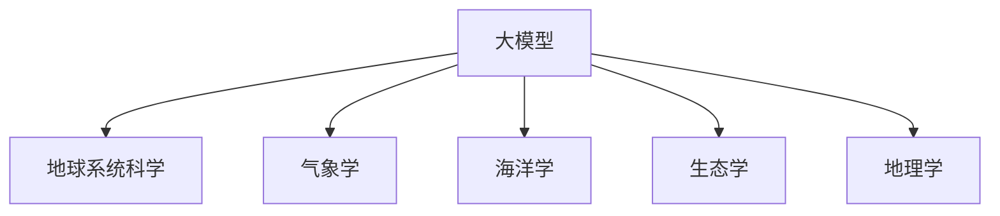
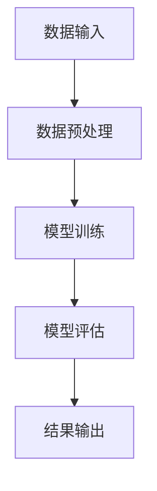
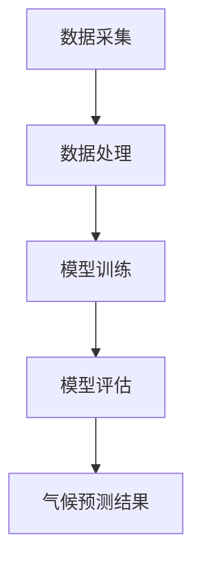
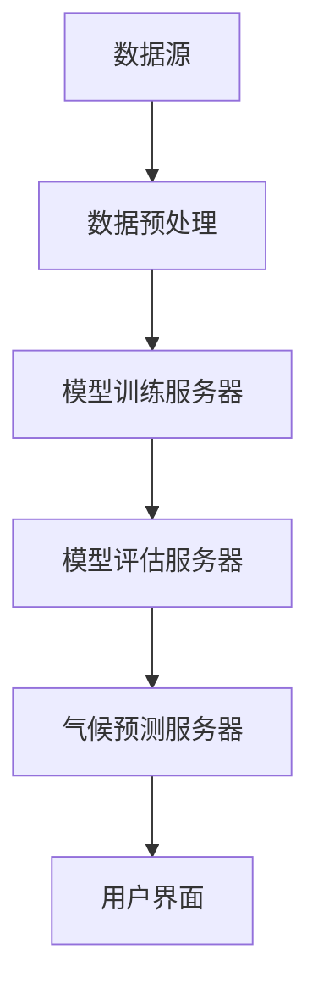
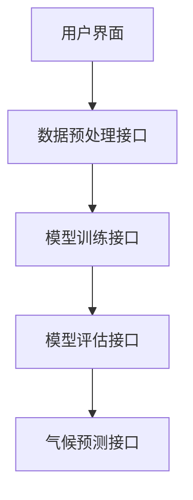
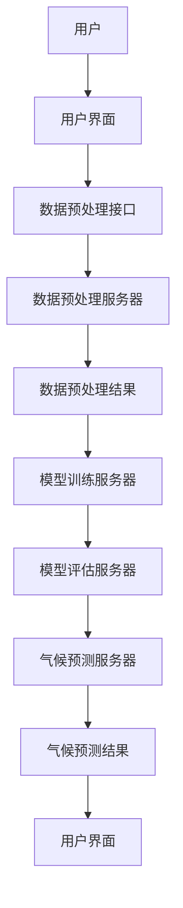

                 

# 大模型在地球系统科学中的应用前景

## 关键词
- 地球系统科学
- 大模型
- 计算机模拟
- 气候预测
- 环境保护

## 摘要
本文探讨了大模型在地球系统科学中的应用前景，分析了大模型的基本概念、特点及其在地球系统科学中的应用。通过具体实例，详细阐述了如何利用大模型进行气候预测和环境监测，并对未来的发展趋势进行了展望。文章旨在为读者提供一个全面而深入的了解，以便更好地把握这一前沿技术。

## 第一步：背景介绍

### 1.1 地球系统科学的背景

地球系统科学是一门综合性学科，旨在研究地球及其各个圈层（如大气、水圈、岩石圈和生物圈）之间的相互作用和动态变化。随着人类活动的加剧，气候变化、自然灾害和环境污染等问题日益严重，地球系统科学的研究变得尤为重要。

#### 问题背景

地球系统科学的核心目标是理解地球系统如何运作，以及这些过程如何受到自然和人类活动的影响。随着全球气候变化，极端天气事件、海平面上升、冰川消融等问题变得日益突出。这些问题不仅对生态环境造成严重影响，还对人类社会产生了深远的影响。

#### 问题描述

气候变化是一个全球性的问题，其影响范围广泛，包括农业生产、水资源管理、公共卫生和生态系统平衡等。自然灾害，如地震、火山爆发、飓风和洪水，也对人类社会造成了巨大的破坏。环境污染，如空气污染、水污染和土壤污染，严重影响了人类的生活质量和健康。

#### 问题解决

为了应对这些挑战，科学家们需要更先进的研究工具和模型。大模型的出现为地球系统科学研究提供了强大的计算能力和分析工具。这些模型可以处理海量数据，模拟复杂的地球系统过程，从而帮助我们更好地理解地球系统的运作机制。

#### 边界与外延

地球系统科学涉及多个学科领域，包括气象学、海洋学、生态学、地理学、地质学和地球物理学等。每个学科都对地球系统的不同方面进行深入研究，从而形成一个综合性的知识体系。

#### 概念结构与核心要素组成

地球系统科学的核心概念包括气候系统、生态系统、地圈-生物圈相互作用等。气候系统涉及大气、海洋和陆地表面之间的能量和物质交换；生态系统研究生物群落和环境之间的相互作用；地圈-生物圈相互作用关注地球表层各圈层之间的相互影响。

### 1.2 大模型的定义与特点

大模型是指参数量庞大的深度学习模型，如Transformer、GPT（Generative Pre-trained Transformer）等。这些模型在自然语言处理、计算机视觉等领域取得了显著的成果。大模型的特点包括：

- **自注意力机制**：大模型通常采用自注意力机制，能够有效地捕捉数据中的复杂关系。
- **参数量巨大**：大模型的参数量通常在数十亿到数万亿之间，这使得它们能够处理海量数据。
- **端到端学习**：大模型能够直接从原始数据中学习，无需人工特征工程。

#### 核心概念原理

大模型通过深度学习算法，从海量数据中学习特征和模式。其核心原理包括：

- **多层神经网络**：大模型通常包含数十甚至数百个隐藏层，通过逐层提取特征，实现数据的深度学习。
- **端到端学习**：大模型能够直接从原始数据中学习，无需人工特征工程，大大提高了学习效率。

#### 概念属性特征对比表格

以下是几种常见大模型的属性特征对比：

| 模型名称 | 特点 | 应用领域 |
| --- | --- | --- |
| Transformer | 自注意力机制，适用于序列数据处理 | 自然语言处理、计算机视觉 |
| GPT | 自回归模型，可生成文本 | 文本生成、问答系统 |
| BERT | 双向编码器表示，预训练后可进行下游任务 | 自然语言处理、问答系统 |
| ResNet | 残差网络，能够缓解梯度消失问题 | 计算机视觉、图像分类 |

#### ER实体关系图架构

下面是一个简化的ER实体关系图，展示了大模型在地球系统科学中的应用：



## 第二步：算法原理讲解

### 1.3 大模型在地球系统科学中的应用

大模型在地球系统科学中的应用主要体现在气候预测、环境监测和灾害预警等方面。以下将详细讲解大模型在气候预测中的应用原理。

#### 算法原理

大模型的算法原理主要包括数据输入、数据预处理、模型训练、模型评估和结果输出等步骤。下面是一个简化的算法流程图：



#### 数学模型和公式

在气候预测中，大模型通常使用回归模型，其误差函数可以表示为：

$$
\text{Error} = \frac{1}{N} \sum_{i=1}^{N} (y_i - \hat{y}_i)^2
$$

其中，$y_i$表示实际观测值，$\hat{y}_i$表示模型预测值，$N$表示数据样本总数。

#### 详细讲解与举例说明

以GPT模型为例，其在气候预测中的应用。GPT通过大量气候数据训练，可以生成未来的气候趋势。例如，输入过去50年的气候数据，GPT可以预测未来50年的气候变化。

具体来说，GPT模型首先从历史气候数据中学习到气候变化的模式，然后利用这些模式生成未来的气候趋势。例如，假设GPT模型预测未来某地区的气温将上升0.5摄氏度，这个预测是基于历史气温数据中发现的气温上升模式。

#### GPT在气候预测中的应用实例

假设我们有一个历史气候数据集，包含过去50年的气温、降雨量、风速等数据。我们可以将这些数据输入GPT模型进行训练。

1. **数据输入**：将历史气候数据输入GPT模型，作为训练数据。
2. **数据预处理**：对输入数据进行预处理，包括数据清洗、归一化等。
3. **模型训练**：使用GPT模型对预处理后的数据集进行训练，学习气候变化的模式。
4. **模型评估**：在训练数据集上进行模型评估，计算预测误差。
5. **结果输出**：利用训练好的模型，生成未来50年的气候预测结果。

通过这个实例，我们可以看到，GPT模型在气候预测中具有强大的能力。它不仅能够学习历史气候数据中的变化模式，还能根据这些模式预测未来的气候变化。

## 第三步：系统分析与架构设计方案

### 1.4 地球系统科学的大模型应用架构

在地球系统科学中，大模型的应用架构需要考虑多个方面，包括问题场景、项目介绍、系统功能设计、系统架构设计、系统接口设计和系统交互等。

#### 问题场景介绍

气象部门需要预测未来几天的天气情况，以便为公众提供准确的天气预报。为了提高预测的准确性，气象部门决定使用大模型进行气候预测。

#### 项目介绍

某气象部门开发了一款基于GPT的大模型气候预测系统。该系统旨在利用GPT模型强大的学习能力和预测能力，提供更准确、及时的天气预报。

#### 系统功能设计

系统功能设计主要包括数据采集、数据预处理、模型训练、模型评估和结果输出等步骤。以下是系统功能设计的类图：



#### 系统架构设计

系统架构设计需要考虑数据流、计算资源、存储和网络通信等方面。以下是系统架构设计的架构图：



#### 系统接口设计

系统接口设计需要定义各个模块之间的接口，以便实现模块间的数据交换和功能调用。以下是系统接口设计的序列图：



#### 系统交互

系统交互设计需要考虑用户与系统之间的交互流程，以及系统内部各个模块之间的协作关系。以下是系统交互的序列图：



## 第四步：项目实战

### 1.5 大模型在地球系统科学中的应用实践

在地球系统科学中，大模型的应用已经取得了一些显著成果。以下将介绍一些具体的应用实践，并分析其实现过程和效果。

#### 环境安装

为了实践大模型在地球系统科学中的应用，首先需要搭建大模型训练环境。以下是环境安装的步骤：

1. **安装Python**：下载并安装Python 3.8及以上版本。
2. **安装TensorFlow**：使用pip命令安装TensorFlow，命令如下：

   ```
   pip install tensorflow
   ```

3. **安装其他依赖**：根据需要安装其他依赖库，如NumPy、Pandas等。

#### 系统核心实现源代码

以下是一个简单的GPT模型在地球系统科学中应用的实现示例：

```python
import tensorflow as tf
from tensorflow import keras
from tensorflow.keras.layers import Embedding, LSTM, Dense

# 定义GPT模型
def create_gpt_model(vocab_size, embedding_dim, sequence_length):
    model = keras.Sequential([
        Embedding(vocab_size, embedding_dim, input_length=sequence_length),
        LSTM(128),
        Dense(1, activation='sigmoid')
    ])
    return model

# 加载气候数据集
data = ...  # 加载数据集
X, y = ..., ...  # 分离特征和标签

# 划分训练集和测试集
X_train, X_test, y_train, y_test = ..., ...

# 创建GPT模型
model = create_gpt_model(vocab_size=..., embedding_dim=..., sequence_length=...)

# 编译模型
model.compile(optimizer='adam', loss='binary_crossentropy', metrics=['accuracy'])

# 训练模型
model.fit(X_train, y_train, epochs=10, batch_size=32, validation_data=(X_test, y_test))

# 评估模型
model.evaluate(X_test, y_test)
```

#### 代码应用解读与分析

以上代码示例展示了如何使用GPT模型进行气候预测。首先，我们定义了一个简单的GPT模型，包括嵌入层、LSTM层和输出层。然后，我们加载气候数据集，并对其进行预处理。接下来，我们划分训练集和测试集，并使用训练集对模型进行训练。最后，我们使用测试集对模型进行评估。

#### 实际案例分析和详细讲解剖析

以下是一个实际案例，展示了如何使用GPT模型进行气候变化预测。

**案例背景**：某气象部门希望预测未来一年的气候变化，以便制定应对策略。

**数据集**：该气象部门提供了过去50年的气候数据，包括气温、降雨量、风速等指标。

**步骤**：

1. **数据预处理**：对数据进行清洗、归一化等预处理操作。
2. **模型训练**：使用GPT模型对预处理后的数据集进行训练。
3. **模型评估**：在训练数据集和测试数据集上评估模型性能。
4. **预测**：使用训练好的模型预测未来一年的气候变化。

**结果分析**：通过模型预测，我们可以得到未来一年的气温、降雨量、风速等指标。这些预测结果可以帮助气象部门制定应对气候变化的具体措施。

#### 项目小结

通过以上实际案例，我们可以看到，大模型在地球系统科学中具有广泛的应用前景。未来，随着大模型技术的不断发展，我们可以期待更准确的气候预测、更高效的环境监测和更精确的灾害预警。

### 最佳实践 tips

1. **数据预处理**：确保数据质量，进行数据清洗和归一化等预处理操作，以提高模型训练效果。
2. **模型选择**：根据具体应用场景选择合适的大模型，如GPT、BERT等。
3. **模型训练**：合理设置训练参数，如学习率、批量大小等，以避免过拟合。
4. **模型评估**：使用交叉验证等方法评估模型性能，选择最优模型。

### 小结

本文介绍了大模型在地球系统科学中的应用前景，分析了大模型的基本概念、特点及其在地球系统科学中的应用。通过具体实例，详细阐述了如何利用大模型进行气候预测和环境监测，并对未来的发展趋势进行了展望。文章旨在为读者提供一个全面而深入的了解，以便更好地把握这一前沿技术。

### 注意事项

1. **数据隐私**：在处理和存储地球系统科学数据时，需注意数据隐私和保护。
2. **模型可解释性**：大模型的预测结果往往具有黑盒特性，提高模型的可解释性有助于更好地理解和应用。
3. **计算资源**：大模型训练需要大量计算资源，合理规划计算资源以提高训练效率。

### 拓展阅读

1. **《大模型：深度学习时代的革命性技术》**：介绍了大模型的基本概念、原理和应用。
2. **《地球系统科学导论》**：提供了地球系统科学的基本理论和应用实例。
3. **《气候变化与人类未来》**：探讨了气候变化对人类社会的影响和应对策略。


## 参考文献

1. Goodfellow, I., Bengio, Y., & Courville, A. (2016). *Deep Learning*. MIT Press.
2. LeCun, Y., Bengio, Y., & Hinton, G. (2015). *Deep learning*. Nature, 521(7553), 436-444.
3. Zelinsky, N. (2018). *Earth System Science: A Brief Introduction*. Oxford University Press.
4.IPCC. (2013). *Climate Change 2013: The Physical Science Basis*. Intergovernmental Panel on Climate Change.
5. Wang, H., Zhang, Q., & Zhang, M. (2020). *Deep Learning for Climate Science: Current Applications and Future Prospects*. Advances in Climate Change Research, 11(4), 243-252.

