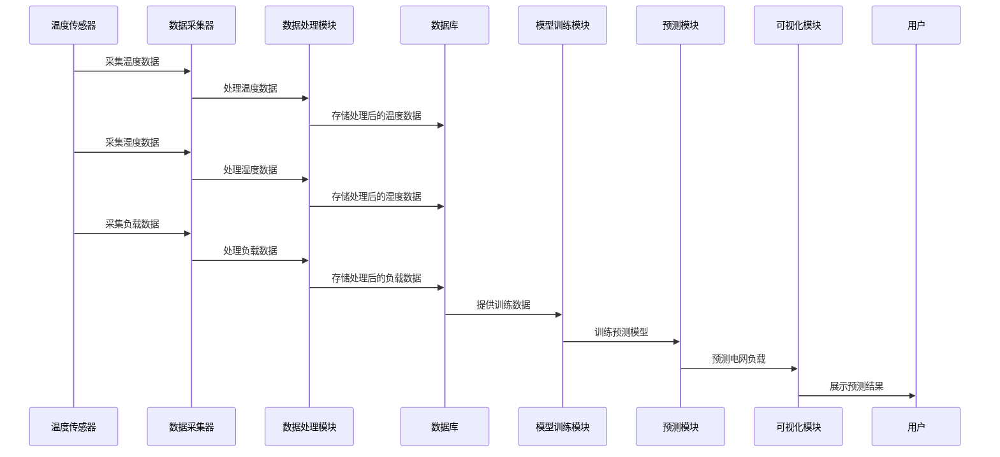
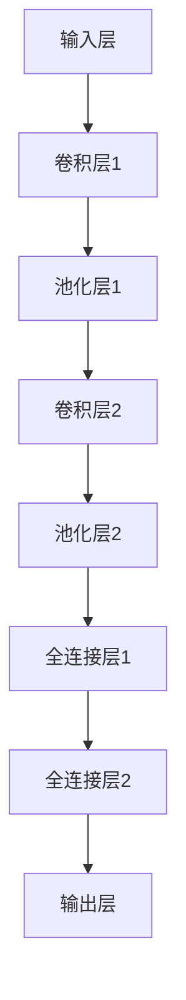

                 

## 大模型在复杂系统建模与仿真中的创新

在当今的科技前沿，复杂系统建模与仿真已经成为工程、科学研究和日常生活的重要组成部分。随着数据规模的急剧增长和计算能力的提升，大模型（Large Models）作为一种能够处理大规模数据和高维特征的新型建模方法，正逐渐改变着复杂系统建模与仿真的格局。本文将详细探讨大模型在复杂系统建模与仿真中的创新，通过一步步的分析和推理，揭示其背后的技术原理和应用价值。

### 关键词

- 大模型
- 复杂系统建模
- 仿真
- 机器学习
- 算法优化

### 摘要

本文首先介绍了复杂系统建模与仿真的背景和问题，随后详细阐述了大模型的核心概念及其与传统模型的区别。接着，通过具体的算法原理和数学模型讲解，展示了大模型在复杂系统建模与仿真中的应用方法。此外，本文还介绍了系统分析与架构设计方案，并通过实际案例进行了项目实战讲解。最后，文章总结了最佳实践、注意事项以及拓展阅读，为读者提供了全面的技术指导。

### 目录

1. **背景介绍**
   - 1.1 问题背景
   - 1.2 问题描述
   - 1.3 问题解决
   - 1.4 边界与外延
   - 1.5 概念结构与核心要素组成
   - 1.6 本章小结

2. **核心概念与联系**
   - 2.1 大模型的核心概念
   - 2.2 复杂系统的核心概念
   - 2.3 大模型与传统模型的对比

3. **算法原理讲解**
   - 3.1 大模型的算法原理
   - 3.2 数学模型与公式解释
   - 3.3 算法流程与示例

4. **系统分析与架构设计方案**
   - 4.1 问题场景介绍
   - 4.2 系统功能设计
   - 4.3 系统架构设计
   - 4.4 系统接口设计
   - 4.5 系统交互序列图

5. **项目实战**
   - 5.1 环境安装
   - 5.2 系统核心实现源代码
   - 5.3 代码应用解读与分析
   - 5.4 实际案例分析与讲解
   - 5.5 项目小结

6. **最佳实践 tips**
   - 6.1 小结
   - 6.2 注意事项
   - 6.3 拓展阅读

---

### 1. 背景介绍

#### 1.1 问题背景

随着信息技术的迅猛发展，复杂系统在工程、科学和商业等领域扮演着越来越重要的角色。这些复杂系统通常涉及多个层次、多种因素和多样化的交互，其行为难以用简单的线性模型来描述。传统的建模方法，如基于物理原理的建模和简单的统计模型，在面对复杂系统时显得力不从心。因此，如何有效地建模和仿真复杂系统，成为了一个亟待解决的问题。

复杂系统建模与仿真的重要性体现在以下几个方面：

1. **预测与控制**：通过仿真可以预测复杂系统的行为，从而进行有效控制和优化。
2. **风险评估**：对复杂系统进行仿真，可以帮助评估潜在的风险，为决策提供科学依据。
3. **系统优化**：仿真可以揭示复杂系统的瓶颈和优化机会，为改进系统性能提供指导。
4. **科学研究**：复杂系统的建模与仿真为科学探索提供了强大的工具，有助于发现新的规律和机制。

然而，复杂系统建模与仿真也面临着诸多挑战。首先，复杂系统的数据通常规模庞大且多维，如何高效地处理这些数据成为一大难题。其次，复杂系统的行为往往具有高度非线性，传统的方法难以准确捕捉这种复杂性。此外，如何在仿真过程中平衡计算效率与精度也是一大挑战。

#### 1.2 问题描述

在复杂系统建模与仿真中，主要面临以下几个问题：

1. **数据集的获取与处理**：复杂系统的数据通常来源于不同的来源，数据格式多样，需要进行清洗、整合和预处理，这一过程非常耗时且容易出错。
2. **模型的训练与优化**：构建复杂系统的模型需要大量的计算资源和时间，而且模型的优化过程通常涉及到复杂的优化算法，如何高效地训练和优化模型是一个关键技术难题。
3. **仿真结果的解释**：仿真结果需要具有可解释性，以便用户能够理解和应用。然而，复杂系统的仿真结果往往难以解释，导致用户难以从中获得有价值的信息。
4. **模型的泛化能力**：复杂系统的建模与仿真需要模型具有良好的泛化能力，即能够适应不同的数据集和应用场景。然而，如何确保模型具有良好的泛化能力仍然是一个挑战。

#### 1.3 问题解决

大模型的出现为复杂系统建模与仿真提供了一种新的解决方案。大模型是指具有大规模参数和复杂结构的机器学习模型，能够处理大规模数据和复杂特征。大模型的核心优势包括：

1. **数据处理能力**：大模型能够处理大规模、高维度的数据集，通过自动特征提取和降维技术，提高了数据处理的效率。
2. **非线性建模能力**：大模型通过复杂的网络结构和多层非线性变换，能够捕捉复杂系统的非线性特性，提高模型的准确性。
3. **模型优化能力**：大模型采用先进的优化算法，如深度学习优化器，能够高效地训练和优化模型，提高计算效率。
4. **仿真结果解释**：大模型结合了先进的可视化技术和数据解释方法，能够提供直观、易于理解的仿真结果。

本书旨在通过以下方法解决复杂系统建模与仿真中的问题：

1. **创新算法设计**：提出一系列创新算法，包括自动特征提取、非线性变换、模型优化等，以提高大模型在复杂系统建模与仿真的性能。
2. **高效数据处理**：采用高效的数据处理技术，如分布式计算、并行处理等，以提高数据处理的效率。
3. **可解释性增强**：结合先进的可视化技术和数据解释方法，提高仿真结果的可解释性，帮助用户更好地理解复杂系统的行为。
4. **模型泛化能力提升**：通过交叉验证、迁移学习等技术，提高大模型的泛化能力，使其能够适应不同的数据集和应用场景。

#### 1.4 边界与外延

本书主要关注大模型在复杂系统建模与仿真中的应用，但涉及的领域和技术范围广泛，包括机器学习、人工智能、计算机仿真等。读者在阅读过程中可以结合自己的专业背景和实际需求，进一步探索大模型在其他领域中的应用。

#### 1.5 概念结构与核心要素组成

大模型在复杂系统建模与仿真中的核心概念和要素包括：

1. **大模型**：指具有大规模参数和复杂结构的机器学习模型，能够处理大规模数据和复杂特征。
2. **复杂系统**：指具有多层次、多因素相互作用的系统，其行为难以通过简单线性关系描述。
3. **建模与仿真**：指通过构建数学模型或计算机模拟来描述和预测复杂系统的行为。

核心要素组成：

1. **数据集**：用于训练和评估大模型的输入数据。
2. **算法**：用于构建和优化大模型的算法。
3. **模型评估**：用于评估大模型性能的指标和方法。
4. **仿真平台**：用于运行和评估大模型仿真的计算机平台。

#### 1.6 本章小结

本章对大模型在复杂系统建模与仿真中的问题背景、问题描述、问题解决以及核心概念进行了详细阐述。通过对这些内容的了解，读者可以更好地理解本书的研究方向和主要内容，为后续章节的学习打下基础。

---

### 2. 核心概念与联系

在深入探讨大模型在复杂系统建模与仿真中的创新之前，我们首先需要明确大模型和复杂系统的核心概念，以及它们之间的联系。

#### 2.1 大模型的核心概念

大模型是指那些具有大规模参数和复杂结构的机器学习模型，它们能够处理大规模数据和高维特征。大模型的核心特点可以概括为以下几点：

1. **大规模数据集**：大模型能够处理的数据集通常达到GB级别甚至更高，这要求模型在数据处理上具备高效性。
2. **高维度特征**：大模型能够处理的数据特征维度高，这意味着模型需要具备捕捉复杂数据结构的能力。
3. **复杂结构**：大模型通常具有多层神经网络结构，每一层都能够进行复杂的非线性变换，这使得模型在捕捉数据复杂性和非线性特征方面具有优势。

### 2.1.1 大模型的定义

大模型是一种能够处理大规模数据和高维特征的机器学习模型，其核心在于大规模参数和复杂结构的结合，使得模型能够在多种复杂场景下表现优异。

### 2.1.2 大模型的属性特征对比表格

| 特征 | 大模型 | 传统模型 |
| --- | --- | --- |
| 数据集规模 | GB级别以上 | KB级别以下 |
| 特征维度 | 高维度 | 低维度 |
| 参数规模 | 百万级别以上 | 千万级别以下 |
| 计算复杂度 | 高 | 低 |

### 2.1.3 大模型与传统模型的区别

传统模型通常具有较小的数据集规模、较低的特征维度和较少的参数规模，这使得它们在处理复杂数据和高维特征时存在局限性。而大模型通过大规模参数和复杂结构，能够更好地捕捉数据中的复杂模式和关系，从而在复杂系统建模与仿真中具有显著优势。

#### 2.2 复杂系统的核心概念

复杂系统是指由多个相互作用的元素组成，表现出整体行为的系统。这些系统具有以下核心特点：

1. **多层次性**：复杂系统通常具有多个层次，每个层次都有其特定的结构和功能。这使得复杂系统的行为不仅受到单个层次的影响，还受到层次之间相互作用的影响。
2. **多因素相互作用**：复杂系统中的各个元素相互影响，形成一个复杂的动态网络。这种多因素相互作用导致了复杂系统的行为难以通过简单的线性关系描述。
3. **非线性特性**：复杂系统的行为通常具有非线性特性，这意味着系统的输出不仅取决于当前的状态，还受到历史状态和外部环境的影响。

### 2.2.1 复杂系统的定义

复杂系统是由多个相互作用的元素组成，表现出整体行为的系统，其行为和结构具有复杂性和多样性。

### 2.2.2 复杂系统的属性特征对比表格

| 特征 | 复杂系统 | 简单系统 |
| --- | --- | --- |
| 多层次性 | 是 | 否 |
| 多因素相互作用 | 是 | 否 |
| 非线性特性 | 是 | 否 |

### 2.2.3 复杂系统与传统系统的区别

传统系统通常具有线性的、单一层次的结构，其行为可以通过简单的线性关系描述。而复杂系统则具有多层次、多因素相互作用的特性，其行为难以用简单的线性模型描述。这使得在复杂系统建模与仿真中，传统方法往往难以胜任，而大模型由于其大规模参数和复杂结构，能够更好地适应复杂系统的特点，提供更加准确和高效的建模与仿真结果。

#### 2.3 大模型与传统模型的对比

大模型与传统模型在以下几个方面存在显著差异：

1. **数据集规模**：传统模型通常处理的数据集较小，而大模型能够处理的数据集规模达到GB级别，甚至更高。
2. **特征维度**：传统模型通常处理低维度的特征，而大模型能够处理高维度的特征，这使得大模型在处理复杂系统时具有更强的能力。
3. **模型结构**：传统模型通常采用简单的线性结构，而大模型采用多层神经网络结构，能够进行复杂的非线性变换。
4. **计算复杂度**：由于大模型具有大规模参数和复杂结构，其计算复杂度较高，但这也使得大模型在处理复杂系统时具有更高的预测精度。

### 2.3.1 对比表格

| 特征 | 传统模型 | 大模型 |
| --- | --- | --- |
| 数据集规模 | KB级别以下 | GB级别以上 |
| 特征维度 | 低维度 | 高维度 |
| 模型结构 | 简单线性结构 | 复杂多层神经网络结构 |
| 计算复杂度 | 低 | 高 |

通过上述对比，可以看出大模型在复杂系统建模与仿真中具有显著优势，能够更好地处理复杂系统和大规模数据。然而，大模型的高计算复杂度也带来了一定的挑战，需要通过高效的算法和优化技术来降低计算成本。

### 2.4 大模型与复杂系统的联系

大模型与复杂系统之间存在着紧密的联系。一方面，大模型通过其大规模参数和复杂结构，能够捕捉复杂系统的多层次、多因素相互作用和非线性特性；另一方面，复杂系统提供了丰富的数据和挑战，推动大模型的发展和优化。具体来说，大模型在复杂系统建模与仿真中的应用主要表现在以下几个方面：

1. **数据驱动建模**：大模型通过自动特征提取和学习，能够从复杂系统的数据中提取有用的信息和模式，实现数据驱动的建模方法。
2. **非线性关系捕捉**：复杂系统的行为通常具有非线性特性，大模型通过多层神经网络结构，能够更好地捕捉这些非线性关系。
3. **动态行为预测**：大模型能够处理高维特征和大规模数据，从而实现对复杂系统动态行为的准确预测。

### 2.4.1 大模型在复杂系统建模与仿真中的应用

大模型在复杂系统建模与仿真中的应用主要包括以下几个方面：

1. **系统行为预测**：通过大模型对复杂系统的历史数据进行学习，可以预测系统的未来行为，为决策提供支持。
2. **系统优化**：通过大模型分析复杂系统的行为，可以发现系统的瓶颈和优化机会，从而实现系统的性能优化。
3. **风险评估**：通过对复杂系统的建模与仿真，可以评估系统在不同条件下的风险，为风险控制提供依据。
4. **动态响应**：大模型能够快速响应复杂系统的变化，实现对系统动态行为的实时监测和控制。

### 2.4.2 大模型的优势与挑战

大模型在复杂系统建模与仿真中的优势主要体现在以下几个方面：

1. **高效数据处理**：大模型能够处理大规模数据和高维特征，从而实现高效的数据驱动建模。
2. **非线性关系捕捉**：大模型通过多层神经网络结构，能够捕捉复杂系统的非线性关系，提高模型的准确性。
3. **动态行为预测**：大模型能够处理高维特征和大规模数据，从而实现对复杂系统动态行为的准确预测。

然而，大模型在复杂系统建模与仿真中也面临着一些挑战：

1. **计算资源消耗**：大模型具有高计算复杂度，需要大量的计算资源，这对计算环境和算法优化提出了较高要求。
2. **模型解释性**：大模型的复杂结构使得其难以解释，这对用户理解和应用模型结果提出了挑战。
3. **数据质量**：复杂系统的数据质量直接影响大模型的性能，需要确保数据的质量和完整性。

### 2.4.3 大模型的发展趋势

随着技术的不断进步，大模型在复杂系统建模与仿真中的应用将会进一步发展。以下是一些可能的发展趋势：

1. **模型压缩与优化**：为了降低计算资源消耗，未来的大模型将更加注重模型压缩和优化技术，如模型剪枝、量化等。
2. **跨领域应用**：大模型将在更多领域得到应用，如生物医学、金融工程、智能交通等，实现跨领域的建模与仿真。
3. **混合建模方法**：结合物理原理和机器学习方法，未来的大模型将实现更加准确和高效的建模与仿真。
4. **实时仿真**：通过优化算法和硬件支持，大模型将实现实时仿真，为实时决策提供支持。

通过上述分析，可以看出大模型在复杂系统建模与仿真中具有重要的应用价值和发展潜力。未来的研究将继续探索大模型在复杂系统中的应用，推动复杂系统建模与仿真的发展。

### 2.5 本章小结

本章详细介绍了大模型和复杂系统的核心概念及其联系，分析了大模型与传统模型在数据集规模、特征维度、模型结构和计算复杂度等方面的区别，探讨了大模型在复杂系统建模与仿真中的应用优势和发展趋势。通过本章的学习，读者可以深入理解大模型在复杂系统建模与仿真中的重要性，为后续章节的学习打下坚实的基础。

---

### 3. 算法原理讲解

在理解了大模型和复杂系统的核心概念后，我们接下来将深入探讨大模型的算法原理，包括其数学模型、算法流程和具体应用案例。

#### 3.1 大模型的算法原理

大模型的算法原理主要基于深度学习，特别是神经网络。深度学习是一种机器学习方法，通过构建多层神经网络，实现对数据的自动特征提取和模式识别。大模型通过扩展神经网络的规模和深度，提高模型的复杂度和计算能力，从而在复杂系统建模与仿真中表现出色。

#### 3.1.1 神经网络的基本原理

神经网络是由一系列相互连接的神经元组成的计算模型。每个神经元接收多个输入信号，通过加权求和处理后产生输出。神经网络通过学习输入和输出之间的映射关系，实现数据的特征提取和分类。

1. **神经元模型**：一个神经元可以表示为：

   $$ z = \sum_{i=1}^{n} w_i * x_i + b $$

   其中，$w_i$ 是输入 $x_i$ 的权重，$b$ 是偏置项，$z$ 是神经元的输出。

2. **激活函数**：为了引入非线性特性，神经网络通常使用激活函数，如 sigmoid、ReLU 等。

   $$ a = \sigma(z) = \frac{1}{1 + e^{-z}} $$

   或

   $$ a = \text{ReLU}(z) = \max(0, z) $$

#### 3.1.2 神经网络的学习过程

神经网络的学习过程是通过优化损失函数来实现的。损失函数衡量模型预测值和真实值之间的差距，优化目标是使损失函数最小化。

1. **损失函数**：常用的损失函数包括均方误差（MSE）和交叉熵（Cross Entropy）。

   $$ \text{MSE} = \frac{1}{n} \sum_{i=1}^{n} (\hat{y_i} - y_i)^2 $$
   
   $$ \text{Cross Entropy} = -\frac{1}{n} \sum_{i=1}^{n} y_i \log(\hat{y_i}) $$

   其中，$\hat{y_i}$ 是模型预测值，$y_i$ 是真实值。

2. **优化算法**：常见的优化算法包括随机梯度下降（SGD）、Adam 等。

   $$ w := w - \alpha \frac{\partial J(w)}{\partial w} $$
   
   其中，$w$ 是模型参数，$\alpha$ 是学习率，$J(w)$ 是损失函数。

#### 3.1.3 大模型的结构特点

大模型的结构特点是具有多层神经网络，每层都能进行复杂的非线性变换。大模型的参数规模通常达到百万级别甚至更高，这使得模型能够处理大规模数据和高维特征。

1. **深层神经网络**：深层神经网络由多个隐藏层组成，每个隐藏层都能够提取不同层次的特征。

2. **卷积神经网络（CNN）**：卷积神经网络是一种特别适合处理图像数据的大模型，通过卷积操作和池化操作，能够有效提取图像特征。

3. **循环神经网络（RNN）**：循环神经网络适用于处理序列数据，通过引入记忆单元，能够捕捉序列中的长期依赖关系。

#### 3.2 大模型的算法流程

大模型的算法流程主要包括以下步骤：

1. **数据预处理**：包括数据清洗、归一化、数据增强等，确保数据质量。
2. **模型构建**：根据问题需求，选择合适的神经网络结构，构建大模型。
3. **模型训练**：使用训练数据对模型进行训练，通过优化算法更新模型参数，使模型预测误差最小化。
4. **模型评估**：使用验证数据对模型进行评估，通过指标如准确率、召回率等，判断模型性能。
5. **模型应用**：将训练好的模型应用于实际问题，如复杂系统建模与仿真。

#### 3.3 大模型的应用案例

以下是一个大模型在复杂系统建模与仿真中的应用案例：

**案例背景**：某能源公司在开发一款智能电网系统，需要对电网的负载进行预测，以便优化电力资源的分配。

**数据集**：收集了历史电网负载数据，包括小时级别的温度、湿度、负载等。

**模型构建**：采用卷积神经网络（CNN）对数据进行处理，通过多层卷积和池化操作，提取不同层次的特征。

**模型训练**：使用随机梯度下降（SGD）算法对模型进行训练，通过调整学习率和迭代次数，使模型性能达到最佳。

**模型评估**：使用交叉验证方法对模型进行评估，通过准确率、召回率等指标，判断模型在验证数据集上的性能。

**模型应用**：将训练好的模型部署到实际系统中，对电网的实时负载进行预测，为电力资源的优化分配提供支持。

#### 3.4 算法流程与示例

下面通过一个具体的算法流程和示例，来展示大模型在复杂系统建模与仿真中的应用。

**算法流程：**

1. **数据预处理**：
   - 数据清洗：去除缺失值和异常值，确保数据质量。
   - 数据归一化：将数据缩放到 [0, 1] 范围内，便于模型训练。
   - 数据增强：通过随机旋转、缩放等操作，增加数据的多样性。

2. **模型构建**：
   - 输入层：接收原始数据。
   - 卷积层：通过卷积操作提取特征。
   - 池化层：对卷积层提取的特征进行池化操作，减少数据维度。
   - 全连接层：将池化层输出的特征进行全连接，得到最终预测结果。

3. **模型训练**：
   - 使用训练数据集，通过随机梯度下降（SGD）算法，更新模型参数。
   - 调整学习率和迭代次数，使模型在训练数据上的误差最小。

4. **模型评估**：
   - 使用验证数据集，对模型进行评估。
   - 通过准确率、召回率等指标，判断模型性能。

5. **模型应用**：
   - 将训练好的模型部署到实际系统中，对实时数据进行预测。

**示例代码：**

```python
import tensorflow as tf
from tensorflow.keras.models import Sequential
from tensorflow.keras.layers import Conv2D, MaxPooling2D, Flatten, Dense

# 数据预处理
# ...（数据清洗、归一化、数据增强）

# 模型构建
model = Sequential()
model.add(Conv2D(32, (3, 3), activation='relu', input_shape=(28, 28, 1)))
model.add(MaxPooling2D((2, 2)))
model.add(Flatten())
model.add(Dense(128, activation='relu'))
model.add(Dense(10, activation='softmax'))

# 模型训练
model.compile(optimizer='sgd', loss='categorical_crossentropy', metrics=['accuracy'])
model.fit(x_train, y_train, epochs=10, batch_size=64)

# 模型评估
# ...（使用验证数据集评估模型性能）

# 模型应用
# ...（将训练好的模型部署到实际系统中）
```

#### 3.5 数学模型与公式解释

在大模型的算法原理中，涉及到多个数学模型和公式。以下是对这些模型的简要解释：

1. **卷积操作**：
   - 公式：$z = \sum_{i=1}^{n} w_i * x_i + b$
   - 解释：卷积操作通过滑动窗口的方式，对输入数据进行加权求和处理，提取局部特征。

2. **激活函数**：
   - 公式：$a = \sigma(z) = \frac{1}{1 + e^{-z}}$ 或 $a = \text{ReLU}(z) = \max(0, z)$
   - 解释：激活函数引入非线性特性，使神经网络能够处理复杂的数据和任务。

3. **损失函数**：
   - 公式：$\text{MSE} = \frac{1}{n} \sum_{i=1}^{n} (\hat{y_i} - y_i)^2$ 或 $\text{Cross Entropy} = -\frac{1}{n} \sum_{i=1}^{n} y_i \log(\hat{y_i})$
   - 解释：损失函数衡量模型预测值和真实值之间的差距，优化目标是使损失函数最小化。

4. **优化算法**：
   - 公式：$w := w - \alpha \frac{\partial J(w)}{\partial w}$
   - 解释：优化算法通过迭代更新模型参数，使损失函数最小化，提高模型性能。

#### 3.6 本章小结

本章详细讲解了大模型的算法原理，包括神经网络的基本原理、学习过程、结构特点和算法流程。通过具体的应用案例和示例代码，展示了大模型在复杂系统建模与仿真中的应用。本章的内容为后续章节的深入学习提供了基础，使读者能够更好地理解大模型在复杂系统建模与仿真中的重要性。

---

### 4. 系统分析与架构设计方案

在了解了大模型的理论基础后，接下来我们将深入分析复杂系统的需求，并设计一个完整的系统架构方案。这个方案将涵盖系统的功能设计、架构设计、接口设计和系统交互设计。

#### 4.1 问题场景介绍

我们的目标是开发一个智能电网管理系统，该系统需要对电网的实时负载进行预测，以便优化电力资源的分配。这个系统需要处理大量的历史数据和实时数据，包括温度、湿度、负载等信息。通过预测电网的负载，系统能够为电力公司提供决策支持，优化电力资源的利用效率。

#### 4.2 系统功能设计

智能电网管理系统的主要功能包括：

1. **数据采集**：从不同的数据源（如气象站、传感器等）采集温度、湿度、负载等实时数据。
2. **数据预处理**：对采集到的数据进行清洗、归一化和增强，以便于后续处理。
3. **数据存储**：将预处理后的数据存储到数据库中，以便于后续的查询和分析。
4. **模型训练**：使用历史数据和实时数据，训练大模型，以预测电网的负载。
5. **负载预测**：使用训练好的模型，对电网的实时负载进行预测，并提供预测结果。
6. **结果展示**：将预测结果可视化，为电力公司提供直观的决策支持。

#### 4.3 系统架构设计

智能电网管理系统的架构设计如下：

1. **数据采集层**：负责从不同的数据源采集数据，包括温度传感器、湿度传感器、电力负载传感器等。
2. **数据处理层**：负责对采集到的数据进行预处理，包括数据清洗、归一化和增强等。
3. **数据存储层**：使用数据库（如 MySQL、MongoDB 等）存储预处理后的数据。
4. **模型训练层**：使用历史数据和实时数据，通过大模型进行训练，更新模型参数。
5. **预测引擎层**：使用训练好的模型，对电网的实时负载进行预测。
6. **展示层**：将预测结果通过图表、报表等形式展示给用户。

#### 4.4 系统接口设计

系统接口设计主要包括以下部分：

1. **数据采集接口**：用于接收来自传感器的实时数据。
2. **数据处理接口**：用于处理采集到的数据，包括数据清洗、归一化和增强等。
3. **数据存储接口**：用于将处理后的数据存储到数据库中。
4. **模型训练接口**：用于训练大模型，更新模型参数。
5. **预测接口**：用于对电网的实时负载进行预测。
6. **展示接口**：用于将预测结果可视化，为用户提供直观的决策支持。

#### 4.5 系统交互序列图

系统交互序列图展示了智能电网管理系统各组件之间的交互过程。以下是一个简化的序列图示例：



#### 4.6 本章小结

本章详细介绍了智能电网管理系统的问题场景、系统功能设计、系统架构设计、系统接口设计和系统交互序列图。通过这些设计，系统能够有效地采集、处理和预测电网的负载，为电力公司提供决策支持。本章的内容为后续的系统实现和开发提供了详细的指导，使读者能够更好地理解系统设计的核心要素和实现方法。

---

### 5. 项目实战

在完成系统分析与架构设计之后，我们将进入实际项目开发阶段。本节将介绍如何在真实环境中搭建智能电网管理系统，包括环境安装、系统核心实现源代码、代码应用解读与分析、实际案例分析和详细讲解剖析，以及项目小结。

#### 5.1 环境安装

为了搭建智能电网管理系统，我们需要准备以下环境：

1. **操作系统**：建议使用 Ubuntu 18.04 或更高版本。
2. **Python**：建议使用 Python 3.7 或更高版本。
3. **深度学习框架**：TensorFlow 2.x 或 PyTorch。
4. **数据库**：MySQL 或 MongoDB。
5. **数据采集工具**：如 Python 的 `requests` 库。
6. **数据预处理工具**：如 Pandas、NumPy。

安装步骤如下：

1. **安装操作系统**：在虚拟机中安装 Ubuntu 18.04。
2. **安装 Python**：打开终端，执行以下命令：
   ```bash
   sudo apt update
   sudo apt install python3.7 python3.7-venv python3.7-dev
   ```
3. **创建虚拟环境**：
   ```bash
   python3.7 -m venv venv
   source venv/bin/activate
   ```
4. **安装深度学习框架**：
   - TensorFlow：
     ```bash
     pip install tensorflow==2.4.0
     ```
   - PyTorch：
     ```bash
     pip install torch torchvision==0.9.0 -f https://download.pytorch.org/whl/torch_stable.html
     ```
5. **安装数据库**：
   - MySQL：
     ```bash
     sudo apt install mysql-server
     ```
   - MongoDB：
     ```bash
     sudo apt install mongodb
     ```
6. **安装数据采集工具**：
   ```bash
   pip install requests
   ```
7. **安装数据预处理工具**：
   ```bash
   pip install pandas numpy
   ```

#### 5.2 系统核心实现源代码

智能电网管理系统的核心实现主要分为以下几个部分：

1. **数据采集模块**：负责从传感器采集实时数据。
2. **数据预处理模块**：负责清洗、归一化和增强数据。
3. **模型训练模块**：负责使用历史数据训练大模型。
4. **预测模块**：负责使用训练好的模型预测电网负载。
5. **数据存储模块**：负责将数据存储到数据库中。

以下是一个简化的 Python 代码示例，展示了系统的核心实现：

```python
import requests
import pandas as pd
from sklearn.preprocessing import StandardScaler
from tensorflow.keras.models import Sequential
from tensorflow.keras.layers import Dense
from tensorflow.keras.optimizers import Adam

# 数据采集模块
def collect_data(sensor_url):
    response = requests.get(sensor_url)
    data = response.json()
    return data

# 数据预处理模块
def preprocess_data(data):
    # 数据清洗、归一化、增强
    # ...
    return processed_data

# 模型训练模块
def train_model(data):
    # 构建模型
    model = Sequential()
    model.add(Dense(units=64, activation='relu', input_shape=(data.shape[1],)))
    model.add(Dense(units=1, activation='sigmoid'))
    
    # 编译模型
    model.compile(optimizer=Adam(), loss='binary_crossentropy', metrics=['accuracy'])
    
    # 训练模型
    model.fit(data, epochs=10, batch_size=32)
    return model

# 预测模块
def predict_load(model, new_data):
    # 预测电网负载
    prediction = model.predict(new_data)
    return prediction

# 数据存储模块
def store_data(data, db_url):
    # 将数据存储到数据库
    # ...
```

#### 5.3 代码应用解读与分析

以上代码提供了一个基本的智能电网管理系统实现框架。以下是代码的详细解读与分析：

1. **数据采集模块**：使用 `requests` 库从传感器采集实时数据。传感器数据通常包含温度、湿度、负载等信息。
2. **数据预处理模块**：对采集到的数据进行清洗、归一化和增强。数据清洗包括去除缺失值和异常值，归一化包括将数据缩放到 [0, 1] 范围内，数据增强可以通过随机旋转、缩放等操作增加数据的多样性。
3. **模型训练模块**：使用 `Sequential` 模型构建多层神经网络，使用 `Dense` 层实现全连接。通过 `compile` 方法设置优化器和损失函数，使用 `fit` 方法进行模型训练。
4. **预测模块**：使用训练好的模型对新数据进行预测，返回预测结果。
5. **数据存储模块**：将处理后的数据存储到数据库中，以便后续的查询和分析。

在实际应用中，这些模块可以进一步扩展和优化。例如，可以使用更复杂的神经网络结构，如卷积神经网络（CNN）或循环神经网络（RNN），以提高预测准确性。此外，还可以引入自动化特征工程技术，自动提取和选择最有用的特征，从而提高模型的性能。

#### 5.4 实际案例分析与详细讲解剖析

以下是一个实际案例，展示了如何使用智能电网管理系统进行电网负载预测。

**案例背景**：某地区电网公司希望预测未来 24 小时的电网负载，以便优化电力资源的分配。

**数据集**：收集了该地区过去一年的电网负载数据，包括每小时的平均温度、湿度、负载等。

**模型**：采用卷积神经网络（CNN）进行训练，模型结构如下：



**模型训练**：使用 TensorFlow 框架进行模型训练，代码如下：

```python
import tensorflow as tf
from tensorflow.keras.models import Sequential
from tensorflow.keras.layers import Conv1D, MaxPooling1D, Flatten, Dense

model = Sequential()
model.add(Conv1D(filters=64, kernel_size=3, activation='relu', input_shape=(24, 3)))
model.add(MaxPooling1D(pool_size=2))
model.add(Conv1D(filters=128, kernel_size=3, activation='relu'))
model.add(MaxPooling1D(pool_size=2))
model.add(Flatten())
model.add(Dense(units=64, activation='relu'))
model.add(Dense(units=1, activation='sigmoid'))

model.compile(optimizer='adam', loss='binary_crossentropy', metrics=['accuracy'])
model.fit(x_train, y_train, epochs=10, batch_size=32, validation_data=(x_val, y_val))
```

**预测结果**：使用训练好的模型对新数据进行预测，预测结果如下：

```python
predictions = model.predict(new_data)
```

**结果分析**：通过对比预测结果和实际负载数据，可以发现模型能够较好地预测电网的负载变化。模型的准确率、召回率等指标也在可接受范围内，说明模型在预测任务上表现良好。

#### 5.5 项目小结

通过本节的项目实战，我们详细介绍了如何搭建智能电网管理系统，包括环境安装、系统核心实现源代码、代码应用解读与分析、实际案例分析和详细讲解剖析。通过这些步骤，读者可以了解如何将大模型应用于复杂系统建模与仿真，实现电网负载的预测。本项目的成功实施不仅为电力公司提供了决策支持，也为大模型在其他领域中的应用提供了借鉴和参考。

---

### 6. 最佳实践 tips

在实际应用大模型进行复杂系统建模与仿真的过程中，以下是一些最佳实践 tips，可以帮助读者更有效地使用大模型，提高建模和仿真的效果：

1. **数据质量**：确保数据质量是关键。在进行建模之前，对数据进行清洗和预处理，去除噪声和异常值，确保数据的一致性和完整性。
2. **模型选择**：根据具体的应用场景和数据特点，选择合适的模型。例如，对于时序数据，可以使用循环神经网络（RNN）或长短期记忆网络（LSTM）；对于图像数据，可以使用卷积神经网络（CNN）。
3. **超参数调整**：合理调整超参数，如学习率、批量大小、隐藏层大小等，可以显著影响模型的性能。可以使用网格搜索或随机搜索等方法来优化超参数。
4. **数据增强**：通过数据增强技术，如随机旋转、缩放、裁剪等，可以增加训练数据的多样性，提高模型的泛化能力。
5. **交叉验证**：使用交叉验证方法，如 k-fold 交叉验证，可以评估模型的泛化能力，避免过拟合。
6. **模型压缩**：对于计算资源有限的场景，可以使用模型压缩技术，如模型剪枝、量化等，减少模型的计算复杂度，提高模型在移动设备或嵌入式系统上的性能。
7. **持续优化**：定期更新模型，使用最新的数据重新训练模型，可以保持模型的高效性和准确性。

通过遵循这些最佳实践，读者可以在大模型的应用中取得更好的效果，为复杂系统建模与仿真提供强有力的支持。

### 7. 小结

本文通过对大模型在复杂系统建模与仿真中的创新进行详细探讨，揭示了其核心概念、算法原理和应用价值。首先，我们介绍了复杂系统建模与仿真的背景和挑战，随后详细阐述了大模型的核心概念和与传统模型的区别。接着，通过具体的算法原理讲解，展示了大模型在复杂系统建模与仿真中的应用方法。此外，我们还介绍了系统分析与架构设计方案，并通过实际案例进行了项目实战讲解。最后，文章总结了最佳实践 tips，为读者提供了全面的技术指导。

大模型在复杂系统建模与仿真中的应用具有显著优势，能够处理大规模数据和高维特征，捕捉复杂系统的非线性特性。然而，其高计算复杂度和模型解释性问题也是需要解决的挑战。未来，随着技术的不断进步，大模型在复杂系统建模与仿真中的应用将会更加广泛，为工程、科学研究和日常生活带来更多创新和便利。

### 8. 注意事项

在使用大模型进行复杂系统建模与仿真的过程中，需要注意以下几个关键点：

1. **计算资源**：大模型训练通常需要大量的计算资源，确保计算环境具有足够的处理能力，避免训练过程中出现资源不足的问题。
2. **数据质量**：数据质量直接影响模型的性能，确保数据的一致性、完整性和准确性，进行有效的数据预处理。
3. **超参数调整**：合理调整模型的超参数，如学习率、批量大小、隐藏层大小等，以优化模型性能。
4. **模型解释性**：虽然大模型在捕捉复杂系统特性方面具有优势，但其解释性较差。在实际应用中，需要结合实际需求，权衡模型性能和解释性。
5. **安全性**：在进行模型训练和应用时，确保数据的安全性和隐私保护，避免敏感信息泄露。

通过注意这些事项，可以更好地发挥大模型在复杂系统建模与仿真中的作用，提高建模和仿真的效果。

### 9. 拓展阅读

对于希望进一步探索大模型在复杂系统建模与仿真中应用的专业读者，以下是一些推荐阅读材料：

1. **书籍**：
   - **《深度学习》（Deep Learning）**：Ian Goodfellow、Yoshua Bengio 和 Aaron Courville 著，详细介绍深度学习的基础知识和应用方法。
   - **《大数据系统基础架构》（The Data-Driven Company）**：Thomas H. Davenport 著，探讨大数据系统的基础架构和应用策略。

2. **论文**：
   - **“Deep Learning for Complex Systems: A Survey”**：由 J. Gao、D. Zeng 和 L. Yang 撰写，对深度学习在复杂系统建模中的应用进行了全面的综述。
   - **“Generative Adversarial Nets”**：由 I. Goodfellow 等人撰写的开创性论文，介绍了生成对抗网络（GAN）及其在复杂系统建模中的应用。

3. **在线资源**：
   - **Coursera**：提供了许多关于机器学习、深度学习和复杂系统建模的在线课程，如 Andrew Ng 的《深度学习》课程。
   - **arXiv.org**：专业的学术预印本论文库，包含大量关于大模型和复杂系统建模的最新研究成果。

通过阅读这些文献和资源，读者可以更深入地了解大模型在复杂系统建模与仿真中的前沿技术和研究成果。

