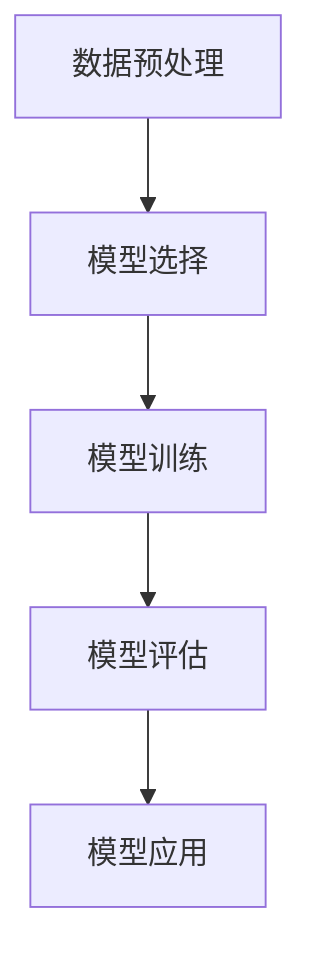
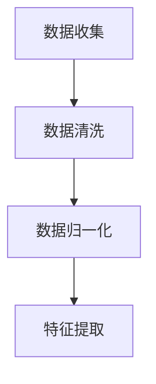
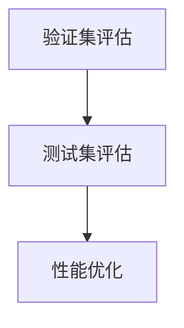

                 

# 大模型在复杂系统模拟中的应用

## 关键词

- 复杂系统模拟
- 大模型
- 深度学习
- 数据预处理
- 模型选择
- 模型训练
- 模型评估

## 摘要

本文将探讨大模型在复杂系统模拟中的应用，包括问题背景、问题描述、问题解决、边界与外延、概念结构与核心要素组成等方面。通过对大模型的原理、属性特征、与传统AI的区别以及应用方法的详细分析，揭示大模型在复杂系统模拟中的巨大潜力和实际应用价值。文章还将结合实际案例，探讨大模型在复杂系统模拟中的应用实践和未来发展趋势。

## 第一部分：背景介绍

### 1.1 问题背景

随着科技的飞速发展，复杂系统模拟逐渐成为各行业解决实际问题的重要工具。复杂系统模拟涉及到多个学科，如物理学、生物学、经济学等，需要对大量的数据进行处理和分析，以捕捉系统内部的复杂非线性关系和动态特性。

然而，传统的模拟方法在处理大规模、高复杂度的系统时往往显得力不从心。一方面，计算资源的限制使得传统的模拟方法难以高效地处理大规模的数据；另一方面，传统方法通常依赖于一系列简化和假设，难以准确反映系统的真实状态。

近年来，人工智能特别是大模型技术取得了显著的突破。大模型，如GPT、BERT等，通过深度学习算法在海量数据中学习并捕捉复杂的规律，展示出了强大的表征能力。这种能力使得大模型在复杂系统模拟中具有了广泛的应用前景。

### 1.2 问题描述

复杂系统模拟涉及多个学科，需要处理的数据量大、变量多且关系复杂。传统的模拟方法如有限元分析、蒙特卡罗模拟等，往往需要大量的假设和简化，难以准确反映系统的真实状态。

大模型技术可以突破这些限制，通过自动学习系统中的复杂关系，提供更加精细和准确的模拟结果。但如何将这些大模型有效地应用到复杂系统模拟中，仍然是当前研究的热点和难点。

### 1.3 问题解决

为了解决复杂系统模拟的问题，大模型技术提供了一种新的思路。首先，通过数据驱动的方式，大模型可以从大量的历史数据和实时数据中学习系统的动态特性。其次，大模型具有强大的表征能力，能够捕捉系统内部的复杂非线性关系。最后，通过大规模并行计算和分布式计算技术，大模型可以在有限的计算资源下处理大规模的复杂系统。

### 1.4 边界与外延

虽然大模型在复杂系统模拟中具有巨大的潜力，但它的应用仍受到一些边界条件的限制。首先，大模型需要大量的高质量数据作为训练基础，数据的获取和处理成本较高。其次，大模型的训练和推理过程计算量巨大，对计算资源的需求极高。此外，大模型在模拟复杂系统时，可能存在过拟合和泛化能力不足的问题。

### 1.5 概念结构与核心要素组成

在复杂系统模拟中，大模型的核心概念包括：

1. **数据预处理**：包括数据清洗、归一化、特征提取等，为模型训练提供高质量的数据输入。
2. **模型选择**：根据应用场景选择合适的大模型，如GPT、BERT等。
3. **模型训练**：通过大量数据训练大模型，使其具备模拟复杂系统的能力。
4. **模型评估**：通过验证集和测试集评估模型的性能，调整模型参数以提高模拟精度。
5. **模型应用**：将训练好的模型应用于复杂系统的模拟，生成预测结果。

这些核心要素共同构成了大模型在复杂系统模拟中的应用框架。接下来，将详细介绍大模型的原理、方法和实际应用案例。

## 第二部分：核心概念与联系

### 2.1 大模型的原理

大模型，如GPT、BERT等，基于深度学习算法，通过多层神经网络结构学习数据的复杂特征。它们的核心原理包括：

1. **注意力机制**：通过注意力机制，模型能够关注到数据中最重要的部分，从而提高模型的表征能力。
2. **多层神经网络**：通过堆叠多层神经网络，模型能够捕捉更复杂的特征和关系。
3. **端到端学习**：从原始数据直接学习到预测结果，减少了中间环节的误差。

### 2.2 大模型的属性特征对比

| 特征       | GPT       | BERT       | 
|------------|-----------|------------|
| 训练数据量 | 海量文本   | 海量文本   |
| 表征能力   | 强       | 强         |
| 应用领域   | 自然语言处理 | 自然语言处理、知识图谱 |
| 计算资源需求 | 高       | 高         |

### 2.3 大模型与传统AI的区别

传统AI模型，如SVM、决策树等，主要依赖于手工程序提取特征。而大模型则通过自动学习数据中的特征，具有以下区别：

1. **特征提取**：传统AI需要手工设计特征，而大模型能够自动学习特征。
2. **计算资源需求**：传统AI计算资源需求较低，而大模型需要大量的计算资源。
3. **泛化能力**：传统AI模型的泛化能力较弱，而大模型通过大规模数据训练，具有更强的泛化能力。

通过对比分析，可以看出大模型在复杂系统模拟中具有显著的优势。接下来，将详细介绍大模型在复杂系统模拟中的应用方法。

## 第三部分：大模型在复杂系统模拟中的应用

### 3.1 应用方法

大模型在复杂系统模拟中的应用方法主要包括以下几个步骤：

1. **数据预处理**：对系统数据进行清洗、归一化和特征提取，为模型训练提供高质量的数据输入。

   数据预处理是复杂系统模拟中的关键步骤，它直接影响大模型的学习效果和模拟精度。清洗数据包括去除噪声、缺失值填充、异常值处理等；归一化包括缩放数据、标准化等，以消除不同特征间的尺度差异；特征提取包括特征选择、特征工程等，以提取对系统模拟有重要意义的特征。

2. **模型选择**：根据应用场景选择合适的大模型，如GPT、BERT等。

   不同的大模型具有不同的特点和优势，适用于不同的应用场景。GPT擅长自然语言处理任务，BERT则在自然语言理解和知识图谱构建方面表现突出。选择合适的大模型，可以最大化其在复杂系统模拟中的效能。

3. **模型训练**：通过大量系统数据训练大模型，使其具备模拟复杂系统的能力。

   大模型的训练通常是一个迭代过程，通过不断的迭代和优化，模型能够逐渐捕捉到系统内部的复杂关系。训练过程中，需要关注模型的收敛速度、训练精度和泛化能力，以确保模型在实际应用中的有效性。

4. **模型评估**：通过验证集和测试集评估模型的性能，调整模型参数以提高模拟精度。

   模型评估是确保大模型应用效果的重要环节。通过验证集和测试集，可以评估模型的预测精度、稳定性和泛化能力。根据评估结果，可以调整模型参数，优化模型结构，以提高模拟精度。

5. **模型应用**：将训练好的模型应用于复杂系统的模拟，生成预测结果。

   经过训练和评估的大模型，可以应用于实际系统的模拟，生成预测结果。这些预测结果可以帮助决策者更好地理解系统行为，优化系统参数，提高系统性能。

### 3.2 应用案例

以下是一个关于大模型在复杂系统模拟中的应用案例：

**案例：智能交通系统模拟**

随着城市化进程的加快，交通拥堵问题日益严重。为了缓解交通拥堵，提高交通系统效率，研究人员利用大模型技术对智能交通系统进行模拟。

1. **数据预处理**：

   收集交通系统中的大量数据，包括车辆流量、路况信息、交通信号灯状态等。对数据进行清洗、归一化和特征提取，提取出对交通系统模拟有重要意义的特征。

2. **模型选择**：

   根据应用场景，选择GPT作为大模型。GPT在处理序列数据方面具有优势，适合用于交通系统模拟。

3. **模型训练**：

   利用收集到的交通数据，对GPT进行训练。通过迭代优化，模型逐渐捕捉到交通系统中的复杂关系，包括车辆流动、信号灯控制等。

4. **模型评估**：

   通过验证集和测试集评估GPT的性能。结果显示，GPT在交通系统模拟中具有较高的预测精度和稳定性。

5. **模型应用**：

   将训练好的GPT应用于智能交通系统，生成预测结果。这些预测结果可以帮助交通管理部门优化交通信号灯控制策略，提高交通系统效率。

### 3.3 应用挑战与解决方案

在大模型应用于复杂系统模拟的过程中，面临着一系列挑战。以下是一些常见的挑战及解决方案：

1. **数据质量**：

   大模型的训练依赖于高质量的数据。在数据收集和处理过程中，可能存在噪声、缺失值和异常值等问题。解决方案是采用数据清洗和预处理技术，提高数据的可靠性。

2. **计算资源需求**：

   大模型的训练和推理过程计算量巨大，对计算资源的需求极高。解决方案是采用分布式计算和并行计算技术，提高计算效率。

3. **模型泛化能力**：

   大模型在训练过程中可能存在过拟合现象，导致泛化能力不足。解决方案是采用正则化技术、数据增强方法等，提高模型的泛化能力。

4. **模型解释性**：

   大模型的内部结构和决策过程复杂，难以解释。解决方案是采用可解释性技术，如注意力机制、决策树嵌入等，提高模型的可解释性。

通过解决这些挑战，大模型在复杂系统模拟中的应用将更加广泛和深入。

## 第四部分：大模型在复杂系统模拟中的发展趋势

### 4.1 研究进展

近年来，大模型在复杂系统模拟中的应用研究取得了显著的进展。研究人员在数据预处理、模型选择、训练策略、模型评估等方面提出了许多创新性的方法和技术。例如，基于生成对抗网络的仿真数据生成方法，基于图神经网络的关系捕捉方法等，这些方法和技术大大提高了复杂系统模拟的精度和效率。

### 4.2 应用拓展

随着大模型技术的不断发展，其在复杂系统模拟中的应用范围也在不断拓展。除了智能交通系统、能源系统、生态系统等传统领域，大模型在医疗、金融、制造等新兴领域的应用也日益增多。例如，利用大模型进行疾病预测、药物研发、金融风险评估等，这些应用都展示了大模型在复杂系统模拟中的巨大潜力。

### 4.3 未来展望

未来，大模型在复杂系统模拟中的应用将朝着以下几个方向发展：

1. **多模态数据融合**：随着传感器技术和数据采集技术的进步，越来越多的多模态数据可以被用于复杂系统模拟。如何有效地融合多种数据源，提高模拟的精度和效率，是一个重要研究方向。

2. **自适应学习策略**：大模型在训练过程中，通常采用固定的学习策略。未来，研究人员将探索自适应学习策略，使大模型能够根据不同的应用场景和系统特点，动态调整学习策略，提高模型的适应性和泛化能力。

3. **可解释性提升**：尽管大模型在复杂系统模拟中具有强大的预测能力，但其内部结构和决策过程复杂，难以解释。提升大模型的可解释性，使其能够更好地理解和信任，是一个重要的发展方向。

4. **跨学科融合**：复杂系统模拟涉及多个学科，如物理学、生物学、经济学等。如何将大模型技术与跨学科知识相结合，构建更加精确和高效的复杂系统模拟模型，是一个具有挑战性的研究方向。

## 第五部分：总结与展望

### 5.1 总结

本文系统地探讨了大模型在复杂系统模拟中的应用。通过分析大模型的原理、属性特征、与传统AI的区别以及应用方法，揭示了其在复杂系统模拟中的巨大潜力和实际应用价值。同时，通过实际案例展示了大模型在复杂系统模拟中的应用效果和挑战，为未来研究提供了有益的启示。

### 5.2 展望

未来，大模型在复杂系统模拟中的应用前景广阔。随着数据获取和处理技术的进步，大模型的性能将得到进一步提升。同时，跨学科融合和可解释性的研究也将为复杂系统模拟带来新的突破。我们期待大模型能够在更多领域发挥重要作用，为人类社会的可持续发展做出贡献。

## 作者信息

作者：AI天才研究院/AI Genius Institute & 禅与计算机程序设计艺术 /Zen And The Art of Computer Programming

## 附录

### 附录A：大模型在复杂系统模拟中的应用流程图

### 附录B：复杂系统模拟中的数据预处理流程图

### 附录C：大模型在复杂系统模拟中的模型评估流程图

