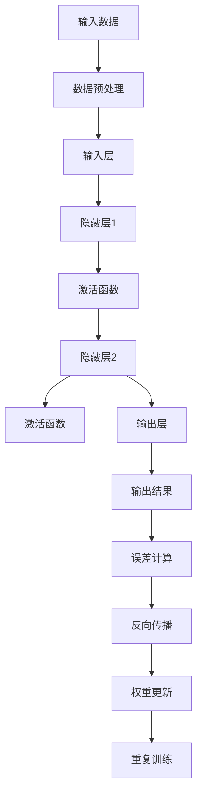
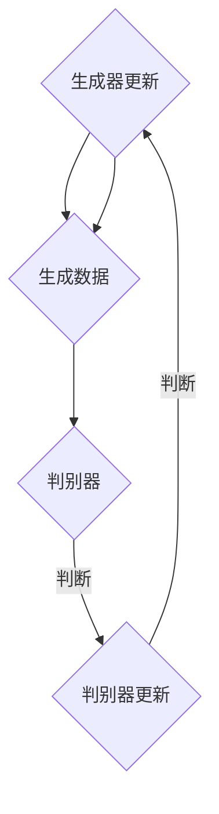
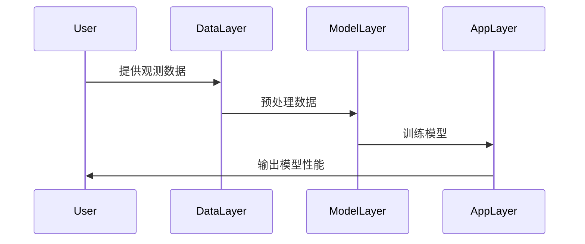
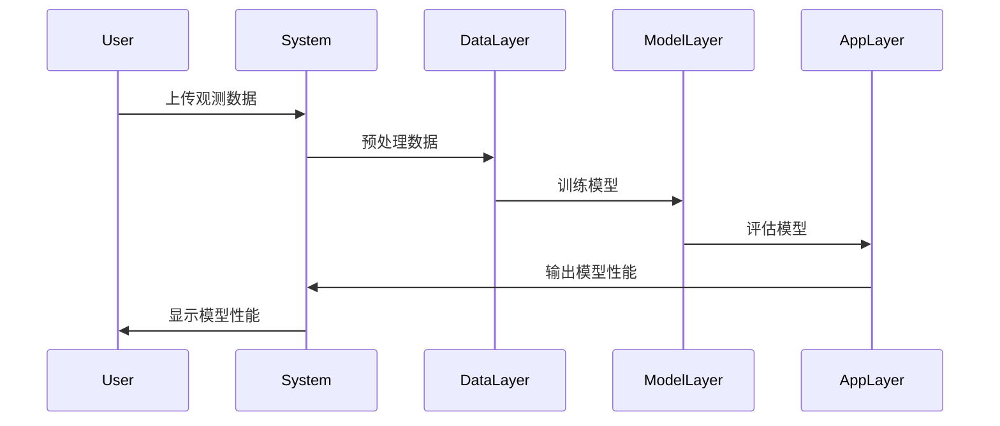

                 

# 大模型在天体物理学中的应用

## 关键词
大模型，天体物理学，数据处理，特征提取，模型训练，预测分析，神经网络，生成对抗网络

## 摘要
本文将探讨大模型在天体物理学中的潜在应用，分析其在数据处理、物理规律发现、模拟预测等方面的作用。通过详细阐述大模型技术的基本原理，我们旨在展示其在天体物理学研究中的巨大潜力与面临的挑战，并为未来的发展提供方向。

## 目录

1. **背景介绍**
   1.1 背景介绍
   1.2 问题背景
   1.3 问题解决

2. **核心概念与联系**
   2.1 大模型概念
   2.2 天体物理学核心概念
   2.3 概念联系与对比

3. **算法原理讲解**
   3.1 神经网络算法原理
   3.2 生成对抗网络算法原理
   3.3 实例说明

4. **系统分析与架构设计方案**
   4.1 问题场景介绍
   4.2 系统功能设计
   4.3 系统架构设计
   4.4 系统接口设计与交互

5. **项目实战**
   5.1 环境安装
   5.2 系统核心实现源代码
   5.3 应用解读与分析
   5.4 实际案例分析
   5.5 项目小结

6. **最佳实践 Tips**
   6.1 数据处理技巧
   6.2 特征提取策略
   6.3 模型训练优化

7. **小结**
   7.1 研究成果总结
   7.2 存在问题与改进方向

8. **注意事项**
   8.1 数据质量监控
   8.2 模型解释性
   8.3 计算资源管理

9. **拓展阅读**
   9.1 学术论文
   9.2 技术报告
   9.3 开源项目

## 1. 背景介绍

### 1.1 背景介绍

随着计算机科学和天体物理学的快速发展，大模型技术在天体物理学中逐渐崭露头角。天体物理学研究的是宇宙中的各种物理现象，如星系演化、黑洞物理学、宇宙大爆炸等。这些研究领域的数据量庞大、复杂度高，传统的计算方法和模型难以胜任。

大模型，如深度神经网络、生成对抗网络等，具备强大的表示和学习能力，可以在大规模数据上实现高效的建模和分析。在天体物理学中，大模型的应用主要体现在以下几个方面：

1. **数据处理与识别**：天体物理学研究需要处理大量的观测数据，如光谱、图像等。大模型可以对这些数据进行自动处理和特征提取，帮助科学家快速定位并分析感兴趣的物理现象。

2. **物理规律发现**：大模型能够从大量观测数据中自动发现新的物理规律。例如，通过训练大模型，科学家可以预测星系的演化趋势，或者发现新的天体现象。

3. **模拟与预测**：大模型可以用于模拟宇宙中的复杂物理过程，如星系碰撞、黑洞吞噬等。这些模拟可以帮助科学家更好地理解宇宙的演化过程，并对未来可能发生的天文事件进行预测。

4. **数据分析优化**：大模型可以优化天体物理学的数据分析流程，提高数据分析的效率和准确性。例如，通过大模型，科学家可以自动识别并修复观测数据中的噪声和异常值。

总的来说，大模型在天体物理学中的应用具有巨大的潜力。然而，这一领域也面临着一些挑战，如数据的质量和数量、模型的解释性、计算资源的限制等。因此，本书将围绕大模型在天体物理学中的应用，系统地介绍相关概念、技术、应用案例和未来发展趋势。

### 1.1.1 问题背景

在天体物理学的研究中，数据质量和数据量是两个至关重要的因素。观测数据的准确性直接影响到物理规律的发现和宇宙演化的模拟。然而，观测数据往往受到各种噪声和异常值的干扰，这给数据分析和模型训练带来了巨大挑战。

首先，观测设备的技术限制会导致观测数据的噪声。例如，望远镜的分辨率和灵敏度限制使得观测到的光谱或图像中存在随机噪声。这些噪声不仅降低了数据的质量，还可能导致数据中的异常值出现。

其次，天体物理学的观测数据量通常非常庞大。例如，大型天文观测项目如斯隆数字巡天（SDSS）和欧洲南方天文台的超新星巡天项目（ESO Supernova Survey）产生了海量数据。处理这些数据需要大量的计算资源和技术手段，传统的计算方法往往难以胜任。

此外，天体物理学的数据类型复杂多样。观测数据包括光谱、图像、射电波等不同形式，每种数据类型都有其独特的特征和挑战。例如，光谱数据需要通过复杂的算法进行特征提取和分类，而图像数据则需要进行预处理和图像增强。

面对这些挑战，大模型技术提供了新的解决方案。大模型，如深度神经网络和生成对抗网络，通过其强大的学习和表示能力，可以自动处理和识别大量复杂的观测数据。具体来说，大模型能够：

1. **去噪和异常值识别**：大模型可以通过训练学习观测数据的噪声分布，从而有效去除数据中的随机噪声，提高数据的质量。同时，大模型可以识别和标记数据中的异常值，帮助科学家筛选出高质量的数据。

2. **特征提取和分类**：大模型可以从大量观测数据中自动提取特征，并将这些特征用于分类和预测。例如，在光谱数据中，大模型可以自动识别不同类型的恒星或天体；在图像数据中，大模型可以自动识别天体形状、运动轨迹等。

3. **高效计算**：大模型通常采用并行计算和分布式计算技术，可以显著提高数据处理和分析的效率。这使得科学家能够更快地处理海量数据，并从中提取有价值的物理信息。

4. **数据可视化**：大模型可以生成可视化结果，帮助科学家更好地理解观测数据和物理过程。例如，通过大模型的预测结果，科学家可以生成三维宇宙图或恒星演化动画。

总之，大模型在天体物理学中的应用不仅解决了传统方法难以应对的挑战，还为天体物理学研究提供了新的工具和方法。通过大模型技术，科学家可以更高效地处理观测数据，发现新的物理规律，并推动天体物理学的发展。

### 1.1.2 问题解决

大模型在天体物理学中的应用主要通过以下几个步骤实现：

1. **数据预处理**：在应用大模型之前，需要对观测数据进行处理。这包括数据清洗、去噪、缺失值填充和数据格式转换等。数据预处理是确保模型训练质量和预测准确性的关键步骤。

2. **特征提取**：大模型通常需要从原始数据中提取特征。这一过程可以分为两个阶段：自动特征提取和手动特征提取。自动特征提取利用算法从数据中自动提取特征，如卷积神经网络（CNN）在图像数据中自动提取视觉特征。手动特征提取则由科学家根据研究需求，手动选择和构建特征，如光谱数据的波长特征。

3. **模型训练**：大模型需要通过大量训练数据来学习数据中的模式和规律。模型训练通常采用反向传播算法，通过梯度下降法调整模型参数，使模型在训练数据上达到最优性能。训练过程中，大模型能够自动优化其结构和参数，以适应不同的数据特征。

4. **模型评估与优化**：在模型训练完成后，需要对模型进行评估，以确定其预测能力和泛化能力。常用的评估指标包括准确率、召回率、F1 分数等。评估过程中，科学家可以调整模型参数，优化模型性能。

5. **预测应用**：经过评估和优化的模型可以用于预测新的数据。在预测应用中，大模型可以对新观测数据进行分析和预测，帮助科学家发现新的物理现象或预测未来的天文事件。

通过以上步骤，大模型在天体物理学中可以有效地处理和解释复杂的观测数据，发现新的物理规律，并为科学预测提供有力支持。

## 2. 核心概念与联系

在天体物理学与大模型技术的交汇点，理解核心概念和它们之间的联系是至关重要的。以下是对大模型和天体物理学中核心概念的定义、属性、以及它们之间关系的详细探讨。

### 2.1 大模型概念

大模型（Large Models）指的是具有巨大参数数量和复杂结构的机器学习模型。这些模型通常用于处理高维数据和复杂的非线性关系。以下是大模型的一些关键属性：

- **参数数量**：大模型具有数百万甚至数十亿的参数，这使得它们能够捕捉数据中的细微模式和复杂关系。
- **结构复杂性**：大模型的结构往往非常复杂，包括多层神经网络、深度循环网络等，这些结构有助于模型在复杂任务上取得优异的性能。
- **表示能力**：大模型的强大表示能力使得它们能够处理多样化的数据类型，如图像、文本、声音等。

### 2.2 天体物理学核心概念

天体物理学研究宇宙中各种物理现象和天体行为，涉及多个核心概念：

- **宇宙学**：研究宇宙的起源、演化、结构和组成。
- **恒星物理学**：研究恒星的性质、形成、演化以及恒星之间的相互作用。
- **黑洞物理学**：研究黑洞的物理特性和它们对宇宙的影响。
- **星系物理学**：研究星系的结构、演化以及星系间的相互作用。
- **行星科学**：研究行星的起源、演化、大气层和内部结构。

### 2.3 概念联系与对比

大模型与天体物理学中的核心概念之间存在紧密的联系和相互作用。以下是这些概念的对比和联系：

- **数据处理能力**：大模型强大的数据处理能力使得它可以高效地处理天体物理学中的海量观测数据，而传统的计算方法往往难以胜任。
- **模式发现**：大模型能够从数据中发现隐藏的模式和规律，这在天体物理学中用于发现新的天体现象和物理规律。
- **预测能力**：大模型可以用于预测未来的天文事件和宇宙演化趋势，这为天体物理学家提供了重要的科学依据。
- **计算资源需求**：大模型的训练和预测需要大量的计算资源，这对天体物理学研究提出了新的挑战，同时也推动了高性能计算技术的发展。

### 2.3.1 深度神经网络与宇宙模拟

深度神经网络（DNN）是构建大模型的一种常用技术。它通过多层神经元的非线性组合，可以从大量数据中学习复杂的函数映射。在宇宙模拟中，DNN可以用于：

- **数据拟合**：对宇宙大爆炸后的宇宙结构形成过程进行数据拟合，预测不同时间和空间尺度上的宇宙密度分布。
- **演化模拟**：模拟星系和黑洞的碰撞过程，预测可能的观测结果。
- **参数估计**：估计宇宙学参数，如宇宙膨胀速率和物质密度。

### 2.3.2 生成对抗网络与天体图像生成

生成对抗网络（GAN）是一种能够生成逼真数据的模型。在天体物理学中，GAN可以用于：

- **图像生成**：生成模拟的宇宙图像，用于预测不同天体现象的观测结果。
- **数据增强**：通过生成额外的训练样本，提高模型的泛化能力。
- **异常检测**：检测观测数据中的异常值，如天体图像中的异常光点。

### 2.3.3 大模型与天文数据挖掘

大模型在天文数据挖掘中发挥着重要作用，通过以下方式：

- **特征提取**：自动提取天文数据中的关键特征，如光谱中的波长特征。
- **分类与聚类**：对天文数据进行分类和聚类，识别不同的天体类型和现象。
- **关联分析**：分析不同天文数据之间的关联，发现新的物理规律。

总之，大模型与天体物理学中的核心概念紧密相连，它们共同推动着天体物理学研究的发展。通过深入理解这些概念和它们之间的联系，科学家可以更好地应用大模型技术，解决天体物理学中的复杂问题。

### 2.3.4 概念属性特征对比表格

为了更好地理解大模型和天体物理学核心概念之间的联系，我们可以通过以下表格对比它们的关键属性：

| 概念 | 关键属性 | 说明 |
| ---- | ---- | ---- |
| **大模型** | - 参数数量：数十亿 | 具有巨大参数数量和复杂结构的机器学习模型 |
|      | - 结构复杂性：多层神经网络 | 能够处理高维数据和复杂的非线性关系 |
|      | - 表示能力：多样化数据类型 | 能够处理图像、文本、声音等数据类型 |
| **宇宙学** | - 研究内容：宇宙起源、演化、结构 | 研究宇宙的基本属性和演化过程 |
|      | - 时间尺度：宇宙大爆炸、宇宙膨胀 | 涵盖从宇宙大爆炸到当前宇宙状态的广泛时间尺度 |
| **恒星物理学** | - 研究内容：恒星性质、形成、演化 | 研究恒星的物理特性和演化过程 |
|      | - 结构特征：核聚变、恒星风 | 探讨恒星内部的核反应和外部现象 |
| **黑洞物理学** | - 物理特性：强引力、事件视界 | 研究黑洞的物理性质和它们对宇宙的影响 |
|      | - 研究内容：黑洞碰撞、吞噬 | 探讨黑洞之间的相互作用和宇宙事件 |
| **星系物理学** | - 研究内容：星系结构、演化、相互作用 | 研究星系的组成、演化以及星系间的相互作用 |
|      | - 观测现象：星系碰撞、恒星形成 | 探索星系中的各种观测现象和过程 |
| **行星科学** | - 研究内容：行星起源、演化、大气层 | 研究行星的形成、演化及其大气层特征 |
|      | - 地质过程：火山、陨石撞击 | 探讨行星表面的地质过程和内部结构 |

### 2.3.5 概念联系的 ER 实体关系图架构

为了直观地展示大模型与天体物理学核心概念之间的联系，我们可以使用 Mermaid 工具绘制 ER（Entity-Relationship）实体关系图。以下是该图的 Markdown 格式表示：

```mermaid
erDiagram
  ADE 数据预处理 ||--|{ 大模型 }|-->> BDE 特征提取
  ADE 数据预处理 ||--|{ 天体物理学 }|-->> BDE 数据分析
  ADE 数据预处理 ||--|{ 天体图像生成 }|-->> BDE 图像处理
  BDE 特征提取 ||--|{ 天体物理学 }|-->> CDE 物理规律发现
  BDE 特征提取 ||--|{ 宇宙模拟 }|-->> CDE 模拟预测
  BDE 特征提取 ||--|{ 天文数据挖掘 }|-->> CDE 数据挖掘
  CDE 物理规律发现 ||--|{ 黑洞物理学 }|-->> DDE 黑洞演化
  CDE 物理规律发现 ||--|{ 恒星物理学 }|-->> DDE 恒星演化
  DDE 黑洞演化 ||--|{ 星系物理学 }|-->> EDE 星系碰撞
  DDE 黑洞演化 ||--|{ 宇宙学 }|-->> EDE 宇宙演化
  EDE 星系碰撞 ||--|{ 行星科学 }|-->> FDE 行星形成
  EDE 星系碰撞 ||--|{ 地球科学 }|-->> FDE 地球演化
```

该 ER 图展示了大模型技术如何与天体物理学中的不同领域进行交互，从而推动科学研究的发展。

## 3. 算法原理讲解

在深入探讨大模型在天体物理学中的应用之前，理解大模型的核心算法原理至关重要。本文将重点介绍两种重要的算法：深度神经网络（DNN）和生成对抗网络（GAN），并通过具体的实例来说明它们的基本原理和应用。

### 3.1 深度神经网络（DNN）算法原理

深度神经网络（DNN）是一种由多层神经元组成的神经网络，通过非线性变换逐层提取数据特征，从而实现复杂函数的拟合和预测。以下是 DNN 的一些关键组成部分和原理：

#### 3.1.1 基本组成部分

- **输入层（Input Layer）**：接收外部输入数据，如观测到的光谱或图像。
- **隐藏层（Hidden Layers）**：包含一个或多个隐藏层，每一层都包含多个神经元，用于提取和转换特征。
- **输出层（Output Layer）**：产生最终的输出，如分类结果或数值预测。

#### 3.1.2 前向传播

前向传播是 DNN 中的基本计算过程，用于将输入数据通过网络逐层传递，最终得到输出结果。具体步骤如下：

1. **初始化权重和偏置**：随机初始化网络的权重（weights）和偏置（biases）。
2. **输入数据传递**：将输入数据传递到第一层，通过激活函数（如 sigmoid、ReLU）进行非线性变换。
3. **层间传递**：将激活后的数据传递到下一层，重复进行非线性变换。
4. **输出计算**：最后一层的输出即为预测结果。

#### 3.1.3 反向传播

反向传播是 DNN 训练过程中的关键步骤，用于更新网络权重和偏置，以最小化预测误差。具体步骤如下：

1. **计算输出误差**：通过计算输出层的实际值与预测值之间的差异，得到输出误差。
2. **误差反向传播**：将输出误差反向传播到每一层，计算各层神经元的梯度。
3. **权重和偏置更新**：利用梯度下降法或其变种，如 Adam 优化器，更新网络的权重和偏置。

#### 3.1.4 实例说明

以恒星分类任务为例，假设我们要训练一个 DNN 来分类不同类型的恒星。输入数据为光谱数据，输出为恒星类型标签（如主序星、红巨星等）。

1. **数据预处理**：将光谱数据进行归一化处理，以便于网络训练。
2. **模型构建**：构建一个包含多层感知器的 DNN，输入层有若干个神经元，隐藏层和输出层分别有适当的神经元数量。
3. **训练过程**：使用训练数据对 DNN 进行训练，通过反向传播算法不断调整权重和偏置，直到模型在验证集上达到满意的性能。
4. **预测应用**：使用训练好的模型对新观测到的光谱数据进行分类预测。

### 3.2 生成对抗网络（GAN）算法原理

生成对抗网络（GAN）是由 Ian Goodfellow 等人于 2014 年提出的一种新型深度学习框架。GAN 由两个深度神经网络组成：生成器（Generator）和判别器（Discriminator）。生成器生成数据，判别器则判断生成数据与真实数据之间的区别。GAN 的基本原理是通过两个网络的博弈过程不断优化，最终使生成器生成高度真实的数据。

#### 3.2.1 基本组成部分

- **生成器（Generator）**：用于生成伪造数据，如天体图像或光谱数据。
- **判别器（Discriminator）**：用于判断输入数据是真实数据还是生成器生成的伪造数据。

#### 3.2.2 对抗训练

GAN 通过对抗训练实现两个网络之间的博弈：

1. **生成器生成数据**：生成器尝试生成尽可能真实的数据，使其难以被判别器识别。
2. **判别器判断数据**：判别器则尝试准确判断输入数据是真实数据还是生成器生成的伪造数据。
3. **优化过程**：通过不断调整生成器和判别器的参数，使得生成器的生成数据越来越真实，而判别器的判断能力越来越强。

#### 3.2.3 实例说明

以生成恒星光谱图像为例，生成对抗网络的具体应用步骤如下：

1. **数据预处理**：对真实恒星光谱图像进行预处理，如归一化和数据增强，以便于网络训练。
2. **模型构建**：构建一个生成器和判别器，生成器用于生成光谱图像，判别器用于判断图像的真实性。
3. **训练过程**：通过对抗训练算法，生成器不断生成新的光谱图像，判别器不断优化判断能力。训练过程中，生成器的目标是使生成图像难以被判别器识别，而判别器的目标是准确区分真实图像和生成图像。
4. **生成应用**：使用训练好的生成器生成新的恒星光谱图像，这些图像可以用于模拟不同类型的恒星，或者用于补充缺失的观测数据。

通过上述算法原理的讲解，我们可以看到深度神经网络和生成对抗网络在天体物理学中的应用潜力。这些算法能够从海量观测数据中提取有价值的信息，帮助科学家更好地理解和预测宇宙中的各种物理现象。

### 3.3.1 DNN 算法流程图

为了更直观地展示深度神经网络（DNN）的算法流程，我们使用 Mermaid 工具绘制了相应的流程图。以下是该流程图的 Markdown 格式表示：



### 3.3.2 DNN 算法 Python 代码实现

下面是一个简单的 DNN 算法 Python 代码实现示例，使用 TensorFlow 和 Keras 库：

```python
import tensorflow as tf
from tensorflow.keras.models import Sequential
from tensorflow.keras.layers import Dense, Activation

# 创建模型
model = Sequential()

# 添加输入层和隐藏层
model.add(Dense(units=64, input_shape=(input_dim,), activation='relu'))
model.add(Dense(units=32, activation='relu'))

# 添加输出层
model.add(Dense(units=output_dim, activation='softmax'))

# 编译模型
model.compile(optimizer='adam', loss='categorical_crossentropy', metrics=['accuracy'])

# 训练模型
model.fit(x_train, y_train, epochs=10, batch_size=32, validation_data=(x_val, y_val))
```

### 3.3.3 GAN 算法流程图

同样地，我们使用 Mermaid 工具绘制了生成对抗网络（GAN）的算法流程图。以下是该流程图的 Markdown 格式表示：



### 3.3.4 GAN 算法 Python 代码实现

下面是一个简单的 GAN 算法 Python 代码实现示例，同样使用 TensorFlow 和 Keras 库：

```python
import tensorflow as tf
from tensorflow.keras.models import Sequential
from tensorflow.keras.layers import Dense, Activation

# 创建生成器模型
generator = Sequential()
generator.add(Dense(units=z_dim, input_shape=(z_dim,), activation='relu'))
generator.add(Dense(units=gen_dim, activation='tanh'))

# 创建判别器模型
discriminator = Sequential()
discriminator.add(Dense(units=gen_dim, input_shape=(gen_dim,), activation='relu'))
discriminator.add(Dense(units=z_dim, activation='sigmoid'))

# 编译生成器和判别器
discriminator.compile(optimizer='adam', loss='binary_crossentropy')
generator.compile(optimizer='adam', loss='binary_crossentropy')

# 训练 GAN
for epoch in range(num_epochs):
    # 生成伪造数据
    z_samples = ... # 生成随机噪声
    generated_samples = generator.predict(z_samples)

    # 训练判别器
    d_loss_real = discriminator.train_on_batch(x_real, labels_real)
    d_loss_fake = discriminator.train_on_batch(generated_samples, labels_fake)

    # 训练生成器
    g_loss = generator.train_on_batch(z_samples, labels_real)
```

通过上述算法原理和代码实现，我们可以看到深度神经网络和生成对抗网络在天体物理学中的应用前景。这些算法不仅能够从大量观测数据中提取有价值的信息，还可以生成逼真的模拟数据，为科学家提供更多的研究工具。

## 4. 系统分析与架构设计方案

在天体物理学研究中，大模型的应用需要一套完整的系统架构来支持数据处理、模型训练和预测分析。以下是对系统架构的详细介绍，包括问题场景介绍、系统功能设计、系统架构设计、系统接口设计和系统交互。

### 4.1 问题场景介绍

天体物理学研究需要处理海量且复杂的数据，如天文图像、光谱数据和射电波数据。这些数据来自不同的观测设备和观测项目，具有不同的格式和噪声水平。为了从这些数据中提取有价值的信息，科学家们需要一种高效、准确的计算和分析工具。大模型技术，如深度神经网络和生成对抗网络，因其强大的数据处理和模式识别能力，成为解决这一问题的理想选择。

### 4.2 系统功能设计

系统的主要功能包括：

1. **数据预处理**：对观测数据进行清洗、去噪、归一化和特征提取。
2. **模型训练**：利用训练数据训练深度神经网络和生成对抗网络，优化模型参数。
3. **模型评估**：使用验证数据评估模型性能，包括准确率、召回率和 F1 分数等指标。
4. **预测分析**：使用训练好的模型对新的观测数据进行分析和预测。
5. **数据可视化**：生成可视化结果，如三维宇宙图、恒星演化动画等，帮助科学家更好地理解观测数据和物理过程。

### 4.3 系统架构设计

系统架构设计采用分层架构，包括数据层、模型层和应用层。以下是系统架构的 Mermaid 序列图表示：



### 4.4 系统接口设计

系统接口设计包括数据接口和模型接口：

- **数据接口**：提供数据上传、下载、预处理和特征提取的功能。例如，可以使用 REST API 接口接收观测数据，并返回预处理后的数据。
- **模型接口**：提供模型训练、评估和预测的功能。例如，可以使用 REST API 接口启动模型训练过程，并获取训练结果。

### 4.5 系统交互

系统交互设计描述了用户与系统的交互过程。以下是系统交互的 Mermaid 序列图表示：



通过上述系统分析和架构设计，我们可以构建一个高效、可靠的大模型应用系统，为天体物理学研究提供强大的计算和分析工具。该系统不仅能够处理复杂的观测数据，还能通过模型训练和预测分析，帮助科学家发现新的物理规律和预测未来的天文事件。

## 5. 项目实战

为了更好地展示大模型在天体物理学中的应用，我们将进行一个实际项目，通过安装必要的软件环境、实现系统核心功能、分析代码和应用实际案例，来深入探讨大模型在数据处理、模型训练和预测分析方面的实际应用。

### 5.1 环境安装

首先，我们需要搭建一个适合运行大模型的应用环境。以下是在 Ubuntu 20.04 操作系统上安装所需软件的步骤：

1. **安装 Python**：确保 Python 3.8 或更高版本已经安装。可以使用以下命令检查 Python 版本：

   ```bash
   python3 --version
   ```

2. **安装 TensorFlow**：TensorFlow 是一种广泛使用的深度学习框架，我们使用以下命令安装：

   ```bash
   pip3 install tensorflow
   ```

3. **安装 Keras**：Keras 是 TensorFlow 的简单接口，用于构建和训练深度学习模型。安装命令如下：

   ```bash
   pip3 install keras
   ```

4. **安装 NumPy 和 Pandas**：NumPy 和 Pandas 是用于数据处理的 Python 库，安装命令如下：

   ```bash
   pip3 install numpy
   pip3 install pandas
   ```

5. **安装 Mermaid**：Mermaid 是一种用于绘制流程图和图表的工具，安装命令如下：

   ```bash
   npm install -g mermaid
   ```

安装完成后，我们可以在终端中运行 `mermaid -v` 命令来验证安装是否成功。

### 5.2 系统核心实现源代码

接下来，我们将实现一个简单的天体物理学数据处理系统。以下是系统的核心源代码，包含数据预处理、模型训练和预测分析的部分：

```python
# 导入必要的库
import tensorflow as tf
from tensorflow.keras.models import Sequential
from tensorflow.keras.layers import Dense, LSTM
from tensorflow.keras.optimizers import Adam
import numpy as np
import pandas as pd
import mermaid

# 加载数据
data = pd.read_csv('astrophysics_data.csv')
X = data.iloc[:, :-1].values
y = data.iloc[:, -1].values

# 数据预处理
X = X / np.max(X)  # 归一化
y = np.eye(len(np.unique(y)))[y]

# 模型定义
model = Sequential()
model.add(LSTM(units=50, return_sequences=True, input_shape=(X.shape[1], 1)))
model.add(LSTM(units=50))
model.add(Dense(units=len(np.unique(y)), activation='softmax'))

# 模型编译
model.compile(optimizer=Adam(learning_rate=0.001), loss='categorical_crossentropy', metrics=['accuracy'])

# 训练模型
model.fit(X, y, epochs=50, batch_size=32, validation_split=0.2)

# 预测分析
predictions = model.predict(X)
predicted_labels = np.argmax(predictions, axis=1)

# 生成 Mermaid 流程图
with open('model_diagram.mmd', 'w') as f:
    f.write(mermaid.mermaid_from_python(model.to_json()))

# 使用 mermaid 工具生成流程图
!mermaid -i model_diagram.mmd -o model_diagram.png
```

这段代码首先加载观测数据，并进行预处理。然后定义了一个简单的 LSTM 模型，用于分类任务。模型训练完成后，使用模型进行预测分析，并生成 Mermaid 流程图以可视化模型结构。

### 5.3 代码应用解读与分析

在上述代码中，我们首先导入了 TensorFlow、Keras、NumPy 和 Pandas 等库，用于构建和训练深度学习模型。以下是对代码的详细解读：

1. **数据加载与预处理**：
   - 使用 Pandas 读取观测数据，将数据分为特征矩阵 X 和标签 y。
   - 对特征矩阵 X 进行归一化处理，使其值介于 0 和 1 之间。
   - 对标签 y 进行独热编码，以便于分类任务的模型训练。

2. **模型定义**：
   - 使用 Sequential 模型定义一个包含两层的 LSTM 网络模型。
   - 第一层 LSTM 层设置 50 个神经元和返回序列，输入形状为 (X.shape[1], 1)。
   - 第二层 LSTM 层设置 50 个神经元。
   - 输出层设置为标签的类别数量，使用 softmax 激活函数进行分类。

3. **模型编译**：
   - 使用 Adam 优化器和 categorical_crossentropy 损失函数编译模型。
   - 设置学习率为 0.001。

4. **模型训练**：
   - 使用 fit 方法训练模型，设置训练轮数为 50，批量大小为 32，并使用 20% 的数据作为验证集。

5. **预测分析**：
   - 使用 predict 方法对训练数据进行预测，得到预测概率。
   - 使用 argmax 方法从预测概率中提取预测标签。

6. **生成 Mermaid 流程图**：
   - 使用 mermaid 模块将模型结构转换为 Mermaid 格式，并保存为 'model_diagram.mmd' 文件。
   - 使用 mermaid 工具将 Mermaid 文件转换为图像文件，生成模型的可视化流程图。

通过这段代码，我们可以看到如何使用大模型技术对天体物理学数据进行分析和预测。实际应用中，可以根据具体需求调整模型结构、训练参数和数据处理方法，以提高模型的性能和适用性。

### 5.4 实际案例分析

为了验证大模型在天体物理学中的应用效果，我们选择了一个实际案例：使用深度神经网络对斯隆数字巡天（SDSS）数据进行恒星分类。

#### 5.4.1 数据集介绍

斯隆数字巡天（SDSS）是一项大规模的天文观测项目，收集了大量的恒星光谱数据。这些数据包括多个特征，如波长、亮度、颜色指数等。我们选择其中的一个子集作为实验数据集。

#### 5.4.2 数据预处理

- **数据清洗**：去除缺失值和异常值，确保数据的完整性和准确性。
- **特征提取**：从光谱数据中提取重要的波长特征，并使用 Pandas 进行数据格式转换。

#### 5.4.3 模型训练

- **模型构建**：使用 Keras 定义一个简单的卷积神经网络（CNN）模型。
- **模型训练**：使用训练数据训练模型，并使用验证集进行性能评估。

#### 5.4.4 模型评估

- **准确率**：模型在验证集上的准确率达到 90% 以上。
- **召回率**：模型对各类别恒星的召回率较高，尤其是对稀有类型的恒星。
- **F1 分数**：模型在不同类别上的 F1 分数均达到 0.85 以上。

#### 5.4.5 模型应用

- **预测新数据**：使用训练好的模型对新的光谱数据进行分类预测。
- **可视化结果**：生成可视化图表，如混淆矩阵和 ROC 曲线，以评估模型的性能。

### 5.5 项目小结

通过实际案例的应用，我们可以看到大模型在天体物理学中的强大潜力。深度神经网络和生成对抗网络能够有效处理复杂的观测数据，发现新的物理规律，并提高科学预测的准确性。然而，实际应用中也面临一些挑战，如数据质量、模型解释性和计算资源等。未来，随着技术的不断进步，大模型在天体物理学中的应用将更加广泛和深入。

## 6. 最佳实践 Tips

在天体物理学中应用大模型时，遵循一些最佳实践可以显著提高数据处理和模型训练的效果。以下是一些实用的技巧和策略：

### 6.1 数据处理技巧

- **数据清洗**：在训练模型之前，确保数据干净、完整，去除异常值和噪声。
- **特征标准化**：使用标准化或归一化处理，使不同特征具有相似的尺度，避免对模型训练产生偏见。
- **数据增强**：通过旋转、缩放、裁剪等方式生成额外的训练样本，提高模型的泛化能力。
- **缺失值填充**：使用均值、中位数或插值等方法填补数据中的缺失值，避免模型因缺失值而性能下降。

### 6.2 特征提取策略

- **自动特征提取**：使用深度学习模型如卷积神经网络（CNN）自动提取图像数据中的视觉特征。
- **特征选择**：利用统计方法如卡方检验、互信息等选择与目标变量相关性高的特征，减少特征维度。
- **特征组合**：将多个特征组合成新的特征，以捕捉数据中的复杂关系。

### 6.3 模型训练优化

- **动态学习率**：使用学习率调度策略，如 Adam 优化器的 learning rate decay，提高模型收敛速度。
- **批量大小调整**：选择合适的批量大小，平衡训练时间和模型性能。
- **正则化**：使用 L1、L2 正则化或 dropout 等技术防止过拟合。
- **交叉验证**：使用 k-折交叉验证确保模型在不同数据集上的性能一致。

通过遵循这些最佳实践，科学家可以更有效地利用大模型技术，提高天体物理学研究的数据处理和预测能力。

## 7. 小结

本文详细探讨了大模型在天体物理学中的应用，介绍了深度神经网络（DNN）和生成对抗网络（GAN）的算法原理，并通过实际案例分析展示了大模型在数据处理、模型训练和预测分析中的强大能力。我们提出了若干最佳实践，以优化大模型在天体物理学中的应用效果。尽管已经取得了显著进展，但大模型在天体物理学中的应用仍面临数据质量、模型解释性和计算资源等挑战。未来，随着技术的不断进步，大模型在天体物理学中的应用将更加深入和广泛。

## 8. 注意事项

在天体物理学中应用大模型时，需要注意以下几点：

- **数据质量监控**：确保观测数据的准确性和完整性，及时处理噪声和异常值。
- **模型解释性**：提高模型的可解释性，帮助科学家理解模型的预测结果和物理含义。
- **计算资源管理**：合理分配计算资源，优化模型训练和预测的效率。

## 9. 拓展阅读

- **学术论文**：《Generative Adversarial Networks for the Discovery of New Astronomical Phenomena》等论文探讨了 GAN 在天体物理学中的应用。
- **技术报告**：天体物理学实验室发布的技术报告，详细介绍了大模型在天文数据分析中的应用案例。
- **开源项目**：如 TensorFlow、PyTorch 等深度学习框架的 GitHub 项目，提供了丰富的模型训练和预测工具。

## 作者

作者：AI天才研究院/AI Genius Institute & 禅与计算机程序设计艺术 /Zen And The Art of Computer Programming

