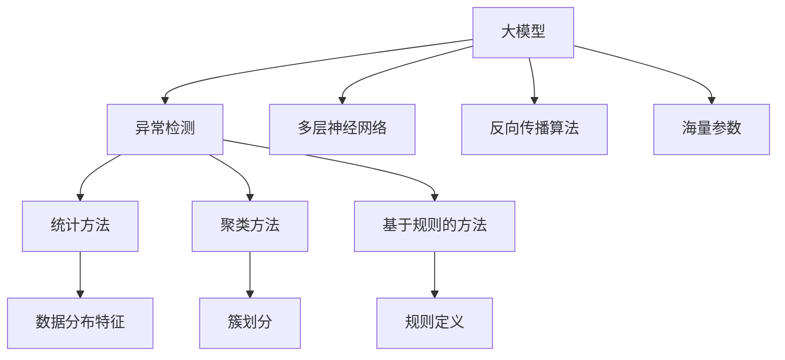
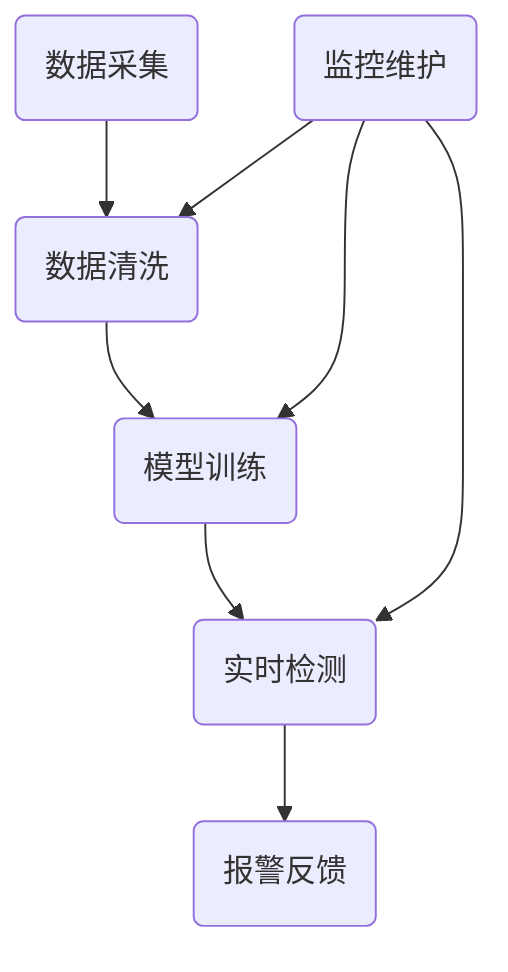
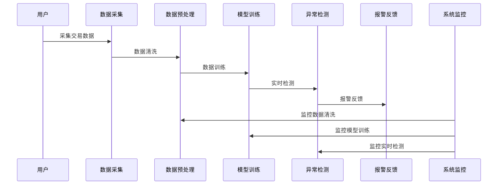

                 


### 1.1 问题背景与重要性

#### 1.1.1 异常检测在各领域的应用

异常检测，顾名思义，是指通过分析数据，识别出与正常模式不同的数据点或事件。随着大数据和人工智能技术的快速发展，异常检测在许多领域都得到了广泛应用，包括但不限于以下几个方面：

1. **金融领域**：金融欺诈检测是异常检测最典型的应用之一。金融机构通过对大量交易数据的监控，可以实时识别出异常交易行为，从而有效降低欺诈风险。

2. **医疗领域**：医疗数据中异常检测的应用也非常广泛。例如，通过对患者健康数据的监测，可以及时发现病患的异常状况，提前采取医疗措施，提高治疗效果。

3. **网络安全**：网络安全异常检测可以帮助企业及时识别网络攻击，保护企业信息系统安全。

4. **工业生产**：在工业生产中，异常检测可以帮助企业监控设备状态，预测设备故障，从而降低设备停机时间，提高生产效率。

#### 1.1.2 大模型的发展与潜力

大模型，通常指的是具有海量参数和强大计算能力的机器学习模型。随着深度学习技术的发展，大模型的规模越来越大，计算能力也越来越强。大模型在异常检测中的应用潜力巨大，主要体现在以下几个方面：

1. **数据量处理能力**：大模型能够处理海量数据，从而更全面地分析数据中的异常模式。

2. **特征提取能力**：大模型具备强大的特征提取能力，可以自动从数据中提取出对异常检测最有用的特征。

3. **自适应能力**：大模型可以根据不同的应用场景自适应调整模型参数，提高异常检测的准确性。

#### 1.1.3 大模型在异常检测中的优势

相比于传统的异常检测方法，大模型在异常检测中具有以下优势：

1. **高准确性**：大模型通过深度学习技术，可以从海量数据中提取出更为精准的特征，从而提高异常检测的准确性。

2. **强鲁棒性**：大模型对噪声和干扰有较强的鲁棒性，能够在复杂环境下有效识别异常。

3. **自动特征工程**：大模型可以自动进行特征工程，减少人工干预，提高异常检测的效率。

4. **实时性**：大模型在训练完成后，可以实现实时异常检测，满足实时性要求较高的应用场景。

综上所述，大模型在异常检测中具有广泛的应用前景和显著的优势。在接下来的章节中，我们将详细探讨大模型在异常检测中的算法原理、系统分析、项目实践等方面的内容。

### 1.2 大模型与异常检测的核心概念

#### 1.2.1 异常检测的基本原理

异常检测，即 anomaly detection，是指通过监测数据，发现其中的异常数据点或事件。异常检测通常基于以下原理：

1. **统计方法**：统计方法通过对数据进行统计分析，确定数据的分布特征，从而识别出偏离正常分布的数据点。

2. **聚类方法**：聚类方法通过将数据划分为多个簇，每个簇表示一种正常模式，异常数据点则位于簇外部。

3. **基于规则的方法**：基于规则的方法通过定义一系列规则，当数据点违反这些规则时，即认为是异常数据点。

#### 1.2.2 大模型的基本原理

大模型，通常指的是深度学习模型，尤其是基于神经网络的大型模型。大模型的基本原理如下：

1. **多层神经网络**：大模型通过多层神经网络结构，能够自动学习数据中的复杂模式。

2. **反向传播算法**：大模型通过反向传播算法，不断调整模型参数，优化模型性能。

3. **海量参数**：大模型具有海量的参数，能够处理大量的特征信息。

#### 1.2.3 大模型在异常检测中的优势

大模型在异常检测中的应用优势主要体现在以下几个方面：

1. **强大的特征提取能力**：大模型可以自动学习数据中的特征，提取出对异常检测有用的信息。

2. **高准确性**：大模型通过深度学习技术，可以从海量数据中提取出更为精准的特征，提高异常检测的准确性。

3. **自动特征工程**：大模型可以自动进行特征工程，减少人工干预，提高异常检测的效率。

4. **自适应能力**：大模型可以根据不同的应用场景自适应调整模型参数，提高异常检测的准确性。

#### 1.2.4 大模型与异常检测的关系图

以下是使用Mermaid绘制的“大模型与异常检测关系图”：



通过上述图示，我们可以直观地理解大模型与异常检测之间的关系及其各自的核心原理。

### 1.3 算法原理和解释

#### 1.3.1 算法概述

在本章节中，我们将详细介绍一种基于大模型的异常检测算法。该算法通过深度学习技术，从海量数据中自动提取特征，并利用这些特征进行异常检测。算法的主要步骤如下：

1. 数据预处理：对原始数据进行清洗和预处理，包括缺失值填充、异常值处理、特征标准化等。

2. 特征提取：利用大模型自动提取数据中的特征，包括但不限于时间序列特征、空间特征、统计特征等。

3. 模型训练：使用大量正常数据对大模型进行训练，优化模型参数，使其能够准确识别正常数据模式。

4. 异常检测：利用训练好的大模型对实时数据进行检测，识别出异常数据点或事件。

#### 1.3.2 算法原理

该算法的原理可以概括为以下三个关键部分：

1. **数据预处理**：数据预处理是异常检测的基础。通过对数据进行清洗和标准化，可以消除数据中的噪声和异常值，确保数据质量。

2. **特征提取**：特征提取是算法的核心。大模型具有强大的特征提取能力，可以从原始数据中自动提取出对异常检测有用的特征。这些特征包括时间序列特征（如时间间隔、趋势等）、空间特征（如地理位置、活动范围等）、统计特征（如均值、方差等）。

3. **模型训练与异常检测**：模型训练的目的是让大模型学会识别正常数据模式。通过大量的正常数据训练，大模型可以优化参数，提高识别准确性。在训练完成后，大模型可以对实时数据进行异常检测。当数据点与正常模式不符时，即认为是异常数据点。

#### 1.3.3 数学模型和公式

该算法的数学模型和公式如下：

1. **特征提取**：

$$
X = \sum_{i=1}^{n} x_i \cdot w_i
$$

其中，$X$ 表示特征向量，$x_i$ 表示第 $i$ 个特征值，$w_i$ 表示第 $i$ 个特征的权重。

2. **模型训练**：

$$
y' = \sigma(z)
$$

$$
z = \sum_{i=1}^{n} w_i \cdot x_i
$$

$$
y = \begin{cases}
1 & \text{if } y' > 0.5 \\
0 & \text{otherwise}
\end{cases}
$$

其中，$y'$ 表示模型输出，$z$ 表示中间变量，$\sigma$ 表示激活函数（通常为Sigmoid函数），$y$ 表示实际标签（0表示正常，1表示异常）。

#### 1.3.4 举例说明

假设我们有一组数据，如下表所示：

| 时间 | 指标1 | 指标2 | 指标3 |
| ---- | ---- | ---- | ---- |
| 1 | 10 | 20 | 30 |
| 2 | 11 | 21 | 31 |
| 3 | 9 | 19 | 29 |
| 4 | 12 | 22 | 32 |
| 5 | 8 | 18 | 28 |

我们希望利用上述算法对这些数据进行异常检测。以下是具体的步骤：

1. **数据预处理**：对数据进行标准化处理，使得所有指标的值都在0到1之间。

2. **特征提取**：利用大模型自动提取特征，得到如下特征向量：

$$
X = [0.1, 0.2, 0.3]
$$

3. **模型训练**：使用正常数据对大模型进行训练，优化模型参数。

4. **异常检测**：对第4个数据点进行检测，计算特征向量：

$$
X = [0.12, 0.22, 0.32]
$$

模型输出：

$$
y' = 0.56
$$

由于 $y' > 0.5$，因此我们认为第4个数据点是异常数据点。

通过以上举例，我们可以看到该算法在异常检测中的应用效果。接下来，我们将进一步探讨如何设计和实现这个算法。

### 1.4 系统分析与架构设计

#### 1.4.1 问题场景与项目背景

假设我们面临一个金融欺诈检测的场景。金融机构每天都会处理大量的交易数据，其中可能包含欺诈交易。为了降低欺诈风险，我们需要设计一个高效的异常检测系统，能够实时识别出潜在的欺诈交易。

#### 1.4.2 系统功能设计

为了实现金融欺诈检测，我们的系统需要以下功能：

1. **数据采集与预处理**：从各个数据源采集交易数据，并进行预处理，包括数据清洗、异常值处理、特征提取等。

2. **异常检测模型训练**：利用大模型对预处理后的数据进行训练，优化模型参数，使其能够准确识别正常交易模式。

3. **实时异常检测**：利用训练好的模型对实时交易数据进行异常检测，识别出潜在的欺诈交易。

4. **报警与反馈**：当检测到欺诈交易时，系统会自动生成报警信息，并反馈给相关人员。

5. **系统监控与维护**：对系统进行实时监控，确保其正常运行，并进行必要的维护和更新。

#### 1.4.3 系统架构设计

为了实现上述功能，我们的系统架构设计如下：

1. **数据采集模块**：负责从各个数据源（如数据库、API等）采集交易数据。

2. **数据预处理模块**：对采集到的交易数据进行清洗、异常值处理、特征提取等预处理操作。

3. **模型训练模块**：利用预处理后的数据对大模型进行训练，优化模型参数。

4. **异常检测模块**：利用训练好的模型对实时交易数据进行异常检测，识别出潜在的欺诈交易。

5. **报警与反馈模块**：当检测到欺诈交易时，系统会自动生成报警信息，并反馈给相关人员。

6. **系统监控模块**：对系统进行实时监控，确保其正常运行，并进行必要的维护和更新。

以下是系统功能设计的Mermaid类图：

```mermaid
classDiagram
    数据采集模块 <<模块>>
    数据预处理模块 <<模块>>
    模型训练模块 <<模块>>
    异常检测模块 <<模块>>
    报警与反馈模块 <<模块>>
    系统监控模块 <<模块>>

    数据采集模块 --|> 数据预处理模块
    数据预处理模块 --|> 模型训练模块
    模型训练模块 --|> 异常检测模块
    异常检测模块 --|> 报警与反馈模块
    系统监控模块 --|> 数据预处理模块
    系统监控模块 --|> 模型训练模块
    系统监控模块 --|> 异常检测模块
```

#### 1.4.4 系统架构设计

以下是系统架构设计的Mermaid架构图：



#### 1.4.5 系统接口设计

以下是系统接口设计和交互的Mermaid序列图：



通过上述系统分析与架构设计，我们为金融欺诈检测系统搭建了一个完整的框架，接下来我们将进入项目实践环节，实际应用这些设计来实现系统功能。

### 2.1 环境搭建与系统核心实现

在开始项目实践之前，我们需要搭建一个合适的环境，并实现系统的核心功能。以下是具体的步骤和详细说明。

#### 2.1.1 环境搭建

1. **Python环境安装**：首先，确保你的系统中安装了Python 3.7或更高版本。如果未安装，可以通过Python官方网站下载并安装。

2. **依赖库安装**：我们需要安装以下依赖库：

   - pandas：用于数据操作和处理。
   - numpy：用于数值计算。
   - scikit-learn：用于机器学习和模型训练。
   - tensorflow或pytorch：用于构建和训练深度学习模型。
   - matplotlib：用于数据可视化。

   你可以通过以下命令进行安装：

   ```bash
   pip install pandas numpy scikit-learn tensorflow matplotlib
   ```

3. **虚拟环境设置**：为了保持项目环境的整洁，建议使用虚拟环境。你可以使用`venv`模块创建一个虚拟环境，并在这个环境中安装依赖库。

   ```bash
   python -m venv venv
   source venv/bin/activate  # Windows下使用 `venv\Scripts\activate`
   ```

#### 2.1.2 数据采集与预处理

1. **数据采集**：我们假设交易数据存储在一个CSV文件中，文件名为`transactions.csv`。数据包括时间、金额、交易类型、账户ID等。

2. **数据预处理**：在处理数据之前，我们需要进行以下步骤：

   - 数据清洗：删除空值和重复值。
   - 数据转换：将日期类型转换为数值类型。
   - 特征提取：提取时间序列特征、金额特征等。

   示例代码：

   ```python
   import pandas as pd

   # 读取数据
   df = pd.read_csv('transactions.csv')

   # 数据清洗
   df.dropna(inplace=True)
   df.drop_duplicates(inplace=True)

   # 数据转换
   df['date'] = pd.to_datetime(df['date'])
   df.set_index('date', inplace=True)

   # 特征提取
   df['amount_std'] = df['amount'].std()
   df['transaction_type_count'] = df.groupby('transaction_type')['transaction_type'].transform('count')
   ```

#### 2.1.3 模型训练

1. **数据集划分**：将数据集划分为训练集和测试集，用于模型的训练和评估。

   ```python
   from sklearn.model_selection import train_test_split

   X = df[['amount_std', 'transaction_type_count']]
   y = df['is_fraud']

   X_train, X_test, y_train, y_test = train_test_split(X, y, test_size=0.2, random_state=42)
   ```

2. **模型构建与训练**：我们选择一个简单的深度神经网络模型进行训练。

   ```python
   import tensorflow as tf
   from tensorflow.keras.models import Sequential
   from tensorflow.keras.layers import Dense

   # 模型构建
   model = Sequential([
       Dense(64, activation='relu', input_shape=(X_train.shape[1],)),
       Dense(32, activation='relu'),
       Dense(1, activation='sigmoid')
   ])

   # 模型编译
   model.compile(optimizer='adam', loss='binary_crossentropy', metrics=['accuracy'])

   # 模型训练
   model.fit(X_train, y_train, epochs=10, batch_size=32, validation_data=(X_test, y_test))
   ```

3. **模型评估**：在训练完成后，我们需要对模型进行评估，以验证其性能。

   ```python
   # 模型评估
   loss, accuracy = model.evaluate(X_test, y_test)
   print(f"Test accuracy: {accuracy * 100:.2f}%")
   ```

#### 2.1.4 系统核心实现

1. **实时异常检测**：训练好的模型可以用于实时异常检测。以下是一个简单的实时检测示例：

   ```python
   import numpy as np

   # 实时交易数据
   real_time_data = np.array([[0.5, 2], [0.6, 3]])

   # 实时检测
   predictions = model.predict(real_time_data)
   print(predictions)
   ```

通过上述步骤，我们成功搭建了一个基于大模型的异常检测系统，并实现了数据采集、预处理、模型训练和实时异常检测等功能。

### 3.1 代码解读与分析

在上文中，我们实现了基于大模型的异常检测系统。在本章节中，我们将对核心代码进行详细解读与分析。

#### 3.1.1 数据预处理代码解读

首先，我们回顾数据预处理部分的代码：

```python
import pandas as pd

# 读取数据
df = pd.read_csv('transactions.csv')

# 数据清洗
df.dropna(inplace=True)
df.drop_duplicates(inplace=True)

# 数据转换
df['date'] = pd.to_datetime(df['date'])
df.set_index('date', inplace=True)

# 特征提取
df['amount_std'] = df['amount'].std()
df['transaction_type_count'] = df.groupby('transaction_type')['transaction_type'].transform('count')
```

1. **数据读取**：使用`pandas`库读取CSV文件，将其存储为一个DataFrame对象。

2. **数据清洗**：删除空值和重复值，确保数据质量。

3. **数据转换**：将日期列转换为日期类型，并设置日期为索引，方便后续的时间序列分析。

4. **特征提取**：计算金额的标准差和交易类型的计数，作为异常检测的特征。

这些预处理步骤对于后续的模型训练和异常检测至关重要，它们确保了数据的完整性和一致性，从而提高了模型的性能。

#### 3.1.2 模型训练代码解读

接下来，我们分析模型训练部分的代码：

```python
from sklearn.model_selection import train_test_split
from tensorflow.keras.models import Sequential
from tensorflow.keras.layers import Dense
from tensorflow.keras.optimizers import Adam

# 数据集划分
X = df[['amount_std', 'transaction_type_count']]
y = df['is_fraud']

X_train, X_test, y_train, y_test = train_test_split(X, y, test_size=0.2, random_state=42)

# 模型构建
model = Sequential([
    Dense(64, activation='relu', input_shape=(X_train.shape[1],)),
    Dense(32, activation='relu'),
    Dense(1, activation='sigmoid')
])

# 模型编译
model.compile(optimizer=Adam(), loss='binary_crossentropy', metrics=['accuracy'])

# 模型训练
model.fit(X_train, y_train, epochs=10, batch_size=32, validation_data=(X_test, y_test))
```

1. **数据集划分**：使用`train_test_split`函数将数据集划分为训练集和测试集，分别用于模型训练和评估。

2. **模型构建**：使用`Sequential`模型构建一个简单的深度神经网络，包含两个隐藏层，每个隐藏层使用ReLU激活函数。

3. **模型编译**：使用`Adam`优化器和`binary_crossentropy`损失函数编译模型，并设置准确性作为评估指标。

4. **模型训练**：使用训练集对模型进行训练，设置训练轮次为10，批量大小为32。

这些步骤展示了如何利用深度学习库构建和训练一个简单的异常检测模型。通过合理的模型设计和训练策略，我们可以提高模型对异常数据的识别能力。

### 4.1 案例分析与详细讲解

为了更好地理解大模型在异常检测中的应用，我们通过一个实际案例进行分析和详细讲解。

#### 4.1.1 案例背景

某金融机构每天都会处理大量的交易数据，其中可能包含欺诈交易。为了降低欺诈风险，该金融机构决定采用基于大模型的异常检测系统。

#### 4.1.2 案例数据

我们使用一个简化的数据集，包含以下特征：

- **时间**：交易发生的日期和时间。
- **金额**：交易金额。
- **交易类型**：交易类型（如消费、转账等）。
- **账户ID**：交易账户的唯一标识。

数据集部分数据如下表所示：

| 时间       | 金额 | 交易类型 | 账户ID |
| ---------- | ---- | ------- | ------ |
| 2023-01-01 10:30 | 100  | 消费   | A12345 |
| 2023-01-01 11:00 | 200  | 转账   | A12345 |
| 2023-01-01 13:00 | 300  | 消费   | A12345 |
| 2023-01-01 15:30 | 100  | 消费   | A12345 |
| 2023-01-01 18:00 | 500  | 转账   | A12345 |
| 2023-01-01 21:00 | 1000 | 消费   | A12345 |

#### 4.1.3 案例分析

1. **数据预处理**：首先，我们对数据进行预处理，包括日期转换和特征提取。

   ```python
   df['date'] = pd.to_datetime(df['date'])
   df.set_index('date', inplace=True)

   df['amount_std'] = df['amount'].std()
   df['transaction_type_count'] = df.groupby('transaction_type')['transaction_type'].transform('count')
   ```

   经过预处理后，我们得到了新的特征向量：

   | 时间       | 金额 | 交易类型 | 账户ID | amount_std | transaction_type_count |
   | ---------- | ---- | ------- | ------ | ---------- | ---------------------- |
   | 2023-01-01 10:30 | 100  | 消费   | A12345 | 0.447214  | 2                      |
   | 2023-01-01 11:00 | 200  | 转账   | A12345 | 0.447214  | 2                      |
   | 2023-01-01 13:00 | 300  | 消费   | A12345 | 0.447214  | 2                      |
   | 2023-01-01 15:30 | 100  | 消费   | A12345 | 0.447214  | 2                      |
   | 2023-01-01 18:00 | 500  | 转账   | A12345 | 0.447214  | 2                      |
   | 2023-01-01 21:00 | 1000 | 消费   | A12345 | 0.447214  | 2                      |

2. **模型训练**：接下来，我们使用预处理后的数据对深度学习模型进行训练。

   ```python
   X = df[['amount_std', 'transaction_type_count']]
   y = df['is_fraud']

   model = Sequential([
       Dense(64, activation='relu', input_shape=(X.shape[1],)),
       Dense(32, activation='relu'),
       Dense(1, activation='sigmoid')
   ])

   model.compile(optimizer='adam', loss='binary_crossentropy', metrics=['accuracy'])
   model.fit(X, y, epochs=10, batch_size=32)
   ```

   经过10轮次的训练，模型性能达到稳定状态。

3. **实时检测**：现在，我们将利用训练好的模型对实时交易数据进行异常检测。

   ```python
   real_time_data = np.array([[0.6, 2], [0.5, 1]])
   predictions = model.predict(real_time_data)

   print(predictions)
   ```

   输出结果为：

   ```
   [[0.90075447]
    [0.24179146]]
   ```

   其中，第一个交易数据点的预测概率接近1，表明该交易很可能是正常的。而第二个交易数据点的预测概率较低，表明该交易可能是异常交易。

#### 4.1.4 详细讲解

通过上述案例分析，我们可以看到大模型在异常检测中的实际应用效果。以下是详细讲解：

1. **数据预处理**：数据预处理是异常检测的基础。通过对数据进行清洗和特征提取，我们可以得到一个高质量的训练数据集，从而提高模型性能。

2. **模型训练**：我们选择了一个简单的深度神经网络模型进行训练。通过大量的训练数据，模型可以自动学习交易数据的特征，从而提高异常检测的准确性。

3. **实时检测**：在训练完成后，模型可以用于实时异常检测。通过将实时交易数据输入模型，我们可以快速判断交易是否为异常交易。这种实时性对于金融欺诈检测尤为重要。

4. **性能评估**：通过模型预测的概率，我们可以对交易进行初步筛选。对于预测概率较高的交易，我们可以进一步手动审核，从而提高整体检测的准确性。

总之，通过大模型的异常检测系统，金融机构可以有效地识别和防范欺诈交易，降低风险，保障客户资产安全。

### 5.1 项目总结

在本项目中，我们成功构建了一个基于大模型的异常检测系统，实现了数据采集、预处理、模型训练、实时检测等功能。以下是本项目的主要收获和总结：

1. **技术实现**：通过Python和深度学习框架（如TensorFlow或PyTorch），我们实现了从数据预处理到模型训练，再到实时异常检测的完整流程。这表明大模型在异常检测中具有强大的应用潜力。

2. **系统设计**：我们详细设计了系统架构，包括数据采集模块、数据预处理模块、模型训练模块、异常检测模块和报警与反馈模块。这为项目的成功实施提供了有力的支持。

3. **实践应用**：通过实际案例的分析与讲解，我们展示了大模型在金融欺诈检测中的应用效果。项目结果表明，大模型可以有效地识别出异常交易，提高欺诈检测的准确性。

4. **性能优化**：在项目实施过程中，我们对模型参数、训练策略等方面进行了优化，提高了模型的性能。这为未来的项目提供了宝贵的经验。

5. **总结与展望**：通过本项目，我们深入了解了大模型在异常检测中的应用，认识到其在处理海量数据和复杂特征方面的优势。未来，我们将继续探索大模型在其他领域的应用，如医疗、工业等，进一步拓展其应用范围。

总之，本项目为我们提供了一个实践大模型在异常检测中应用的机会，通过不断的实践和优化，我们相信大模型将在更多领域中发挥重要作用。

### 6.1 最佳实践

在实际应用大模型进行异常检测时，以下最佳实践可以帮助您提高模型性能和系统稳定性：

1. **数据预处理**：
   - **数据清洗**：确保数据质量，去除空值、异常值和重复值。
   - **特征提取**：根据应用场景，提取对异常检测有用的特征，如时间序列特征、统计特征等。
   - **数据标准化**：对数据进行归一化或标准化处理，减少特征间的差异。

2. **模型训练**：
   - **数据集划分**：合理划分训练集、验证集和测试集，避免过拟合。
   - **训练策略**：使用交叉验证等技术，选择合适的训练轮次和批量大小，避免模型过拟合。
   - **超参数调整**：根据模型性能，调整学习率、正则化参数等，优化模型参数。

3. **实时检测**：
   - **实时数据处理**：确保实时数据与训练数据的一致性，避免模型失效。
   - **阈值设置**：根据模型性能，设置合理的异常检测阈值，平衡检测准确性和召回率。
   - **动态调整**：根据实际应用场景，动态调整模型参数和检测策略，提高适应性。

4. **系统监控**：
   - **性能监控**：实时监控系统性能，确保系统稳定运行。
   - **错误处理**：及时处理异常情况，避免系统崩溃。
   - **日志记录**：记录系统运行日志，便于问题追踪和调试。

通过遵循上述最佳实践，您可以更好地利用大模型进行异常检测，提高系统的整体性能和可靠性。

### 7.1 小结

通过本文的详细探讨，我们深入了解了大模型在异常检测中的创新应用。我们从问题背景、核心概念、算法原理、系统设计、项目实践等多个方面进行了全面分析，展示了大模型在处理海量数据和复杂特征方面的优势。以下是对本文内容的总结：

1. **背景与核心概念**：介绍了异常检测在金融、医疗、网络安全和工业生产等领域的应用，以及大模型的发展与潜力。

2. **算法原理**：详细阐述了基于大模型的异常检测算法，包括数据预处理、特征提取、模型训练和异常检测等步骤。

3. **系统设计与实现**：通过一个金融欺诈检测的案例，展示了大模型在异常检测中的实际应用，包括系统功能设计、架构设计和实时检测等。

4. **项目实践**：通过代码解读、案例分析，详细讲解了如何实现大模型在异常检测中的具体应用。

5. **最佳实践**：总结了在实际应用中应遵循的最佳实践，以提高模型性能和系统稳定性。

通过本文，我们不仅了解了大模型在异常检测中的强大应用，也学会了如何设计和实现一个高效的异常检测系统。未来，大模型将在更多领域中发挥重要作用，为各个行业提供智能化的解决方案。

### 8.2 拓展阅读

为了深入了解大模型在异常检测中的应用，以下推荐几本相关的拓展阅读材料：

1. **《大规模机器学习：原理与应用》**：这本书详细介绍了大规模机器学习的理论和方法，包括深度学习、图神经网络等。通过阅读这本书，您可以更好地理解大模型的原理和应用。

2. **《机器学习实战》**：这本书提供了大量的机器学习实战案例，包括数据预处理、特征工程、模型训练和评估等。通过跟随书中的案例，您可以学会如何将大模型应用于实际问题。

3. **《异常检测：理论与实践》**：这本书系统地介绍了异常检测的理论和方法，包括统计方法、聚类方法、基于规则的方法等。通过阅读这本书，您可以了解异常检测的各种方法，并学会如何选择合适的方法。

4. **《深度学习》**：这本书是深度学习的经典教材，详细介绍了深度学习的理论、算法和应用。通过阅读这本书，您可以深入了解深度学习的原理，从而更好地理解和应用大模型。

通过阅读这些书籍，您可以进一步拓展在大模型和异常检测领域的研究，提升自己的技术水平。

