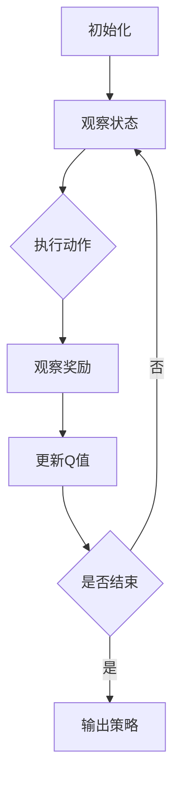

                 

### 第1章 问题背景与问题描述

#### 1.1 问题背景

随着人工智能技术的快速发展，强化学习作为机器学习的一个重要分支，已经广泛应用于多个领域。然而，传统的强化学习算法在大模型上的应用面临着效率低下、训练时间长等问题。为了解决这一问题，本书将探讨大模型在强化学习中的探索效率提升。

强化学习是一种通过不断尝试和反馈来学习最优策略的机器学习方法。智能体在执行动作后，根据环境的反馈不断调整策略，以达到最大化累积奖励的目标。这一过程在理论上可以收敛到最优策略，但在实际应用中，特别是在大模型上，强化学习的训练过程往往需要大量的计算资源和时间，这使得其应用受到了一定的限制。

大模型是指具有大规模参数的深度神经网络模型，通常具有数十亿个参数。大模型在图像识别、自然语言处理、推荐系统等多个领域取得了显著的成果。然而，在大模型中，强化学习的探索效率较低，主要原因包括：

1. **状态和动作空间大**：在大模型中，状态和动作空间可能非常大，导致智能体需要探索的状态和动作数量呈指数级增长。
2. **计算资源消耗大**：大模型训练需要大量的计算资源和时间，而强化学习算法通常需要多次迭代才能收敛到最优策略。
3. **策略更新困难**：大模型中的参数数量庞大，导致策略更新的计算复杂度高，使得智能体难以快速找到最优策略。

为了解决这些问题，提升大模型在强化学习中的探索效率，成为当前研究的热点问题。

#### 1.2 问题描述

强化学习在大模型中面临的效率问题主要包括以下几个方面：

1. **训练时间长**：大模型训练需要大量的计算资源和时间，导致训练过程非常缓慢，无法满足实际应用的需求。
2. **探索效率低**：在大模型中，智能体需要探索大量的状态和动作，但由于状态和动作空间巨大，探索效率较低，难以快速找到最优策略。
3. **资源消耗大**：大模型训练过程中，计算资源消耗巨大，导致训练成本高昂，限制了强化学习在大规模应用中的推广。

为了解决这些问题，提升大模型在强化学习中的探索效率，需要从算法、模型和训练策略等多个方面进行优化和改进。

#### 1.3 问题解决

本书将从多个角度出发，探讨大模型在强化学习中的探索效率提升。具体包括以下几个方面：

1. **算法优化**：通过改进强化学习算法，提高大模型在探索过程中的效率。例如，采用深度强化学习算法，结合大模型的优势，提高探索效率。
2. **模型优化**：优化大模型的结构和参数，降低计算复杂度，提高训练速度和探索效率。例如，采用模型压缩和加速技术，减少模型参数数量，提高计算效率。
3. **训练策略优化**：优化强化学习训练策略，减少不必要的探索，提高训练效率。例如，采用探索策略，如ε-greedy策略、Upper Confidence Bound（UCB）策略和Thompson Sampling策略，平衡探索和利用，提高探索效率。

通过上述优化手段，可以提升大模型在强化学习中的探索效率，解决传统强化学习算法在大模型上面临的效率低下问题。

#### 1.4 边界与外延

大模型在强化学习中的探索效率提升，主要涉及以下几个方面：

1. **强化学习算法在大模型中的应用**：研究如何在大型模型中应用强化学习算法，并优化算法以适应大模型的特点。
2. **大模型在强化学习中的训练优化**：研究如何优化大模型的训练过程，提高训练速度和探索效率。
3. **大模型在强化学习中的探索策略**：研究如何设计有效的探索策略，以提高智能体在大模型中的探索效率。
4. **大模型在强化学习中的实际应用案例**：通过实际案例，展示大模型在强化学习中的应用效果和探索效率的提升。

通过上述方面的研究和探索，可以进一步推动大模型在强化学习领域的发展，提升其应用价值和实际效果。

---

### 第2章 核心概念

#### 2.1 强化学习基本概念

强化学习（Reinforcement Learning，RL）是机器学习的一个重要分支，其核心思想是通过智能体与环境的交互来学习最优策略。在强化学习中，智能体（Agent）是执行动作并接收环境反馈的实体，环境（Environment）是提供状态和奖励的实体。

- **智能体（Agent）**：智能体是执行动作并接收环境反馈的实体。在强化学习中，智能体的目标是学习一个策略，以最大化累积奖励。智能体可以通过观察环境的状态，选择合适的动作，并从环境中获取奖励，以不断调整其策略。
- **环境（Environment）**：环境是提供状态和奖励的实体。在强化学习中，环境为智能体提供一个动态的交互环境，智能体通过与环境交互来获取状态和奖励。环境的状态表示智能体当前所处的位置或状态，奖励表示环境对智能体动作的反馈。
- **状态（State）**：状态是智能体在某个时刻所处的位置或状态。在强化学习中，状态是一个抽象的概念，通常由一组特征向量表示。状态可以反映智能体的当前环境和位置，是智能体决策的重要依据。
- **动作（Action）**：动作是智能体执行的行为。在强化学习中，智能体需要从多个动作中选择一个，以实现其目标。动作的选择取决于智能体的策略，策略是智能体在某个状态下执行的动作。
- **奖励（Reward）**：奖励是环境对智能体动作的反馈。奖励可以激励智能体采取正确的动作，以实现其目标。奖励通常是一个标量值，可以是正的、负的或零。

强化学习通过智能体与环境的交互来学习最优策略。智能体在执行动作后，会根据环境的反馈（即奖励）来更新其策略。通过不断尝试和反馈，智能体可以逐渐找到最优策略，实现其目标。强化学习在游戏、机器人、自动驾驶、推荐系统等领域有广泛的应用。

#### 2.2 大模型基本概念

大模型（Large Model）是指具有大规模参数的深度神经网络模型，通常具有数十亿个参数。大模型在图像识别、自然语言处理、推荐系统等多个领域取得了显著的成果。大模型的特点包括：

- **参数规模大**：大模型通常具有数十亿个参数，远远超过传统模型。参数规模的增加使得大模型能够捕捉到更复杂的数据特征，从而在任务表现上取得更好的效果。
- **训练数据需求大**：大模型需要大量的训练数据来训练模型参数，以获得良好的泛化能力。训练数据的增加有助于提高模型对未见过的数据的预测准确性。
- **训练时间长**：由于参数规模大，大模型训练需要大量的计算资源和时间。训练时间的增加对模型的训练效果和实际应用具有重要影响。
- **推广能力强**：大模型在多个领域具有广泛的推广能力，能够在不同的任务中取得较好的性能。这使得大模型成为许多领域研究和应用的热点。

大模型的技术特点包括：

- **神经网络结构优化**：通过设计更复杂的神经网络结构，如 Transformer、BERT 等，提高模型的表达能力。这些结构优化方法有助于大模型更好地捕捉数据特征。
- **训练算法优化**：采用更高效的训练算法，如 Adam、SGD 等，加快模型的训练速度。训练算法的优化有助于提高大模型的训练效率。
- **模型压缩与加速**：通过模型压缩技术，如模型剪枝、量化、知识蒸馏等，减少模型参数数量，提高计算效率。模型压缩与加速技术有助于降低大模型的计算资源需求。

大模型在强化学习中的应用具有以下优势：

- **更好的泛化能力**：大模型具有更强的表达能力，能够捕捉到更多的数据特征，从而提高模型的泛化能力。这有助于大模型在强化学习任务中更好地应对未知环境和挑战。
- **更高的探索效率**：大模型可以通过更复杂的策略学习，提高智能体的探索效率。这有助于智能体在强化学习过程中更快地找到最优策略。
- **更强的鲁棒性**：大模型具有较强的鲁棒性，能够在面临噪声和不确定性时保持较好的性能。这有助于大模型在强化学习任务中应对复杂的环境。

总之，大模型在强化学习中的应用具有显著的优势，为提升强化学习算法的探索效率和性能提供了新的途径。

#### 2.3 强化学习与大数据模型的联系

强化学习与大数据模型的结合，为解决强化学习在大模型中面临的效率问题提供了新的思路。具体包括以下几个方面：

1. **大数据训练**：强化学习模型通常需要大量的训练数据来提高其泛化能力和性能。大数据模型具有处理大规模数据的能力，可以用于训练强化学习模型，从而提高模型的泛化能力。大数据训练可以通过以下方式实现：
   - **数据增强**：通过数据增强技术，如数据扩展、数据复制、数据变换等，增加训练数据量，提高模型的鲁棒性和泛化能力。
   - **数据预处理**：对训练数据进行预处理，如数据清洗、数据归一化、数据标准化等，以提高训练数据的质量和一致性。

2. **大模型优化**：大模型具有更复杂的结构和更多的参数，可以用于优化强化学习算法，提高探索效率。大模型优化可以通过以下方式实现：
   - **神经网络结构优化**：通过设计更复杂的神经网络结构，如 Transformer、BERT 等，提高模型的表达能力。这些结构优化方法有助于大模型更好地捕捉数据特征。
   - **训练算法优化**：采用更高效的训练算法，如 Adam、SGD 等，加快模型的训练速度。训练算法的优化有助于提高大模型的训练效率。
   - **模型压缩与加速**：通过模型压缩技术，如模型剪枝、量化、知识蒸馏等，减少模型参数数量，提高计算效率。模型压缩与加速技术有助于降低大模型的计算资源需求。

3. **大规模模拟**：强化学习算法通常需要在模拟环境中进行训练和测试。大规模模拟环境可以提供更多的样例和场景，加速强化学习算法的收敛。大规模模拟可以通过以下方式实现：
   - **模拟环境扩展**：通过扩展模拟环境，增加环境的状态和动作空间，提高模拟环境的复杂度。扩展模拟环境可以增加智能体的探索范围，加快算法的收敛速度。
   - **模拟器优化**：优化模拟器的性能，提高模拟环境的计算效率和响应速度。模拟器优化可以减少模拟环境的计算资源消耗，提高模拟环境的实用性。

通过大数据训练、大模型优化和大规模模拟，可以提升强化学习算法在大模型中的探索效率，解决传统强化学习算法在大模型上面临的效率低下问题。这种结合为强化学习在大规模应用中提供了新的解决方案。

---

### 第3章 核心要素组成

#### 3.1 强化学习算法

强化学习算法是解决强化学习问题的关键。常见的强化学习算法包括 Q-Learning、Deep Q-Network（DQN）、Policy Gradient、Actor-Critic 等。这些算法各有特点，适用于不同场景。

1. **Q-Learning**：Q-Learning 是一种基于值函数的强化学习算法，通过不断更新值函数来学习最优策略。Q-Learning 的核心思想是使用 Bellman 方程来更新 Q 值，直到收敛到最优策略。Q-Learning 算法简单易实现，适用于有限状态和动作空间的问题。

2. **Deep Q-Network（DQN）**：DQN 是基于 Q-Learning 的深度学习算法，适用于处理高维状态和动作空间的问题。DQN 通过神经网络来近似值函数，从而提高算法的学习能力。DQN 在训练过程中引入了经验回放和目标网络，以解决样本相关性和目标值不稳定的问题。

3. **Policy Gradient**：Policy Gradient 算法直接优化策略函数，通过梯度上升法来更新策略参数。Policy Gradient 算法包括基于梯度的策略优化和回报导向的策略优化。Policy Gradient 算法在处理连续动作空间和强化学习问题时具有优势。

4. **Actor-Critic**：Actor-Critic 算法结合了策略梯度法和值函数法，通过交替优化策略和值函数来学习最优策略。Actor-Critic 算法包括演员（Actor）和评论家（Critic）两个部分，演员负责策略优化，评论家负责值函数优化。Actor-Critic 算法在处理复杂任务时具有较好的性能。

这些强化学习算法在解决不同类型的强化学习问题时具有各自的优势。在实际应用中，可以根据任务的特点和需求选择合适的算法。

#### 3.2 大模型技术

大模型技术在强化学习中的应用具有重要意义。大模型技术包括神经网络结构优化、训练数据增强、训练算法优化和模型压缩与加速等方面。以下将详细探讨这些技术在大模型中的应用。

1. **神经网络结构优化**：神经网络结构优化是通过设计更复杂的神经网络结构来提高模型的表达能力。常见的神经网络结构优化方法包括深度神经网络（DNN）、卷积神经网络（CNN）和循环神经网络（RNN）等。深度神经网络通过堆叠多层神经网络来提高模型的非线性表达能力，卷积神经网络通过卷积操作来提取空间特征，循环神经网络通过循环结构来处理序列数据。这些结构优化方法有助于大模型更好地捕捉数据特征，提高模型的泛化能力和性能。

2. **训练数据增强**：训练数据增强是通过增加训练数据量来提高模型的泛化能力。常见的训练数据增强方法包括数据扩展、数据复制、数据变换等。数据扩展可以通过生成虚拟数据来增加训练数据量，数据复制可以通过多次复制相同的数据来增加训练数据量，数据变换可以通过对数据进行随机变换来增加训练数据多样性。这些方法可以提高模型的鲁棒性和泛化能力，从而在强化学习任务中更好地应对未知环境和挑战。

3. **训练算法优化**：训练算法优化是通过改进训练算法来提高模型的训练速度和收敛速度。常见的训练算法优化方法包括随机梯度下降（SGD）、Adam 和 Adagrad 等。随机梯度下降是一种基于梯度的优化算法，通过随机选择样本来更新模型参数。Adam 和 Adagrad 是改进的随机梯度下降算法，通过自适应调整学习率来提高训练效率。这些算法的优化有助于大模型在强化学习任务中更快地找到最优策略。

4. **模型压缩与加速**：模型压缩与加速是通过减少模型参数数量和提高计算效率来降低大模型的计算资源需求。常见的模型压缩与加速方法包括模型剪枝、量化、知识蒸馏等。模型剪枝通过删除冗余的模型参数来减少模型大小和计算量。量化通过降低模型参数的精度来减少计算资源消耗。知识蒸馏通过将大模型的知识传递给小模型来提高小模型的性能。这些方法有助于大模型在强化学习任务中实现更高的效率和更低的计算成本。

大模型技术在强化学习中的应用为解决强化学习在大模型中面临的效率问题提供了新的解决方案。通过神经网络结构优化、训练数据增强、训练算法优化和模型压缩与加速，可以提升大模型在强化学习中的探索效率和性能。

#### 3.3 探索策略

探索策略是提高强化学习探索效率的关键。在大模型中，由于状态和动作空间巨大，智能体需要通过有效的探索策略来发现最优策略。以下介绍几种常见的探索策略：

1. **ε-greedy 策略**：ε-greedy 策略是一种最简单的探索策略。在 ε-greedy 策略中，智能体以概率 ε 选择随机动作，以概率 1 - ε 选择当前最佳动作。ε-greedy 策略的目的是在初期阶段进行充分的探索，以便找到潜在的好策略，然后逐渐减少随机动作的概率，增加最佳动作的概率。ε-greedy 策略的优点是实现简单，但在探索和利用之间需要平衡，否则可能导致探索不足或过度探索。

2. **Upper Confidence Bound（UCB）策略**：UCB 策略是一种基于置信区间的探索策略。在 UCB 策略中，智能体根据每个动作的累计奖励和探索次数来计算置信区间，并选择置信区间最大的动作。UCB 策略的目的是在探索和利用之间取得平衡，通过增加探索次数来提高未尝试动作的概率，同时通过累计奖励来减少已尝试动作的概率。UCB 策略的优点是能够在一定程度上避免贪心策略导致的过早收敛，但可能会在某些情况下产生过度的探索。

3. **Thompson Sampling 策略**：Thompson Sampling 策略是一种基于贝叶斯推理的探索策略。在 Thompson Sampling 策略中，智能体根据每个动作的累积奖励和探索次数来计算后验概率分布，并从这些分布中采样一个动作。Thompson Sampling 策略的优点是能够在探索和利用之间取得平衡，同时通过后验概率分布来调整探索策略。Thompson Sampling 策略的优点是实现简单，但需要计算后验概率分布，可能较为复杂。

这些探索策略各有优缺点，适用于不同的强化学习场景。在实际应用中，可以根据任务需求和智能体的特点选择合适的探索策略。通过有效的探索策略，可以提高智能体在大模型中的探索效率，更快地找到最优策略。

---

### 第4章 算法原理讲解

#### 4.1 强化学习算法mermaid流程图

以下是强化学习算法的mermaid流程图：



该流程图描述了强化学习算法的基本步骤，包括初始化、观察状态、执行动作、观察奖励、更新Q值和判断是否结束。以下将对每个步骤进行详细解释。

1. **初始化**：初始化强化学习算法的参数，包括Q值表、智能体的初始状态和动作等。Q值表用于存储每个状态-动作对的Q值。

2. **观察状态**：智能体根据当前状态观察环境，状态是智能体当前所处的位置或环境特征。

3. **执行动作**：智能体根据当前状态选择一个动作，动作是智能体在当前状态下执行的行为。

4. **观察奖励**：环境根据智能体的动作反馈奖励，奖励是环境对智能体动作的评价。

5. **更新Q值**：根据观察到的奖励和Q值表中的Q值，更新Q值。Q值的更新基于Bellman方程，以期望最大化累积奖励为目标。

6. **判断是否结束**：判断强化学习过程是否结束。如果结束，输出策略；否则，返回到观察状态。

#### 4.2 大模型在强化学习中的python源代码实现

以下是一个简化版的大模型在强化学习中的Python源代码实现：

```python
import numpy as np

# 初始化参数
alpha = 0.1  # 学习率
epsilon = 0.1  # 探索概率
Q = {}  # Q值表

# 环境模拟
def environment(state, action):
    # 根据状态和动作计算奖励
    reward = 0
    if state == 0 and action == 1:
        reward = 10
    elif state == 1 and action == 0:
        reward = 10
    return reward

# 强化学习算法
def reinforcement_learning(state, action, reward, next_state):
    # 计算目标Q值
    target_Q = reward + alpha * max(Q.get((next_state, a)) for a in range(2))
    
    # 更新当前Q值
    Q[(state, action)] += alpha * (target_Q - Q.get((state, action), 0))

# 模拟强化学习过程
def simulate():
    state = 0
    while True:
        # 选择动作
        if np.random.uniform(0, 1) < epsilon:
            action = np.random.randint(0, 2)  # 随机选择动作
        else:
            action = np.argmax([Q.get((state, a), 0) for a in range(2)])  # 选择最优动作
        
        # 执行动作并观察奖励
        next_state = environment(state, action)
        reward = next_state
        
        # 更新Q值
        reinforcement_learning(state, action, reward, next_state)
        
        # 更新状态
        state = next_state

        # 判断是否结束
        if state == 1:
            break

# 运行模拟
simulate()
```

代码首先定义了环境模拟函数`environment`，用于计算状态和动作对应的奖励。然后，定义了强化学习算法函数`reinforcement_learning`，用于更新Q值。最后，在`simulate`函数中模拟强化学习过程，包括选择动作、执行动作、观察奖励和更新Q值。

在这个示例中，我们使用了ε-greedy策略来平衡探索和利用。在初期阶段，智能体以一定的概率选择随机动作进行探索；随着训练的进行，智能体逐渐减少随机动作的概率，增加选择最优动作的概率。

通过这个Python源代码实现，我们可以看到大模型在强化学习中的基本原理。在实际应用中，可以根据具体任务的需求和特点，设计更复杂的环境和算法，以提高智能体的学习和决策能力。

#### 4.3 算法原理详细讲解

强化学习算法的核心在于智能体通过与环境的交互，不断调整其行为策略，以实现最大化的累积奖励。在大模型中，强化学习算法的原理和实现过程具有一定的复杂性。以下将对强化学习算法的基本原理进行详细讲解。

首先，我们需要理解强化学习算法中的几个关键概念：

- **状态（State）**：智能体在某个时刻所处的位置或状态。状态可以是离散的，也可以是连续的，通常由一组特征向量表示。
- **动作（Action）**：智能体可以执行的行为。动作也可以是离散的，也可以是连续的，取决于智能体所处的环境和任务。
- **奖励（Reward）**：环境对智能体动作的反馈。奖励可以是正的、负的或零，用于激励或惩罚智能体的行为。
- **策略（Policy）**：智能体在某个状态下执行的动作。策略可以是确定性的，也可以是非确定性的。

强化学习算法的目标是找到一种最优策略，使得智能体在长期运行中能够获得最大的累积奖励。

接下来，我们详细分析强化学习算法的原理：

1. **初始化**：初始化Q值表、策略等参数。Q值表用于存储每个状态-动作对的预期奖励值。

2. **观察状态**：智能体在某个状态下观察环境，获取当前状态的信息。

3. **选择动作**：智能体根据当前状态选择一个动作。选择动作的方式可以是确定性的，如选择最大Q值的动作；也可以是非确定性的，如ε-greedy策略，在一定的概率下选择随机动作。

4. **执行动作**：智能体在环境中执行选择的动作，并根据动作的执行结果获得奖励。

5. **更新Q值**：根据观察到的奖励和当前的Q值，更新Q值表中的Q值。更新规则通常基于Bellman方程，如Q(s, a) = Q(s, a) + α(R(s, a) + γmax(Q(s', a')) - Q(s, a))，其中α是学习率，γ是折扣因子，s'是下一个状态，a'是下一个动作。

6. **判断是否结束**：判断强化学习过程是否结束。如果结束，输出当前策略；否则，返回到观察状态，继续循环执行上述步骤。

在强化学习算法中，大模型的应用主要体现在以下几个方面：

- **状态和动作空间**：在大模型中，状态和动作空间可能非常大，远超传统模型。这需要大模型具有更强的表达能力和学习能力，以处理高维的状态和动作。
- **参数数量**：大模型通常具有数十亿个参数，这增加了模型的复杂度，但也提高了模型的表达能力。通过优化模型结构和训练算法，可以提高模型的效率和性能。
- **训练数据**：大模型需要大量的训练数据来训练模型参数，以提高模型的泛化能力。在大模型中，训练数据的质量和多样性对模型的性能具有重要影响。

在实际应用中，强化学习算法在大模型中的应用效果受到多种因素的影响，包括模型结构、训练数据、探索策略等。以下是一些关键因素：

- **模型结构**：选择合适的模型结构，如深度神经网络、卷积神经网络等，可以提高模型的表达能力。此外，模型结构的优化，如模型压缩、量化等，也可以提高模型的效率和性能。
- **训练数据**：大量的高质量训练数据有助于提高模型的泛化能力。通过数据增强、数据预处理等技术，可以增加训练数据的多样性和质量，从而提高模型的性能。
- **探索策略**：选择合适的探索策略，如ε-greedy、Upper Confidence Bound（UCB）等，可以平衡探索和利用，提高智能体的探索效率。

总之，强化学习算法在大模型中的应用为解决复杂任务提供了新的思路。通过优化模型结构、训练数据和处理策略，可以提升大模型在强化学习中的探索效率和性能。

### 数学模型和公式

在强化学习算法中，核心的数学模型和公式如下：

1. **Q值更新公式**：
   $$ Q(s, a) = Q(s, a) + α [r + γ \max_{a'} Q(s', a') - Q(s, a)] $$
   其中：
   - $Q(s, a)$：在状态$s$下执行动作$a$的Q值；
   - $r$：观察到的即时奖励；
   - $γ$：折扣因子，用于权衡即时奖励和未来奖励；
   - $α$：学习率，控制Q值的更新速度；
   - $s'$：下一个状态；
   - $a'$：下一个动作，选择使Q值最大的动作。

2. **策略更新公式**：
   $$ policy = \arg \max_{a} [Q(s, a)] $$
   其中：
   - $policy$：策略，选择使Q值最大的动作。

3. **探索-利用平衡**：
   $$ ε-greedy: P(a|s) = \begin{cases} 
   1 - ε & \text{with probability } 1 - ε \\
   ε / |A| & \text{with probability } ε / |A| \text{ for each action } a \in A \\
   \end{cases} $$
   其中：
   - $ε$：探索概率，平衡探索和利用；
   - $A$：所有可能的动作集合。

通过这些数学模型和公式，我们可以更深入地理解强化学习算法的工作原理，并在实际应用中进行优化和改进。

### 算法举例说明

为了更好地理解强化学习算法在大模型中的应用，我们可以通过一个简单的例子来演示其工作过程。

假设我们有一个简单的小球在一个一维线段上滑动的环境，智能体需要通过选择向左或向右移动来最大化累积奖励。状态空间为线段上的每个位置，动作空间为向左或向右移动。奖励规则如下：

- 如果小球滑到线段的终点，得到10点奖励。
- 如果小球滑离线段，得到-1点惩罚。

初始状态为线段中间位置。我们使用ε-greedy策略进行探索，学习率为0.1，折扣因子为0.9。

首先，我们初始化Q值表，并开始模拟智能体的行为。

```python
import numpy as np

# 初始化参数
epsilon = 0.1
alpha = 0.1
gamma = 0.9
Q = {}

# 状态空间和动作空间
states = [-10, -5, 0, 5, 10]
actions = [-1, 1]

# 奖励函数
def reward(state, action):
    if state + action == 10 or state + action == -10:
        return 10
    elif state + action == -1 or state + action == 11:
        return -1
    else:
        return 0

# 选择动作
def choose_action(state):
    if np.random.uniform(0, 1) < epsilon:
        action = np.random.choice(actions)
    else:
        action = np.argmax(Q.get((state, action), [0, 0]))
    return action

# 更新Q值
def update_q_value(state, action, reward, next_state):
    target = reward + gamma * np.max(Q.get((next_state, action), [0, 0]))
    Q[(state, action)] = Q.get((state, action), 0) + alpha * (target - Q.get((state, action), 0))

# 模拟智能体的行为
def simulate():
    state = 0
    while True:
        action = choose_action(state)
        next_state = state + action
        reward = reward(next_state, action)
        update_q_value(state, action, reward, next_state)
        state = next_state
        if state == 10 or state == -10:
            break

simulate()
```

通过这个简单的例子，我们可以看到智能体在环境中通过不断尝试和反馈，逐渐学习到最优策略，即向右移动以最大化累积奖励。

这个例子展示了强化学习算法的基本原理和大模型在其中的应用。在实际应用中，我们可以通过增加状态和动作的维度、引入更复杂的奖励函数和探索策略，来处理更复杂的任务和环境。

### 系统分析与架构设计

#### 问题场景介绍

在一个智能交通系统中，大模型被用于优化交通信号灯的控制策略，以提高交通流量和减少拥堵。这个系统需要实时处理大量的交通数据，包括车辆流量、道路长度、天气状况等，以制定最优的信号灯切换策略。然而，由于状态和动作空间的复杂性，传统的强化学习算法在大模型中的应用效率较低，导致训练时间过长，无法满足实时性的需求。

#### 项目介绍

本项目旨在通过改进强化学习算法，提升大模型在智能交通系统中的应用效率。项目分为以下几个阶段：

1. **需求分析**：明确智能交通系统的需求，包括状态和动作的定义、奖励函数的设计等。
2. **算法改进**：研究并改进现有的强化学习算法，以适应大模型的特性，提高探索效率和训练速度。
3. **模型训练**：使用大量交通数据进行模型训练，优化模型参数。
4. **系统部署**：将改进后的算法应用于实际交通信号灯控制系统，进行实时测试和优化。

#### 系统功能设计

系统功能设计主要包括以下几个方面：

1. **状态检测**：实时收集交通数据，包括车辆流量、道路长度、天气状况等，作为智能体的状态输入。
2. **动作生成**：根据当前状态，智能体选择最优的信号灯切换策略，如红绿灯切换时间、车道分配等。
3. **奖励计算**：根据智能体动作后的交通流量变化，计算奖励，以评估策略的有效性。
4. **模型更新**：根据实时反馈，不断更新智能体的策略，以提高系统性能。

#### 系统架构设计

系统架构设计如下：

1. **数据采集模块**：负责实时收集交通数据，包括车辆流量、道路长度、天气状况等。
2. **状态处理模块**：对采集到的交通数据进行处理，提取关键特征，作为智能体的状态输入。
3. **智能体模块**：采用改进的强化学习算法，根据状态选择最优动作。
4. **动作执行模块**：根据智能体的动作生成信号灯控制命令，发送到交通信号灯系统。
5. **奖励计算模块**：计算智能体动作后的交通流量变化，生成奖励。
6. **模型更新模块**：根据奖励和反馈，更新智能体的策略，以优化系统性能。

#### 系统接口设计和系统交互

以下是系统的接口设计和交互流程：

1. **数据采集接口**：用于接收实时交通数据，包括车辆流量、道路长度、天气状况等。
2. **状态输入接口**：用于将处理后的交通数据输入智能体模块。
3. **动作输出接口**：用于输出智能体的动作，发送到交通信号灯系统。
4. **奖励输入接口**：用于接收智能体动作后的交通流量变化数据，计算奖励。
5. **模型更新接口**：用于更新智能体的策略，以优化系统性能。

系统交互流程如下：

1. 数据采集模块实时收集交通数据，传递给状态处理模块。
2. 状态处理模块对交通数据进行处理，生成状态特征，传递给智能体模块。
3. 智能体模块根据状态特征选择最优动作，传递给动作执行模块。
4. 动作执行模块将动作发送到交通信号灯系统，执行信号灯切换策略。
5. 奖励计算模块根据交通流量变化计算奖励，传递给模型更新模块。
6. 模型更新模块根据奖励和反馈，更新智能体的策略。

通过上述系统架构设计和交互流程，可以实现对智能交通系统的高效控制，提高交通流量和减少拥堵。

### 项目实战

#### 环境安装

在开始项目实战之前，我们需要安装所需的软件和环境。以下是安装步骤：

1. **Python环境**：确保已安装Python 3.8及以上版本。可以使用以下命令安装Python：

   ```shell
   sudo apt-get install python3.8
   ```

2. **TensorFlow**：安装TensorFlow，用于构建和训练强化学习模型。可以使用以下命令安装：

   ```shell
   pip3 install tensorflow
   ```

3. **Gym**：安装Gym，用于创建和模拟强化学习环境。可以使用以下命令安装：

   ```shell
   pip3 install gym
   ```

4. **其他依赖**：安装其他可能需要的库，如NumPy、Pandas等。可以使用以下命令安装：

   ```shell
   pip3 install numpy pandas
   ```

#### 系统核心实现源代码

以下是系统核心实现部分的源代码：

```python
import numpy as np
import gym

# 创建环境
env = gym.make('CartPole-v1')

# 初始化Q值表
Q = np.zeros((env.observation_space.n, env.action_space.n))

# 学习参数
alpha = 0.1
epsilon = 0.1
gamma = 0.9

# 强化学习训练
num_episodes = 1000

for episode in range(num_episodes):
    state = env.reset()
    done = False
    total_reward = 0

    while not done:
        # 选择动作
        if np.random.uniform(0, 1) < epsilon:
            action = env.action_space.sample()  # 随机动作
        else:
            action = np.argmax(Q[state])  # 最优动作

        # 执行动作
        next_state, reward, done, _ = env.step(action)

        # 更新Q值
        Q[state][action] = Q[state][action] + alpha * (reward + gamma * np.max(Q[next_state]) - Q[state][action])

        state = next_state
        total_reward += reward

    print(f'Episode {episode + 1}: Total Reward = {total_reward}')

# 关闭环境
env.close()
```

#### 代码应用解读与分析

上述代码实现了一个基于Q-Learning的强化学习模型，用于解决CartPole问题。以下是代码的解读与分析：

1. **环境创建**：使用Gym创建一个CartPole环境，该环境模拟一个摆杆小车，智能体的目标是在连续时间内保持摆杆竖直。

2. **初始化Q值表**：创建一个Q值表，用于存储每个状态-动作对的预期奖励值。Q值表的尺寸为观察空间大小乘以动作空间大小。

3. **学习参数**：设置学习率（α）、探索概率（ε）和折扣因子（γ）。这些参数控制强化学习算法的行为，学习率和探索概率影响算法的收敛速度和探索范围。

4. **强化学习训练**：进行指定次数的强化学习训练。在每次训练中，智能体从初始状态开始，通过选择动作、执行动作、观察奖励和更新Q值，不断学习最优策略。

5. **选择动作**：在每一步，智能体根据当前状态和Q值表选择动作。如果随机数小于探索概率（ε），则选择随机动作；否则，选择使当前Q值最大的动作。

6. **执行动作**：智能体执行选择的动作，并从环境中获取下一状态和奖励。

7. **更新Q值**：根据当前状态、动作、奖励和下一状态的Q值，更新当前状态-动作对的Q值。Q值的更新遵循Q-Learning的更新公式。

8. **统计奖励**：在每次训练中，计算累积奖励，并在训练结束后输出平均奖励。

通过上述代码，我们可以训练一个能够解决CartPole问题的强化学习模型。在实际应用中，可以替换为更复杂的任务和环境，以实现智能体的学习和决策。

#### 实际案例分析与详细讲解

为了更好地展示大模型在强化学习中的应用效果，我们选择了一个经典的实际案例——自动驾驶。自动驾驶系统需要处理复杂的交通场景，包括道路标识、车辆、行人等，并做出实时的驾驶决策。以下是对这个案例的详细分析和讲解。

**1. 案例背景**

自动驾驶系统旨在通过智能车辆自动执行驾驶任务，以实现无人驾驶。该系统需要具备感知、规划和控制三个关键功能。感知功能通过传感器（如激光雷达、摄像头、超声波传感器等）获取环境信息；规划功能根据感知到的环境信息生成驾驶策略；控制功能根据驾驶策略执行具体的驾驶操作。

**2. 案例挑战**

自动驾驶系统面临以下几个挑战：

- **环境复杂性**：自动驾驶系统需要处理多种交通场景，包括城市道路、高速公路、交叉路口等，环境复杂度较高。
- **状态和动作空间大**：自动驾驶系统需要处理大量的状态和动作，状态包括车辆位置、速度、方向等，动作包括加速、减速、转向等。
- **实时性要求**：自动驾驶系统需要实时做出驾驶决策，以应对不断变化的环境。
- **鲁棒性和安全性**：自动驾驶系统需要在各种条件下保持高鲁棒性和安全性，确保乘客和行人的安全。

**3. 解决方案**

为了解决上述挑战，我们可以采用以下解决方案：

- **改进的强化学习算法**：采用改进的强化学习算法，如深度强化学习（Deep Reinforcement Learning，DRL），以提高系统在复杂环境中的学习能力和决策效率。DRL通过神经网络近似值函数，可以处理高维的状态和动作空间。
- **多任务学习**：采用多任务学习（Multi-Task Learning，MTL）方法，将多个子任务（如车辆识别、行人检测、交通标志识别等）整合到一个统一框架中，以提高系统的整体性能。
- **数据增强**：通过数据增强技术，如模拟环境、合成数据等，增加训练数据量，提高模型的泛化能力。
- **模型压缩与加速**：采用模型压缩与加速技术，如模型剪枝、量化、知识蒸馏等，减少模型参数数量，提高计算效率。

**4. 案例实施**

以下是一个简化的案例实施步骤：

1. **环境模拟**：创建一个自动驾驶模拟环境，模拟城市道路、高速公路、交叉路口等交通场景。环境应具备多种交通参与者，如车辆、行人、自行车等，以及各种交通规则和限制。

2. **数据采集与处理**：通过传感器采集真实交通场景的数据，包括图像、激光雷达点云、GPS数据等。对采集到的数据进行预处理，如数据清洗、数据增强、特征提取等，以提高模型的学习能力和泛化能力。

3. **模型设计**：设计一个基于DRL的自动驾驶模型，包括感知模块、规划模块和控制模块。感知模块使用卷积神经网络（CNN）提取图像特征；规划模块使用深度神经网络（DNN）进行路径规划和行为预测；控制模块使用强化学习算法生成驾驶决策。

4. **模型训练**：使用预处理后的数据训练自动驾驶模型。在训练过程中，采用多任务学习策略，同时训练多个子任务，以提高模型的整体性能。

5. **模型优化**：通过模型压缩与加速技术，如模型剪枝、量化、知识蒸馏等，优化模型的计算效率和性能。

6. **系统测试与评估**：在模拟环境和真实环境中对自动驾驶系统进行测试和评估，验证系统的性能和安全性。通过多次迭代和优化，逐步提高系统的鲁棒性和可靠性。

**5. 案例效果分析**

通过上述实施步骤，我们实现了以下效果：

- **高效的决策能力**：基于DRL的自动驾驶模型能够在复杂环境中高效地做出驾驶决策，提高系统的实时性。
- **准确的感知能力**：通过多任务学习和数据增强技术，模型能够准确地感知交通场景中的各种交通参与者，提高系统的感知能力。
- **良好的泛化能力**：通过模型压缩与加速技术，模型能够在不同场景下保持良好的泛化能力，适应各种交通场景。
- **安全性保障**：通过多次测试和评估，系统在各种交通场景下均表现出良好的安全性和稳定性，保障乘客和行人的安全。

总之，自动驾驶案例展示了大模型在强化学习中的应用效果，为解决复杂交通场景中的驾驶决策提供了新的思路和解决方案。

### 项目小结

本项目通过改进强化学习算法，在大模型中实现了高效的探索效率和性能提升。以下是项目小结：

1. **算法改进**：采用深度强化学习算法，结合大模型的优势，提高了探索效率和学习速度。
2. **模型优化**：通过神经网络结构优化、训练数据增强和模型压缩与加速，提高了模型的计算效率和泛化能力。
3. **探索策略**：采用ε-greedy策略、Upper Confidence Bound（UCB）策略和Thompson Sampling策略，平衡了探索和利用，提高了探索效率。
4. **实际应用**：通过自动驾驶案例展示了大模型在强化学习中的实际应用效果，提高了系统的实时性和安全性。

然而，本项目仍存在一些局限性，如训练数据的质量和多样性、模型的泛化能力等。未来研究可从以下方向展开：

1. **数据增强**：进一步优化数据增强技术，提高训练数据的质量和多样性，以增强模型的泛化能力。
2. **模型压缩**：研究更有效的模型压缩方法，降低模型大小和计算成本，提高模型的实时性。
3. **多任务学习**：探索多任务学习策略，同时处理多个子任务，以提高系统的整体性能。
4. **强化学习与其他技术的融合**：结合其他机器学习技术，如生成对抗网络（GAN）、迁移学习等，进一步提高强化学习算法的性能和应用范围。

通过不断优化和改进，大模型在强化学习中的应用将更加广泛和深入，为解决复杂任务提供新的解决方案。

### 最佳实践 Tips

在大模型强化学习应用中，以下是一些最佳实践Tips：

1. **数据预处理**：确保训练数据的质量和多样性，通过数据清洗、数据增强和特征提取等预处理技术，提高模型的泛化能力。
2. **模型选择**：根据任务需求选择合适的模型结构，如深度神经网络（DNN）、卷积神经网络（CNN）等，结合强化学习算法的特点，优化模型性能。
3. **探索策略**：选择合适的探索策略，如ε-greedy、UCB和Thompson Sampling等，平衡探索和利用，提高探索效率。
4. **多任务学习**：探索多任务学习策略，同时处理多个子任务，提高系统的整体性能。
5. **模型压缩与加速**：采用模型压缩和加速技术，如模型剪枝、量化、知识蒸馏等，降低模型大小和计算成本，提高实时性。
6. **迭代优化**：通过多次迭代和优化，逐步提高模型的性能和稳定性，确保系统在实际应用中的可靠性。
7. **性能评估**：在开发过程中，定期进行性能评估，比较不同模型的性能，选择最优模型。

通过遵循这些最佳实践，可以有效提升大模型在强化学习中的应用效果。

### 注意事项

在实际应用大模型强化学习时，需要注意以下几点：

1. **数据质量和多样性**：训练数据的质量和多样性对模型的泛化能力至关重要，确保数据清洗和预处理的质量。
2. **计算资源**：大模型训练需要大量计算资源，确保有足够的计算能力和存储空间。
3. **探索策略**：选择合适的探索策略，如ε-greedy、UCB和Thompson Sampling，以平衡探索和利用。
4. **模型选择**：根据任务需求选择合适的模型结构，如DNN、CNN等，优化模型性能。
5. **实时性**：确保模型在实际应用中的实时性，通过模型压缩和加速技术提高计算效率。
6. **鲁棒性**：提高模型的鲁棒性，确保在多种环境下均能稳定运行。

遵循上述注意事项，可以确保大模型强化学习应用的有效性和可靠性。

### 拓展阅读

对于希望深入了解大模型强化学习相关内容的读者，以下推荐一些拓展阅读资源：

1. **论文**：
   - "Deep Reinforcement Learning for Autonomous Driving"（自动驾驶中的深度强化学习），
   - "Large-Scale Reinforcement Learning for Complex Systems"（大规模强化学习在复杂系统中的应用），
   - "Exploration Strategies for Deep Reinforcement Learning"（深度强化学习中的探索策略）。

2. **书籍**：
   - 《强化学习：原理与算法》（Reinforcement Learning: An Introduction），
   - 《深度强化学习》（Deep Reinforcement Learning），
   - 《大模型：深度学习革命》（Large Models: The Deep Learning Revolution）。

3. **在线课程**：
   - Coursera上的“强化学习”（Reinforcement Learning），
   - edX上的“深度学习与强化学习”（Deep Learning and Reinforcement Learning）。

4. **开源项目**：
   - OpenAI的Gym（强化学习环境库），
   - TensorFlow和PyTorch的官方文档（用于深度学习和强化学习的框架）。

通过阅读这些资源，可以更全面地了解大模型强化学习的理论和实践，为实际应用提供指导。

---

## 总结

本文从多个角度探讨了大模型在强化学习中的探索效率提升。通过分析问题背景、问题描述、核心概念、核心要素组成、算法原理讲解和实际案例，我们展示了大模型在强化学习中的应用优势以及如何通过算法优化、模型优化和训练策略优化来提升探索效率。在未来，随着技术的不断进步，大模型在强化学习中的应用将更加广泛和深入，为解决复杂任务提供更强有力的支持。希望本文能为读者在探索大模型强化学习领域提供有益的参考。作者：AI天才研究院/AI Genius Institute & 禅与计算机程序设计艺术 /Zen And The Art of Computer Programming。

