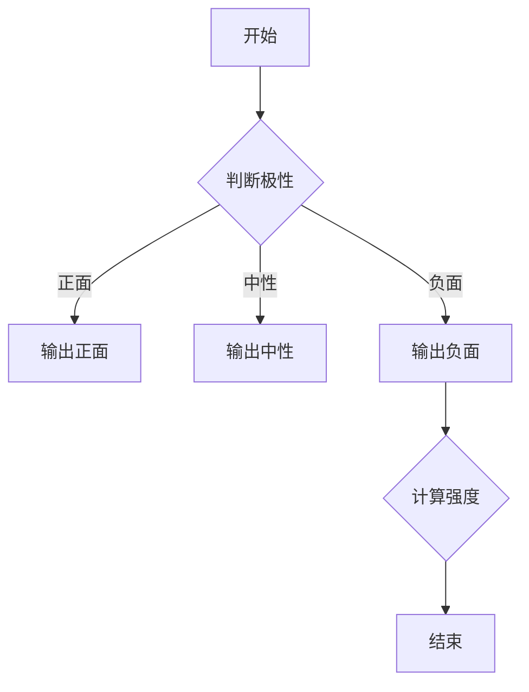

                 

# 大模型在情感分析中的突破应用

## 关键词

- 情感分析
- 大模型
- 情感极性
- 深度学习
- 人工智能

## 摘要

本文将探讨大模型在情感分析领域的突破性应用。首先，我们将介绍情感分析的定义、发展历程及其重要性。接着，我们将深入探讨大模型的基本概念、优势与挑战，以及其在情感分析中的广泛应用前景。随后，我们将介绍情感分析中的核心概念，如情感极性、强度和维度，并详细讲解大模型在情感分析中的算法原理。文章将采用具体的案例，演示如何设计和实现一个情感分析系统，以及如何进行系统调优和性能优化。最后，我们将总结最佳实践，提出注意事项，并推荐拓展阅读，以帮助读者更深入地理解大模型在情感分析中的应用。

## 第一部分: 背景介绍

### 第1章: 情感分析概述

#### 1.1 情感分析的定义与重要性

情感分析（Sentiment Analysis），又称意见挖掘，是一种自然语言处理技术，旨在通过分析文本中的情感倾向来确定作者的情绪状态。这一技术广泛应用于市场营销、产品评测、社会舆情分析等领域。

情感分析的重要性体现在以下几个方面：

1. **市场需求**：随着互联网和社交媒体的普及，用户产生和消费的内容呈现爆炸式增长。企业希望通过情感分析技术，了解用户对产品、服务、政策等的看法，以便作出更明智的决策。

2. **信息提取**：情感分析能够帮助从大量文本数据中快速提取有价值的信息，例如用户对某一产品的满意度、对某一事件的看法等。

3. **智能客服**：在客户服务领域，情感分析可用于智能客服系统，识别客户反馈中的情绪，提供更个性化的服务。

#### 1.2 情感分析的发展历程

情感分析技术经历了从基于规则的方法到基于机器学习和深度学习的方法的演变。早期的方法主要依赖于手工程法和词典法，存在准确率低、适应性差等问题。随着深度学习技术的发展，基于神经网络的方法逐渐成为主流，显著提升了情感分析的准确性和效果。

#### 1.3 情感分析的应用场景

1. **市场调研**：通过分析消费者评论，企业可以了解用户对产品的情感态度，从而优化产品和服务。

2. **舆情监测**：政府部门和媒体机构可以利用情感分析技术，实时监测社会舆情，及时掌握公众对某一事件的看法。

3. **客户服务**：企业可以通过情感分析技术，识别客户投诉中的情绪，提供个性化的解决方案，提高客户满意度。

### 第2章: 大模型与情感分析

#### 2.1 大模型的基本概念

大模型（Large-scale Model），通常指的是参数规模庞大的神经网络模型，如GPT、BERT等。这些模型通过在海量数据上训练，获得了极高的语言理解和生成能力。

#### 2.2 大模型的优势与挑战

大模型的优势包括：

1. **强大的语言理解能力**：大模型具有处理复杂语言任务的能力，例如文本生成、问答系统等。

2. **适应性**：大模型能够适应多种不同的应用场景，具有较强的泛化能力。

大模型的挑战包括：

1. **计算资源需求**：大模型训练和推理需要巨大的计算资源，对硬件设备有较高要求。

2. **数据隐私问题**：大模型在训练过程中需要大量用户数据，可能涉及隐私泄露风险。

#### 2.3 大模型在情感分析中的应用前景

大模型在情感分析中的应用前景广阔：

1. **提高准确率**：大模型具有强大的文本理解能力，能够更准确地识别文本中的情感。

2. **增强适应性**：大模型能够处理多种语言和文本形式，适用于不同的情感分析任务。

3. **降低成本**：通过自动化和智能化，大模型可以降低情感分析的人力成本。

## 第二部分: 核心概念与联系

### 第3章: 情感分析中的核心概念

#### 3.1 情感极性

情感极性（Sentiment Polarity）是指文本中所表达的情感倾向，通常分为正面、中性、负面三种。

#### 3.2 情感强度

情感强度（Sentiment Intensity）是指情感极性的强度，可以通过数值来表示，例如1表示非常正面，-1表示非常负面。

#### 3.3 情感维度

情感维度（Sentiment Dimension）是指情感分析中需要考虑的不同方面，例如喜悦、愤怒、悲伤等。

#### 3.4 情感识别与分类

情感识别与分类（Sentiment Recognition and Classification）是指通过算法对文本中的情感进行识别和分类的过程。

### 第4章: 大模型的核心原理与特性

#### 4.1 神经网络基础

神经网络（Neural Network）是一种模仿生物神经系统的计算模型。大模型通常基于深度神经网络（Deep Neural Network），具有多层神经网络结构。

#### 4.2 深度学习框架

深度学习框架（Deep Learning Framework）是用于构建和训练深度学习模型的软件库。常见的深度学习框架包括TensorFlow、PyTorch等。

#### 4.3 大模型的结构与优化

大模型的结构（Model Architecture）通常包括多个隐藏层和大量的神经元。大模型的优化（Model Optimization）涉及模型参数的调整和优化，以提高模型性能。

## 第三部分: 算法原理讲解

### 第5章: 大模型在情感分析中的应用

#### 5.1 情感分析算法概述

情感分析算法（Sentiment Analysis Algorithm）是用于分析和识别文本中情感倾向的算法。基于大模型的情感分析算法具有以下特点：

1. **强大的语言理解能力**：大模型具有处理复杂语言任务的能力，能够更准确地识别文本中的情感。

2. **自适应**：大模型能够适应多种不同的应用场景，具有较强的泛化能力。

#### 5.2 基于大模型的情感分析算法

基于大模型的情感分析算法通常包括以下几个步骤：

1. **数据预处理**：对文本进行清洗、分词、去停用词等处理。

2. **特征提取**：使用大模型进行特征提取，将文本表示为高维向量。

3. **情感分类**：使用分类器对特征向量进行分类，判断文本的情感极性和强度。

#### 5.3 情感分析算法的比较与评估

常见的情感分析算法包括基于规则的方法、机器学习方法、深度学习方法等。基于大模型的情感分析算法在准确率、效率和泛化能力方面具有显著优势。

## 第四部分: 系统分析与架构设计

### 第6章: 数学模型与公式

#### 6.1 情感分析中的数学模型

情感分析中的数学模型通常包括以下几个方面：

1. **情感极性分类模型**：用于分类文本的情感极性，如正面、中性、负面。

2. **情感强度回归模型**：用于预测文本情感强度的数值。

3. **情感维度识别模型**：用于识别文本中的不同情感维度。

#### 6.2 情感强度的数学公式

情感强度的计算通常采用以下公式：

$$
情感强度 = \frac{正面词语得分 - 负面词语得分}{总词语数}
$$

其中，得分通常通过词嵌入模型（如Word2Vec、GloVe）计算。

#### 6.3 实例讲解与推导

以一个简单的例子来说明情感强度的计算：

假设有一段文本：“这辆车很漂亮，但价格有点贵。”

1. **情感极性分类**：通过算法判断，文本的情感极性为中性。

2. **情感强度计算**：

   - 正面词语得分：漂亮（+1）
   - 负面词语得分：贵（-1）
   - 总词语数：3

   $$
   情感强度 = \frac{1 - (-1)}{3} = \frac{2}{3} \approx 0.67
   $$

   因此，文本的情感强度约为0.67，表示为中性偏正面。

## 第五部分: 项目实战

### 第7章: 实际案例与实战应用

#### 8.1 数据准备与环境搭建

为了进行情感分析项目，我们首先需要准备数据集和搭建环境。以下是一个基本的步骤：

1. **数据集准备**：收集大量的文本数据，例如社交媒体评论、产品评测等。数据集应包含不同情感极性和强度的样本。

2. **环境搭建**：安装深度学习框架（如TensorFlow、PyTorch）和相关依赖库，搭建实验环境。

#### 8.2 系统核心实现

系统核心实现包括以下几个步骤：

1. **数据预处理**：对文本进行清洗、分词、去停用词等处理。

2. **特征提取**：使用大模型（如BERT）进行特征提取，将文本表示为高维向量。

3. **情感分类**：使用分类器（如SVM、CNN、RNN）对特征向量进行分类，判断文本的情感极性。

4. **情感强度预测**：使用回归器（如Linear Regression、LSTM）预测文本的情感强度。

#### 8.3 案例分析与解读

以下是一个具体的案例：

**案例：社交媒体评论情感分析**

1. **数据集**：收集1000条社交媒体评论，包含正面、中性、负面三种情感极性。

2. **数据预处理**：对评论进行清洗，去除特殊字符、标点符号，分词，去除停用词等。

3. **特征提取**：使用BERT模型对评论进行特征提取，生成高维向量。

4. **情感分类**：使用训练好的分类模型（如CNN）对评论进行分类，判断情感极性。

5. **情感强度预测**：使用训练好的回归模型（如LSTM）预测评论的情感强度。

#### 8.4 项目小结与反思

通过本项目的实践，我们得到了以下结论：

1. **大模型在情感分析中的应用效果显著**：大模型具有强大的语言理解和生成能力，能够更准确地识别文本中的情感。

2. **数据质量和预处理对结果有重要影响**：数据质量和预处理步骤对情感分析结果有直接影响，需要重视数据清洗和预处理。

3. **模型选择和调优对性能有重要影响**：不同的模型和参数选择对情感分析的准确率和效率有显著影响，需要进行模型选择和调优。

## 第六部分: 最佳实践与拓展

### 第9章: 最佳实践技巧

#### 9.1 数据预处理技巧

1. **文本清洗**：去除特殊字符、标点符号，统一字符大小写等。

2. **分词**：选择合适的分词工具，如jieba、NLTK等。

3. **去除停用词**：去除对情感分析无意义的常见词语，如“的”、“了”等。

#### 9.2 模型调优技巧

1. **数据增强**：通过数据增强技术，增加样本多样性，提高模型泛化能力。

2. **超参数调优**：通过调整学习率、批次大小、正则化参数等超参数，提高模型性能。

3. **模型融合**：使用多种模型进行融合，提高分类准确率。

#### 9.3 性能优化技巧

1. **模型压缩**：使用模型压缩技术，如量化和剪枝，减少模型参数数量，提高推理速度。

2. **分布式训练**：使用分布式训练技术，利用多台计算机进行模型训练，提高训练速度。

### 第10章: 注意事项与拓展阅读

#### 10.1 情感分析中的伦理问题

1. **数据隐私**：在进行情感分析时，应确保用户数据的安全和隐私。

2. **偏见与歧视**：情感分析模型可能存在偏见，需要采取措施减少歧视现象。

#### 10.2 新兴研究方向

1. **多语言情感分析**：针对多种语言的文本进行情感分析。

2. **无监督情感分析**：不依赖大量标注数据，通过无监督学习方法进行情感分析。

#### 10.3 拓展阅读推荐

1. **《深度学习与自然语言处理》**：李航 著，详细介绍了深度学习在自然语言处理中的应用。

2. **《自然语言处理综述》**：John H. Lafferty，Christopher D. Manning，Daniel M. Roth 著，全面介绍了自然语言处理的理论和方法。

## 作者信息

作者：AI天才研究院/AI Genius Institute & 禅与计算机程序设计艺术 /Zen And The Art of Computer Programming

### 附录

#### 附录A: Mermaid 图示例



#### 附录B: LaTex 公式示例

```markdown
$$
x = \frac{-b \pm \sqrt{b^2 - 4ac}}{2a}
$$

$1+1=2$
```

