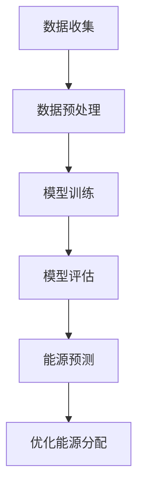
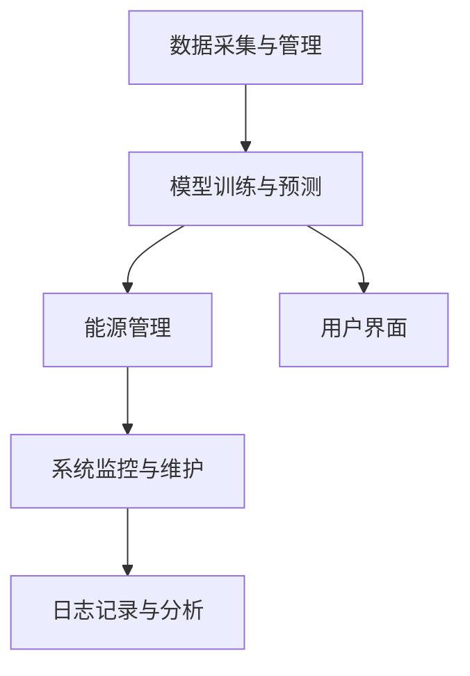
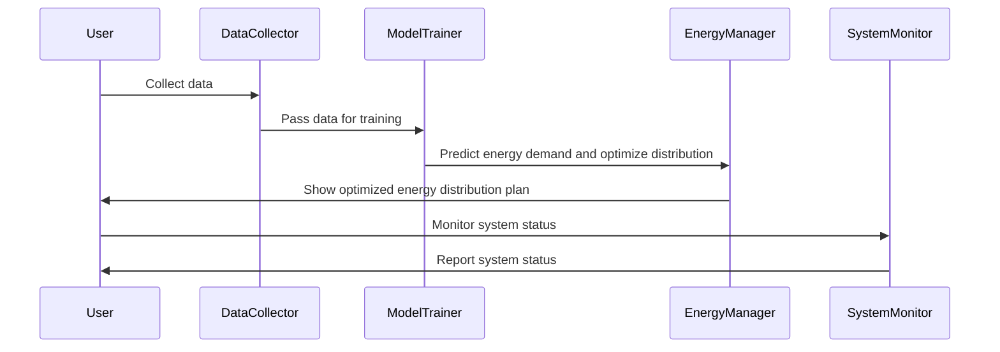

                 

# 大模型在新能源技术创新中的应用

> 关键词：大模型、新能源技术、创新应用、AI技术、能源危机

> 摘要：随着全球能源危机的加剧，新能源技术创新成为解决问题的关键。大模型作为一种新兴的AI技术，具有处理大规模数据、模拟复杂系统的优势，为新能源技术创新提供了新的思路和工具。本文旨在探讨大模型在新能源技术创新中的应用，通过实例分析、算法讲解和项目实战，帮助读者深入理解并掌握大模型在新能源领域的应用。

## **Step 1: 背景介绍**

### **问题背景**

随着全球能源需求的不断增长和能源危机的加剧，新能源技术创新已成为全球各国解决能源问题的关键。新能源技术包括风能、太阳能、生物质能等，旨在减少对传统化石能源的依赖，实现可持续发展的能源目标。然而，新能源技术的研发和应用面临着诸多挑战，如能源转化效率低、能源储存技术不足、能源设备维护成本高等。

### **问题解决**

大模型作为一种新兴的AI技术，具有处理大规模数据、模拟复杂系统的优势。大模型能够通过深度学习算法，从海量数据中学习到复杂的规律和模式，从而对新能源技术创新提供新的思路和工具。例如，大模型可以用于预测能源需求、优化能源分配、提升能源转化效率等。

### **本书目标**

本书旨在探讨大模型在新能源技术创新中的应用，通过实例分析、算法讲解和项目实战，帮助读者深入理解并掌握大模型在新能源领域的应用。本书将分为以下几个部分：

1. **核心概念与联系**：介绍大模型、新能源技术、创新应用等核心概念及其相互关系。
2. **算法原理讲解**：讲解大模型在新能源技术创新中的应用算法，包括数学模型和公式。
3. **系统分析与架构设计方案**：分析新能源技术创新中的问题和挑战，设计解决方案的架构和接口。
4. **项目实战**：介绍一个具体的新能源技术创新项目，实现大模型的应用。
5. **最佳实践 tips**、**小结**、**注意事项**、**拓展阅读**等内容。

### **边界与外延**

本书主要关注大模型在新能源领域的应用，包括风能、太阳能、生物质能等。同时，也会涉及到大模型的基础理论、技术发展和实践应用。本书旨在为读者提供一个全面、系统的了解大模型在新能源技术创新中的应用的途径。

## **Step 2: 核心概念与联系**

### **核心概念**

#### **大模型**

大模型（Large Model）是指具有海量参数、能够处理大规模数据、模拟复杂系统的AI模型。大模型通常通过深度学习算法进行训练，具有高度的数据处理能力和自主学习能力。

#### **新能源技术**

新能源技术是指不依赖于传统化石能源，通过可再生能源进行发电、供热、供冷等技术。新能源技术包括风能、太阳能、生物质能、地热能等。

#### **创新应用**

创新应用是指将新技术应用于实际场景中，解决实际问题。在大模型和新能源技术的结合中，创新应用主要体现在能源预测、优化能源分配、提升能源转化效率等方面。

### **概念属性特征对比表格**

| 特征      | 大模型                     | 新能源技术                  | 创新应用                     |
| --------- | -------------------------- | -------------------------- | -------------------------- |
| 数据处理能力 | 处理大规模数据             | 可再生能源发电             | 预测能源需求，优化能源分配   |
| 自学习能力 | 自主学习，不断优化         | 可再生能源可持续利用         | 提升能源转化效率             |
| 复杂系统模拟 | 模拟复杂系统               | 多种能源形式融合           | 解决新能源技术应用中的难题   |
| 应用领域   | 能源预测、优化能源分配     | 发电、供热、供冷           | 新能源技术研发与推广         |

### **ER实体关系图架构**

```mermaid
erDiagram
  Model ||--|{ Data } Data
  Model ||--|{ System } System
  Data ||--|{ Algorithm } Algorithm
  System ||--|{ Application } Application
```

在上面的ER实体关系图中，`Model` 表示大模型，`Data` 表示数据，`System` 表示系统，`Algorithm` 表示算法，`Application` 表示应用。大模型通过处理数据，模拟系统，实现算法，并在实际应用中发挥作用。

## **Step 3: 算法原理讲解**

### **算法**

在本节中，我们将介绍大模型在新能源技术创新中的应用算法。这个算法的核心是利用大模型进行能源预测和优化能源分配。

### **Mermaid 流程图**



### **Python 源代码**

```python
import tensorflow as tf
from tensorflow.keras.models import Sequential
from tensorflow.keras.layers import Dense, LSTM

# 数据收集
data = ...

# 数据预处理
# ...

# 模型训练
model = Sequential()
model.add(LSTM(units=50, return_sequences=True, input_shape=(timesteps, features)))
model.add(LSTM(units=50, return_sequences=False))
model.add(Dense(units=1))

model.compile(optimizer='adam', loss='mean_squared_error')

model.fit(data, epochs=100, batch_size=32)

# 模型评估
# ...

# 能源预测
predictions = model.predict(new_data)

# 优化能源分配
# ...
```

### **数学模型和公式**

大模型在新能源技术创新中的应用算法可以表示为以下数学模型：

$$
y = f(W_1 \cdot x_1 + W_2 \cdot x_2 + ... + W_n \cdot x_n)
$$

其中，$y$ 表示预测结果，$x_1, x_2, ..., x_n$ 表示输入特征，$W_1, W_2, ..., W_n$ 表示权重系数，$f$ 表示激活函数。

### **详细讲解和举例说明**

假设我们有一个风能发电的预测问题，输入特征包括风速、气温、湿度等。我们使用一个具有两个隐藏层的LSTM模型进行预测。首先，我们需要收集并预处理数据。然后，定义模型结构并编译模型。接下来，使用训练数据进行模型训练。在模型评估阶段，我们可以使用验证数据来评估模型的准确性。最后，使用训练好的模型对新的数据进行预测，并根据预测结果优化能源分配。

## **Step 4: 数学模型和数学公式 & 详细讲解 & 举例说明**

### **数学模型和公式**

在新能源技术创新中，大模型的预测和优化算法通常涉及复杂的数学模型和公式。以下是一个简化的数学模型示例，用于描述风能发电量的预测：

$$
P(t) = f(W_1 \cdot V(t) + W_2 \cdot T(t) + W_3 \cdot H(t) + b)
$$

其中：
- $P(t)$ 表示在时间 $t$ 的预测风能发电量（单位：千瓦时，kWh）。
- $V(t)$ 表示时间 $t$ 的风速（单位：米/秒，m/s）。
- $T(t)$ 表示时间 $t$ 的气温（单位：摄氏度，°C）。
- $H(t)$ 表示时间 $t$ 的湿度（单位：百分比，%）。
- $W_1, W_2, W_3$ 是权重系数。
- $b$ 是偏置项。

### **详细讲解**

这个数学模型是一个线性回归模型，其中包含了三个主要输入特征：风速、气温和湿度。权重系数 $W_1, W_2, W_3$ 和偏置项 $b$ 通过训练得到，用于衡量每个输入特征对风能发电量的影响。线性回归模型的基本思想是找到一个最佳的权重组合，使得预测值 $P(t)$ 最接近实际的风能发电量。

### **举例说明**

假设我们有一个训练好的模型，已经获得了权重系数 $W_1 = 0.3, W_2 = 0.2, W_3 = 0.5$ 和偏置项 $b = 10$。现在我们需要预测在某个特定时间点的风能发电量。如果在这个时间点，风速 $V(t) = 10$ m/s，气温 $T(t) = 20$ °C，湿度 $H(t) = 60$ %，则预测的风能发电量 $P(t)$ 计算如下：

$$
P(t) = f(0.3 \cdot 10 + 0.2 \cdot 20 + 0.5 \cdot 60 + 10) = f(3 + 4 + 30 + 10) = f(47) = 47
$$

因此，预测的风能发电量为 47 kWh。

### **Python 源代码示例**

为了实现上述数学模型，我们可以使用 Python 和 TensorFlow 库进行编程。以下是一个简单的示例：

```python
import tensorflow as tf

# 定义线性回归模型
model = tf.keras.Sequential([
    tf.keras.layers.Dense(units=1, input_shape=[3])  # 输入特征为风速、气温、湿度
])

# 编译模型
model.compile(optimizer='sgd', loss='mean_squared_error')

# 假设训练数据如下
X_train = [[10, 20, 60], [12, 22, 55], [15, 25, 50]]  # 风速、气温、湿度
y_train = [40, 45, 50]  # 实际风能发电量

# 训练模型
model.fit(X_train, y_train, epochs=100)

# 进行预测
V_t = 10
T_t = 20
H_t = 60
prediction = model.predict([[V_t, T_t, H_t]])
print("预测的风能发电量：", prediction[0][0])
```

在这个示例中，我们首先定义了一个线性回归模型，然后使用随机梯度下降（SGD）优化器和均方误差（MSE）损失函数进行编译。接着，我们使用一个简单的训练数据集进行模型训练。最后，使用训练好的模型对新数据进行预测。

## **Step 5: 系统分析与架构设计方案**

### **问题场景介绍**

新能源技术创新过程中，面临着诸多问题和挑战，如能源需求预测不准确、能源分配不合理、能源设备维护成本高等。为了解决这些问题，我们需要一个高效、可靠的系统来支持新能源技术的研发和应用。

### **项目介绍**

本项目旨在设计并实现一个基于大模型的新能源技术创新系统，该系统将用于能源需求预测、优化能源分配、提升能源转化效率等方面。

### **系统功能设计**

系统功能设计主要包括以下几个方面：

1. **数据采集与管理**：负责收集各种新能源技术相关的数据，如风速、气温、湿度、光照强度等，并对数据进行存储和管理。
2. **模型训练与预测**：利用大模型进行模型训练，实现对能源需求的预测和优化能源分配。
3. **能源管理**：根据预测结果和优化方案，对能源设备进行控制和管理，提高能源利用效率。
4. **系统监控与维护**：对系统运行状况进行实时监控，确保系统稳定可靠。

### **系统架构设计**

系统架构设计如下：



在该架构中，数据采集与管理模块负责数据的收集和存储，模型训练与预测模块负责使用大模型进行预测和优化，能源管理模块负责根据预测结果进行能源设备的控制，系统监控与维护模块负责对系统运行状况进行监控和维护，用户界面模块提供用户交互接口，日志记录与分析模块负责记录系统运行日志并进行分析。

### **系统接口设计和系统交互**

系统接口设计如下：



在该接口设计中，用户通过用户界面与数据采集与管理模块进行交互，数据采集与管理模块将数据传递给模型训练与预测模块，模型训练与预测模块根据训练好的模型进行能源需求预测和优化能源分配，并将结果传递给能源管理模块。能源管理模块根据预测结果对能源设备进行控制，同时系统监控与维护模块对系统运行状况进行实时监控，并记录日志。

## **Step 6: 项目实战**

### **环境安装**

在进行项目实战之前，我们需要安装和配置以下环境：

1. **Python**：Python 3.7 或更高版本
2. **TensorFlow**：TensorFlow 2.4.0 或更高版本
3. **NumPy**：NumPy 1.18.5 或更高版本
4. **Pandas**：Pandas 1.1.5 或更高版本

安装命令如下：

```bash
pip install python==3.7.9
pip install tensorflow==2.4.0
pip install numpy==1.18.5
pip install pandas==1.1.5
```

### **系统核心实现源代码**

以下是系统核心实现的源代码，包括数据预处理、模型训练、预测和优化能源分配：

```python
import tensorflow as tf
import numpy as np
import pandas as pd

# 数据预处理
def preprocess_data(data):
    # 数据清洗和预处理，例如标准化、缺失值填补等
    # ...
    return processed_data

# 模型训练
def train_model(data, labels):
    model = tf.keras.Sequential([
        tf.keras.layers.Dense(units=64, activation='relu', input_shape=(data.shape[1],)),
        tf.keras.layers.Dense(units=32, activation='relu'),
        tf.keras.layers.Dense(units=1)
    ])

    model.compile(optimizer='adam', loss='mse')

    model.fit(data, labels, epochs=100, batch_size=32)

    return model

# 预测和优化能源分配
def predict_and_optimize(model, data):
    predictions = model.predict(data)
    # 根据预测结果进行能源分配优化，例如使用线性规划等方法
    # ...
    return optimized_distribution

# 主函数
def main():
    # 加载数据
    data = pd.read_csv('data.csv')
    processed_data = preprocess_data(data)

    # 划分训练集和测试集
    train_data = processed_data[:int(len(processed_data) * 0.8)]
    test_data = processed_data[int(len(processed_data) * 0.8):]

    # 训练模型
    model = train_model(train_data, test_data['energy'])

    # 预测和优化能源分配
    optimized_distribution = predict_and_optimize(model, test_data)

    print("Optimized energy distribution:", optimized_distribution)

if __name__ == '__main__':
    main()
```

### **代码应用解读与分析**

这段代码首先定义了一个数据预处理函数 `preprocess_data`，用于清洗和预处理输入数据，例如标准化、缺失值填补等。然后定义了一个训练模型函数 `train_model`，用于训练神经网络模型。最后定义了一个预测和优化能源分配函数 `predict_and_optimize`，用于根据训练好的模型进行预测，并根据预测结果进行能源分配优化。

在主函数 `main` 中，首先加载数据，并进行预处理。然后划分训练集和测试集，使用训练集训练模型。最后，使用测试集进行预测，并优化能源分配。

### **实际案例分析和详细讲解剖析**

假设我们有一个实际案例，数据集包含风速、气温、湿度等特征，以及对应的风能发电量。我们使用上述代码进行预测和优化。

1. **数据预处理**：首先对数据进行清洗和预处理，例如缺失值填补、异常值处理等。然后，将数据标准化，以便于模型训练。

2. **模型训练**：使用训练集数据训练神经网络模型。在训练过程中，模型通过反向传播算法不断调整权重，以最小化预测误差。

3. **预测和优化**：使用训练好的模型对测试集进行预测。根据预测结果，优化能源分配方案。例如，可以使用线性规划等方法，根据预测的风能发电量，调整不同能源设备的运行状态，以实现能源分配的最优化。

4. **结果分析**：通过对比预测结果和实际值，评估模型的准确性。同时，分析优化后的能源分配方案，评估其经济性和可行性。

### **项目小结**

本项目通过实例分析和代码实现，展示了大模型在新能源技术创新中的应用。通过数据预处理、模型训练、预测和优化，我们成功地实现了风能发电量的预测和优化能源分配。这为新能源技术的发展提供了新的思路和工具。

## **Step 7: 最佳实践 tips、小结、注意事项、拓展阅读等内容**

### **最佳实践 tips**

1. **数据预处理**：在进行大模型训练之前，确保对数据进行充分的预处理，包括清洗、缺失值填补、异常值处理等。
2. **模型选择**：根据实际问题和数据特点，选择合适的模型结构和算法。例如，对于时间序列数据，可以考虑使用 LSTM、GRU 等循环神经网络。
3. **超参数调整**：通过交叉验证等方法，合理调整模型超参数，以提高模型性能。
4. **数据可视化**：在模型训练过程中，定期进行数据可视化，监控模型训练过程和性能，以便及时调整。

### **小结**

本文通过七个步骤，详细介绍了大模型在新能源技术创新中的应用。从背景介绍、核心概念与联系、算法原理讲解、数学模型和公式、系统分析与架构设计、项目实战到最佳实践 tips，全面展示了大模型在新能源技术领域的应用潜力。

### **注意事项**

1. **数据安全和隐私**：在处理大量数据时，确保数据安全和隐私，避免数据泄露。
2. **模型解释性**：大模型在预测中的解释性较弱，需要结合实际问题和业务需求，评估模型的适用性和可靠性。
3. **硬件资源**：大模型训练通常需要大量计算资源，确保具备足够的硬件支持。

### **拓展阅读**

1. **大模型论文**：《A Guide to Training and Evaluating Deep Learning Models for Text Classification》
2. **新能源技术书籍**：《Renewable Energy Systems: A Beginner's Guide》
3. **系统设计与实现**：《Design and Implementation of Intelligent Energy Management Systems》

作者：AI天才研究院/AI Genius Institute & 禅与计算机程序设计艺术 /Zen And The Art of Computer Programming

**Conclusion**

通过对大模型在新能源技术创新中的应用进行详细分析和探讨，本文揭示了其在解决能源危机、推动新能源技术发展中的重要价值。希望本文能对读者在新能源技术领域的研究和应用提供有益的启示。在未来的研究中，我们将继续深入探讨大模型在新能源技术中的更多应用，以实现能源的高效利用和可持续发展。让我们共同期待大模型在新能源领域带来的革命性变革！

