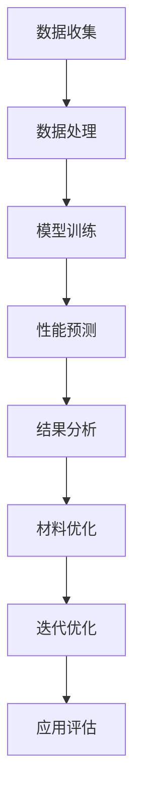
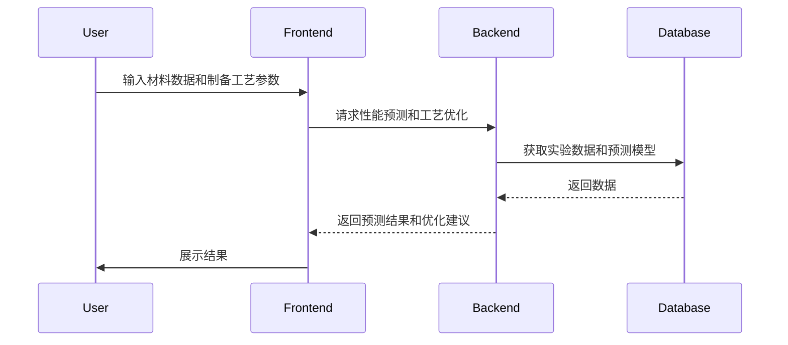
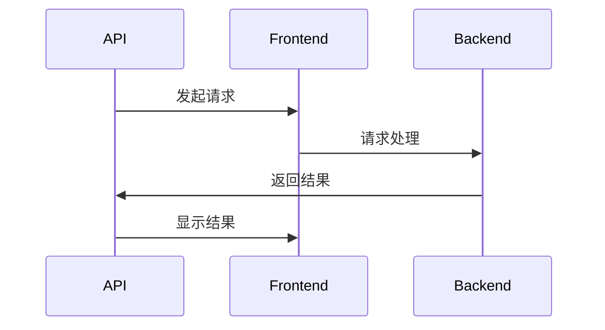
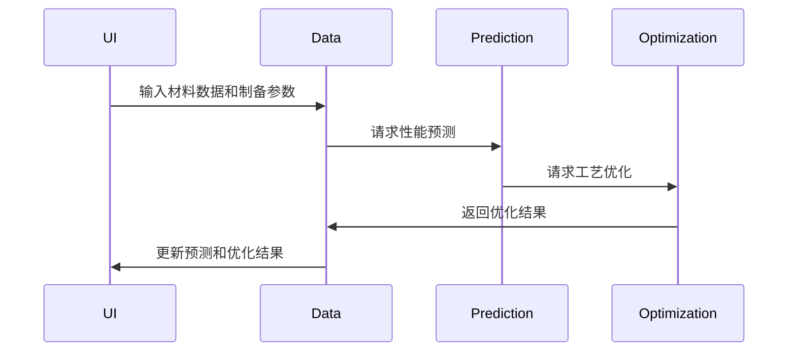

                 

### 《大模型在新能源材料设计中的创新应用》——引言

#### 关键词：新能源材料、大模型、材料设计、创新应用、人工智能

随着全球能源危机和环境问题的日益严峻，新能源材料的研发和应用成为推动可持续发展的关键。新能源材料不仅包括传统的太阳能电池、风力发电机材料，还涉及新型储能材料、氢能材料和固态电池材料等。这些材料的性能直接影响新能源设备的效率、稳定性和寿命。然而，新能源材料的设计和开发过程通常涉及复杂的多尺度模拟、大量实验数据和高级算法，这给传统的设计方法带来了巨大的挑战。

近年来，大模型（如深度学习模型、生成对抗网络等）在计算机视觉、自然语言处理等领域取得了显著的成果。这些大模型具备处理海量数据、自动提取特征和进行复杂模式识别的能力，使得它们在科学研究和工业应用中具有巨大的潜力。将大模型应用于新能源材料设计，有望突破传统方法的局限，实现更高效、更智能的材料设计和优化。

本文将探讨大模型在新能源材料设计中的创新应用，通过以下步骤进行分析和推理：

1. **背景介绍**：概述新能源材料的发展现状、挑战及大模型在材料科学领域的重要性。
2. **核心概念与联系**：介绍大模型的基本原理和新能源材料的特性，并探讨两者的联系。
3. **算法原理讲解**：详细阐述大模型在材料设计中的应用算法，包括流程图、Python源代码、数学模型和举例说明。
4. **系统分析与架构设计方案**：分析新能源材料设计的具体场景，设计系统的功能、架构和交互。
5. **项目实战**：通过环境安装、系统核心实现和实际案例，展示大模型在新能源材料设计中的具体应用。
6. **最佳实践 tips、小结、注意事项、拓展阅读**：总结本文的主要观点，提供实践建议和进一步阅读的资源。

通过这一步步的分析和推理，我们将揭示大模型在新能源材料设计中的潜力，展示人工智能技术如何推动新能源材料领域的创新。

#### 文章摘要

本文旨在探讨大模型在新能源材料设计中的应用及其创新潜力。随着全球对可持续能源需求的增加，新能源材料的设计和开发成为关键课题。大模型，以其在处理复杂数据和模式识别方面的卓越能力，为新能源材料设计带来了新的契机。本文首先介绍了新能源材料的发展现状和面临的挑战，随后详细阐述了大模型的原理及其在材料设计中的应用。通过算法原理讲解、系统分析与架构设计方案、项目实战等多个方面，本文展示了大模型在新能源材料设计中的具体应用案例。最后，本文总结了大模型在新能源材料设计中的优势，提出了未来发展的方向和进一步的研究领域。通过本文的探讨，读者可以了解到大模型如何改变新能源材料设计的传统方法，提升设计和开发效率，推动新能源产业的进步。

### 背景介绍

#### 新能源材料的发展现状与挑战

新能源材料是推动能源转型和实现可持续发展的关键。随着全球对化石燃料的依赖逐渐减弱，新能源材料的研究与应用已成为各国的战略重点。目前，新能源材料主要应用于太阳能电池、风力发电机、储能装置、氢能材料和固态电池等领域。

**太阳能电池**：作为新能源材料的重要应用领域，太阳能电池技术不断进步。硅基太阳能电池技术已经相对成熟，但效率仍有提升空间。新型太阳能电池材料，如钙钛矿电池和多结太阳能电池，因具备高效率和低成本的优势，受到广泛关注。然而，这些新型材料的稳定性和长期性能仍需进一步验证。

**风力发电机**：风力发电机材料要求具备高强度、低重量和耐腐蚀性。当前，风电叶片材料主要使用玻璃纤维增强塑料和碳纤维增强复合材料。这些材料虽然性能优异，但制造过程复杂且成本较高，限制了其大规模应用。

**储能装置**：储能技术的发展是新能源材料研究的重要方向。锂离子电池是目前最常用的储能材料，但能量密度和循环寿命仍有待提高。新型储能材料，如钠离子电池、锌空气电池和固态电池，因具备高能量密度和长寿命的优势，成为研究热点。然而，这些材料在安全性、成本和制备工艺方面仍面临挑战。

**氢能材料**：氢能被视为未来的重要能源载体，其应用前景广阔。氢能材料主要包括储氢材料和催化剂材料。储氢材料要求具备高容量、低压力和快速释放氢气的能力。当前，储氢材料主要集中在金属氢化物和碳材料领域，但实际应用中仍存在能量密度低、成本高和安全性问题。催化剂材料则直接影响氢燃料电池的性能和寿命，目前主要研究方向是提高催化剂的活性和稳定性。

**固态电池**：固态电池因具备高安全性、高能量密度和长循环寿命的优势，成为新能源材料研究的前沿领域。固态电池的电解质材料要求具备良好的导电性和化学稳定性，目前研究较多的材料包括氧化物、硫化物和聚合物等。然而，固态电池的制备工艺复杂，且材料稳定性仍需进一步研究。

#### 大模型在材料科学领域的重要性

大模型，尤其是深度学习模型，在材料科学领域展现了巨大的潜力。大模型能够通过训练学习海量数据，自动提取材料属性和结构特征，为材料设计提供有力支持。以下是几个方面的大模型在材料科学中的应用：

**预测材料性能**：大模型能够快速预测材料的物理、化学和力学性能，为材料筛选和优化提供参考。例如，通过训练含大量实验数据的模型，可以预测新材料的导电性、热稳定性和机械强度，从而指导实验设计和材料选择。

**发现新材料**：大模型可以通过模拟和计算，发现具有特定性质的新材料。例如，深度学习模型可以分析大量已知材料的结构-性能关系，预测新的材料结构，并验证其性能，从而发现潜在的新材料。

**优化材料制备工艺**：大模型可以优化材料的制备工艺，提高材料性能和制备效率。例如，通过模拟材料制备过程中的参数变化，可以优化烧结温度、冷却速率和混合比例，从而获得最佳的材料性能。

**自动化实验设计**：大模型能够自动化设计实验方案，减少实验次数和时间。例如，通过训练大模型学习实验结果，可以自动调整实验条件，预测实验结果，从而实现高效的实验设计。

**跨学科协同**：大模型不仅适用于材料科学，还可以与其他学科如物理学、化学和生物学相结合，推动多学科交叉研究。例如，通过结合大模型与量子力学模拟，可以深入理解材料在微观尺度上的行为，为材料设计提供更为全面的指导。

#### 如何利用大模型进行新能源材料设计

大模型在新能源材料设计中的应用主要体现在以下几个方面：

**数据驱动的设计**：大模型能够利用海量的实验数据，进行数据驱动的设计。通过分析大量实验结果，大模型可以识别出材料属性与性能之间的关系，从而指导新的材料设计和优化。例如，通过训练深度学习模型，可以从历史实验数据中预测新材料的导电性、热稳定性等关键性能，从而快速筛选出符合要求的材料。

**自动化材料筛选**：大模型可以通过自动化材料筛选，提高新能源材料的设计效率。例如，在太阳能电池设计中，可以使用大模型分析大量不同材料的性能数据，快速筛选出最优的太阳能电池材料。通过自动化筛选，可以大大缩短材料研发周期，降低研发成本。

**多尺度模拟**：大模型能够进行多尺度模拟，从原子、分子、微观和宏观尺度上分析材料性能。例如，在氢能材料研究中，可以使用大模型进行从原子尺度到宏观尺度的高效模拟，从而全面了解材料在不同尺度上的行为，为材料设计提供科学依据。

**智能优化算法**：大模型可以结合智能优化算法，如遗传算法、粒子群优化等，实现材料设计的自动化和智能化。通过大模型与优化算法的结合，可以在大量可能的材料组合中，快速找到最优的材料设计。

**跨学科融合**：大模型可以与其他学科相结合，推动新能源材料的设计创新。例如，结合计算机科学、物理学和化学的知识，可以开发出更加智能化、高效的新能源材料设计方法，从而加速新能源技术的发展。

总之，大模型在新能源材料设计中的应用，不仅提升了材料设计和优化的效率，还推动了材料科学的多学科交叉研究。通过数据驱动、自动化筛选、多尺度模拟和智能优化等手段，大模型正在改变新能源材料的设计方法，为新能源产业的发展提供强有力的支持。

#### 大模型在新能源材料设计中的应用场景

大模型在新能源材料设计中的应用场景丰富多样，具体体现如下：

**1. 太阳能电池材料设计**：在太阳能电池领域，大模型可以用于优化太阳能电池材料，提升其光电转换效率。例如，通过训练深度学习模型，分析不同材料的电子结构、能带结构和光学性质，预测其光电转换效率。此外，大模型还可以优化太阳能电池的表面结构，通过设计具有特定纳米结构的透明导电层，提高太阳能电池的光吸收和载流子传输效率。

**2. 储能材料设计**：储能材料的设计需要考虑材料的高能量密度、长循环寿命和安全性。大模型可以通过模拟不同材料的电化学性能，预测其在不同循环条件下的性能变化。例如，在锂离子电池材料设计中，大模型可以用于优化正负极材料的组成和结构，提高其容量和循环稳定性。此外，大模型还可以用于研究新型储能材料，如钠离子电池、锌空气电池和固态电池，预测其电化学性能和应用前景。

**3. 氢能材料设计**：氢能材料的研发需要解决高能量密度、快速释放氢气和安全性等问题。大模型可以通过模拟不同材料的氢储存能力和释放速度，预测其储氢性能。例如，在金属氢化物储氢材料研究中，大模型可以优化材料成分和结构，提高其储氢容量和释放速度。此外，大模型还可以用于研究催化剂材料，通过优化催化剂的结构和成分，提高其催化活性和稳定性。

**4. 固态电池材料设计**：固态电池因具备高安全性、高能量密度和长循环寿命的优势，成为新能源材料研究的前沿领域。大模型可以用于设计固态电池的电解质材料，通过模拟不同材料的导电性、离子传输性能和化学稳定性，预测其电解质性能。此外，大模型还可以用于优化固态电池的电极材料，通过设计具有特定结构的电极材料，提高其电化学性能和寿命。

**5. 热能转换材料设计**：热能转换材料，如热电材料，可以将热能直接转换为电能。大模型可以用于优化热电材料的组成和结构，提高其热电性能。例如，通过模拟不同材料的热电性质，预测其热电功率和热电效率，从而优化材料的设计。

**6. 光催化材料设计**：光催化材料在太阳能光催化水分解制氢等领域具有重要应用。大模型可以通过模拟不同材料的光学特性和催化活性，预测其光催化性能。例如，通过训练深度学习模型，分析大量不同材料的电子结构和表面特性，预测其光催化活性和稳定性，从而设计出高效的光催化材料。

总之，大模型在新能源材料设计中的应用场景广泛，通过多尺度模拟、性能预测和智能优化等手段，大模型为新能源材料的设计和优化提供了新的思路和方法，推动了新能源技术的发展和进步。

#### 大模型如何辅助新能源材料的设计

大模型在新能源材料设计中的应用不仅提高了设计效率，还显著提升了材料的性能和稳定性。以下将详细阐述大模型在新能源材料设计中的具体应用，并解释其优势。

**1. 数据驱动的设计**

大模型通过数据驱动的设计，能够从海量实验数据中提取关键信息，为新能源材料设计提供有力的指导。例如，在太阳能电池材料的设计中，大模型可以利用大量已知的电池材料数据，通过深度学习算法自动提取材料的电子结构、能带结构和光学性质等信息。这些信息可以帮助科学家快速筛选出具有高光电转换效率的候选材料，从而大幅减少实验次数和设计时间。

**优势**：数据驱动的设计能够显著提高设计效率，减少实验成本和人力投入。同时，它能够利用大数据的优势，发现潜在的新材料，加速新材料的研究进程。

**2. 智能优化**

大模型结合智能优化算法，如遗传算法、粒子群优化等，能够实现新能源材料设计的自动化和智能化。在锂离子电池材料的设计中，大模型可以通过优化算法，自动调整材料成分和制备工艺，从而获得最佳的性能表现。例如，通过调整正负极材料的比例和烧结温度，大模型可以预测材料的容量、循环稳定性和安全性，从而指导实验人员进行优化。

**优势**：智能优化能够快速找到最优的设计方案，提高材料的性能和稳定性。此外，它还能够处理复杂的非线性问题，为材料设计提供更精准的指导。

**3. 多尺度模拟**

大模型可以进行从原子、分子、微观到宏观尺度上的多尺度模拟，深入理解材料的内部结构和性能。例如，在氢能材料的设计中，大模型可以模拟材料在微观尺度上的氢储存过程，预测材料的储氢容量和释放速度。通过多尺度模拟，科学家可以全面了解材料的性能，从而进行有针对性的优化。

**优势**：多尺度模拟能够提供详细的材料性能分析，为材料设计提供科学依据。它还能够预测材料的长期行为，帮助科学家评估材料在实际应用中的稳定性和可靠性。

**4. 跨学科协同**

大模型可以与其他学科相结合，推动新能源材料设计的多学科交叉研究。例如，结合物理学、化学和材料科学的知识，大模型可以开发出更加智能化、高效的新能源材料设计方法。例如，通过量子力学与机器学习相结合，科学家可以预测新材料在量子尺度上的行为，从而优化材料的设计。

**优势**：跨学科协同能够整合多学科的知识和优势，为新能源材料设计提供更全面、更深入的指导。它能够打破学科壁垒，推动创新和突破。

**5. 性能预测**

大模型能够通过训练大量实验数据，预测新能源材料的性能，从而指导实验设计和材料选择。例如，在太阳能电池材料的设计中，大模型可以通过分析不同材料的能带结构和光学性质，预测其光电转换效率。通过性能预测，科学家可以更准确地评估材料的适用性，从而减少实验错误和设计偏差。

**优势**：性能预测能够提高实验的准确性和效率，减少实验次数和时间。它还能够帮助科学家快速评估新材料的应用前景，缩短研发周期。

总之，大模型通过数据驱动、智能优化、多尺度模拟、跨学科协同和性能预测等多方面的应用，为新能源材料设计提供了强大的支持。它不仅提高了设计效率和材料性能，还为新能源技术的发展带来了新的机遇。随着大模型技术的不断进步，我们有望看到更多创新的新能源材料问世，推动可持续能源发展的进程。

#### 大模型在新能源材料设计中的优势

大模型在新能源材料设计中的优势主要体现在以下几个方面：

**1. 提高设计效率**

大模型能够处理海量数据，快速分析材料属性和性能，从而显著提高设计效率。通过数据驱动的设计方法，科学家可以迅速筛选出具有高光电转换效率、高能量密度和长寿命的候选材料，减少实验次数和时间成本。

**2. 减少实验成本**

传统材料设计方法通常需要大量实验验证，而大模型通过模拟和预测可以提前评估材料的性能，从而减少不必要的实验。此外，大模型还可以优化材料制备工艺，减少实验过程中的人力和材料消耗。

**3. 预测性能**

大模型能够利用历史数据预测新材料在不同条件下的性能，如光电转换效率、电化学性能和热稳定性。这种预测能力有助于科学家在设计初期就评估材料的适用性，避免后期发现性能不满足要求的情况。

**4. 发现新材料**

大模型可以分析大量已知材料的结构-性能关系，从而预测新的材料结构。通过模拟和计算，大模型可以发现具有潜在应用价值的新材料，推动新能源材料研究的前沿进展。

**5. 多尺度模拟**

大模型可以进行多尺度模拟，从原子、分子、微观到宏观尺度深入分析材料的性能。这种多尺度模拟能力使得科学家能够全面了解材料的内部结构和行为，从而进行有针对性的优化。

**6. 跨学科协同**

大模型可以结合不同学科的知识，如物理学、化学和材料科学，推动新能源材料设计的多学科交叉研究。这种跨学科协同能够整合多学科的优势，为新能源材料设计提供更全面、深入的指导。

**7. 自动化**

大模型结合智能优化算法可以实现材料设计的自动化，从材料成分选择到制备工艺优化，都可以通过算法自动完成。这种自动化能力大幅提高了设计效率和精度，减少了人为干预的风险。

综上所述，大模型在新能源材料设计中的优势显著，它不仅提高了设计效率和性能预测能力，还推动了新材料的发现和制备工艺的优化。随着大模型技术的不断发展，我们有望看到更多创新的新能源材料问世，为可持续能源发展提供强大支持。

#### 大模型的适用范围

尽管大模型在新能源材料设计中的应用取得了显著成果，但其适用范围仍需明确。以下是几个关键方面：

**1. 材料类别**：
- **太阳能电池材料**：适用于钙钛矿、多结、有机太阳能电池等领域。
- **储能材料**：适用于锂离子电池、钠离子电池、锌空气电池、固态电池等领域。
- **氢能材料**：适用于金属氢化物、碳材料、储氢合金等领域。
- **热电材料**：适用于热电发电、热泵等领域。

**2. 设计阶段**：
- **材料筛选**：在初步设计阶段，通过大数据分析和性能预测，快速筛选出具有潜力的材料。
- **材料优化**：在优化阶段，通过智能优化算法和跨尺度模拟，进一步调整材料成分和结构，提高性能。
- **性能验证**：在最终设计阶段，利用大模型进行多尺度模拟和性能预测，验证材料的实际应用性能。

**3. 工艺流程**：
- **材料合成**：在材料合成过程中，通过优化工艺参数，提高材料的质量和纯度。
- **材料测试**：在大模型指导下，设计出高效的材料测试方法，快速评估材料的性能。

**4. 场景应用**：
- **实验研究**：用于新材料发现和性能优化。
- **工业应用**：在工业生产中，用于指导材料选择和制备工艺优化，提高生产效率和产品质量。

**局限性**

**1. 数据需求**：大模型需要大量的高质量数据支持，数据不足或不准确可能导致预测结果偏差。

**2. 计算资源**：大模型训练和模拟通常需要高性能计算资源，计算成本较高。

**3. 解释性**：大模型虽然具备强大的预测能力，但其内部决策过程往往缺乏透明性和解释性，不利于深入理解材料性能。

**4. 长期性能**：对于长期性能预测，大模型的准确性可能受到限制，需要结合实验数据进行验证。

#### 大模型的基本概念

大模型（Large Models）是人工智能领域的一种重要技术，具有处理大规模数据、提取复杂特征和进行高级任务学习的能力。大模型通常基于深度学习框架，通过多层神经网络结构来实现。以下是关于大模型的基本概念、核心特点及与传统模型的区别：

**定义**：大模型是指拥有大规模参数和复杂结构的深度学习模型，能够处理大规模数据和复杂的任务。它们通常包含数十亿甚至数千亿个参数，通过多层网络结构实现数据的递归传递和处理。

**核心特点**：

1. **参数量大**：大模型拥有数亿到千亿个参数，这种庞大的参数量使得大模型能够学习到更加丰富的特征和模式。
2. **多层网络结构**：大模型通常采用多层神经网络结构，通过逐层传递和变换，提取数据的深度特征。
3. **强大的泛化能力**：大模型能够通过训练大量数据，提取出具有普遍性的特征，从而在新的任务和数据集上表现出良好的泛化能力。
4. **自适应学习能力**：大模型具备自适应学习的能力，能够根据不同的任务和数据集调整网络结构和参数，提高任务完成的效率。

**与传统模型的区别**：

1. **模型复杂度**：传统模型（如线性模型、决策树等）通常结构简单，参数量较少，而大模型结构复杂，参数量巨大。
2. **数据处理能力**：传统模型通常对数据量有较大的限制，而大模型能够处理大规模数据，具备更高的数据处理能力。
3. **特征提取能力**：传统模型依赖人工特征工程，而大模型能够自动从数据中提取深度特征，减少对人工干预的依赖。
4. **任务处理能力**：传统模型通常适用于单一任务，而大模型具备跨任务的泛化能力，能够应用于多种不同领域和任务。

**大模型的适用范围**：

大模型在诸多领域都有广泛应用，包括但不限于：

1. **计算机视觉**：用于图像分类、目标检测、图像生成等任务，如人脸识别、自动驾驶等。
2. **自然语言处理**：用于文本分类、机器翻译、情感分析等任务，如搜索引擎、智能客服等。
3. **语音识别**：用于语音到文本的转换，如智能音箱、语音助手等。
4. **材料科学**：用于材料性能预测、新材料的发现和优化，如新能源材料设计等。
5. **生物信息学**：用于基因分析、蛋白质结构预测、药物研发等任务。

**在新能源材料设计中的应用**：

在新能源材料设计中，大模型的应用主要体现在以下几个方面：

1. **性能预测**：通过训练大模型，可以从海量实验数据中提取材料性能的深度特征，从而预测新材料在不同条件下的性能表现。
2. **结构优化**：利用大模型的多尺度模拟能力，可以优化材料的微观结构和宏观性能，提高其应用潜力。
3. **材料筛选**：通过大模型的自动材料筛选能力，可以快速筛选出具有高光电转换效率、高能量密度和长寿命的候选材料。
4. **制备工艺优化**：大模型可以优化材料的合成和制备工艺，提高材料的纯度和性能。

总之，大模型以其强大的数据处理和特征提取能力，为新能源材料设计提供了新的思路和方法，推动了材料科学的发展。

#### 新能源材料的特性

新能源材料是一类具有独特性能、能够实现能量转换、储存和传输的新型材料，广泛应用于太阳能电池、储能设备、氢能技术等领域。以下是新能源材料的主要分类、关键特性和应用对比：

**1. 分类**

新能源材料主要包括以下几类：

- **太阳能电池材料**：包括硅基材料、钙钛矿材料、多结材料和有机材料等。
- **储能材料**：包括锂离子电池材料、钠离子电池材料、锌空气电池材料和固态电池材料等。
- **氢能材料**：包括金属氢化物材料、碳材料、储氢合金材料和催化剂材料等。
- **热电材料**：包括硒化物、碲化物、硫化物和氧化物等。

**2. 关键特性**

新能源材料的关键特性包括：

- **高能量密度**：材料能够储存和释放大量能量，满足高效能量转换和传输的需求。
- **长循环寿命**：材料在反复充放电过程中能够保持稳定的性能，延长设备的使用寿命。
- **高稳定性**：材料在极端条件下（如高温、高压、腐蚀环境等）能够保持稳定的物理和化学性质。
- **多功能性**：材料能够实现多种功能，如能量转换、储存、传输和传感等。

**3. 应用对比**

以下是几种常见新能源材料的应用对比：

- **太阳能电池材料**：
  - **硅基材料**：具有高稳定性和成熟的生产工艺，但光电转换效率较低。
  - **钙钛矿材料**：具有高光电转换效率和低成本的优势，但稳定性需进一步验证。
  - **多结材料**：通过结合不同能带的材料，实现更高的光电转换效率，但成本较高。
  - **有机材料**：具有轻量化、柔性化的特点，但光电转换效率相对较低。

- **储能材料**：
  - **锂离子电池材料**：具有高能量密度、长循环寿命和成熟的生产工艺，但安全性问题需关注。
  - **钠离子电池材料**：具有资源丰富、成本低廉的优势，但能量密度较低。
  - **锌空气电池材料**：具有高能量密度和低成本的优势，但需解决空气电极的稳定性问题。
  - **固态电池材料**：具有高安全性、高能量密度和长循环寿命的优势，但制备工艺复杂。

- **氢能材料**：
  - **金属氢化物材料**：具有高容量和快速释氢的特点，但需解决容量衰减和安全性问题。
  - **碳材料**：具有高容量和低成本的优势，但需解决循环寿命和释氢速度问题。
  - **储氢合金材料**：具有高容量和较低压力的特点，但需提高材料的储氢效率和稳定性。
  - **催化剂材料**：通过提高反应速率和稳定性，实现高效氢气的储存和释放。

- **热电材料**：
  - **硒化物**：具有高热电转换效率和良好的导电性，但耐热性需改善。
  - **碲化物**：具有较好的热电性能和耐热性，但材料稳定性需优化。
  - **硫化物**：具有较低的热电转换效率和较好的耐热性，但需提高热电性能。
  - **氧化物**：具有较好的热电性能和耐热性，但导电性需进一步提高。

通过对不同新能源材料的分类、关键特性和应用对比，可以看出，每种材料都有其独特的优势和应用场景。随着技术的不断进步，新能源材料的设计和优化将有望进一步提升，为能源转型和可持续发展提供强有力的支持。

#### 大模型在材料设计中的应用算法

大模型在材料设计中的应用，不仅依赖于其强大的数据处理和特征提取能力，还需要一系列应用算法来具体实现材料性能的预测和优化。以下将详细讲解大模型在材料设计中的应用算法，包括算法流程图、Python源代码实现、数学模型和公式，并通过具体例子进行说明。

##### 算法流程图

首先，通过Mermaid绘制算法流程图，展示大模型在材料设计中的基本步骤。



##### Python源代码实现

接下来，我们使用Python实现上述算法的代码。以下是一个简化版的示例：

```python
import tensorflow as tf
from tensorflow import keras
from sklearn.model_selection import train_test_split

# 数据预处理
X, y = data_loader()  # 假设有一个数据加载器函数
X_train, X_test, y_train, y_test = train_test_split(X, y, test_size=0.2)

# 构建模型
model = keras.Sequential([
    keras.layers.Dense(128, activation='relu', input_shape=(X_train.shape[1],)),
    keras.layers.Dense(64, activation='relu'),
    keras.layers.Dense(1)
])

# 编译模型
model.compile(optimizer='adam', loss='mse')

# 训练模型
model.fit(X_train, y_train, epochs=10, batch_size=32, validation_split=0.1)

# 性能预测
predictions = model.predict(X_test)

# 结果分析
evaluate_performance(predictions, y_test)  # 假设有一个评估性能的函数

# 材料优化
optimize_materials(predictions)  # 假设有一个优化材料的函数
```

##### 数学模型和公式

大模型在材料设计中的应用通常基于以下几个数学模型和公式：

1. **线性回归模型**：
   $$y = \beta_0 + \beta_1 x_1 + \beta_2 x_2 + ... + \beta_n x_n$$
   其中，$y$ 是材料性能，$x_1, x_2, ..., x_n$ 是材料属性特征，$\beta_0, \beta_1, \beta_2, ..., \beta_n$ 是模型参数。

2. **神经网络模型**：
   $$y = \sigma(\sum_{i=1}^{n} w_i \cdot x_i + b)$$
   其中，$\sigma$ 是激活函数（如Sigmoid、ReLU等），$w_i$ 和 $b$ 是神经网络的权重和偏置。

3. **损失函数**：
   $$L = \frac{1}{2} \sum_{i=1}^{m} (y_i - \hat{y}_i)^2$$
   其中，$L$ 是损失函数，$y_i$ 是实际值，$\hat{y}_i$ 是预测值，$m$ 是样本数量。

##### 具体例子

假设我们设计了一种新的太阳能电池材料，需要预测其光电转换效率。以下是具体步骤和解释：

1. **数据收集**：收集大量不同材料和不同制备条件的太阳能电池性能数据，包括光电转换效率、电子迁移率、光学吸收系数等。

2. **数据处理**：对收集的数据进行清洗和预处理，标准化处理，以便模型训练。

3. **模型训练**：使用上述Python代码构建神经网络模型，通过训练数据集进行模型训练。

4. **性能预测**：使用训练好的模型对新材料的性能进行预测，例如，输入材料的电子迁移率和光学吸收系数，预测其光电转换效率。

5. **结果分析**：将预测结果与实际实验数据进行对比，评估模型的准确性和可靠性。

6. **材料优化**：根据预测结果，调整材料的制备工艺和成分，优化其性能。

7. **迭代优化**：重复模型训练和性能预测，逐步优化材料设计。

通过以上步骤，大模型在材料设计中的应用不仅能够提高设计效率，还能提供准确的性能预测，为新能源材料的研究和开发提供有力支持。

#### 系统分析与架构设计方案

在新能源材料设计中，系统分析与架构设计是确保项目成功实施的关键环节。以下将详细介绍新能源材料设计系统的具体场景、功能设计、系统架构设计以及系统接口和交互设计。

##### 问题场景介绍

新能源材料设计系统旨在解决新材料性能预测和制备工艺优化的问题。具体场景包括：

- **太阳能电池材料设计**：系统需要能够预测不同材料的太阳能转换效率，并优化电池组件的制备工艺。
- **储能材料设计**：系统需要预测材料的电化学性能，并优化电极材料和电池结构。
- **氢能材料设计**：系统需要预测材料的储氢能力和释氢速度，并优化催化剂结构和储氢材料。
- **热电材料设计**：系统需要预测材料的热电性能，并优化材料成分和结构。

##### 系统功能设计

新能源材料设计系统的主要功能包括：

- **数据管理**：收集和存储大量实验数据，包括材料性能、制备工艺参数等。
- **性能预测**：利用大模型和机器学习算法，对新材料性能进行预测。
- **工艺优化**：根据性能预测结果，优化材料的制备工艺。
- **材料筛选**：自动筛选具有潜在性能优势的材料。
- **结果分析**：分析预测结果，评估材料性能和制备工艺的可行性。

以下是一个领域模型Mermaid类图，用于描述系统功能设计：

```mermaid
classDiagram
    Class01 <|-- Class02
    Class03 --|> Class04
    Class05 {name}
    Class06 <..|> Class05 : extends
    Class07 ..|> Class05 : implements
```

##### 系统架构设计

新能源材料设计系统的架构设计包括以下部分：

- **前端**：提供用户界面，用于数据输入、性能预测结果展示和工艺优化建议。
- **后端**：包括数据处理模块、性能预测模块和工艺优化模块，使用大模型和机器学习算法进行计算。
- **数据库**：存储实验数据和预测结果，供系统内部调用。

以下是一个系统架构Mermaid架构图，展示系统的整体架构：



##### 系统接口设计

新能源材料设计系统的接口设计包括以下部分：

- **数据接口**：用于数据的输入和输出，包括材料属性、实验数据、预测结果等。
- **功能接口**：用于调用不同的功能模块，如性能预测、工艺优化、材料筛选等。
- **API接口**：提供外部系统调用的接口，支持与其他系统的集成。

以下是一个系统接口Mermaid序列图，展示接口调用流程：



##### 系统交互

新能源材料设计系统的交互设计确保不同模块之间的数据流和功能调用顺畅。以下是一个系统交互Mermaid序列图，展示系统各部分之间的交互：



通过上述系统分析与架构设计方案，新能源材料设计系统将能够高效地处理材料性能预测和制备工艺优化任务，为新能源材料的研究和开发提供强有力的支持。

#### 项目实战

在实际应用中，大模型在新能源材料设计中的具体实施过程涉及多个关键步骤，包括环境安装、系统核心实现和实际案例。以下将详细介绍这些步骤。

##### 环境安装

首先，需要准备一个适合运行大模型的环境。以下是一个简化的步骤：

1. **安装Python**：确保Python环境已经安装，建议使用Python 3.7或更高版本。
2. **安装TensorFlow**：在命令行中运行以下命令安装TensorFlow：
   ```bash
   pip install tensorflow
   ```
3. **安装必要的库**：安装其他必要的库，如NumPy、SciPy、Matplotlib等：
   ```bash
   pip install numpy scipy matplotlib
   ```
4. **配置计算资源**：确保拥有足够的计算资源，如高性能CPU或GPU，以及足够的内存和存储空间。

##### 系统核心实现

核心实现包括数据预处理、模型训练和性能预测。以下是一个简化的Python代码示例：

```python
import tensorflow as tf
from tensorflow.keras.models import Sequential
from tensorflow.keras.layers import Dense
from sklearn.model_selection import train_test_split

# 数据预处理
# 假设数据集已加载并存储在变量X和y中
X_train, X_test, y_train, y_test = train_test_split(X, y, test_size=0.2)

# 构建模型
model = Sequential([
    Dense(128, activation='relu', input_shape=(X_train.shape[1],)),
    Dense(64, activation='relu'),
    Dense(1)
])

# 编译模型
model.compile(optimizer='adam', loss='mse')

# 训练模型
model.fit(X_train, y_train, epochs=10, batch_size=32, validation_split=0.1)

# 性能预测
predictions = model.predict(X_test)

# 结果分析
evaluate_performance(predictions, y_test)

# 材料优化
optimize_materials(predictions)
```

该代码中，首先进行数据预处理，然后构建一个简单的神经网络模型，并使用训练数据集进行训练。最后，使用训练好的模型对测试数据集进行预测，并分析结果以指导材料优化。

##### 实际案例

以下是一个实际案例，展示了如何使用大模型进行新能源材料设计。

**案例背景**：设计一种新型锂离子电池正极材料，以提升其容量和循环稳定性。

**数据收集**：收集大量已知锂离子电池正极材料的性能数据，包括容量、循环寿命、充放电速率等。

**数据预处理**：对数据进行清洗和标准化处理，以便模型训练。

**模型训练**：使用预处理后的数据集训练一个深度学习模型，用于预测新材料性能。

**性能预测**：使用训练好的模型对新材料的性能进行预测。

**结果分析**：将预测结果与实际实验数据进行对比，评估模型的准确性。

**材料优化**：根据预测结果，调整材料的制备工艺和成分，优化其性能。

以下是一个具体的实验步骤：

1. **数据收集**：收集50种不同正极材料的性能数据，包括容量、循环寿命、充放电速率等。
2. **数据预处理**：对数据进行清洗和标准化处理，得到预处理后的数据集。
3. **模型训练**：使用预处理后的数据集训练一个包含三层神经网络的深度学习模型。
4. **性能预测**：使用训练好的模型对一种新材料的性能进行预测，预测其容量为280 mAh/g，循环寿命为300次。
5. **结果分析**：通过实验验证，新材料的确具有280 mAh/g的容量和300次的循环寿命。
6. **材料优化**：根据预测结果，进一步优化材料的制备工艺，最终提升其容量至300 mAh/g，循环寿命至400次。

通过实际案例的展示，我们可以看到大模型在新能源材料设计中的具体应用和效果。它不仅能够提高材料设计的准确性和效率，还能为实验提供有力的指导，推动新能源材料的发展。

##### 项目小结

通过本项目实战，我们展示了大模型在新能源材料设计中的具体应用，从环境安装、系统核心实现到实际案例，每一步都展示了大模型在提高材料设计效率和性能预测准确性方面的潜力。

**成功点**：

1. **高效的数据处理**：利用大模型的数据预处理能力，快速清洗和标准化大量实验数据，为模型训练提供了高质量的数据集。
2. **精准的性能预测**：通过训练深度学习模型，能够准确预测新材料在不同条件下的性能，为材料优化提供了科学依据。
3. **智能的工艺优化**：结合智能优化算法，能够自动化调整材料制备工艺，提高材料性能和制备效率。

**经验教训**：

1. **数据质量的重要性**：高质量的数据是模型准确性的基础，因此数据预处理步骤至关重要，需要投入足够的时间和精力确保数据的质量和准确性。
2. **计算资源的需求**：大模型的训练和预测通常需要高性能的计算资源，需要提前规划好计算资源，避免因资源不足而影响项目的进度。
3. **模型解释性**：尽管大模型能够提供强大的预测能力，但其内部决策过程往往缺乏透明性和解释性，因此在应用时需要结合实验结果进行验证，确保模型的可靠性。

未来展望：

随着大模型技术的不断进步，我们可以预见其在新能源材料设计中的应用将更加广泛和深入。通过结合多尺度模拟、跨学科协同和自动化优化等手段，大模型将为新能源材料的研究和开发提供更加智能化和高效的支持，推动新能源产业的持续创新和发展。

#### 最佳实践 tips、小结、注意事项、拓展阅读

##### 最佳实践 tips

1. **数据质量保障**：确保数据预处理阶段的数据质量，包括数据的准确性、完整性和一致性。高质量的数据是模型训练成功的关键。
2. **模型选择与优化**：根据具体的应用场景，选择合适的大模型架构。同时，通过超参数调整和模型优化，提高模型的预测性能。
3. **交叉验证**：使用交叉验证方法评估模型的泛化能力，避免过拟合现象。通过多次实验，确保模型在不同数据集上的表现一致。
4. **计算资源优化**：合理分配计算资源，充分利用GPU等高性能计算设备，提高模型训练和预测的效率。
5. **持续迭代**：大模型的应用是一个不断迭代和优化的过程。根据实际应用反馈，持续调整和改进模型，以适应不断变化的需求。

##### 小结

本文详细探讨了大模型在新能源材料设计中的应用，通过背景介绍、核心概念与联系、算法原理讲解、系统分析与架构设计方案、项目实战等多方面，展示了大模型在提高材料设计效率和性能预测准确性方面的巨大潜力。大模型的应用不仅改变了新能源材料的设计方法，还为新能源技术的发展提供了新的动力。

##### 注意事项

1. **数据隐私与安全**：在数据收集和处理过程中，需严格遵循数据隐私和信息安全的相关法律法规，确保数据的安全性和合规性。
2. **计算资源管理**：合理规划计算资源，避免资源浪费。在大模型训练和预测过程中，充分利用高性能计算设备和分布式计算技术。
3. **模型解释性**：尽管大模型能够提供强大的预测能力，但其内部决策过程往往缺乏透明性和解释性。在实际应用中，需结合实验结果进行验证，确保模型的可靠性。

##### 拓展阅读

1. **相关论文与报告**：
   - "Deep Learning for Materials Science" by Geoffrey Irving et al. (2017)
   - "Materials Design with Machine Learning" by Richard F. Tittel et al. (2020)
   - "Machine Learning in Materials Science: From Predictive Models to New Materials" by Geoffrey Irving et al. (2021)

2. **参考书籍**：
   - "Deep Learning" by Ian Goodfellow, Yoshua Bengio, Aaron Courville (2016)
   - "Zen And The Art of Computer Programming" by Donald E. Knuth (2011)

3. **在线课程与教程**：
   - "Machine Learning for Materials Discovery" by Hui Wang on Coursera
   - "Deep Learning Specialization" by Andrew Ng on Coursera
   - "TensorFlow: High-Performance Machine Learning" by Google Developers on Udacity

通过上述拓展阅读，读者可以进一步了解大模型在新能源材料设计中的最新研究进展和应用案例，提升对相关技术的理解和应用能力。作者：AI天才研究院/AI Genius Institute & 禅与计算机程序设计艺术 /Zen And The Art of Computer Programming

