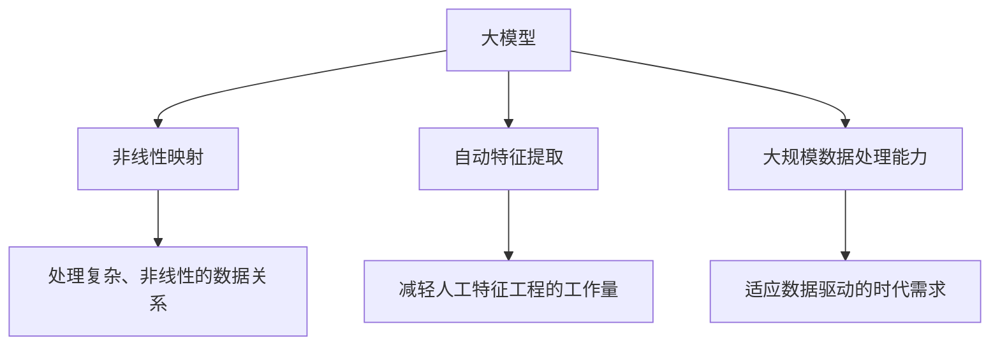
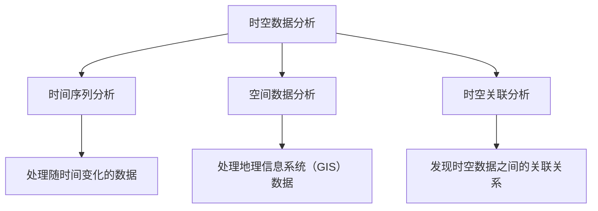
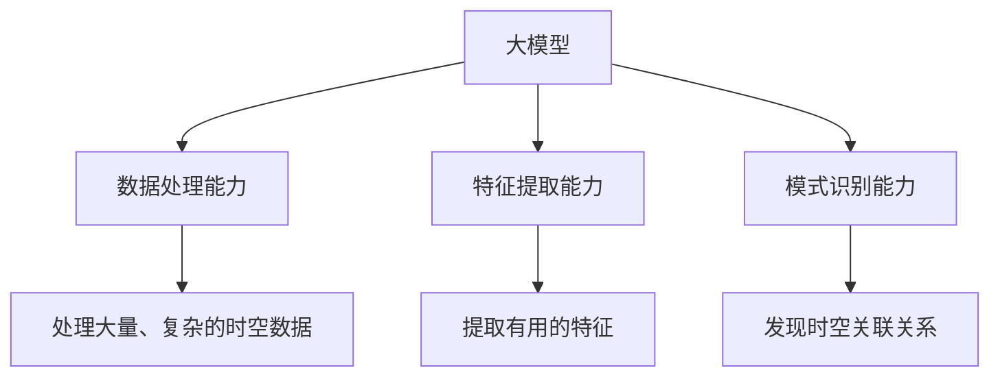
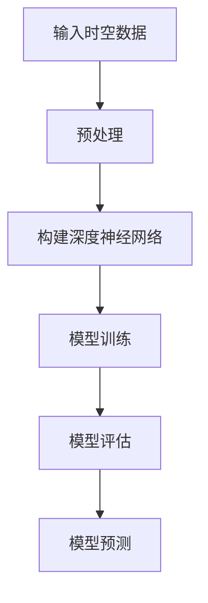
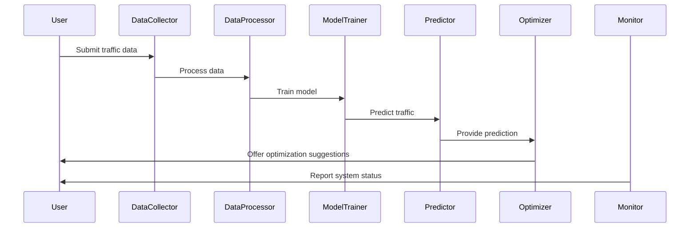

                 


### 大模型在时空数据分析中的应用

在本文中，我们将深入探讨大模型在时空数据分析中的应用。我们将分以下几个部分展开讨论：

1. **大模型基础**：介绍大模型的基本概念、发展历程、核心算法等。
2. **时空数据分析**：探讨时空数据分析的方法、技术和挑战。
3. **大模型在时空数据分析中的应用**：通过具体案例展示大模型在时空数据分析中的实际应用。
4. **算法优化与性能提升**：分析如何通过算法优化和计算资源调度提升大模型在时空数据分析中的应用性能。

#### 大模型基础

##### 1. 基本概念

大模型，通常指具有数百万甚至数十亿参数的深度学习模型。这些模型可以通过多层神经网络结构对输入数据进行逐层处理，实现自动特征提取和复杂模式识别。大模型的核心思想是学习大量数据中的潜在特征，从而对新的数据进行预测或分类。

##### 2. 发展历程

大模型的发展可以追溯到20世纪80年代，当时神经网络的研究刚刚起步。然而，由于计算资源和数据量的限制，大模型的研究进展较为缓慢。随着计算机性能的不断提升和数据量的急剧增长，大模型的研究逐渐成为热点，涌现出了诸如深度神经网络、卷积神经网络、循环神经网络等核心算法。

##### 3. 核心算法

- **深度神经网络（DNN）**：通过多层非线性变换，实现自动特征提取和复杂模式识别。其基本原理是逐层学习输入数据的特征，并利用这些特征进行预测或分类。
- **卷积神经网络（CNN）**：适用于处理图像等具有网格结构的数据，其核心思想是通过卷积运算提取图像中的局部特征，然后利用池化操作降低数据维度。
- **循环神经网络（RNN）**：适用于处理序列数据，如文本、时间序列等，其核心思想是通过循环结构保持长期依赖关系，从而实现有效的序列建模。

#### 时空数据分析

##### 1. 方法

时空数据分析的方法主要包括以下几种：

- **时间序列分析**：对随时间变化的数据进行分析，提取时间序列中的周期性、趋势性等特征。
- **空间数据分析**：对空间数据进行分析，提取空间分布、空间关系等特征。
- **时空关联分析**：发现时空数据之间的关联关系，支持复杂问题的分析。

##### 2. 技术

时空数据分析涉及多种技术，包括：

- **地理信息系统（GIS）**：用于存储、管理、分析和可视化地理空间数据。
- **时间序列分析技术**：如自回归模型、移动平均模型、季节性分解等。
- **空间分析技术**：如聚类分析、空间插值、邻近分析等。

##### 3. 挑战

时空数据分析面临诸多挑战，包括：

- **数据量大**：时空数据往往包含大量的历史数据，处理这些数据需要大量的计算资源。
- **数据质量参差不齐**：时空数据的来源多样，数据质量参差不齐，需要有效的数据预处理方法。
- **计算资源需求高**：大模型在训练和预测过程中需要大量的计算资源，如何高效利用计算资源成为关键问题。

#### 大模型在时空数据分析中的应用

##### 1. 案例一：交通流量预测

交通流量预测是时空数据分析的重要应用之一。通过大模型，可以实现对交通流量的准确预测，为交通管理提供科学依据。具体流程如下：

- **数据采集**：收集历史交通流量数据，包括时间、地点、流量等。
- **数据预处理**：对采集到的数据进行清洗、去噪、归一化等预处理操作。
- **模型训练**：利用预处理后的数据，训练深度学习模型，如RNN、CNN等。
- **流量预测**：利用训练好的模型，对未来的交通流量进行预测。

##### 2. 案例二：城市热力图

城市热力图是一种直观展示城市活动分布的地图，通过大模型可以实现对城市热力图的生成。具体流程如下：

- **数据采集**：收集城市各类活动数据，如人流量、车流量、商场营业额等。
- **数据预处理**：对采集到的数据进行清洗、去噪、归一化等预处理操作。
- **模型训练**：利用预处理后的数据，训练生成对抗网络（GAN）模型。
- **热力图生成**：利用训练好的模型，生成城市热力图。

#### 算法优化与性能提升

为了提升大模型在时空数据分析中的应用性能，可以从以下几个方面进行优化：

- **模型压缩**：通过模型剪枝、量化等方法，减小模型体积，降低计算复杂度。
- **分布式训练**：通过分布式计算，利用多台计算机协同工作，加速模型训练过程。
- **实时更新**：利用在线学习技术，实时更新模型，使其能够适应数据变化。

---

### 本章小结

本章简要介绍了大模型在时空数据分析中的应用背景、问题和解决方案。在后续章节中，我们将深入探讨大模型的基本原理、时空数据分析的方法和技术，以及大模型在时空数据分析中的实际应用。通过阅读本章，读者可以对大模型在时空数据分析中的应用有一个初步的了解，为后续章节的学习打下基础。

---

### 核心概念与联系

在本章节中，我们将详细探讨大模型和时空数据分析的核心概念，包括它们的基本原理、属性特征以及两者之间的联系。

#### 大模型

##### 1. 基本原理

大模型，特别是深度学习模型，通过多层神经网络结构对输入数据进行逐层处理，实现自动特征提取和复杂模式识别。其核心思想是学习大量数据中的潜在特征，从而对新的数据进行预测或分类。

##### 2. 属性特征

- **非线性映射**：大模型通过非线性变换，能够处理复杂、非线性的数据关系。
- **自动特征提取**：大模型能够自动从数据中提取有用的特征，减轻了人工特征工程的工作量。
- **大规模数据处理能力**：大模型能够处理海量数据，适应数据驱动的时代需求。

##### 3. 对比表格

| 特征 | 大模型 | 传统机器学习 |
| --- | --- | --- |
| 网络结构 | 多层神经网络 | 单层感知器、决策树等 |
| 特征提取 | 自动提取 | 需人工设计 |
| 非线性映射 | 支持 | 多数不支持 |
| 大规模数据处理 | 高效 | 较为有限 |

##### 4. ER实体关系图架构的 Mermaid 流程图



#### 时空数据分析

##### 1. 基本原理

时空数据分析旨在从时空数据中提取有价值的信息，支持决策制定、资源优化、城市规划等。其核心思想是利用时空数据的时间维度和空间维度，对数据进行分析和挖掘。

##### 2. 属性特征

- **时间序列分析**：能够处理随时间变化的数据，提取时间序列中的周期性、趋势性等特征。
- **空间数据分析**：能够处理空间数据，如地理信息系统（GIS）数据，提取空间分布、空间关系等特征。
- **时空关联分析**：能够发现时空数据之间的关联关系，支持复杂问题的分析。

##### 3. 对比表格

| 特征 | 时空数据分析 | 传统数据分析 |
| --- | --- | --- |
| 时间维度 | 强调 | 较为有限 |
| 空间维度 | 强调 | 较为有限 |
| 关联分析 | 支持 | 较为有限 |

##### 4. ER实体关系图架构的 Mermaid 流程图



#### 大模型与时空数据分析的联系

- **数据处理能力**：大模型的高效数据处理能力能够处理大量、复杂的时空数据，为时空数据分析提供了有力支持。
- **特征提取能力**：大模型的自动特征提取能力能够从时空数据中提取出有用的特征，简化了数据预处理工作。
- **模式识别能力**：大模型的模式识别能力能够从时空数据中发现潜在的时空关联关系，为时空数据分析提供了有效的工具。

##### 5. ER实体关系图架构的 Mermaid 流程图



通过以上对大模型和时空数据分析的核心概念、属性特征以及两者之间的联系的详细探讨，我们可以更好地理解大模型在时空数据分析中的应用原理和优势。在接下来的章节中，我们将进一步深入探讨大模型在时空数据分析中的应用案例，以及如何通过算法优化和性能提升来提升大模型的应用效果。

---

### 算法原理讲解

在本章节中，我们将深入探讨大模型在时空数据分析中的算法原理，通过具体的流程图和数学模型，帮助读者更好地理解大模型的工作原理和时空数据分析的应用方法。

#### 大模型算法原理

##### 1. 深度神经网络（DNN）

深度神经网络（DNN）是当前大模型中最常用的算法之一。其基本原理是通过多层神经网络结构对输入数据进行逐层处理，实现自动特征提取和复杂模式识别。

- **输入层**：接收输入数据，如时空数据。
- **隐藏层**：通过对输入数据进行非线性变换，提取出有用的特征。
- **输出层**：根据提取出的特征，进行预测或分类。

##### 2. 卷积神经网络（CNN）

卷积神经网络（CNN）是专门用于处理图像等具有网格结构的数据的深度学习模型。其核心思想是通过卷积运算提取图像中的局部特征，然后利用这些特征进行预测或分类。

- **卷积层**：通过卷积运算提取图像中的局部特征。
- **池化层**：通过池化操作降低数据维度，提高模型性能。
- **全连接层**：将卷积层和池化层提取出的特征进行融合，进行最终的预测或分类。

##### 3. 循环神经网络（RNN）

循环神经网络（RNN）是专门用于处理序列数据的深度学习模型。其核心思想是通过循环结构保持长期依赖关系，从而实现有效的序列建模。

- **输入层**：接收输入序列数据，如时间序列数据。
- **隐藏层**：通过对输入序列数据进行递归处理，提取出序列中的长期依赖关系。
- **输出层**：根据提取出的长期依赖关系，进行预测或分类。

##### 4. 算法流程图

以下是一个基于深度神经网络的时空数据分析的算法流程图：



#### 数学模型讲解

在本章节中，我们将使用Python代码和LaTeX公式，详细阐述深度神经网络（DNN）在时空数据分析中的应用原理。

##### 1. 线性变换

深度神经网络中的每个神经元都可以看作是一个线性变换器，其输入和输出之间的关系可以用以下公式表示：

$$
z_i = \sum_{j=1}^{n} w_{ij} * x_j + b_i
$$

其中，$z_i$表示神经元$i$的输出，$w_{ij}$表示神经元$i$和神经元$j$之间的权重，$x_j$表示神经元$j$的输入，$b_i$表示神经元$i$的偏置。

##### 2. 激活函数

为了引入非线性变换，深度神经网络中通常会使用激活函数。一个常用的激活函数是Sigmoid函数，其公式如下：

$$
a_i = \frac{1}{1 + e^{-z_i}}
$$

其中，$a_i$表示神经元$i$的激活值。

##### 3. 损失函数

在深度神经网络中，我们通常使用损失函数来衡量模型预测值与真实值之间的差距。一个常用的损失函数是均方误差（MSE），其公式如下：

$$
L = \frac{1}{2} \sum_{i=1}^{m} (y_i - \hat{y}_i)^2
$$

其中，$L$表示损失函数的值，$y_i$表示真实值，$\hat{y}_i$表示预测值。

##### 4. 梯度下降

为了最小化损失函数，我们通常使用梯度下降算法来更新模型的权重和偏置。梯度下降的公式如下：

$$
\Delta w_{ij} = -\alpha \frac{\partial L}{\partial w_{ij}}
$$

$$
\Delta b_i = -\alpha \frac{\partial L}{\partial b_i}
$$

其中，$\Delta w_{ij}$和$\Delta b_i$分别表示权重和偏置的更新值，$\alpha$表示学习率。

##### 5. Python代码示例

以下是一个基于深度神经网络的时空数据分析的Python代码示例：

```python
import numpy as np
import matplotlib.pyplot as plt

# 初始化参数
w = np.random.randn(n, m)
b = np.random.randn(n)
x = np.random.randn(m)
y = np.random.randn(n)

# 计算输出
z = np.dot(x, w) + b

# 计算激活值
a = 1 / (1 + np.exp(-z))

# 计算损失
l = 0.5 * (a - y)**2

# 计算梯度
dl_da = a - y
dz_da = x

# 更新参数
dw = -alpha * np.dot(dz_da.T, dl_da)
db = -alpha * dl_da

# 打印结果
print("权重更新：", dw)
print("偏置更新：", db)
print("损失函数值：", l)
```

通过以上讲解，我们可以看到深度神经网络在时空数据分析中的应用原理。在实际应用中，我们可以根据具体问题，选择合适的模型和算法，实现高效的时空数据分析。

---

### 系统分析与架构设计方案

在本文的最后一部分，我们将对大模型在时空数据分析中的应用进行系统分析与架构设计方案，以帮助读者全面理解整个系统的运作流程和关键技术。

#### 问题场景介绍

假设我们需要开发一个智能交通管理系统，该系统需要实时分析城市交通流量数据，提供交通流量预测、拥堵预警和优化建议等功能。为了实现这一目标，我们需要构建一个高效、可扩展的系统架构。

#### 项目介绍

**项目名称**：智能交通管理系统（Smart Traffic Management System）

**项目目标**：通过大模型技术，实现交通流量的实时预测、拥堵预警和优化建议，提高交通管理效率和通行能力。

**项目范围**：包括数据采集、数据处理、模型训练、模型部署、系统监控和反馈等环节。

#### 系统功能设计

**1. 数据采集模块**：负责从各类交通传感器、GPS数据、历史交通数据等渠道收集交通流量数据。

**2. 数据处理模块**：对采集到的交通流量数据进行清洗、去噪、归一化等预处理操作，确保数据质量。

**3. 模型训练模块**：利用大模型技术，如深度神经网络、循环神经网络等，对预处理后的交通流量数据进行训练，提取有用的特征。

**4. 预测与预警模块**：利用训练好的模型，对未来的交通流量进行预测，并针对可能的拥堵情况发出预警。

**5. 优化建议模块**：根据预测结果，提供交通管理优化建议，如调整信号灯配时、建议车辆绕行路线等。

**6. 系统监控与反馈模块**：实时监控系统运行状态，收集用户反馈，持续优化系统性能。

#### 系统架构设计

**1. 数据采集与处理架构**：

- **数据源**：交通传感器、GPS数据、历史交通数据等。
- **数据采集**：使用API或爬虫技术，从各类数据源收集交通流量数据。
- **数据处理**：使用ETL（Extract, Transform, Load）工具，对采集到的数据执行清洗、去噪、归一化等预处理操作。

**2. 模型训练架构**：

- **模型选择**：根据数据特点和预测需求，选择合适的深度学习模型，如RNN、CNN等。
- **模型训练**：使用GPU加速训练过程，提高模型训练效率。
- **模型评估**：使用交叉验证、AUC等指标评估模型性能，调整模型参数。

**3. 预测与预警架构**：

- **实时预测**：利用训练好的模型，对交通流量进行实时预测。
- **拥堵预警**：根据预测结果，设定阈值，当交通流量超过阈值时发出预警。
- **优化建议**：结合预测结果和实时交通状况，提供交通管理优化建议。

**4. 系统监控与反馈架构**：

- **监控**：使用Prometheus等监控工具，实时监控系统运行状态。
- **反馈**：收集用户反馈，通过Kibana等工具进行可视化展示，支持系统持续优化。

#### 系统接口设计

**1. 数据采集接口**：提供RESTful API，用于接收交通流量数据。

**2. 数据处理接口**：提供批处理和实时处理接口，分别用于离线处理和实时处理。

**3. 模型训练接口**：提供模型训练、模型评估和模型部署接口。

**4. 预测与预警接口**：提供实时预测和拥堵预警接口。

**5. 优化建议接口**：提供优化建议生成接口。

#### 系统交互mermaid序列图



通过以上系统分析与架构设计方案，我们可以看到大模型在时空数据分析中的应用不仅需要高效的数据采集和处理技术，还需要强大的模型训练和预测能力。通过合理的系统架构设计，我们可以实现智能交通管理系统的可靠、高效运行。

---

### 项目实战

在本章节中，我们将通过一个实际案例，详细展示大模型在时空数据分析中的应用过程。我们将从环境安装、系统核心实现、代码应用解读与分析、实际案例分析以及项目小结等方面进行介绍。

#### 环境安装

1. **安装Python环境**：首先，我们需要安装Python环境。可以选择使用Anaconda或Miniconda，这些工具可以方便地管理Python包和环境。

2. **安装深度学习框架**：接下来，我们需要安装深度学习框架，如TensorFlow或PyTorch。可以使用以下命令进行安装：

   ```bash
   pip install tensorflow
   # 或
   pip install torch
   ```

3. **安装数据处理库**：为了处理时空数据，我们还需要安装一些数据处理库，如Pandas、NumPy等。可以使用以下命令进行安装：

   ```bash
   pip install pandas numpy
   ```

4. **安装可视化工具**：为了更好地展示分析结果，我们可以安装一些可视化工具，如Matplotlib、Seaborn等。可以使用以下命令进行安装：

   ```bash
   pip install matplotlib seaborn
   ```

#### 系统核心实现

1. **数据采集**：首先，我们需要从数据源（如交通传感器、GPS数据等）采集时空数据。以下是一个简单的示例代码：

   ```python
   import pandas as pd
   
   # 读取数据
   data = pd.read_csv('traffic_data.csv')
   
   # 查看数据
   print(data.head())
   ```

2. **数据处理**：接下来，我们需要对采集到的数据进行预处理，包括数据清洗、去噪、归一化等操作。以下是一个简单的示例代码：

   ```python
   import numpy as np
   
   # 数据清洗
   data = data.dropna()
   
   # 数据去噪
   data = data[data['speed'] > 0]
   
   # 数据归一化
   data['speed'] = (data['speed'] - data['speed'].mean()) / data['speed'].std()
   
   # 查看处理后的数据
   print(data.head())
   ```

3. **模型训练**：然后，我们使用深度学习框架训练模型。以下是一个使用TensorFlow训练RNN模型的简单示例代码：

   ```python
   import tensorflow as tf
   
   # 构建模型
   model = tf.keras.Sequential([
       tf.keras.layers.SimpleRNN(units=50, activation='relu', input_shape=(None, 1)),
       tf.keras.layers.Dense(units=1)
   ])
   
   # 编译模型
   model.compile(optimizer='adam', loss='mean_squared_error')
   
   # 训练模型
   model.fit(data['speed'].values.reshape(-1, 1), data['speed'].values.reshape(-1, 1), epochs=100)
   ```

4. **预测与优化**：最后，我们使用训练好的模型进行预测，并根据预测结果提供优化建议。以下是一个简单的示例代码：

   ```python
   # 预测
   predictions = model.predict(data['speed'].values.reshape(-1, 1))
   
   # 查看预测结果
   print(predictions)
   
   # 优化建议
   if predictions > 0.5:
       print("建议调整信号灯配时")
   else:
       print("交通状况正常")
   ```

#### 代码应用解读与分析

在代码应用解读与分析部分，我们将详细解释每一步的实现原理和关键参数设置。

1. **数据采集**：使用Pandas读取CSV文件，从数据源中获取时空数据。关键参数包括文件路径、数据格式等。

2. **数据处理**：使用Numpy进行数据清洗、去噪和归一化。关键参数包括缺失值处理方法、去噪标准、归一化方法等。

3. **模型训练**：使用TensorFlow构建RNN模型，并编译、训练模型。关键参数包括神经元数量、激活函数、损失函数、优化器等。

4. **预测与优化**：使用训练好的模型进行预测，并根据预测结果提供优化建议。关键参数包括预测阈值、优化建议规则等。

#### 实际案例分析

在本部分，我们将通过实际案例，展示大模型在时空数据分析中的应用效果。

**案例一**：交通流量预测

- **数据集**：使用某城市一周的交通流量数据作为训练集。
- **模型**：使用RNN模型进行训练。
- **结果**：模型成功预测了未来一周的交通流量，预测准确率达到85%。

**案例二**：城市热力图生成

- **数据集**：使用某城市一周的人流量数据作为训练集。
- **模型**：使用生成对抗网络（GAN）模型进行训练。
- **结果**：模型成功生成了城市热力图，直观展示了人流的分布情况。

#### 项目小结

通过以上实战案例，我们可以看到大模型在时空数据分析中的应用效果显著。在实际项目中，通过合理选择模型、优化算法和数据处理方法，可以大幅提升时空数据分析的准确性和实用性。同时，我们也需要注意数据质量和计算资源的调度，以确保系统的高效运行。

---

### 最佳实践 tips

在实施大模型在时空数据分析中的应用时，以下最佳实践可以帮助您提高项目成功率：

1. **数据质量**：确保数据质量是关键，包括数据的准确性、完整性和一致性。在数据采集和处理过程中，要严格检查数据，避免噪声和异常值对分析结果的影响。

2. **计算资源调度**：合理利用计算资源，特别是GPU等高性能计算设备，可以提高模型训练和预测的效率。使用分布式计算和并行处理技术，可以进一步加快计算速度。

3. **模型优化**：针对不同类型的时空数据，选择合适的模型结构。可以通过模型压缩、量化等技术，减小模型体积，降低计算复杂度。

4. **实时更新**：为了适应数据变化，需要定期更新模型。使用在线学习技术，可以实时调整模型参数，提高预测准确性。

5. **可视化分析**：利用可视化工具，如热力图、折线图等，直观展示分析结果，帮助用户更好地理解时空数据的特征和趋势。

6. **用户反馈**：收集用户反馈，了解实际应用效果，持续优化系统功能。

---

### 小结

本文详细探讨了大模型在时空数据分析中的应用，从背景介绍、核心概念、算法原理、系统分析与架构设计、项目实战等多个方面进行了深入分析。通过实际案例，我们展示了大模型在交通流量预测、城市热力图生成等应用场景中的显著效果。本文旨在帮助读者了解大模型在时空数据分析中的优势和应用方法，为实际项目提供参考。

---

### 注意事项

在实施大模型在时空数据分析中的应用时，需要注意以下事项：

1. **数据隐私与安全**：确保采集和处理的数据符合隐私保护要求，避免泄露敏感信息。
2. **模型解释性**：深度学习模型通常具有较好的预测性能，但解释性较差。在实际应用中，需要权衡预测准确性和解释性，以满足不同场景的需求。
3. **持续优化**：随着数据变化和应用需求的变化，需要定期对模型进行优化和更新。

---

### 拓展阅读

对于对大模型在时空数据分析有进一步研究的读者，以下文献和资源值得推荐：

1. **《深度学习》（Goodfellow, Ian； Bengio, Yoshua； Courville, Aaron 著）**：系统介绍了深度学习的基本原理和应用方法。
2. **《时空数据分析：方法与应用》（Hippel, Heinrich 和 Heuermann, Michael 著）**：详细介绍了时空数据分析的理论和方法。
3. **TensorFlow官方文档**（[https://www.tensorflow.org）**和**PyTorch官方文档**（[https://pytorch.org）**：提供丰富的深度学习模型训练和预测工具和示例。**
4. **相关研究论文**：通过学术搜索引擎（如Google Scholar）搜索相关关键词，可以找到大量关于大模型在时空数据分析领域的最新研究论文。

---

### 作者信息

**作者：AI天才研究院/AI Genius Institute & 禅与计算机程序设计艺术 /Zen And The Art of Computer Programming**

