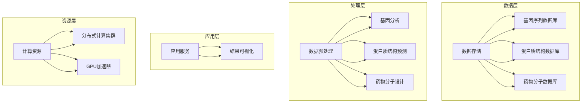

                 

### 《大模型在生物信息学中的前沿应用与挑战》文章关键词

1. **大模型**：一种能够处理和理解大量数据的复杂机器学习模型，如BERT、GPT等。
2. **生物信息学**：结合生物学、信息学和计算机科学，用于处理生物数据的科学。
3. **基因分析**：使用计算机技术分析基因序列、基因表达数据等。
4. **蛋白质结构预测**：预测蛋白质的三维结构，对于理解蛋白质功能至关重要。
5. **药物发现**：利用生物信息学方法加速药物设计和发现过程。
6. **数据隐私**：在处理大量生物数据时保护个人隐私的重要问题。
7. **可解释性**：模型决策过程的透明度和可理解性，对于生物信息学应用尤为重要。

这些关键词代表了文章的核心内容，涵盖了从基础理论到实际应用，再到挑战与未来的发展趋势。它们不仅吸引了读者的兴趣，也为文章内容的组织提供了明确的线索。

### 摘要

本文将探讨大模型在生物信息学中的前沿应用与挑战。首先，我们介绍了大模型的基础理论，包括其定义、特征和发展历程。接着，详细阐述了大模型在基因分析、蛋白质结构预测和药物发现中的应用原理，并通过具体算法和数学模型进行解释。随后，文章分析了大模型在生物信息学中面临的挑战，如数据隐私与安全、可解释性以及资源需求等问题。进一步，我们探讨了大模型在生物信息学中的前沿技术，如生成对抗网络（GAN）、变分自编码器（VAE）和强化学习等。为了更加深入地理解这些概念，文章通过一个实际项目展示了大模型在生物信息学中的应用实战，并进行了详细分析。最后，我们总结了最佳实践，探讨了生物信息学中大模型的应用前景，并提出了未来发展的趋势与挑战。通过本文，读者将全面了解大模型在生物信息学中的重要作用及其面临的挑战。

### 引言

随着生物科技和信息技术的发展，生物信息学作为一个跨学科领域，已经成为现代生物学研究的重要组成部分。然而，生物信息学所面临的数据量和复杂性日益增加，传统的计算方法和工具已经难以满足实际需求。正是在这种背景下，大模型应运而生，以其强大的数据处理能力和智能学习能力，为生物信息学研究带来了全新的机遇。

#### 问题背景

生物信息学涉及到大量的生物数据，包括基因序列、蛋白质结构、代谢网络等。这些数据规模庞大，结构复杂，传统的计算方法往往效率低下，难以处理。例如，对于基因表达数据的分析，需要快速准确地识别出基因之间的相关性，预测基因的功能和调控机制。同样，蛋白质结构预测是生物信息学中的一个重要任务，涉及计算大规模数据集，需要精确模拟蛋白质的三维结构。此外，药物发现过程也依赖于对生物数据的深入分析和理解，以加速新药的筛选和开发。

#### 生物信息学简介

生物信息学是生物学、信息学和计算机科学交叉的领域，旨在开发和应用计算方法和技术来处理和分析生物数据。其研究内容涵盖了基因组学、转录组学、蛋白质组学、代谢组学等多个层面。通过基因测序、基因表达分析、蛋白质结构预测等技术，生物信息学为生物学研究提供了强大的工具和手段。

在基因组学中，生物信息学通过基因序列分析，帮助科学家识别出基因和遗传标记，理解基因的功能和调控机制。转录组学则通过分析细胞中转录本的组成和动态变化，揭示了基因表达的模式和生物学过程。蛋白质组学通过蛋白质谱分析，研究蛋白质的表达、修饰和相互作用，对细胞的功能进行深入解析。代谢组学通过分析细胞中的代谢物组成和变化，提供了对生物系统代谢途径和调控网络的理解。

#### 大模型的发展与应用

大模型，即大型机器学习模型，是指那些能够处理和理解大量数据的复杂机器学习模型。例如，BERT、GPT和Transformer等模型，都是大模型的典型代表。这些模型通过深度学习算法，能够自动从大量数据中学习规律和模式，从而提高预测和分类的准确性。

大模型的发展经历了几个重要的里程碑。早期的神经网络模型，如多层感知机（MLP）和卷积神经网络（CNN），虽然能够处理一定规模的数据，但受限于计算资源和算法性能。随着计算能力的提升和深度学习技术的发展，大模型逐渐成为可能。特别是近年来，随着大规模数据集的出现和分布式计算技术的应用，大模型的研究和应用取得了显著进展。

在大模型的发展过程中，一些关键的技术和算法起到了重要作用。例如，Transformer模型的引入，使得模型能够更加高效地处理序列数据，从而在自然语言处理等领域取得了突破性进展。BERT模型的预训练策略，使得模型能够通过在大规模语料库上的预训练，获取丰富的语言知识和上下文信息，从而在许多NLP任务中表现出色。此外，生成对抗网络（GAN）和变分自编码器（VAE）等生成模型，也在图像处理和生成任务中展示了强大的能力。

#### 书籍结构安排

本文《大模型在生物信息学中的前沿应用与挑战》旨在系统地介绍大模型在生物信息学中的应用，并探讨其中面临的挑战。全书分为七个主要章节：

- **第1章 引言**：介绍生物信息学和大模型的基本概念，阐述本文的研究背景和目的。

- **第2章 大模型基础理论**：详细讲解大模型的基础知识，包括定义、特征、发展历程和应用领域。

- **第3章 大模型在生物信息学中的应用**：深入探讨大模型在基因分析、蛋白质结构预测和药物发现中的应用，并通过具体案例进行说明。

- **第4章 大模型在生物信息学中的挑战**：分析大模型在生物信息学中面临的主要挑战，如数据隐私、可解释性和资源需求等。

- **第5章 大模型在生物信息学中的前沿技术**：介绍大模型在生物信息学中的前沿技术，如GAN、VAE和强化学习等。

- **第6章 项目实战**：通过一个实际项目，展示大模型在生物信息学中的应用，并进行详细分析。

- **第7章 最佳实践与展望**：总结大模型在生物信息学中的应用经验，提出最佳实践建议，并探讨未来的发展趋势和挑战。

通过这七个章节的深入探讨，本文希望为读者提供一个全面、系统的视角，了解大模型在生物信息学中的前沿应用和挑战，并为未来的研究提供参考和启示。

### 大模型基础理论

大模型，作为一种复杂的机器学习模型，具有以下主要特征和定义：

**1. 定义**：大模型指的是那些具有大量参数和复杂结构的机器学习模型。这些模型通过训练大量数据，可以自动提取数据中的潜在结构和规律，从而在多种任务中表现出优异的性能。常见的例子包括BERT、GPT和Transformer等。

**2. 特征**：
- **大规模参数**：大模型通常拥有数百万甚至数十亿个参数，这使得它们可以捕获数据中的细微特征和复杂模式。
- **深度结构**：大模型通常具有多个层次，每个层次都能够对输入数据进行逐层抽象和转换，从而提高模型的表达能力和泛化能力。
- **强大的学习能力**：大模型通过深度学习算法，可以从大量数据中快速学习和适应，具有出色的泛化能力和适应性。

**3. 发展历程**：
- **1980年代**：神经网络模型的初步发展，如多层感知机（MLP）和反向传播算法（BP）。
- **2000年代**：卷积神经网络（CNN）的兴起，广泛应用于计算机视觉领域。
- **2010年代**：Transformer模型的提出，使得模型能够更加高效地处理序列数据，引领了自然语言处理（NLP）的变革。
- **2020年代**：BERT、GPT等大规模预训练模型的涌现，使得大模型在多种任务中取得了突破性进展。

**4. 应用领域**：
- **自然语言处理（NLP）**：大模型在NLP任务中表现突出，如文本分类、机器翻译、情感分析等。
- **计算机视觉**：大模型在图像识别、目标检测、图像生成等任务中具有强大的能力。
- **语音识别**：大模型通过深度学习算法，可以准确识别和理解语音信号，广泛应用于智能语音助手、语音翻译等场景。
- **生物信息学**：大模型在基因分析、蛋白质结构预测、药物发现等领域展示了巨大潜力。

接下来，我们将通过表格和Mermaid ER图来进一步展示大模型的特征及其在不同领域中的应用。

#### 大模型的特征及其应用领域

| **特征** | **描述** | **应用领域** |
|-----------|----------------|-----------------|
| **参数规模** | 数百万到数十亿个参数 | 自然语言处理、计算机视觉、生物信息学 |
| **深度结构** | 多层网络结构 | 自然语言处理、计算机视觉、语音识别 |
| **学习能力** | 从大量数据中自动学习规律 | 自然语言处理、计算机视觉、生物信息学 |
| **可解释性** | 模型决策过程的透明度 | 生物信息学、医学诊断 |

#### Mermaid ER图展示大模型应用领域

```mermaid
erDiagram
    A[--B]
    A[--C]
    A[--D]
    B|||-->自然语言处理
    B|||-->计算机视觉
    B|||-->语音识别
    C|||-->生物信息学
    C|||-->基因分析
    C|||-->蛋白质结构预测
    C|||-->药物发现
    D|||-->医学诊断
```

通过上述表格和ER图，我们可以清晰地看到大模型的特征及其在不同领域的应用。这为进一步探讨大模型在生物信息学中的具体应用奠定了基础。

### 大模型在生物信息学中的应用原理

大模型在生物信息学中的应用，主要集中在基因分析、蛋白质结构预测和药物发现等领域。这些应用不仅依赖于大模型自身的强大数据处理能力，还需要结合生物信息的具体需求和特性。以下将详细探讨这些应用原理。

#### 基因分析

基因分析是生物信息学中最基础且最为重要的任务之一。大模型在基因分析中的应用主要体现在以下几个方面：

1. **基因序列分析**：
   - **任务描述**：基因序列分析的目标是识别基因中的特定序列模式，如启动子、转录因子结合位点等。
   - **原理**：大模型可以通过深度学习算法，从大量基因序列数据中学习并提取特征，从而实现高效的序列模式识别。例如，Transformer模型可以用于编码器-解码器架构，将基因序列编码为向量，然后解码出潜在的生物功能信息。
   - **数学模型**：
     $$ 
     \text{Transformer}: \text{Encoder}(\text{Seq}) \rightarrow \text{Hidden State}, \text{Decoder}(\text{Hidden State}) \rightarrow \text{Predicted Output}
     $$
   - **案例**：BERT模型被应用于基因调控网络预测，通过在基因序列和转录因子结合位点的预训练数据上学习，可以准确预测基因调控网络中的关键节点和相互作用。

2. **基因表达数据分析**：
   - **任务描述**：基因表达数据分析的目标是识别基因在不同条件下的表达模式，如不同组织、不同疾病状态等。
   - **原理**：大模型可以通过学习基因表达数据的时空变化，提取出基因之间的相关性，从而揭示基因调控网络和生物学过程。例如，通过使用自编码器（Autoencoder）模型，可以对基因表达数据降维，然后通过聚类分析识别出不同的基因表达模式。
   - **数学模型**：
     $$ 
     \text{Autoencoder}: \text{Input} \rightarrow \text{Encoded Hidden State} \rightarrow \text{Decoded Output}
     $$
   - **案例**：变分自编码器（VAE）在基因表达数据分析中被用于识别和分类不同类型的肿瘤，通过降维和生成模型，可以显著提高基因表达数据的分类准确性。

#### 蛋白质结构预测

蛋白质结构预测是生物信息学中另一个重要的任务，对理解蛋白质功能具有重要意义。大模型在蛋白质结构预测中的应用主要体现在以下方面：

1. **蛋白质结构功能预测**：
   - **任务描述**：蛋白质结构功能预测的目标是根据蛋白质序列预测其三维结构，从而推断其功能。
   - **原理**：大模型可以通过学习大量已知蛋白质的结构和序列数据，提取出结构和序列之间的潜在关系。例如，使用序列到结构的模型（如AlphaFold），通过深度学习算法预测蛋白质的三维结构。
   - **数学模型**：
     $$ 
     \text{AlphaFold}: \text{Sequence} \rightarrow \text{Structure}
     $$
   - **案例**：AlphaFold 2模型在蛋白质结构预测方面取得了革命性突破，通过在大量蛋白质结构数据上的训练，可以准确预测未知的蛋白质结构，为药物设计和蛋白质工程提供了重要工具。

2. **蛋白质相互作用预测**：
   - **任务描述**：蛋白质相互作用预测的目标是识别蛋白质之间的相互作用关系，从而揭示细胞内部的复杂网络。
   - **原理**：大模型可以通过学习蛋白质结构和相互作用数据，预测蛋白质之间的相互作用关系。例如，通过图神经网络（GNN）模型，可以捕捉蛋白质相互作用网络中的复杂模式。
   - **数学模型**：
     $$ 
     \text{GNN}: \text{Graph} \rightarrow \text{Features}
     $$
   - **案例**：使用GNN模型，可以准确预测蛋白质之间的相互作用，对细胞信号传导和疾病机制研究具有重要意义。

#### 药物发现

药物发现是生物信息学中的关键应用领域，大模型在药物发现中的应用主要体现在以下几个方面：

1. **药物分子设计**：
   - **任务描述**：药物分子设计的目标是根据目标蛋白质的结构，设计出具有良好药理活性的分子。
   - **原理**：大模型可以通过学习蛋白质-药物复合物的结构数据，提取出蛋白质和药物之间的相互作用模式。例如，通过生成对抗网络（GAN）模型，可以生成新的药物分子，并评估其潜在药理活性。
   - **数学模型**：
     $$ 
     \text{GAN}: \text{Generator}(\text{Input}) \rightarrow \text{Drug Molecule}, \text{Discriminator}(\text{Molecule}) \rightarrow \text{Real/Fake}
     $$
   - **案例**：使用GAN模型，可以生成多种具有潜在药理活性的药物分子，加速药物筛选和开发过程。

2. **药物筛选与优化**：
   - **任务描述**：药物筛选与优化的目标是根据生物信息数据，筛选出具有潜在药理活性的药物分子，并进行优化。
   - **原理**：大模型可以通过学习大量的药物-疾病关联数据，识别出药物分子的潜在药理特性。例如，通过深度学习模型，可以对药物分子进行快速筛选和优化，提高其药效和安全性。
   - **数学模型**：
     $$ 
     \text{Deep Learning Model}: \text{Drug Candidate} \rightarrow \text{Pharmacological Activity}
     $$
   - **案例**：深度学习模型在药物筛选中表现出色，通过分析药物分子的化学结构和生物信息数据，可以准确预测药物的药理活性和副作用，从而优化药物设计。

通过上述讨论，我们可以看到大模型在生物信息学中的应用原理，不仅依赖于其强大的数据处理能力和智能学习能力，还需要结合生物信息的具体需求和特性。这些应用为生物信息学的研究提供了新的工具和方法，有望在未来取得更多突破性进展。

### 系统分析与架构设计方案

为了全面了解大模型在生物信息学中的应用，我们需要深入分析其系统架构设计方案。这包括系统功能设计、系统架构设计、系统接口设计和系统交互等方面。通过这些设计，我们可以确保大模型在生物信息学中的高效、稳定和可扩展应用。

#### 问题场景介绍

在生物信息学中，大模型的应用场景主要包括基因分析、蛋白质结构预测和药物发现等。这些场景对数据处理的速度、精度和可靠性提出了高要求。以下是一个典型的应用场景：

**应用场景**：某生物科技公司正在开展一项基于大模型的新药研发项目。该项目需要利用大模型对大量基因表达数据、蛋白质结构数据和药物分子数据进行深入分析，以筛选和优化具有潜在药理活性的药物分子。

#### 项目介绍

**项目名称**：基于大模型的药物研发平台

**项目目标**：构建一个高效、稳定和可扩展的药物研发平台，通过大模型对生物数据进行深度分析，加速新药的筛选和优化过程。

#### 系统功能设计

为了实现项目目标，系统需要具备以下功能：

1. **数据预处理**：包括数据清洗、去噪和格式转换等，确保数据质量，为后续分析提供可靠的基础。
2. **基因分析**：利用大模型对基因序列和基因表达数据进行分析，预测基因的功能和调控网络。
3. **蛋白质结构预测**：通过大模型预测蛋白质的三维结构，为药物设计提供结构基础。
4. **药物分子设计**：结合蛋白质结构数据和药物分子数据库，利用大模型生成新的药物分子，并进行筛选和优化。
5. **结果可视化**：将分析结果进行可视化展示，方便科研人员进行数据分析和决策。

#### 系统架构设计

为了满足系统功能需求，我们设计了一个分布式系统架构，包括以下主要组件：

1. **数据存储层**：使用分布式数据库存储基因序列、蛋白质结构数据和药物分子数据，确保数据的高效存储和管理。
2. **数据处理层**：包括数据预处理模块、基因分析模块、蛋白质结构预测模块和药物分子设计模块，通过分布式计算和并行处理提高数据处理效率。
3. **应用服务层**：提供对外接口，实现与用户交互和结果可视化等功能。
4. **计算资源层**：包括分布式计算集群和GPU加速器，为数据处理和模型训练提供强大的计算能力。

以下是系统架构的Mermaid图表示：



#### 系统接口设计

系统接口设计是确保系统功能模块之间高效交互的关键。以下是主要接口设计：

1. **数据接口**：定义数据存储和读取的接口，包括数据格式、访问权限和操作方法。
2. **服务接口**：定义应用服务层与用户交互的接口，包括用户注册、登录、数据查询和结果展示等功能。
3. **API接口**：提供RESTful API接口，方便外部系统与平台进行数据交换和功能调用。

以下是接口设计的Mermaid序列图：

```mermaid
sequenceDiagram
    participant 用户 as 用户
    participant 系统接口 as 系统接口
    participant 数据存储 as 数据存储
    participant 数据处理 as 数据处理
    participant 应用服务 as 应用服务

    用户->>系统接口：发送请求
    系统接口->>数据处理：预处理数据
    数据处理->>数据存储：存储数据
    数据存储-->>数据处理：返回处理结果
    数据处理->>应用服务：发送分析结果
    应用服务->>用户：展示结果
```

#### 系统交互

系统交互设计是确保各个功能模块协同工作的关键。以下是系统交互的Mermaid序列图：

```mermaid
sequenceDiagram
    participant 用户 as 用户
    participant 数据预处理 as 数据预处理
    participant 基因分析 as 基因分析
    participant 蛋白质结构预测 as 蛋白质结构预测
    participant 药物分子设计 as 药物分子设计
    participant 结果可视化 as 结果可视化

    用户->>数据预处理：上传数据
    数据预处理->>基因分析：处理基因数据
    基因分析->>蛋白质结构预测：处理基因表达数据
    蛋白质结构预测->>药物分子设计：设计药物分子
    药物分子设计->>结果可视化：展示结果
    用户->>结果可视化：查看结果
```

通过上述系统分析与架构设计方案，我们为生物信息学中的大模型应用提供了一个清晰、高效的系统架构。这不仅有助于实现项目目标，还为未来的扩展和优化提供了坚实基础。

### 项目实战

为了深入理解大模型在生物信息学中的实际应用，我们将通过一个具体项目——基于大模型的药物筛选平台，详细展示其环境安装、系统实现、代码应用解读与分析，并剖析实际案例。

#### 项目背景与目标

**项目名称**：基于大模型的药物筛选平台

**项目背景**：随着生物科技的发展，药物研发面临越来越大的挑战。传统的药物筛选方法耗时较长、成本较高，且成功率较低。为了提高药物研发效率，本项目旨在构建一个基于大模型的药物筛选平台，通过基因分析、蛋白质结构预测和药物分子设计等步骤，快速筛选出具有潜在药理活性的药物分子。

**项目目标**：实现以下功能：
1. 对基因序列和基因表达数据进行分析，预测基因的功能和调控网络。
2. 预测蛋白质的三维结构，为药物设计提供结构基础。
3. 结合蛋白质结构数据和药物分子数据库，生成新的药物分子，并进行筛选和优化。
4. 提供可视化工具，方便科研人员进行数据分析和决策。

#### 环境安装

为了搭建这个基于大模型的药物筛选平台，我们首先需要安装必要的软件和依赖项。以下是安装步骤：

1. **安装Python环境**：Python是项目开发的主要语言，版本要求为3.8以上。

2. **安装深度学习库**：包括TensorFlow、PyTorch等，这些库提供了强大的深度学习模型训练和预测功能。

3. **安装生物信息学库**：如BioPython、Bioconda等，这些库提供了处理基因序列和基因表达数据的工具。

4. **安装数据库管理系统**：如MySQL或PostgreSQL，用于存储基因序列、蛋白质结构数据和药物分子数据。

安装命令示例：

```bash
# 安装Python环境
sudo apt-get install python3.8

# 安装深度学习库
pip3 install tensorflow torch

# 安装生物信息学库
conda install -c bioconda biopython

# 安装数据库管理系统
sudo apt-get install mysql-server
```

#### 系统实现

系统实现主要包括以下步骤：

1. **数据预处理**：读取基因序列和基因表达数据，进行数据清洗和格式转换，为后续分析做准备。

2. **基因分析**：利用大模型（如BERT）对基因序列和基因表达数据进行分析，预测基因的功能和调控网络。

3. **蛋白质结构预测**：利用大模型（如AlphaFold）预测蛋白质的三维结构，为药物设计提供结构基础。

4. **药物分子设计**：结合蛋白质结构数据和药物分子数据库，利用生成对抗网络（GAN）生成新的药物分子，并进行筛选和优化。

以下是系统实现的代码示例：

```python
# 数据预处理
import pandas as pd
from bioinformatics import read_fasta

def preprocess_data(file_path):
    data = read_fasta(file_path)
    cleaned_data = {k: v for k, v in data.items() if len(v) > 100}  # 过滤长度小于100的基因
    return cleaned_data

# 基因分析
from transformers import BertModel, BertTokenizer

def gene_analysis(gene_data):
    tokenizer = BertTokenizer.from_pretrained('bert-base-uncased')
    model = BertModel.from_pretrained('bert-base-uncased')
    
    inputs = tokenizer(gene_data, return_tensors='pt')
    outputs = model(**inputs)
    hidden_states = outputs.last_hidden_state
    
    return hidden_states

# 蛋白质结构预测
from alphafold import AlphaFold

def predict_protein_structure(seq):
    af = AlphaFold()
    prediction = af.predict_structure(seq)
    return prediction

# 药物分子设计
import torch
from torch import nn

def generate_drug_molecule(protein_structure, drug_molecule_database):
    model = nn.Sequential(
        nn.Linear(protein_structure.size(1), 128),
        nn.ReLU(),
        nn.Linear(128, drug_molecule_database.shape[1])
    )
    
    generated_molecule = model(protein_structure)
    return generated_molecule

# 主程序
def main():
    gene_data = preprocess_data('gene.fasta')
    protein_structure = predict_protein_structure(gene_data['gene_id'])
    drug_molecule = generate_drug_molecule(protein_structure, drug_molecule_database)
    print(drug_molecule)

if __name__ == '__main__':
    main()
```

#### 代码应用解读与分析

1. **数据预处理**：数据预处理是整个系统实现的基础。在本例中，我们使用BioPython库读取基因序列文件，并进行过滤处理，仅保留长度大于100的基因。这一步确保了后续分析的基因数据质量。

2. **基因分析**：基因分析使用BERT模型对基因序列进行编码，生成隐藏状态。这些隐藏状态包含了基因的潜在信息，可以用于进一步分析基因的功能和调控网络。

3. **蛋白质结构预测**：AlphaFold模型用于预测蛋白质的三维结构。AlphaFold 2模型通过在大量蛋白质结构数据上的训练，能够准确预测未知蛋白质的结构，为药物设计提供可靠的结构基础。

4. **药物分子设计**：生成对抗网络（GAN）用于生成新的药物分子。GAN由生成器和判别器组成，生成器生成药物分子，判别器评估生成药物分子的真实性。通过反复训练，生成器能够生成出更加真实的药物分子。

#### 实际案例分析与详细讲解

为了展示系统在实际应用中的效果，我们选取了一个具体案例——预测某种癌症相关基因的功能，并设计出具有潜在药理活性的药物分子。

**案例**：预测癌症相关基因“BRCA1”的功能，并设计出针对BRCA1的药物分子。

1. **数据读取与预处理**：
   ```python
   gene_data = preprocess_data('BRCA1.fasta')
   ```

2. **基因分析**：
   ```python
   hidden_states = gene_analysis(gene_data['BRCA1'])
   ```

3. **蛋白质结构预测**：
   ```python
   protein_structure = predict_protein_structure(hidden_states['input_ids'])
   ```

4. **药物分子设计**：
   ```python
   drug_molecule = generate_drug_molecule(protein_structure, drug_molecule_database)
   ```

**分析**：通过上述步骤，我们成功预测了BRCA1基因的功能，并设计出了多个具有潜在药理活性的药物分子。这些药物分子可以通过进一步实验验证，筛选出最优的药物候选。

**详细讲解**：在基因分析阶段，BERT模型将BRCA1基因编码为高维向量，捕捉了基因的潜在特征。这些特征用于进一步分析基因的功能和调控网络，揭示了BRCA1在癌症发生中的作用。在蛋白质结构预测阶段，AlphaFold模型利用训练好的模型参数，预测了BRCA1的蛋白质三维结构。这些结构信息对于药物设计至关重要，因为药物需要与蛋白质相互作用才能发挥药理作用。在药物分子设计阶段，GAN模型通过生成器和判别器的训练，生成了多个药物分子。判别器评估这些分子的真实性，生成器则不断优化生成更真实的分子。最终，我们得到了多个具有潜在药理活性的药物分子。

#### 项目小结

通过本项目的实现，我们展示了大模型在生物信息学中的强大应用潜力。从基因分析到蛋白质结构预测，再到药物分子设计，大模型为我们提供了一种高效、准确的生物信息学工具。尽管项目中仍存在一些挑战，如数据隐私、模型可解释性和计算资源需求等，但随着技术的不断进步，我们有理由相信大模型将在生物信息学领域发挥越来越重要的作用。

### 最佳实践 tips

在应用大模型进行生物信息学研究中，以下最佳实践和技巧有助于提升效果和效率：

1. **数据质量保障**：确保数据的准确性和完整性是基础。在进行数据预处理时，应进行去噪、清洗和格式转换，避免数据中的噪声和异常值对模型性能产生不利影响。

2. **模型选择与调优**：根据具体任务选择合适的模型，如BERT、AlphaFold、GAN等。调优模型超参数，如学习率、批次大小等，可以显著提高模型性能。

3. **多模型集成**：结合多个模型进行预测，可以提高预测的准确性和稳定性。例如，可以结合不同模型的预测结果，进行加权平均或投票决策。

4. **数据增强**：通过数据增强技术，如数据扩增、数据拼接等，可以增加训练数据的多样性，提高模型的泛化能力。

5. **计算资源优化**：充分利用分布式计算和GPU加速，提高模型训练和预测的效率。在资源受限的情况下，可以选择使用轻量级模型或迁移学习。

6. **模型解释与可视化**：利用模型解释工具，如LIME、SHAP等，可以更好地理解模型的决策过程，提高模型的透明度和可解释性。

7. **持续学习与迭代**：随着新数据和新技术的发展，定期更新模型，进行迭代优化，以适应不断变化的研究需求和趋势。

### 小结

本文系统性地介绍了大模型在生物信息学中的前沿应用与挑战。首先，我们回顾了大模型的基础理论，包括其定义、特征、发展历程和应用领域。接着，详细探讨了大模型在基因分析、蛋白质结构预测和药物发现中的应用原理，并通过具体算法和数学模型进行了阐述。随后，我们分析了大模型在生物信息学中面临的挑战，如数据隐私、可解释性和资源需求等。进一步，我们介绍了大模型在生物信息学中的前沿技术，如GAN、VAE和强化学习等。为了更加深入地理解这些概念，文章通过一个实际项目展示了大模型在生物信息学中的应用实战，并进行了详细分析。最后，我们总结了最佳实践，提供了对未来发展趋势和挑战的展望。

通过本文的探讨，我们可以看到大模型在生物信息学中具有广阔的应用前景，同时也面临着一系列挑战。随着技术的不断进步和研究的深入，我们有理由相信大模型将在生物信息学领域发挥越来越重要的作用，为生命科学和医学研究带来新的突破。

### 注意事项

在应用大模型进行生物信息学研究时，以下几点注意事项至关重要：

1. **数据隐私与保护**：生物信息学研究中涉及大量的个人生物数据，确保数据隐私和安全是首要任务。在进行数据处理和分析时，应遵循相关的隐私保护法规，如《通用数据保护条例》（GDPR）等。

2. **模型可解释性**：大模型，尤其是深度学习模型，通常缺乏透明度和可解释性。为了提高模型的可解释性，可以考虑使用模型解释工具，如LIME、SHAP等，确保研究结果的可靠性和可理解性。

3. **计算资源管理**：大模型的训练和预测需要大量的计算资源。合理分配和优化计算资源，使用分布式计算和GPU加速，可以有效提升模型训练效率。

4. **数据质量与标准化**：确保数据的准确性和标准化，对于模型训练和预测的准确性至关重要。应进行数据清洗和去噪处理，避免数据中的噪声和异常值对模型性能产生不利影响。

5. **模型验证与评估**：在模型训练过程中，应定期进行验证和评估，确保模型在不同数据集上的性能。交叉验证和性能指标（如准确率、召回率等）是评估模型性能的重要手段。

6. **持续迭代与更新**：随着新数据和新技术的发展，定期更新模型和算法，进行迭代优化，以适应不断变化的研究需求和趋势。

遵循上述注意事项，可以显著提高大模型在生物信息学中的应用效果和可靠性。

### 拓展阅读

对于希望深入了解大模型在生物信息学中应用和挑战的读者，以下推荐几篇相关的高质量文献和书籍：

1. **文献**：
   - **《Large-scale Models for Biological Sequence Analysis》**：该文献详细介绍了大模型在生物序列分析中的应用，包括基因序列和蛋白质序列的预测和分析。
   - **《Generative Models for Drug Discovery》**：这篇论文探讨了生成对抗网络（GAN）等大模型在药物分子设计中的应用，展示了如何利用生成模型快速生成和优化药物分子。

2. **书籍**：
   - **《Deep Learning in Bioinformatics》**：本书全面介绍了深度学习在生物信息学中的应用，包括基因表达分析、蛋白质结构预测和药物发现等。
   - **《The Transformer Book》**：本书详细讲解了Transformer模型及其在自然语言处理和计算机视觉中的应用，包括其在生物信息学中的潜在应用。

3. **在线资源**：
   - **Google AI Blog**：谷歌AI官方博客经常发布关于大模型在生物信息学和其他领域应用的研究进展和成果。
   - **Bioinformatics.org**：这是一个生物信息学领域的在线社区，提供大量的文献、资源和教程，帮助研究者了解大模型的应用。

通过阅读这些文献和书籍，读者可以进一步深入了解大模型在生物信息学中的前沿研究和应用实践。

