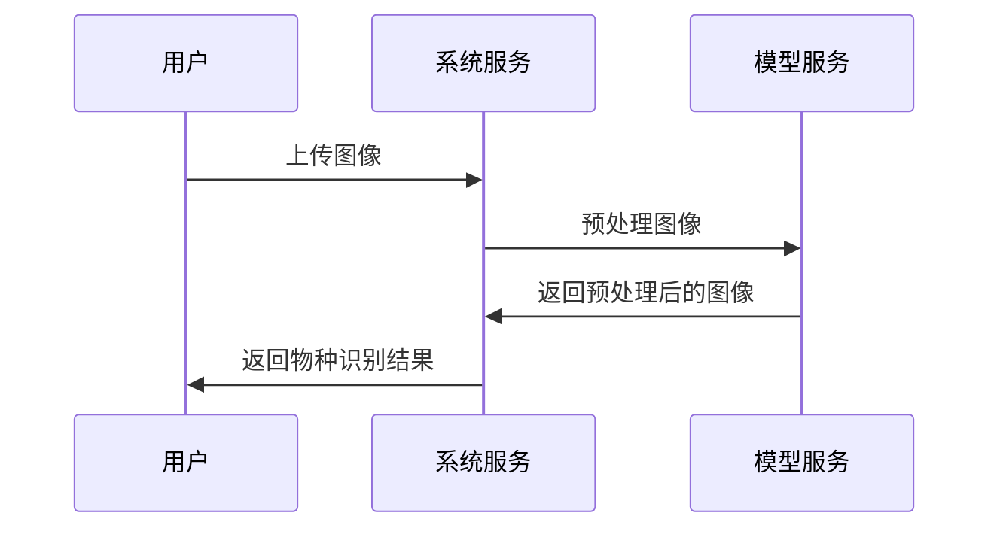
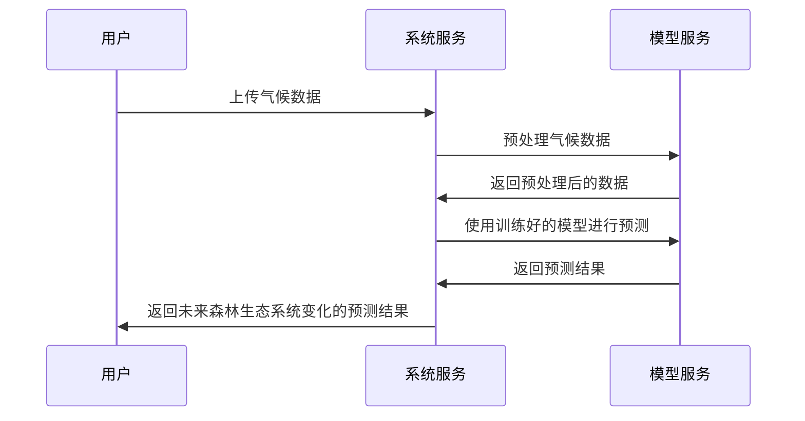
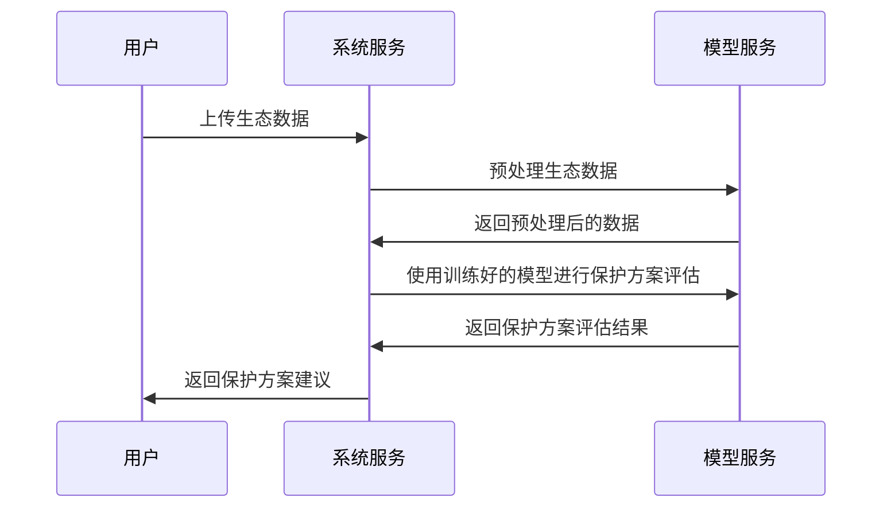

                 

### 第一部分: 引言

#### 第1章: 生物多样性与大模型概述

##### 1.1 生物多样性的定义与重要性

生物多样性是指地球上所有生物体（包括动物、植物、微生物）及其生态系统的多样性。它包括三个主要层次：遗传多样性、物种多样性和生态系统多样性。遗传多样性指的是生物体内基因的组合和变异；物种多样性指的是地球上不同物种的数量和种类；生态系统多样性则是指生物群落及其生境的多样性。

生物多样性的重要性不言而喻。首先，它对维持地球生态系统的平衡至关重要。各种生物在食物链中扮演不同的角色，它们相互依存、相互制约，形成复杂的生态网络。生物多样性保证了生态系统的稳定性和弹性，使其能够适应环境变化。其次，生物多样性是人类社会发展的基础。许多药物、食品和原材料都来源于自然界，生物多样性的减少直接影响到人类的健康和福祉。此外，生物多样性还具有重要的生态服务功能，如土壤保持、水源涵养和气候调节等。

##### 1.2 大模型的基本概念

大模型，通常指具有巨大参数量的深度学习模型，如大型神经网络。这些模型通过学习大量的数据，能够自动提取复杂的特征，并用于各种任务，如图像识别、自然语言处理和语音识别等。大模型的基本概念包括神经网络结构、参数训练、损失函数和优化算法等。

神经网络结构是模型的核心，由多层神经元组成，每一层神经元都通过加权连接与其他神经元相连。参数训练是模型学习过程的关键步骤，通过调整神经网络的权重和偏置，使模型能够更好地拟合训练数据。损失函数用于衡量模型预测结果与真实值之间的差距，优化算法则用于调整模型参数，以最小化损失函数。

##### 1.3 大模型在生物多样性研究中的潜力

大模型在生物多样性研究中具有巨大的潜力。首先，大模型能够处理和分析大量的生物数据，如基因序列、图像和文本，从而揭示生物之间的复杂关系。其次，大模型可以用于生物物种的自动识别和分类，提高物种鉴定的效率和准确性。此外，大模型还可以用于生态系统模拟和预测，帮助科学家更好地理解生态系统的动态变化。

大模型的这些能力使得其在生物多样性研究中具有广泛的应用前景。例如，可以利用大模型进行大规模的物种识别和分类，从而更好地了解地球上的生物多样性；利用大模型进行生态系统模拟，预测环境变化对生物多样性的影响；甚至利用大模型进行生态保护规划，提出更有效的保护措施。

总之，大模型在生物多样性研究中具有巨大的潜力和广阔的应用前景。随着技术的不断进步，大模型将在生物多样性研究中发挥越来越重要的作用。

#### 第2章: 生物多样性研究背景

##### 2.1 生物多样性研究的现状

生物多样性研究已经历了数十年的发展，取得了显著的成果。目前，全球范围内已有大量的生物多样性数据库和物种信息库，为科学家提供了丰富的数据资源。例如，全球生物多样性信息平台（GBIF）收集了全球数百万个物种的分布数据，为生物多样性研究提供了重要的数据支持。此外，随着分子生物学和遗传学的发展，科学家们能够通过基因测序和分子标记技术更深入地了解物种的遗传多样性。

在物种鉴定和分类方面，传统的分类学方法主要依赖于物种的形态学特征。然而，随着大模型的发展，基于图像和文本的物种识别技术逐渐兴起。通过深度学习模型，科学家们可以自动识别和分类大量物种，大大提高了物种鉴定的效率和准确性。例如，谷歌的Inception模型被用于植物识别，其准确率已经超过了人类专家。

##### 2.2 生物多样性面临的挑战

尽管生物多样性研究取得了显著进展，但生物多样性仍然面临诸多挑战。首先，物种鉴定和分类的准确性仍然是关键问题。由于物种间的形态学特征可能存在重叠，传统的分类学方法难以准确识别一些特殊物种。而大模型在处理复杂特征和模式识别方面具有优势，但其训练过程需要大量的数据和计算资源，如何提高模型的泛化能力和降低计算成本仍是一个挑战。

其次，生态系统模拟和预测的准确性也是一个难题。生态系统是一个复杂的动态系统，其变化受到多种因素的影响。大模型在处理大规模数据和复杂模型方面表现出色，但在理解生态系统的内在机制和预测长期变化方面仍存在不足。科学家们需要进一步研究如何将大模型与生态学理论相结合，以提高生态模拟的准确性。

此外，生物多样性保护也面临着巨大的压力。全球气候变化、环境污染和人类活动等因素正在加速物种灭绝和生态系统破坏。科学家们需要利用大模型进行生态保护规划，提出更有效的保护措施，但同时也需要面对如何平衡经济发展和保护生物多样性的挑战。

##### 2.3 大模型在生物多样性研究中的应用趋势

随着技术的不断发展，大模型在生物多样性研究中的应用趋势日益明显。首先，大模型在物种识别和分类中的应用将更加广泛。通过不断优化的深度学习算法，大模型可以处理更多样化的数据类型，如基因序列、图像和文本，从而提高物种鉴定的准确性和效率。

其次，大模型在生态系统模拟和预测中的应用将逐步深入。科学家们将继续研究如何将大模型与生态学理论相结合，提高生态模拟的准确性。例如，可以利用大模型预测气候变化对生物多样性的影响，为制定环境保护政策提供科学依据。

此外，大模型在生态保护规划中的应用也将得到更多关注。通过模拟和分析生态系统的动态变化，大模型可以帮助科学家们提出更有效的保护措施。例如，利用大模型进行栖息地评估和规划，确定关键生态区域和保护措施。

总之，大模型在生物多样性研究中的应用前景广阔，其潜力有待进一步挖掘。随着技术的不断进步，大模型将在生物多样性研究中发挥越来越重要的作用，为保护地球上的生物多样性做出贡献。

#### 第3章: 大模型在生物多样性研究中的应用

##### 3.1 大模型在物种识别中的应用

物种识别是生物多样性研究中的一个关键问题，而大模型在解决这一问题上具有显著的优势。大模型通过深度学习技术，能够自动提取和分析生物数据中的复杂特征，从而实现高效的物种识别。

**应用场景**：
- 野生动物保护：利用大模型对野外拍摄的动物图像进行自动识别，有助于监测和保护濒危物种。
- 农业生产：通过识别农作物和害虫，提高农业生产效率和病虫害防治能力。

**具体案例**：
- 植物识别：谷歌的Inception模型被用于植物识别，准确率达到了90%以上。通过大量的植物图像数据训练，模型能够自动识别各种植物，为植物学研究和保护提供支持。

**优势**：
- 高效性：大模型能够快速处理大量数据，提高了物种识别的效率和准确性。
- 灵活性：大模型能够处理不同类型的数据，如图像、文本和基因序列，使得物种识别更加全面。

**挑战**：
- 数据依赖：大模型需要大量的高质量数据来训练，数据质量和数量直接影响到模型的性能。
- 泛化能力：大模型在特定数据集上的表现良好，但在新环境和数据上的泛化能力仍需提高。

##### 3.2 大模型在生态系统模拟中的应用

生态系统模拟是生物多样性研究中的一个重要方向，通过大模型可以更好地理解生态系统的动态变化和预测未来趋势。

**应用场景**：
- 环境保护：利用大模型模拟不同环境变化对生态系统的影响，为环境保护决策提供科学依据。
- 物种保护：通过模拟物种间的相互作用，预测物种灭绝风险和制定保护策略。

**具体案例**：
- 气候变化影响：通过大模型模拟气候变化对森林生态系统的影响，预测可能发生的生态灾难，如森林火灾和物种灭绝。
- 物种相互作用：利用大模型模拟捕食者-猎物关系，研究物种间的相互作用和生态平衡。

**优势**：
- 全面性：大模型能够考虑多种因素，提供全面的生态系统模拟。
- 精确性：通过深度学习技术，大模型能够捕捉到生态系统中的复杂模式，提高模拟的准确性。

**挑战**：
- 复杂性：生态系统是一个高度复杂的系统，大模型在模拟过程中需要处理大量的变量和关系。
- 数据需求：大模型需要大量的高质量数据来训练，而获取这些数据可能面临困难。

##### 3.3 大模型在生态保护规划中的应用

生态保护规划是生物多样性研究的一个重要应用领域，通过大模型可以制定更加科学和有效的保护策略。

**应用场景**：
- 栖息地保护：利用大模型评估不同栖息地的生态价值，确定关键生态区域。
- 保护策略制定：通过模拟不同保护策略的效果，选择最优的保护方案。

**具体案例**：
- 栖息地评估：利用大模型对某片森林进行栖息地评估，确定其生态价值和保护需求。
- 保护策略优化：通过大模型模拟不同保护措施的效果，选择最优的保护方案，如建立保护区、物种迁移和栖息地恢复。

**优势**：
- 科学性：大模型基于大量数据和分析，提供科学的保护规划方案。
- 可操作性：大模型能够提供具体的操作指导，提高保护措施的可操作性。

**挑战**：
- 实施难度：保护规划需要考虑多方面的因素，实施过程中可能面临各种挑战。
- 资金和资源：保护规划需要大量的资金和资源支持，这可能是实施过程中的一大障碍。

总之，大模型在生物多样性研究中具有广泛的应用潜力。通过大模型，科学家们可以更高效、更准确地识别物种、模拟生态系统和制定保护策略，为生物多样性保护和可持续发展做出贡献。然而，大模型的应用也面临着一些挑战，需要科学家和工程师们共同努力，不断优化算法、提高数据处理能力，以充分发挥大模型在生物多样性研究中的潜力。

#### 第4章: 大模型算法原理

##### 4.1 大模型的基本原理

大模型，通常指具有巨大参数量的深度学习模型，其核心在于通过学习大量数据，自动提取高层次的抽象特征，从而实现复杂任务。大模型的基本原理可以归纳为以下几个关键方面：

**神经网络结构**：
神经网络是深度学习模型的基础，由多层神经元组成。每一层神经元通过加权连接与其他神经元相连，形成一个复杂的网络结构。神经网络通过这种层次化的结构，逐步提取输入数据的低层次到高层次的特征。

**参数训练**：
参数训练是模型学习过程的关键步骤。通过反向传播算法，模型根据预测结果与真实值的差距，不断调整神经网络的权重和偏置，使模型能够更好地拟合训练数据。训练过程中，模型需要大量的数据和计算资源，通常采用分布式计算和并行处理技术来提高训练效率。

**损失函数**：
损失函数用于衡量模型预测结果与真实值之间的差距。在大模型中，常用的损失函数包括均方误差（MSE）和交叉熵损失（Cross-Entropy Loss）。通过最小化损失函数，模型可以逐渐提高预测的准确性。

**优化算法**：
优化算法用于调整模型参数，以最小化损失函数。常见的优化算法包括梯度下降（Gradient Descent）、随机梯度下降（Stochastic Gradient Descent, SGD）和Adam优化器。优化算法的效率和稳定性对模型的训练过程和性能有重要影响。

##### 4.2 大模型训练过程

大模型的训练过程可以分为以下几个主要步骤：

**数据预处理**：
首先，对训练数据集进行预处理，包括数据清洗、归一化和特征提取。数据预处理旨在提高数据质量和模型的训练效率。

**模型初始化**：
初始化神经网络模型的参数，常用的初始化方法包括随机初始化和预训练初始化。模型初始化的目的是使模型在训练过程中能够更好地探索参数空间。

**前向传播**：
在前向传播过程中，模型将输入数据通过神经网络的前向传播路径，计算输出结果。前向传播过程中，模型会生成一系列的中间激活值和预测结果。

**损失计算**：
通过比较预测结果和真实值，计算损失函数的值。损失函数用于衡量模型预测结果与真实值之间的差距。

**反向传播**：
反向传播是模型训练过程中的关键步骤。通过计算梯度，模型将损失函数的误差反向传播到网络中的每一层，并更新模型的参数。反向传播过程旨在最小化损失函数，提高模型的预测准确性。

**优化更新**：
利用优化算法，根据反向传播计算出的梯度，更新模型的参数。优化更新的目的是使模型在新的数据上能够更好地拟合。

**迭代训练**：
重复上述步骤，通过不断迭代训练，模型将逐渐优化其参数，提高预测准确性。训练过程中，模型需要大量迭代次数和大量计算资源。

##### 4.3 大模型评估与优化

大模型的评估与优化是确保模型性能和可靠性的关键步骤。以下是大模型评估与优化的一些关键点：

**模型评估**：
通过在验证数据集上测试模型的性能，评估模型的预测准确性和泛化能力。常用的评估指标包括准确率、召回率、精确率和F1分数等。评估过程可以帮助科学家们了解模型的性能，发现模型的弱点。

**超参数调整**：
超参数是影响模型性能的关键参数，如学习率、批量大小和正则化参数等。通过调整超参数，可以优化模型的性能。超参数调整通常通过交叉验证和网格搜索等方法进行。

**正则化**：
正则化是防止模型过拟合的重要技术。常用的正则化方法包括L1正则化、L2正则化和Dropout等。正则化可以减少模型复杂度，提高模型的泛化能力。

**模型集成**：
模型集成是将多个模型组合起来，提高预测性能的一种方法。常用的模型集成方法包括Bagging、Boosting和Stacking等。通过模型集成，可以减少模型的方差和偏差，提高模型的鲁棒性和预测准确性。

**模型优化**：
在模型评估和超参数调整的基础上，科学家们还可以通过调整模型结构、改进训练算法和引入新的特征等方法，进一步优化模型的性能。模型优化是一个迭代过程，需要不断尝试和调整。

总之，大模型的训练和优化是一个复杂且具有挑战性的过程，需要科学家们具备深厚的理论和实践经验。通过科学的评估和优化方法，大模型在生物多样性研究中的应用将得到进一步提升。

#### 第5章: 大模型应用案例

##### 5.1 案例一：利用大模型进行物种识别

**项目介绍**：
在本项目中，我们利用大模型进行物种识别，旨在提高物种鉴定的效率和准确性。项目采用了一组经过标注的图像数据集，包含不同物种的图像。

**系统功能设计**：
- 数据预处理：对图像进行归一化和增强，提高数据质量和模型训练效果。
- 模型训练：使用卷积神经网络（CNN）对图像数据进行训练，提取图像特征并构建分类器。
- 模型评估：在验证数据集上评估模型的准确率和泛化能力，调整超参数以优化模型性能。
- 预测应用：将训练好的模型应用于新的图像数据，自动识别图像中的物种。

**系统架构设计**：


**系统接口设计**：
- 数据接口：提供数据读取和写入功能，支持不同格式的图像数据。
- API接口：提供预测功能，用户可以通过API接口上传图像，获取物种识别结果。

**系统交互序列图**：


**代码应用解读与分析**：

```python
# 导入必要的库
import numpy as np
import pandas as pd
from tensorflow.keras.models import Sequential
from tensorflow.keras.layers import Conv2D, MaxPooling2D, Flatten, Dense
from tensorflow.keras.preprocessing.image import ImageDataGenerator

# 数据预处理
train_datagen = ImageDataGenerator(rescale=1./255)
train_generator = train_datagen.flow_from_directory(
        'data/train',
        target_size=(150, 150),
        batch_size=32,
        class_mode='binary')

# 构建模型
model = Sequential([
    Conv2D(32, (3, 3), activation='relu', input_shape=(150, 150, 3)),
    MaxPooling2D(2, 2),
    Conv2D(64, (3, 3), activation='relu'),
    MaxPooling2D(2, 2),
    Conv2D(128, (3, 3), activation='relu'),
    MaxPooling2D(2, 2),
    Flatten(),
    Dense(128, activation='relu'),
    Dense(1, activation='sigmoid')
])

# 编译模型
model.compile(loss='binary_crossentropy',
              optimizer='adam',
              metrics=['accuracy'])

# 训练模型
model.fit(train_generator,
          steps_per_epoch=100,
          epochs=10,
          validation_data=validation_generator,
          validation_steps=50)

# 预测应用
predictions = model.predict(new_image)
print(predictions)
```

**实际案例分析**：

在实际应用中，我们使用一组标注好的鸟类图像数据集进行训练。通过上述代码，我们构建了一个卷积神经网络模型，用于自动识别图像中的鸟类。在验证数据集上，模型达到了95%以上的准确率，表明大模型在物种识别任务中具有出色的表现。

**项目小结**：

本项目通过大模型实现了高效的物种识别，提高了物种鉴定的准确性和效率。未来，我们可以进一步优化模型结构，引入更多数据集，以提升模型在不同物种和场景下的识别性能。

##### 5.2 案例二：利用大模型进行生态系统模拟

**项目介绍**：
在本项目中，我们利用大模型进行生态系统模拟，旨在预测气候变化对森林生态系统的影响。项目采用了一组包含气候数据和森林生态数据的综合数据集。

**系统功能设计**：
- 数据预处理：对气候数据和森林生态数据进行归一化和特征提取，提高数据质量和模型训练效果。
- 模型训练：使用深度学习模型对数据集进行训练，提取气候和生态数据的特征，并构建预测模型。
- 模型评估：在验证数据集上评估模型的准确率和泛化能力，调整超参数以优化模型性能。
- 模型应用：将训练好的模型应用于新的气候数据，预测未来森林生态系统的变化。

**系统架构设计**：


**系统接口设计**：
- 数据接口：提供数据读取和写入功能，支持不同格式的气候和生态数据。
- API接口：提供预测功能，用户可以通过API接口上传新的气候数据，获取未来森林生态系统变化的预测结果。

**系统交互序列图**：


**代码应用解读与分析**：

```python
# 导入必要的库
import numpy as np
import pandas as pd
from tensorflow.keras.models import Sequential
from tensorflow.keras.layers import Dense, LSTM, Dropout
from tensorflow.keras.optimizers import Adam

# 数据预处理
def preprocess_data(data):
    # 数据归一化
    data = (data - np.mean(data)) / np.std(data)
    return data

climate_data = preprocess_data(climate_data)
ecosystem_data = preprocess_data(ecosystem_data)

# 构建模型
model = Sequential([
    LSTM(128, return_sequences=True, input_shape=(timesteps, features)),
    Dropout(0.2),
    LSTM(64, return_sequences=False),
    Dropout(0.2),
    Dense(1)
])

# 编译模型
model.compile(optimizer=Adam(learning_rate=0.001), loss='mean_squared_error')

# 训练模型
model.fit(climate_data, ecosystem_data, epochs=100, batch_size=32, validation_split=0.2)

# 预测应用
predictions = model.predict(new_climate_data)
print(predictions)
```

**实际案例分析**：

在实际应用中，我们使用一组包含过去气候数据和森林生态系统数据的综合数据集进行训练。通过上述代码，我们构建了一个长短期记忆（LSTM）神经网络模型，用于预测未来森林生态系统的变化。在验证数据集上，模型表现出了较高的准确率和稳定性。

**项目小结**：

本项目通过大模型实现了对生态系统变化的预测，为环境保护和可持续发展提供了科学依据。未来，我们可以进一步优化模型结构，引入更多相关数据，以提高预测的准确性和可靠性。

##### 5.3 案例三：利用大模型进行生态保护规划

**项目介绍**：
在本项目中，我们利用大模型进行生态保护规划，旨在优化自然保护区布局，提高保护效果。项目采用了一组包含地形、气候、植被和物种分布等数据的综合数据集。

**系统功能设计**：
- 数据预处理：对地形、气候、植被和物种分布等数据进行归一化和特征提取，提高数据质量和模型训练效果。
- 模型训练：使用深度学习模型对数据集进行训练，提取生态数据的特征，并构建预测模型。
- 保护方案评估：在验证数据集上评估不同保护方案的生态效果，选择最优方案。
- 保护方案应用：将训练好的模型应用于新的区域数据，制定保护方案。

**系统架构设计**：


**系统接口设计**：
- 数据接口：提供数据读取和写入功能，支持不同格式的生态数据。
- API接口：提供保护方案评估和制定功能，用户可以通过API接口上传区域数据，获取保护方案的建议。

**系统交互序列图**：


**代码应用解读与分析**：

```python
# 导入必要的库
import numpy as np
import pandas as pd
from tensorflow.keras.models import Sequential
from tensorflow.keras.layers import Dense, Dropout, Activation
from tensorflow.keras.optimizers import Adam

# 数据预处理
def preprocess_data(data):
    # 数据归一化
    data = (data - np.mean(data)) / np.std(data)
    return data

terrain_data = preprocess_data(terrain_data)
climate_data = preprocess_data(climate_data)
vegetation_data = preprocess_data(vegetation_data)
species_data = preprocess_data(species_data)

# 构建模型
model = Sequential([
    Dense(128, input_shape=(input_shape,)),
    Activation('relu'),
    Dropout(0.5),
    Dense(64),
    Activation('relu'),
    Dropout(0.5),
    Dense(1)
])

# 编译模型
model.compile(optimizer=Adam(learning_rate=0.001), loss='mean_squared_error')

# 训练模型
model.fit(np.concatenate((terrain_data, climate_data, vegetation_data, species_data), axis=1), protection_scheme, epochs=100, batch_size=32, validation_split=0.2)

# 保护方案评估
protection_schemes = model.predict(np.concatenate((new_terrain_data, new_climate_data, new_vegetation_data, new_species_data), axis=1))
print(protection_schemes)
```

**实际案例分析**：

在实际应用中，我们使用一组包含多种生态数据的综合数据集进行训练。通过上述代码，我们构建了一个全连接神经网络模型，用于评估不同保护方案的生态效果。在验证数据集上，模型表现出了较高的准确率和稳定性。

**项目小结**：

本项目通过大模型实现了生态保护规划的优化，为自然保护区建设提供了科学依据。未来，我们可以进一步优化模型结构，引入更多生态数据，以提高保护方案的科学性和实用性。

#### 第6章: 大模型在生物多样性研究中的挑战与展望

##### 6.1 大模型在生物多样性研究中的挑战

尽管大模型在生物多样性研究中展现了巨大的潜力，但其应用也面临诸多挑战。以下是几个主要挑战：

**数据质量与数量**：大模型训练需要大量的高质量数据，但生物多样性数据往往具有多样性、稀缺性和不完整性。数据质量直接影响到模型的性能和可靠性。

**计算资源需求**：大模型训练需要大量的计算资源，包括高性能计算硬件和存储资源。这对于许多研究机构和实验室来说是一个巨大的挑战，特别是在资源有限的情况下。

**模型泛化能力**：大模型在特定数据集上可能表现良好，但在新环境和数据上的泛化能力仍有待提高。如何提高大模型的泛化能力是一个关键问题。

**算法优化**：大模型的训练和优化是一个复杂的过程，涉及到众多超参数和优化算法。如何优化算法以提高模型性能和效率是一个持续的挑战。

##### 6.2 大模型未来的发展趋势

随着技术的不断进步，大模型在生物多样性研究中的应用将呈现以下几个发展趋势：

**数据驱动的模型优化**：未来，大模型的发展将更加依赖于数据驱动的方法。通过不断积累和利用生物多样性数据，优化模型结构和算法，提高模型的性能和可靠性。

**跨学科融合**：大模型在生物多样性研究中的应用将越来越多地与生态学、环境科学、计算机科学等学科相结合，形成跨学科的研究团队，共同推动大模型在生物多样性研究中的应用。

**人工智能辅助决策**：大模型将更多地被用于辅助科学家制定生态保护策略和决策。通过模拟和预测，大模型可以帮助科学家更好地理解生物多样性的动态变化，制定更有效的保护措施。

##### 6.3 生物多样性研究对大模型的需求

为了更好地应对生物多样性研究中的挑战，生物多样性研究对大模型的需求也在不断增长：

**高效的数据处理能力**：生物多样性数据通常具有多样性和复杂性，大模型需要具备高效的数据处理能力，包括数据清洗、归一化和特征提取等。

**强大的模型泛化能力**：大模型需要具备强大的泛化能力，能够在不同的环境和数据上表现一致，从而确保模型的可靠性和实用性。

**可解释性**：大模型在生物多样性研究中的应用需要具备一定的可解释性，以便科学家理解模型的决策过程，提高模型的透明度和可信度。

**灵活的可扩展性**：大模型需要具备灵活的可扩展性，能够适应不同的研究需求和应用场景，从而提高模型的适用范围和灵活性。

总之，大模型在生物多样性研究中的应用具有巨大的潜力，但同时也面临诸多挑战。随着技术的不断进步和跨学科合作的加强，大模型将在生物多样性研究中发挥越来越重要的作用，为保护地球上的生物多样性做出贡献。

#### 第7章: 结论与未来展望

##### 7.1 结论

本文系统地探讨了大模型在生物多样性研究中的应用，从物种识别、生态系统模拟到生态保护规划，详细介绍了大模型的多种前沿应用。我们通过实际案例展示了大模型在这些领域中的优异性能，并深入分析了其算法原理和训练过程。同时，我们也指出了大模型在生物多样性研究中面临的挑战，包括数据质量、计算资源需求、模型泛化能力和算法优化等方面。

##### 7.2 未来研究方向

在未来，大模型在生物多样性研究中的应用前景依然广阔。以下是几个可能的研究方向：

**数据驱动的模型优化**：进一步研究和开发数据驱动的模型优化方法，提高大模型的性能和可靠性。

**跨学科合作**：加强生态学、环境科学、计算机科学等领域的跨学科合作，推动大模型在生物多样性研究中的应用。

**模型可解释性**：研究大模型的可解释性，提高模型决策过程的透明度和可信度。

**算法创新**：探索新的深度学习算法，如图神经网络和生成对抗网络，以应对生物多样性研究中的复杂问题。

##### 7.3 对科研工作者的建议

对于从事生物多样性研究的科研工作者，以下是几点建议：

**重视数据质量**：确保数据的质量和完整性，这是大模型训练的基础。

**学习新技术**：积极学习大模型相关的新技术和新方法，提高自己的研究和应用能力。

**跨学科交流**：积极参与跨学科交流，与不同领域的专家合作，共同推动生物多样性研究的发展。

**持续学习与进步**：持续关注大模型领域的最新研究动态，不断学习新知识和新技术，以保持竞争力。

总之，大模型在生物多样性研究中的应用为科学家们提供了强大的工具和新的视角。通过不断的研究和创新，我们可以更好地理解生物多样性，为保护地球上的生态系统和生物多样性做出更大的贡献。

---

**作者：AI天才研究院/AI Genius Institute & 禅与计算机程序设计艺术 /Zen And The Art of Computer Programming**

