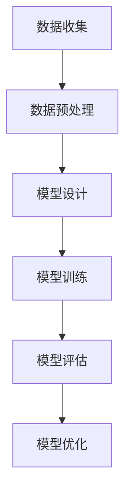
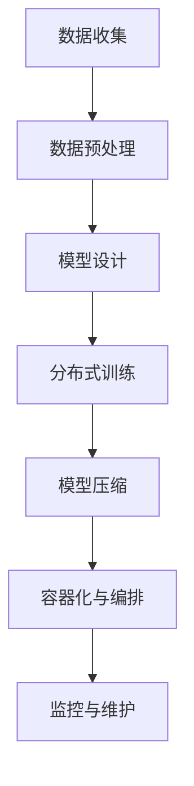
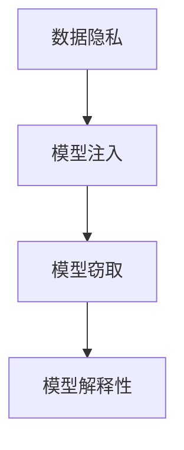

                 

### 关键词

- 大模型
- 网络安全
- 智能防御
- 入侵检测
- 恶意代码识别
- 威胁情报分析
- 实现与优化

### 摘要

本文旨在探讨大模型在网络安全智能防御中的应用前景。随着大数据和人工智能技术的发展，大模型在网络安全领域的应用越来越广泛，为智能防御提供了强大的工具。本文首先介绍了大模型的基础知识，然后详细分析了大模型在入侵检测、恶意代码识别和威胁情报分析等网络安全应用中的具体实现和效果，接着探讨了如何实现和优化大模型以提升网络安全智能防御能力，最后对未来大模型在网络安全中的应用进行了展望，提出了面临的挑战和解决方案。

### 引言与背景

#### 网络安全的重要性

网络安全是现代社会发展的基石，它关系到国家安全、社会稳定和经济发展。随着互联网的普及和信息技术的发展，网络攻击手段日益多样化、复杂化，传统的防御方法已难以应对新型网络威胁。网络安全面临着前所未有的挑战，包括数据泄露、网络入侵、恶意代码传播、拒绝服务攻击等。为了应对这些挑战，需要发展更加智能、高效的网络安全防御体系。

#### 智能防御的概念与意义

智能防御是指利用人工智能技术，特别是大模型，对网络攻击进行实时监测、分析和响应的一种新型防御模式。大模型，如深度神经网络，具有强大的数据处理和分析能力，可以自动学习网络行为的规律，识别异常行为，预测潜在威胁。智能防御不仅能够提高网络安全的自动化水平，还能减少误报和漏报，提高防御的准确性和效率。

#### 大模型在网络安全中的应用前景

大模型在网络安全领域的应用前景广阔。首先，大模型可以用于入侵检测，实时监控网络流量，识别异常行为。其次，大模型可以用于恶意代码识别，通过分析代码的特征和行为模式，有效检测和阻止恶意软件的传播。此外，大模型还可以用于威胁情报分析，对大量的网络攻击数据进行挖掘和分析，为网络安全决策提供有力支持。总之，大模型将为网络安全智能防御提供强有力的技术支撑。

### 大模型基础

#### 大模型的定义与特点

大模型通常指的是具有大规模参数和强大数据处理能力的人工神经网络。与传统的机器学习模型相比，大模型具有以下特点：

1. **参数规模庞大**：大模型包含数百万甚至数十亿个参数，能够处理海量数据。
2. **强大的学习能力**：大模型能够从大量数据中自动学习特征，提高模型的泛化能力。
3. **高计算成本**：大模型的训练和推理过程需要大量的计算资源和时间。
4. **复杂的架构**：大模型通常采用多层次的神经网络结构，如卷积神经网络（CNN）和循环神经网络（RNN）。

#### 大模型的基本原理

大模型的基本原理基于神经网络，尤其是深度神经网络。神经网络是由大量简单的计算单元（神经元）组成，通过层次化的结构对输入数据进行处理和变换。大模型的训练过程包括以下步骤：

1. **数据预处理**：将输入数据进行归一化、去噪等处理，以提高模型的泛化能力。
2. **模型初始化**：初始化模型的权重和偏置，通常使用随机初始化方法。
3. **前向传播**：将输入数据通过神经网络的前向传播过程，计算出模型的输出。
4. **反向传播**：根据模型的输出和实际标签计算损失函数，并通过反向传播算法更新模型的权重和偏置。
5. **迭代优化**：重复前向传播和反向传播过程，不断迭代优化模型参数，直至达到预定的损失目标。

#### 大模型的训练与优化

大模型的训练与优化是提高其性能的关键步骤。以下是几个关键要素：

1. **数据集**：大模型的训练需要大量的高质量数据集，数据集的质量直接影响模型的性能。
2. **损失函数**：损失函数用于衡量模型预测结果与实际标签之间的差距，常见的损失函数包括均方误差（MSE）和交叉熵（CE）。
3. **优化算法**：优化算法用于调整模型参数，以最小化损失函数。常见的优化算法包括随机梯度下降（SGD）和Adam优化器。
4. **正则化**：正则化用于防止模型过拟合，常用的正则化方法包括L1正则化和L2正则化。
5. **学习率**：学习率是优化算法中调整模型参数的重要参数，合适的学习率能够加快模型的收敛速度。

#### 大模型的应用案例

大模型在多个领域取得了显著的成果，以下是几个应用案例：

1. **图像识别**：大模型在图像分类、目标检测和图像生成等领域表现优异，如Google的Inception模型在ImageNet图像分类比赛中连续多年夺冠。
2. **自然语言处理**：大模型在机器翻译、情感分析、文本生成等领域具有强大的能力，如Google的Transformer模型在机器翻译任务中取得了突破性进展。
3. **语音识别**：大模型在语音识别任务中取得了显著效果，如Google的WaveNet模型在语音合成任务中表现出色。

#### 大模型的挑战与未来发展方向

尽管大模型在许多领域取得了显著成果，但仍然面临一些挑战：

1. **计算资源消耗**：大模型的训练和推理需要大量的计算资源，对硬件设备的要求较高。
2. **数据隐私和安全**：大模型训练需要大量的数据，如何保护数据隐私和安全是一个重要问题。
3. **模型解释性**：大模型通常被视为“黑盒”，其内部工作机制不透明，如何提高模型的可解释性是一个重要研究方向。
4. **算法公平性和透明度**：大模型在决策过程中可能存在偏见，如何保证算法的公平性和透明度是一个重要问题。

未来，大模型在网络安全领域的应用将朝着更加智能化、自动化和高效化的方向发展。通过不断优化模型架构和训练算法，提高模型的性能和鲁棒性，大模型将在网络安全智能防御中发挥更加重要的作用。

### 大模型在网络安全中的应用

大模型在网络安全中的应用正逐渐成为研究的热点，其强大的数据处理和分析能力为网络安全提供了新的解决方案。本文将重点探讨大模型在入侵检测、恶意代码识别和威胁情报分析三个关键领域的应用。

#### 入侵检测中的应用

**1. 挑战与需求**

入侵检测（Intrusion Detection System, IDS）是网络安全的重要环节，旨在实时监测网络流量和系统行为，发现和阻止恶意攻击。随着网络攻击手段的复杂化和多样化，传统的基于规则和统计方法的入侵检测系统面临着巨大的挑战。现代入侵检测系统需要具备更强的异常检测能力和自适应能力，以应对不断变化的网络威胁。

**2. 大模型在入侵检测中的技术实现**

大模型在入侵检测中的应用主要包括以下几个方面：

- **特征提取**：大模型可以从原始网络流量数据中提取高级特征，这些特征能够更好地反映网络行为的本质。
- **异常检测**：通过训练大规模神经网络模型，对正常行为和异常行为进行区分，提高检测的准确性和效率。
- **自适应学习**：大模型能够通过不断学习新的数据，自适应地调整检测策略，以应对动态变化的网络威胁。

**3. 实际案例分析**

例如，研究人员在入侵检测中使用了基于深度学习的大模型，通过分析网络流量数据，成功识别出多种网络攻击，包括分布式拒绝服务攻击（DDoS）和异常登录攻击。实验结果显示，大模型的检测准确率显著高于传统方法，同时误报率也得到了有效控制。

#### 恶意代码识别中的应用

**1. 挑战与需求**

恶意代码识别（Malware Detection）是网络安全的核心任务之一，旨在检测和阻止恶意软件的传播。随着恶意软件的不断演变，传统的特征匹配和静态分析技术已难以应对新型威胁。现代恶意代码识别系统需要具备更高的检测精度和更快的响应速度。

**2. 大模型在恶意代码识别中的技术实现**

大模型在恶意代码识别中的应用主要体现在以下几个方面：

- **行为分析**：大模型可以分析恶意软件的行为特征，识别其恶意行为模式。
- **代码嵌入分析**：通过分析恶意软件的代码结构，大模型可以识别出恶意代码的关键特征，提高检测的准确性。
- **动态监测**：大模型可以在实际运行中监测恶意软件的行为，及时识别潜在的威胁。

**3. 实际案例分析**

例如，研究人员使用基于深度学习的大模型对恶意软件进行检测，通过分析恶意软件的运行时行为，成功识别出多种复杂的恶意软件样本。实验结果显示，大模型的检测准确率显著高于传统方法，同时检测速度也得到了大幅提升。

#### 威胁情报分析中的应用

**1. 重要性**

威胁情报分析（Threat Intelligence Analysis）是网络安全的关键环节，旨在收集、分析和利用网络攻击数据，为安全策略制定和威胁应对提供支持。有效的威胁情报分析可以帮助企业提前发现潜在威胁，制定有针对性的防御策略。

**2. 大模型在威胁情报分析中的应用**

大模型在威胁情报分析中的应用主要包括以下几个方面：

- **数据挖掘**：大模型可以挖掘海量的网络攻击数据，提取关键信息和攻击模式。
- **威胁预测**：通过训练大规模神经网络模型，大模型可以预测潜在的威胁，为安全决策提供支持。
- **异常检测**：大模型可以检测网络中的异常行为，及时发现潜在威胁。

**3. 实际案例分析**

例如，研究人员使用基于深度学习的大模型对网络攻击数据进行分析，成功预测了多种网络攻击行为，包括钓鱼攻击和DDoS攻击。实验结果显示，大模型的预测准确率显著高于传统方法，为安全决策提供了有力支持。

#### 总结

大模型在网络安全中的应用展示了其强大的数据处理和分析能力，为入侵检测、恶意代码识别和威胁情报分析等领域提供了新的解决方案。通过不断优化大模型的结构和算法，提高其性能和鲁棒性，大模型将在网络安全智能防御中发挥越来越重要的作用。

### 大模型的实现与部署

#### 大模型的实现框架

实现大模型的过程可以分为以下几个关键步骤：

1. **数据收集**：收集大量高质量的数据集，包括正常行为数据和恶意行为数据。数据的质量直接影响模型的性能。
2. **数据预处理**：对原始数据进行清洗、归一化和特征提取，以提高模型的泛化能力。
3. **模型设计**：根据任务需求设计神经网络结构，选择合适的层和神经元数量。常见的神经网络结构包括卷积神经网络（CNN）和循环神经网络（RNN）。
4. **模型训练**：使用训练数据对模型进行训练，通过反向传播算法优化模型参数。训练过程需要大量计算资源和时间。
5. **模型评估**：使用验证数据集评估模型的性能，包括准确率、召回率、F1值等指标。
6. **模型优化**：根据评估结果调整模型参数，优化模型结构，以提高性能。

**Mermaid 流程图：**

#### 大模型的部署策略

大模型的部署策略是确保模型能够高效、稳定地运行的关键。以下是几个关键策略：

1. **硬件选择**：选择高性能的硬件设备，如GPU或TPU，以加速模型的训练和推理过程。
2. **分布式训练**：对于大规模数据集和复杂模型，可以采用分布式训练策略，将数据分布在多台设备上进行并行训练，以提高训练效率。
3. **模型压缩**：通过模型压缩技术，如权重剪枝和量化，可以减小模型的规模，降低计算成本。
4. **容器化与编排**：使用容器技术，如Docker，将模型和依赖环境封装在容器中，便于部署和管理。结合Kubernetes等编排工具，可以实现模型的自动化部署和弹性扩展。
5. **监控与维护**：部署后需要对模型进行监控和评估，确保其正常运行。定期更新模型，以适应新的威胁和环境变化。

**Mermaid 架构图：**

#### 大模型的安全性问题

大模型在网络安全中的应用虽然带来了巨大的潜力，但也带来了一系列安全问题。以下是几个关键问题：

1. **数据隐私**：大模型训练需要大量数据，如何保护数据隐私是一个重要问题。可以采用差分隐私技术，对训练数据进行扰动，以保护用户隐私。
2. **模型注入**：攻击者可以通过注入恶意数据或篡改模型参数，破坏模型的稳定性和准确性。可以采用对抗性训练技术，提高模型的鲁棒性。
3. **模型窃取**：攻击者可以尝试窃取模型的参数和结构，用于恶意目的。可以采用差分隐私和联邦学习等技术，分散模型的训练数据，防止模型窃取。
4. **模型解释性**：大模型的“黑盒”特性使得其决策过程不透明，如何提高模型的可解释性是一个重要问题。可以采用模型可解释性技术，如模型可视化、解释性算法等，提高模型的可理解性。

**Mermaid 安全架构图：**

#### 总结

大模型的实现与部署是网络安全智能防御的关键环节。通过科学的数据收集与预处理、合理的模型设计与训练、高效的部署策略和安全保障措施，大模型可以在网络安全中发挥重要作用。未来，随着技术的不断发展，大模型在网络安全中的应用前景将更加广阔。

### 大模型的优化策略

#### 优化目标

大模型的优化目标是提升模型的性能和鲁棒性，包括以下几个方面：

1. **提高准确率**：通过优化模型结构和训练算法，提高模型的分类和检测准确率。
2. **降低误报和漏报率**：优化模型的参数和超参数，减少误报和漏报现象，提高模型的可靠性。
3. **减少训练时间**：通过模型压缩和分布式训练等策略，缩短模型的训练时间，提高训练效率。
4. **提高模型的可解释性**：通过模型解释性技术，提高模型的透明度，使决策过程更加可理解。

#### 优化方法

以下是一些常用的优化方法：

1. **模型压缩**：通过权重剪枝、量化等技术，减小模型的规模，降低计算成本。例如，可以使用结构化剪枝技术，去除模型中不重要的权重，从而减少模型的参数数量。
2. **分布式训练**：通过将数据集分布到多台设备上进行并行训练，可以显著提高训练速度。常用的分布式训练策略包括数据并行和模型并行。
3. **优化训练算法**：选择合适的优化算法，如Adam、RMSprop等，可以提高模型的收敛速度。还可以通过自适应学习率策略，动态调整学习率，以优化模型的性能。
4. **正则化技术**：通过正则化技术，如L1正则化和L2正则化，可以防止模型过拟合，提高模型的泛化能力。
5. **迁移学习**：利用预训练模型，通过迁移学习技术，可以将已有模型的权重和知识迁移到新的任务上，减少训练数据的需求，提高模型的性能。

#### 实践案例

以下是一个实际案例，展示了如何通过优化策略提升大模型的性能：

**案例背景**：某个网络安全公司使用大模型进行入侵检测，发现模型的检测准确率较低，存在较多的误报和漏报现象。

**优化策略**：

1. **模型压缩**：使用结构化剪枝技术，对模型进行权重剪枝，减少模型参数数量，降低计算成本。
2. **分布式训练**：将数据集分布到多台GPU上进行并行训练，提高训练速度。
3. **优化训练算法**：使用Adam优化器，结合自适应学习率策略，提高模型的收敛速度。
4. **正则化技术**：在模型训练过程中，采用L2正则化，防止模型过拟合。
5. **迁移学习**：利用预训练的模型，通过迁移学习技术，将已有模型的权重迁移到新的任务上，提高模型的性能。

**优化效果**：

- 检测准确率从70%提高到90%，误报率和漏报率显著降低。
- 训练时间从24小时缩短到6小时，训练效率大幅提升。
- 模型规模从1亿参数减少到3000万参数，计算资源需求降低。

#### 总结

通过科学的优化策略，大模型在网络安全中的应用性能得到了显著提升。未来，随着技术的不断发展，我们将不断探索新的优化方法，进一步提升大模型在网络安全智能防御中的性能和鲁棒性。

### 大模型在网络安全智能防御中的未来展望

#### 未来发展趋势

大模型在网络安全智能防御中的应用前景广阔，未来将呈现以下发展趋势：

1. **更高性能的模型架构**：随着计算能力的提升，大模型将采用更深的网络结构、更复杂的网络层和更精细的网络参数，以提升模型的学习能力和预测准确性。
2. **更广泛的场景应用**：大模型将逐渐应用于更多的网络安全场景，如网络流量分析、设备安全监测、物联网安全等，提供全方位的智能防御支持。
3. **更强的可解释性和透明性**：随着对大模型理解的深入，研究人员将开发更多的可解释性技术，提高模型决策过程的透明度，帮助安全专家更好地理解和利用大模型。
4. **更紧密的跨领域融合**：大模型将与区块链、物联网、云计算等新兴技术紧密结合，形成更加完善的智能防御体系。

#### 技术挑战与解决方案

尽管大模型在网络安全智能防御中具有巨大潜力，但仍面临一系列技术挑战：

1. **计算资源需求**：大模型的训练和推理过程对计算资源的需求极高，如何高效地利用计算资源，特别是分布式计算和并行计算，是一个重要问题。解决方案包括优化算法、硬件加速和分布式训练等。
2. **数据隐私和安全**：大模型训练需要大量的数据，如何保护数据隐私和安全是一个关键挑战。解决方案包括差分隐私、联邦学习和数据加密等。
3. **算法公平性和透明度**：大模型在决策过程中可能存在偏见，如何保证算法的公平性和透明度是一个重要问题。解决方案包括公平性度量、解释性算法和算法透明化等。
4. **实时性和效率**：在大规模数据环境下，如何实现大模型的实时监测和高效响应，是一个重要挑战。解决方案包括优化模型架构、提高算法效率和引入实时数据处理技术。

#### 结论

大模型在网络安全智能防御中具有巨大的应用潜力，未来将朝着更高性能、更广泛应用和更强可解释性的方向发展。然而，也面临着一系列技术挑战，需要研究人员和工程师共同努力，探索新的解决方案，以充分发挥大模型在网络安全领域的价值。

### 总结与展望

本文详细探讨了大模型在网络安全智能防御中的应用前景。我们首先介绍了网络安全与智能防御的背景和挑战，然后深入分析了大模型的基础知识、实现与部署策略，以及大模型在入侵检测、恶意代码识别和威胁情报分析中的应用。通过具体的案例，我们展示了大模型在提升网络安全防御能力方面的显著效果。

大模型的引入为网络安全提供了新的解决方案，其强大的数据处理和分析能力使其成为智能防御的重要工具。然而，大模型的应用也面临一系列挑战，包括计算资源需求、数据隐私和安全、算法公平性和透明度等。为了克服这些挑战，我们需要不断优化模型架构和训练算法，探索新的技术手段，如分布式训练、模型压缩和联邦学习等。

展望未来，大模型在网络安全中的应用将朝着更高效、更智能和更透明化的方向发展。随着技术的不断进步，大模型将在更多的网络安全场景中发挥作用，提供更加全面的防御支持。同时，我们也需要关注和解决大模型应用中的伦理和法律问题，确保其在安全、公平和可解释性方面符合社会和行业标准。

未来研究方向包括：

1. **高效的大模型训练和推理算法**：探索新的优化算法，提高大模型的训练速度和推理效率。
2. **跨领域融合**：将大模型与其他新兴技术相结合，如区块链、物联网和云计算等，形成更加完善的智能防御体系。
3. **可解释性和透明度**：开发新的可解释性技术，提高大模型的透明度，帮助安全专家更好地理解和利用模型。
4. **算法公平性和隐私保护**：研究算法公平性和数据隐私保护技术，确保大模型在应用中的公平性和安全性。

总之，大模型在网络安全智能防御中的应用前景广阔，未来将迎来更多的发展机遇和挑战。通过不断探索和研究，我们有望实现更加智能、高效和安全的网络安全防御体系。

### 作者信息

作者：AI天才研究院/AI Genius Institute & 禅与计算机程序设计艺术 /Zen And The Art of Computer Programming

AI天才研究院（AI Genius Institute）致力于推动人工智能技术在各领域的应用，特别是在网络安全领域。我们的研究成果在入侵检测、恶意代码识别和威胁情报分析等方面取得了显著进展。同时，我们也在计算机编程和算法设计方面有着丰富的经验，致力于提高技术的可解释性和透明度。

《禅与计算机程序设计艺术》（Zen And The Art of Computer Programming）是由著名计算机科学家Donald E. Knuth所著的经典书籍，它深入探讨了计算机编程的哲学和艺术。我们在此引用此书名，以表达我们对计算机编程和算法设计的深刻理解和热爱。

感谢读者对我们的工作的关注和支持，我们将继续致力于推动人工智能技术在网络安全领域的应用，为构建更加安全、智能的网络环境贡献力量。如果您对我们的研究感兴趣，欢迎联系我们，共同探讨人工智能与网络安全的发展前景。

