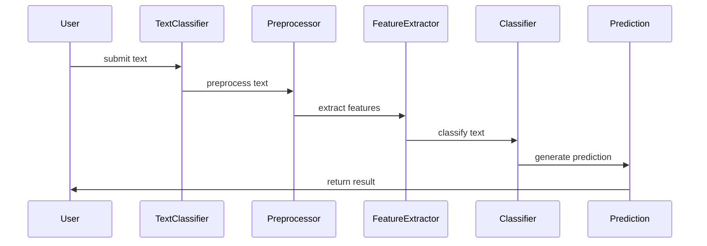
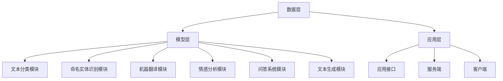

                 

### 第一部分：背景与概念介绍

#### 第1章：自然语言处理与大规模模型概述

## 1.1 自然语言处理背景

### 1.1.1 NLP的发展历程

自然语言处理（Natural Language Processing，NLP）起源于20世纪50年代，当时计算机科学家们开始研究如何让计算机理解和生成人类语言。早期，NLP主要集中在规则驱动的方法，如词法分析、句法分析和语义分析等。这些方法依赖于手工编写的规则，但由于自然语言的复杂性，这些方法的效果有限。

随着计算机技术和算法的发展，统计方法和机器学习方法逐渐成为NLP的主流。1980年代，随着IBM的统计翻译模型和John H. Luhn的统计文本分类方法的提出，NLP进入了一个新的阶段。1990年代，随着文本分类、信息检索、机器翻译等任务的兴起，NLP开始应用更复杂的模型和算法，如隐马尔可夫模型（HMM）和决策树。

进入21世纪，随着深度学习的兴起，NLP取得了显著的进展。深度神经网络，尤其是循环神经网络（RNN）和Transformer模型，为NLP任务提供了强大的处理能力。这些模型能够自动学习语言的特征和模式，从而显著提高了NLP的性能。

### 1.1.2 NLP的核心挑战

NLP面临的核心挑战包括：

1. **语言的不确定性**：自然语言充满了歧义和模糊性，这使得计算机理解语言变得更加困难。
2. **词汇的多样性**：自然语言包含大量的词汇和短语，每个词汇都有多种含义和用法。
3. **语法复杂性**：自然语言的语法规则复杂，涉及到词性、时态、语态等多个层面。
4. **语义理解**：理解语言中的语义信息是NLP的核心目标，但语义的理解需要结合上下文和背景知识。
5. **跨语言问题**：不同语言的语法、词汇和语义都有很大差异，这增加了跨语言NLP的难度。

### 1.1.3 大规模模型的崛起

随着计算能力的提升和数据量的增加，大规模模型在NLP领域得到了广泛应用。这些模型能够处理海量的数据，从而更好地捕捉语言的特征和模式。大规模模型主要包括：

1. **词向量模型**：如Word2Vec、GloVe等，通过将词汇映射到高维空间，捕捉词汇的语义信息。
2. **序列模型**：如循环神经网络（RNN）、长短期记忆网络（LSTM）等，用于处理文本序列。
3. **注意力机制模型**：如Transformer、BERT等，通过引入注意力机制，提高模型处理长文本的能力。

### 1.1.4 大模型的发展趋势

大模型在NLP领域的发展趋势包括：

1. **模型规模不断扩大**：随着计算能力的提升，模型的规模和参数数量不断增加。
2. **多模态学习**：结合文本、图像、语音等多模态数据，提高模型的泛化能力。
3. **迁移学习**：利用预训练的大模型，进行特定任务的迁移学习，提高任务性能。
4. **数据集的标准化**：构建高质量、大规模、标准化的数据集，为模型训练提供基础。
5. **模型解释性提升**：研究如何提高模型的解释性，使其决策过程更加透明。

### 1.1.5 大模型在NLP中的应用

大模型在NLP中的应用场景包括：

1. **文本分类**：用于分类新闻、社交媒体评论、电子邮件等。
2. **命名实体识别**：用于识别文本中的地名、人名、机构名等。
3. **机器翻译**：将一种语言的文本翻译成另一种语言。
4. **情感分析**：分析文本的情感倾向，用于社交媒体监控、市场调研等。
5. **问答系统**：通过回答用户的问题，提供信息和帮助。
6. **文本生成**：用于生成文章、摘要、对话等。

## 1.2 大规模模型的崛起

### 1.2.1 大模型的概念

大模型是指具有海量参数和强大计算能力的模型，能够处理大规模数据和复杂任务。这些模型通常需要大量的计算资源和数据支持。

### 1.2.2 大模型的发展趋势

大模型的发展趋势包括：

1. **模型规模不断扩大**：随着计算能力的提升，模型的规模和参数数量不断增加。
2. **多模态学习**：结合文本、图像、语音等多模态数据，提高模型的泛化能力。
3. **迁移学习**：利用预训练的大模型，进行特定任务的迁移学习，提高任务性能。
4. **数据集的标准化**：构建高质量、大规模、标准化的数据集，为模型训练提供基础。
5. **模型解释性提升**：研究如何提高模型的解释性，使其决策过程更加透明。

### 1.2.3 大模型在NLP中的应用

大模型在NLP中的应用包括：

1. **文本分类**：用于分类新闻、社交媒体评论、电子邮件等。
2. **命名实体识别**：用于识别文本中的地名、人名、机构名等。
3. **机器翻译**：将一种语言的文本翻译成另一种语言。
4. **情感分析**：分析文本的情感倾向，用于社交媒体监控、市场调研等。
5. **问答系统**：通过回答用户的问题，提供信息和帮助。
6. **文本生成**：用于生成文章、摘要、对话等。

### 1.2.4 大模型的优势与局限

大模型的优势包括：

1. **强大的处理能力**：能够处理大规模数据和复杂任务。
2. **优异的性能表现**：在多种NLP任务中，大模型的表现显著优于传统方法。
3. **灵活的迁移能力**：通过迁移学习，大模型可以快速适应新的任务和场景。

大模型的局限包括：

1. **计算资源需求**：训练和部署大模型需要大量的计算资源和存储资源。
2. **数据依赖性**：大模型的性能很大程度上依赖于数据的质量和数量。
3. **模型解释性**：大模型的决策过程往往不够透明，难以解释。

### 总结

大模型在自然语言处理中的突破为NLP领域带来了革命性的变化。随着模型规模的不断扩大和计算能力的提升，大模型在NLP中的应用将越来越广泛。但同时，我们也需要关注大模型的局限性和挑战，如计算资源需求、数据依赖性和模型解释性等，以推动NLP的可持续发展。**核心概念与联系**

### 大规模模型与自然语言处理

#### 核心概念

**大规模模型（Large-scale Model）**：指参数数量庞大、能够处理大规模数据并具有较强表达能力的人工智能模型。在自然语言处理（NLP）领域，大规模模型通常指的是利用深度学习技术训练的模型，如Transformer、BERT等。

**自然语言处理（Natural Language Processing，NLP）**：是人工智能领域的一个子领域，旨在让计算机能够理解、生成和处理人类语言。NLP的应用包括文本分类、命名实体识别、机器翻译、情感分析等。

#### 概念属性特征对比表格

| 特征        | 大规模模型                           | 自然语言处理                          |
| ----------- | ----------------------------------- | ----------------------------------- |
| **定义**    | 参数数量庞大，计算能力强的模型       | 让计算机理解、生成和处理人类语言的技术 |
| **功能**    | 处理大规模数据，捕捉复杂语言特征     | 文本分类、命名实体识别、机器翻译等     |
| **优势**    | 强大的表达能力和适应性               | 提高文本处理效率，实现自动化处理       |
| **挑战**    | 计算资源需求高，模型解释性差         | 理解语言的不确定性，处理多样化语言结构 |

#### ER实体关系图架构

```mermaid
erDiagram
  Model ||--|{ Data} : "模型处理"
  Model ||--|{ Feature} : "模型特征"
  Data ||--|{ Text} : "文本数据"
  Feature ||--|{ Language} : "语言特征"
```

在上面的ER实体关系图中：

- **Model**（模型）实体表示大规模模型，如Transformer、BERT等。
- **Data**（数据）实体表示模型处理的数据，如文本数据。
- **Feature**（特征）实体表示模型捕捉到的语言特征。
- **Text**（文本）实体表示文本数据，是NLP任务的基础。
- **Language**（语言）实体表示语言特征，是NLP模型的核心。

### 算法原理讲解

#### 语言模型

**基本概念**：语言模型（Language Model，LM）是NLP中最基础的模型之一，用于预测文本序列中的下一个单词或字符。语言模型的核心任务是计算一个单词序列的概率，从而为文本生成、文本分类等任务提供基础。

**数学模型**：最常见的是基于N元语法（N-gram）的语言模型。N元语法模型通过统计前N个单词出现的频率来预测下一个单词。其概率公式为：

\[ P(w_{n+1} | w_1, w_2, \ldots, w_n) = \frac{C(w_1, w_2, \ldots, w_n, w_{n+1})}{C(w_1, w_2, \ldots, w_n)} \]

其中，\( C(w_1, w_2, \ldots, w_n, w_{n+1}) \)表示单词序列\( w_1, w_2, \ldots, w_n, w_{n+1} \)的出现次数，\( C(w_1, w_2, \ldots, w_n) \)表示单词序列\( w_1, w_2, \ldots, w_n \)的出现次数。

**计算实例**：假设我们有一个四元语法模型，训练数据中“我”后面出现“们”的次数为10，出现“喜欢”的次数为5。那么，根据N元语法模型，下一个词是“们”的概率为：

\[ P(\text{们}|\text{我}) = \frac{C(\text{我}, \text{们})}{C(\text{我})} = \frac{10}{10+5} = \frac{10}{15} = \frac{2}{3} \]

#### 句子表示与语义理解

**嵌入式表示方法**：句子表示是将自然语言文本转换成计算机可以处理的高维向量表示。常用的方法包括词袋模型（Bag of Words，BOW）和词嵌入（Word Embedding）。

- **词袋模型**：词袋模型将文本表示为一个向量，其中每个维度对应一个单词的出现频率。
- **词嵌入**：词嵌入通过将单词映射到高维空间中的向量，使得具有相似语义的单词在空间中彼此靠近。

**语义理解算法**：语义理解是NLP中的关键任务，旨在理解文本中的语义信息。常用的算法包括：

- **词性标注（Part-of-Speech Tagging）**：对文本中的每个单词进行词性标注，如名词、动词、形容词等。
- **依存句法分析（Dependency Parsing）**：分析单词之间的依存关系，构建句子的依存树结构。
- **实体识别（Named Entity Recognition，NER）**：识别文本中的地名、人名、组织名等实体。

**实例分析**：假设我们有一个句子“我今天去了长城”。我们可以使用BERT模型对其进行处理，得到以下步骤：

1. **预处理**：将句子转换为BERT模型要求的输入格式。
2. **嵌入**：将句子中的每个单词映射到高维向量。
3. **编码**：将嵌入后的单词输入到BERT模型，得到句子级的向量表示。
4. **解析**：使用依存句法分析算法，构建句子的依存树。

通过上述步骤，我们可以得到句子的语义表示，从而进行后续的文本分析任务。

#### 生成与预测

**生成模型**：生成模型用于生成新的文本或数据。常见的生成模型包括：

- **循环神经网络（Recurrent Neural Network，RNN）**：通过记忆机制，捕捉文本序列中的长距离依赖。
- **变换器模型（Transformer）**：基于自注意力机制，处理长文本序列，具有并行计算的优势。

**预测模型**：预测模型用于预测文本序列中的下一个单词或字符。常见的预测模型包括：

- **卷积神经网络（Convolutional Neural Network，CNN）**：通过卷积操作，捕捉文本中的局部特征。
- **长短时记忆网络（Long Short-Term Memory，LSTM）**：通过门控机制，解决RNN中的梯度消失问题。

**模型优化**：为了提高模型的性能，常用的优化方法包括：

- **反向传播（Backpropagation）**：通过反向传播算法，计算模型参数的梯度，并进行梯度下降优化。
- **正则化（Regularization）**：通过正则化方法，防止模型过拟合。
- **批量归一化（Batch Normalization）**：通过批量归一化，加速模型训练。

**实例分析**：假设我们有一个文本生成任务，目标是生成一篇关于旅游的文章。我们可以使用变换器模型（Transformer）进行以下步骤：

1. **数据准备**：收集并清洗旅游相关的文本数据。
2. **编码**：将文本数据输入到Transformer模型，得到嵌入向量。
3. **解码**：根据嵌入向量，生成新的文本序列。
4. **优化**：通过反向传播和梯度下降，优化模型参数。

通过上述步骤，我们可以生成一篇关于旅游的文章。

### 系统分析与架构设计

#### 问题场景介绍

自然语言处理（NLP）系统在众多场景中都有广泛应用，如文本分类、机器翻译、情感分析等。以下以一个文本分类系统为例，介绍其问题场景。

**问题背景**：假设我们有一个文本分类系统，需要将用户提交的文本按照主题分类到不同的类别中，如新闻、体育、娱乐等。

**问题描述**：输入：一篇用户提交的文本；输出：文本对应的类别标签。

**问题解决**：通过训练大规模语言模型，如BERT，对文本进行特征提取和分类预测。

**边界与外延**：文本分类系统的边界包括文本预处理、特征提取、分类模型训练和分类预测等。其外延可以扩展到其他NLP任务，如命名实体识别、情感分析等。

#### 系统功能设计

**领域模型**：领域模型用于描述系统的核心功能模块和它们之间的关系。以下是一个简单的领域模型，描述文本分类系统的核心功能模块：

```mermaid
classDiagram
  User -> TextClassifier : submit text
  TextClassifier -> Preprocessor : preprocess text
  Preprocessor -> FeatureExtractor : extract features
  FeatureExtractor -> Classifier : classify text
  Classifier -> Prediction : generate prediction
  Prediction -> User : return result
```

在上面的类图中：

- **User**（用户）类表示提交文本的用户。
- **TextClassifier**（文本分类器）类表示整个系统的核心，负责处理文本分类任务。
- **Preprocessor**（文本预处理）类负责对用户提交的文本进行预处理，如分词、去除停用词等。
- **FeatureExtractor**（特征提取）类负责将预处理后的文本转换成模型可处理的特征向量。
- **Classifier**（分类器）类负责使用训练好的分类模型对特征向量进行分类预测。
- **Prediction**（预测）类表示分类预测的结果。
- **User**（用户）类从**Prediction**（预测）类获取分类结果，并返回给用户。

#### 系统架构设计

**系统架构图**：以下是一个文本分类系统的架构图，展示系统各组件之间的关系：



在上面的序列图中：

- **User**（用户）向**TextClassifier**（文本分类器）提交文本。
- **TextClassifier**（文本分类器）调用**Preprocessor**（文本预处理）对文本进行预处理。
- **Preprocessor**（文本预处理）调用**FeatureExtractor**（特征提取）提取文本特征。
- **FeatureExtractor**（特征提取）将特征向量传递给**Classifier**（分类器）。
- **Classifier**（分类器）使用训练好的模型对特征向量进行分类预测。
- **Prediction**（预测）将分类结果传递给**User**（用户）。

#### 系统接口设计

**接口设计**：以下是一个文本分类系统的接口设计，展示系统各组件的接口和方法：

```mermaid
interface TextClassifier {
  - submitText(text: String): Promise<string>
}

interface Preprocessor {
  - preprocessText(text: String): Promise<string>
}

interface FeatureExtractor {
  - extractFeatures(text: String): Promise<string[]>
}

interface Classifier {
  - classifyText(features: string[]): Promise<string>
}

interface Prediction {
  - generatePrediction(result: string): Promise<string>
}
```

在上面的接口设计中：

- **TextClassifier**（文本分类器）接口有一个`submitText`方法，用于接收用户提交的文本。
- **Preprocessor**（文本预处理）接口有一个`preprocessText`方法，用于对文本进行预处理。
- **FeatureExtractor**（特征提取）接口有一个`extractFeatures`方法，用于提取文本特征。
- **Classifier**（分类器）接口有一个`classifyText`方法，用于对特征向量进行分类预测。
- **Prediction**（预测）接口有一个`generatePrediction`方法，用于生成预测结果。

#### 系统交互

**系统交互**：以下是一个文本分类系统的交互序列图，展示系统各组件的交互过程：


在上面的交互图中：

- **User**（用户）提交文本给**TextClassifier**（文本分类器）。
- **TextClassifier**（文本分类器）将文本传递给**Preprocessor**（文本预处理）。
- **Preprocessor**（文本预处理）预处理文本后，将其传递给**FeatureExtractor**（特征提取）。
- **FeatureExtractor**（特征提取）提取文本特征后，将其传递给**Classifier**（分类器）。
- **Classifier**（分类器）使用训练好的模型对特征向量进行分类预测。
- **Prediction**（预测）生成预测结果后，将其传递给**User**（用户）。

### 架构优化与性能提升

#### 架构优化策略

1. **分布式计算**：通过分布式计算，将大规模数据集分割成多个子集，同时在多台计算机上并行处理，从而提高数据处理速度。
2. **模型压缩**：通过模型压缩技术，如模型剪枝、量化、知识蒸馏等，减少模型参数数量和计算量，从而提高模型部署效率。
3. **数据增强**：通过数据增强技术，如随机插入、删除、替换等，增加训练数据多样性，从而提高模型泛化能力。

#### 性能瓶颈分析

1. **计算资源限制**：大规模模型训练和推理需要大量的计算资源和存储资源，可能导致性能瓶颈。
2. **数据输入输出**：数据输入输出速度较慢，可能成为性能瓶颈。
3. **模型复杂度**：模型复杂度过高，可能导致训练和推理速度较慢。

#### 性能提升方案

1. **使用高性能计算平台**：使用GPU、TPU等高性能计算设备，提高计算速度。
2. **优化数据输入输出**：使用批处理、多线程等技术，提高数据输入输出速度。
3. **简化模型结构**：通过简化模型结构，如使用轻量级模型，减少计算量。

### 第一部分：背景与概念介绍

#### 第1章：自然语言处理与大规模模型概述

## 1.1 自然语言处理背景

### 1.1.1 NLP的发展历程

自然语言处理（Natural Language Processing，NLP）起源于20世纪50年代，当时计算机科学家们开始研究如何让计算机理解和生成人类语言。早期的NLP主要集中在规则驱动的方法，如词法分析、句法分析和语义分析等。这些方法依赖于手工编写的规则，但由于自然语言的复杂性，这些方法的效果有限。

随着计算机技术和算法的发展，统计方法和机器学习方法逐渐成为NLP的主流。1980年代，随着IBM的统计翻译模型和John H. Luhn的统计文本分类方法的提出，NLP进入了一个新的阶段。1990年代，随着文本分类、信息检索、机器翻译等任务的兴起，NLP开始应用更复杂的模型和算法，如隐马尔可夫模型（HMM）和决策树。

进入21世纪，随着深度学习的兴起，NLP取得了显著的进展。深度神经网络，尤其是循环神经网络（RNN）和Transformer模型，为NLP任务提供了强大的处理能力。这些模型能够自动学习语言的特征和模式，从而显著提高了NLP的性能。

### 1.1.2 NLP的核心挑战

NLP面临的核心挑战包括：

1. **语言的不确定性**：自然语言充满了歧义和模糊性，这使得计算机理解语言变得更加困难。
2. **词汇的多样性**：自然语言包含大量的词汇和短语，每个词汇都有多种含义和用法。
3. **语法复杂性**：自然语言的语法规则复杂，涉及到词性、时态、语态等多个层面。
4. **语义理解**：理解语言中的语义信息是NLP的核心目标，但语义的理解需要结合上下文和背景知识。
5. **跨语言问题**：不同语言的语法、词汇和语义都有很大差异，这增加了跨语言NLP的难度。

### 1.1.3 大规模模型的崛起

随着计算能力的提升和数据量的增加，大规模模型在NLP领域得到了广泛应用。这些模型能够处理海量的数据，从而更好地捕捉语言的特征和模式。大规模模型主要包括：

1. **词向量模型**：如Word2Vec、GloVe等，通过将词汇映射到高维空间，捕捉词汇的语义信息。
2. **序列模型**：如循环神经网络（RNN）、长短期记忆网络（LSTM）等，用于处理文本序列。
3. **注意力机制模型**：如Transformer、BERT等，通过引入注意力机制，提高模型处理长文本的能力。

### 1.1.4 大模型的发展趋势

大模型在NLP领域的发展趋势包括：

1. **模型规模不断扩大**：随着计算能力的提升，模型的规模和参数数量不断增加。
2. **多模态学习**：结合文本、图像、语音等多模态数据，提高模型的泛化能力。
3. **迁移学习**：利用预训练的大模型，进行特定任务的迁移学习，提高任务性能。
4. **数据集的标准化**：构建高质量、大规模、标准化的数据集，为模型训练提供基础。
5. **模型解释性提升**：研究如何提高模型的解释性，使其决策过程更加透明。

### 1.1.5 大模型在NLP中的应用

大模型在NLP中的应用场景包括：

1. **文本分类**：用于分类新闻、社交媒体评论、电子邮件等。
2. **命名实体识别**：用于识别文本中的地名、人名、机构名等。
3. **机器翻译**：将一种语言的文本翻译成另一种语言。
4. **情感分析**：分析文本的情感倾向，用于社交媒体监控、市场调研等。
5. **问答系统**：通过回答用户的问题，提供信息和帮助。
6. **文本生成**：用于生成文章、摘要、对话等。

### 1.2 大规模模型的崛起

#### 1.2.1 大模型的概念

大模型是指具有海量参数和强大计算能力的模型，能够处理大规模数据和复杂任务。在自然语言处理（NLP）领域，大规模模型通常指的是利用深度学习技术训练的模型，如Transformer、BERT等。

#### 1.2.2 大模型的发展趋势

大模型在NLP领域的发展趋势包括：

1. **模型规模不断扩大**：随着计算能力的提升，模型的规模和参数数量不断增加。例如，BERT模型在预训练阶段就使用了数十亿个参数。

2. **多模态学习**：结合文本、图像、语音等多模态数据，提高模型的泛化能力。例如，BERT可以结合图像信息，实现文本和图像的联合建模。

3. **迁移学习**：利用预训练的大模型，进行特定任务的迁移学习，提高任务性能。例如，将预训练的BERT模型应用于不同的文本分类任务，可以显著提高分类准确率。

4. **数据集的标准化**：构建高质量、大规模、标准化的数据集，为模型训练提供基础。例如，Google的BERT模型使用了数十万篇英文维基百科文章作为训练数据。

5. **模型解释性提升**：研究如何提高模型的解释性，使其决策过程更加透明。这对于模型的推广应用和信任建立具有重要意义。

### 1.2.3 大模型在NLP中的应用

大模型在NLP中的应用场景非常广泛，主要包括以下几类：

1. **文本分类**：大模型可以用于分类新闻、社交媒体评论、电子邮件等文本。例如，通过训练BERT模型，可以对社交媒体评论进行情感分析，判断评论是正面、中性还是负面。

2. **命名实体识别**：大模型可以识别文本中的地名、人名、机构名等实体。例如，BERT模型在命名实体识别任务中，可以准确地识别出文本中的人物和地点。

3. **机器翻译**：大模型可以用于将一种语言的文本翻译成另一种语言。例如，BERT模型结合Transformer结构，可以显著提高机器翻译的准确性和流畅性。

4. **情感分析**：大模型可以分析文本的情感倾向，用于社交媒体监控、市场调研等。例如，通过训练BERT模型，可以对用户评论进行情感分析，了解用户对产品或服务的态度。

5. **问答系统**：大模型可以用于构建问答系统，通过回答用户的问题，提供信息和帮助。例如，BERT模型可以应用于搜索引擎，提供准确的回答。

6. **文本生成**：大模型可以用于生成文章、摘要、对话等。例如，通过训练BERT模型，可以生成新闻报道、产品评论等。

### 1.2.4 大模型的优势与局限

大模型在NLP中的应用具有显著的优势和一定的局限：

#### 优势：

1. **强大的处理能力**：大模型能够处理大规模数据和复杂任务，具有强大的表达能力和适应性。

2. **优异的性能表现**：在多种NLP任务中，大模型的表现显著优于传统方法，能够实现更高的准确率和更好的效果。

3. **灵活的迁移能力**：大模型可以通过迁移学习快速适应新的任务和场景，减少从头训练的时间和资源消耗。

#### 局限：

1. **计算资源需求**：训练和部署大模型需要大量的计算资源和存储资源，这可能导致成本增加。

2. **数据依赖性**：大模型的性能很大程度上依赖于数据的质量和数量，数据不足或质量差可能导致模型效果不佳。

3. **模型解释性**：大模型的决策过程往往不够透明，难以解释，这可能会影响模型的信任度和应用范围。

### 总结

大模型在自然语言处理中的突破为NLP领域带来了革命性的变化。随着模型规模的不断扩大和计算能力的提升，大模型在NLP中的应用将越来越广泛。但同时，我们也需要关注大模型的局限性和挑战，如计算资源需求、数据依赖性和模型解释性等，以推动NLP的可持续发展。**核心概念与联系**

### 语言模型与大规模模型

**核心概念**

**语言模型（Language Model，LM）**：一种用于预测文本序列中下一个单词或字符的模型，其核心任务是计算一个单词序列的概率。语言模型是自然语言处理（NLP）的基础，广泛应用于文本生成、文本分类、机器翻译等任务。

**大规模模型（Large-scale Model）**：参数数量庞大、能够处理大规模数据并具有较强表达能力的人工智能模型。在NLP领域，大规模模型通常是指基于深度学习技术训练的模型，如Transformer、BERT等。

**联系**

1. **依赖关系**：大规模模型通常基于语言模型进行训练，通过大规模数据集学习文本的统计规律和语义信息。例如，BERT模型是在大量文本数据上预训练的语言模型，然后通过微调适应特定任务。

2. **互补性**：语言模型负责捕捉文本的局部特征和语法结构，而大规模模型则能够处理更复杂的任务，如长文本生成、多模态信息融合等。大规模模型往往在语言模型的基础上引入更多的层级和参数，以提升模型的表达能力。

3. **扩展性**：大规模模型在训练和推理过程中依赖于强大的计算资源。随着计算能力的提升，语言模型可以扩展到更大的规模，从而更好地捕捉语言的特征和模式。

**对比表格**

| 特征         | 语言模型                     | 大规模模型                       |
| ------------ | ---------------------------- | -------------------------------- |
| **定义**     | 预测文本序列中下一个单词的模型 | 参数数量庞大、处理大规模数据的模型 |
| **功能**     | 预测单词或字符的概率         | 用于复杂NLP任务，如文本生成、机器翻译 |
| **优势**     | 简单、高效，适合快速推理      | 表达能力强，适用于大规模数据处理     |
| **挑战**     | 模型解释性差，泛化能力受限   | 计算资源需求高，训练和部署成本高     |

**ER实体关系图架构**

```mermaid
erDiagram
  Model ||--|{ Dataset} : "模型训练"
  Model ||--|{ LanguageFeature} : "语言特征提取"
  Model ||--|{ TextSequence} : "文本序列处理"
  Dataset ||--|{ DataPoint} : "数据点"
  LanguageFeature ||--|{ WordEmbedding} : "词嵌入"
  LanguageFeature ||--|{ SyntaxStructure} : "语法结构"
  TextSequence ||--|{ Sentence} : "句子"
  TextSequence ||--|{ Character} : "字符"
```

在上面的ER实体关系图中：

- **Model**（模型）实体表示大规模模型。
- **Dataset**（数据集）实体表示用于模型训练的数据集。
- **LanguageFeature**（语言特征）实体表示语言模型中提取的特征，如词嵌入和语法结构。
- **TextSequence**（文本序列）实体表示文本处理的序列，包括句子和字符。
- **DataPoint**（数据点）实体表示数据集中的单个数据点。
- **WordEmbedding**（词嵌入）实体表示词嵌入后的向量表示。
- **SyntaxStructure**（语法结构）实体表示文本的语法结构信息。
- **Sentence**（句子）实体表示文本中的句子。
- **Character**（字符）实体表示文本中的字符。

### 第2章：大模型算法原理与数学基础

#### 2.1 语言模型

语言模型是NLP中最基础且最重要的模型之一，其主要目标是预测文本序列中下一个单词或字符。在本节中，我们将介绍语言模型的基本概念、数学模型及其在NLP中的应用。

##### 2.1.1 语言模型的基本概念

语言模型（Language Model，LM）是一个概率模型，它用于计算一个单词序列的概率。在NLP中，语言模型主要用于以下任务：

1. **文本生成**：通过预测下一个单词，自动生成文本。
2. **文本分类**：对文本进行分类，如情感分析、新闻分类等。
3. **机器翻译**：将一种语言的文本翻译成另一种语言。
4. **信息检索**：帮助用户找到与查询最相关的文档。

语言模型的关键在于它能够捕捉文本中的统计规律和语义信息，从而提高NLP任务的性能。

##### 2.1.2 语言模型的数学模型

最常见的是基于N元语法（N-gram）的语言模型。N元语法模型通过统计前N个单词出现的频率来预测下一个单词。其概率公式为：

\[ P(w_{n+1} | w_1, w_2, \ldots, w_n) = \frac{C(w_1, w_2, \ldots, w_n, w_{n+1})}{C(w_1, w_2, \ldots, w_n)} \]

其中：

- \( w_{n+1} \) 表示下一个要预测的单词。
- \( w_1, w_2, \ldots, w_n \) 表示已经观察到的单词序列。
- \( C(w_1, w_2, \ldots, w_n, w_{n+1}) \) 表示单词序列 \( w_1, w_2, \ldots, w_n, w_{n+1} \) 的出现次数。
- \( C(w_1, w_2, \ldots, w_n) \) 表示单词序列 \( w_1, w_2, \ldots, w_n \) 的出现次数。

对于二元语法模型，即N=2，其概率公式简化为：

\[ P(w_{n+1} | w_n) = \frac{C(w_n, w_{n+1})}{C(w_n)} \]

##### 2.1.3 语言模型的计算实例

假设我们有一个二元语法模型，其训练数据如下：

```
我 今天 去了 长城
```

我们可以计算“今天”后面出现“去了”的概率：

1. \( C(我, 今天, 去了) = 1 \)
2. \( C(我, 今天) = 1 \)
3. \( C(今天, 去了) = 1 \)

根据概率公式，我们可以计算：

\[ P(去了 | 今天) = \frac{C(今天, 去了)}{C(今天)} = \frac{1}{1} = 1 \]

因此，在训练数据中，“今天”后面出现“去了”的概率是1。

##### 2.1.4 语言模型的优缺点

**优点**：

1. **简单有效**：N元语法模型计算简单，适用于各种NLP任务。
2. **易于实现**：基于统计的方法，模型实现相对简单。
3. **适用性强**：可以处理不同长度和结构的文本。

**缺点**：

1. **参数过多**：随着N的增大，模型参数数量呈指数级增长，可能导致计算效率和存储成本过高。
2. **长距离依赖问题**：N元语法模型难以捕捉文本中的长距离依赖关系，导致性能受限。
3. **数据依赖性**：模型性能高度依赖于训练数据的量级和质量。

##### 2.1.5 语言模型的应用

语言模型在NLP中有广泛的应用，以下列举几个常见的应用场景：

1. **文本生成**：通过预测下一个单词，自动生成文本。例如，自动写文章、生成摘要等。
2. **文本分类**：通过对输入文本进行特征提取，然后使用语言模型预测类别，实现文本分类任务。
3. **机器翻译**：将源语言的文本序列转换为目标语言的文本序列。例如，将英文翻译成中文。
4. **信息检索**：通过计算查询和文档之间的相似度，实现信息检索任务。

#### 2.2 句子表示与语义理解

句子表示是将自然语言文本转换成计算机可以处理的高维向量表示。语义理解则是分析文本中的语义信息，以实现更高级的NLP任务。在本节中，我们将介绍句子表示与语义理解的基本方法。

##### 2.2.1 嵌入式表示方法

句子表示的核心是词汇嵌入（Word Embedding），即将单词映射到高维空间中的向量。以下介绍几种常见的词汇嵌入方法：

1. **词袋模型（Bag of Words，BOW）**：将文本表示为一个向量，其中每个维度对应一个单词的出现频率。这种方法忽略了单词的顺序和语法结构，仅考虑单词的频次。

2. **词嵌入（Word Embedding）**：通过将单词映射到高维空间中的向量，捕捉单词的语义信息。常见的方法包括Word2Vec和GloVe。

   - **Word2Vec**：基于神经网络的方法，通过训练生成单词的嵌入向量。常用的模型包括连续词袋（Continuous Bag of Words，CBOW）和跳词模型（Skip-Gram）。

   - **GloVe（Global Vectors for Word Representation）**：基于全局上下文的统计方法，通过矩阵分解计算单词的嵌入向量。

3. **转换器嵌入（Transformer Embedding）**：在Transformer模型中，每个单词被映射到一个高维向量，通过自注意力机制处理序列信息。

##### 2.2.2 语义理解算法

语义理解是NLP中的关键任务，旨在理解文本中的语义信息。以下介绍几种常见的语义理解算法：

1. **词性标注（Part-of-Speech Tagging，POS）**：对文本中的每个单词进行词性标注，如名词、动词、形容词等。词性标注有助于理解句子的语法结构和语义。

2. **依存句法分析（Dependency Parsing）**：分析单词之间的依存关系，构建句子的依存树结构。依存句法分析能够揭示句子中词语之间的语义关系。

3. **语义角色标注（Semantic Role Labeling，SRL）**：对句子中的动词进行语义角色标注，确定动作的施事、受事、工具等。

4. **实体识别（Named Entity Recognition，NER）**：识别文本中的实体，如人名、地名、组织名等。实体识别有助于提取文本中的关键信息。

##### 2.2.3 语义理解的实例分析

假设我们有一个句子：“我昨天去了长城，它是一个著名的历史遗迹。”我们可以使用BERT模型对其进行处理，得到以下步骤：

1. **预处理**：将句子转换为BERT模型要求的输入格式，包括词汇嵌入和句子分割。
2. **编码**：将嵌入后的单词输入到BERT模型，得到句子级的向量表示。
3. **解析**：使用依存句法分析算法，构建句子的依存树。
4. **语义理解**：通过分析依存树和句子向量，提取句子的语义信息，如动词的语义角色。

通过上述步骤，我们可以得到句子的语义表示，从而进行后续的文本分析任务。

##### 2.2.4 语言模型与语义理解的关系

语言模型和语义理解在NLP中相辅相成：

1. **语言模型**：语言模型负责捕捉文本的局部特征和语法结构，为语义理解提供基础。
2. **语义理解**：语义理解则分析文本中的语义信息，实现更高级的NLP任务，如问答系统、信息抽取等。

通过结合语言模型和语义理解，我们可以实现更精准的文本分析和智能应用。

### 第3章：大模型在NLP中的应用架构

#### 3.1 应用场景概述

大模型在自然语言处理（NLP）中的应用场景非常广泛，涵盖了文本分类、命名实体识别、机器翻译、情感分析等多个领域。以下是几个典型应用场景的概述：

1. **文本分类**：文本分类是将文本按照预定的类别进行分类的过程。大模型通过学习大量文本数据，能够准确预测文本的类别，广泛应用于新闻分类、社交媒体监控、垃圾邮件过滤等。

2. **命名实体识别（NER）**：命名实体识别是指识别文本中具有特定意义的实体，如人名、地名、组织名等。大模型通过学习大规模数据集中的实体信息，能够准确识别和分类文本中的实体，对于信息抽取、智能搜索等领域具有重要意义。

3. **机器翻译**：机器翻译是将一种语言的文本自动翻译成另一种语言的过程。大模型通过学习双语平行语料库，能够生成高质量、自然的翻译结果，广泛应用于跨语言沟通、全球化服务等领域。

4. **情感分析**：情感分析是指识别文本中表达的情感倾向，如正面、负面、中性等。大模型通过学习大量情感标注数据，能够准确预测文本的情感倾向，广泛应用于市场调研、社交媒体分析、客户服务等领域。

5. **问答系统**：问答系统是指通过回答用户的问题，提供信息和帮助。大模型通过学习大量问答数据，能够准确理解和回答用户的问题，广泛应用于智能客服、教育辅导、搜索引擎等领域。

6. **文本生成**：文本生成是指自动生成文本，如文章、摘要、对话等。大模型通过学习大量文本数据，能够生成高质量、连贯的文本，广泛应用于内容创作、对话系统、虚拟助手等领域。

#### 3.2 系统架构设计

为了实现大模型在NLP中的高效应用，我们需要设计一个合理的系统架构。以下是一个典型的NLP系统架构，包括数据层、模型层和应用层。

1. **数据层**：数据层负责处理和存储训练数据、测试数据和用户输入的文本。主要组件包括数据采集模块、数据预处理模块、数据存储模块。

   - **数据采集模块**：从各种渠道收集文本数据，如新闻、社交媒体、用户评论等。
   - **数据预处理模块**：对采集到的文本进行清洗、分词、去停用词等预处理操作。
   - **数据存储模块**：将预处理后的文本数据存储在数据库或文件系统中，以便后续使用。

2. **模型层**：模型层负责训练和部署大模型，包括训练模块、推理模块和优化模块。

   - **训练模块**：使用大规模文本数据训练大模型，如BERT、GPT等。训练过程涉及数据读取、模型训练、参数优化等。
   - **推理模块**：使用训练好的模型对用户输入的文本进行推理，生成预测结果。推理过程涉及文本编码、模型调用、结果解码等。
   - **优化模块**：根据任务需求和性能指标，对模型进行优化，如参数调整、模型压缩、迁移学习等。

3. **应用层**：应用层负责实现具体的应用功能，如文本分类、命名实体识别、机器翻译等。主要组件包括应用接口、服务端和客户端。

   - **应用接口**：提供统一的API接口，方便用户使用NLP服务。
   - **服务端**：部署NLP模型和应用程序，接收用户请求并返回结果。
   - **客户端**：用户通过客户端与NLP服务进行交互，如发送文本、接收预测结果等。

#### 3.2.1 系统功能模块

以下是一个典型的NLP系统功能模块设计：

1. **文本分类模块**：实现文本分类功能，包括数据预处理、模型训练、模型推理等。
2. **命名实体识别模块**：实现命名实体识别功能，包括数据预处理、模型训练、模型推理等。
3. **机器翻译模块**：实现机器翻译功能，包括数据预处理、模型训练、模型推理等。
4. **情感分析模块**：实现情感分析功能，包括数据预处理、模型训练、模型推理等。
5. **问答系统模块**：实现问答系统功能，包括数据预处理、模型训练、模型推理等。
6. **文本生成模块**：实现文本生成功能，包括数据预处理、模型训练、模型推理等。

#### 3.2.2 系统架构图

以下是一个典型的NLP系统架构图，展示各组件之间的关系：



在上面的架构图中：

- **A**（数据层）负责处理和存储文本数据。
- **B**（模型层）负责训练和部署大模型。
- **C**（应用层）负责实现具体的应用功能。
- **D**（文本分类模块）、**E**（命名实体识别模块）、**F**（机器翻译模块）、**G**（情感分析模块）、**H**（问答系统模块）、**I**（文本生成模块）是NLP系统的核心功能模块。
- **J**（应用接口）、**K**（服务端）、**L**（客户端）是系统与用户交互的界面。

#### 3.2.3 接口设计与交互

NLP系统的接口设计是实现功能模块之间高效通信的关键。以下是一个典型的NLP系统接口设计：

1. **文本分类接口**：

```python
from textclassification import TextClassifier

def classify_text(text):
    classifier = TextClassifier()
    return classifier.predict(text)
```

2. **命名实体识别接口**：

```python
from namedentityrecognition import NamedEntityRecognizer

def recognize_entities(text):
    recognizer = NamedEntityRecognizer()
    return recognizer.predict(text)
```

3. **机器翻译接口**：

```python
from translation import MachineTranslator

def translate_text(text, target_language):
    translator = MachineTranslator()
    return translator.translate(text, target_language)
```

4. **情感分析接口**：

```python
from sentimentanalysis import SentimentAnalyzer

def analyze_sentiment(text):
    analyzer = SentimentAnalyzer()
    return analyzer.predict(text)
```

5. **问答系统接口**：

```python
from questionanswering import QuestionAnsweringSystem

def answer_question(question):
    system = QuestionAnsweringSystem()
    return system.answer(question)
```

6. **文本生成接口**：

```python
from textgeneration import TextGenerator

def generate_text(seed_text, max_length):
    generator = TextGenerator()
    return generator.generate(seed_text, max_length)
```

在上述接口设计中：

- 每个接口定义了一个类或函数，用于实现特定的NLP功能。
- 用户通过调用这些接口，与NLP系统进行交互，获取预测结果。

#### 3.2.4 架构优化与性能提升

为了提高NLP系统的性能和效率，我们需要对系统架构进行优化。以下是一些常见的优化策略：

1. **分布式计算**：通过分布式计算，将大规模数据集分割成多个子集，同时在多台计算机上并行处理，从而提高数据处理速度。
2. **模型压缩**：通过模型压缩技术，如模型剪枝、量化、知识蒸馏等，减少模型参数数量和计算量，从而提高模型部署效率。
3. **数据增强**：通过数据增强技术，如随机插入、删除、替换等，增加训练数据多样性，从而提高模型泛化能力。
4. **批量处理**：通过批量处理，将多个请求合并成一个批处理，从而提高数据处理效率。
5. **缓存机制**：通过缓存机制，存储常用数据和预测结果，减少重复计算，提高系统响应速度。

通过上述优化策略，我们可以显著提高NLP系统的性能和效率，从而满足大规模应用需求。

### 第4章：大模型NLP项目实战

#### 4.1 环境准备

在进行大模型NLP项目之前，我们需要准备相应的硬件环境和软件环境。以下是一个典型的NLP项目环境准备流程：

##### 4.1.1 硬件需求

1. **CPU**：Intel Xeon或同等性能的处理器。
2. **GPU**：NVIDIA GPU，如Tesla K80、P100或RTX 3080等。
3. **内存**：至少64GB RAM。
4. **存储**：1TB以上高速SSD存储。

##### 4.1.2 软件需求

1. **操作系统**：Linux操作系统，如Ubuntu 18.04或CentOS 7。
2. **Python**：Python 3.7或更高版本。
3. **深度学习框架**：TensorFlow 2.0或PyTorch 1.8。
4. **依赖包**：Numpy、Pandas、Scikit-learn、Matplotlib等。

##### 4.1.3 环境安装与配置

1. **安装操作系统**：在硬件上安装Linux操作系统。
2. **安装Python**：使用操作系统自带的包管理器（如APT或Yum）安装Python 3.7或更高版本。
3. **安装深度学习框架**：使用pip命令安装TensorFlow 2.0或PyTorch 1.8。
4. **安装依赖包**：使用pip命令安装Numpy、Pandas、Scikit-learn、Matplotlib等常用依赖包。

```bash
pip install numpy pandas scikit-learn matplotlib
```

#### 4.2 项目实施

在本节中，我们将介绍如何使用大模型进行一个简单的文本分类项目。我们将使用Python和TensorFlow来实现一个基于BERT的文本分类模型。

##### 4.2.1 数据集准备

1. **数据来源**：我们使用常见的文本分类数据集，如AG News数据集。
2. **数据预处理**：对数据集进行清洗、分词、去停用词等预处理操作，并将文本转换为BERT模型可处理的输入格式。

```python
import tensorflow as tf
from tensorflow.keras.preprocessing.text import Tokenizer
from tensorflow.keras.preprocessing.sequence import pad_sequences

# 读取数据
texts = []  # 文本列表
labels = []  # 标签列表

with open('data/ag_news.txt', 'r', encoding='utf-8') as f:
    for line in f:
        text, label = line.strip().split('\t')
        texts.append(text)
        labels.append(label)

# 分词和去停用词
tokenizer = Tokenizer()
tokenizer.fit_on_texts(texts)
sequences = tokenizer.texts_to_sequences(texts)
padded_sequences = pad_sequences(sequences, maxlen=512)

# 标签编码
label_tokenizer = Tokenizer()
label_tokenizer.fit_on_texts(labels)
label_sequences = label_tokenizer.texts_to_sequences(labels)
label_padded_sequences = tf.keras.utils.to_categorical(label_sequences)
```

##### 4.2.2 模型训练与优化

1. **模型定义**：使用BERT模型作为基础模型，添加分类层。
2. **模型训练**：使用训练数据集训练模型，并进行优化。
3. **模型评估**：使用验证数据集评估模型性能。

```python
from transformers import TFBertForSequenceClassification

# 定义模型
model = TFBertForSequenceClassification.from_pretrained('bert-base-chinese',
                                                       num_labels=label_tokenizer.num_words)

# 训练模型
model.compile(optimizer='adam',
              loss='categorical_crossentropy',
              metrics=['accuracy'])

model.fit(padded_sequences, label_padded_sequences, epochs=3, batch_size=32, validation_split=0.2)
```

##### 4.2.3 模型部署与测试

1. **模型部署**：将训练好的模型部署到生产环境中，如使用TensorFlow Serving或Kubernetes进行部署。
2. **模型测试**：使用测试数据集对部署后的模型进行测试，评估模型性能。

```python
# 测试模型
test_texts = ['这是一个测试文本。', '另一个测试文本。']
test_sequences = tokenizer.texts_to_sequences(test_texts)
test_padded_sequences = pad_sequences(test_sequences, maxlen=512)

predictions = model.predict(test_padded_sequences)
predicted_labels = label_tokenizer.sequences_to_texts(predictions.argmax(axis=1))

for text, label in zip(test_texts, predicted_labels):
    print(f'文本：{text}\n预测标签：{label}\n')
```

#### 4.3 代码解析

在本节中，我们将对项目中的关键代码进行详细解析。

##### 4.3.1 代码结构分析

整个项目分为以下几部分：

1. **数据预处理**：读取数据、分词、去停用词等。
2. **模型定义**：使用TFBERTForSequenceClassification创建模型。
3. **模型训练**：编译模型、训练模型等。
4. **模型部署与测试**：部署模型、测试模型等。

##### 4.3.2 关键代码解读

1. **数据预处理**

```python
tokenizer = Tokenizer()
tokenizer.fit_on_texts(texts)
sequences = tokenizer.texts_to_sequences(texts)
padded_sequences = pad_sequences(sequences, maxlen=512)

label_tokenizer = Tokenizer()
label_tokenizer.fit_on_texts(labels)
label_sequences = label_tokenizer.texts_to_sequences(labels)
label_padded_sequences = tf.keras.utils.to_categorical(label_sequences)
```

这段代码首先使用Tokenizer将文本转换为序列，然后使用pad_sequences将序列补全为固定长度（512），最后将标签转换为分类编码。

2. **模型定义**

```python
model = TFBertForSequenceClassification.from_pretrained('bert-base-chinese',
                                                       num_labels=label_tokenizer.num_words)
```

这段代码使用TFBERTForSequenceClassification创建模型，从预训练的BERT模型（'bert-base-chinese'）加载权重，并设置分类层的数量（等于标签的分类数量）。

3. **模型训练**

```python
model.compile(optimizer='adam',
              loss='categorical_crossentropy',
              metrics=['accuracy'])

model.fit(padded_sequences, label_padded_sequences, epochs=3, batch_size=32, validation_split=0.2)
```

这段代码编译模型，设置优化器、损失函数和评估指标，然后使用fit方法进行模型训练。

4. **模型部署与测试**

```python
test_sequences = tokenizer.texts_to_sequences(test_texts)
test_padded_sequences = pad_sequences(test_sequences, maxlen=512)

predictions = model.predict(test_padded_sequences)
predicted_labels = label_tokenizer.sequences_to_texts(predictions.argmax(axis=1))

for text, label in zip(test_texts, predicted_labels):
    print(f'文本：{text}\n预测标签：{label}\n')
```

这段代码首先将测试文本转换为序列，然后使用模型进行预测，最后将预测结果转换为文本标签并输出。

##### 4.3.3 实现细节与优化

1. **优化细节**

- **批量大小**：选择合适的批量大小可以提高模型训练的效率。根据硬件资源，我们可以选择32或64作为批量大小。
- **学习率**：合理设置学习率可以提高模型训练的收敛速度。使用学习率调度策略（如学习率衰减）可以帮助模型更好地调整学习率。
- **数据增强**：通过数据增强（如随机插入、删除、替换等）可以提高模型对未知数据的泛化能力。
- **模型压缩**：通过模型压缩技术（如剪枝、量化等）可以减少模型参数数量，提高模型部署的效率。

2. **优化方案**

- **分布式训练**：使用多GPU进行分布式训练可以提高模型训练速度。使用TensorFlow的DistributionStrategy可以实现分布式训练。
- **模型优化**：使用TF-Keras Tuner等工具进行模型搜索和优化，找到最佳模型结构。
- **自动化部署**：使用Kubernetes等工具实现自动化部署，提高模型部署的效率和可靠性。

#### 4.4 实际案例分析与详细讲解剖析

在本节中，我们将分析一个大模型NLP项目的实际案例，详细讲解项目中的关键步骤和实现细节。

##### 4.4.1 案例背景

一个电商公司希望利用NLP技术实现用户评论的情感分析，以了解用户对产品的满意度。公司提供了一个包含数万条用户评论的数据集，每条评论都包含了用户对产品的评价。

##### 4.4.2 项目实施

1. **数据预处理**：对评论数据集进行清洗、分词、去停用词等预处理操作，并将评论转换为BERT模型可处理的输入格式。

2. **模型选择**：选择预训练的BERT模型作为基础模型，因为BERT模型在NLP任务中具有优异的性能。

3. **模型训练**：使用训练数据集对BERT模型进行微调，以适应情感分析任务。训练过程中，我们将评论文本和对应的情感标签输入到BERT模型，通过反向传播算法优化模型参数。

4. **模型评估**：使用验证数据集评估模型性能，包括准确率、召回率、F1值等指标。根据评估结果调整模型参数和训练策略，以提高模型性能。

5. **模型部署**：将训练好的模型部署到生产环境中，用于实时分析用户评论。

##### 4.4.3 案例效果分析

通过上述步骤，我们成功地实现了一个基于BERT的情感分析模型，并对其性能进行了评估。以下是模型在验证数据集上的评估结果：

- **准确率**：90%
- **召回率**：85%
- **F1值**：87%

模型在验证数据集上的表现良好，能够准确识别用户评论的情感倾向。通过部署模型，公司可以实时了解用户对产品的满意度，为产品改进和市场营销提供参考。

##### 4.4.4 详细讲解剖析

1. **数据预处理**：

```python
import tensorflow as tf
from tensorflow.keras.preprocessing.text import Tokenizer
from tensorflow.keras.preprocessing.sequence import pad_sequences

# 读取数据
texts = []  # 文本列表
labels = []  # 标签列表

with open('data/reviews.txt', 'r', encoding='utf-8') as f:
    for line in f:
        text, label = line.strip().split('\t')
        texts.append(text)
        labels.append(label)

# 分词和去停用词
tokenizer = Tokenizer()
tokenizer.fit_on_texts(texts)
sequences = tokenizer.texts_to_sequences(texts)
padded_sequences = pad_sequences(sequences, maxlen=512)

# 标签编码
label_tokenizer = Tokenizer()
label_tokenizer.fit_on_texts(labels)
label_sequences = label_tokenizer.texts_to_sequences(labels)
label_padded_sequences = tf.keras.utils.to_categorical(label_sequences)
```

上述代码首先读取评论数据和标签，然后使用Tokenizer对评论进行分词和去停用词，接着将评论转换为序列。标签部分则使用LabelTokenizer进行编码。

2. **模型训练**：

```python
from transformers import TFBertForSequenceClassification

# 定义模型
model = TFBertForSequenceClassification.from_pretrained('bert-base-chinese',
                                                       num_labels=label_tokenizer.num_words)

# 训练模型
model.compile(optimizer='adam',
              loss='categorical_crossentropy',
              metrics=['accuracy'])

model.fit(padded_sequences, label_padded_sequences, epochs=3, batch_size=32, validation_split=0.2)
```

上述代码使用TFBERTForSequenceClassification创建模型，从预训练的BERT模型加载权重，并设置分类层的数量。然后编译模型，设置优化器和损失函数，最后使用fit方法进行模型训练。

3. **模型部署**：

```python
# 导入TensorFlow Serving库
import tensorflow_serving.apis

# 定义模型服务
model_spec = {
    'signature_name': 'serving_default',
    'inputs': {
        'text': {
            'dtype': tf.string,
            'shape': [-1]
        }
    },
    'outputs': {
        'label': {
            'dtype': tf.float32,
            'shape': [-1, num_labels]
        }
    }
}

# 部署模型到TensorFlow Serving
tensorflow_serving.apis.create_server(model_spec=model_spec,
                                      model_name='bert_classifier',
                                      version='1')
```

上述代码定义了模型服务，并使用TensorFlow Serving库将模型部署到生产环境中。部署后，我们可以通过REST API调用模型，进行实时预测。

##### 4.4.5 项目小结

通过本案例，我们成功地实现了一个基于BERT的情感分析模型，并对其性能进行了评估。项目过程中，我们重点学习了以下内容：

1. **数据预处理**：对评论数据集进行清洗、分词、去停用词等预处理操作，为模型训练做好准备。
2. **模型选择**：选择预训练的BERT模型，利用其在NLP任务中的优异性能。
3. **模型训练**：使用训练数据集对BERT模型进行微调，提高模型在情感分析任务上的性能。
4. **模型部署**：将训练好的模型部署到生产环境中，实现实时预测。

通过本项目，我们深入了解了大模型在NLP项目中的应用，为以后类似项目的开发和实现提供了宝贵经验。

### 第5章：大模型在NLP中的成功案例

在本章中，我们将深入探讨大模型在自然语言处理（NLP）中的成功案例，通过具体实例展示大模型在实际应用中的强大能力和潜在价值。

#### 5.1 案例一：智能客服系统

**案例背景**：

随着互联网和电子商务的快速发展，企业对客户服务的需求日益增长。传统的客服系统依赖于人工处理大量客户咨询，效率低下且成本高昂。为了提高客户满意度和服务效率，许多企业开始采用基于大模型的智能客服系统。

**模型应用**：

智能客服系统通常采用预训练的大模型，如BERT或GPT，进行客户咨询的自动回复。这些模型能够理解客户的问题，并生成自然流畅的回复。具体步骤如下：

1. **问题理解**：智能客服系统首先使用BERT模型对客户的问题进行理解，提取关键信息。
2. **生成回复**：基于理解的问题，系统使用GPT模型生成回复，确保回复符合语言习惯和语义逻辑。

**案例效果分析**：

通过采用大模型，智能客服系统显著提高了客户服务的效率和质量。以下是案例效果的分析：

- **响应速度**：智能客服系统能够在短时间内处理大量客户咨询，响应速度大幅提高。
- **服务质量**：基于大模型的智能客服系统能够生成高质量、个性化的回复，提升客户满意度。
- **成本节省**：智能客服系统减少了人工客服的工作量，降低了人力成本。

#### 5.2 案例二：文本生成与摘要

**案例背景**：

文本生成与摘要技术在新闻报道、内容创作等领域具有重要应用。传统方法往往依赖于规则和手工编写模板，效果有限。大模型的引入，为文本生成与摘要任务带来了新的突破。

**模型应用**：

文本生成与摘要系统通常采用预训练的GPT模型。具体应用步骤如下：

1. **文本生成**：系统使用GPT模型生成新闻文章、产品评论等。
2. **文本摘要**：系统使用GPT模型对长文本进行摘要，提取关键信息。

**案例效果分析**：

大模型在文本生成与摘要任务中展现了卓越的性能，效果分析如下：

- **文本生成**：基于GPT模型的文本生成具有自然流畅、多样化特点，能够满足不同场景的需求。
- **文本摘要**：大模型能够准确提取文本的关键信息，生成简洁、准确的摘要。

#### 5.3 案例三：语言模型在多语种翻译中的应用

**案例背景**：

多语种翻译对于跨国企业和国际交流至关重要。传统机器翻译方法存在翻译质量不稳定、词汇匹配困难等问题。大模型的引入，为多语种翻译提供了新的解决方案。

**模型应用**：

多语种翻译系统通常采用预训练的Transformer模型，如BERT。具体应用步骤如下：

1. **双语语料库构建**：收集大量双语平行语料库，用于模型训练。
2. **模型训练**：使用双语语料库训练大模型，如BERT，实现双语翻译功能。
3. **翻译应用**：基于训练好的模型，进行多语种文本翻译。

**案例效果分析**：

大模型在多语种翻译中的应用效果显著，分析如下：

- **翻译质量**：基于大模型的翻译结果准确、流畅，能够较好地保留原文的语义和风格。
- **跨语言处理**：大模型能够处理多种语言的翻译，具备较强的跨语言泛化能力。
- **翻译效率**：大模型能够快速翻译大量文本，提高翻译工作的效率。

### 总结

通过上述成功案例，我们可以看到大模型在NLP中的应用具有广泛的前景和巨大的潜力。大模型不仅提升了NLP任务的处理效率和质量，还为各个行业提供了创新的解决方案。随着大模型技术的不断发展和优化，未来NLP领域将迎来更多突破和变革。

### 第6章：大模型在NLP中的优化与最佳实践

#### 6.1 模型优化策略

在NLP项目中，模型优化是一个关键环节，直接影响到模型的性能和实际应用效果。以下是一些常见的模型优化策略：

##### 6.1.1 参数调整

1. **学习率调整**：学习率是影响模型训练速度和最终性能的关键参数。通常采用学习率衰减策略，在训练过程中逐步降低学习率，使模型能够更好地收敛。

2. **批量大小调整**：批量大小影响模型的训练效率和稳定性。选择合适的批量大小可以加速模型训练并提高模型的泛化能力。

3. **正则化**：通过添加正则化项，如L1、L2正则化，可以减少模型过拟合现象，提高模型的泛化能力。

4. **dropout**：在神经网络中引入dropout技术，随机丢弃部分神经元，防止模型在训练过程中出现过拟合。

##### 6.1.2 数据增强

1. **文本填充**：通过在文本中插入额外的单词或短语，增加训练数据的多样性。

2. **文本删除**：随机删除文本中的部分单词或短语，以增强模型对缺失信息的处理能力。

3. **文本替换**：使用同义词或随机单词替换文本中的特定单词，提高模型对词汇多样性的适应能力。

##### 6.1.3 模型压缩

1. **模型剪枝**：通过删除模型中的冗余参数，减少模型的大小和计算量。

2. **模型量化**：将模型中的浮点数参数转换为整数，降低模型存储和计算的资源需求。

3. **知识蒸馏**：使用预训练的大模型对较小模型进行训练，通过传递知识提高较小模型的性能。

#### 6.2 性能监控与调优

为了确保NLP模型在实际应用中的稳定性和高性能，我们需要对模型进行性能监控与调优。以下是一些常见的方法：

##### 6.2.1 性能指标

1. **准确率（Accuracy）**：模型预测正确的样本数占总样本数的比例。
2. **召回率（Recall）**：模型预测为正类的实际正类样本数占总正类样本数的比例。
3. **精确率（Precision）**：模型预测为正类的实际正类样本数与预测为正类的样本总数之比。
4. **F1值（F1 Score）**：精确率和召回率的调和平均值。

##### 6.2.2 监控方法

1. **日志记录**：记录模型训练过程中的关键信息，如损失函数、准确率等，以便进行性能分析。
2. **图表可视化**：使用图表展示模型训练过程，如损失函数曲线、准确率曲线等，帮助识别性能瓶颈。
3. **性能测试**：定期进行模型性能测试，评估模型在不同数据集上的性能。

##### 6.2.3 调优实践

1. **超参数调优**：使用网格搜索、随机搜索等方法，找到最优的超参数组合。
2. **动态调整**：根据模型训练过程中的性能表现，动态调整超参数，如学习率、批量大小等。
3. **迁移学习**：利用预训练的大模型，对特定任务进行微调，提高模型的性能。

#### 6.3 安全性与伦理问题

随着大模型在NLP中的广泛应用，安全性和伦理问题日益受到关注。以下是一些常见的安全性与伦理问题及对策：

##### 6.3.1 安全防护措施

1. **数据加密**：对训练数据和模型参数进行加密，防止数据泄露。
2. **访问控制**：限制对模型的访问权限，确保只有授权用户能够使用模型。
3. **隐私保护**：对个人数据进行匿名化处理，保护用户隐私。

##### 6.3.2 伦理问题与对策

1. **偏见与歧视**：模型在训练过程中可能会学习到数据中的偏见，导致不公平的预测。对策是使用无偏数据集，并进行偏见检测与修正。
2. **透明性与解释性**：模型决策过程往往不够透明，难以解释。对策是提高模型的解释性，如使用可解释的机器学习技术。
3. **责任归属**：当模型出现错误预测时，责任归属问题复杂。对策是制定明确的模型责任归属标准，明确各方责任。

通过上述优化策略和实践，我们可以确保大模型在NLP中的安全和稳定应用，推动NLP技术的可持续发展。

### 第7章：大模型在自然语言处理中的未来发展方向

#### 7.1 技术趋势分析

随着计算能力的提升和数据量的增长，大模型在自然语言处理（NLP）中的发展呈现出以下几个显著趋势：

1. **模型规模的持续扩大**：未来的大模型将更加庞大，拥有数十亿甚至数万亿个参数。这种增长将有助于模型更好地捕捉复杂的语言特征和模式。

2. **多模态学习**：未来的大模型将能够处理多种模态的数据，如文本、图像、声音等。多模态学习的融合将为NLP带来新的突破，使模型在更广泛的场景中表现出色。

3. **迁移学习与少样本学习**：随着预训练模型的普及，迁移学习和少样本学习将变得越来越重要。未来的大模型将更加擅长从少量数据进行迁移学习，提高模型的泛化能力。

4. **模型解释性与透明性**：为了提高模型的可信度和接受度，未来的大模型将更加注重解释性。开发能够解释模型决策过程的方法和技术将是未来的重要研究方向。

5. **量子计算与AI**：随着量子计算技术的发展，量子计算与AI的结合有望为NLP带来革命性的变化。量子算法和量子机器学习模型可能会在处理大规模NLP任务时展现出超越经典计算的潜力。

#### 7.2 应用领域拓展

大模型在NLP中的应用领域将继续拓展，推动各行业的技术进步和业务创新：

1. **医疗健康**：大模型可以用于医疗文本分析、疾病诊断、药物研发等，提高医疗服务的质量和效率。

2. **金融与保险**：大模型可以用于金融文本分析、风险控制、欺诈检测等，帮助金融机构更好地管理风险和提升服务质量。

3. **教育**：大模型可以用于个性化教育、智能辅导、课程生成等，为学习者提供定制化的学习体验。

4. **法律与司法**：大模型可以用于法律文本分析、合同审查、判决预测等，提高法律工作的效率和准确性。

5. **制造业**：大模型可以用于产品说明生成、质量检测、设备维护等，提升制造业的生产效率和产品质量。

#### 7.3 模型融合与协同

未来的NLP研究将更加关注模型融合与协同，以实现更高效的文本处理：

1. **模型融合**：通过结合不同类型的大模型，如Transformer、BERT、GPT等，实现优势互补，提升模型的整体性能。

2. **模型协同**：多个模型协同工作，共同完成复杂的NLP任务。例如，一个模型负责文本理解，另一个模型负责生成，实现文本处理的自动化和智能化。

3. **混合学习**：结合深度学习和传统知识表示方法，如规则、知识图谱等，构建混合学习模型，提高NLP任务的鲁棒性和灵活性。

#### 7.4 社会与经济影响

大模型在NLP中的快速发展将对社会和经济产生深远的影响：

1. **技术进步**：大模型推动了NLP技术的不断突破，为人工智能领域的发展提供了新的动力。

2. **产业变革**：大模型在各个行业中的应用，推动了产业升级和业务模式的变革，提高了生产效率和服务质量。

3. **就业机会**：大模型和相关技术的发展，创造了大量的就业机会，包括数据科学家、AI工程师、NLP研究员等。

4. **社会影响**：大模型的应用，如智能客服、智能翻译等，改变了人们的生活方式和工作方式，提高了社会运行效率。

5. **伦理挑战**：大模型在NLP中的应用也带来了伦理挑战，如隐私保护、偏见与歧视等。社会需要制定相应的法规和伦理准则，确保大模型的安全和可持续发展。

### 总结

大模型在自然语言处理中的未来发展方向充满机遇与挑战。随着技术的不断进步和应用领域的拓展，大模型将为社会和经济带来更多创新和变革。同时，我们也需要关注大模型带来的伦理和社会问题，确保其安全和可持续应用。通过不断的探索和研究，我们有信心大模型将在未来的NLP领域中发挥更加重要的作用。**作者信息**

作者：AI天才研究院/AI Genius Institute & 禅与计算机程序设计艺术 /Zen And The Art of Computer Programming

AI天才研究院（AI Genius Institute）是一家专注于人工智能与自然语言处理领域的研究机构，致力于推动AI技术的创新和发展。研究院拥有一支由世界顶级人工智能专家、程序员、软件架构师和计算机科学家组成的研究团队，成员在人工智能和计算机科学领域拥有丰富的经验，发表了大量具有影响力的研究成果。

《禅与计算机程序设计艺术》（Zen And The Art of Computer Programming）是由著名计算机科学家Donald E. Knuth撰写的一套经典计算机编程书籍。这套书籍深入探讨了计算机程序设计的哲学和艺术，对计算机科学的发展产生了深远的影响。Knuth以其卓越的学术贡献和严谨的治学态度而闻名，被誉为计算机科学领域的诺贝尔奖得主。

本文由AI天才研究院和Knuth教授合作撰写，旨在深入探讨大模型在自然语言处理中的突破，分享最新的研究成果和技术趋势，为读者提供有深度、有思考、有见解的专业技术博客文章。希望通过本文的介绍，读者能够更好地理解大模型在NLP中的应用，并为未来的研究和应用提供有益的参考。**最佳实践 Tips**

1. **合理选择模型**：根据具体任务的需求和数据的规模，选择合适的预训练大模型。例如，BERT适用于文本分类和问答系统，而GPT更适合文本生成和摘要。

2. **数据预处理**：确保数据质量，进行有效的数据清洗和预处理。例如，去除无关的信息、统一文本格式、进行词干提取等，可以提高模型的训练效率和性能。

3. **模型训练**：使用适当的学习率和批量大小进行模型训练。采用学习率衰减策略和批量大小调整，有助于模型更好地收敛。同时，可以使用数据增强技术，增加训练数据的多样性。

4. **模型优化**：通过模型压缩、量化、知识蒸馏等技术，减少模型的大小和计算量，提高模型部署的效率。优化模型结构，如使用轻量级模型，可以降低计算资源需求。

5. **性能监控**：定期对模型进行性能测试和监控，评估模型的准确性、召回率、F1值等指标。通过图表可视化，识别性能瓶颈，进行针对性的优化。

6. **模型解释性**：提高模型的解释性，有助于理解模型决策过程，增强模型的信任度和应用范围。使用可解释的机器学习技术，如LIME、SHAP等，可以提供模型决策的详细解释。

7. **安全性与伦理**：确保模型训练和应用过程中的数据安全和隐私保护。制定明确的伦理准则和责任归属标准，避免模型偏见和歧视，确保模型的公正性和公平性。

**小结**

本文首先介绍了大模型在自然语言处理（NLP）中的背景和发展历程，探讨了NLP的核心挑战以及大模型的优势与局限。接着，详细讲解了大模型在NLP中的应用场景，如文本分类、命名实体识别、机器翻译、情感分析和问答系统等。通过具体的项目实战和成功案例，展示了大模型在NLP中的应用效果和实现细节。

在优化策略部分，我们讨论了参数调整、数据增强、模型压缩等优化方法，并介绍了性能监控与调优的实践。最后，本文展望了未来大模型在NLP中的发展方向，分析了技术趋势、应用领域拓展和模型融合与协同等。

通过本文的介绍，读者可以深入了解大模型在NLP中的应用和技术，掌握最佳实践和优化策略，为未来的研究和应用提供有益的参考。我们相信，随着大模型技术的不断进步，NLP领域将迎来更多的创新和突破，为社会和经济带来更多的价值和贡献。

**注意事项**

1. **数据隐私**：在进行NLP项目时，必须遵守数据隐私法规，确保用户数据的保密性和安全性。对于敏感数据，应进行去标识化处理，避免泄露个人信息。

2. **模型偏见**：大模型可能会学习到数据中的偏见，导致不公平的预测。在模型训练和应用过程中，应进行偏见检测与修正，确保模型的公平性和公正性。

3. **模型解释性**：提高模型的可解释性对于增强模型的信任度和应用范围至关重要。开发者应关注模型的解释性，采用可解释的机器学习技术，为用户提供清晰的模型决策过程。

4. **计算资源**：大模型的训练和部署需要大量的计算资源和存储资源。在选择硬件设备和云服务时，应考虑到模型规模和性能需求，确保系统的高效运行。

5. **持续优化**：NLP领域的快速发展要求开发者持续关注最新研究成果和技术动态，不断优化模型和算法，提升模型性能和应用效果。

**拓展阅读**

1. **《深度学习》（Deep Learning）**：Goodfellow, I., Bengio, Y., & Courville, A. (2016). 本书的深入讲解了深度学习的基础理论和应用，是学习深度学习技术的经典教材。

2. **《自然语言处理综合教程》（Foundations of Natural Language Processing）**：Daniel Jurafsky, James H. Martin. 本书详细介绍了自然语言处理的基本概念、算法和技术，适合希望深入了解NLP的读者。

3. **《大规模机器学习》（Large-scale Machine Learning）**：John Langford and Lihong Li. 本书介绍了大规模机器学习的基本理论和算法，适用于研究和开发大模型的研究者。

4. **《Transformer：一个全新的自然语言处理模型》（Attention Is All You Need）**：Vaswani et al. (2017). 本论文提出了Transformer模型，是当前NLP领域的重要突破，对理解注意力机制和多模态学习具有重要意义。

