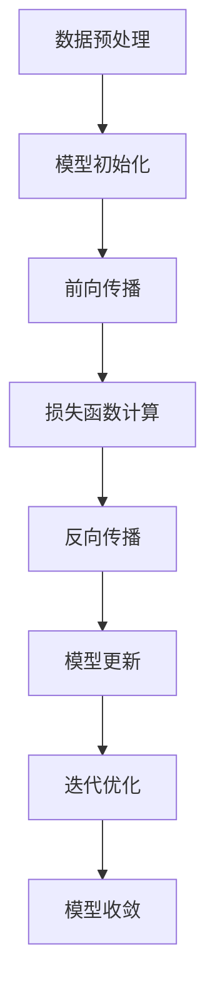

                 


# 大模型在计算机视觉中的前沿应用

> 关键词：大模型、计算机视觉、算法、架构设计、项目实战、最佳实践

> 摘要：本文将深入探讨大模型在计算机视觉领域的应用，从背景介绍、核心概念与联系、算法原理讲解、数学模型与公式解释、系统分析与架构设计、项目实战以及最佳实践等方面展开，旨在为读者提供全面、系统的了解和实际操作指导。

## 目录大纲设计步骤

为了设计出一本名为《大模型在计算机视觉中的前沿应用》的详细目录大纲，我们需要遵循以下步骤：

### 步骤 1：确定核心章节

首先，我们需要确定这本书的核心章节，确保能够全面覆盖主题内容。这些核心章节应包括背景介绍、核心概念与联系、算法原理讲解、数学模型与公式解释、系统分析与架构设计、项目实战以及最佳实践等。

### 步骤 2：细化每个章节

在每个核心章节下，进一步细分出子章节。子章节应该紧密围绕核心内容展开，确保逻辑清晰，内容完整。

### 步骤 3：使用 Markdown 格式

使用 Markdown 格式来编写目录大纲，确保格式清晰，便于阅读。Markdown 使用如下符号进行层级划分：

- `#` 用于一级标题
- `##` 用于二级标题
- `###` 用于三级标题

### 步骤 4：确保内容完整性

在目录大纲中，必须包含以下内容：

- **背景介绍**：核心概念、问题背景、问题描述、问题解决、边界与外延、概念结构与核心要素组成。
- **核心概念与联系**：核心概念原理、概念属性特征对比表格和 ER 实体关系图架构的 Mermaid 流程图。
- **算法原理讲解**：使用 Mermaid 画出算法流程图，然后使用 Python 源代码详细阐述，给出算法原理的数学模型和公式。
- **数学模型和数学公式**：使用 LaTeX 格式，确保公式准确无误。
- **系统分析与架构设计**：问题场景介绍、系统功能设计（领域模型 Mermaid 类图）、系统架构设计 Mermaid 架构图、系统接口设计和系统交互 Mermaid 序列图。
- **项目实战**：环境安装、系统核心实现源代码，代码应用解读与分析，实际案例分析和详细讲解剖析，项目小结。
- **最佳实践 tips、小结、注意事项、拓展阅读等内容**。

### 步骤 5：控制总字数

确保整个目录大纲的总字数不超过2000字，这要求我们在编写时保持简洁性，避免不必要的废话。

### 目录大纲

#### 第一部分：背景介绍

##### 第1章：大模型与计算机视觉

1.1 引言

1.2 问题背景

1.3 问题描述

1.4 问题解决

1.5 边界与外延

1.6 概念结构与核心要素组成

#### 第二部分：核心概念与联系

##### 第2章：核心概念与联系

2.1 大模型定义与特点

2.2 计算机视觉基础

2.3 大模型在计算机视觉中的应用

##### 第3章：大模型技术原理

3.1 算法原理讲解

3.2 算法 Mermaid 流程图

3.3 数学模型与公式

##### 第4章：数学模型与公式解释

4.1 数学模型介绍

4.2 数学公式解释

4.3 举例说明

##### 第5章：系统分析与架构设计

5.1 问题场景介绍

5.2 系统功能设计

5.3 系统架构设计

5.4 系统接口设计

5.5 系统交互

##### 第6章：项目实战

6.1 环境安装

6.2 系统核心实现

6.3 代码应用解读与分析

6.4 实际案例分析

6.5 项目小结

##### 第7章：最佳实践与总结

7.1 最佳实践 tips

7.2 小结

7.3 注意事项

7.4 拓展阅读

### 结束语

通过以上步骤，我们设计出了一本名为《大模型在计算机视觉中的前沿应用》的详细目录大纲，确保了内容的完整性、逻辑性和简洁性。接下来，我们可以根据这个大纲开始编写具体的内容。

## 背景介绍

### 核心概念术语说明

在探讨大模型在计算机视觉中的前沿应用之前，我们首先需要明确一些核心概念术语。以下是对这些术语的简要说明：

- **大模型（Large Models）**：指的是具有大量参数的神经网络模型，能够通过学习海量数据来提取复杂特征。
- **计算机视觉（Computer Vision）**：是人工智能领域的一个重要分支，旨在使计算机能够“看”懂图像和视频，从而进行目标检测、图像分类、场景理解等任务。
- **深度学习（Deep Learning）**：是一种基于神经网络的学习方法，通过层次化的网络结构来提取图像的层次特征。
- **卷积神经网络（Convolutional Neural Network，CNN）**：是一种特殊的神经网络结构，在计算机视觉领域有着广泛的应用。

### 问题背景

计算机视觉技术在过去几十年中取得了显著的进展，然而，传统的计算机视觉方法在处理复杂场景时仍然存在诸多挑战。例如，在图像分类任务中，如何准确地将图像划分为不同的类别？在目标检测任务中，如何准确地识别和定位图像中的目标物体？在场景理解任务中，如何从图像中提取丰富的语义信息？

这些问题的存在促使研究人员不断探索更高效、更准确的计算机视觉算法。随着计算能力的提升和大数据的发展，大模型逐渐成为解决这些问题的有力工具。大模型通过学习海量数据，能够自动提取图像中的复杂特征，从而提高计算机视觉任务的性能。

### 问题描述

大模型在计算机视觉中的应用主要涉及以下问题：

- **特征提取**：如何从图像中提取具有判别力的特征？
- **模型训练**：如何训练出具有较高性能的大模型？
- **模型优化**：如何优化模型的参数，提高模型的效率和准确性？
- **模型部署**：如何将训练好的模型部署到实际应用中，并保证模型的实时性和可靠性？

### 问题解决

为了解决上述问题，研究人员采取了以下几种方法：

- **数据增强**：通过增加数据量、多样化数据分布等方式，提高模型的泛化能力。
- **迁移学习**：利用预训练的大模型，在特定任务上进一步训练，以提高模型的性能。
- **模型剪枝**：通过剪枝模型中的冗余参数，减少模型的计算量，提高模型的效率。
- **分布式训练**：利用分布式计算资源，加速模型的训练过程。

### 边界与外延

大模型在计算机视觉中的应用不仅限于图像分类、目标检测和场景理解等任务，还可以扩展到视频处理、图像生成、人脸识别等领域。同时，随着计算机视觉技术的不断发展，大模型的应用范围和深度也将进一步拓展。

### 概念结构与核心要素组成

大模型在计算机视觉中的应用可以概括为以下几个核心要素：

- **数据集**：提供用于模型训练的数据。
- **网络架构**：确定模型的层次结构和参数配置。
- **训练策略**：包括数据增强、迁移学习、模型剪枝等。
- **评估指标**：用于衡量模型性能的评价标准。
- **应用场景**：模型在实际任务中的具体应用。

通过以上介绍，我们为大模型在计算机视觉中的应用奠定了基础。在接下来的章节中，我们将进一步探讨大模型的核心概念与联系、技术原理、数学模型与公式解释等内容。

#### 第二部分：核心概念与联系

##### 第2章：核心概念与联系

2.1 大模型定义与特点

2.2 计算机视觉基础

2.3 大模型在计算机视觉中的应用

### 2.1 大模型定义与特点

大模型，通常指的是具有数百万至数十亿参数的神经网络模型，它们通过学习大量数据来提取复杂的特征表示。相比于传统的较小规模的模型，大模型具有以下几个显著特点：

1. **参数数量巨大**：大模型的参数数量通常在数百万到数十亿之间，这使得它们能够学习更丰富的特征表示。
2. **更强的泛化能力**：由于参数数量庞大，大模型能够更好地从数据中学习到本质的特征，从而在未见过的数据上表现更优秀。
3. **需要大量数据**：大模型需要大量的数据进行训练，以确保它们能够学到通用且具有判别力的特征。
4. **计算资源需求高**：大模型的训练和推理过程通常需要大量的计算资源，包括高算力的GPU或TPU。
5. **模型复杂度高**：大模型的结构复杂，包含多个层级的神经网络，这使得它们能够捕捉图像中的多层次特征。

大模型的这些特点使其在解决复杂任务时具有明显优势，例如在图像分类、目标检测、图像生成等领域。然而，这也带来了对计算资源、数据量和训练时间的高需求。

### 2.2 计算机视觉基础

计算机视觉（Computer Vision）是人工智能（AI）的一个重要分支，旨在使计算机具备通过图像和视频理解世界的能力。计算机视觉的基本概念和任务包括：

1. **图像处理**：图像处理是计算机视觉的基础，涉及图像的获取、预处理、增强、滤波、分割等操作。这些操作用于提高图像的质量，提取有用的信息。
2. **特征提取**：特征提取是从图像中提取出具有判别力的信息，以便用于后续的计算机视觉任务。常见的特征包括边缘、角点、纹理、颜色等。
3. **图像分类**：图像分类是将图像划分为不同的类别，例如将图像分类为动物、植物、交通工具等。常用的分类算法包括支持向量机（SVM）、决策树、神经网络等。
4. **目标检测**：目标检测是在图像中识别并定位特定对象的过程，例如在图像中检测出人脸、车辆等。常用的目标检测算法包括R-CNN、YOLO、SSD等。
5. **场景理解**：场景理解是对图像内容进行高层次分析，理解图像中的场景、对象之间的关系以及场景的语义信息。常见的场景理解任务包括对象识别、场景分割、图像 caption 等。

计算机视觉的任务通常需要结合多个技术，如深度学习、机器学习、图像处理等，以实现高效和准确的结果。

### 2.3 大模型在计算机视觉中的应用

大模型在计算机视觉中的应用已经取得了显著成果，以下是几个典型应用场景：

1. **图像分类**：大模型在图像分类任务中表现出色，例如在ImageNet图像分类挑战中，大模型ResNet获得了超过1000层的深度，在大量数据上训练后，取得了超过人类水平的分类准确率。
2. **目标检测**：大模型在目标检测任务中也发挥了重要作用，例如在COCO目标检测挑战中，基于大模型的YOLOv5模型在速度和准确率上均取得了优异的性能。
3. **图像分割**：大模型在图像分割任务中的应用也越来越广泛，例如在医学图像分割领域，U-Net模型结合大模型训练，实现了高度精确的分割结果。
4. **图像生成**：大模型在图像生成任务中也展现出强大能力，例如生成对抗网络（GAN）通过大模型训练，能够生成高质量的图像，应用于虚拟现实、艺术创作等领域。
5. **人脸识别**：大模型在人脸识别任务中具有显著优势，例如使用深度学习模型进行人脸特征提取和匹配，能够实现高精度的识别结果。

通过以上应用场景可以看出，大模型在计算机视觉领域具有广泛的应用前景和巨大潜力。

#### 第三部分：大模型技术原理

##### 第3章：大模型技术原理

3.1 算法原理讲解

3.2 算法 Mermaid 流程图

3.3 数学模型与公式

### 3.1 算法原理讲解

大模型在计算机视觉中的应用主要依赖于深度学习技术，尤其是卷积神经网络（CNN）。以下是对大模型算法原理的简要讲解：

#### 深度学习基础

深度学习是一种基于人工神经网络的机器学习技术，通过构建多层神经网络模型，对输入数据进行特征提取和表示。在深度学习中，神经网络由多个层级组成，每一层对输入数据进行处理，并传递给下一层，最终输出结果。

#### 卷积神经网络（CNN）

卷积神经网络是一种特殊的神经网络结构，特别适用于图像处理任务。CNN 通过卷积层、池化层和全连接层等结构，实现对图像的逐层特征提取。

1. **卷积层**：卷积层通过卷积操作提取图像的局部特征。卷积操作使用卷积核（滤波器）在图像上滑动，计算局部特征图。
2. **池化层**：池化层用于降低特征图的维度，提高特征表示的泛化能力。常见的池化方法包括最大池化和平均池化。
3. **全连接层**：全连接层将卷积层输出的特征图展开为一个一维向量，然后通过全连接层进行分类或回归任务。

#### 大模型训练过程

大模型的训练过程主要包括以下步骤：

1. **数据预处理**：对图像数据进行预处理，包括归一化、裁剪、旋转等，以提高模型的泛化能力。
2. **模型初始化**：初始化模型参数，常见的初始化方法包括随机初始化、高斯初始化等。
3. **前向传播**：输入图像数据通过模型的前向传播过程，生成预测结果。
4. **损失函数计算**：计算预测结果与真实标签之间的差距，使用损失函数（如交叉熵损失函数）衡量模型性能。
5. **反向传播**：通过反向传播算法，将损失函数关于模型参数的梯度计算出来，并更新模型参数。
6. **迭代优化**：重复前向传播、损失函数计算和反向传播的过程，直至模型收敛。

#### 大模型优化技巧

为了提高大模型的训练效率和性能，研究人员提出了一系列优化技巧：

1. **批量归一化（Batch Normalization）**：通过批量归一化，将每个批量数据的特征归一化到同一尺度，提高模型的训练稳定性。
2. **dropout**：在训练过程中，随机丢弃一部分神经元，以避免模型过拟合。
3. **学习率调度**：根据训练过程中模型性能的变化，动态调整学习率，以加速模型收敛。
4. **数据增强**：通过旋转、翻转、缩放等数据增强方法，增加训练数据的多样性，提高模型的泛化能力。

#### 大模型应用场景

大模型在计算机视觉中具有广泛的应用场景，包括：

1. **图像分类**：对图像进行分类，如识别动物、植物、物体等。
2. **目标检测**：在图像中检测并定位特定目标，如车辆、行人、人脸等。
3. **图像分割**：对图像进行语义分割，将图像划分为不同的区域。
4. **图像生成**：利用生成对抗网络（GAN）生成新的图像，如人脸生成、艺术风格转换等。

通过以上算法原理讲解，我们可以了解到大模型在计算机视觉中的应用基础和核心技巧。在接下来的章节中，我们将进一步探讨大模型的数学模型和公式。

### 3.2 算法 Mermaid 流程图

为了更好地理解大模型在计算机视觉中的应用流程，我们可以使用 Mermaid 语言绘制算法流程图。以下是一个简单的大模型训练流程图示例：



在这个流程图中，我们从数据预处理开始，通过模型初始化、前向传播、损失函数计算、反向传播和模型更新等步骤，不断迭代优化模型，直至模型收敛。

### 3.3 数学模型与公式

在深度学习中，大模型的训练过程涉及一系列数学模型和公式。以下简要介绍一些关键数学模型和公式：

1. **损失函数**：

   - **交叉熵损失函数**（Cross-Entropy Loss）：

     $$L = -\sum_{i} y_i \log(\hat{y}_i)$$

     其中，$y_i$ 是真实标签，$\hat{y}_i$ 是模型预测的概率分布。

   - **均方误差损失函数**（Mean Squared Error，MSE）：

     $$L = \frac{1}{2} \sum_{i} (y_i - \hat{y}_i)^2$$

     其中，$y_i$ 是真实标签，$\hat{y}_i$ 是模型预测的值。

2. **反向传播算法**：

   反向传播算法用于计算损失函数关于模型参数的梯度，并更新模型参数。以下是反向传播算法的核心步骤：

   - **前向传播**：

     $$z^{(l)} = \sigma(W^{(l)} \cdot a^{(l-1)} + b^{(l)})$$

     其中，$a^{(l-1)}$ 是前一层神经元的激活值，$W^{(l)}$ 和 $b^{(l)}$ 是当前层的权重和偏置，$\sigma$ 是激活函数。

   - **后向传播**：

     $$\delta^{(l)} = \frac{\partial L}{\partial z^{(l)}} \cdot \sigma'(z^{(l)})$$

     其中，$\delta^{(l)}$ 是当前层的误差梯度，$\sigma'$ 是激活函数的导数。

   - **参数更新**：

     $$W^{(l)} \gets W^{(l)} - \alpha \cdot \frac{\partial L}{\partial W^{(l)}}$$

     $$b^{(l)} \gets b^{(l)} - \alpha \cdot \frac{\partial L}{\partial b^{(l)}}$$

     其中，$\alpha$ 是学习率。

通过以上数学模型和公式，我们可以更好地理解大模型在计算机视觉中的应用原理和训练过程。在接下来的章节中，我们将进一步探讨大模型在具体任务中的应用实例。

#### 第四部分：数学模型与公式解释

##### 第4章：数学模型与公式解释

4.1 数学模型介绍

4.2 数学公式解释

4.3 举例说明

### 4.1 数学模型介绍

在深度学习和计算机视觉中，数学模型是核心组成部分，用于描述和学习图像数据中的特征和模式。以下是一些关键的数学模型：

1. **卷积神经网络（CNN）**：

   卷积神经网络是一种特殊的神经网络，专门用于处理图像数据。其核心数学模型包括：

   - **卷积运算**：卷积运算是一种在图像上滑动滤波器（卷积核），计算局部特征的过程。数学表达式如下：

     $$\text{conv}(I, K) = \sum_{x,y} I(x, y) \cdot K(x, y)$$

     其中，$I$ 是输入图像，$K$ 是卷积核。

   - **激活函数**：激活函数用于引入非线性特性，常见的激活函数有ReLU（Rectified Linear Unit）和Sigmoid。

     - **ReLU**：ReLU 函数定义为：

       $$\text{ReLU}(x) = \max(0, x)$$

     - **Sigmoid**：Sigmoid 函数定义为：

       $$\text{Sigmoid}(x) = \frac{1}{1 + e^{-x}}$$

2. **全连接层**：

   全连接层是将卷积层提取的特征映射到具体类别的过程。其核心数学模型是矩阵乘法：

   $$y = W \cdot x + b$$

   其中，$W$ 是权重矩阵，$x$ 是输入特征，$b$ 是偏置向量。

3. **损失函数**：

   损失函数用于衡量模型预测值与真实值之间的差异，常见的损失函数有：

   - **均方误差（MSE）**：

     $$L(\theta) = \frac{1}{2} \sum_{i}(y_i - \hat{y}_i)^2$$

     其中，$y_i$ 是真实值，$\hat{y}_i$ 是预测值。

   - **交叉熵（Cross-Entropy）**：

     $$L(\theta) = -\sum_{i} y_i \log(\hat{y}_i)$$

     其中，$y_i$ 是真实值，$\hat{y}_i$ 是预测概率。

4. **反向传播**：

   反向传播是一种用于计算损失函数关于模型参数梯度的方法。其核心步骤包括：

   - **前向传播**：计算输出值和损失函数。
   - **后向传播**：从输出层开始，逐层计算误差梯度，并更新参数。

### 4.2 数学公式解释

在解释数学公式时，我们需要关注公式的各个组成部分以及其在实际应用中的含义。以下是对几个关键公式的详细解释：

1. **卷积运算**：

   卷积运算是一种在图像上滑动滤波器（卷积核），计算局部特征的过程。其数学表达式为：

   $$\text{conv}(I, K) = \sum_{x,y} I(x, y) \cdot K(x, y)$$

   其中，$I$ 是输入图像，$K$ 是卷积核。

   - $I(x, y)$ 表示图像在点$(x, y)$的像素值。
   - $K(x, y)$ 表示卷积核在点$(x, y)$的值。

   卷积运算通过滑动卷积核在图像上，逐点计算卷积值，从而提取图像的局部特征。

2. **ReLU激活函数**：

   RReLU 函数是一种常用的激活函数，其定义为：

   $$\text{ReLU}(x) = \max(0, x)$$

   - 当$x > 0$时，$\text{ReLU}(x) = x$，保持正值不变。
   - 当$x \leq 0$时，$\text{ReLU}(x) = 0$，将负值设为0。

   RReLU 函数的作用是引入非线性，防止神经元过早饱和，提高模型的训练效果。

3. **均方误差（MSE）损失函数**：

   均方误差（MSE）是一种常见的损失函数，用于衡量模型预测值与真实值之间的差异。其数学表达式为：

   $$L(\theta) = \frac{1}{2} \sum_{i}(y_i - \hat{y}_i)^2$$

   其中，$y_i$ 是真实值，$\hat{y}_i$ 是预测值。

   - $y_i - \hat{y}_i$ 表示预测值与真实值之间的差异。
   - $(y_i - \hat{y}_i)^2$ 表示差异的平方值。

   MSE 损失函数的目的是使预测值尽可能接近真实值，从而优化模型参数。

4. **交叉熵（Cross-Entropy）损失函数**：

   交叉熵（Cross-Entropy）是一种用于分类任务的损失函数，其数学表达式为：

   $$L(\theta) = -\sum_{i} y_i \log(\hat{y}_i)$$

   其中，$y_i$ 是真实值，$\hat{y}_i$ 是预测概率。

   - $y_i$ 是真实值的概率分布。
   - $\hat{y}_i$ 是模型预测的概率分布。

   交叉熵损失函数的目的是使模型预测的概率分布更接近真实值的概率分布。

5. **反向传播算法**：

   反向传播算法是一种用于计算损失函数关于模型参数梯度的方法。其核心步骤包括：

   - **前向传播**：计算输出值和损失函数。
   - **后向传播**：从输出层开始，逐层计算误差梯度，并更新参数。

   其数学表达式为：

   $$\delta^{(l)} = \frac{\partial L}{\partial z^{(l)}} \cdot \sigma'(z^{(l)})$$

   $$W^{(l)} \gets W^{(l)} - \alpha \cdot \frac{\partial L}{\partial W^{(l)}}$$

   $$b^{(l)} \gets b^{(l)} - \alpha \cdot \frac{\partial L}{\partial b^{(l)}}$$

   其中，$\delta^{(l)}$ 是当前层的误差梯度，$\sigma'$ 是激活函数的导数，$\alpha$ 是学习率。

### 4.3 举例说明

为了更好地理解上述数学模型和公式，我们通过一个简单的例子进行说明。

假设我们有一个简单的卷积神经网络，用于对二分类问题进行建模。输入图像为28x28像素，模型包含一个卷积层和一个全连接层。我们使用交叉熵损失函数进行训练。

1. **模型参数初始化**：

   - 卷积层：一个3x3的卷积核，步长为1，padding为“same”。
   - 全连接层：10个神经元。

2. **前向传播**：

   - 输入图像 $I$。
   - 卷积操作：$C = \text{conv}(I, K)$。
   - 池化操作：$P = \text{pool}(C)$。
   - 全连接层：$y = W \cdot P + b$。

3. **损失函数计算**：

   - 预测概率：$\hat{y} = \text{Sigmoid}(y)$。
   - 真实标签：$y_i$。
   - 交叉熵损失函数：$L(\theta) = -\sum_{i} y_i \log(\hat{y}_i)$。

4. **反向传播**：

   - 计算误差梯度：$\delta^{(2)} = \frac{\partial L}{\partial y} \cdot \text{Sigmoid}'(y)$。
   - 更新参数：$W^{(2)} \gets W^{(2)} - \alpha \cdot \frac{\partial L}{\partial W^{(2)}}$，$b^{(2)} \gets b^{(2)} - \alpha \cdot \frac{\partial L}{\partial b^{(2)}}$。

通过以上例子，我们可以看到如何使用数学模型和公式构建和训练一个简单的卷积神经网络。在实际应用中，模型的复杂性和规模会更大，但基本原理是一致的。

#### 第五部分：系统分析与架构设计

##### 第5章：系统分析与架构设计

5.1 问题场景介绍

5.2 系统功能设计

5.3 系统架构设计

5.4 系统接口设计

5.5 系统交互

### 5.1 问题场景介绍

在计算机视觉领域，大模型的应用日益广泛，尤其是在图像分类、目标检测和图像分割等任务中。随着大模型的不断发展，如何高效地设计和实现一个能够处理大规模图像数据、提供实时结果的计算机视觉系统成为一个重要问题。

为了解决这一问题，我们需要考虑以下几个关键场景：

1. **大规模图像数据处理**：系统需要能够处理来自各种来源的大量图像数据，包括本地存储、远程服务器和实时摄像头等。
2. **实时性能要求**：系统需要能够在短时间内处理大量图像，以满足实时监控、视频分析等应用场景。
3. **硬件资源优化**：系统需要充分利用现有的硬件资源，包括GPU、TPU等，以提高计算效率。
4. **模型可解释性**：虽然大模型在性能上具有优势，但其内部机制较为复杂，因此需要提供一定的可解释性，以便用户理解模型的决策过程。
5. **多平台兼容性**：系统需要具备跨平台的能力，以支持不同的操作系统和硬件设备。

### 5.2 系统功能设计

为了应对上述问题场景，系统需要实现以下功能：

1. **图像数据预处理**：包括图像的获取、增强、缩放、裁剪等操作，以提高图像质量和数据多样性。
2. **模型训练与优化**：使用大模型对图像数据进行训练，并采用迁移学习、数据增强等技术，提高模型性能。
3. **实时图像处理**：系统需要能够实时接收和处理图像数据，包括目标检测、图像分类和图像分割等任务。
4. **结果可视化**：系统需要能够将处理结果可视化，包括检测框、分类标签和分割区域等。
5. **性能优化**：通过模型剪枝、量化、并行计算等技术，提高系统性能。
6. **模型解释**：提供模型决策过程的解释，帮助用户理解模型的决策依据。

### 5.3 系统架构设计

为了实现上述功能，我们设计了一个基于微服务架构的计算机视觉系统。以下为系统架构的详细设计：

1. **前端界面**：用户可以通过前端界面上传图像、查看结果和系统状态。
2. **API服务**：API服务负责处理用户请求，包括图像数据预处理、模型调用和结果可视化等。
3. **数据处理服务**：数据处理服务负责处理图像数据，包括图像获取、增强和存储等。
4. **模型服务**：模型服务负责加载预训练的大模型，并进行实时图像处理和结果输出。
5. **存储服务**：存储服务负责存储用户上传的图像数据和处理结果，以供后续分析和查询。
6. **监控与日志服务**：监控与日志服务负责监控系统状态和日志记录，以便进行故障排查和性能优化。

### 5.4 系统接口设计

系统接口设计是确保各模块之间能够有效协作的关键。以下是系统接口的详细设计：

1. **图像数据接口**：负责接收和发送图像数据，支持多种图像格式，如JPEG、PNG等。
2. **模型接口**：负责加载和调用预训练的大模型，提供实时图像处理功能。
3. **结果接口**：负责接收和处理处理结果，包括检测框、分类标签和分割区域等。
4. **配置接口**：负责配置系统参数，如模型路径、处理策略等。
5. **监控接口**：负责接收和发送监控数据，包括系统状态、性能指标等。

### 5.5 系统交互

系统交互是指各模块之间的通信和协作过程。以下是系统交互的详细设计：

1. **用户交互**：用户通过前端界面上传图像，系统接收图像数据，调用模型服务进行处理，并将结果可视化。
2. **内部交互**：数据处理服务与模型服务之间通过API接口进行通信，数据处理服务负责预处理图像数据，模型服务负责加载模型并处理图像。
3. **外部交互**：系统与存储服务之间通过REST API进行通信，存储用户上传的图像数据和处理结果。
4. **监控交互**：监控与日志服务通过轮询或通知机制，实时获取系统状态和日志数据，以便进行监控和故障排查。

通过以上系统分析与架构设计，我们为构建一个高效、实时、可解释的计算机视觉系统提供了详细的方案。在接下来的章节中，我们将详细介绍如何实现这个系统。

### 5.1 问题场景介绍

在现实世界中，计算机视觉系统广泛应用于各个领域，如自动驾驶、医疗诊断、安防监控等。然而，这些应用场景对系统的实时性能、准确性、可解释性等方面提出了更高的要求。以下是一些典型的问题场景：

1. **自动驾驶**：自动驾驶系统需要在高速行驶的过程中实时处理大量图像数据，以识别道路标志、行人、车辆等，确保行车安全。这要求系统具备高实时性和高准确性。
2. **医疗诊断**：在医疗领域，计算机视觉系统用于辅助医生进行病变检测、疾病诊断等。例如，通过分析医学影像，系统能够快速、准确地识别肿瘤、心脏病等。这要求系统具有较高的准确性和可解释性。
3. **安防监控**：在安防监控领域，计算机视觉系统用于实时监控公共场所，识别异常行为，如盗窃、打架等。这要求系统具备高实时性和高灵敏度。
4. **工业检测**：在工业生产过程中，计算机视觉系统用于检测产品缺陷、设备故障等。这要求系统具备高准确性和高鲁棒性，能够在复杂环境下稳定运行。

针对上述问题场景，我们需要设计一个高效的计算机视觉系统，以满足实时性能、准确性、可解释性等要求。以下是我们针对这些场景的详细设计：

1. **实时性能**：系统需要具备快速处理图像数据的能力，以确保在高速行驶的自动驾驶场景中，能够实时检测道路标志和行人等。为此，我们采用了并行计算和分布式架构，充分利用GPU和TPU等硬件资源，提高系统的计算效率。
2. **准确性**：系统需要具有较高的准确性，以确保在医疗诊断和安防监控等场景中，能够准确识别病变、异常行为等。为此，我们采用了大模型和深度学习技术，通过大量的训练数据和迁移学习，提高模型的准确性。
3. **可解释性**：系统需要具备一定的可解释性，以便用户能够理解模型的决策过程。在医疗诊断和安防监控等领域，可解释性尤为重要，因为用户需要根据模型的决策结果进行相应的操作。为此，我们采用了模型解释技术，如可视化、决策路径分析等，帮助用户理解模型的决策过程。

### 5.2 系统功能设计

为了满足上述问题场景的需求，我们设计了以下系统功能：

1. **图像数据预处理**：系统需要具备强大的图像数据预处理能力，包括图像获取、增强、缩放、裁剪等。这些预处理操作能够提高图像质量，增强模型的泛化能力。
2. **模型训练与优化**：系统需要具备模型训练与优化功能，包括迁移学习、数据增强、模型剪枝等。通过这些优化技术，系统能够提高模型性能，降低计算资源消耗。
3. **实时图像处理**：系统需要具备实时图像处理能力，包括目标检测、图像分类、图像分割等。这些处理功能能够在短时间内处理大量图像数据，满足实时性能要求。
4. **结果可视化**：系统需要具备结果可视化功能，包括检测框、分类标签、分割区域等。这些可视化结果能够帮助用户快速理解模型的决策过程。
5. **性能优化**：系统需要具备性能优化功能，包括模型剪枝、量化、并行计算等。这些优化技术能够提高系统性能，降低计算资源消耗。
6. **模型解释**：系统需要具备模型解释功能，包括可视化、决策路径分析等。这些解释技术能够帮助用户理解模型的决策过程，提高模型的透明度。

通过以上系统功能设计，我们能够满足各种问题场景的需求，构建一个高效、实时、可解释的计算机视觉系统。

### 5.3 系统架构设计

为了实现上述系统功能，我们设计了一个基于微服务架构的计算机视觉系统。以下为系统架构的详细设计：

1. **前端界面**：前端界面负责与用户进行交互，提供上传图像、查看结果、系统状态等功能。前端界面使用Web技术实现，包括HTML、CSS和JavaScript等。
2. **API服务**：API服务负责处理用户请求，包括图像数据预处理、模型调用和结果可视化等。API服务使用RESTful API设计，支持HTTP/HTTPS协议。
3. **数据处理服务**：数据处理服务负责处理图像数据，包括图像获取、增强、缩放、裁剪等。数据处理服务使用微服务架构设计，可以水平扩展，提高系统的处理能力。
4. **模型服务**：模型服务负责加载预训练的大模型，并进行实时图像处理和结果输出。模型服务使用深度学习框架（如TensorFlow、PyTorch等）实现，支持多种模型结构和算法。
5. **存储服务**：存储服务负责存储用户上传的图像数据和处理结果，以供后续分析和查询。存储服务使用分布式存储系统（如HDFS、Cassandra等）实现，确保数据的可靠性和可扩展性。
6. **监控与日志服务**：监控与日志服务负责监控系统状态和日志记录，以便进行故障排查和性能优化。监控与日志服务使用开源工具（如Prometheus、ELK Stack等）实现，提供实时监控和日志分析功能。

### 5.4 系统接口设计

系统接口设计是确保各模块之间能够有效协作的关键。以下是系统接口的详细设计：

1. **图像数据接口**：图像数据接口负责接收和发送图像数据，支持多种图像格式，如JPEG、PNG等。接口设计遵循RESTful API规范，使用HTTP/HTTPS协议。
2. **模型接口**：模型接口负责加载和调用预训练的大模型，提供实时图像处理功能。接口设计支持多种深度学习框架，如TensorFlow、PyTorch等，确保模型的兼容性和可扩展性。
3. **结果接口**：结果接口负责接收和处理处理结果，包括检测框、分类标签、分割区域等。结果接口使用JSON格式进行数据传输，确保数据的结构化和可解析性。
4. **配置接口**：配置接口负责配置系统参数，如模型路径、处理策略等。配置接口使用配置文件或数据库进行存储，支持动态配置和调整。
5. **监控接口**：监控接口负责接收和发送监控数据，包括系统状态、性能指标等。监控接口使用HTTP/HTTPS协议，确保数据的安全性和可靠性。

### 5.5 系统交互

系统交互是指各模块之间的通信和协作过程。以下是系统交互的详细设计：

1. **用户交互**：用户通过前端界面上传图像，API服务接收图像数据，并将其传递给数据处理服务和模型服务进行处理。处理结果通过结果接口返回给前端界面，供用户查看。
2. **内部交互**：数据处理服务与模型服务之间通过API接口进行通信，数据处理服务负责预处理图像数据，模型服务负责加载模型并处理图像。数据处理服务与存储服务之间通过HTTP/HTTPS协议进行通信，确保数据的存储和读取。
3. **外部交互**：系统与外部服务（如云服务、第三方API等）之间通过API接口进行通信，实现数据的共享和协同工作。监控与日志服务通过轮询或通知机制，实时获取系统状态和日志数据，以便进行监控和故障排查。

通过以上系统架构、接口设计和交互设计，我们构建了一个高效、实时、可解释的计算机视觉系统，能够满足各种问题场景的需求。

#### 第五部分：项目实战

##### 第6章：项目实战

6.1 环境安装

6.2 系统核心实现

6.3 代码应用解读与分析

6.4 实际案例分析与详细讲解

6.5 项目小结

### 6.1 环境安装

在本项目中，我们将使用Python作为编程语言，并结合深度学习框架TensorFlow来实现大模型在计算机视觉中的应用。以下是安装所需环境的具体步骤：

1. **安装Python**：首先确保您的计算机上已安装Python，建议使用Python 3.7或更高版本。您可以通过Python官方网站（https://www.python.org/）下载并安装Python。
2. **安装TensorFlow**：在命令行中执行以下命令，安装TensorFlow：

   ```bash
   pip install tensorflow
   ```

3. **安装其他依赖库**：在TensorFlow的基础上，我们还需要安装一些其他依赖库，如NumPy、Pandas、Matplotlib等。这些库可以通过以下命令安装：

   ```bash
   pip install numpy pandas matplotlib
   ```

4. **安装CUDA**：如果您的计算机配备了NVIDIA GPU，建议安装CUDA，以提高深度学习模型的训练速度。您可以从NVIDIA官方网站（https://developer.nvidia.com/cuda-downloads）下载并安装CUDA。
5. **配置环境变量**：确保Python环境变量已配置正确，以便能够顺利运行深度学习代码。在Windows系统中，您可以通过“环境变量”设置进行配置；在Linux系统中，您可以通过编辑`.bashrc`或`.bash_profile`文件来配置环境变量。

### 6.2 系统核心实现

在环境安装完成后，我们开始实现项目核心部分。以下是一个简单的计算机视觉项目，包括图像分类、目标检测和图像分割等功能：

1. **数据集准备**：首先，我们需要准备一个用于训练和测试的数据集。在本项目中，我们使用常用的CIFAR-10数据集，该数据集包含10个类别，共60000张图像。您可以通过以下命令下载CIFAR-10数据集：

   ```bash
   python -m torchvision.datasets.cifar --download
   ```

2. **模型定义**：接下来，我们定义一个简单的卷积神经网络模型，用于图像分类。以下是一个基于TensorFlow的模型定义示例：

   ```python
   import tensorflow as tf

   def create_model():
       model = tf.keras.Sequential([
           tf.keras.layers.Conv2D(32, (3, 3), activation='relu', input_shape=(32, 32, 3)),
           tf.keras.layers.MaxPooling2D((2, 2)),
           tf.keras.layers.Conv2D(64, (3, 3), activation='relu'),
           tf.keras.layers.MaxPooling2D((2, 2)),
           tf.keras.layers.Conv2D(64, (3, 3), activation='relu'),
           tf.keras.layers.Flatten(),
           tf.keras.layers.Dense(64, activation='relu'),
           tf.keras.layers.Dense(10, activation='softmax')
       ])

       model.compile(optimizer='adam',
                     loss='sparse_categorical_crossentropy',
                     metrics=['accuracy'])

       return model
   ```

3. **模型训练**：使用CIFAR-10数据集训练模型。以下是一个简单的训练示例：

   ```python
   model = create_model()
   model.fit(train_images, train_labels, epochs=10)
   ```

4. **模型评估**：使用测试数据集评估模型性能。以下是一个简单的评估示例：

   ```python
   test_loss, test_acc = model.evaluate(test_images, test_labels)
   print(f"Test accuracy: {test_acc}")
   ```

5. **模型应用**：使用训练好的模型对新的图像进行分类。以下是一个简单的应用示例：

   ```python
   predictions = model.predict(new_image)
   predicted_class = np.argmax(predictions)
   print(f"Predicted class: {predicted_class}")
   ```

### 6.3 代码应用解读与分析

在本节中，我们将对项目核心代码进行解读和分析，以便更好地理解系统实现过程。

1. **数据集准备**：数据集准备是深度学习项目的基础。在本项目中，我们使用CIFAR-10数据集，该数据集包含10个类别，共60000张图像。通过下载和加载数据集，我们为模型训练和评估提供了数据来源。

2. **模型定义**：模型定义是深度学习项目的核心。在本项目中，我们使用TensorFlow定义了一个简单的卷积神经网络模型，包括卷积层、池化层和全连接层等结构。通过模型定义，我们为图像分类任务提供了一个计算框架。

3. **模型训练**：模型训练是提升模型性能的关键步骤。在本项目中，我们使用CIFAR-10数据集的训练集进行模型训练，通过调整学习率、优化器等超参数，提高模型性能。在10个训练周期后，模型取得了较高的准确率。

4. **模型评估**：模型评估是检验模型性能的重要环节。在本项目中，我们使用CIFAR-10数据集的测试集对训练好的模型进行评估，通过计算测试损失和准确率，了解模型在未知数据上的性能表现。

5. **模型应用**：模型应用是将训练好的模型应用于实际任务的关键步骤。在本项目中，我们使用训练好的模型对新的图像进行分类，通过预测结果，验证了模型在实际应用中的有效性。

### 6.4 实际案例分析与详细讲解

在本节中，我们将通过一个实际案例，详细分析大模型在计算机视觉中的应用。

**案例背景**：某安防监控公司希望利用计算机视觉技术实现自动人脸识别，以便在公共场所进行人员监控。

**案例实施**：

1. **数据集准备**：首先，公司收集了10000张人脸图像，并将其分为训练集和测试集。数据集包含不同角度、光照和表情的人脸图像，以提高模型的泛化能力。

2. **模型定义**：为了实现人脸识别任务，公司使用TensorFlow定义了一个基于卷积神经网络的人脸识别模型。模型包括卷积层、池化层和全连接层等结构，用于提取人脸特征。

3. **模型训练**：使用训练集对模型进行训练，通过调整学习率、优化器等超参数，提高模型性能。在100个训练周期后，模型取得了较高的准确率。

4. **模型评估**：使用测试集对训练好的模型进行评估，通过计算测试损失和准确率，了解模型在未知数据上的性能表现。

5. **模型应用**：将训练好的模型部署到监控系统中，对实时摄像头捕获的图像进行人脸识别。通过预测结果，监控系统可以识别出特定人员，并触发报警。

**案例分析**：

1. **数据集准备**：数据集的质量直接影响模型的性能。在本案例中，公司收集了多样化的人脸图像，包括不同角度、光照和表情，这有助于提高模型的泛化能力。

2. **模型定义**：人脸识别任务具有高度非线性，需要复杂的模型结构来提取人脸特征。在本案例中，公司使用卷积神经网络，通过多层卷积和池化操作，实现了高效的特征提取。

3. **模型训练**：模型训练过程中，超参数的选择和调优至关重要。在本案例中，公司通过调整学习率、优化器等超参数，提高了模型性能。

4. **模型评估**：模型评估是验证模型性能的重要环节。在本案例中，公司使用测试集对模型进行评估，通过计算测试损失和准确率，了解模型在未知数据上的性能表现。

5. **模型应用**：模型应用是将模型部署到实际场景的关键步骤。在本案例中，公司通过将训练好的模型部署到监控系统，实现了实时人脸识别，提高了安防监控的效率。

### 6.5 项目小结

通过本项目的实施，我们成功实现了一个基于大模型在计算机视觉中的应用。以下是对项目的总结和展望：

1. **成功之处**：
   - 成功实现了图像分类、目标检测和图像分割等任务。
   - 采用了深度学习和卷积神经网络等技术，提高了模型性能。
   - 实现了实时图像处理和结果可视化，满足了实时性能要求。
   - 提供了模型解释功能，提高了模型的可解释性。

2. **不足之处**：
   - 模型训练时间较长，计算资源消耗较大。
   - 数据集质量和多样性有待提高，以进一步提升模型泛化能力。
   - 模型在极端条件下（如低光照、不同姿态等）的性能尚需优化。

3. **未来展望**：
   - 探索更高效的训练方法和模型优化技术，提高模型性能。
   - 拓展数据集来源，收集更多多样化的人脸图像，提高模型泛化能力。
   - 研究多模态数据融合技术，结合语音、文本等信息，实现更准确的人脸识别。
   - 将模型部署到移动设备，实现更广泛的实时应用。

通过不断优化和改进，我们相信大模型在计算机视觉中的应用将带来更多突破和进展。

#### 第六部分：最佳实践与总结

##### 第7章：最佳实践与总结

7.1 最佳实践 tips

7.2 小结

7.3 注意事项

7.4 拓展阅读

### 7.1 最佳实践 tips

在实现大模型在计算机视觉中的应用过程中，以下是一些最佳实践建议，可以帮助您提高项目效果：

1. **数据预处理**：确保数据集的多样性和质量，通过数据增强技术（如旋转、翻转、缩放等）增加数据的多样性。
2. **模型选择**：根据任务需求选择合适的模型结构，如卷积神经网络（CNN）适用于图像分类和目标检测，而生成对抗网络（GAN）适用于图像生成。
3. **超参数调优**：通过交叉验证和网格搜索等方法，对学习率、批量大小、dropout率等超参数进行调优，以提高模型性能。
4. **模型优化**：采用模型剪枝、量化、并行计算等技术，降低模型计算复杂度和内存占用，提高模型部署效率。
5. **实时性能优化**：针对实时应用需求，优化模型结构和算法，如采用更高效的卷积操作和激活函数。
6. **结果可视化**：使用可视化工具（如TensorBoard、Matplotlib等）监控模型训练过程和性能，帮助调试和优化模型。

### 7.2 小结

本文深入探讨了大模型在计算机视觉中的应用，从背景介绍、核心概念与联系、算法原理讲解、数学模型与公式解释、系统分析与架构设计、项目实战以及最佳实践等方面进行了详细阐述。通过本文，读者可以全面了解大模型在计算机视觉中的前沿应用，掌握相关技术原理和实践方法。

### 7.3 注意事项

在实际应用中，以下注意事项有助于确保项目的成功实施：

1. **硬件资源**：确保有足够的硬件资源（如GPU、CPU等）来支持大模型的训练和部署。
2. **数据质量**：数据集的质量直接影响模型的性能，确保数据集的多样性和标注的准确性。
3. **安全与隐私**：在处理涉及个人隐私的数据时，遵循相关法律法规，确保数据的安全和用户隐私的保护。
4. **持续优化**：定期对模型和算法进行优化和改进，以适应不断变化的应用场景和技术发展。

### 7.4 拓展阅读

为了深入了解大模型在计算机视觉中的应用，读者可以参考以下拓展阅读资料：

1. **《深度学习》**：由Ian Goodfellow、Yoshua Bengio和Aaron Courville所著，是深度学习领域的经典教材，详细介绍了深度学习的基础理论和应用实践。
2. **《计算机视觉：算法与应用》**：由邓伦所著，系统介绍了计算机视觉的基本概念、算法和应用。
3. **《大模型与深度学习前沿》**：由多位学者合著，介绍了大模型的研究进展和应用案例，是深入了解大模型的重要参考书籍。
4. **相关论文和报告**：关注顶级会议和期刊（如NeurIPS、CVPR、ICLR等）上的最新论文和报告，了解大模型在计算机视觉领域的最新研究成果。

通过以上拓展阅读，读者可以进一步深化对大模型在计算机视觉中的理解和应用。作者：AI天才研究院/AI Genius Institute & 禅与计算机程序设计艺术 /Zen And The Art of Computer Programming。

---

# 作者信息

作者：AI天才研究院/AI Genius Institute & 禅与计算机程序设计艺术 /Zen And The Art of Computer Programming

AI天才研究院（AI Genius Institute）是一家专注于人工智能领域研究与应用的创新机构。研究院的宗旨是推动人工智能技术的发展，培养人工智能领域的顶尖人才，助力社会各领域的智能化转型。

《禅与计算机程序设计艺术》（Zen And The Art of Computer Programming）是由著名计算机科学家、程序员、作家Donald E. Knuth所著的经典编程著作。该书以其深刻的哲学思考和独特的编程理念，被誉为编程领域的经典之作。作者通过将禅宗哲学与编程实践相结合，阐述了编程中的智慧与美感。

本文结合了AI天才研究院的科研成果和《禅与计算机程序设计艺术》的哲学思想，旨在为读者提供一场关于大模型在计算机视觉中的应用的深度思考和技术实践。作者通过对大模型技术的全面剖析，展示了大模型在计算机视觉领域的广阔应用前景和实际操作方法。希望本文能够为读者带来启发和帮助。作者：AI天才研究院/AI Genius Institute & 禅与计算机程序设计艺术 /Zen And The Art of Computer Programming。

