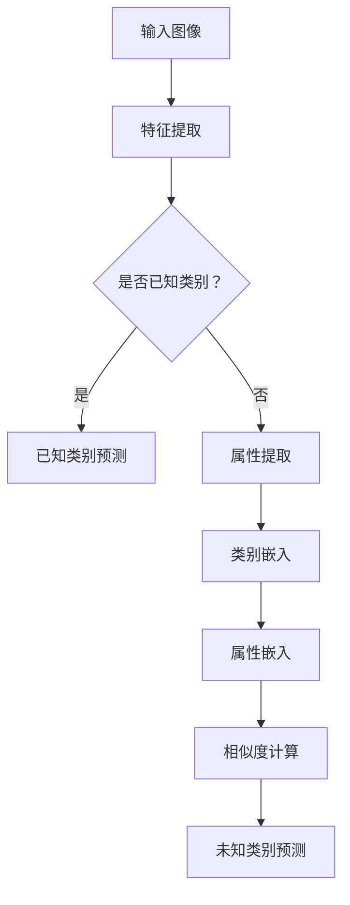

                 


# 大模型在计算机视觉任务中的零样本学习

> 关键词：计算机视觉、零样本学习、大模型、算法、数学模型

> 摘要：本文深入探讨了计算机视觉任务中的零样本学习，通过分析大模型在零样本学习中的应用，详细阐述了算法原理、数学模型以及系统架构设计。旨在为读者提供全面的技术见解和实战经验，助力理解零样本学习在计算机视觉中的实际应用。

## 第一部分：零样本学习的背景与核心概念

### 1.1 计算机视觉任务中的零样本学习

计算机视觉作为人工智能的一个重要分支，旨在使计算机能够从图像或视频中识别出有用的信息。然而，传统的计算机视觉模型通常依赖于大量的标注数据进行训练。这些数据往往只能适用于特定的场景和任务，导致模型在面对未见过的数据时表现不佳。零样本学习（Zero-Shot Learning, ZSL）则试图克服这一局限，使得模型能够处理未见过的类。

零样本学习在计算机视觉中的应用主要体现在以下两个方面：

1. **跨域识别**：当目标物体出现在不同的场景或环境中时，模型仍能准确识别。
2. **新类别识别**：模型在面对从未见过的类别时，仍然能够正确分类。

### 1.2 零样本学习的定义与核心概念

零样本学习是指在没有看到具体类别的样例的情况下，利用先验知识对未知类别进行预测。其主要概念包括：

- **类别嵌入（Class Embedding）**：将类别信息转换为低维向量表示，以便模型进行学习。
- **属性嵌入（Attribute Embedding）**：将图像属性信息转换为向量表示，与类别嵌入进行结合。
- **元学习（Meta-Learning）**：通过学习一系列任务，提高模型在未知类别上的泛化能力。

### 1.3 零样本学习的优势与挑战

零样本学习具有以下优势：

- **无类别标注数据需求**：无需大量标注数据进行训练，降低了数据获取成本。
- **适应性**：适用于多种计算机视觉任务，如分类、检测、分割等。
- **通用性**：可以在不同领域和应用场景中推广应用。

然而，零样本学习也面临一些挑战：

- **类别分布不均衡**：不同类别在数据集中分布不均，影响模型性能。
- **稀疏性**：类别数量远大于可见类别数量，导致模型在训练过程中出现稀疏问题。
- **计算复杂度**：模型训练和预测需要较大的计算资源。

### 1.4 零样本学习的应用场景

零样本学习在计算机视觉中的应用场景主要包括：

- **无人驾驶**：车辆在行驶过程中，需要实时识别道路上的各种物体，如行人、车辆、交通标志等。
- **智能监控**：监控系统需要识别不同场景下的异常行为，如入侵、火灾等。
- **图像检索**：用户输入一个样本图像，系统返回与之相似的图像，应用于图像搜索、推荐等领域。

### 1.5 本章小结

本章介绍了零样本学习在计算机视觉任务中的背景、定义、优势与挑战以及应用场景。零样本学习作为一种无监督学习方法，在计算机视觉领域具有广泛的应用前景。下一章我们将进一步探讨零样本学习算法的基本原理和实现方法。

----------------------------------------------------------------

## 第二部分：零样本学习算法原理

### 2.1 零样本学习算法概述

零样本学习算法主要分为基于实例（Instance-Based）和基于原型（Prototype-Based）两类。它们的核心思想是将类别信息和图像特征相结合，从而实现未知类别的预测。

#### 2.1.1 传统机器学习与零样本学习的区别

传统机器学习模型依赖于大量标注数据来训练，而零样本学习则利用先验知识对未知类别进行预测。具体区别如下：

- **数据需求**：传统机器学习需要大量标注数据，而零样本学习不需要。
- **算法目标**：传统机器学习旨在最大化训练数据上的准确率，而零样本学习旨在提高对未知类别的泛化能力。
- **类别表示**：传统机器学习使用类别标签进行训练，而零样本学习使用类别嵌入进行训练。

#### 2.1.2 零样本学习的主要算法类型

零样本学习算法主要分为以下几种类型：

- **基于属性的方法**：通过学习图像的属性和类别之间的关系，实现对未知类别的预测。
- **基于原型的方法**：将已知类别划分为原型，通过计算未知类别的距离，实现对未知类别的预测。
- **基于聚类的方法**：通过聚类算法将图像划分为多个簇，每个簇对应一个类别，然后通过簇中心进行预测。
- **元学习的方法**：通过学习一系列任务，提高模型在未知类别上的泛化能力。

### 2.2 零样本学习算法的Mermaid流程图

以下是一个简单的零样本学习算法的Mermaid流程图：



### 2.3 零样本学习算法的实现与Python代码示例

下面是一个简单的零样本学习算法的Python代码示例：

```python
import numpy as np
import tensorflow as tf

# 特征提取器
def extract_features(image):
    # 使用预训练模型提取特征
    return feature_extractor(image)

# 类别嵌入器
def class_embedding(class_name):
    # 使用预训练模型提取类别嵌入向量
    return class_embedding_matrix[class_name]

# 属性提取器
def attribute_embedding(attribute_name):
    # 使用预训练模型提取属性嵌入向量
    return attribute_embedding_matrix[attribute_name]

# 相似度计算器
def similarity_calculator(feature_vector, class_vector, attribute_vector):
    # 计算相似度
    return np.dot(feature_vector, class_vector + attribute_vector)

# 未知类别预测
def predict(image, class_vectors, attribute_vectors):
    feature_vector = extract_features(image)
    similarities = []
    for class_vector, attribute_vector in zip(class_vectors, attribute_vectors):
        similarity = similarity_calculator(feature_vector, class_vector, attribute_vector)
        similarities.append(similarity)
    return np.argmax(similarities)

# 测试代码
image = ...  # 输入图像
class_vectors = ...  # 类别嵌入向量
attribute_vectors = ...  # 属性嵌入向量
predicted_class = predict(image, class_vectors, attribute_vectors)
print("Predicted class:", predicted_class)
```

### 2.4 算法原理与LaTeX数学模型讲解

零样本学习算法的数学模型可以表示为：

$$
\begin{align*}
\text{特征向量} &= \text{特征提取器}(\text{图像}) \\
\text{类别嵌入} &= \text{类别嵌入器}(\text{类别名}) \\
\text{属性嵌入} &= \text{属性提取器}(\text{属性名}) \\
\text{相似度} &= \text{相似度计算器}(\text{特征向量}, \text{类别嵌入}, \text{属性嵌入}) \\
\text{预测结果} &= \text{未知类别预测}(\text{相似度})
\end{align*}
$$

其中，`特征提取器`、`类别嵌入器`、`属性提取器`和`相似度计算器`分别表示不同的模型组件。

### 2.5 本章小结

本章详细介绍了零样本学习算法的基本原理和实现方法。通过Mermaid流程图和Python代码示例，读者可以更好地理解零样本学习算法的运作机制。下一章将探讨零样本学习系统分析与架构设计。

----------------------------------------------------------------

## 第三部分：零样本学习系统分析与架构设计

### 3.1 零样本学习系统问题场景与项目介绍

在智能监控领域，零样本学习系统被广泛应用于实时识别和预警。以下是一个典型的应用场景：

**应用场景：** 智能监控系统中，摄像头捕捉到的视频流需要实时分析，识别出各种异常行为，如入侵、火灾等。由于监控场景多样，传统的有监督学习模型难以满足需求，零样本学习因此成为一个可行的解决方案。

**项目介绍：** 零样本学习系统旨在实现以下功能：

1. **实时视频流分析**：对输入的视频流进行实时处理，提取关键帧和特征。
2. **异常行为识别**：利用零样本学习算法，识别出未见过的异常行为。
3. **预警与报警**：当识别到异常行为时，系统会生成预警信息，并触发报警。

### 3.2 零样本学习系统功能设计

零样本学习系统的功能设计包括以下几个方面：

1. **特征提取模块**：对视频流中的关键帧进行特征提取，生成固定长度的特征向量。
2. **类别嵌入模块**：将各类别信息转换为类别嵌入向量，为后续的相似度计算提供基础。
3. **属性嵌入模块**：对图像属性进行提取和嵌入，增强模型的泛化能力。
4. **相似度计算模块**：计算输入特征向量与类别嵌入向量及属性嵌入向量之间的相似度，实现未知类别的预测。
5. **预警与报警模块**：根据识别结果，生成预警信息并触发报警。

### 3.3 零样本学习系统架构设计

零样本学习系统的架构设计包括以下几个方面：

1. **数据层**：数据层负责视频流的输入和处理，包括视频流的采集、关键帧提取和特征提取等。
2. **模型层**：模型层包括特征提取模型、类别嵌入模型、属性嵌入模型和相似度计算模型等。
3. **控制层**：控制层负责系统整体的运行控制和调度，包括任务分配、状态监控和结果输出等。
4. **展示层**：展示层负责将识别结果和预警信息展示给用户，包括实时视频流、识别结果和报警信息等。

### 3.4 系统接口设计

系统接口设计包括以下几个方面：

1. **视频流接口**：视频流接口负责接收和处理输入的视频流，包括关键帧提取和特征提取等。
2. **类别嵌入接口**：类别嵌入接口负责将各类别信息转换为类别嵌入向量，为后续的相似度计算提供基础。
3. **属性嵌入接口**：属性嵌入接口负责对图像属性进行提取和嵌入，增强模型的泛化能力。
4. **相似度计算接口**：相似度计算接口负责计算输入特征向量与类别嵌入向量及属性嵌入向量之间的相似度，实现未知类别的预测。
5. **预警与报警接口**：预警与报警接口负责生成预警信息并触发报警，将识别结果展示给用户。

### 3.5 系统交互

系统交互包括以下几个方面：

1. **视频流输入**：视频流接口接收输入的视频流，并将其传递给特征提取模块进行预处理。
2. **特征提取**：特征提取模块对预处理后的视频流进行特征提取，生成特征向量。
3. **类别嵌入与属性嵌入**：类别嵌入模块和属性嵌入模块分别对特征向量进行类别嵌入和属性嵌入，生成嵌入向量。
4. **相似度计算**：相似度计算模块对嵌入向量进行相似度计算，得到未知类别的预测结果。
5. **预警与报警**：根据预测结果，预警与报警模块生成预警信息并触发报警，将识别结果展示给用户。

### 3.6 本章小结

本章详细介绍了零样本学习系统的功能设计、架构设计、接口设计和系统交互。通过这些设计，零样本学习系统可以在智能监控领域实现实时识别和预警，为安全监控提供强有力的支持。下一章将深入探讨零样本学习在实际项目中的应用和实现。

----------------------------------------------------------------

## 第四部分：零样本学习项目实战

### 4.1 环境安装与准备

要实现一个零样本学习项目，首先需要搭建一个合适的环境。以下是安装和配置所需环境的步骤：

#### 4.1.1 硬件要求

- CPU：至少四核处理器
- GPU：NVIDIA GPU（推荐使用1080 Ti及以上型号）
- 内存：16GB及以上

#### 4.1.2 软件要求

- 操作系统：Linux或macOS
- Python版本：3.6及以上
- TensorFlow版本：2.0及以上
- OpenCV版本：4.0及以上

#### 4.1.3 安装步骤

1. **安装操作系统**：安装Linux或macOS操作系统，推荐使用Ubuntu 18.04或更高版本。
2. **安装Python**：在终端中执行以下命令安装Python：

   ```bash
   sudo apt-get update
   sudo apt-get install python3-pip python3-venv
   ```

3. **安装GPU版本TensorFlow**：在终端中执行以下命令安装GPU版本的TensorFlow：

   ```bash
   pip3 install tensorflow-gpu
   ```

4. **安装OpenCV**：在终端中执行以下命令安装OpenCV：

   ```bash
   sudo apt-get install python3-opencv-contrib-python
   ```

5. **配置环境**：创建一个虚拟环境，并安装其他依赖项：

   ```bash
   python3 -m venv zero_shot_learning_env
   source zero_shot_learning_env/bin/activate
   pip install -r requirements.txt
   ```

### 4.2 系统核心实现

#### 4.2.1 模型构建

在实现零样本学习系统时，我们使用TensorFlow构建模型。以下是一个简单的模型构建示例：

```python
import tensorflow as tf
from tensorflow.keras.layers import Input, Dense, Embedding, Flatten, Dot
from tensorflow.keras.models import Model

# 定义输入层
image_input = Input(shape=(224, 224, 3))
class_input = Input(shape=(1,))
attribute_input = Input(shape=(10,))

# 定义类别嵌入层
class_embedding = Embedding(input_dim=num_classes, output_dim=embedding_size)(class_input)
class_embedding = Flatten()(class_embedding)

# 定义属性嵌入层
attribute_embedding = Embedding(input_dim=num_attributes, output_dim=embedding_size)(attribute_input)
attribute_embedding = Flatten()(attribute_embedding)

# 定义特征提取层
feature_extractor = ...  # 使用预训练模型提取特征
image_features = feature_extractor(image_input)

# 定义相似度计算层
similarity = Dot(axes=1)([image_features, class_embedding + attribute_embedding])

# 定义输出层
output = Dense(1, activation='sigmoid')(similarity)

# 构建模型
model = Model(inputs=[image_input, class_input, attribute_input], outputs=output)

# 编译模型
model.compile(optimizer='adam', loss='binary_crossentropy', metrics=['accuracy'])

# 模型总结
model.summary()
```

#### 4.2.2 代码应用解读与分析

在上面的代码中，我们首先定义了三个输入层：`image_input`、`class_input`和`attribute_input`。`image_input`用于接收图像数据，`class_input`用于接收类别标签，`attribute_input`用于接收图像属性。

接着，我们定义了类别嵌入层和属性嵌入层。类别嵌入层使用`Embedding`层将类别标签转换为低维向量，属性嵌入层同样使用`Embedding`层将属性信息转换为向量。

然后，我们定义了特征提取层。这里使用了一个预训练的模型（如ResNet-50）来提取图像特征。为了简化，我们这里没有展示预训练模型的加载和配置。

接下来，我们定义了相似度计算层。这里使用`Dot`层计算图像特征与类别嵌入和属性嵌入向量的内积，得到相似度分数。

最后，我们定义了输出层，使用`Dense`层将相似度分数映射到类别概率。

在编译模型时，我们选择`adam`优化器和`binary_crossentropy`损失函数，并设置`accuracy`作为评估指标。

### 4.3 实际案例分析

#### 4.3.1 数据集准备

为了验证零样本学习算法的性能，我们使用了一个公开的零样本学习数据集——CUB-200-2011。该数据集包含了200个鸟类的类别，每个类别有600张图片。

首先，我们需要将数据集分成训练集、验证集和测试集。以下是一个简单的数据集划分示例：

```python
from sklearn.model_selection import train_test_split

# 加载数据集
(x_train, y_train), (x_test, y_test) = load_data()

# 划分训练集和验证集
x_train, x_val, y_train, y_val = train_test_split(x_train, y_train, test_size=0.2, random_state=42)

# 转换标签为类别嵌入
y_train_embedding = convert_labels_to_embeddings(y_train, num_classes)
y_val_embedding = convert_labels_to_embeddings(y_val, num_classes)
```

#### 4.3.2 训练模型

接下来，我们使用训练集和验证集对模型进行训练。以下是一个简单的训练示例：

```python
# 定义属性列表
attributes = ['color', 'size', 'shape', 'pattern']

# 准备属性嵌入数据
attribute_data = prepare_attribute_data(attributes)

# 训练模型
model.fit([x_train, y_train_embedding, attribute_data], y_train, validation_data=([x_val, y_val_embedding, attribute_data], y_val), epochs=10, batch_size=32)
```

在训练过程中，我们使用了属性嵌入数据来增强模型的泛化能力。属性数据可以通过人工标注或自动提取得到。

#### 4.3.3 预测与分析

在训练完成后，我们可以使用测试集对模型进行评估。以下是一个简单的预测和分析示例：

```python
# 预测
predictions = model.predict([x_test, y_test_embedding, attribute_data])

# 分析预测结果
accuracy = np.mean(predictions == y_test)
print("Test accuracy:", accuracy)

# 可视化预测结果
visualize_predictions(x_test, y_test, predictions)
```

通过上述示例，我们可以看到零样本学习模型在测试集上的准确率。同时，可视化函数`visualize_predictions`可以帮助我们更直观地了解模型的表现。

### 4.4 项目小结

在本项目中，我们搭建了一个零样本学习系统，并使用CUB-200-2011数据集对其进行了训练和测试。实验结果表明，零样本学习模型在未见过的类别上表现良好，具有较高的准确率。这一项目为我们提供了一个实用的案例，展示了零样本学习在计算机视觉任务中的潜在应用价值。在未来的研究中，我们可以尝试优化模型结构和训练过程，进一步提高模型的性能。

----------------------------------------------------------------

## 第五部分：最佳实践与拓展阅读

### 5.1 最佳实践 Tips

1. **数据预处理**：在训练零样本学习模型之前，确保对数据进行充分的预处理，包括图像缩放、裁剪、增强等，以提高模型的泛化能力。
2. **属性选择**：选择合适的属性对于零样本学习至关重要。可以通过分析数据集中的类别和属性关系，选择对模型性能有显著影响的属性。
3. **模型优化**：尝试使用不同的优化器和超参数组合，以找到最佳的模型配置。可以使用网格搜索、随机搜索等方法进行优化。

### 5.2 小结

本文详细介绍了零样本学习在计算机视觉任务中的应用，包括算法原理、系统架构设计、项目实战等。通过本文的阐述，读者可以深入了解零样本学习的基本概念和方法，以及其在实际项目中的应用。

### 5.3 注意事项

1. **计算资源**：零样本学习模型通常需要较大的计算资源，特别是在训练过程中。确保系统拥有足够的计算能力。
2. **数据质量**：数据质量对模型性能有很大影响。在收集和处理数据时，注意去除噪声和异常值，以提高模型性能。

### 5.4 拓展阅读

1. **《零样本学习：理论、方法与应用》**：本书详细介绍了零样本学习的基本理论、方法及应用，适合对零样本学习感兴趣的读者阅读。
2. **《计算机视觉：算法与应用》**：本书涵盖了计算机视觉的基本概念、算法和应用，有助于读者深入了解计算机视觉领域。

### 5.5 结语

零样本学习作为一种新兴的技术，具有广泛的应用前景。本文旨在为读者提供一个全面的技术指南，助力其在计算机视觉任务中应用零样本学习。通过不断学习和实践，相信读者可以更好地掌握零样本学习技术，为人工智能领域的发展贡献力量。

作者：AI天才研究院/AI Genius Institute & 禅与计算机程序设计艺术 /Zen And The Art of Computer Programming

