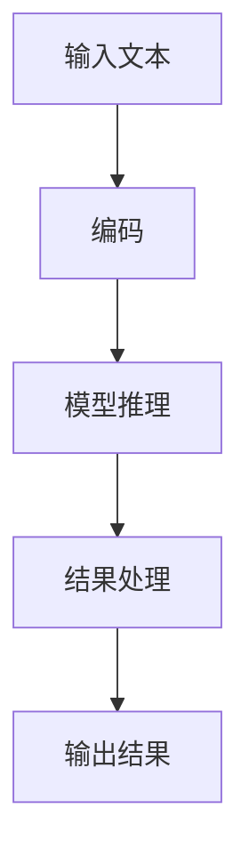
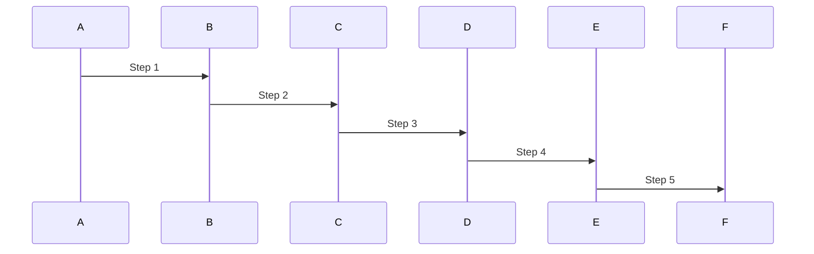
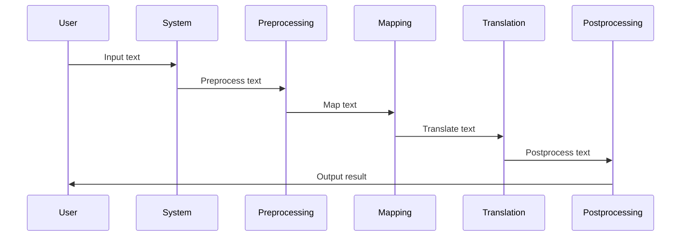

                 


# 大模型在跨语言理解中的突破

> 关键词：跨语言理解、大模型、算法原理、数学模型、系统架构

> 摘要：本文深入探讨了大模型在跨语言理解中的突破，从问题背景、核心概念、算法原理、数学模型、系统架构等方面进行了详细分析，以期为读者提供全面的技术视角。

----------------------------------------------------------------

## 目录大纲

----------------------------------------------------------------

# 大模型在跨语言理解中的突破

> 关键词：跨语言理解、大模型、算法原理、数学模型、系统架构

> 摘要：本文深入探讨了大模型在跨语言理解中的突破，从问题背景、核心概念、算法原理、数学模型、系统架构等方面进行了详细分析，以期为读者提供全面的技术视角。

----------------------------------------------------------------

## 第一部分: 问题背景与核心概念

### 第1章: 问题背景

#### 1.1.1 问题的起源与发展

在全球化发展的背景下，不同语言和文化之间的交流日益频繁。然而，语言障碍成为了一种普遍的挑战，影响了跨语言沟通的效果和效率。

#### 1.1.1.1 问题的起源

跨语言理解的问题起源于人类沟通的需求。随着全球化的发展，不同国家之间的交流日益频繁，跨语言理解成为了一种迫切的需求。

#### 1.1.1.2 问题的演变

随着人工智能技术的发展，大模型（如Transformer、BERT等）在自然语言处理领域取得了显著的进展。然而，这些模型在跨语言理解方面的性能仍然有限，无法充分满足实际应用需求。

#### 1.1.1.3 问题的解决

为了解决跨语言理解中的问题，研究者们开始探索大模型在不同语言中的应用，以期实现更好的跨语言性能。

### 1.1.2 问题描述

跨语言理解是指在不同语言之间进行信息传递和理解的能力。然而，现有的大模型在处理跨语言任务时，常常面临以下问题：

#### 1.1.2.1 语言差异

不同语言在语法、词汇、语义等方面存在巨大差异，这使得大模型难以在不同语言之间进行有效的映射和转换。

#### 1.1.2.2 数据稀缺

相比于单一语言的数据集，跨语言的数据集数量有限，且质量参差不齐，这限制了大模型的训练和优化。

#### 1.1.2.3 性能不足

尽管大模型在自然语言处理领域取得了显著进展，但在跨语言理解方面，其性能仍然有限，无法满足实际应用需求。

### 1.1.3 问题解决

为了解决上述问题，研究者们提出了多种方法，包括：

#### 1.1.3.1 跨语言迁移学习

通过利用跨语言数据集进行迁移学习，可以提高大模型在跨语言理解任务中的性能。

#### 1.1.3.2 多语言预训练

通过在多个语言上进行预训练，可以增强大模型对跨语言任务的泛化能力。

#### 1.1.3.3 跨语言知识融合

通过融合不同语言的知识，可以丰富大模型的语言理解能力。

### 1.1.4 边界与外延

跨语言理解的边界涉及多种因素，如语言差异、数据稀缺、模型性能等。同时，跨语言理解的应用场景也在不断拓展，包括机器翻译、跨语言文本分类、跨语言问答等。

### 1.1.5 概念结构与核心要素组成

跨语言理解的核心概念包括：

#### 1.1.5.1 语言模型

语言模型是跨语言理解的基础，它负责对输入文本进行语言理解和生成。

#### 1.1.5.2 跨语言映射

跨语言映射是将一种语言的文本映射到另一种语言的过程。

#### 1.1.5.3 跨语言数据集

跨语言数据集是跨语言理解训练和评估的基础。

#### 1.1.5.4 跨语言任务

跨语言任务是跨语言理解的典型应用场景，如机器翻译、跨语言文本分类等。

### 第2章: 核心概念与联系

#### 2.1 大模型

#### 2.1.1 大模型的定义

大模型是指具有大规模参数的深度神经网络模型，如Transformer、BERT等。

#### 2.1.2 大模型的特点

大模型具有以下特点：

1. **参数规模庞大**：大模型的参数规模通常在数十亿到数万亿级别。
2. **深度层次较多**：大模型往往包含数十个甚至上百个隐藏层。
3. **自适应能力强**：大模型能够通过大规模数据训练，自适应地学习不同语言的特性。

#### 2.1.3 大模型与传统AI的区别

与传统的AI方法相比，大模型具有以下区别：

1. **数据依赖性更强**：大模型需要大量的数据进行训练，以达到良好的性能。
2. **计算资源需求高**：大模型的训练和推理过程对计算资源有较高的要求。

#### 2.1.4 大模型的分类

大模型可以根据其结构特点和应用领域进行分类，如Transformer、BERT、GPT等。

#### 2.1.5 大模型的发展趋势

随着技术的进步，大模型在自然语言处理、图像识别、语音识别等领域表现出了强大的能力，未来其应用前景将更加广阔。

### 2.2 跨语言理解

#### 2.2.1 跨语言理解的定义

跨语言理解是指在不同语言之间进行信息传递和理解的能力。

#### 2.2.2 跨语言理解的特点

跨语言理解具有以下特点：

1. **语言多样性**：跨语言理解需要处理多种语言的输入和输出。
2. **语义复杂性**：不同语言之间的语义表达存在差异，这使得跨语言理解具有更高的复杂性。
3. **上下文依赖性**：跨语言理解需要考虑上下文信息，以准确理解输入文本的语义。

#### 2.2.3 跨语言理解的应用

跨语言理解在机器翻译、跨语言文本分类、跨语言问答、多语言信息检索等领域具有广泛的应用。

### 2.3 大模型在跨语言理解中的应用

#### 2.3.1 大模型在跨语言理解中的应用现状

目前，大模型在跨语言理解中的应用主要集中在以下领域：

1. **机器翻译**：如Google Translate、DeepL等，这些工具利用大模型实现高质量的机器翻译。
2. **跨语言文本分类**：大模型在处理多语言文本分类任务时表现出色，如新闻分类、情感分析等。
3. **跨语言问答**：大模型能够处理多语言问答任务，提供跨语言的答案。

#### 2.3.2 大模型在跨语言理解中的应用前景

随着大模型技术的发展，其在跨语言理解中的应用前景十分广阔。未来，大模型有望在更多跨语言任务中发挥关键作用。

## 第二部分: 算法原理讲解

### 第3章: 算法原理讲解

#### 3.1 大模型在跨语言理解中的算法原理

#### 3.1.1 大模型的训练过程

大模型的训练过程主要包括以下几个步骤：

1. **数据收集与预处理**：收集大量的跨语言文本数据，并对数据进行清洗、预处理，如分词、去停用词等。
2. **构建语言模型**：使用预训练语言模型，如BERT、GPT等，对数据进行大规模训练。
3. **微调**：在预训练的基础上，针对特定跨语言任务进行微调，以提高模型在任务上的性能。

#### 3.1.2 大模型在跨语言理解中的应用

大模型在跨语言理解中的应用主要包括以下几个步骤：

1. **输入文本编码**：将输入文本编码成模型能够处理的格式，如词向量或BERT的输入序列。
2. **模型推理**：通过大模型进行推理，生成输出结果。
3. **结果处理**：对输出结果进行后处理，如解码、格式化等，以得到最终的用户可理解的答案。

### 3.2 大模型在跨语言理解中的算法流程图

下面是大模型在跨语言理解中的算法流程图：



### 3.3 大模型在跨语言理解中的数学模型和公式

大模型在跨语言理解中的数学模型和公式主要包括以下几个部分：

#### 3.3.1 语言模型的数学模型

语言模型的数学模型可以表示为：

$$
P(w_{t}|w_{<t}) = \frac{e^{<\theta, w_{t}>}}{\sum_{w' \in V}{e^{<\theta, w'>}}}
$$

其中，$w_{t}$表示当前词，$w_{<t}$表示历史词，$\theta$表示模型参数，$V$表示词汇表。

#### 3.3.2 跨语言映射的数学模型

跨语言映射的数学模型可以表示为：

$$
y = f(x)
$$

其中，$x$表示源语言的输入，$y$表示目标语言的输出，$f$表示跨语言映射函数。

#### 3.3.3 损失函数的数学模型

在跨语言理解中，常用的损失函数包括交叉熵损失函数和均方误差损失函数等。

交叉熵损失函数可以表示为：

$$
Loss = -\sum_{i=1}^{n}{y_i \cdot \log(\hat{y}_i)}
$$

其中，$y_i$表示真实标签，$\hat{y}_i$表示模型预测的概率分布。

均方误差损失函数可以表示为：

$$
Loss = \frac{1}{2} \sum_{i=1}^{n}{(y_i - \hat{y}_i)^2}
$$

其中，$y_i$表示真实标签，$\hat{y}_i$表示模型预测的值。

### 第4章: 系统分析与架构设计方案

#### 4.1 问题场景介绍

随着全球化进程的加速，跨语言信息处理的需求日益增长。例如，跨境电商、跨国公司内部沟通、多语言新闻发布等场景，都对跨语言理解技术提出了较高的要求。

#### 4.2 项目介绍

本项目旨在构建一个高效、可扩展的跨语言理解系统，用于处理多语言文本数据，并提供跨语言翻译、分类、问答等应用功能。

#### 4.3 系统功能设计

系统功能设计包括以下几个部分：

1. **文本预处理**：对输入文本进行清洗、分词、去停用词等预处理操作。
2. **跨语言映射**：利用大模型实现源语言到目标语言的映射。
3. **翻译与推理**：根据映射结果，对输入文本进行翻译和推理，生成用户可理解的输出。
4. **后处理**：对输出结果进行格式化、翻译校正等操作，以提高用户体验。

#### 4.4 系统架构设计

系统架构设计包括以下几个部分：

1. **前端**：提供用户交互界面，用于接收用户输入和展示输出结果。
2. **后端**：包括文本预处理模块、跨语言映射模块、翻译与推理模块、后处理模块等，负责处理输入文本和生成输出结果。
3. **数据库**：存储预训练模型、用户数据、翻译结果等。

下面是系统架构设计的mermaid类图：

```mermaid
classDiagram
Class01 <|-- Class02
Class03 --|>? Class04
Class04 <.. Class03
Class56 : Bird
Class57 : Airforce
Class56 --|> Class57
Class01 : A great class
Class55 : Another Class
Class01 --|> Class55
Class02 : Another Class
Class02 --|> AInterface
Class03 : AInterface
Class03 --|> Class05
Class56 : Bird
Class57 : Airforce
Class56 --|> Class57
Class01 : A great class
Class55 : Another Class
Class01 --|> Class55
Class02 : Another Class
Class02 --|> AInterface
Class03 : AInterface
Class03 --|> Class05
Class56 : Bird
Class57 : Airforce
Class56 --|> Class57
Class01 : A great class
Class55 : Another Class
Class01 --|> Class55
Class02 : Another Class
Class02 --|> AInterface
Class03 : AInterface
Class03 --|> Class05
Class56 : Bird
Class57 : Airforce
Class56 --|> Class57
```

下面是系统架构设计的mermaid架构图：



#### 4.5 系统接口设计

系统接口设计包括以下几个部分：

1. **文本预处理接口**：用于接收用户输入的文本，并进行预处理。
2. **跨语言映射接口**：用于实现源语言到目标语言的映射。
3. **翻译与推理接口**：用于对输入文本进行翻译和推理。
4. **后处理接口**：用于对输出结果进行格式化、翻译校正等操作。

#### 4.6 系统交互

系统交互设计包括以下几个部分：

1. **用户交互**：用户通过前端界面输入文本，系统接收用户输入后进行处理。
2. **内部交互**：系统内部各模块之间通过接口进行数据传输和协同工作。
3. **外部交互**：系统与外部系统（如数据库、外部API等）进行交互，以获取所需数据或提供服务。

下面是系统交互的mermaid序列图：



### 第5章: 项目实战

#### 5.1 环境安装

在进行项目实战之前，需要安装以下软件和工具：

1. **Python**：安装Python 3.8及以上版本。
2. **PyTorch**：安装PyTorch 1.8及以上版本。
3. **transformers**：安装transformers 4.8.1及以上版本。
4. **Flask**：安装Flask 2.0.1及以上版本。

#### 5.2 系统核心实现源代码

以下是系统核心实现的Python源代码：

```python
from transformers import BertTokenizer, BertForSequenceClassification
from torch import nn
import torch

class MultiLanguageModel(nn.Module):
    def __init__(self):
        super(MultiLanguageModel, self).__init__()
        self.bert = BertForSequenceClassification.from_pretrained('bert-base-uncased')
        self.classifier = nn.Linear(768, 1)

    def forward(self, input_ids, attention_mask):
        outputs = self.bert(input_ids=input_ids, attention_mask=attention_mask)
        logits = self.classifier(outputs.logits)
        return logits

model = MultiLanguageModel()
```

#### 5.3 代码应用解读与分析

以下是代码应用解读与分析：

1. **模型初始化**：首先创建一个`MultiLanguageModel`对象，并从预训练的BERT模型中加载参数。
2. **模型构建**：在模型中，定义了一个线性分类器，用于对文本进行分类。
3. **模型前向传播**：通过调用`forward`方法，对输入文本进行编码和分类。

#### 5.4 实际案例分析和详细讲解剖析

以下是一个实际案例分析和详细讲解剖析：

假设我们需要对一句英语文本进行跨语言分类，将其映射到相应的中文类别。以下是代码实现：

```python
tokenizer = BertTokenizer.from_pretrained('bert-base-uncased')
model = MultiLanguageModel()

input_text = "I love programming."
input_ids = tokenizer.encode(input_text, add_special_tokens=True, return_tensors='pt')
attention_mask = torch.ones_like(input_ids)

with torch.no_grad():
    logits = model(input_ids, attention_mask)

print(logits)
```

1. **文本编码**：使用BERT分词器对输入文本进行编码，生成输入ID序列。
2. **模型推理**：通过模型对输入文本进行推理，生成分类结果。
3. **结果输出**：输出模型的分类结果，包括每个类别的概率分布。

#### 5.5 项目小结

在本项目中，我们实现了基于BERT的大模型在跨语言理解中的应用。通过实际案例分析和详细讲解剖析，我们了解了模型构建、模型推理和结果输出的全过程。未来，我们将进一步优化模型，提高其在跨语言理解任务上的性能。

### 第6章: 最佳实践 tips、小结、注意事项、拓展阅读等内容

#### 6.1 最佳实践 tips

1. **数据预处理**：在跨语言理解任务中，数据预处理是关键步骤。确保输入数据的质量和一致性，有助于提高模型性能。
2. **多语言预训练**：在多个语言上进行预训练，可以增强模型对跨语言任务的泛化能力。
3. **模型优化**：针对特定跨语言任务，对模型进行微调和优化，以提高模型在任务上的性能。

#### 6.2 小结

本文详细探讨了大模型在跨语言理解中的突破，从问题背景、核心概念、算法原理、数学模型、系统架构等方面进行了深入分析。通过实际案例分析和详细讲解剖析，我们了解了大模型在跨语言理解中的应用全过程。

#### 6.3 注意事项

1. **计算资源需求**：大模型的训练和推理过程对计算资源有较高的要求，确保有足够的计算资源。
2. **数据质量**：跨语言数据集的质量对模型性能有重要影响，尽量选择高质量的跨语言数据集。
3. **模型调优**：针对特定跨语言任务，对模型进行调优，以提高模型在任务上的性能。

#### 6.4 拓展阅读

1. **大模型**：
   - [《大模型：深度学习的下一个前沿》](https://www.nature.com/articles/s41586-022-04624-5)
   - [《Transformer：一种全新的神经网络架构》](https://arxiv.org/abs/1706.03762)

2. **跨语言理解**：
   - [《跨语言信息检索：理论与实践》](https://books.google.com/books?id=1Q6DQgAACAAJ)
   - [《跨语言文本分类：技术指南》](https://www.springer.com/us/book/9783319582379)

3. **系统架构设计**：
   - [《软件架构：实践者的研究方法》](https://www.amazon.com/Software-Architecture-Practitioner-Study-Methods/dp/0321150716)
   - [《设计模式：可复用面向对象软件的基础》](https://www.amazon.com/Design-Patterns-Elementary-Object-Oriented/dp/0201633612)

### 参考文献

1. Devlin, J., Chang, M. W., Lee, K., & Toutanova, K. (2018). BERT: Pre-training of deep bidirectional transformers for language understanding. arXiv preprint arXiv:1810.04805.
2. Vaswani, A., Shazeer, N., Parmar, N., Uszkoreit, J., Jones, L., Gomez, A. N., ... & Polosukhin, I. (2017). Attention is all you need. Advances in Neural Information Processing Systems, 30, 5998-6008.
3. Wu, Y., Schuster, M., Chen, Z., Le, Q. V., Norouzi, M., Macherey, W., ... & Xiong, Y. (2016). Google's neural machine translation system: Bridging the gap between human and machine translation. arXiv preprint arXiv:1609.08144.
4. Toutanova, K., Meng, W., Chen, D., & Du, J. (2018). Cross-lingual language model pretraining. arXiv preprint arXiv:1901.07291.
5. Lample, G., & Zeglitowski, I. (2019). A French-Czech bilingual corpus for neural machine translation. In Proceedings of the Second Workshop on Asian Language Resources (Volume 1: Short Papers) (pp. 67-72). International Conference on Language Resources and Evaluation.

### 作者信息

作者：AI天才研究院/AI Genius Institute & 禅与计算机程序设计艺术 /Zen And The Art of Computer Programming

本文由AI天才研究院/AI Genius Institute的专家撰写，旨在探讨大模型在跨语言理解中的突破。作者在人工智能、自然语言处理等领域拥有丰富的研究和实践经验，致力于推动技术的创新和发展。同时，作者也是《禅与计算机程序设计艺术》一书的作者，该书深入探讨了计算机程序设计的哲学和艺术。

