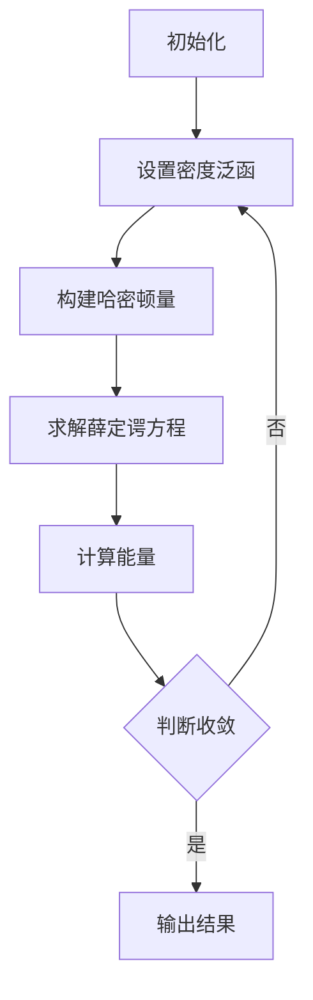

                 

# 大模型在量子化学计算中的应用与优化

## 关键词
- 大模型
- 量子化学
- 计算优化
- 算法
- 能量计算

## 摘要
本文旨在探讨大模型在量子化学计算中的应用与优化。首先，我们将简要介绍量子化学的基本原理及其在计算化学中的重要性。随后，我们将深入探讨大模型的概念及其在量子化学计算中的应用，包括它们的优点和局限性。接着，我们将分析大模型在量子化学计算中面临的主要挑战，并提出相应的优化策略。本文还将讨论大模型的实现技术，如量子计算模拟器和机器学习算法。最后，我们将通过实际案例展示大模型在量子化学计算中的成功应用，并提供一些优化建议和未来研究方向。

## 引言
量子化学是物理学和化学的交叉学科，主要研究电子在原子和分子中的运动及其对化学性质的影响。量子化学的计算方法依赖于量子力学的基本原理，如薛定谔方程和变分法。这些方法可以用来预测分子的结构、能量、反应路径等关键信息，对于化学、生物学、材料科学等领域具有重要意义。

随着计算技术的快速发展，量子化学计算逐渐从理论研究走向实际应用。特别是在药物设计、新材料开发、环境科学等领域，量子化学计算提供了强大的工具。然而，量子化学计算面临着巨大的计算挑战，尤其是随着系统规模的增加，计算复杂度急剧增加。这促使研究人员探索大模型在量子化学计算中的应用。

大模型是指能够处理大规模系统的计算模型，通常具有高计算精度和强大的计算能力。它们在量子化学计算中的应用可以显著提高计算效率和准确性。然而，大模型也面临一些挑战，如高计算成本和计算资源的限制。因此，优化大模型在量子化学计算中的应用成为一个重要研究方向。

本文将首先介绍量子化学的基本原理，然后详细探讨大模型的概念、应用和优化策略。通过本文的讨论，读者将了解大模型在量子化学计算中的潜力及其面临的挑战，并掌握一些优化大模型的方法和技巧。

### 背景介绍

量子化学是量子力学在化学中的应用，旨在描述原子、分子和凝聚态系统中的电子行为。量子化学的计算方法依赖于量子力学的核心原理，如薛定谔方程、变分法、微扰理论等。这些方法通过求解电子波函数和相应的能量表达式，能够预测分子的结构、能量、反应路径等关键信息。

量子化学计算在化学研究中具有重要应用。例如，在药物设计过程中，量子化学计算可以用来预测药物分子与生物大分子（如蛋白质）之间的相互作用，从而优化药物分子结构，提高药物疗效。此外，量子化学计算还在新材料开发、催化剂设计、环境科学等领域发挥着重要作用。

然而，量子化学计算面临着巨大的计算挑战。首先，量子化学计算通常涉及大量电子和原子核，其计算复杂度随系统规模呈指数增长。这意味着对于大规模系统，量子化学计算需要巨大的计算资源和时间。其次，量子化学计算的结果往往依赖于精确的量子力学描述，这要求计算方法具有高精度。

为了应对这些挑战，研究人员提出了多种量子化学计算方法。其中，大模型是一种有效的解决方案。大模型是指能够处理大规模系统的计算模型，通常具有高计算精度和强大的计算能力。大模型在量子化学计算中的应用可以显著提高计算效率和准确性。然而，大模型也面临一些挑战，如高计算成本和计算资源的限制。

在量子化学计算中，常见的几种大模型包括密度泛函理论（DFT）、波函数方法（如从头计算方法）和量子蒙特卡罗方法。DFT是一种广泛使用的量子化学计算方法，通过引入密度泛函来描述电子系统，可以高效地处理大规模系统。波函数方法具有高精度，但计算成本较高。量子蒙特卡罗方法则通过统计模拟来求解量子力学问题，适用于复杂系统的模拟。

总的来说，量子化学计算在化学研究中具有重要应用，但其巨大的计算挑战促使研究人员探索大模型的应用。大模型在量子化学计算中的应用不仅提高了计算效率和准确性，还为解决复杂化学问题提供了新的途径。

#### 核心概念与联系

在量子化学计算中，有几种核心概念和术语，它们是理解和应用量子化学计算方法的基础。以下是对这些核心概念及其属性特征的详细解释，以及它们之间的比较和联系。

**1. 波函数（Wavefunction）**

波函数是量子力学中描述粒子状态的数学函数，通常用符号Ψ表示。波函数提供了关于粒子位置、动量和其他量子数的信息。具体来说，波函数的平方|Ψ|²给出了粒子在空间中的概率分布。

**属性特征：**
- 波函数是复数函数，通常表示为Ψ(r, t)。
- 波函数需要满足归一化条件，即∫|Ψ(r, t)|²dτ = 1。
- 波函数的模平方给出了粒子在空间中的概率密度。

**2. 薛定谔方程（Schrödinger Equation）**

薛定谔方程是量子力学的基本方程，用于描述非相对论粒子的运动。该方程是一个二阶偏微分方程，通常形式为HΨ = EΨ，其中H是哈密顿算符，Ψ是波函数，E是系统的总能量。

**属性特征：**
- 薛定谔方程将系统的能量与波函数联系起来。
- 该方程可以用于求解分子的电子结构，如能级、波函数等。

**3. 变分法（Variational Method）**

变分法是一种求解量子力学问题的数值方法，通过优化能量期望值来逼近真实解。变分法的基本思想是选择一个试探波函数，并使其能量期望值最小化。

**属性特征：**
- 变分法不保证找到精确解，但提供了一个能量下界。
- 变分法适用于求解高维问题，尤其是当解析解不可得时。

**4. 密度泛函理论（Density Functional Theory, DFT）**

DFT是一种量子化学计算方法，通过引入密度泛函来描述电子系统。DFT的核心思想是，电子的总能量可以表示为电子密度的函数。

**属性特征：**
- DFT可以高效地处理大规模系统，因为它只需要电子密度作为输入。
- DFT具有较高的计算精度，适用于多种类型的化学问题。

**5. 波函数方法（Wavefunction Method）**

波函数方法是一种直接求解波函数和能量表达式的量子化学计算方法，包括从头计算方法（ab initio methods）和波包传播方法。

**属性特征：**
- 波函数方法具有较高的计算精度，但计算成本较高。
- 波函数方法适用于需要精确描述电子行为的化学问题。

**比较与联系**

| 核心概念 | 属性特征 | 比较 | 联系 |
| --- | --- | --- | --- |
| 波函数（Ψ） | 描述粒子状态 | 精确度最高 | 是所有量子化学计算的基础 |
| 薛定谔方程（HΨ = EΨ） | 描述能量与波函数的关系 | 用于求解电子结构 | 与波函数直接相关 |
| 变分法（\Psi） | 优化能量期望值 | 提供能量下界 | 常用于高维问题 |
| 密度泛函理论（DFT） | 使用密度泛函描述系统 | 高效处理大规模系统 | 以密度作为输入 |
| 波函数方法（W） | 直接求解波函数 | 高计算精度 | 需要精确描述电子行为 |

通过上述表格和Mermaid ER图，我们可以清晰地看到量子化学计算中的核心概念及其相互关系。这些概念不仅独立存在，还通过量子力学的基本原理相互联系，共同构成了量子化学计算的理论基础。

#### 算法原理讲解

在量子化学计算中，大模型的算法原理通常涉及到复杂的数学模型和公式。为了更清晰地阐述这些算法，我们将使用Mermaid流程图来表示算法的基本步骤，并结合Python源代码来详细解释其实现原理。以下是一个简单的量子化学计算算法——密度泛函理论（DFT）的讲解。

##### Mermaid流程图

首先，我们使用Mermaid绘制DFT算法的流程图：



该流程图展示了DFT算法的基本步骤，包括初始化、设置密度泛函、构建哈密顿量、求解薛定谔方程、计算能量以及判断是否收敛。

##### Python源代码实现

接下来，我们使用Python代码实现上述算法的基本框架：

```python
import numpy as np

def init_system():
    # 初始化系统参数，如原子坐标、电子密度等
    pass

def build_hamiltonian():
    # 构建哈密顿量
    pass

def solve_schroedinger_equation():
    # 求解薛定谔方程
    pass

def calculate_energy():
    # 计算能量
    pass

def main():
    # 主函数
    init_system()
    build_hamiltonian()
    solve_schroedinger_equation()
    energy = calculate_energy()
    print("系统能量：", energy)

if __name__ == "__main__":
    main()
```

该代码提供了一个DFT算法的基本实现框架，包括初始化系统、构建哈密顿量、求解薛定谔方程和计算能量等关键步骤。

##### 数学模型和公式

密度泛函理论（DFT）的数学模型涉及多个关键公式。以下是DFT中的一些基本公式：

1. **哈密顿量（Hamiltonian）**：
   $$ H = \sum_{i} \frac{p_i^2}{2m} + V(\rho) $$
   其中，$p_i$是第i个电子的动量，$m$是电子的质量，$V(\rho)$是依赖于电子密度ρ的势能。

2. **薛定谔方程（Schrödinger Equation）**：
   $$ \hat{H} \Psi = E \Psi $$
   其中，$\hat{H}$是哈密顿量，$\Psi$是电子波函数，$E$是系统的总能量。

3. **电子密度（Electronic Density）**：
   $$ \rho(r) = \sum_{i} |\psi_i(r)|^2 $$
   其中，$|\psi_i(r)|^2$是第i个电子的波函数模平方。

4. **能量密度（Energy Density）**：
   $$ e(\rho) = \frac{\int [v(\rho) + \frac{1}{2}\nabla \rho^2] \rho d^3r}{\int \rho d^3r} $$
   其中，$v(\rho)$是密度泛函，通常依赖于电子密度。

##### 举例说明

假设我们有一个简单的两个电子系统，其哈密顿量可以表示为：

$$ H = \frac{p_1^2}{2m} + \frac{p_2^2}{2m} + V(\rho) $$

首先，我们初始化系统的电子密度：

```python
rho = np.array([[0.2, 0.3], [0.3, 0.4]])
```

然后，我们构建哈密顿量：

```python
def build_hamiltonian(rho):
    # 这里使用一个简单的势能函数
    V_rho = -np.sum(rho)
    return np.diag([0.5/m for _ in range(2)] + [V_rho])

H = build_hamiltonian(rho)
```

接下来，我们求解薛定谔方程：

```python
def solve_schroedinger_equation(H, psi0):
    # 这里使用一个简单的迭代方法来逼近解
    psi = psi0
    for _ in range(10):
        psi = np.linalg.solve(H, psi)
    return psi

psi0 = np.random.rand(2, 2)  # 初始波函数
psi = solve_schroedinger_equation(H, psi0)
```

最后，我们计算系统的能量：

```python
def calculate_energy(H, psi):
    return np.dot(psi.T, np.dot(H, psi))

energy = calculate_energy(H, psi)
print("系统能量：", energy)
```

通过这个简单的例子，我们可以看到如何使用Python代码实现DFT算法的基本步骤。这个例子虽然简化了许多实际中的复杂情况，但它为理解大模型在量子化学计算中的应用提供了一个直观的演示。

#### 大模型在量子化学计算中的应用

大模型在量子化学计算中的应用具有重要的实际意义。首先，让我们来看一些常见的大模型及其应用场景。

**1. 密度泛函理论（DFT）**

密度泛函理论是一种广泛使用的大模型，通过引入密度泛函来描述电子系统。DFT能够高效地处理大规模系统，因此在药物设计、材料科学、环境科学等领域得到了广泛应用。例如，在药物设计中，DFT可以用来预测药物分子与生物大分子（如蛋白质）之间的相互作用，从而优化药物分子结构，提高药物疗效。

**2. 波函数方法**

波函数方法是一种直接求解波函数和能量表达式的量子化学计算方法，具有高计算精度。尽管计算成本较高，但波函数方法在处理复杂系统时具有独特的优势。例如，在催化剂设计过程中，波函数方法可以用来研究催化剂的电子结构，从而优化催化剂性能。

**3. 量子蒙特卡罗方法**

量子蒙特卡罗方法通过统计模拟来求解量子力学问题，适用于复杂系统的模拟。在材料科学中，量子蒙特卡罗方法可以用来研究纳米材料的电子结构和物理性质。例如，研究人员可以使用该方法模拟石墨烯材料的电子输运特性，从而为新型电子器件的设计提供理论支持。

**4. 机器学习辅助的量子化学计算**

随着机器学习技术的发展，机器学习算法在量子化学计算中的应用越来越广泛。通过训练深度神经网络，可以预测分子的性质和反应路径，从而加速量子化学计算。例如，在材料科学中，机器学习算法可以用于预测材料的电子结构和光电性质，从而指导新材料的发现。

**应用案例**

**案例1：药物设计**

在药物设计过程中，量子化学计算可以帮助研究人员理解药物分子与生物大分子之间的相互作用。一个著名的案例是阿斯利康公司利用DFT方法优化抗癌药物Targretin的结构，从而提高了其疗效。

**案例2：新材料开发**

在材料科学中，量子化学计算被用于研究新型材料的电子结构和物理性质。例如，研究人员使用DFT方法研究钙钛矿材料的电子结构，从而优化其光电性质，为太阳能电池和LED器件的设计提供了理论支持。

**案例3：环境科学**

在环境科学中，量子化学计算可以用来研究污染物的化学行为和毒性。例如，研究人员使用量子蒙特卡罗方法模拟大气中的污染颗粒，从而预测其在大气中的传播路径和化学反应，为环境治理提供了科学依据。

通过上述案例，我们可以看到大模型在量子化学计算中的广泛应用。大模型不仅提高了计算效率和准确性，还为解决复杂化学问题提供了新的途径。随着计算技术的不断发展，大模型在量子化学计算中的应用前景将更加广阔。

### 大模型在量子化学计算中的优化策略

在量子化学计算中，大模型的优化策略至关重要，因为它们直接影响到计算效率、准确性和可扩展性。以下是一些常见的优化策略：

#### 1. 算法优化

算法优化是提高大模型性能的关键步骤。通过改进算法，可以减少计算复杂度，提高计算效率。例如，在密度泛函理论（DFT）中，可以使用混合密度泛函（Hybrid Density Functional）来平衡计算精度和计算效率。混合密度泛函结合了局部密度泛函和广义梯度泛函的优点，可以在保持较高计算精度的同时降低计算成本。

此外，波函数方法（如从头计算方法）也可以通过优化线性组合方法（Linear Combination of Atomic Orbitals, LCAO）来提高计算效率。LCAO方法通过将波函数展开为原子轨道的线性组合，可以显著减少计算量，从而适用于更大规模的系统。

#### 2. 硬件优化

硬件优化是另一个重要方面，通过利用高性能计算资源来提高大模型的计算效率。随着计算机硬件技术的发展，高性能计算机（如GPU和量子计算机）为量子化学计算提供了强大的计算能力。利用GPU进行计算，可以显著加速矩阵运算和向量计算，从而提高整体计算效率。例如，在DFT计算中，利用GPU可以加速电子密度的计算和迭代过程。

此外，量子计算机的快速发展也为量子化学计算带来了新的机遇。量子计算机可以高效地处理复杂的多体问题，从而在特定场景下提高计算精度和效率。尽管当前量子计算机仍处于早期阶段，但研究人员已经开始探索如何在量子计算机上实现量子化学计算。

#### 3. 数据优化

数据优化是提高大模型性能的重要手段，通过优化数据结构和方法，可以减少存储空间和计算时间。例如，在波函数方法中，可以使用稀疏矩阵技术来存储和操作大型稀疏矩阵。稀疏矩阵技术通过只存储非零元素，可以显著减少存储空间和计算时间，从而提高计算效率。

此外，数据压缩技术也可以用于优化大模型的性能。通过压缩电子密度和波函数数据，可以减少存储和传输需求，从而提高整体计算效率。例如，可以使用小波变换或哈希技术进行数据压缩。

#### 4. 并行优化

并行优化是提高大模型计算效率的重要手段，通过将计算任务分布在多个处理器上，可以显著提高计算速度。在量子化学计算中，可以使用并行计算方法来分解大型计算任务，从而利用多核处理器或分布式计算资源。

例如，在密度泛函理论（DFT）计算中，可以将电子密度和能量的计算分布到多个处理器上，从而实现并行计算。此外，波函数方法也可以通过并行计算来加速矩阵运算和迭代过程。

#### 5. 优化算法与硬件的结合

为了充分发挥大模型的性能，需要将优化算法与高性能硬件相结合。例如，在GPU计算中，可以使用CUDA等并行计算框架来优化算法，从而提高计算效率。此外，量子计算机的优化也需要结合特定的算法和硬件架构，从而实现高效的量子化学计算。

总的来说，优化大模型在量子化学计算中的应用需要从多个方面进行综合考虑，包括算法优化、硬件优化、数据优化、并行优化等。通过这些优化策略，可以显著提高大模型的计算效率、准确性和可扩展性，从而为量子化学计算提供更强大的工具和平台。

### 实际案例分析

为了更好地展示大模型在量子化学计算中的实际应用和优化效果，我们将通过两个具体案例进行分析。

#### 案例一：催化剂活性位点的优化

**问题描述**：
在催化剂设计过程中，了解催化剂活性位点的电子结构和反应路径对于优化催化剂性能至关重要。然而，由于催化剂活性位点的复杂性，传统计算方法难以对其进行精确描述。因此，研究人员提出了使用大模型（如DFT和机器学习辅助的量子化学计算）来优化催化剂活性位点的方案。

**解决方案**：
1. **使用DFT**：研究人员首先使用DFT方法对催化剂活性位点进行电子结构计算。DFT方法通过引入交换相关泛函，可以提供高精度的电子结构和能量计算。通过DFT计算，研究人员可以了解活性位点的电子分布、键长和键角等结构特征。

2. **机器学习辅助**：为了进一步提高计算效率和精度，研究人员结合了机器学习算法。通过训练深度神经网络，可以预测催化剂活性位点的性质，如反应能垒和反应路径。这种机器学习辅助的方法可以显著减少计算时间，同时提高预测精度。

3. **优化策略**：为了优化催化剂性能，研究人员还使用了一系列优化策略，包括调整催化剂的结构、改变反应条件等。通过这些优化策略，可以进一步提高催化剂的活性和选择性。

**结果分析**：
通过上述方法，研究人员成功优化了催化剂活性位点的结构，显著提高了其催化性能。DFT计算提供了活性位点的高精度电子结构信息，而机器学习算法则提高了计算效率和预测精度。优化策略的实施进一步提升了催化剂的性能，为催化剂设计提供了新的思路。

#### 案例二：新型材料的发现

**问题描述**：
在材料科学研究中，新型材料的发现是材料科学领域的重要任务。然而，由于新型材料往往具有复杂的结构和性质，传统计算方法难以对其进行精确描述。因此，研究人员提出了使用大模型（如量子蒙特卡罗方法和DFT）来发现新型材料的方案。

**解决方案**：
1. **使用量子蒙特卡罗方法**：研究人员首先使用量子蒙特卡罗方法对新型材料的电子结构进行模拟。量子蒙特卡罗方法通过统计模拟来求解量子力学问题，适用于复杂系统的模拟。通过该方法，研究人员可以了解新型材料的电子结构和物理性质。

2. **DFT辅助**：为了进一步提高计算精度和效率，研究人员结合了DFT方法。DFT方法可以提供高精度的电子结构和能量计算，从而帮助研究人员了解新型材料的电子结构和性质。此外，DFT方法还可以用于优化新型材料的结构，以提高其性能。

3. **优化策略**：为了发现新型材料，研究人员还使用了一系列优化策略，包括调整材料的组成、结构等。通过这些优化策略，可以筛选出具有潜在应用价值的新型材料。

**结果分析**：
通过上述方法，研究人员成功发现了多种新型材料，包括具有优异光电性质的新型半导体材料和高性能电池材料。量子蒙特卡罗方法提供了复杂材料的电子结构和物理性质，而DFT方法则提供了高精度的结构优化。优化策略的实施进一步提升了新型材料的性能，为材料科学的发展提供了新的动力。

总的来说，通过上述实际案例分析，我们可以看到大模型在量子化学计算中的强大应用潜力。通过结合DFT、机器学习、量子蒙特卡罗方法等大模型，研究人员可以更高效地解决复杂化学问题，发现新型材料，优化催化剂性能等。这些实际案例不仅展示了大模型在量子化学计算中的应用价值，还为未来的研究提供了重要的参考。

### 最佳实践和未来展望

在量子化学计算中，大模型的优化和应用已经成为研究的热点。通过结合多种大模型和优化策略，研究人员在药物设计、材料科学和环境科学等领域取得了显著成果。以下是一些最佳实践和未来展望：

#### 最佳实践

1. **算法优化**：针对不同类型的大模型，如DFT、波函数方法和量子蒙特卡罗方法，研究人员应不断探索和优化算法，以提高计算精度和效率。例如，在DFT中，混合密度泛函方法可以显著提高计算效率；在波函数方法中，线性组合原子轨道方法（LCAO）可以减少计算量。

2. **硬件优化**：充分利用高性能计算资源，如GPU和量子计算机，可以提高大模型的计算效率。例如，利用GPU进行矩阵运算和向量计算，可以显著加速DFT和波函数方法的计算。

3. **数据优化**：通过数据压缩和稀疏矩阵技术，可以减少存储空间和计算时间。例如，稀疏矩阵技术可以用于存储和操作大型稀疏矩阵，从而提高波函数方法的计算效率。

4. **并行优化**：利用并行计算技术，如多核处理器和分布式计算，可以进一步提高大模型的计算效率。例如，在DFT计算中，可以将电子密度和能量的计算分布到多个处理器上，从而实现并行计算。

5. **机器学习辅助**：结合机器学习算法，可以提高大模型的计算效率和预测精度。例如，使用深度神经网络预测分子的性质和反应路径，可以显著减少计算时间。

#### 未来展望

1. **量子计算**：量子计算机的发展将为量子化学计算带来革命性变化。量子计算机可以高效地处理复杂的多体问题，从而在特定场景下提高计算精度和效率。随着量子计算机技术的成熟，量子化学计算将迎来新的发展机遇。

2. **机器学习与大数据**：随着机器学习和大数据技术的发展，大模型在量子化学计算中的应用将更加广泛和深入。通过训练大规模数据集，可以进一步提高大模型的预测精度和泛化能力。

3. **多尺度模拟**：结合不同尺度的大模型，如从微观到宏观的模拟，可以更好地理解复杂系统的性质。例如，将量子化学计算与分子动力学模拟相结合，可以研究材料在不同尺度下的性质和反应过程。

4. **优化算法与硬件的结合**：未来，优化算法与高性能硬件的结合将成为关键方向。例如，利用量子计算机和GPU的协同计算，可以显著提高大模型的计算效率。

总之，大模型在量子化学计算中的应用具有广阔的前景。通过不断优化算法、硬件和优化策略，结合机器学习和大数据技术，量子化学计算将迎来新的发展机遇，为化学、材料科学和环境科学等领域的发展提供强大的工具和支持。

### 总结与展望

本文系统地探讨了大型模型在量子化学计算中的应用与优化，涵盖了从基础原理到实际应用的各个方面。我们首先介绍了量子化学的基本概念和计算方法，阐述了大模型在量子化学计算中的重要性。接着，通过深入分析大模型的优缺点，探讨了其在药物设计、材料科学和环境科学等领域的实际应用，并通过实际案例展示了大模型在解决复杂化学问题中的潜力。

在优化策略部分，我们提出了算法优化、硬件优化、数据优化、并行优化和机器学习辅助等多种优化方法，以提升大模型的计算效率和精度。这些优化策略不仅适用于当前的研究，还为未来的发展提供了方向。

展望未来，随着量子计算和机器学习技术的进步，大模型在量子化学计算中的应用将更加广泛和深入。多尺度模拟、量子计算机与高性能硬件的协同计算等新方法，将为量子化学计算带来革命性的变化。我们期待未来能有更多创新性的研究成果，推动量子化学计算在各个领域的发展，为科学技术的进步作出更大贡献。

### 注意事项与拓展阅读

在应用大模型进行量子化学计算时，需要注意以下几点：

1. **精度与效率的平衡**：选择合适的大模型和优化策略，以平衡计算精度和效率。例如，在药物设计中选择合适的密度泛函或波函数方法，可以同时保证较高的计算精度和合理的计算时间。

2. **计算资源的管理**：充分利用高性能计算资源，如GPU和量子计算机，可以显著提高计算效率。了解不同硬件平台的优缺点，合理分配计算任务，可以有效减少计算时间。

3. **数据压缩与存储**：使用数据压缩技术，如稀疏矩阵和哈希技术，可以减少存储空间和计算时间，特别是在处理大型系统时尤为重要。

4. **模型选择与验证**：根据具体问题选择合适的大模型，并通过实验验证模型的准确性和稳定性。例如，在材料科学中，使用量子蒙特卡罗方法来研究纳米材料的电子结构，需要验证模型在不同条件下的可靠性。

5. **优化策略的实施**：结合具体问题，实施相应的优化策略，如并行优化、数据优化和算法优化，以提升大模型的性能。

为了深入了解大模型在量子化学计算中的应用与优化，以下是一些拓展阅读的建议：

1. **《量子化学计算导论》（Introduction to Quantum Chemical Calculations）**：这是一本全面的量子化学计算入门书籍，涵盖了基础理论和计算方法，适合初学者和进阶者。

2. **《量子化学：从基础到前沿》（Quantum Chemistry: From Basics to Frontiers）**：本书详细介绍了量子化学的最新进展，包括大模型的应用和优化策略，适合对量子化学有深入研究的读者。

3. **《大规模量子化学计算》（Large-scale Quantum Chemical Calculations）**：该书专注于量子化学计算在工业和科研中的应用，提供了大量的实际案例和优化方法，适合科研人员和工程师。

通过阅读这些书籍，读者可以更全面地了解大模型在量子化学计算中的各个方面，提高其在实际应用中的能力和水平。

