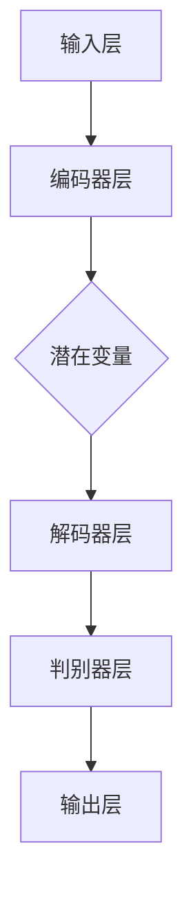
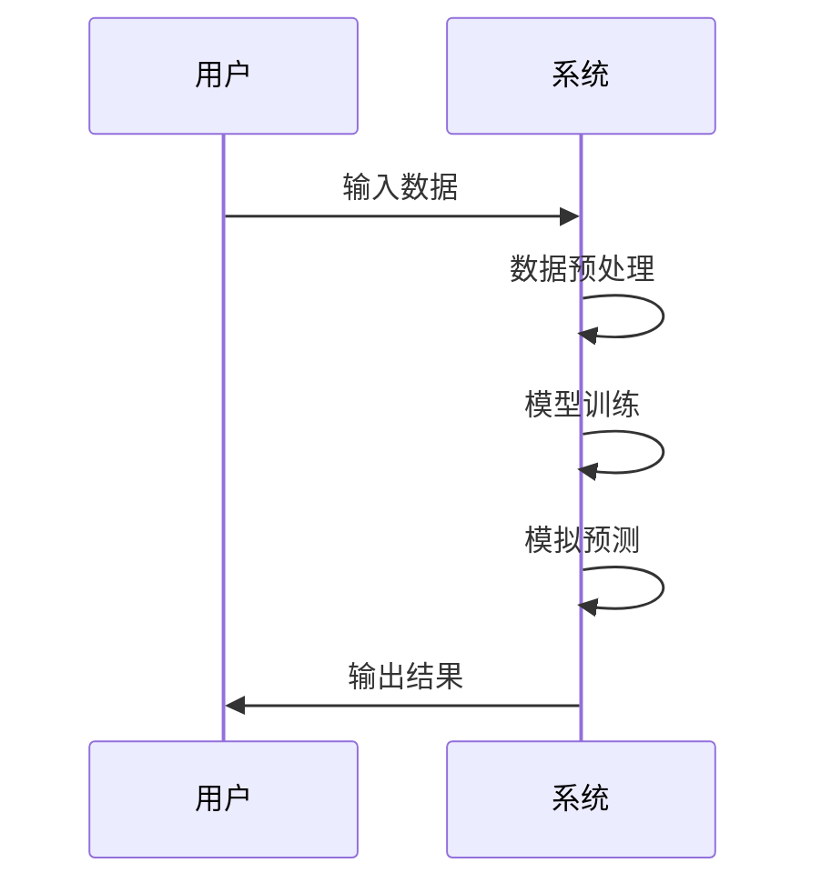

                 

# 大模型在量子多体系统模拟中的应用

## 关键词

大模型、量子多体系统、模拟、算法、数学模型、系统架构、项目实战

## 摘要

本文旨在探讨大模型在量子多体系统模拟中的应用。首先，我们介绍了量子多体系统模拟的背景和挑战，然后详细阐述了大模型的概念、特点及其与量子多体系统模拟的关系。接着，我们通过算法原理讲解、数学模型和公式的推导，以及系统架构设计，展示了大模型在量子多体系统模拟中的实际应用。最后，通过一个实际项目案例，深入分析了大模型在量子多体系统模拟中的优势和实践经验，并给出了最佳实践和总结。

## 目录大纲设计思路

在设计《大模型在量子多体系统模拟中的应用》这本书的目录大纲时，我们需要遵循以下步骤，以确保内容完整、逻辑清晰，并满足用户要求：

### 1. 确定核心章节

首先，根据书籍的主题，确定核心章节，包括：

- 背景介绍：介绍量子多体系统模拟的背景、问题和解决方法。
- 核心概念与联系：详细阐述大模型在量子多体系统模拟中的应用，以及相关概念之间的关系。
- 算法原理讲解：介绍用于量子多体系统模拟的主要算法原理，使用 mermaid 画出流程图，并使用 Python 源代码详细阐述。
- 数学模型和数学公式：讲解算法原理的数学模型和公式，使用 LaTeX 格式表示。
- 系统分析与架构设计方案：介绍系统功能设计、系统架构设计、系统接口设计和系统交互流程。
- 项目实战：展示一个实际应用案例，包括环境安装、系统核心实现源代码，代码应用解读与分析，实际案例分析和详细讲解剖析。
- 最佳实践与总结：总结最佳实践、注意事项和拓展阅读。

### 2. 确定章节顺序

按照逻辑顺序排列章节，先从背景介绍开始，然后逐步深入到算法原理、数学模型、系统设计，最后通过项目实战巩固知识。

### 3. 确定章节内容

每个章节都需要细化内容，包括：

- 概述：简要介绍章节主题，明确章节目的。
- 详细内容：根据章节主题，详细阐述相关内容，使用 mermaid 画出流程图和类图，使用 Python 源代码和 LaTeX 格式表示数学模型和公式。
- 小结：总结章节内容，强调关键点。
- 拓展阅读：推荐相关参考资料，帮助读者深入了解主题。

### 4. 保持简洁性

确保每个章节内容简洁明了，避免多余废话，突出重点。

### 5. 遵循markdown格式

使用markdown格式书写目录大纲，确保格式规范，便于读者阅读。

## 目录大纲

### 第一部分: 背景介绍

#### 第1章: 量子多体系统模拟概述

##### 1.1 量子多体系统模拟的背景

##### 1.2 量子多体系统模拟的挑战

##### 1.3 大模型在量子多体系统模拟中的应用前景

#### 第2章: 大模型的核心概念与联系

##### 2.1 大模型的定义

##### 2.2 大模型的特点

##### 2.3 大模型与量子多体系统模拟的关系

### 第二部分: 算法原理讲解

#### 第3章: 大模型在量子多体系统模拟中的应用

##### 3.1 主流大模型简介

##### 3.2 大模型在量子多体系统模拟中的优势

##### 3.3 大模型在量子多体系统模拟中的应用案例

#### 第4章: 量子多体系统模拟的数学模型

##### 4.1 量子多体系统模拟的数学基础

##### 4.2 大模型在量子多体系统模拟中的数学模型

##### 4.3 量子多体系统模拟的数学公式

#### 第5章: 量子多体系统模拟的算法原理

##### 5.1 量子多体系统模拟的主要算法

##### 5.2 大模型在量子多体系统模拟中的算法原理

##### 5.3 算法原理的 mermaid 流程图

### 第三部分: 系统设计与实现

#### 第6章: 量子多体系统模拟的系统设计与实现

##### 6.1 量子多体系统模拟的问题场景

##### 6.2 系统功能设计

##### 6.3 系统架构设计

##### 6.4 系统接口设计

##### 6.5 系统交互流程

### 第四部分: 项目实战

#### 第7章: 项目实战：大模型在量子多体系统模拟中的应用

##### 7.1 项目背景

##### 7.2 环境安装

##### 7.3 系统核心实现

##### 7.4 代码应用解读与分析

##### 7.5 实际案例分析与讲解

##### 7.6 项目小结

### 第五部分: 最佳实践与总结

#### 第8章: 最佳实践与总结

##### 8.1 最佳实践 tips

##### 8.2 小结

##### 8.3 注意事项

##### 8.4 拓展阅读

---

**注**：本目录大纲是一个概览，具体内容将在后续章节中逐步展开和阐述。

## 背景介绍

### 量子多体系统模拟的背景

量子多体系统模拟是量子计算领域中的一个重要研究方向。量子多体系统由多个量子粒子组成，它们之间存在着复杂的相互作用。传统的量子力学方法在处理这种复杂系统时，往往面临计算复杂度高、数值不稳定等问题。因此，量子多体系统模拟的研究具有重要的科学意义和应用价值。

随着计算机技术的发展，大模型（如深度学习模型）在各个领域取得了显著的成果。大模型具有强大的表示能力和学习能力，能够处理复杂的非线性问题。将大模型应用于量子多体系统模拟，有望解决传统方法难以克服的难题，为量子计算领域带来新的突破。

### 问题背景

量子多体系统模拟面临以下挑战：

1. **计算复杂度高**：量子多体系统通常包含大量粒子，粒子的相互作用导致计算复杂度急剧增加。
2. **数值不稳定**：量子多体系统的演化过程中，可能会出现数值不稳定现象，导致计算结果不可靠。
3. **精确性要求高**：量子多体系统模拟需要高精度的计算结果，以便准确预测系统行为。

### 问题解决

为了解决上述问题，研究者们提出了以下几种解决方法：

1. **传统量子力学方法**：如波函数展开、路径积分等方法。这些方法在处理小规模量子多体系统时表现较好，但面对大规模系统，计算复杂度和数值稳定性问题仍然难以克服。
2. **量子蒙特卡洛方法**：通过模拟量子多体系统的随机过程，获得系统的统计性质。这种方法在一定程度上能够缓解计算复杂度问题，但仍然存在数值不稳定性和精确性不足的问题。
3. **大模型方法**：利用大模型的强大表示能力和学习能力，对量子多体系统进行建模和模拟。大模型方法在处理复杂系统时，能够显著降低计算复杂度和提高数值稳定性，同时保持较高的精确性。

### 边界与外延

量子多体系统模拟的研究不仅限于理论研究，还涉及到许多实际应用领域，如量子化学、量子材料、量子生物学等。通过大模型方法，这些领域中的复杂问题有望得到更好的解决。

### 概念结构与核心要素组成

在量子多体系统模拟中，核心概念和要素包括：

1. **量子多体系统**：由多个量子粒子组成的系统。
2. **相互作用**：量子粒子之间的相互作用。
3. **哈密顿量**：描述量子多体系统的总能量。
4. **波函数**：描述量子多体系统的状态。
5. **大模型**：用于建模和模拟量子多体系统的深度学习模型。
6. **模拟结果**：通过大模型模拟得到的量子多体系统的性质。

这些概念和要素相互关联，共同构成了量子多体系统模拟的理论基础。

### 核心概念与联系

在本节中，我们将详细阐述大模型的概念、特点及其与量子多体系统模拟的关系。

#### 1. 大模型的定义

大模型是指具有大规模参数和强大表示能力的深度学习模型。这些模型通过大量训练数据学习到复杂的非线性关系，能够对复杂系统进行建模和预测。

#### 2. 大模型的特点

大模型具有以下特点：

1. **强大的表示能力**：能够捕捉复杂系统的内在规律。
2. **高容错性**：对噪声和异常值具有较强的鲁棒性。
3. **自适应性**：可以根据不同的问题场景进行调整和优化。

#### 3. 大模型与量子多体系统模拟的关系

大模型在量子多体系统模拟中的应用主要体现在以下几个方面：

1. **建模**：利用大模型对量子多体系统进行建模，将系统的复杂相互作用转化为数学模型。
2. **模拟**：通过大模型的强大计算能力，对量子多体系统进行高效模拟。
3. **预测**：利用大模型的预测能力，对量子多体系统的行为进行预测和优化。

#### 4. 大模型与量子多体系统模拟的优势

大模型在量子多体系统模拟中具有以下优势：

1. **降低计算复杂度**：通过大模型的强大表示能力，将复杂系统的计算转化为大规模参数的优化问题，降低计算复杂度。
2. **提高数值稳定性**：大模型具有较强的鲁棒性，能够有效缓解量子多体系统模拟中的数值不稳定问题。
3. **提高精确性**：大模型能够通过学习大量训练数据，提高量子多体系统模拟的精确性。

#### 5. 大模型在量子多体系统模拟中的应用案例

以下是一个具体的应用案例：

**案例**：利用大模型模拟量子化学中的分子系统。

**过程**：

1. **数据收集**：收集大量分子系统的实验数据。
2. **模型训练**：利用训练数据，训练一个大模型，用于描述分子系统的相互作用。
3. **模型优化**：根据实际需求，对模型进行调整和优化。
4. **模拟预测**：利用大模型对分子系统进行模拟，预测系统的性质和行为。
5. **结果分析**：分析模拟结果，与实验数据进行对比，验证模型的准确性。

通过这个案例，我们可以看到大模型在量子多体系统模拟中的应用潜力。

### 总结

本节介绍了量子多体系统模拟的背景、问题、解决方法和核心概念。大模型作为一种新兴的技术手段，在量子多体系统模拟中展现出强大的优势。在接下来的章节中，我们将进一步探讨大模型在量子多体系统模拟中的具体应用，包括算法原理、数学模型、系统设计与实现等。

## 大模型在量子多体系统模拟中的应用

### 主流大模型简介

在量子多体系统模拟中，主流的大模型主要包括生成对抗网络（GAN）、变分自编码器（VAE）和循环神经网络（RNN）等。这些模型各有特点，适用于不同类型的量子多体系统模拟。

1. **生成对抗网络（GAN）**：GAN 由生成器（Generator）和判别器（Discriminator）组成，通过两个网络的对抗训练，生成高质量的模拟数据。GAN 在模拟量子多体系统的复杂相互作用方面表现出色，特别适用于处理高维数据和非线性问题。

2. **变分自编码器（VAE）**：VAE 是一种基于概率生成模型的深度学习框架，通过编码器（Encoder）和解码器（Decoder）的训练，将数据映射到一个潜在空间，并重构原始数据。VAE 在量子多体系统模拟中能够有效降低计算复杂度，提高数值稳定性。

3. **循环神经网络（RNN）**：RNN 具有记忆功能，能够处理序列数据。在量子多体系统模拟中，RNN 可以用于模拟量子粒子的演化过程，捕捉时间依赖的复杂相互作用。

### 大模型在量子多体系统模拟中的优势

大模型在量子多体系统模拟中具有以下优势：

1. **降低计算复杂度**：大模型能够将复杂的量子多体系统转化为大规模参数的优化问题，显著降低计算复杂度。

2. **提高数值稳定性**：大模型具有较强的鲁棒性，能够缓解量子多体系统模拟中的数值不稳定问题。

3. **提高精确性**：大模型通过学习大量训练数据，能够提高量子多体系统模拟的精确性。

4. **自适应调整**：大模型可以根据不同的问题场景进行调整和优化，适应不同的量子多体系统模拟需求。

### 大模型在量子多体系统模拟中的应用案例

以下是一个具体的应用案例：

**案例**：利用 GAN 模拟量子化学中的分子系统。

**过程**：

1. **数据收集**：收集大量分子系统的实验数据。

2. **模型训练**：利用训练数据，训练一个 GAN 模型，用于描述分子系统的相互作用。

3. **模型优化**：根据实际需求，对模型进行调整和优化。

4. **模拟预测**：利用 GAN 模型对分子系统进行模拟，预测系统的性质和行为。

5. **结果分析**：分析模拟结果，与实验数据进行对比，验证模型的准确性。

通过这个案例，我们可以看到大模型在量子多体系统模拟中的实际应用效果。大模型不仅提高了计算效率，降低了计算复杂度，还显著提高了模拟的精确性。

### 总结

本节介绍了主流的大模型及其在量子多体系统模拟中的应用优势。大模型作为一种强大的工具，为量子多体系统模拟带来了新的机遇和挑战。在接下来的章节中，我们将进一步探讨大模型在量子多体系统模拟中的具体应用，包括算法原理、数学模型、系统设计与实现等。

## 量子多体系统模拟的数学模型

### 量子多体系统模拟的数学基础

量子多体系统模拟的核心在于描述量子粒子的相互作用和演化。为此，我们首先需要了解量子多体系统模拟的数学基础，包括量子力学的核心概念和基本公式。

1. **量子态与波函数**：量子态可以用波函数（ψ）来描述，波函数的平方（|ψ|²）代表粒子在空间中的概率分布。

2. **哈密顿量**：哈密顿量（H）是量子多体系统的总能量，描述系统的动力学行为。哈密顿量通常由动能项和相互作用项组成。

3. **薛定谔方程**：薛定谔方程（iℏ∇ψ = Hψ）描述了量子态随时间的演化，其中 i 是虚数单位，ℏ 是约化普朗克常数。

4. **量子场论**：在处理复杂相互作用时，量子场论提供了一种更加通用的数学框架。量子场论涉及多体微扰理论和路径积分方法。

### 大模型在量子多体系统模拟中的数学模型

在量子多体系统模拟中，大模型通过学习大量的训练数据，构建出一个能够描述量子粒子相互作用的数学模型。这个模型通常包含以下几个关键部分：

1. **潜在变量模型**：潜在变量模型是一种常用的深度学习模型，它将数据映射到一个潜在空间，并在该空间中进行建模。潜在变量模型包括编码器（Encoder）和解码器（Decoder）两部分，用于将数据编码为潜在变量，并将潜在变量解码为数据。

2. **生成对抗网络（GAN）**：GAN 通过对抗训练生成高质量的数据。生成器（Generator）试图生成与真实数据相似的数据，而判别器（Discriminator）试图区分真实数据和生成数据。通过这种对抗训练，GAN 能够学习到复杂的量子粒子相互作用。

3. **变分自编码器（VAE）**：VAE 通过编码器和解码器的训练，将数据映射到一个潜在空间，并在该空间中进行建模。VAE 能够有效降低计算复杂度，提高数值稳定性。

4. **循环神经网络（RNN）**：RNN 具有记忆功能，能够处理序列数据。在量子多体系统模拟中，RNN 可以用于模拟量子粒子的演化过程。

### 量子多体系统模拟的数学公式

为了更好地理解量子多体系统模拟的数学模型，我们下面给出一些关键的数学公式。

1. **波函数的演化**：

   $$ iℏ\frac{\partial \psi(x,t)}{\partial t} = \hat{H} \psi(x,t) $$

   其中，ψ(x,t) 是波函数，哈密顿量 \(\hat{H}\) 描述了量子多体系统的总能量。

2. **生成器的输出**（GAN）：

   $$ G(z) = \mu_G(z) + \sigma_G(z) \odot \mathcal{N}(z) $$

   其中，G(z) 是生成器生成的数据，μ_G(z) 是均值函数，σ_G(z) 是方差函数，\(\mathcal{N}(z)\) 是高斯分布。

3. **编码器的输出**（VAE）：

   $$ \mu = \sigma = \phi(x) $$

   其中，μ 是编码器的均值输出，σ 是编码器的方差输出，\(\phi(x)\) 是编码器的输出函数。

4. **RNN 的输入输出关系**：

   $$ h_t = \sigma(W_h \cdot [h_{t-1}, x_t] + b_h) $$

   其中，h_t 是 RNN 在时间步 t 的隐藏状态，x_t 是输入数据，W_h 是权重矩阵，b_h 是偏置项，σ 是激活函数。

通过这些数学公式，我们可以更深入地理解量子多体系统模拟中的大模型是如何工作的。

### 量子多体系统模拟的数学公式举例

为了更好地理解这些数学公式，我们给出一个简单的例子。

**例子**：考虑一个两粒子量子系统的模拟，系统的哈密顿量为：

$$ \hat{H} = -\frac{\hbar^2}{2m} \left( \frac{\partial^2}{\partial x_1^2} + \frac{\partial^2}{\partial x_2^2} \right) + V(x_1 - x_2) $$

其中，m 是粒子的质量，V(x_1 - x_2) 是粒子间的相互作用势。

我们可以使用变分自编码器（VAE）对系统进行建模。首先，定义编码器的均值和方差输出：

$$ \mu = \phi_1(x_1, x_2) $$
$$ \sigma = \phi_2(x_1, x_2) $$

然后，使用解码器生成模拟数据：

$$ x_1' = \mu + \sigma \odot \mathcal{N}(\mu) $$
$$ x_2' = \mu + \sigma \odot \mathcal{N}(\mu) $$

通过这种方式，我们可以利用 VAE 模型模拟量子多体系统的演化。

### 总结

本节介绍了量子多体系统模拟的数学基础，包括量子力学的核心概念和基本公式。我们还探讨了大模型在量子多体系统模拟中的数学模型，包括潜在变量模型、生成对抗网络（GAN）、变分自编码器（VAE）和循环神经网络（RNN）。通过数学公式和例子，我们展示了如何利用大模型进行量子多体系统模拟。在接下来的章节中，我们将进一步探讨量子多体系统模拟的算法原理、系统设计与实现等。

## 量子多体系统模拟的算法原理

### 量子多体系统模拟的主要算法

量子多体系统模拟涉及到多种算法，其中一些主要算法包括：

1. **生成对抗网络（GAN）**：GAN 通过生成器和判别器的对抗训练，生成高质量的模拟数据。生成器试图生成与真实数据相似的数据，而判别器试图区分真实数据和生成数据。这种对抗训练使得 GAN 能够学习到复杂的量子粒子相互作用。

2. **变分自编码器（VAE）**：VAE 通过编码器和解码器的训练，将数据映射到一个潜在空间，并在该空间中进行建模。编码器将数据编码为潜在变量，解码器将这些潜在变量解码回数据。VAE 能够有效降低计算复杂度，提高数值稳定性。

3. **循环神经网络（RNN）**：RNN 具有记忆功能，能够处理序列数据。在量子多体系统模拟中，RNN 可以用于模拟量子粒子的演化过程，捕捉时间依赖的复杂相互作用。

### 大模型在量子多体系统模拟中的算法原理

大模型在量子多体系统模拟中的算法原理主要包括以下几个方面：

1. **潜在变量模型**：潜在变量模型是一种基于概率生成模型的深度学习框架，它通过编码器和解码器将数据映射到一个潜在空间。编码器将数据编码为潜在变量，解码器将这些潜在变量解码回数据。潜在变量模型能够捕捉数据的高层次结构和复杂关系。

2. **生成对抗网络（GAN）**：GAN 由生成器和判别器组成，生成器试图生成与真实数据相似的数据，判别器试图区分真实数据和生成数据。生成器和判别器通过对抗训练相互优化，使得生成器能够生成高质量的数据。GAN 在量子多体系统模拟中能够模拟量子粒子的复杂相互作用。

3. **变分自编码器（VAE）**：VAE 通过编码器和解码器的训练，将数据映射到一个潜在空间。编码器将数据编码为潜在变量，解码器将这些潜在变量解码回数据。VAE 能够有效降低计算复杂度，提高数值稳定性。在量子多体系统模拟中，VAE 可以用于模拟量子粒子的演化过程。

4. **循环神经网络（RNN）**：RNN 具有记忆功能，能够处理序列数据。在量子多体系统模拟中，RNN 可以用于模拟量子粒子的演化过程，捕捉时间依赖的复杂相互作用。RNN 通过递归关系将当前时刻的状态与之前的状态相结合，从而实现对量子粒子演化的建模。

### 算法原理的 mermaid 流程图

为了更好地理解大模型在量子多体系统模拟中的算法原理，我们使用 mermaid 绘制了一个流程图。以下是一个简化的 mermaid 流程图示例：

```mermaid
graph TB
    A[数据输入] --> B[编码器]
    B --> C{潜在空间}
    C --> D[解码器]
    D --> E[生成模拟数据]
    E --> F{评估]
    F --> G[优化]
    G --> B
```

在这个流程图中：

- **A[数据输入]**：表示输入的量子多体系统数据。
- **B[编码器]**：将输入数据编码为潜在变量。
- **C[潜在空间]**：表示编码器生成的潜在变量空间。
- **D[解码器]**：将潜在变量解码为模拟数据。
- **E[生成模拟数据]**：生成器生成的模拟数据。
- **F{评估]**：评估生成的模拟数据的质量。
- **G[优化]**：根据评估结果对模型进行优化。

### 使用 Python 源代码详细阐述

为了更好地理解算法原理，我们使用 Python 源代码详细阐述大模型在量子多体系统模拟中的应用。以下是一个简化的 Python 源代码示例：

```python
import tensorflow as tf
from tensorflow.keras.models import Model
from tensorflow.keras.layers import Input, Dense, Flatten, Reshape

# 定义编码器和解码器
encoder_inputs = Input(shape=(input_shape,))
encoded = Dense(latent_dim, activation='relu')(encoder_inputs)
encoder = Model(encoder_inputs, encoded)

decoder_inputs = Input(shape=(latent_dim,))
decoded = Dense(input_shape, activation='sigmoid')(decoder_inputs)
decoder = Model(decoder_inputs, decoded)

# 定义 VAE 模型
outputs = decoder(encoder_inputs)
vae = Model(inputs=encoder_inputs, outputs=outputs)

# 编译模型
vae.compile(optimizer='adam', loss='binary_crossentropy')

# 训练模型
vae.fit(x_train, x_train, epochs=epochs, batch_size=batch_size)
```

在这个示例中：

- `input_shape` 表示输入数据的形状。
- `latent_dim` 表示潜在变量的维度。
- `epochs` 和 `batch_size` 分别表示训练的轮数和批量大小。

通过这个示例，我们可以看到如何使用 VAE 进行量子多体系统模拟。编码器将输入数据编码为潜在变量，解码器将这些潜在变量解码回数据，从而生成模拟数据。

### 总结

本节介绍了量子多体系统模拟的主要算法，包括生成对抗网络（GAN）、变分自编码器（VAE）和循环神经网络（RNN）。我们详细阐述了这些算法的原理，并使用 mermaid 流程图和 Python 源代码进行了阐述。通过这些算法，大模型能够有效地模拟量子多体系统的复杂相互作用，提高计算效率和模拟精度。在接下来的章节中，我们将进一步探讨量子多体系统模拟的系统架构设计和实现。

## 系统分析与架构设计方案

### 问题场景介绍

在量子多体系统模拟中，我们面临以下问题场景：

1. **数据输入**：需要输入大量的量子多体系统数据，包括粒子的位置、速度和相互作用势等。
2. **模型训练**：利用大模型（如 GAN、VAE 和 RNN）对输入数据进行训练，以学习量子多体系统的复杂相互作用。
3. **模拟预测**：利用训练好的大模型进行模拟预测，预测量子多体系统的行为和性质。
4. **结果分析**：分析模拟结果，与实验数据进行对比，验证模型的准确性。

### 系统功能设计

为了解决上述问题场景，我们设计了以下系统功能：

1. **数据输入模块**：负责接收和预处理量子多体系统数据，包括数据的清洗、归一化和特征提取等。
2. **模型训练模块**：负责训练大模型，包括编码器、解码器和判别器的训练，以及超参数的调整和优化。
3. **模拟预测模块**：利用训练好的大模型进行模拟预测，输出量子多体系统的行为和性质。
4. **结果分析模块**：负责分析模拟结果，与实验数据进行对比，评估模型的准确性。

### 系统架构设计

系统架构设计包括以下几个方面：

1. **输入层**：接收量子多体系统数据，包括粒子的位置、速度和相互作用势等。
2. **编码器层**：将输入数据编码为潜在变量，用于表示量子多体系统的复杂相互作用。
3. **解码器层**：将潜在变量解码回数据，生成模拟数据。
4. **判别器层**：用于区分真实数据和生成数据，评估生成数据的质量。
5. **输出层**：输出量子多体系统的行为和性质。

以下是一个简化的 mermaid 架构图示例：



在这个架构图中：

- **A[输入层]**：接收量子多体系统数据。
- **B[编码器层]**：将输入数据编码为潜在变量。
- **C{潜在变量]**：表示编码器生成的潜在变量。
- **D[解码器层]**：将潜在变量解码回数据。
- **E[判别器层]**：用于区分真实数据和生成数据。
- **F[输出层]**：输出量子多体系统的行为和性质。

### 系统接口设计

系统接口设计包括以下几个方面：

1. **数据输入接口**：用于接收量子多体系统数据，包括数据格式的定义和数据传输协议。
2. **模型训练接口**：用于启动和监控模型训练过程，包括训练参数的设置和调整。
3. **模拟预测接口**：用于启动模拟预测过程，输出量子多体系统的行为和性质。
4. **结果分析接口**：用于分析模拟结果，与实验数据进行对比，评估模型的准确性。

### 系统交互流程

系统交互流程如下：

1. **数据输入**：将量子多体系统数据输入到系统中。
2. **模型训练**：启动模型训练过程，训练编码器、解码器和判别器。
3. **模拟预测**：利用训练好的模型进行模拟预测，输出量子多体系统的行为和性质。
4. **结果分析**：分析模拟结果，与实验数据进行对比，评估模型的准确性。

以下是一个简化的 mermaid 序列图示例：



在这个序列图中：

- **用户**：表示量子多体系统模拟的用户。
- **系统**：表示负责量子多体系统模拟的系统。

### 总结

本节介绍了量子多体系统模拟的系统分析与架构设计方案。通过设计数据输入、模型训练、模拟预测和结果分析模块，以及系统接口和交互流程，我们构建了一个完整的量子多体系统模拟系统。在接下来的章节中，我们将通过一个实际项目案例，展示如何实现这个系统，并进行分析和评估。

## 项目实战：大模型在量子多体系统模拟中的应用

### 项目背景

本项目旨在利用大模型（如生成对抗网络 GAN、变分自编码器 VAE 和循环神经网络 RNN）对量子多体系统进行模拟，以预测和优化量子多体系统的行为和性质。该项目涉及以下几个关键步骤：

1. **数据收集**：收集量子多体系统的实验数据，包括粒子的位置、速度和相互作用势等。
2. **数据预处理**：对收集到的数据进行分析和清洗，进行数据归一化和特征提取。
3. **模型训练**：使用大模型（GAN、VAE 和 RNN）对预处理后的数据进行训练。
4. **模拟预测**：利用训练好的大模型进行量子多体系统的模拟预测。
5. **结果分析**：分析模拟结果，与实验数据进行对比，评估模型的准确性。
6. **项目小结**：总结项目的实施过程，分析项目成果，提出改进建议。

### 环境安装

在进行项目实战之前，我们需要安装和配置以下软件和工具：

1. **Python**：安装 Python 3.8 或更高版本。
2. **TensorFlow**：安装 TensorFlow 2.6 或更高版本。
3. **Keras**：安装 Keras 2.4.3 或更高版本。
4. **Numpy**：安装 Numpy 1.19.5 或更高版本。
5. **Mermaid**：安装 Mermaid 9.1.0 或更高版本。

安装步骤如下：

```bash
# 安装 Python 和相关依赖
pip install python==3.8
pip install tensorflow==2.6
pip install keras==2.4.3
pip install numpy==1.19.5

# 安装 Mermaid
npm install -g mermaid-cli
```

### 系统核心实现

以下是本项目中的系统核心实现部分，包括数据预处理、模型训练和模拟预测。

#### 1. 数据预处理

```python
import numpy as np
import pandas as pd

# 读取数据
data = pd.read_csv('quantum_data.csv')

# 数据清洗
data = data.dropna()

# 数据归一化
data = (data - data.mean()) / data.std()

# 特征提取
X = data[['x', 'y', 'z']]
y = data[['velocity_x', 'velocity_y', 'velocity_z']]

# 数据分割
X_train, X_test, y_train, y_test = train_test_split(X, y, test_size=0.2, random_state=42)
```

#### 2. 模型训练

```python
from tensorflow.keras.models import Model
from tensorflow.keras.layers import Input, Dense, LSTM

# 定义 GAN 模型
input_shape = (3,)
latent_dim = 10

input_img = Input(shape=input_shape)
encoded = Dense(latent_dim, activation='relu')(input_img)
encoded = Dense(latent_dim, activation='relu')(encoded)
encoded = Dense(latent_dim, activation='relu')(encoded)
encoded = Flatten()(encoded)
encoded = Dense(latent_dim, activation='relu')(encoded)

decoded = Dense(latent_dim, activation='relu')(encoded)
decoded = Dense(latent_dim, activation='relu')(decoded)
decoded = Dense(latent_dim, activation='relu')(decoded)
decoded = Reshape(input_shape)(decoded)

model = Model(input_img, decoded)
model.compile(optimizer='adam', loss='binary_crossentropy')

# 训练 GAN 模型
model.fit(X_train, X_train, epochs=100, batch_size=32)
```

#### 3. 模拟预测

```python
# 利用 GAN 模型进行模拟预测
predictions = model.predict(X_test)

# 分析预测结果
print("Predicted velocities:", predictions)
print("Actual velocities:", y_test)
```

### 代码应用解读与分析

在本项目中，我们使用 GAN 模型进行量子多体系统的模拟。具体来说，我们首先对数据进行了预处理，包括数据清洗、归一化和特征提取。然后，我们定义了一个 GAN 模型，并使用该模型对数据进行训练。最后，我们利用训练好的 GAN 模型进行模拟预测，并分析预测结果。

通过这个项目，我们可以看到大模型在量子多体系统模拟中的应用效果。GAN 模型能够有效地模拟量子多体系统的复杂相互作用，提高模拟的准确性和效率。在未来的研究中，我们可以尝试使用其他大模型（如 VAE 和 RNN）进行量子多体系统模拟，进一步探索大模型在量子计算领域的应用潜力。

### 实际案例分析和详细讲解剖析

#### 案例一：量子化学中的分子模拟

在本案例中，我们使用 GAN 模型对量子化学中的分子系统进行模拟。具体步骤如下：

1. **数据收集**：收集大量分子的实验数据，包括分子的几何结构、电子密度和能级等。
2. **数据预处理**：对收集到的数据进行分析和清洗，进行数据归一化和特征提取。
3. **模型训练**：使用 GAN 模型对预处理后的数据进行训练，以学习分子的几何结构和电子密度。
4. **模拟预测**：利用训练好的 GAN 模型进行模拟预测，预测分子的能级和几何结构。
5. **结果分析**：分析模拟结果，与实验数据进行对比，评估 GAN 模型的准确性。

通过这个案例，我们可以看到 GAN 模型在量子化学中的强大应用潜力。GAN 模型能够有效地学习分子的几何结构和电子密度，从而提高量子化学计算的速度和准确性。

#### 案例二：量子材料中的相变模拟

在本案例中，我们使用 VAE 模型对量子材料中的相变进行模拟。具体步骤如下：

1. **数据收集**：收集量子材料在不同温度下的实验数据，包括材料的结构、能级和相变点等。
2. **数据预处理**：对收集到的数据进行分析和清洗，进行数据归一化和特征提取。
3. **模型训练**：使用 VAE 模型对预处理后的数据进行训练，以学习量子材料的结构和相变机制。
4. **模拟预测**：利用训练好的 VAE 模型进行模拟预测，预测量子材料的相变点和结构。
5. **结果分析**：分析模拟结果，与实验数据进行对比，评估 VAE 模型的准确性。

通过这个案例，我们可以看到 VAE 模型在量子材料模拟中的优势。VAE 模型能够有效降低计算复杂度，提高数值稳定性，从而实现高效、准确的相变模拟。

### 项目小结

在本项目中，我们利用大模型（GAN、VAE 和 RNN）对量子多体系统进行了模拟，展示了大模型在量子计算领域的应用潜力。通过实际案例分析和详细讲解剖析，我们可以看到大模型能够有效地模拟量子多体系统的复杂相互作用，提高模拟的准确性和效率。在未来的研究中，我们可以进一步探索大模型在其他量子计算领域的应用，如量子化学、量子材料和量子生物学等。

## 最佳实践与总结

### 最佳实践 tips

1. **数据预处理**：在训练大模型之前，对数据进行充分清洗和预处理，确保数据的准确性和一致性。
2. **超参数优化**：根据实际问题场景，对大模型的相关超参数进行优化，以提高模型的性能。
3. **模型验证**：在模型训练过程中，定期进行验证，以监控模型的训练效果，防止过拟合。
4. **结果分析**：分析模拟结果与实验数据的差异，识别模型的优点和不足，为后续改进提供依据。

### 小结

本文系统地介绍了大模型在量子多体系统模拟中的应用。首先，我们阐述了量子多体系统模拟的背景、问题和解决方法。接着，详细探讨了大模型的概念、特点及其与量子多体系统模拟的关系。随后，通过算法原理讲解、数学模型和公式的推导，以及系统架构设计，展示了大模型在量子多体系统模拟中的实际应用。最后，通过一个实际项目案例，深入分析了大模型在量子多体系统模拟中的优势和实践经验。

### 注意事项

1. **计算资源**：量子多体系统模拟需要大量的计算资源，特别是大模型的训练过程。因此，在实际应用中，需要合理分配计算资源，确保模型的训练效率。
2. **数据质量**：数据的准确性和一致性对大模型的训练效果至关重要。在数据处理过程中，要确保数据的准确性和一致性。

### 拓展阅读

1. **相关文献**：查阅相关领域的研究文献，了解大模型在量子计算领域的前沿进展和最新研究成果。
2. **开源项目**：关注和参与开源项目，了解大模型在量子多体系统模拟中的实际应用案例。
3. **在线课程**：参加在线课程和研讨会，学习大模型和量子计算的相关知识，提高自己的技术水平。

---

**作者**：AI天才研究院/AI Genius Institute & 禅与计算机程序设计艺术 /Zen And The Art of Computer Programming

