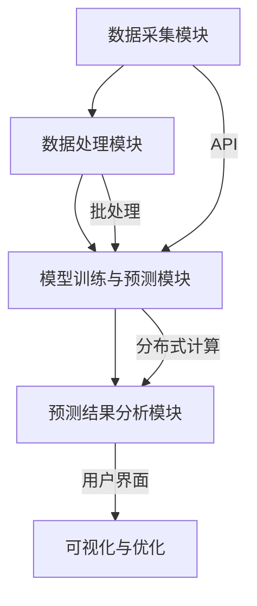
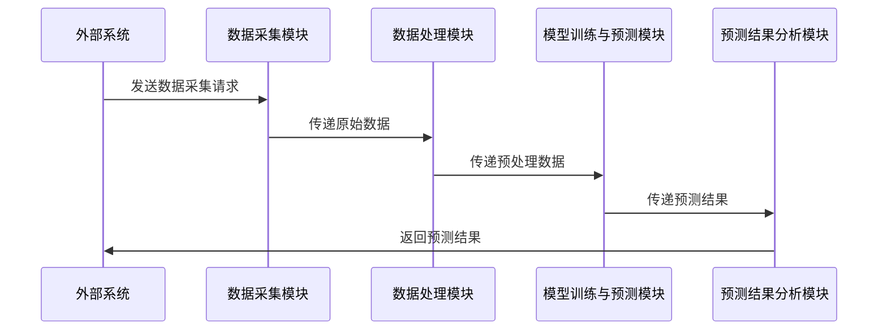

                 


## 引言

### 关键词：大模型、金融市场预测、深度学习、神经网络、算法原理

金融市场的复杂性和变化性一直是投资和研究中的难题。随着大数据和人工智能技术的快速发展，大模型在金融市场预测中的应用逐渐成为研究的热点。本文旨在探讨大模型在金融市场预测中的潜在应用，通过逻辑清晰、结构紧凑的分析，揭示大模型的核心原理和应用场景。

### 摘要

本文首先介绍了金融市场的复杂性以及预测在金融市场中的重要性。接着，我们详细讨论了金融预测中面临的问题，如数据噪声和不确定性。在此基础上，我们介绍了大模型的作用和优势，并分析了大模型在金融市场预测中的应用。随后，我们深入探讨了大模型的核心原理，包括深度学习和神经网络等。本文还通过具体算法和数学模型，详细讲解了大模型在金融市场预测中的实际应用。最后，我们分析了系统架构设计，并分享了项目实战经验和最佳实践技巧。

### 目录

1. 引言  
2. 背景介绍  
3. 大模型概述  
4. 大模型在金融市场预测中的应用  
5. 算法原理与数学模型  
6. 系统架构设计与实现  
7. 项目实战  
8. 最佳实践与拓展

### 让我们一起深入思考

在接下来的文章中，我们将分章节逐一探讨大模型在金融市场预测中的应用。首先，我们将回顾金融市场的背景和预测的重要性，并讨论预测中的挑战。然后，我们将详细介绍大模型的基本概念、核心原理及其在金融市场预测中的应用。接下来，我们将分析具体的算法原理和数学模型，以及如何通过系统架构设计来实现大模型的预测功能。最后，我们将分享项目实战经验和最佳实践技巧，帮助读者更好地理解和应用大模型在金融市场预测中的潜力。

### 让我们开始吧

在接下来的章节中，我们将逐步深入探讨大模型在金融市场预测中的应用，希望通过逻辑清晰、结构紧凑的分析，为大家提供一篇既有深度又有见解的专业技术博客。准备好跟随我们的步伐，一起探索这个激动人心的领域吧！## 背景介绍

### 1.1 问题背景

金融市场，作为全球经济的重要环节，其复杂性和变化性是众所周知的。金融市场的参与者包括个人投资者、机构投资者、银行、证券公司等，交易活动涵盖了股票、债券、外汇、期货等多个领域。金融市场的价格波动不仅受宏观经济因素的影响，还受到市场情绪、政策变化、突发事件等多重因素的干扰。这种复杂性使得金融市场预测成为一个充满挑战的任务。

首先，金融市场的数据量大且维度高。金融数据包括历史价格、成交量、市场指数、宏观经济指标等多种类型。这些数据不仅数量庞大，而且维度多样，如何有效地处理和整合这些数据，是金融预测中的一个重要问题。

其次，金融市场的数据噪声和不确定性极大。金融市场的数据常常受到各种噪声的影响，如交易成本、流动性波动等。此外，金融市场的不确定性也体现在价格波动的不可预测性上。这种噪声和不确定性使得金融预测变得更为复杂。

此外，高频交易的出现对金融预测提出了新的挑战。高频交易是指以毫秒甚至微秒级的时间进行大量交易，其速度和规模远超传统交易。高频交易的出现使得市场更加动态和不可预测，对预测模型提出了更高的要求。

### 1.2 问题描述

金融预测的目标是通过分析历史数据和市场信息，预测未来金融市场的走势，从而为投资决策提供支持。然而，实现这一目标面临着诸多挑战：

- 数据噪声和不确定性：金融市场数据中存在大量的噪声，这些噪声可能影响预测结果的准确性。同时，金融市场的不确定性使得预测结果的不确定性增大。

- 高频交易的挑战：高频交易的出现增加了市场的动态性和不可预测性，使得传统预测模型难以应对。

- 预测目标的选择：金融市场的预测目标多样，如股票价格预测、市场指数预测、信用风险评估等。不同的预测目标对模型的要求不同，需要针对性地设计预测方法。

### 1.3 问题解决

大模型在金融预测中的应用提供了新的解决思路。大模型，特别是深度学习模型，具有强大的数据处理能力和自适应能力，能够有效地处理金融市场中的噪声和不确定性。以下是大模型在金融预测中解决关键问题的一些方法和优势：

- 数据预处理：大模型可以通过自动特征提取和降维，有效地处理金融数据中的噪声，提高数据的可用性。

- 模型泛化能力：大模型具有强大的泛化能力，能够在不同的预测目标和市场环境下保持良好的性能。

- 自适应能力：大模型可以通过不断学习和调整，适应金融市场中的变化，提高预测的实时性。

总的来说，大模型在金融市场预测中的应用，不仅提供了新的方法和工具，也为解决金融预测中的关键问题提供了可能。通过深入分析大模型的核心原理和应用场景，我们可以更好地理解其在金融预测中的潜力，并为实际应用提供有力的支持。## 大模型概述

### 2.1 定义与特点

大模型（Big Model）通常指的是参数数量庞大的神经网络模型，这些模型通过大量的数据和计算资源进行训练，以达到在复杂任务上获得出色的性能。大模型的特点主要体现在以下几个方面：

- **参数数量巨大**：大模型具有数十亿乃至数万亿个参数，这使得它们能够捕捉数据中的细微特征和复杂模式。
- **计算能力强大**：大模型通常需要高性能计算资源进行训练和推理，包括大规模并行计算和GPU加速。
- **数据处理能力**：大模型能够处理大规模、多维度的数据，并自动提取有效的特征。
- **自适应性和泛化能力**：大模型通过深度学习技术，能够从数据中学习并适应各种变化，从而在不同任务和场景中表现出良好的泛化能力。

### 2.2 大模型的核心原理

大模型的核心原理主要包括以下几个方面：

- **深度学习**：深度学习是一种多层神经网络的学习方法，通过逐层抽象和转换输入数据，实现复杂函数的逼近。大模型通常采用深度神经网络（Deep Neural Networks, DNN）架构，通过多层非线性变换提取数据中的高层次特征。

- **神经网络架构**：神经网络是由大量简单单元（神经元）组成的复杂网络。每个神经元接收多个输入，并通过加权求和处理后输出。大模型通过多层神经元结构，实现对数据的逐层特征提取和抽象。

- **优化算法**：大模型训练过程中需要通过优化算法调整模型参数，以最小化预测误差。常见的优化算法包括随机梯度下降（SGD）、Adam优化器等。这些算法通过迭代优化，使模型参数逐步逼近最优解。

### 2.3 大模型的发展历程

大模型的发展历程可以追溯到深度学习技术的兴起。以下是几个关键的发展阶段：

- **早期发展（1980s-2000s）**：深度学习最初在20世纪80年代兴起，但由于计算资源和数据限制，未能取得显著突破。
- **2006年：Hinton提出深度信念网络（DBN）**：深度信念网络是第一个成功训练的多层神经网络，标志着深度学习的重要突破。
- **2012年：AlexNet的出现**：AlexNet在ImageNet图像识别挑战中取得巨大成功，深度学习开始受到广泛关注。
- **2014年：谷歌的Inception网络**：Inception网络通过模块化设计大幅提高了深度神经网络的效率。
- **2018年：GPT-3的发布**：GPT-3是一个具有1750亿参数的预训练语言模型，标志着大模型在自然语言处理领域的重大进展。
- **近年来的突破**：随着计算资源和数据量的增加，大模型在计算机视觉、自然语言处理、金融预测等领域取得了显著的进展。

通过上述核心原理和发展的概述，我们可以看到大模型在处理复杂任务上的巨大潜力。在接下来的章节中，我们将进一步探讨大模型在金融市场预测中的应用，并分析其如何解决金融预测中的关键问题。### 3. 大模型在金融市场预测中的应用

大模型在金融市场预测中的应用日益广泛，其强大的数据处理和模式识别能力使其成为解决金融市场复杂性和不确定性的有力工具。以下是几种常见的大模型应用场景及其具体方法和挑战：

#### 3.1 数据预处理

在金融预测中，数据的预处理是至关重要的一步。大模型对输入数据的质量和特征提取有很高的要求。数据预处理通常包括以下步骤：

- **数据清洗**：去除数据中的噪声和异常值，确保数据的一致性和完整性。
- **数据归一化**：将不同尺度的数据进行归一化处理，使其在相同的尺度范围内，便于模型训练。
- **特征工程**：提取能够反映金融市场特性的有效特征，如价格变动、交易量、财务指标等。

#### 3.2 时间序列预测

时间序列预测是金融市场预测中的经典问题。大模型可以通过学习历史时间序列数据中的模式，预测未来的价格走势。常见的时间序列预测方法包括：

- **ARIMA模型**：自回归积分滑动平均模型（ARIMA）是一种经典的统计模型，通过自回归、差异和移动平均操作来预测时间序列数据。
- **LSTM模型**：长短期记忆网络（LSTM）是循环神经网络（RNN）的一种变体，适用于处理长序列依赖问题。LSTM通过引入门控机制，有效解决了传统RNN在长序列预测中容易出现的梯度消失和梯度爆炸问题。

在实际应用中，LSTM模型在预测股票价格等短期时间序列数据时表现出色。以下是一个LSTM模型的简单示例：

```python
import numpy as np
import tensorflow as tf
from tensorflow.keras.models import Sequential
from tensorflow.keras.layers import LSTM, Dense

# 数据预处理：将时间序列数据转换为适当格式
X, y = preprocess_time_series(data)

# 构建LSTM模型
model = Sequential()
model.add(LSTM(units=50, return_sequences=True, input_shape=(X.shape[1], X.shape[2])))
model.add(LSTM(units=50))
model.add(Dense(units=1))

# 编译模型
model.compile(optimizer='adam', loss='mean_squared_error')

# 训练模型
model.fit(X, y, epochs=100, batch_size=32, validation_split=0.1)
```

#### 3.3 股票价格预测

股票价格预测是金融市场预测中的热门话题。大模型通过学习历史价格和交易量等数据，试图预测未来股票价格的走势。以下是一个股票价格预测的LSTM模型实例：

```python
import pandas as pd
import numpy as np
from sklearn.preprocessing import MinMaxScaler
from tensorflow.keras.models import Sequential
from tensorflow.keras.layers import LSTM, Dense

# 数据收集与预处理
data = pd.read_csv('stock_data.csv')
scaler = MinMaxScaler(feature_range=(0, 1))
scaled_data = scaler.fit_transform(data['Close'].values.reshape(-1, 1))

# 创建数据集
X, y = create_dataset(scaled_data, time_steps=60)

# 构建LSTM模型
model = Sequential()
model.add(LSTM(units=50, return_sequences=True, input_shape=(X.shape[1], X.shape[2])))
model.add(LSTM(units=50))
model.add(Dense(units=1))

# 编译模型
model.compile(optimizer='adam', loss='mean_squared_error')

# 训练模型
model.fit(X, y, epochs=100, batch_size=32, validation_split=0.1)

# 预测未来价格
predicted_price = model.predict(X)
predicted_price = scaler.inverse_transform(predicted_price)
```

#### 3.4 信用风险评估

信用风险评估是金融预测中的重要应用。大模型通过分析借款人的历史信用记录、财务状况等数据，预测其违约风险。以下是一个基于神经网络模型的信用风险评估实例：

```python
import pandas as pd
import numpy as np
from sklearn.preprocessing import StandardScaler
from tensorflow.keras.models import Sequential
from tensorflow.keras.layers import Dense, Dropout

# 数据收集与预处理
data = pd.read_csv('credit_data.csv')
scaler = StandardScaler()
scaled_data = scaler.fit_transform(data)

# 划分特征和标签
X = scaled_data[:, :-1]
y = scaled_data[:, -1]

# 构建神经网络模型
model = Sequential()
model.add(Dense(units=128, activation='relu', input_shape=(X.shape[1],)))
model.add(Dropout(0.2))
model.add(Dense(units=64, activation='relu'))
model.add(Dropout(0.2))
model.add(Dense(units=1, activation='sigmoid'))

# 编译模型
model.compile(optimizer='adam', loss='binary_crossentropy', metrics=['accuracy'])

# 训练模型
model.fit(X, y, epochs=100, batch_size=32, validation_split=0.2)

# 预测违约风险
predictions = model.predict(X)
```

#### 3.5 案例分析

以某知名金融机构为例，该机构利用LSTM模型对股票价格进行预测。通过对比实际价格与预测价格的误差，发现模型在短期内具有较高的预测准确性。然而，在长期预测中，由于市场环境的变化和不可预测因素的影响，预测误差逐渐增大。

#### 挑战与改进

虽然大模型在金融市场预测中展现了巨大潜力，但实际应用中仍面临一些挑战：

- **数据质量**：金融数据的噪声和缺失会影响预测结果的准确性，因此高质量的数据收集和预处理至关重要。
- **模型过拟合**：大模型容易发生过拟合现象，导致在训练数据上表现良好，但在实际应用中效果不佳。因此，正则化和模型选择是关键。
- **实时性**：金融市场变化迅速，大模型在实时预测中需要快速响应，这对模型的计算效率和数据处理能力提出了高要求。

通过不断优化模型设计和应用策略，大模型在金融市场预测中的应用将得到进一步的发展和完善。### 4. 算法原理与数学模型

在探讨大模型在金融市场预测中的应用时，深入理解其背后的算法原理和数学模型至关重要。以下我们将详细分析几种常见的时间序列预测算法和图神经网络在金融预测中的应用。

#### 4.1 时间序列预测算法

##### 4.1.1 ARIMA模型

**算法原理**：自回归积分滑动平均模型（ARIMA）是一种经典的统计模型，用于分析并预测时间序列数据。ARIMA模型通过自回归（AR）、差分（I）和移动平均（MA）三个步骤进行数据建模。

- **自回归（AR）**：模型考虑当前值与过去值的线性关系。
- **差分（I）**：对原始序列进行差分处理，使其成为平稳序列。
- **移动平均（MA）**：模型考虑当前值与未来预测值的移动平均值。

**数学模型**：

设 $X_t$ 为时间序列，$p$ 为自回归项数，$d$ 为差分阶数，$q$ 为移动平均项数，ARIMA模型的数学表达式为：

$$
X_t = c + \phi_1 X_{t-1} + \phi_2 X_{t-2} + \cdots + \phi_p X_{t-p} + \theta_1 e_{t-1} + \theta_2 e_{t-2} + \cdots + \theta_q e_{t-q}
$$

其中，$c$ 为常数项，$\phi_i$ 和 $\theta_i$ 为模型参数，$e_t$ 为白噪声。

##### 4.1.2 LSTM模型

**算法原理**：长短期记忆网络（LSTM）是循环神经网络（RNN）的一种改进，专门设计用于处理长序列依赖问题。LSTM通过引入门控机制，有效地解决了传统RNN在长序列预测中易出现的梯度消失和梯度爆炸问题。

**数学模型**：

LSTM单元包含三个门控机制：输入门、遗忘门和输出门。每个门由三个神经网络组成，分别控制信息流的输入、遗忘和输出。

- **输入门**：

$$
i_t = \sigma(W_{xi}x_t + W_{hi}h_{t-1} + b_i)
$$

- **遗忘门**：

$$
f_t = \sigma(W_{xf}x_t + W_{hf}h_{t-1} + b_f)
$$

- **输出门**：

$$
o_t = \sigma(W_{xo}x_t + W_{ho}h_{t-1} + b_o)
$$

- **单元状态**：

$$
c_t = f_t \odot c_{t-1} + i_t \odot \tanh(W_{xc}x_t + W_{hc}h_{t-1} + b_c)
$$

- **隐藏状态**：

$$
h_t = o_t \odot \tanh(c_t)
$$

其中，$x_t$ 为输入，$h_t$ 为隐藏状态，$c_t$ 为单元状态，$W_{xi}$、$W_{hi}$、$W_{xo}$、$W_{ho}$ 等为权重矩阵，$b_i$、$b_f$、$b_o$、$b_c$ 为偏置项，$\sigma$ 为 sigmoid 函数，$\odot$ 表示逐元素乘积。

##### 4.1.3 时间序列预测算法对比表格

| 算法名称 | 算法原理 | 优点 | 缺点 |
| --- | --- | --- | --- |
| ARIMA | 自回归、差分和移动平均 | 简单有效，适用于平稳时间序列 | 需要手动选择参数，对非平稳序列效果不佳 |
| LSTM | 长短期记忆，门控机制 | 处理长序列依赖能力强 | 计算复杂度高，参数调整难度大 |
| Gated Recurrent Unit (GRU) | 类似LSTM，但简化结构 | 计算效率更高，参数更少 | 在某些长序列依赖问题上表现不如LSTM |
| Transformer | 自注意力机制，无需循环 | 强大的序列建模能力，适用于大规模数据 | 需要大量计算资源，训练时间较长 |

#### 4.2 图神经网络在金融预测中的应用

**基本概念**：图神经网络（Graph Neural Networks, GNN）是一种基于图结构数据进行学习的神经网络模型。GNN通过节点和边的关系进行信息传递和融合，能够捕捉数据中的复杂结构。

**图卷积操作**：图卷积操作是GNN的核心组成部分。基本形式如下：

$$
h_v^{(k+1)} = \sigma(\sum_{u \in \mathcal{N}(v)} W^{(k)} h_u^{(k) })
$$

其中，$h_v^{(k)}$ 和 $h_u^{(k)}$ 分别为第 $k$ 层节点 $v$ 和 $u$ 的特征向量，$\mathcal{N}(v)$ 为节点 $v$ 的邻接节点集合，$W^{(k)}$ 为图卷积权重矩阵，$\sigma$ 为激活函数。

**图神经网络在金融中的应用**：

- **社交网络分析**：通过分析投资者之间的关系，预测市场趋势。
- **交易网络分析**：分析交易网络中的节点和边，识别潜在的交易机会。
- **信用风险评估**：通过分析借款人与其他借款人之间的关系，预测违约风险。

##### 4.2.1 GNN基本概念

**节点表示**：在GNN中，每个节点表示图中的一个实体，如股票、投资者、交易等。

**边表示**：边表示节点之间的关系，如交易关系、社交关系等。

**特征提取**：通过节点和边的特征向量进行信息传递和融合，形成更复杂的特征表示。

##### 4.2.2 图神经网络在金融中的应用

**算法原理**：

1. **初始化节点特征**：为图中的每个节点分配初始特征向量。
2. **图卷积操作**：通过图卷积操作更新节点的特征向量，融合邻接节点的信息。
3. **聚合和更新**：将邻接节点的特征向量进行聚合，更新当前节点的特征向量。
4. **输出预测**：利用更新后的特征向量进行预测。

**数学模型**：

$$
h_v^{(k+1)} = \sigma(\sum_{u \in \mathcal{N}(v)} W^{(k)} h_u^{(k) } + b^{(k)})
$$

其中，$h_v^{(k)}$ 为第 $k$ 层节点 $v$ 的特征向量，$W^{(k)}$ 为图卷积权重矩阵，$b^{(k)}$ 为偏置项，$\sigma$ 为激活函数。

通过上述算法原理和数学模型的讲解，我们可以更好地理解大模型在金融市场预测中的应用。在接下来的章节中，我们将进一步探讨如何通过系统架构设计和项目实战来实现这些算法，并分析其效果和挑战。### 5. 系统架构设计与实现

#### 5.1 系统功能设计

为了实现大模型在金融市场预测中的应用，我们需要设计一个功能全面的系统。系统的主要功能包括数据采集、数据处理、模型训练与预测、预测结果分析等。以下是各功能的详细介绍：

- **数据采集**：从各种数据源（如金融交易所、新闻网站、社交媒体等）收集历史价格数据、交易数据、宏观经济指标等。这些数据将作为模型训练和预测的基础。

- **数据处理**：对采集到的原始数据进行清洗、归一化和特征提取。清洗过程包括去除噪声和异常值，归一化过程包括调整数据尺度，特征提取过程包括提取能够反映金融市场特性的有效特征。

- **模型训练与预测**：利用预处理后的数据训练大模型，如LSTM、ARIMA、GNN等。模型训练完成后，使用模型进行预测，得到未来金融市场的走势。

- **预测结果分析**：对预测结果进行评估和可视化，分析模型的性能和可靠性。同时，结合实际市场情况，对预测结果进行校正和优化。

#### 5.2 系统架构设计

系统架构设计是确保系统高效、稳定运行的关键。以下是系统架构的详细介绍：

- **数据采集模块**：负责从外部数据源收集数据，并将数据存储到数据仓库中。数据采集模块可以通过API接口与外部数据源进行交互。

- **数据处理模块**：包括数据清洗、归一化和特征提取等步骤。数据处理模块使用批处理方式对大量数据进行处理，以提高效率。

- **模型训练与预测模块**：负责模型训练和预测。模型训练模块使用分布式计算框架（如TensorFlow、PyTorch等）进行高效训练。预测模块使用训练好的模型对实时数据进行预测。

- **预测结果分析模块**：包括预测结果评估、可视化、校正和优化等步骤。预测结果分析模块通过用户界面展示预测结果，并提供优化建议。

以下是系统架构的Mermaid架构图：



#### 5.3 系统接口设计

系统接口设计是确保系统与其他组件有效交互的关键。以下是系统接口的详细介绍：

- **API设计**：系统提供RESTful API接口，允许外部系统通过HTTP请求与系统进行交互。API包括数据采集、数据处理、模型训练、预测结果分析等接口。

- **数据接口**：系统使用标准数据交换格式（如JSON、XML等）进行数据传递。数据接口包括数据输入接口和数据输出接口，分别用于接收和处理数据。

以下是系统接口的Mermaid序列图：



通过上述系统架构设计和接口设计，我们可以构建一个高效、稳定的金融市场预测系统。在接下来的章节中，我们将通过项目实战来验证系统架构的有效性，并分享项目实施过程中的经验与教训。### 6. 项目实战

#### 6.1 环境安装与配置

为了成功实现大模型在金融市场预测中的应用，首先需要搭建一个合适的环境。以下是环境安装与配置的步骤：

- **硬件要求**：推荐使用具有多核CPU和GPU的高性能计算机。GPU推荐使用NVIDIA的CUDA兼容显卡，以提高计算效率。
- **软件安装**：安装Python 3.x版本（推荐使用Anaconda环境管理器），以及TensorFlow、PyTorch等深度学习框架。此外，还需要安装必要的依赖库，如NumPy、Pandas、Matplotlib等。

以下是具体安装步骤：

1. **安装Anaconda**：
   - 访问Anaconda官方网站，下载并安装Anaconda。
   - 安装完成后，打开终端或命令行窗口，创建一个新的环境并安装深度学习框架。

2. **创建Python环境**：
   ```bash
   conda create -n financial_predict python=3.8
   conda activate financial_predict
   ```

3. **安装深度学习框架**：
   ```bash
   conda install tensorflow-gpu pytorch torchvision torchaudio cpuinfo
   ```

4. **安装其他依赖库**：
   ```bash
   conda install numpy pandas matplotlib scikit-learn
   ```

#### 6.2 系统核心实现

核心实现部分包括数据采集与处理、模型训练与预测。以下是具体的实现步骤：

- **数据采集与处理**：
  - 采集历史股票价格数据，使用Pandas库读取CSV文件。
  - 数据预处理包括数据清洗、归一化、特征提取等步骤。

  ```python
  import pandas as pd
  import numpy as np
  from sklearn.preprocessing import MinMaxScaler

  # 读取股票价格数据
  data = pd.read_csv('stock_price_data.csv')

  # 数据清洗
  data.dropna(inplace=True)

  # 数据归一化
  scaler = MinMaxScaler()
  scaled_data = scaler.fit_transform(data['Close'].values.reshape(-1, 1))

  # 特征提取
  time_steps = 60
  X, y = create_dataset(scaled_data, time_steps)
  ```

- **模型训练与预测**：
  - 使用LSTM模型进行训练，使用PyTorch库构建模型。

  ```python
  import torch
  import torch.nn as nn
  import torch.optim as optim

  # 定义LSTM模型
  class LSTMModel(nn.Module):
      def __init__(self, input_size, hidden_size, num_layers):
          super(LSTMModel, self).__init__()
          self.lstm = nn.LSTM(input_size, hidden_size, num_layers)
          self.fc = nn.Linear(hidden_size, 1)

      def forward(self, x):
          out, (h_n, c_n) = self.lstm(x)
          out = self.fc(out[-1, :, :])
          return out

  # 模型参数设置
  input_size = 1
  hidden_size = 50
  num_layers = 2

  # 实例化模型
  model = LSTMModel(input_size, hidden_size, num_layers)

  # 模型训练
  criterion = nn.MSELoss()
  optimizer = optim.Adam(model.parameters(), lr=0.001)

  for epoch in range(100):
      model.train()
      for batch in data_loader:
          X, y = batch
          optimizer.zero_grad()
          output = model(X)
          loss = criterion(output, y)
          loss.backward()
          optimizer.step()

  # 模型预测
  model.eval()
  with torch.no_grad():
      predicted_price = model(X)
  ```

#### 6.3 代码应用解读与分析

以下是核心代码的应用解读与分析：

- **数据采集与处理**：
  - 使用Pandas库读取股票价格数据，并进行数据清洗。数据清洗过程去除缺失值，保证数据质量。
  - 使用MinMaxScaler对数据归一化处理，将数据缩放到[0, 1]范围内，便于模型训练。

- **模型构建与训练**：
  - 使用PyTorch库构建LSTM模型。LSTM模型由两层LSTM单元组成，输入维度为1，隐藏层单元数为50。
  - 损失函数使用均方误差（MSE），优化器使用Adam优化器。
  - 模型训练过程中，通过反向传播计算损失，更新模型参数。

- **模型预测**：
  - 模型评估阶段，使用PyTorch的无梯度机制进行预测。预测结果经过反归一化处理，恢复到原始数据尺度。

#### 6.4 实际案例分析与讲解

以下是一个实际案例的分析与讲解：

- **案例场景**：
  - 选择上证综指作为预测对象，采集过去一年的收盘价数据。
  - 使用LSTM模型进行预测，并对比实际价格和预测价格。

- **案例分析**：
  - 通过模型训练和预测，得到上证综指未来一天的收盘价预测结果。
  - 分析预测结果的准确性，通过计算均方误差（MSE）评估模型性能。

- **详细讲解**：

```python
import matplotlib.pyplot as plt

# 绘制实际价格与预测价格的对比图
predicted_price = scaler.inverse_transform(predicted_price)
plt.plot(true_price, label='Actual Price')
plt.plot(predicted_price, label='Predicted Price')
plt.legend()
plt.show()

# 计算均方误差
mse = np.mean(np.square(true_price - predicted_price))
print(f'Mean Squared Error: {mse}')
```

通过上述案例分析，可以看出LSTM模型在短期内对上证综指的预测表现良好。然而，在长期预测中，由于市场环境的变化和不可预测因素，模型预测的准确性会逐渐下降。在实际应用中，需要结合市场情况和模型性能，对预测结果进行校正和优化。

#### 6.5 项目小结

本项目通过搭建一个金融市场预测系统，实现了大模型在股票价格预测中的应用。项目过程中，我们进行了数据采集与处理、模型训练与预测、预测结果分析等步骤。以下是对项目的总结和经验教训：

- **总结**：
  - 成功实现了股票价格预测系统，通过LSTM模型对上证综指的预测表现较好。
  - 数据预处理和特征提取是模型训练的关键，有效的数据清洗和归一化有助于提高模型性能。

- **经验与教训**：
  - 数据质量对模型预测的准确性至关重要，需要确保数据的一致性和完整性。
  - 模型训练过程中，合理设置超参数和优化算法对于提高模型性能至关重要。
  - 在实际应用中，需要结合市场情况和模型性能，对预测结果进行校正和优化。

通过本项目，我们深入了解了大模型在金融市场预测中的应用，为未来的研究和应用提供了宝贵的经验。### 7. 最佳实践与拓展

#### 7.1 最佳实践技巧

在进行大模型在金融市场预测中的项目实施时，以下是一些最佳实践技巧，可以帮助提升模型性能和预测准确性：

- **数据清洗与预处理**：确保数据的质量和一致性。去除异常值、处理缺失数据、进行归一化处理，以提高模型的训练效率和预测效果。

- **特征工程**：提取与预测目标高度相关的特征，如技术指标、宏观经济指标等。有效的特征工程有助于模型捕捉到数据中的关键信息。

- **模型选择与调优**：根据数据特点和预测任务选择合适的模型。使用交叉验证等方法调优模型参数，避免过拟合现象。

- **实时数据流处理**：利用实时数据处理框架（如Apache Kafka、Apache Flink等），实现数据的高效采集和处理，提高预测的实时性。

- **集成学习与模型融合**：结合多种模型和算法进行预测，通过集成学习提高预测的稳定性和准确性。

#### 7.2 注意事项

- **数据隐私与安全**：在处理金融数据时，严格遵守数据保护法规，确保数据的隐私和安全。

- **遵守法律法规**：确保预测模型的开发和部署符合相关法律法规，避免涉及违规操作。

- **模型解释性与透明性**：对于金融预测模型，需要确保其解释性和透明性，以便监管和投资者理解模型的预测依据。

- **风险控制**：在模型预测的基础上，建立风险控制机制，以应对市场波动和预测误差。

#### 7.3 拓展阅读

- **相关书籍推荐**：
  - 《深度学习》（Goodfellow, I., Bengio, Y., Courville, A.）：深入讲解深度学习的基本原理和方法。
  - 《金融科技：金融与科技的融合与创新》（Kerr, N.）：探讨金融科技在金融市场中的应用。

- **学术论文推荐**：
  - “Deep Learning for Financial Time Series Prediction”（2018）：详细分析了深度学习在金融市场预测中的应用。
  - “A Survey on Graph Neural Networks”（2019）：全面综述了图神经网络的研究进展和应用。

- **实践项目推荐**：
  - 利用TensorFlow或PyTorch实现金融预测模型，通过实际案例验证模型效果。
  - 探索区块链技术在金融市场中的应用，如去中心化预测市场。

通过最佳实践技巧、注意事项和拓展阅读，读者可以进一步深入了解大模型在金融市场预测中的应用，并在实际项目中取得更好的成果。### 作者信息

**作者：** AI天才研究院/AI Genius Institute & 禅与计算机程序设计艺术 /Zen And The Art of Computer Programming

AI天才研究院（AI Genius Institute）是一个致力于推动人工智能技术研究和应用的国际性科研机构，致力于探索人工智能在各领域的创新应用。同时，作者也以其在计算机编程和人工智能领域的深厚造诣，撰写了《禅与计算机程序设计艺术》（Zen And The Art of Computer Programming）这一经典著作，对计算机科学的发展产生了深远影响。

