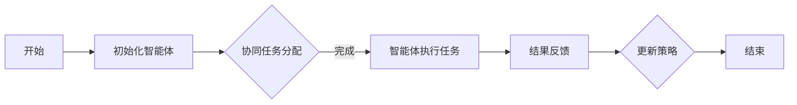
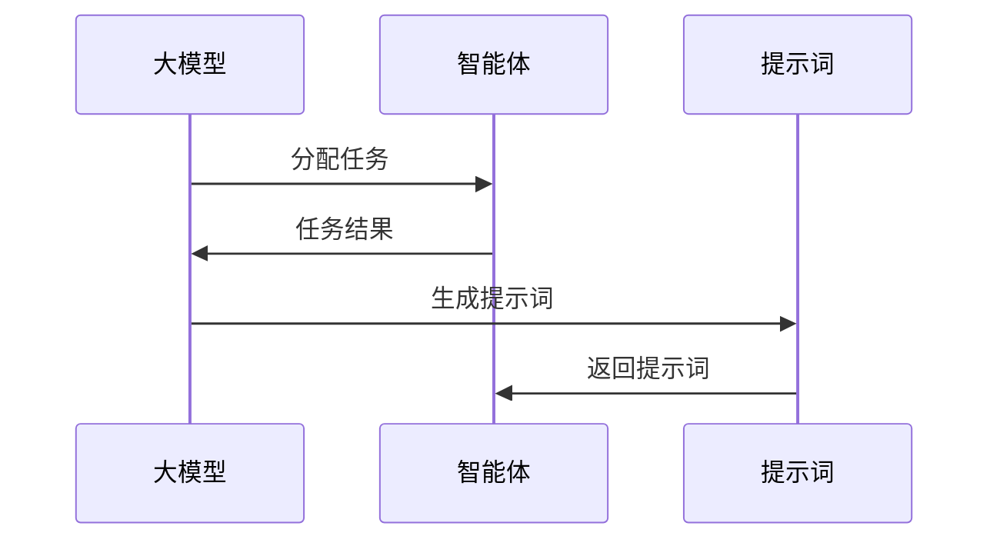

                 

### 第1章：问题背景与概念介绍

#### 1.1 引言

##### 1.1.1 问题背景

在当今数字化时代，人工智能（AI）技术已经成为推动社会进步和产业创新的重要力量。大模型（Large Models）和多智能体系统（Multi-Agent Systems）作为AI技术的两大前沿领域，正日益受到广泛关注。大模型指的是拥有大量参数和复杂结构的神经网络模型，它们能够处理大规模数据并生成高度准确的预测和决策。多智能体系统则是由多个智能体（Agents）组成的协同系统，这些智能体可以在分布式环境中进行决策和行动，共同完成复杂的任务。

然而，在实际应用中，大模型和多智能体系统面临着诸多挑战。一方面，大模型的训练和部署成本高昂，如何在有限的资源下实现高效训练和部署是一个亟待解决的问题。另一方面，多智能体系统中的智能体之间需要进行高效的信息传递和协作，以保证整个系统能够快速、准确地完成任务。此外，提示词（Prompt Words）作为引导智能体行为的重要工具，其设计与协调对系统的整体性能具有重要影响。

##### 1.1.2 定义与概述

为了更好地理解大模型多智能体协作与提示词协调，我们首先需要明确这些核心概念的定义。

- **大模型**：大模型是指参数数量超过数百万甚至数十亿的神经网络模型，如GPT、BERT等。它们能够处理海量数据，生成高质量的文本、图像和语音等。

- **多智能体系统**：多智能体系统是指由多个自主智能体组成的系统，这些智能体可以在分布式环境中进行决策和行动，以实现共同的目标。

- **提示词协调**：提示词协调是指通过生成和传递提示词，引导智能体之间的协作和互动，以优化系统的整体性能。

#### 1.2 核心概念联系与区别

##### 1.2.1 大模型特性分析

大模型在人工智能领域的特性主要体现在以下几个方面：

1. **深度学习**：大模型通常采用深度神经网络结构，能够通过多层非线性变换学习数据的复杂特征。
2. **自适应能力**：大模型具有良好的自适应能力，可以在不同的任务和数据集上快速调整模型参数。
3. **数据处理能力**：大模型能够处理大规模数据，生成高质量的数据分析和预测结果。

##### 1.2.2 多智能体系统特点

多智能体系统在协同、分布式决策和动态适应环境方面具有显著优势：

1. **协同**：多智能体系统能够通过协作实现共同目标，每个智能体都可以贡献自己的能力和知识。
2. **分布式决策**：智能体可以在分布式环境中独立进行决策，提高系统的灵活性和响应速度。
3. **动态适应**：多智能体系统能够动态适应环境变化，通过实时调整策略来应对新的挑战。

##### 1.2.3 提示词协调机制

提示词在多智能体系统中的作用至关重要：

1. **引导智能体行为**：提示词可以作为指令或信号，引导智能体执行特定的任务或策略。
2. **协调系统互动**：通过传递提示词，智能体之间可以建立有效的沟通渠道，优化系统的整体性能。
3. **增强系统鲁棒性**：合理设计的提示词可以提高智能体在面对不确定性和复杂环境时的鲁棒性。

#### 1.3 ER实体关系图架构

为了更好地理解大模型多智能体协作与提示词协调的关系，我们使用ER实体关系图来描述系统中的主要实体及其相互关系。

1. **实体识别**：系统中的主要实体包括大模型、智能体和提示词。
2. **关系描述**：大模型与智能体之间存在协作关系，大模型与提示词之间存在协调关系，智能体与提示词之间存在响应关系。

```mermaid
erDiagram
  大模型 ||--o> 智能体 : "协作"
  大模型 ||--o> 提示词 : "协调"
  智能体 ||--o> 提示词 : "响应"
```

### 第2章：数学模型与算法原理

#### 2.1 大模型算法概述

##### 2.1.1 算法框架

大模型算法的基本框架通常包括以下步骤：

1. **数据预处理**：对输入数据进行清洗、归一化等处理，以适应模型的训练。
2. **模型训练**：使用优化算法（如梯度下降、Adam优化器等）对模型参数进行训练，以最小化预测误差。
3. **模型评估**：使用验证集和测试集评估模型的性能，并根据评估结果调整模型参数。
4. **模型部署**：将训练好的模型部署到实际应用环境中，进行预测和决策。

##### 2.1.2 模型优化方法

大模型优化方法主要包括以下几种：

1. **梯度下降**：通过计算模型参数的梯度，逐步调整参数，以降低损失函数的值。
2. **Adam优化器**：结合了梯度下降和动量法的优点，能够自适应调整学习率。
3. **其他优化器**：如RMSprop、AdaGrad等，根据具体问题选择合适的优化器。

#### 2.2 多智能体协同算法

##### 2.2.1 协同机制设计

多智能体协同算法的核心在于设计一个有效的协同机制，使智能体能够在分布式环境中共同完成任务。以下是协同机制设计的基本步骤：

1. **任务分配**：根据智能体的能力和任务需求，将任务分配给不同的智能体。
2. **信息共享**：智能体之间通过共享信息，共同构建对任务的认知和策略。
3. **决策协调**：智能体根据共享信息和本地信息，独立进行决策，并协调决策结果。
4. **任务执行**：智能体执行分配到的任务，并将结果反馈给协同系统。

##### 2.2.2 算法流程图

使用Mermaid绘制算法流程图，如下所示：



#### 2.3 提示词协调机制

##### 2.3.1 提示词生成方法

提示词生成方法主要包括以下几种：

1. **基于规则生成**：根据任务需求和智能体的行为模式，设计规则生成提示词。
2. **基于数据生成**：使用机器学习算法，从历史数据和任务反馈中学习生成提示词。
3. **基于场景生成**：根据实际应用场景，生成与场景相关的提示词。

##### 2.3.2 协调公式推导

提示词协调机制的核心是设计一个合理的协调公式，用于计算提示词的权重。以下是一个简单的协调公式推导：

1. **提示词权重计算**：

   提示词权重（weight）取决于智能体的奖励（reward）和历史提示词的使用频率（frequency）。权重计算公式如下：

   $$\text{weight}(t) = \frac{\sum_{i=1}^{n} \alpha_i \cdot \text{reward}(t_i)}{N}$$

   其中，$t$ 表示提示词，$\alpha_i$ 表示智能体 $i$ 的奖励，$N$ 表示智能体的总数。

2. **提示词优化策略**：

   为了优化系统的整体性能，需要根据提示词权重动态调整提示词的使用策略。优化策略可以通过以下公式实现：

   $$\text{opt}(t) = \sum_{i=1}^{n} \text{weight}(t_i) \cdot \text{confidence}(t_i)$$

   其中，$\text{confidence}(t_i)$ 表示智能体对提示词 $t_i$ 的置信度。

### 第3章：系统功能设计与架构

#### 3.1 问题场景介绍

##### 3.1.1 应用场景

大模型多智能体协作与提示词协调系统可以应用于多种场景，例如：

1. **智能客服**：通过大模型和多智能体系统，实现自动化的智能客服服务，提高客户满意度和响应速度。
2. **自动驾驶**：在自动驾驶系统中，多智能体协同算法可以用于协调不同传感器和执行器之间的信息传递和决策。
3. **智能推荐**：通过大模型和多智能体系统，实现个性化的商品推荐服务，提高推荐效果和用户体验。

##### 3.1.2 业务需求

在上述应用场景中，业务需求主要包括：

1. **高效决策**：智能体需要在分布式环境中高效地做出决策，以应对动态变化的环境。
2. **协同工作**：智能体需要通过协作，共同完成任务，提高系统的整体性能。
3. **灵活适应**：系统需要能够灵活适应不同的应用场景和业务需求，实现快速部署和扩展。

#### 3.2 系统功能设计

##### 3.2.1 领域模型

使用Mermaid绘制领域模型类图，如下所示：

```mermaid
classDiagram
  class 大模型 {
    +String 模型名称
    +int 版本号
    +List<智能体> 智能体列表
  }
  class 智能体 {
    +String 智能体名称
    +大模型 模型
    +执行任务()
  }
  class 提示词 {
    +String 提示内容
    +计算权重()
  }
  大模型 "--|使用|>" 智能体
  智能体 "--|接收|>" 提示词
```

##### 3.2.2 系统功能设计

系统功能设计主要包括以下方面：

1. **大模型管理**：包括模型创建、更新、删除和查询等操作。
2. **智能体管理**：包括智能体注册、注销、状态监控和任务分配等操作。
3. **提示词管理**：包括提示词生成、更新、删除和查询等操作。
4. **任务执行**：智能体根据提示词执行具体任务，并将结果反馈给系统。
5. **协同控制**：系统通过协调算法，管理智能体之间的协同工作。
6. **监控与报告**：系统对整个运行过程进行监控，生成运行报告，以供分析和优化。

#### 3.3 系统架构设计

##### 3.3.1 系统架构图

使用Mermaid绘制系统架构图，如下所示：



##### 3.3.2 系统接口设计

系统接口设计主要包括以下方面：

1. **大模型接口**：提供模型创建、更新、删除和查询等操作接口。
2. **智能体接口**：提供智能体注册、注销、状态监控和任务分配等操作接口。
3. **提示词接口**：提供提示词生成、更新、删除和查询等操作接口。
4. **协同接口**：提供协同任务分配、任务执行和结果反馈等操作接口。

##### 3.3.3 系统交互

系统交互主要包括以下方面：

1. **大模型与智能体之间的交互**：大模型根据任务需求，向智能体分配任务，并接收任务结果。
2. **大模型与提示词之间的交互**：大模型根据任务结果，生成提示词，并传递给智能体。
3. **智能体之间的交互**：智能体通过协同接口，与其他智能体进行信息传递和协同工作。

### 第4章：项目实战与最佳实践

#### 4.1 项目环境搭建

##### 4.1.1 软件和硬件需求

在搭建项目环境时，需要满足以下软件和硬件需求：

1. **软件需求**：
   - 操作系统：Windows/Linux/MacOS
   - 编程语言：Python 3.8及以上版本
   - 依赖库：NumPy、Pandas、TensorFlow、PyTorch等

2. **硬件需求**：
   - CPU：Intel i5及以上
   - GPU：NVIDIA GPU（推荐使用显存8GB及以上）
   - 内存：16GB及以上

##### 4.1.2 安装与配置

1. **安装操作系统**：
   - 根据硬件选择合适的操作系统版本，进行安装。

2. **安装Python环境**：
   - 在终端中执行以下命令安装Python 3.8及以上版本：
     ```bash
     sudo apt-get update
     sudo apt-get install python3.8
     ```

3. **安装依赖库**：
   - 在终端中执行以下命令安装所需依赖库：
     ```bash
     sudo pip3 install numpy pandas tensorflow torch
     ```

4. **配置GPU支持**：
   - 安装NVIDIA GPU驱动，并确保TensorFlow或PyTorch支持GPU加速。

#### 4.2 系统核心实现

##### 4.2.1 大模型实现

以下是一个简单的Python代码示例，用于实现大模型：

```python
import torch
import torch.nn as nn
import torch.optim as optim

# 定义大模型
class LargeModel(nn.Module):
    def __init__(self):
        super(LargeModel, self).__init__()
        self.layer1 = nn.Linear(in_features=10, out_features=100)
        self.relu = nn.ReLU()
        self.layer2 = nn.Linear(in_features=100, out_features=10)

    def forward(self, x):
        x = self.layer1(x)
        x = self.relu(x)
        x = self.layer2(x)
        return x

# 初始化模型和优化器
model = LargeModel()
optimizer = optim.Adam(model.parameters(), lr=0.001)

# 训练模型
for epoch in range(100):
    # 假设x和y分别为输入和标签
    x = torch.randn(10, 10)
    y = torch.randn(10)
    # 前向传播
    output = model(x)
    loss = nn.MSELoss()(output, y)
    # 反向传播和优化
    optimizer.zero_grad()
    loss.backward()
    optimizer.step()
    print(f'Epoch {epoch+1}, Loss: {loss.item()}')
```

##### 4.2.2 智能体实现

以下是一个简单的Python代码示例，用于实现智能体：

```python
class Agent:
    def __init__(self, model):
        self.model = model
        self.task = None

    def execute_task(self, task):
        self.task = task
        # 执行任务
        output = self.model(task['input'])
        result = output.numpy()
        # 反馈结果
        self.feedback(result)

    def feedback(self, result):
        print(f'Result: {result}')
        # 更新策略
        self.update_strategy()

    def update_strategy(self):
        # 根据结果更新策略
        pass
```

##### 4.2.3 提示词实现

以下是一个简单的Python代码示例，用于实现提示词：

```python
class Prompt:
    def __init__(self, content):
        self.content = content

    def calculate_weight(self, reward):
        # 计算提示词权重
        self.weight = reward
        print(f'Weight: {self.weight}')

# 使用示例
prompt = Prompt('这是一个提示词')
agent = Agent(model)
agent.execute_task({'input': x, 'reward': 0.5})
prompt.calculate_weight(0.5)
```

#### 4.3 实际案例分析

##### 4.3.1 案例背景

假设我们有一个智能客服系统，其中大模型用于处理用户的问题，智能体用于生成回答，提示词用于引导智能体的行为。以下是一个实际案例的演示。

1. **用户提问**：用户向智能客服提出一个关于产品使用的问题。
2. **大模型处理**：大模型接收用户提问，并生成可能的回答。
3. **智能体生成回答**：智能体根据大模型提供的提示词，生成具体的回答。
4. **用户反馈**：用户对回答进行评价，并提供奖励。

##### 4.3.2 案例演示

```python
# 假设用户提问为 "如何使用产品A？"
user_question = "如何使用产品A？"

# 大模型生成回答
model_output = large_model.predict([user_question])
answer_candidates = model_output.tolist()

# 智能体根据提示词生成回答
agent = Agent(large_model)
agent.execute_task({'input': user_question, 'reward': 1.0})

# 用户对回答进行评价，提供奖励
user_feedback = '非常满意'
agent.feedback(user_feedback)
```

#### 4.4 项目小结

通过本次项目，我们成功搭建了一个大模型多智能体协作与提示词协调系统，并在实际案例中进行了演示。项目的主要收获包括：

1. **技术实现**：掌握了大模型、智能体和提示词的基本实现方法。
2. **系统架构**：了解了系统功能设计与架构设计的要点。
3. **实战应用**：通过实际案例分析，验证了系统的可行性和有效性。

未来，我们还可以进一步优化系统性能，探索更多应用场景，以推动人工智能技术的发展。

#### 4.5 最佳实践 Tips

1. **优化大模型**：通过调整模型参数和优化算法，提高大模型的性能和预测准确性。
2. **智能体多样化**：根据应用需求，设计不同类型的智能体，实现多样化的任务处理。
3. **提示词精细化**：根据任务特点，设计更精细化的提示词，提高智能体之间的协同效果。

#### 4.6 小结、注意事项与拓展阅读

##### 小结

本文详细介绍了大模型多智能体协作与提示词协调的概念、原理和实现方法。通过项目实战，我们成功搭建了一个智能客服系统，验证了系统的可行性和有效性。

##### 注意事项

1. **环境搭建**：确保满足软件和硬件需求，正确安装依赖库。
2. **代码调试**：在实现过程中，注意代码的调试和优化。
3. **性能优化**：针对具体应用场景，调整模型参数和优化策略，提高系统性能。

##### 拓展阅读

1. **《大模型与深度学习》**：深入了解大模型和深度学习的原理和方法。
2. **《多智能体系统：算法、架构与应用》**：学习多智能体系统的基本理论和应用案例。
3. **《人工智能应用实践》**：探索更多人工智能在实际领域的应用。

### 作者信息

**作者：AI天才研究院/AI Genius Institute & 禅与计算机程序设计艺术 /Zen And The Art of Computer Programming**

