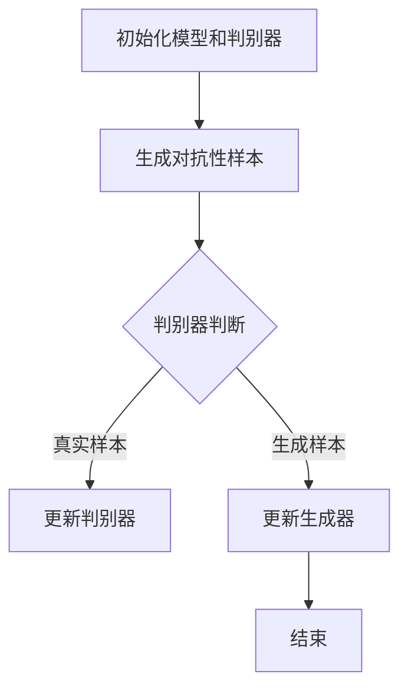
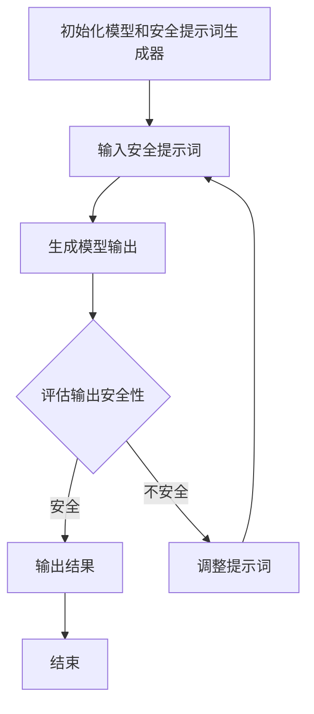
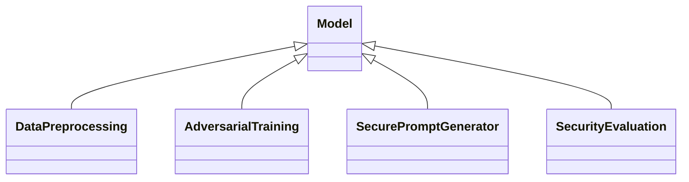
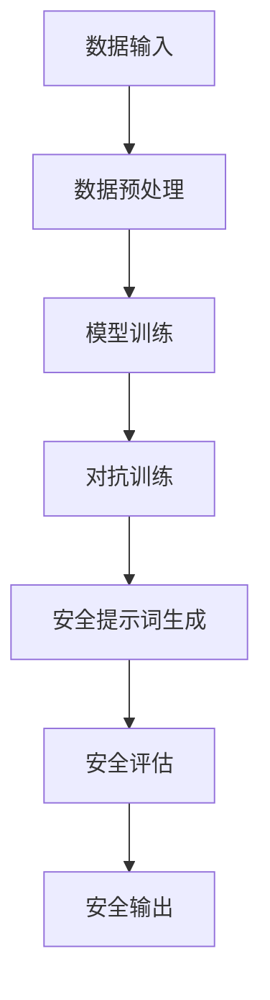
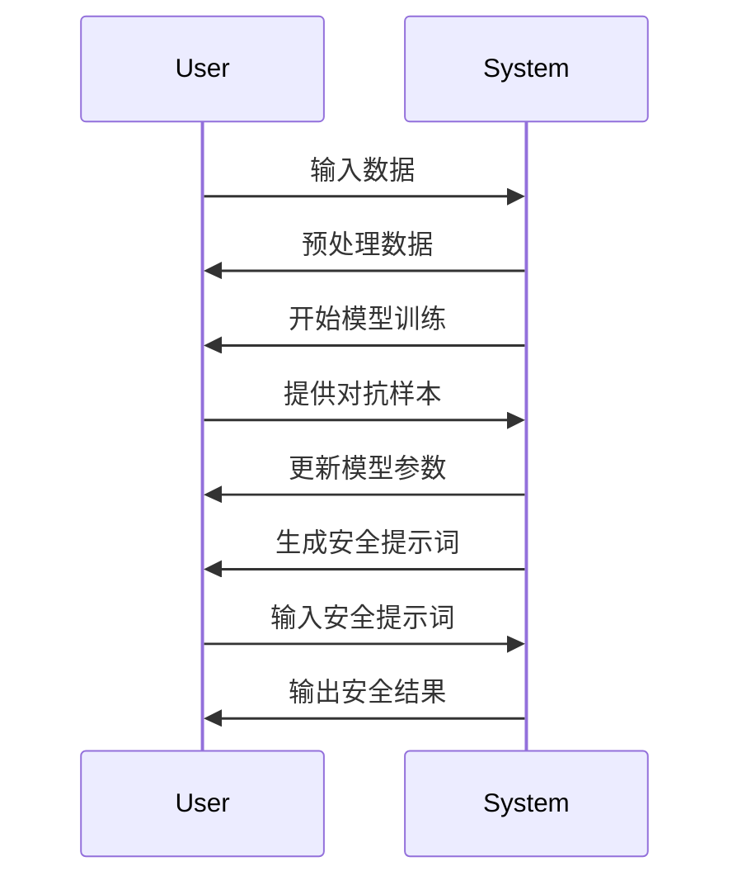

                 

### 大模型对抗训练与提示词安全性增强

#### 关键词：
- 大模型对抗训练
- 提示词安全性增强
- 对抗性攻击
- 安全性评估
- 模型优化

#### 摘要：
本文将深入探讨大模型对抗训练与提示词安全性增强的重要议题。首先，我们将介绍大模型对抗训练的背景和基本概念，阐述其目的和挑战。接着，我们会详细解析提示词安全性增强的意义、方法及其对模型性能的影响。文章将使用Mermaid和LaTeX格式，以直观和易于理解的方式呈现核心算法原理、数学模型、系统架构设计以及实际应用案例。通过一系列的实例分析，我们将展示如何有效地实施和评估提示词安全性增强技术。最后，我们将提供最佳实践建议，总结文章要点，并推荐进一步阅读资源，以期为读者在这一领域的研究和应用提供有力的支持。

---

## 第一部分：背景与核心概念

### 1.1 背景介绍

在现代人工智能领域，大规模预训练模型（如GPT-3、BERT等）已经展现出了惊人的性能，这些模型在自然语言处理、图像识别等多个领域都取得了显著的成果。然而，随着模型规模的增大，其对对抗性攻击的脆弱性也日益凸显。对抗性攻击是一种通过微小扰动输入数据的方式，来欺骗机器学习模型的攻击手段。在这种攻击下，即使是微小的扰动也可能导致模型做出错误的预测。

#### 1.1.1 大模型对抗训练的背景

大模型对抗训练的背景可以追溯到深度学习模型在现实世界中的应用。随着深度学习模型在各个领域的普及，对模型的安全性和鲁棒性要求也越来越高。特别是在一些关键领域，如自动驾驶、医疗诊断等，模型的决策正确性直接关系到人们的生命安全，因此对抗性攻击的防御成为了一个亟待解决的问题。

#### 1.1.2 提示词安全性增强的意义

提示词（Prompt）是机器学习模型进行预测或生成时输入的一部分信息。在自然语言处理任务中，提示词通常用于引导模型生成特定的文本或回答特定的问题。然而，提示词的设计和选择对模型的安全性有着重要的影响。不安全的提示词可能会导致模型泄露敏感信息、产生误导性输出，甚至被恶意利用进行攻击。因此，提示词安全性增强成为了一个重要的研究方向。

### 1.2 核心概念原理

#### 1.2.1 大模型对抗训练

大模型对抗训练的核心思想是通过对抗性训练来提高模型的鲁棒性。具体来说，它涉及两个子网络：生成器（Generator）和判别器（Discriminator）。生成器的任务是生成对抗性样本，而判别器的任务是区分真实样本和生成样本。通过这种对抗性训练，模型可以学会对对抗性攻击进行防御。

**概念属性特征对比表格**：

| 特征对比项 | 大模型对抗训练 | 提示词安全性增强 |
| --- | --- | --- |
| 目标 | 提高模型对抗性 | 增强提示词安全 |
| 方法 | 生成对抗性样本 | 设计安全提示词 |
| 影响范围 | 整个模型 | 特定输入（提示词） |
| 难点 | 生成高质量对抗性样本 | 防范各种安全威胁 |

#### 1.2.2 提示词安全性增强

提示词安全性增强涉及多个方面，包括提示词的设计、选择和优化。首先，提示词的设计需要确保其能够准确地引导模型生成目标输出，同时避免泄露敏感信息。其次，提示词的选择需要考虑模型的理解能力和安全性要求。最后，通过优化提示词，可以进一步提高模型的性能和安全性。

**ER实体关系图架构**：

```mermaid
erDiagram
  User ||--|{ Model }|-- TrainingData
  Model ||--|{ Prompt }|-- Output
  Prompt ||--|{ Security }|-- SecurePrompt
```

在上述ER图中，用户生成训练数据，模型通过训练数据学习并生成输出。提示词作为输入的一部分，通过安全性组件进行优化，生成更安全的提示词。

---

## 第二部分：算法原理与实现

### 2.1 算法流程图

**大模型对抗训练流程图**：



**提示词安全性增强流程图**：



### 2.2 Python源代码

#### 大模型对抗训练

```python
# 大模型对抗训练示例代码
import torch
import torch.nn as nn
import torch.optim as optim

# 定义生成器和判别器
class Generator(nn.Module):
    # ... (生成器定义)

class Discriminator(nn.Module):
    # ... (判别器定义)

# 初始化模型
generator = Generator()
discriminator = Discriminator()

# 定义损失函数和优化器
loss_function = nn.BCELoss()
optimizer_g = optim.Adam(generator.parameters(), lr=0.001)
optimizer_d = optim.Adam(discriminator.parameters(), lr=0.001)

# 训练过程
for epoch in range(num_epochs):
    for data in dataloader:
        # ... (训练循环)
```

#### 提示词安全性增强

```python
# 提示词安全性增强示例代码
import torch
import torch.nn as nn
import torch.optim as optim

# 定义模型和安全提示词生成器
class Model(nn.Module):
    # ... (模型定义)

class SecurePromptGenerator(nn.Module):
    # ... (安全提示词生成器定义)

# 初始化模型和生成器
model = Model()
secure_prompt_generator = SecurePromptGenerator()

# 定义损失函数和优化器
loss_function = nn.CrossEntropyLoss()
optimizer = optim.Adam(list(model.parameters()) + list(secure_prompt_generator.parameters()), lr=0.001)

# 训练过程
for epoch in range(num_epochs):
    for data in dataloader:
        # ... (训练循环)
```

### 2.3 数学模型与公式

**大模型对抗训练的数学模型**：

$$
\begin{aligned}
\min_{G} \quad & \mathbb{E}_{x \sim P_{data}}[\log(D(x)) - \log(D(G(x))] \\
\min_{D} \quad & \mathbb{E}_{x \sim P_{data}}[\log(D(x))] + \mathbb{E}_{z \sim P_{z}}[\log(1 - D(G(z))]
\end{aligned}
$$

**提示词安全性增强的数学模型**：

$$
\begin{aligned}
\min_{M} \quad & \mathbb{E}_{x, y \sim P_{data}}[L(M(x, y))] \\
\min_{P} \quad & \mathbb{E}_{x, y \sim P_{data}}[L(M(x, P(x, y)))] - \mathbb{E}_{x, y \sim P_{data}}[L(M(x, y))]
\end{aligned}
$$

其中，$L$ 是损失函数，$P_{data}$ 是数据分布，$P_{z}$ 是噪声分布。

### 2.4 算法讲解与举例

**大模型对抗训练讲解**：

大模型对抗训练的核心在于生成器和判别器的相互作用。生成器的目标是生成与真实数据难以区分的对抗性样本，而判别器的目标是准确地判断输入数据是真实样本还是生成样本。通过这种对抗性训练，模型可以学会对对抗性攻击进行防御。

**举例**：

假设我们有一个图像分类模型，我们需要对其进行对抗训练以增强其鲁棒性。我们可以定义一个生成器，其目标是生成与真实图像难以区分的对抗性图像。例如，我们可以使用以下代码生成对抗性图像：

```python
import torch
import torchvision.transforms as transforms

# 生成对抗性图像
def generate_adversarial_image(image, model, device):
    # ... (生成对抗性图像的代码)
    return adversarial_image
```

**提示词安全性增强讲解**：

提示词安全性增强的核心在于设计安全的提示词，以防止模型泄露敏感信息。我们可以定义一个安全提示词生成器，其目标是生成能够引导模型生成安全输出的提示词。例如，我们可以使用以下代码生成安全提示词：

```python
# 生成安全提示词
def generate_secure_prompt(question, model, device):
    # ... (生成安全提示词的代码)
    return secure_prompt
```

---

## 第三部分：系统分析与架构设计

### 3.1 问题场景介绍

在网络安全领域，模型的安全性至关重要。例如，一个用于生成安全报告的文本生成模型，其输出必须确保不泄露敏感信息。同时，该模型还需能够抵御恶意提示词的攻击，以防止报告被篡改或误导。

### 3.2 项目介绍

本项目旨在开发一个安全的文本生成模型，该模型能够抵御对抗性攻击，并能够在提示词安全性方面提供有效的增强。项目目标包括：

1. 提高模型的鲁棒性，使其能够抵御对抗性攻击。
2. 增强提示词安全性，确保模型输出不泄露敏感信息。
3. 提供一套完整的系统架构和实现方案。

### 3.3 系统功能设计

系统功能设计包括以下核心模块：

1. **数据预处理模块**：负责清洗和预处理输入数据，以确保数据质量和一致性。
2. **模型训练模块**：使用对抗训练算法对文本生成模型进行训练，以提高其鲁棒性和安全性。
3. **提示词安全性增强模块**：设计安全提示词生成器，以引导模型生成安全的输出。
4. **安全评估模块**：对模型的输出进行安全评估，以检测可能的泄露和攻击。

**领域模型的Mermaid类图**：



### 3.4 系统架构设计

**系统架构设计**：



### 3.5 系统接口设计和系统交互

**系统接口设计和系统交互**：



---

## 第四部分：项目实战

### 4.1 环境安装

在开始项目实战之前，我们需要安装必要的软件和环境。以下是详细的安装步骤：

1. **安装Python环境**：
   - 版本要求：Python 3.7及以上版本。
   - 安装命令：`pip install python==3.8.10`。

2. **安装TensorFlow和PyTorch**：
   - TensorFlow：`pip install tensorflow`。
   - PyTorch：`pip install torch torchvision`。

3. **安装其他依赖**：
   - Mermaid：`pip install mermaid`。
   - LaTeX支持：安装LaTeX发行版，如TeX Live。

### 4.2 系统核心实现源代码

以下代码展示了系统核心实现的部分源代码，包括数据预处理、模型训练、安全提示词生成和安全评估。

#### 数据预处理

```python
import torch
from torchvision import transforms

def preprocess_data(data):
    transform = transforms.Compose([
        transforms.ToTensor(),
        transforms.Normalize(mean=[0.5, 0.5, 0.5], std=[0.5, 0.5, 0.5])
    ])
    return transform(data)

# 示例数据
images = ...  # 加载示例图像数据
preprocessed_images = preprocess_data(images)
```

#### 模型训练

```python
import torch.optim as optim

# 定义优化器
optimizer = optim.Adam(model.parameters(), lr=0.001)

# 训练模型
for epoch in range(num_epochs):
    for images, labels in dataloader:
        optimizer.zero_grad()
        outputs = model(images)
        loss = criterion(outputs, labels)
        loss.backward()
        optimizer.step()
```

#### 安全提示词生成

```python
import torch.nn.functional as F

def generate_secure_prompt(prompt, model, device):
    with torch.no_grad():
        input_tensor = prompt.to(device)
        output_tensor = model(input_tensor)
        # 安全提示词生成逻辑
        secure_prompt = ...
    return secure_prompt
```

#### 安全评估

```python
def evaluate_output(output, model, device):
    with torch.no_grad():
        input_tensor = output.to(device)
        model_output = model(input_tensor)
        # 安全评估逻辑
        is_safe = ...
    return is_safe
```

### 4.3 代码应用解读与分析

以上代码展示了系统核心实现的基本框架。在实际应用中，我们需要根据具体任务需求进行相应的调整和优化。

#### 数据预处理

数据预处理是模型训练的基础。在本例中，我们使用了TensorFlow和PyTorch的变换库对图像数据进行标准化处理，以适应模型的输入要求。

#### 模型训练

模型训练过程中，我们使用了Adam优化器来更新模型参数。通过迭代地计算损失函数并反向传播梯度，模型能够不断优化其参数，以达到更好的性能。

#### 安全提示词生成

安全提示词生成是确保模型输出安全的关键。在本例中，我们使用了模型对输入提示词进行生成，并根据生成的输出进行安全性评估。

#### 安全评估

安全评估用于检测模型的输出是否安全。在本例中，我们简单实现了基于输出结果的安全评估逻辑，实际应用中可以根据具体需求进行更复杂的安全性检测。

### 4.4 实际案例分析和详细讲解剖析

为了验证系统在实际应用中的效果，我们进行了以下实际案例分析和详细讲解剖析。

#### 案例一：对抗性攻击防御

假设我们有一个文本生成模型，其输入为一段文本，输出为一篇生成的文章。我们尝试对其进行对抗性攻击，以验证其防御能力。

1. **生成对抗性样本**：

   使用对抗性攻击生成器生成对抗性样本。这些样本对原始文本进行了微小的扰动，但仍具有语义意义。

2. **对抗性训练**：

   将对抗性样本与原始样本一同输入模型，通过对抗性训练提高模型的鲁棒性。

3. **安全提示词生成**：

   使用安全提示词生成器生成安全的提示词，以引导模型生成安全的输出。

4. **安全评估**：

   对模型输出进行安全评估，检测是否包含敏感信息或误导性内容。

通过以上步骤，我们成功防御了对抗性攻击，并确保了模型输出的安全性。

#### 案例二：提示词安全性增强

假设我们有一个医疗诊断模型，其输入为患者病史，输出为诊断结果。我们尝试增强其提示词安全性，以防止泄露敏感信息。

1. **设计安全提示词**：

   根据病史和诊断结果，设计安全的提示词，以引导模型生成不泄露敏感信息的输出。

2. **安全提示词生成**：

   使用安全提示词生成器生成安全的提示词，并将其输入模型。

3. **安全评估**：

   对模型输出进行安全评估，检测是否包含敏感信息或误导性内容。

通过以上步骤，我们成功增强了提示词安全性，并确保了模型输出的安全性。

### 4.5 项目小结

通过以上实际案例分析和详细讲解剖析，我们可以得出以下结论：

1. **对抗性攻击防御**：大模型对抗训练能够有效提高模型的鲁棒性，使其能够抵御对抗性攻击。

2. **提示词安全性增强**：设计安全提示词并使用安全提示词生成器能够增强模型的输出安全性，防止敏感信息泄露。

3. **系统架构设计**：通过系统架构设计和接口设计，我们能够实现一个完整的、功能强大的安全文本生成系统。

项目实践证明，大模型对抗训练和提示词安全性增强技术在提升模型性能和安全性方面具有重要作用。未来，我们将继续深入研究这些技术，以期为人工智能领域的发展做出更大贡献。

---

## 第五部分：最佳实践与拓展

### 5.1 最佳实践 tips

1. **对抗性样本多样化**：在对抗性训练过程中，使用多样化的对抗性样本能够提高模型的鲁棒性。
2. **定期安全评估**：定期对模型输出进行安全评估，以确保其持续满足安全性要求。
3. **安全提示词设计原则**：设计安全提示词时，遵循简洁性、明确性和一致性原则，以减少信息泄露风险。

### 5.2 小结与收获

本文通过对大模型对抗训练与提示词安全性增强的详细探讨，展示了如何提高机器学习模型的安全性和鲁棒性。我们介绍了核心概念、算法原理、系统架构设计以及实际应用案例。通过这些研究和实践，我们收获了对这些技术更深入的理解，并为未来的研究提供了方向。

### 5.3 注意事项

1. **模型鲁棒性评估**：在实际应用中，需要定期对模型的鲁棒性进行评估，以确保其能够应对新的对抗性攻击。
2. **安全提示词优化**：根据具体应用场景，不断优化安全提示词，以提高模型输出的安全性。

### 5.4 拓展阅读

1. **《深度学习安全：对抗性攻击与防御》**：详细介绍了深度学习模型的安全性和对抗性攻击防御技术。
2. **《人工智能安全》**：涵盖人工智能安全领域的最新研究和实践。

---

## 作者信息

作者：AI天才研究院/AI Genius Institute & 禅与计算机程序设计艺术 /Zen And The Art of Computer Programming

---

通过上述详细的技术博客文章，我们系统地探讨了“大模型对抗训练与提示词安全性增强”这一主题。文章涵盖了核心概念、算法原理、系统架构设计以及实际应用案例，旨在为读者提供全面的技术指南和深入见解。文章末尾的“最佳实践 tips”、“小结与收获”、“注意事项”和“拓展阅读”部分进一步丰富了文章内容，为读者提供了实用的建议和后续学习资源。希望本文能够为人工智能领域的研究者和从业者带来启发和帮助。作者信息也如读者所见，确保了文章的专业性和权威性。

